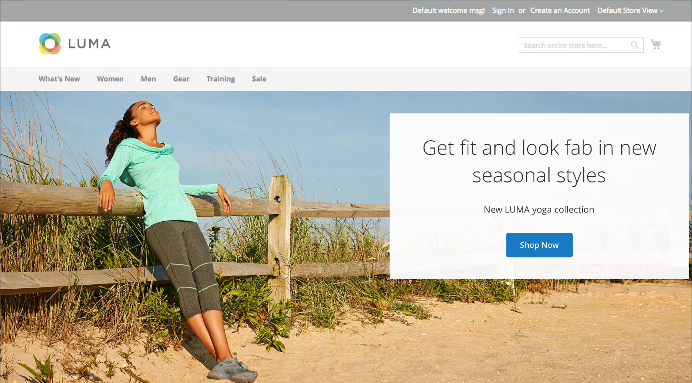
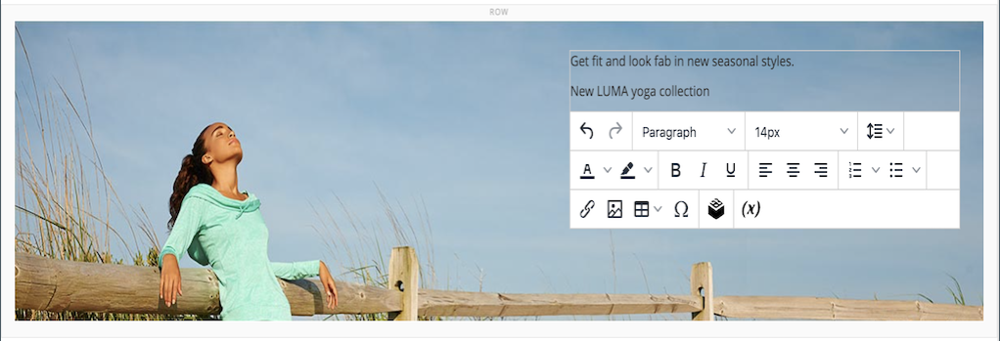

# Media - banner

Gebruik het _inhoudstype van de Banner_ om een geïllustreerde, interactieve component toe te voegen die gebruikers met een call to action en knoop in het [[!DNL Page Builder]  stadium ](workspace.md#stage) in dienst neemt.

>[!NOTE]
>
>Wat eerder de _optie van de Banner_ in het menu van de Inhoud was, is nu [ Dynamisch Blok ](../content-design/dynamic-blocks.md).

{width="700" zoomable="yes"}

{{$include /help/_includes/page-builder-save-timeout.md}}

## Banner, gereedschapset

De bannergereedschapset wordt weergegeven wanneer u de muisaanwijzer op de bannercontainer plaatst.

{width="600" zoomable="yes"}

| Gereedschap | Pictogram | Beschrijving |
|--- |--- |--- |
| Verplaatsen | {width="25"} | Hiermee verplaatst u de banner naar een andere positie in het werkgebied. |
| (label) | Banner | Identificeert de huidige inhoudscontainer als een banner. Houd de muisaanwijzer boven de container om de gereedschapset weer te geven. |
| Instellingen | {width="25"} | Hiermee opent u de pagina Banner bewerken, waarin u de eigenschappen van de banner en container kunt wijzigen. |
| Verbergen | {width="25"} | Hiermee verbergt u de huidige banner. |
| Tonen | {width="25"} | Toont de verborgen banner. |
| Dupliceren | {width="25"} | Maakt een kopie van de banner. |
| Verwijderen | {width="25"} | Hiermee verwijdert u de banner uit het werkgebied. |
| [!UICONTROL Upload New Image] |  | Uploadt een afbeelding van uw lokale bestandssysteem naar de galerie voor de bannerachtergrond. |
| [!UICONTROL Select from Gallery] |  | Hiermee gebruikt u een bestaande afbeelding uit de galerie voor de bannerachtergrond. |

{style="table-layout:auto"}

{{$include /help/_includes/page-builder-hidden-element-note.md}}

## Een banner toevoegen

1. Vouw [!DNL Page Builder] uit in het deelvenster **[!UICONTROL Media]** en sleep een tijdelijke aanduiding **[!UICONTROL Banner]** naar het werkgebied.

   {width="600" zoomable="yes"}

   De knoppen _[!UICONTROL Upload Image]_&#x200B;en&#x200B;_[!UICONTROL Select from Gallery]_ zijn opgenomen zodat u de bannerinhoud direct vanuit het werkgebied kunt wijzigen. U kunt ook de inhoud op de _[!UICONTROL Edit Banner]_-pagina wijzigen.

1. Klik in bannerplaceholder om de [ tekstredacteur ](../content-design/editor.md) te tonen en inhoud voor de banner in te gaan.

   U kunt complexere bannerinhoud ook omvatten gebruikend de [ montages van de Inhoud ](#content).

## Banningsinstellingen wijzigen

1. Beweeg over de bannercontainer om toolbox te tonen en de _Montages_ te kiezen ().

1. Gebruik de volgende secties voor gedetailleerde informatie over het bijwerken van de beschikbare montages:

   - [[!UICONTROL Appearance]](#appearance)
   - [[!UICONTROL Content]](#content)
   - [[!UICONTROL Background]](#background)
   - [[!UICONTROL Advanced]](#advanced)

1. Wanneer u klaar bent, klikt u op **[!UICONTROL Save]** in de rechterbovenhoek om de pagina _[!UICONTROL Edit Banner]_&#x200B;te sluiten.

1. Klik in de rechterbovenhoek op **[!UICONTROL Save]** om de instellingen toe te passen en terug te keren naar de werkruimte van [!DNL Page Builder] .

## [!UICONTROL Appearance]

Banners kunnen eenvoudig worden ingesteld en onderhouden, omdat ze zijn gebaseerd op een van vier vooraf gedefinieerde sjablonen.

- Kies een van de volgende typen bannerplaatsing:

  | Plaatsing | Beschrijving |
  | --------- | ----------- |
  | [!UICONTROL Poster] | Hiermee centreert u de inhoud en de knop op de banner. Als de bedekking wordt gebruikt, wordt de volledige breedte van de banner uitgebreid. |
  | [!UICONTROL Collage Left] | Hiermee plaatst u de inhoud en de knop in een bepaald gebied aan de linkerkant van de banner. De bedekking dekt, indien gebruikt, alleen het gedefinieerde gebied. |
  | [!UICONTROL Collage Center] | Hiermee plaatst u de inhoud en de knop in een gedefinieerd gebied dat op de banner is gecentreerd. De bedekking dekt, indien gebruikt, alleen het gedefinieerde gebied. |
  | [!UICONTROL Collage Right] | Hiermee plaatst u de inhoud en de knop in een gedefinieerd gebied aan de rechterkant van de banner. De bedekking dekt, indien gebruikt, alleen het gedefinieerde gebied. |

  {style="table-layout:auto"}

  {width="600" zoomable="yes"}

- (Optioneel) Voer de **[!UICONTROL Minimum Height]** in voor de rij.

  De minimumhoogte kan een getal zijn met elke geldige CSS-eenheid (zoals `100px` , `50%` , `50em` , `100vh` ) of een berekening (zoals `100vh - 237px` ).

  U kunt bijvoorbeeld de minimumhoogte van een banner instellen om de volledige hoogte van de pagina te vergroten, zodat u aantrekkelijke opties hebt voor achtergrondafbeeldingen en video&#39;s van volledige pagina.

## [!UICONTROL Background]

Er zijn veel opties voor het definiëren van de achtergrondweergave van een banner. U kunt een eenvoudige kleur- of achtergrondafbeelding toepassen en geavanceerde effecten beheren.

### [!UICONTROL Background Color]

Geef de achtergrondkleur op door een staal te kiezen, op de kleurkiezer te klikken of door een geldige kleurnaam of een gelijkwaardige hexadecimale waarde in te voeren. Deze instelling bepaalt de achtergrondkleur van de rij. U kunt ook de dekking van de kleur aanpassen.

{width="200"}

U kunt de waarde op drie manieren instellen:

- Een vooraf gedefinieerde kleurnaam, zoals `White`
- De hexadecimale kleurwaarde voor de kleur, zoals `#ffffff`
- De RGB-waarde voor de kleur, met een dekkingspercentage, zoals `rgba(255, 255, 255, 0.75)`

Als u een kleur wilt kiezen, klik het monster links van _Geen doos van de Kleur_.

{width="600" zoomable="yes"}

Als u nogmaals op het kleurvak klikt om de kleurkiezer te openen, worden in het vak onder de schuifregelaar de huidige waarden voor rood, groen, blauw en alpha (rgba) weergegeven. Het laatste getal geeft het huidige dekkingspercentage aan als een decimaal. U kunt de schuifregelaar gebruiken om de dekking aan te passen of de gewenste decimale waarde invoeren.

{width="600" zoomable="yes"}

>[!NOTE]
>
>[!DNL Page Builder] steunt ook een transparantielaag, of _alpha- kanaal_, in achtergrondbeelden die kunnen worden gebruikt om achtergronden met variërende graden van opaciteit tot stand te brengen.

### [!UICONTROL Background Type]

Een achtergrondtype kan een afbeelding of video zijn. [!DNL Page Builder] is standaard ingesteld op `Image` en geeft verschillende afbeeldingsinstellingen weer. Als u `Video` selecteert, vervangt [!DNL Page Builder] de afbeeldingsinstellingen door video-instellingen. Beide instellingen voor achtergrondtypen worden in de volgende secties beschreven.

{width="200"}

### Instellingen voor afbeeldingstypen

Als u het _Type van Achtergrond_ aan `Image` plaatst, gebruik de volgende montages om de vertoning van het achtergrondbeeld te bepalen.

{width="600" zoomable="yes"}

- **[!UICONTROL Background Image]** - Kies zo nodig met de beschikbare gereedschappen een achtergrondafbeelding die u op de banner wilt toepassen:

  | Gereedschap | Beschrijving |
  | ---- | ----------- |
  | [!UICONTROL Upload] | Uploadt een afbeeldingsbestand van uw lokale computer naar de galerie en past het vervolgens toe als de achtergrondafbeelding voor de banner. |
  | [!UICONTROL Select from Gallery] | Hiermee wordt u gevraagd een bestaande afbeelding in de galerie te kiezen als achtergrondafbeelding voor de banner. |
  | {width="25"} | Hiermee kunt u de afbeelding naar de tegel van de camera slepen of naar de afbeelding in uw lokale bestandssysteem bladeren. |

  {style="table-layout:auto"}

- **[!UICONTROL Background Mobile Image]** - Gebruik indien nodig dezelfde gereedschappen om een andere achtergrondafbeelding te kiezen die u wilt gebruiken voor weergave op mobiele apparaten.

- **[!UICONTROL Background Size]** - Stel deze optie in om te bepalen hoe de achtergrondafbeelding wordt geschaald ten opzichte van de breedte van de banner:

  | Optie | Beschrijving |
  | ------ | ----------- |
  | `Cover` | De achtergrondafbeelding bedekt de volledige breedte van de banner. |
  | `Contain` | De achtergrondafbeelding is beperkt tot de breedte van het inhoudsgebied. |
  | `Auto` | Hiermee past u de grootte van het huidige stijlblad toe. |

  {style="table-layout:auto"}

  {width="200"}

- **[!UICONTROL Background Position]** - Stel deze optie in om te bepalen hoe de achtergrondafbeelding ten opzichte van de banner wordt verankerd:

  | Anker | Posities |
  | ------ | ----------- |
  | `Top` | Links/midden/rechts |
  | `Center` | Links/midden/rechts |
  | `Bottom` | Links/midden/rechts |

  {style="table-layout:auto"}

  Het ankerpunt is als een drukknop die de afbeelding op de opgegeven achtergrondpositie aan de banner koppelt.

- **[!UICONTROL Background Attachment]** - Stel het type bijlage in om te bepalen hoe de achtergrondafbeelding ten opzichte van de schuifpagina wordt verplaatst:

  | Optie | Beschrijving |
  | ------ | ----------- |
  | `Scroll` | De bijgevoegde achtergrondafbeelding wordt gesynchroniseerd zodat deze omlaag wordt verplaatst wanneer de pagina wordt verschoven. |
  | `Fixed` | (Niet beschikbaar voor mobiele apparaten) De achtergrondafbeelding wordt niet verplaatst wanneer de container over de afbeelding schuift en op de opgegeven achtergrondpositie wordt vastgezet. |

  {style="table-layout:auto"}

- **[!UICONTROL Background Repeat]** - Als u de achtergrondafbeelding wilt herhalen om de ruimte te vullen, wijzigt u deze instelling `Yes` .

### Instellingen voor videotypen

Als u de _[!UICONTROL Background Type]_&#x200B;op `Video` instelt, gebruikt u de volgende instellingen om de weergave van de achtergrondafbeelding te definiëren.

- **[!UICONTROL Video URL]** - Voer een geldige video-URL in. Geldige video-URL&#39;s kunnen koppelingen zijn naar:

   - YouTube-video&#39;s: `https://youtu.be/CoDhMRUUjeI`
   - Vimeo-video&#39;s: `https://vimeo.com/190156113`
   - Geldige videobestanden (`.mp4` wordt aanbevolen): `https://myvideos.com/spiral.mp4`

  {width="200"}

- **[!UICONTROL Overlay Color]** - Selecteer een kleur om een transparante tint toe te passen op de video.

- **[!UICONTROL Infinite Loop]** - Ingesteld op `No` om de video eenmaal af te spelen en te stoppen. Wanneer deze is ingesteld op `Yes` (standaardwaarde), wordt de video in een oneindige lus herhaald.

- **[!UICONTROL Lazy Load]** - Ingesteld op `No` om de video met de pagina te laden, zelfs als deze niet zichtbaar is. Wanneer deze is ingesteld op `Yes` (standaardwaarde), wordt de video alleen uit de bron geladen wanneer deze zichtbaar is op het scherm.

- **[!UICONTROL Play Only When Visible]** - Ingesteld op `No` om het afspelen van de video direct te starten nadat deze is geladen, ongeacht of deze zichtbaar is. Wanneer deze is ingesteld op `Yes` (standaardwaarde), wordt de video alleen afgespeeld wanneer deze zichtbaar is.

- **[!UICONTROL Fallback Image]** - Geef indien nodig een afbeelding op die op het scherm moet worden weergegeven voordat de video wordt geladen en als de video om welke reden dan ook niet wordt geladen.

## [!UICONTROL Content]

U kunt de bannerinhoud rechtstreeks in het werkgebied wijzigen of wanneer u de instellingen wijzigt. De instellingen bieden complexere inhoudseigenschappen, zoals bannerkoppelingen en -knoppen, en overlays. De positie van de inhoud wijst op de [ Verschijning ](#appearance) plaatsing die.

### Eenvoudige inhoud in het werkgebied

1. Klik op de tekst van de tijdelijke aanduiding en voer de tekst in die u op de banner wilt weergeven.

   De editor-werkbalk wordt boven het tekstvak weergegeven.

   {width="600" zoomable="yes"} uit

1. Gebruik de editor-werkbalk om tekst in te voeren en op te maken, en om elementen in te voegen, zoals koppelingen, afbeeldingen en widgets.

   {width="600" zoomable="yes"}

### Complexe inhoud in de instellingen

1. Beweeg over de bannercontainer om toolbox te tonen en de _pictogram van Montages_ te kiezen ( {width="25"}).

1. Blader omlaag naar de sectie _[!UICONTROL Content]_&#x200B;en gebruik de editor **[!UICONTROL Message Text]**&#x200B;om bannertekst in te voeren en op te maken.

   U kunt ook elementen invoegen, zoals tekstkoppelingen, afbeeldingen en widgets.

   {width="600" zoomable="yes"}

1. Geef indien nodig een **[!UICONTROL Link]** voor de banner op.

   De koppeling is de doelpagina die wordt weergegeven wanneer de klant op de bannerknop of het gebied klikt. U kunt een van de volgende drie typen koppelingen gebruiken:

   - **[!UICONTROL URL]** - Koppelingen naar een relatieve of volledig gekwalificeerde URL.
   - **[!UICONTROL Product]** - Identificeert de bestemmingspagina die op de productnaam of SKU wordt gebaseerd. Zoek het product op naam die op of een gedeeltelijke of volledige naam wordt gebaseerd. Kies het product in de lijst met zoekresultaten.
   - **[!UICONTROL Category]** - Hiermee wordt de doelpagina geïdentificeerd als een specifieke categorie of subcategorie in de categoriestructuur. Zoek de categorie op basis van een gedeeltelijke of volledige naam. Kies de categorie in het uitgebreide gedeelte van de weergegeven structuur.
   - **[!UICONTROL Page]** - Hiermee wordt de doelpagina geïdentificeerd als een specifieke inhoudspagina. Zoeken naar de pagina op basis van een gedeeltelijke of volledige naam. Kies de pagina in de lijst met zoekresultaten.

   >[!NOTE]
   >
   >Vanaf versie 2.4.1 ondersteunt [!DNL Page Builder] geen koppeling meer tussen de banner en koppelingen in de geneste tekst vanwege problemen met de weergave op de winkel. Als u een koppeling gebruikt in de _[!UICONTROL Message Text]_, kunt u de optie&#x200B;_[!UICONTROL Link]_ niet configureren. Als u verkiest één enkele verbinding voor de volledige banner te gebruiken, kunt u alle verbindingen uit de tekst verwijderen. 
   >
   >{width="200"}

1. Voeg zo nodig een knop toe om klanten te vragen de koppeling te volgen.

   Met de instelling Weergave banner wordt één koppeling of knop onder de tekst geplaatst. Vul de eigenschappen in van de koppeling of knop die u wilt toevoegen.

   {width="600" zoomable="yes"}

   >[!NOTE]
   >
   >U kunt veelvoudige knopen of verbindingen ook gebruiken door a [ blok ](block.md) aan de banner toe te voegen. U voorkomt conflicten door alle koppelingen of knoppen in het aparte blok te houden en geen koppeling of knop rechtstreeks aan de banner toe te voegen.

   - Stel **[!UICONTROL Show Button]** in op een van de volgende opties:

     | Optie | Beschrijving |
     | ------ | ----------- |
     | `Always` | Er verschijnt altijd een knop op de banner. |
     | `On Hover` | Een knop wordt alleen op de muisaanwijzer op de banner weergegeven. |
     | `Never Show` | Er verschijnt nooit een knop op de banner. |

     {style="table-layout:auto"}

   - Voer de **[!UICONTROL Button Text]** in die op de knop moet worden weergegeven.

   - Stel **[!UICONTROL Button Type]** in op een van de volgende opties:

     | Optie | Beschrijving |
     | ------ | ----------- |
     | `Primary` | Past de primaire knoopstijl van het huidige stijlblad toe. |
     | `Secondary` | Past de secundaire knoopstijl van het huidige stijlblad toe, indien van toepassing. |
     | `Link` | Maakt een hyperlink in plaats van een knop. |

     {style="table-layout:auto"}

     De knopstijl van het huidige thema bepaalt de knopindeling. Een primaire knop heeft doorgaans een prominentere achtergrondkleur dan een secundaire knop.

1. Stel **[!UICONTROL Show Overlay]** in op een van de volgende opties:

   | Optie | Beschrijving |
   | ------ | ----------- |
   | `Always` | De bedekking is altijd zichtbaar. |
   | `On Hover` | De bedekking wordt alleen weergegeven bij aanwijzen. |
   | `Never Show` | De bedekking is niet zichtbaar. |

   {style="table-layout:auto"}

   Met een bedekking kunt u een achtergrondkleur toepassen op het actieve inhoudsgebied dat wordt gedefinieerd door de instelling [!UICONTROL Appearance] . De bannerachtergrondafbeelding blijft zichtbaar voor de volledige breedte van de banner.

   Als u een bedekking wilt weergeven, stelt u de optie **[!UICONTROL Overlay Color]** in:

   - Klik het **Geen Monster van de Kleur**, en kies een monster.
   - Op het **Geen gebied van de Kleur**, of ga een geldige kleurennaam, of hexadecimale waarde in.

   {width="600" zoomable="yes"}

1. Klik in de rechterbovenhoek op **[!UICONTROL Save]** om de instellingen toe te passen en terug te keren naar de werkruimte van [!DNL Page Builder] .

   {width="600" zoomable="yes"}

## [!UICONTROL Search Engine Optimization] {#seo}

Tekst voor deze instellingen is zichtbaar voor zoekprogramma&#39;s en verbetert de manier waarop de pagina wordt geïndexeerd.

- Voor **[!UICONTROL Alternative Text]**, ga een _alt_ tekstbeschrijving voor digitale toegankelijkheidshulpmiddelen in om te tonen.

  Het gebruik van alt-tekst is een beste praktijk op het gebied van toegankelijkheid en wordt in sommige landinstellingen wettelijk voorgeschreven. In HTML is het kenmerk `alt` een subset van de tag `image` tag: `<image title="tooltip" alt="description" src="image.jpg">` .

- Voer bij **[!UICONTROL Title Attribute]** de tekst in die als knopinfo bij mouseover moet worden weergegeven.

  U kunt het beste een beschrijvende titel met veel trefwoorden kiezen om de manier waarop de afbeelding wordt geïndexeerd door zoekprogramma&#39;s te verbeteren. In HTML is het kenmerk `title` een subset van de tag `image` tag: `<image title="tooltip" alt="description" src="image.jpg">` .

## [!UICONTROL Advanced]

1. Kies een **[!UICONTROL Alignment]** als u de horizontale plaatsing wilt bepalen van inhoudscontainers die aan de banner worden toegevoegd:

   | Optie | Beschrijving |
   | ------ | ----------- |
   | `Default` | Hiermee past u de standaardinstelling voor uitlijning toe die is opgegeven in het stijlblad van het huidige thema. |
   | `Left` | Hiermee lijnt u de inhoudscontainers uit langs de linkerrand van de bannercontainer, waarbij rekening wordt gehouden met de opgegeven opvulling. |
   | `Center` | Hiermee lijnt u de inhoudscontainer uit in het midden van de bannercontainer, waarbij rekening wordt gehouden met de opgegeven opvulling. |
   | `Right` | Hiermee lijnt u de inhoudscontainer uit langs de rechterrand van de bannercontainer, waarbij rekening wordt gehouden met de opgegeven opvulling. |

   {style="table-layout:auto"}

1. Stel de stijl **[!UICONTROL Border]** in die op alle vier zijden van de bannercontainer wordt toegepast:

   | Optie | Beschrijving |
   | ------ | ----------- |
   | `Default` | Past de standaardrandstijl toe die door het bijbehorende stijlblad wordt gespecificeerd. |
   | `None` | Geeft geen zichtbare indicatie van de containerranden. |
   | `Dotted` | De containerrand wordt weergegeven als een stippellijn. |
   | `Dashed` | De containerrand wordt weergegeven als een onderbroken lijn. |
   | `Solid` | De containerrand wordt weergegeven als een effen lijn. |
   | `Double` | De containerrand wordt weergegeven als een dubbele lijn. |
   | `Groove` | De containerrand wordt weergegeven als een gegroefde lijn. |
   | `Ridge` | De containerrand wordt weergegeven als een afgeronde lijn. |
   | `Inset` | De containerrand wordt weergegeven als een inzetlijn. |
   | `Outset` | De containerrand wordt weergegeven als een omtreklijn. |

   {style="table-layout:auto"}

1. Als u een andere randstijl dan `None` instelt, voert u de weergaveopties voor de rand in:

   - **[!UICONTROL Border Color]** - Geef de kleur op door een staal te kiezen, op de kleurkiezer te klikken of door een geldige kleurnaam of een gelijkwaardige hexadecimale waarde in te voeren.

     {width="600" zoomable="yes"}

   - **[!UICONTROL Border Width]** - Voer het aantal pixels in voor de lijnbreedte van de rand.

   - **[!UICONTROL Border Radius]** - Voer het aantal pixels in waarmee de grootte van de straal die wordt gebruikt om elke hoek van de rand te afronden, wordt gedefinieerd.

1. (Optioneel) Geef de namen van **[!UICONTROL CSS classes]** op uit het huidige stijlblad dat u wilt toepassen op de bannercontainer.

   Scheid meerdere klassennamen met een spatie.

1. Voer in pixels waarden in voor de **[!UICONTROL Margins and Padding]** om de buitenste marges en de binnenopvulling van de banner op te geven.

   Voer elke corresponderende waarde in het diagram van de bannercontainer in.

   | Optie | Beschrijving |
   | ------ | ----------- |
   | [!UICONTROL Margins] | De hoeveelheid lege ruimte die wordt toegepast op de buitenrand van alle zijden van de container. |
   | [!UICONTROL Padding] | De hoeveelheid lege ruimte die wordt toegepast op de binnenrand van alle zijden van de container. |

   {style="table-layout:auto"}

<!-- Last updated from includes: 2023-09-11 14:30:19 -->
