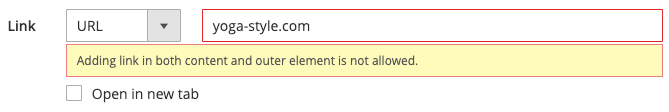
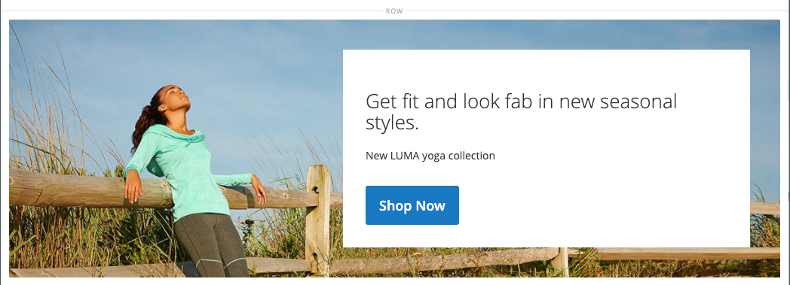

# Media - banner

Gebruik de _Banner_ inhoudstype om een geïllustreerde, interactieve component toe te voegen die gebruikers met een vraag aan actie en knoop in [[!DNL Page Builder] stadium](workspace.md#stage).

>[!NOTE]
>
>Wat voorheen _Banner_ in het menu Inhoud, is nu [Dynamisch blok](../content-design/dynamic-blocks.md).

{width="700" zoomable="yes"}

{{$include /help/_includes/page-builder-save-timeout.md}}

## Banner, gereedschapset

De bannergereedschapset wordt weergegeven wanneer u de muisaanwijzer op de bannercontainer plaatst.

{width="600" zoomable="yes"}

| Gereedschap | Pictogram | Beschrijving |
|--- |--- |--- |
| Verplaatsen | {width="25"} | Hiermee verplaatst u de banner naar een andere positie in het werkgebied. |
| (label) | Banner | Identificeert de huidige inhoudscontainer als een banner. Houd de muisaanwijzer boven de container om de gereedschapset weer te geven. |
| Instellingen | {width="25"} | Hiermee opent u de pagina Banner bewerken, waarin u de eigenschappen van de banner en container kunt wijzigen. |
| Verbergen | {width="25"} | Hiermee verbergt u de huidige banner. |
| Tonen | {width="25"} | Toont de verborgen banner. |
| Dupliceren | {width="25"} | Maakt een kopie van de banner. |
| Verwijderen | {width="25"} | Hiermee verwijdert u de banner uit het werkgebied. |
| [!UICONTROL Upload New Image] |  | Uploadt een afbeelding van uw lokale bestandssysteem naar de galerie voor de bannerachtergrond. |
| [!UICONTROL Select from Gallery] |  | Hiermee gebruikt u een bestaande afbeelding uit de galerie voor de bannerachtergrond. |

{style="table-layout:auto"}

{{$include /help/_includes/page-builder-hidden-element-note.md}}

## Een banner toevoegen

1. In de [!DNL Page Builder] deelvenster, uitvouwen **[!UICONTROL Media]** en sleep een **[!UICONTROL Banner]** tijdelijke aanduiding naar het werkgebied.

   {width="600" zoomable="yes"}

   De _[!UICONTROL Upload Image]_en_[!UICONTROL Select from Gallery]_ De knoppen zijn opgenomen zodat u de bannerinhoud rechtstreeks vanuit het werkgebied snel kunt wijzigen. U kunt de inhoud ook wijzigen op de _[!UICONTROL Edit Banner]_pagina.

1. Klik in de plaatsaanduiding voor de banner om de [teksteditor](../content-design/editor.md) en voer inhoud voor de banner in.

   U kunt ook complexere bannerinhoud opnemen met de opdracht [Inhoud](#content) instellingen.

## Banningsinstellingen wijzigen

1. Houd de muisaanwijzer boven de bannercontainer om de gereedschapset weer te geven en kies de optie _Instellingen_ ().

1. Gebruik de volgende secties voor gedetailleerde informatie over het bijwerken van de beschikbare montages:

   - [[!UICONTROL Appearance]](#appearance)
   - [[!UICONTROL Content]](#content)
   - [[!UICONTROL Background]](#background)
   - [[!UICONTROL Advanced]](#advanced)

1. Klik op **[!UICONTROL Save]** in de rechterbovenhoek om het dialoogvenster _[!UICONTROL Edit Banner]_pagina.

1. Klik in de rechterbovenhoek op **[!UICONTROL Save]** om de instellingen toe te passen en terug te keren naar de [!DNL Page Builder] werkruimte.

## [!UICONTROL Appearance]

Banners kunnen eenvoudig worden ingesteld en onderhouden, omdat ze zijn gebaseerd op een van vier vooraf gedefinieerde sjablonen.

- Kies een van de volgende typen bannerplaatsing:

  | Plaatsing | Beschrijving |
  | --------- | ----------- |
  | [!UICONTROL Poster] | Hiermee centreert u de inhoud en de knop op de banner. Als de bedekking wordt gebruikt, wordt de volledige breedte van de banner uitgebreid. |
  | [!UICONTROL Collage Left] | Hiermee plaatst u de inhoud en de knop in een bepaald gebied aan de linkerkant van de banner. De bedekking dekt, indien gebruikt, alleen het gedefinieerde gebied. |
  | [!UICONTROL Collage Center] | Hiermee plaatst u de inhoud en de knop in een gedefinieerd gebied dat op de banner is gecentreerd. De bedekking dekt, indien gebruikt, alleen het gedefinieerde gebied. |
  | [!UICONTROL Collage Right] | Hiermee plaatst u de inhoud en de knop in een gedefinieerd gebied aan de rechterkant van de banner. De bedekking dekt, indien gebruikt, alleen het gedefinieerde gebied. |

  {style="table-layout:auto"}

  {width="600" zoomable="yes"}

- (Optioneel) Voer de **[!UICONTROL Minimum Height]** voor de rij.

  De minimumhoogte kan een getal zijn met elke geldige CSS-eenheid (zoals `100px`, `50%`, `50em`, `100vh`) of een berekening (zoals `100vh - 237px`).

  U kunt bijvoorbeeld de minimumhoogte van een banner instellen om de volledige hoogte van de pagina te vergroten, zodat u aantrekkelijke opties hebt voor achtergrondafbeeldingen en video&#39;s van volledige pagina.

## [!UICONTROL Background]

Er zijn veel opties voor het definiëren van de achtergrondweergave van een banner. U kunt een eenvoudige kleur- of achtergrondafbeelding toepassen en geavanceerde effecten beheren.

### [!UICONTROL Background Color]

Geef de achtergrondkleur op door een staal te kiezen, op de kleurkiezer te klikken of door een geldige kleurnaam of een gelijkwaardige hexadecimale waarde in te voeren. Deze instelling bepaalt de achtergrondkleur van de rij. U kunt ook de dekking van de kleur aanpassen.

{width="200"}

U kunt de waarde op drie manieren instellen:

- Een vooraf gedefinieerde kleurnaam, zoals `White`
- De hexadecimale kleurwaarde voor de kleur, zoals `#ffffff`
- De RGB-waarde voor de kleur, met een dekkingspercentage, zoals `rgba(255, 255, 255, 0.75)`

Als u een kleur wilt kiezen, klikt u op het staal links van het dialoogvenster _Geen kleur_ doos.

{width="600" zoomable="yes"}

Als u nogmaals op het kleurvak klikt om de kleurkiezer te openen, worden in het vak onder de schuifregelaar de huidige waarden voor rood, groen, blauw en alpha (rgba) weergegeven. Het laatste getal geeft het huidige dekkingspercentage aan als een decimaal. U kunt de schuifregelaar gebruiken om de dekking aan te passen of de gewenste decimale waarde invoeren.

{width="600" zoomable="yes"}

>[!NOTE]
>
>[!DNL Page Builder] ook een transparantielaag ondersteunt, of _alfakanaal_ in achtergrondafbeeldingen die kunnen worden gebruikt om achtergronden met verschillende dekkingsgraden te maken.

### [!UICONTROL Background Type]

Een achtergrondtype kan een afbeelding of video zijn. [!DNL Page Builder] standaardinstellingen `Image` en worden verschillende afbeeldingsinstellingen weergegeven. Als u `Video`, [!DNL Page Builder] Hiermee vervangt u de afbeeldingsinstellingen door video-instellingen. Beide instellingen voor achtergrondtypen worden in de volgende secties beschreven.

{width="200"}

### Instellingen voor afbeeldingstypen

Als u de _Achtergrondtype_ tot `Image`gebruikt u de volgende instellingen om de weergave van de achtergrondafbeelding te definiëren.

{width="600" zoomable="yes"}

- **[!UICONTROL Background Image]** - Kies zo nodig met de beschikbare gereedschappen een achtergrondafbeelding die u op de banner wilt toepassen:

  | Gereedschap | Beschrijving |
  | ---- | ----------- |
  | [!UICONTROL Upload] | Uploadt een afbeeldingsbestand van uw lokale computer naar de galerie en past het vervolgens toe als de achtergrondafbeelding voor de banner. |
  | [!UICONTROL Select from Gallery] | Hiermee wordt u gevraagd een bestaande afbeelding in de galerie te kiezen als achtergrondafbeelding voor de banner. |
  | {width="25"} | Hiermee kunt u de afbeelding naar de tegel van de camera slepen of naar de afbeelding in uw lokale bestandssysteem bladeren. |

  {style="table-layout:auto"}

- **[!UICONTROL Background Mobile Image]** - Gebruik indien nodig dezelfde gereedschappen om een andere achtergrondafbeelding te kiezen die u wilt gebruiken voor weergave op mobiele apparaten.

- **[!UICONTROL Background Size]** - Stel deze optie in om te bepalen hoe de achtergrondafbeelding wordt geschaald ten opzichte van de breedte van de banner:

  | Optie | Beschrijving |
  | ------ | ----------- |
  | `Cover` | De achtergrondafbeelding bedekt de volledige breedte van de banner. |
  | `Contain` | De achtergrondafbeelding is beperkt tot de breedte van het inhoudsgebied. |
  | `Auto` | Hiermee past u de grootte van het huidige stijlblad toe. |

  {style="table-layout:auto"}

  {width="200"}

- **[!UICONTROL Background Position]** - Stel deze optie in om te bepalen hoe de achtergrondafbeelding wordt verankerd ten opzichte van de banner:

  | Anker | Posities |
  | ------ | ----------- |
  | `Top` | Links/midden/rechts |
  | `Center` | Links/midden/rechts |
  | `Bottom` | Links/midden/rechts |

  {style="table-layout:auto"}

  Het ankerpunt is als een drukknop die de afbeelding op de opgegeven achtergrondpositie aan de banner koppelt.

- **[!UICONTROL Background Attachment]** - Stel het type bijlage in om te bepalen hoe de achtergrondafbeelding ten opzichte van de schuifpagina wordt verplaatst:

  | Optie | Beschrijving |
  | ------ | ----------- |
  | `Scroll` | De bijgevoegde achtergrondafbeelding wordt gesynchroniseerd zodat deze omlaag wordt verplaatst wanneer de pagina wordt verschoven. |
  | `Fixed` | (Niet beschikbaar voor mobiele apparaten) De achtergrondafbeelding wordt niet verplaatst wanneer de container over de afbeelding schuift en op de opgegeven achtergrondpositie wordt vastgezet. |

  {style="table-layout:auto"}

- **[!UICONTROL Background Repeat]** - Als u de achtergrondafbeelding wilt herhalen om de ruimte te vullen, wijzigt u deze instelling `Yes`.

### Instellingen voor videotypen

Als u de _[!UICONTROL Background Type]_tot `Video`gebruikt u de volgende instellingen om de weergave van de achtergrondafbeelding te definiëren.

- **[!UICONTROL Video URL]** - Voer een geldige video-URL in. Geldige video-URL&#39;s kunnen koppelingen zijn naar:

   - YouTube-video&#39;s: `https://youtu.be/CoDhMRUUjeI`
   - Vimeo-video&#39;s: `https://vimeo.com/190156113`
   - Geldige videobestanden (`.mp4` wordt aanbevolen): `https://myvideos.com/spiral.mp4`

  {width="200"}

- **[!UICONTROL Overlay Color]** - Selecteer een kleur om een transparante tint toe te passen op de video.

- **[!UICONTROL Infinite Loop]** - Instellen op `No` om de video eenmaal af te spelen en te stoppen. Wanneer deze is ingesteld op `Yes` (standaard), wordt de video herhaald in een oneindige lus.

- **[!UICONTROL Lazy Load]** - Instellen op `No` om de video met de pagina te laden, zelfs als deze niet zichtbaar is. Wanneer deze is ingesteld op `Yes` (standaard), wordt de video alleen uit de bron geladen wanneer deze op het scherm wordt weergegeven.

- **[!UICONTROL Play Only When Visible]** - Instellen op `No` om ervoor te zorgen dat de video direct wordt afgespeeld nadat deze is geladen, ongeacht of deze zichtbaar is. Wanneer deze is ingesteld op `Yes` (standaard) wordt het afspelen van de video alleen gestart wanneer deze zichtbaar is.

- **[!UICONTROL Fallback Image]** - Geef indien nodig een afbeelding op die op het scherm moet worden weergegeven voordat de video wordt geladen en als de video om een of andere reden niet wordt geladen.

## [!UICONTROL Content]

U kunt de bannerinhoud rechtstreeks in het werkgebied wijzigen of wanneer u de instellingen wijzigt. De instellingen bieden complexere inhoudseigenschappen, zoals bannerkoppelingen en -knoppen, en overlays. De positie van de inhoud weerspiegelt de [Weergave](#appearance) plaatsingsinstelling.

### Eenvoudige inhoud in het werkgebied

1. Klik op de tekst van de tijdelijke aanduiding en voer de tekst in die u op de banner wilt weergeven.

   De editor-werkbalk wordt boven het tekstvak weergegeven.

   {width="600" zoomable="yes"}

1. Gebruik de editor-werkbalk om tekst in te voeren en op te maken, en om elementen in te voegen, zoals koppelingen, afbeeldingen en widgets.

   {width="600" zoomable="yes"}

### Complexe inhoud in de instellingen

1. Houd de muisaanwijzer boven de bannercontainer om de gereedschapset weer te geven en kies de optie _Instellingen_ ( {width="25"} ).

1. Omlaag schuiven naar de _[!UICONTROL Content]_en de **[!UICONTROL Message Text]**editor om bannertekst in te voeren en op te maken.

   U kunt ook elementen invoegen, zoals tekstkoppelingen, afbeeldingen en widgets.

   {width="600" zoomable="yes"}

1. Geef indien nodig een **[!UICONTROL Link]** voor de banner.

   De koppeling is de doelpagina die wordt weergegeven wanneer de klant op de bannerknop of het gebied klikt. U kunt een van de volgende drie typen koppelingen gebruiken:

   - **[!UICONTROL URL]** - Koppelingen naar een relatieve of volledig gekwalificeerde URL.
   - **[!UICONTROL Product]** - Identificeert de bestemmingspagina die op de productnaam of SKU wordt gebaseerd. Zoek het product op naam die op of een gedeeltelijke of volledige naam wordt gebaseerd. Kies het product in de lijst met zoekresultaten.
   - **[!UICONTROL Category]** - Hiermee wordt de doelpagina geïdentificeerd als een specifieke categorie of subcategorie in de categoriestructuur. Zoek de categorie op basis van een gedeeltelijke of volledige naam. Kies de categorie in het uitgebreide gedeelte van de weergegeven structuur.
   - **[!UICONTROL Page]** - Identificeert de doelpagina als een specifieke inhoudspagina. Zoeken naar de pagina op basis van een gedeeltelijke of volledige naam. Kies de pagina in de lijst met zoekresultaten.

   >[!NOTE]
   >
   >Vanaf de release van 2.4.1, [!DNL Page Builder] biedt geen ondersteuning meer voor het koppelen van de banner en koppelingen in de geneste tekst vanwege problemen met de weergave op de winkelachtergrond. Als u een koppeling gebruikt in het dialoogvenster _[!UICONTROL Message Text]_kunt u de_[!UICONTROL Link]_ -optie. Als u liever één koppeling voor de gehele banner gebruikt, kunt u alle koppelingen uit de tekst verwijderen. 
   >
   >{width="200"}

1. Voeg zo nodig een knop toe om klanten te vragen de koppeling te volgen.

   Met de instelling Weergave banner wordt één koppeling of knop onder de tekst geplaatst. Vul de eigenschappen in van de koppeling of knop die u wilt toevoegen.

   {width="600" zoomable="yes"}

   >[!NOTE]
   >
   >U kunt ook meerdere knoppen of koppelingen gebruiken door een [blok](block.md) op de banner. U voorkomt conflicten door alle koppelingen of knoppen in het aparte blok te houden en geen koppeling of knop rechtstreeks aan de banner toe te voegen.

   - Set **[!UICONTROL Show Button]** op een van de volgende wijzen:

     | Optie | Beschrijving |
     | ------ | ----------- |
     | `Always` | Er verschijnt altijd een knop op de banner. |
     | `On Hover` | Een knop wordt alleen op de muisaanwijzer op de banner weergegeven. |
     | `Never Show` | Er verschijnt nooit een knop op de banner. |

     {style="table-layout:auto"}

   - Voer de **[!UICONTROL Button Text]** om op de knop te worden weergegeven.

   - Set **[!UICONTROL Button Type]** op een van de volgende wijzen:

     | Optie | Beschrijving |
     | ------ | ----------- |
     | `Primary` | Past de primaire knoopstijl van het huidige stijlblad toe. |
     | `Secondary` | Past de secundaire knoopstijl van het huidige stijlblad toe, indien van toepassing. |
     | `Link` | Maakt een hyperlink in plaats van een knop. |

     {style="table-layout:auto"}

     De knopstijl van het huidige thema bepaalt de knopindeling. Een primaire knop heeft doorgaans een prominentere achtergrondkleur dan een secundaire knop.

1. Set **[!UICONTROL Show Overlay]** op een van de volgende wijzen:

   | Optie | Beschrijving |
   | ------ | ----------- |
   | `Always` | De bedekking is altijd zichtbaar. |
   | `On Hover` | De bedekking wordt alleen weergegeven bij aanwijzen. |
   | `Never Show` | De bedekking is niet zichtbaar. |

   {style="table-layout:auto"}

   U kunt een bedekking gebruiken om een achtergrondkleur toe te passen op het actieve inhoudsgebied dat door [!UICONTROL Appearance] instellen. De bannerachtergrondafbeelding blijft zichtbaar voor de volledige breedte van de banner.

   Als u een bedekking wilt weergeven, stelt u de optie **[!UICONTROL Overlay Color]**:

   - Klik op de knop **Geen kleur** en kies een staal.
   - In de **Geen kleur** in. Voer een geldige kleurnaam of een hexadecimale waarde in.

   {width="600" zoomable="yes"}

1. Klik in de rechterbovenhoek op **[!UICONTROL Save]** om de instellingen toe te passen en terug te keren naar de [!DNL Page Builder] werkruimte.

   {width="600" zoomable="yes"}

## [!UICONTROL Search Engine Optimization] {#seo}

Tekst voor deze instellingen is zichtbaar voor zoekprogramma&#39;s en verbetert de manier waarop de pagina wordt geïndexeerd.

- Voor **[!UICONTROL Alternative Text]**, voert u een _alt_ tekstbeschrijving voor gereedschappen voor digitale toegankelijkheid die moeten worden weergegeven.

  Het gebruik van alt-tekst is een beste praktijk op het gebied van toegankelijkheid en wordt in sommige landinstellingen wettelijk voorgeschreven. In HTML, `alt` kenmerk is een subset van het `image` tag: `<image title="tooltip" alt="description" src="image.jpg">`.

- Voor **[!UICONTROL Title Attribute]**, voert u de tekst in die u als knopinfo wilt weergeven bij de muisaanwijzer.

  U kunt het beste een beschrijvende titel met veel trefwoorden kiezen om de manier waarop de afbeelding wordt geïndexeerd door zoekprogramma&#39;s te verbeteren. In HTML, `title` kenmerk is een subset van het `image` tag: `<image title="tooltip" alt="description" src="image.jpg">`.

## [!UICONTROL Advanced]

1. Als u de horizontale plaatsing van inhoudscontainers wilt bepalen die aan de banner worden toegevoegd, kiest u een **[!UICONTROL Alignment]**:

   | Optie | Beschrijving |
   | ------ | ----------- |
   | `Default` | Hiermee past u de standaardinstelling voor uitlijning toe die is opgegeven in het stijlblad van het huidige thema. |
   | `Left` | Hiermee lijnt u de inhoudscontainers uit langs de linkerrand van de bannercontainer, waarbij rekening wordt gehouden met de opgegeven opvulling. |
   | `Center` | Hiermee lijnt u de inhoudscontainer uit in het midden van de bannercontainer, waarbij rekening wordt gehouden met de opgegeven opvulling. |
   | `Right` | Hiermee lijnt u de inhoudscontainer uit langs de rechterrand van de bannercontainer, waarbij rekening wordt gehouden met de opgegeven opvulling. |

   {style="table-layout:auto"}

1. Stel de **[!UICONTROL Border]** stijl toegepast op alle vier zijden van de bannercontainer:

   | Optie | Beschrijving |
   | ------ | ----------- |
   | `Default` | Past de standaardrandstijl toe die door het bijbehorende stijlblad wordt gespecificeerd. |
   | `None` | Geeft geen zichtbare indicatie van de containerranden. |
   | `Dotted` | De containerrand wordt weergegeven als een stippellijn. |
   | `Dashed` | De containerrand wordt weergegeven als een onderbroken lijn. |
   | `Solid` | De containerrand wordt weergegeven als een effen lijn. |
   | `Double` | De containerrand wordt weergegeven als een dubbele lijn. |
   | `Groove` | De containerrand wordt weergegeven als een gegroefde lijn. |
   | `Ridge` | De containerrand wordt weergegeven als een afgeronde lijn. |
   | `Inset` | De containerrand wordt weergegeven als een inzetlijn. |
   | `Outset` | De containerrand wordt weergegeven als een omtreklijn. |

   {style="table-layout:auto"}

1. Als u een andere randstijl dan `None`, vult u de weergaveopties voor de rand in:

   - **[!UICONTROL Border Color]** - Geef de kleur op door een staal te kiezen, op de kleurkiezer te klikken of door een geldige kleurnaam of een gelijkwaardige hexadecimale waarde in te voeren.

     {width="600" zoomable="yes"}

   - **[!UICONTROL Border Width]** - Voer het aantal pixels in voor de lijnbreedte van de rand.

   - **[!UICONTROL Border Radius]** - Voer het aantal pixels in waarmee de grootte van de straal die wordt gebruikt om elke hoek van de rand te afronden, wordt gedefinieerd.

1. (Optioneel) Geef de namen op van **[!UICONTROL CSS classes]** van het huidige stijlblad toe te passen op de bannercontainer.

   Scheid meerdere klassennamen met een spatie.

1. Voer in pixels waarden in voor de **[!UICONTROL Margins and Padding]** om de buitenmarges en de binnenopvulling van de banner op te geven.

   Voer elke corresponderende waarde in het diagram van de bannercontainer in.

   | Optie | Beschrijving |
   | ------ | ----------- |
   | [!UICONTROL Margins] | De hoeveelheid lege ruimte die wordt toegepast op de buitenrand van alle zijden van de container. |
   | [!UICONTROL Padding] | De hoeveelheid lege ruimte die wordt toegepast op de binnenrand van alle zijden van de container. |

   {style="table-layout:auto"}
