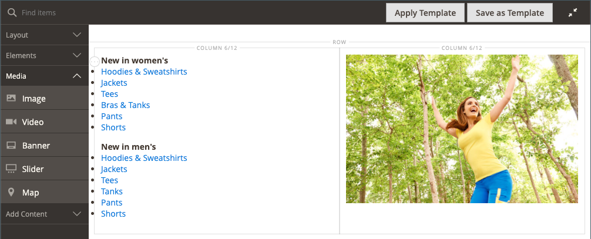
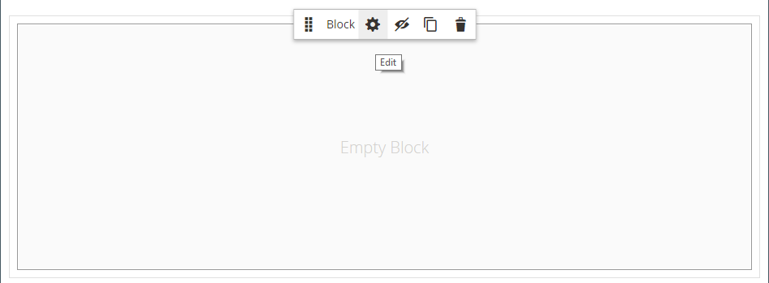

# Inhoud toevoegen - Blokkeren

Gebruik de _Blok_ inhoudstype om een bestaand, actief [blok](../content-design/blocks.md) aan de [[!DNL Page Builder] stadium](workspace.md#stage). In het volgende voorbeeld bevat de eerste kolom het blok met een zijmenu voor de pagina. De tweede kolom bevat een afbeelding.

{width="600" zoomable="yes"}

{{$include /help/_includes/page-builder-save-timeout.md}}

## Gereedschap Blok

| Gereedschap | Pictogram | Beschrijving |
| --------- | -------- | ------------- |
| Verplaatsen |  | Verplaatst de blokcontainer en de inhoud ervan naar een andere positie in het werkgebied. |
| Instellingen |  | Hiermee opent u de pagina Blok bewerken, waarin u het blok kunt kiezen en de eigenschappen van de container kunt wijzigen. |
| Verbergen |  | Hiermee verbergt u de huidige blokcontainer en de inhoud ervan. |
| Tonen |  | Toont de verborgen blokcontainer en de inhoud ervan. |
| Dupliceren |  | Hiermee maakt u een kopie van de blokcontainer en de inhoud ervan. |
| Verwijderen |  | Verwijdert de blokcontainer en de inhoud ervan uit het werkgebied. |

{style="table-layout:auto"}

{{$include /help/_includes/page-builder-hidden-element-note.md}}

## Een bestaand blok toevoegen

1. Ga naar de [!DNL Page Builder] op de doelpagina, het blok, het dynamische blok, het product, of de categorie.

1. In de [!DNL Page Builder] deelvenster, uitvouwen **[!UICONTROL Add Content]** en sleep een **[!UICONTROL Block]** tijdelijke aanduiding naar het werkgebied.

   {width="600" zoomable="yes"}

1. Houd de muisaanwijzer boven de lege blokcontainer om de gereedschapset weer te geven en kies de optie _Instellingen_ ( {width="25"} ).

1. Klik op **[!UICONTROL Select Block]**.

   {width="200"}

1. Klik in de rij van het blok dat u wilt toevoegen op **[!UICONTROL Select]** in de laatste kolom.

   {width="600" zoomable="yes"}

   De naam van het geselecteerde blok verschijnt op de pagina.

   {width="200"}

1. Vul de overige instellingen naar wens in en gebruik de veldbeschrijvingen aan het einde van deze pagina ter referentie.

1. Klik op **[!UICONTROL Save]** om de instellingen toe te passen en terug te keren naar de [!DNL Page Builder] werkruimte.

### Geavanceerde instellingen

1. Als u de plaatsing van het blok in de bovenliggende container wilt bepalen, kiest u een **[!UICONTROL Alignment]**:

   | Optie | Beschrijving |
   | ------ | ----------- |
   | `Default` | Hiermee past u de standaardinstelling voor uitlijning toe die is opgegeven in het stijlblad van het huidige thema. |
   | `Left` | Hiermee lijnt u de lijst uit langs de linkerrand van de bovenliggende container, waarbij rekening wordt gehouden met de opgegeven opvulling. |
   | `Center` | Hiermee lijnt u de lijst in het midden van de bovenliggende container uit, rekening houdend met de opgegeven opvulling. |
   | `Right` | Hiermee lijnt u het blok uit langs de rechterrand van de bovenliggende container, waarbij rekening wordt gehouden met de opgegeven opvulling. |

   {style="table-layout:auto"}

1. Een **[!UICONTROL Border]** stijl die wordt toegepast op alle vier zijden van de blokcontainer:

   | Optie | Beschrijving |
   | ------ | ----------- |
   | `Default` | Past de standaardrandstijl toe die door het bijbehorende stijlblad wordt gespecificeerd. |
   | `None` | Geeft geen zichtbare indicatie van de containerranden. |
   | `Dotted` | De containerrand wordt weergegeven als een stippellijn. |
   | `Dashed` | De containerrand wordt weergegeven als een onderbroken lijn. |
   | `Solid` | De containerrand wordt weergegeven als een effen lijn. |
   | `Double` | De containerrand wordt weergegeven als een dubbele lijn. |
   | `Groove` | De containerrand wordt weergegeven als een gegroefde lijn. |
   | `Ridge` | De containerrand wordt weergegeven als een afgeronde lijn. |
   | `Inset` | De containerrand wordt weergegeven als een inzetlijn. |
   | `Outset` | De containerrand wordt weergegeven als een omtreklijn. |

   {style="table-layout:auto"}

1. Als u een andere randstijl dan `None`, vult u de weergaveopties voor de rand in:

   | Optie | Beschrijving |
   | ------ |------------ |
   | [!UICONTROL Border Color] | Geef de kleur op door een staal te kiezen, op de kleurkiezer te klikken of door een geldige kleurnaam of een gelijkwaardige hexadecimale waarde in te voeren. |
   | [!UICONTROL Border Width] | Voer het aantal pixels in voor de lijnbreedte van de rand. |
   | [!UICONTROL Border Radius] | Voer het aantal pixels in om de grootte te bepalen van de straal die wordt gebruikt om elke hoek van de rand te afronden. |

   {style="table-layout:auto"}

1. (Optioneel) Geef de namen op van **[!UICONTROL CSS classes]** in het huidige stijlblad toe te passen op de container.

   Scheid meerdere klassennamen met een spatie.

1. Voer in pixels waarden in voor de **[!UICONTROL Margins and Padding]** om de buitenste marges en de binnenopvulling van de blokcontainer te bepalen.

   Voer de overeenkomende waarden in het diagram in.

   | Containergebied | Beschrijving |
   | -------------- | ----------- |
   | [!UICONTROL Margins] | De hoeveelheid lege ruimte die wordt toegepast op de buitenrand van alle zijden van de container. Opties: `Top` / `Right` / `Bottom` / `Left` |
   | [!UICONTROL Padding] | De hoeveelheid lege ruimte die wordt toegepast op de binnenrand van alle zijden van de container. Opties: `Top` / `Right` / `Bottom` / `Left` |

   {style="table-layout:auto"}

## Blokinstellingen bewerken

1. Houd de muisaanwijzer boven de blokcontainer en kies de optie _Instellingen_ ( {width="25"} ) in de gereedschapset.

   {width="600" zoomable="yes"}

1. Als u een ander blok wilt kiezen, klikt u op **[!UICONTROL Select Block]**.

   - Klik in de lijst met actieve blokken op **[!UICONTROL Select]** het blok dat u wilt toevoegen.
   - Klik op **[!UICONTROL Add Selected]**.

1. Werk de overige instellingen naar wens bij en gebruik de veldbeschrijvingen aan het einde van deze pagina ter referentie.

1. Klik op **[!UICONTROL Save]** om de instellingen toe te passen en terug te keren naar de [!DNL Page Builder] werkruimte.

## Een blok dupliceren

1. Houd de muisaanwijzer boven de blokcontainer om de gereedschapset weer te geven en kies de optie _Dupliceren_ ().

   Het duplicaat wordt net onder het origineel weergegeven.

1. Als u het nieuwe blok naar een nieuwe positie wilt verplaatsen, houdt u de muisaanwijzer boven de container en klikt u op _Verplaatsen_ () in de gereedschapset.

1. Selecteer en sleep het blok totdat de rode hulplijn op de nieuwe positie wordt weergegeven.

   De boven- en onderrand van elke container worden weergegeven als onderbroken lijnen terwijl het blok wordt verplaatst.

## Een blok uit het werkgebied verwijderen

1. Houd de muisaanwijzer boven de blokcontainer om de gereedschapset weer te geven en kies de optie _Verwijderen_ ().

1. Klik wanneer u wordt gevraagd om te bevestigen **[!UICONTROL OK]**.
