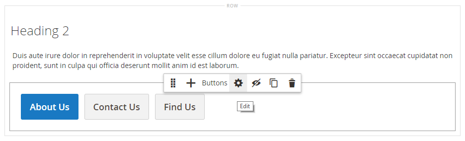

# Elements - Knoppen

Gebruik de _Knoppen_ inhoudstype om een afzonderlijke knop of een set knoppen toe te voegen in het dialoogvenster [[!DNL Page Builder] stadium](workspace.md#stage). U kunt knoppen horizontaal of verticaal rangschikken en rechtstreeks toevoegen aan rijen, kolommen, tabbladen en banners in het werkgebied.

{width="600" zoomable="yes"}

{{$include /help/_includes/page-builder-save-timeout.md}}

## Werkbalken

Wanneer u met het inhoudstype Knoppen werkt, voegt u afzonderlijke knoppen en de knoppencontainer die een of meer knoppen bevat toe en bewerkt u deze. Elk gereedschap heeft een eigen gereedschapset die u kunt gebruiken om knoppen te ontwerpen op de [!DNL Page Builder] in het werkgebied.

### Afzonderlijke knopgereedschapset

{width="500" zoomable="yes"}

| Gereedschap | Pictogram | Beschrijving |
| --------- | -------- | -------------- |
| Instellingen | {width="25"} | Hiermee opent u de pagina Knop Bewerken, waar u de eigenschappen van de knop kunt wijzigen. |
| Dupliceren | {width="25"} | Hiermee maakt u een kopie van de knop. |
| Verwijderen | {width="25"} | Hiermee verwijdert u de knop uit het werkgebied. |

{style="table-layout:auto"}

### Knoppencontainer, gereedschapset

{width="500" zoomable="yes"}

| Gereedschap | Pictogram | Beschrijving |
| --------- | ----------------- | ----------- |
| Verplaatsen | {width="25"} | Verplaatst de knopcontainer naar een andere geldige plaats op de pagina. |
| Toevoegen | {width="25"} | Hiermee voegt u een knop aan de container toe. |
| (label) | Knop | Identificeert de huidige container als een knopelement. |
| Instellingen | {width="25"} | Hiermee opent u de pagina Knoppen bewerken, waarin u de eigenschappen van de container kunt wijzigen. |
| Verbergen | {width="25"} | Verbergt de knopcontainer. |
| Tonen | {width="25"} | Hiermee wordt de verborgen knopcontainer weergegeven. |
| Dupliceren | {width="25"} | Maakt een kopie van de knopcontainer. |
| Verwijderen | {width="25"} | Hiermee verwijdert u de knopcontainer en de inhoud ervan uit het werkgebied. |

{style="table-layout:auto"}

{{$include /help/_includes/page-builder-hidden-element-note.md}}

## Een afzonderlijke knop toevoegen

1. In de [!DNL Page Builder] deelvenster, uitvouwen **[!UICONTROL Elements]** en sleep een **[!UICONTROL Buttons]** plaatsaanduiding voor een rij, kolom of tabset in het werkgebied.

   {width="500" zoomable="yes"}

1. Houd de muisaanwijzer boven de knop om de gereedschapset weer te geven en kies de optie _Instellingen_ ().

1. Voer de **[!UICONTROL Button Text]** die op de knop worden weergegeven.

   {width="600" zoomable="yes"}

1. Set **[!UICONTROL Button Type]** op een van de volgende wijzen:

   | Type | Beschrijving |
   | ------ | ----------- |
   | `Primary` | Past de primaire knoopstijl van het huidige stijlblad toe. |
   | `Secondary` | Past de secundaire knoopstijl van het huidige stijlblad toe als toepasselijk. |
   | `Link` | Maakt een hyperlink in plaats van een knop. |

   {style="table-layout:auto"}

   {width="500" zoomable="yes"}

1. Stel de **[!UICONTROL Button Link]** met een van de volgende typen:

   - **[!UICONTROL URL]** - Voer de doel-URL voor de koppeling in.

     De URL kan een relatieve koppeling zijn naar een product of pagina in uw winkel of een volledig gekwalificeerde URL.

     Relatief URL-voorbeeld - `../luma-analog-watch.html`

     Volledig gekwalificeerd URL-voorbeeld - `http://mystore.com/luma-analog-watch.html`

     Als de koppeling naar een andere website gaat, kunt u de huidige pagina open houden voor uw winkel door de koppeling op een nieuw browsertabblad te openen.

     Als u wilt voorkomen dat de bezoeker uit uw winkel navigeert, selecteert u de optie **[!UICONTROL Open in new tab]** selectievakje.

   - **[!UICONTROL Product]** - Voer een productnaam (gedeeltelijk of volledig) of SKU in en kies vervolgens de productnaam in de lijst.

     >[!NOTE]
     >
     >De producten worden in de lijst weergegeven volgens de _Producten uit voorraad tonen_ instellingen. Voor uit meerdere bronnen afkomstige handelaren die [Inventory management](../inventory-management/introduction.md), wordt de lijst met producten beperkt door de bron die alleen aan de standaardwebsite is toegewezen.

     {width="600" zoomable="yes"}

   - **[!UICONTROL Category]** - Voer een categorienaam in (gedeeltelijk of volledig) of klik in het lege veld om de categoriestructuur weer te geven. Kies vervolgens de categorienaam in de structuur.

     {width="600" zoomable="yes"}

   - **[!UICONTROL Page]** - Voer de naam van een CMS-pagina in (gedeeltelijk of volledig) of klik in het lege veld om de volledige lijst weer te geven. Kies vervolgens de naam van de pagina in de lijst met zoekresultaten.

     {width="600" zoomable="yes"}

1. Voltooi de [geavanceerde instellingen][advanced-settings] indien nodig.

1. Klik op **[!UICONTROL Save]** in de rechterbovenhoek om de instellingen toe te passen en terug te keren naar de [!DNL Page Builder] werkruimte.

## Een set knoppen toevoegen

In de volgende secties wordt een reeks stappen beschreven die met een afzonderlijke knop moeten beginnen en wordt een set van drie knoppen in een knopcontainer gemaakt. Als u nog geen afzonderlijke knop hebt, volgt u de vorige instructies om een afzonderlijke knop aan het werkgebied toe te voegen.

### Stap 1: De tweede knop maken

1. Houd de muisaanwijzer boven de knopcontainer om de gereedschapset weer te geven en kies de optie _Toevoegen_ ( {width="20"} ).

   {width="500" zoomable="yes"}

1. Voer de tekst in die u op de tweede knop wilt weergeven.

1. Klik op de nieuwe knop om de gereedschapset weer te geven en kies de optie _Instellingen_ ( {width="20"} ).

   {width="500" zoomable="yes"}

1. Set **[!UICONTROL Button Type]** tot `Secondary`.

1. Stel de **[!UICONTROL Button Link]** indien nodig.

   In het volgende voorbeeld is de koppeling een relatieve URL die naar de [Contact opnemen](../getting-started/store-details.md#contact-us-form) pagina.

   {width="600" zoomable="yes"}

1. Voltooi de [geavanceerde instellingen][advanced-settings] indien nodig.

1. Klik op **[!UICONTROL Save]** om de instellingen toe te passen en terug te keren naar de [!DNL Page Builder] werkruimte.

### Stap 2: De derde knop maken

1. Klik nogmaals op de tweede knop in het werkgebied en kies de optie _Dupliceren_ ( {width="20"} ).

   {width="500" zoomable="yes"}

1. Voer de tekst in die u op de derde knop wilt weergeven.

1. Klik op de derde knop om de gereedschapset weer te geven en kies de optie _Instellingen_ ( {width="20"} ).

   {width="500" zoomable="yes"}

1. Werk de **[!UICONTROL Button Link]** indien nodig.

1. Klik in de rechterbovenhoek op **[!UICONTROL Save]** om de instellingen toe te passen en terug te keren naar de [!DNL Page Builder] werkruimte.

### Stap 3: De knopcontainer bijwerken

1. Houd de muisaanwijzer boven de knopcontainer om de gereedschapset weer te geven en kies de optie _Instellingen_ ( {width="20"} ).

   {width="500" zoomable="yes"}

1. Onder _[!UICONTROL Appearance]_, kiest u **[!UICONTROL Stacked]**.

1. Set **[!UICONTROL All Buttons are same size]** tot `Yes`.

   {width="300"}

1. Werk de overige instellingen naar wens bij met behulp van de beschrijvingen uit [Instellingen wijzigen voor een knopcontainer][button-container].

1. Klik op **[!UICONTROL Save]** om de instellingen toe te passen en terug te keren naar de [!DNL Page Builder] werkruimte.

   De volledige gestapelde knopset wordt in het werkgebied weergegeven met één primaire knop en twee secundaire knoppen.

   {width="500" zoomable="yes"}

## Een knop verplaatsen

1. Klik op de knop die u wilt verplaatsen.

1. Verplaatsen selecteren en slepen ( {width="20"} ), die vlak voor de knoptekst wordt weergegeven, op een nieuwe positie voor de knop in de knopcontainer.

   {width="500" zoomable="yes"}

## Instellingen voor een knop wijzigen

1. Klik op de knop in het werkgebied om de gereedschapset weer te geven en kies de optie _Instellingen_ ( {width="20"} ).

   {width="500" zoomable="yes"}

1. Werk de standaardinstellingen naar wens bij.

   - **[!UICONTROL Button Text]** - Voer de tekst in die op de knop moet worden weergegeven (kan ook rechtstreeks vanuit het werkgebied worden bijgewerkt).

   - **[!UICONTROL Button Type]** - Bepaalt de knopindeling.

     | Type | Beschrijving |
     | ------ | ----------- |
     | `Primary` | Past de primaire knoopstijl van het huidige stijlblad toe. |
     | `Secondary` | Past de secundaire knoopstijl van het huidige stijlblad toe, indien van toepassing. |
     | `Link` | Maakt een hyperlink in plaats van een knop. |

     {style="table-layout:auto"}

   - **[!UICONTROL Button Link]** - Bepaalt de bestemmingspagina die wordt gediend wanneer de knoop wordt geklikt.

     | Optie | Beschrijving |
     | ------ | ----------- |
     | `URL` | Gebruikt of een relatieve of volledig - gekwalificeerde URL om de bestemmingspagina te identificeren. |
     | `Product` | Identificeert de bestemmingspagina die op de productnaam of SKU wordt gebaseerd. U kunt zoeken naar de productnaam op basis van een gedeeltelijke of volledige naam. Het product wordt vervolgens gekozen uit de lijst met zoekresultaten. |
     | `Category` | Hiermee wordt de doelpagina geïdentificeerd als een specifieke categorie of subcategorie in de categoriestructuur. |
     | `Page` | Hiermee wordt de doelpagina geïdentificeerd als een specifieke CMS-pagina. |

     {style="table-layout:auto"}

1. Voltooi de [geavanceerde instellingen][advanced-settings] indien nodig.

1. De instellingen opslaan en terugkeren naar de [!DNL Page Builder] werkruimte, klikken **[!UICONTROL Save]** in de rechterbovenhoek.

## Instellingen wijzigen voor een knopcontainer

1. Houd de muisaanwijzer boven de knopcontainer om de gereedschapset weer te geven en kies de optie _Instellingen_ ( {width="20"} ).

1. Werk de **[!UICONTROL Appearance]** instellingen.

   - Gebruik de opties voor rangschikking om de knoppen horizontaal of verticaal in de container weer te geven:

     | Optie | Beschrijving |
     | ------ | ----------- |
     | `Inline` | Hiermee rangschikt u de knoppen horizontaal. |
     | `Stacked` | Hiermee rangschikt u de knoppen verticaal. |

     {style="table-layout:auto"}

   - Stel de **[!UICONTROL All buttons are same size]** op basis van uw voorkeur.

     Wanneer ingesteld op `Yes`Alle knoppen in de container hebben een consistente grootte, gebaseerd op de lengte van de langste knoptekst.

1. Voltooi de [Geavanceerde instellingen][advanced-settings] indien nodig.

1. Klik op **[!UICONTROL Save]** om de instellingen toe te passen en terug te keren naar de [!DNL Page Builder] werkruimte.

## Geavanceerde instellingen wijzigen

U kunt de _[!UICONTROL Advanced]_instellingen voor afzonderlijke knoppen en voor de knopcontainer.

1. Als u de positionering in de bovenliggende container wilt bepalen, kiest u de optie **[!UICONTROL Alignment]**:

   | Optie | Beschrijving |
   | ------ | ----------- |
   | `Default` | Hiermee past u de standaardinstelling voor uitlijning toe die is opgegeven in het stijlblad van het huidige thema. |
   | `Left` | Hiermee lijnt u de inhoud uit langs de linkerrand van de bovenliggende container, waarbij rekening wordt gehouden met de opgegeven opvulling. |
   | `Center` | Hiermee lijnt u de inhoud uit in het midden van de bovenliggende container, waarbij rekening wordt gehouden met de opgegeven opvulling. |
   | `Right` | Hiermee lijnt u de inhoud uit langs de rechterrand van de bovenliggende container, waarbij rekening wordt gehouden met de opgegeven opvulling. |

   {style="table-layout:auto"}

1. Stel de **[!UICONTROL Border]** stijl toegepast op alle vier zijden van de knop of knoppencontainer:

   | Optie | Beschrijving |
   | ------ | ----------- |
   | `Default` | Past de standaardrandstijl toe die door het bijbehorende stijlblad wordt gespecificeerd. |
   | `None` | Geeft geen zichtbare indicatie van de containerranden. |
   | `Dotted` | De containerrand wordt weergegeven als een stippellijn. |
   | `Dashed` | De containerrand wordt weergegeven als een onderbroken lijn. |
   | `Solid` | De containerrand wordt weergegeven als een effen lijn. |
   | `Double` | De containerrand wordt weergegeven als een dubbele lijn. |
   | `Groove` | De containerrand wordt weergegeven als een gegroefde lijn. |
   | `Ridge` | De containerrand wordt weergegeven als een afgeronde lijn. |
   | `Inset` | De containerrand wordt weergegeven als een inzetlijn. |
   | `Outset` | De containerrand wordt weergegeven als een omtreklijn. |

   {style="table-layout:auto"}

1. Als u een andere randstijl dan `None`, vult u de weergaveopties voor de rand in:

   | Optie | Beschrijving |
   | ------ |------------ |
   | [!UICONTROL Border Color] | Geef de kleur op door een staal te kiezen, op de kleurkiezer te klikken of door een geldige kleurnaam of een gelijkwaardige hexadecimale waarde in te voeren. |
   | [!UICONTROL Border Width] | Voer het aantal pixels in voor de lijnbreedte van de rand. |
   | [!UICONTROL Border Radius] | Voer het aantal pixels in om de grootte te bepalen van de straal die wordt gebruikt om elke hoek van de rand te afronden. |

   {style="table-layout:auto"}

1. (Optioneel) Geef de namen op van **[!UICONTROL CSS classes]** in het huidige stijlblad toe te passen op de knop of knoppencontainer.

   Scheid meerdere klassennamen met een spatie.

1. Voer in pixels waarden in voor de **[!UICONTROL Margins and Padding]** om de buitenste marges en de binnenopvulling van de knop of knoppencontainer te bepalen.

   Voer de overeenkomende waarden in het diagram in.

   | Containergebied | Beschrijving |
   | -------------- | ----------- |
   | [!UICONTROL Margins] | De hoeveelheid lege ruimte die wordt toegepast op de buitenrand van alle zijden van de container. Opties: `Top` / `Right` / `Bottom` / `Left` |
   | [!UICONTROL Padding] | De hoeveelheid lege ruimte die wordt toegepast op de binnenrand van alle zijden van de container. Opties: `Top` / `Right` / `Bottom` / `Left` |

   {style="table-layout:auto"}

[advanced-settings]: #change-advanced-settings
[button-container]: #change-settings-for-a-button-container
