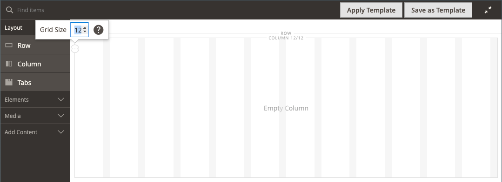

# Layout - kolom

Gebruik het _inhoudstype van de Kolom_ om een pagina in veelvoudige kolommen in het [[!DNL Page Builder]  stadium ](workspace.md#stage) te verdelen. Wanneer u een kolom toevoegt aan een rij of tab of rechtstreeks aan het werkgebied, wordt de kolomgroep in eerste instantie verdeeld in twee kolommen met dezelfde breedte. Desgewenst kunt u kolommen toevoegen of verwijderen. U kunt de grootte van een kolom wijzigen door de rand tussen twee kolommen te slepen. De breedte van de volgende kolom wordt aangepast om de beschikbare ruimte binnen de rij, de tab of het werkgebied te vullen. Met één kolom wordt de volledige breedte van het werkgebied of de container uitgebreid.

{width="600" zoomable="yes"}

{{$include /help/_includes/page-builder-save-timeout.md}}

## Updates in de release 2.4.5

De mogelijkheden van de Bouwer van de pagina worden bijgewerkt in versie 2.4.5 zodat de gebruikers _[!DNL Columns]_nu als oudercontainer voor individuele kolommen gebruiken. Deze nieuwe container ondersteunt ook eigenschappen voor de achtergrond en maakt het niet nodig kolommen in een rij te laten omlopen. Het vermindert onnodige prijsverhoging en geeft een fijnere controle over de archiefrontvertoning en ervaring.

U kunt de lay-out van de container van [!DNL Columns] veranderen door een kolom boven of onder andere kolommen in de groep te slepen en hen te stapelen. Dit opent een nieuwe verscheidenheid van mogelijke lay-outcombinaties die zonder de behoefte aan aanpassing door ontwikkelaars kunnen worden bereikt.

Bekijk deze video voor een demonstratie van hoe u de container van [!DNL Columns] kunt gebruiken om uw paginalay-outs te verfijnen:

>[!VIDEO](https://video.tv.adobe.com/v/345828?quality=12&learn=on)

## Gereedschap Kolom

Elke kolom heeft een gereedschapset met opties die wordt weergegeven wanneer u de muisaanwijzer op de container plaatst.

| Gereedschap | Pictogram | Beschrijving |
|--- |--- |--- |
| Verplaatsen | {width="25"} | Verplaatst de kolom en de inhoud ervan naar een andere positie ten opzichte van andere kolommen. |
| (label) | Kolom | Identificeert de huidige container als een kolom. Houd de muisaanwijzer boven de kolomcontainer om de gereedschapset weer te geven. |
| Instellingen | {width="25"} | Hiermee opent u de pagina Kolom bewerken, waarin u de eigenschappen van de container kunt wijzigen. |
| Dupliceren | {width="25"} | Maakt een kopie van de huidige kolom. |
| Verwijderen | {width="25"} | Hiermee verwijdert u de huidige kolom en de inhoud ervan. |

{style="table-layout:auto"}

## Kolomraster

Het [ net ](workspace.md) zorgt ervoor dat de inhoud constant in een kolom wordt gericht en helpt de pagina correct op zowel Desktop als mobiele apparaten teruggeven. Voor meer informatie, zie de [ Geavanceerde sectie van de Hulpmiddelen van de Inhoud ](setup.md) van de [!DNL Page Builder] configuratie.

{width="500" zoomable="yes"}

In het volgende voorbeeld met twee kolommen geven de getallen tussen haakjes (6/12) in de bovenrand van elke kolomcontainer het aantal rasterdivisies in elke kolom en het totale aantal scheidingen aan. In dit geval is de kolom de breedte van zes rastereenheden op een totaal van 12.

{width="600" zoomable="yes"}

## Een kolom toevoegen

1. Sleep in het deelvenster [!DNL Page Builder] onder _[!UICONTROL Layout]_een **[!UICONTROL Column]**naar het werkgebied.

   {width="600" zoomable="yes"}

   De kolomgroep is nu verdeeld in twee kolommen van gelijke breedte. Elke kolom is een aparte container voor inhoud en heeft een eigen set gereedschapsopties.

   {width="600" zoomable="yes"}

1. In de upper-left hoek van de kolomgroep, klik het _hulpmiddel van het Net_ () en pas de netgrootte zonodig aan.

   Door de inhoud op het raster te positioneren, kunt u de inhoud consistent uitlijnen en de pagina op zowel het bureaublad als het mobiele apparaat op de juiste wijze weergeven. Voor meer informatie, zie de [ Geavanceerde sectie van de Hulpmiddelen van de Inhoud ](../configuration-reference/general/content-management.md) van de [!DNL Page Builder] configuratie.

   {width="600" zoomable="yes"}

## Het formaat van een kolom wijzigen

1. Houd de cursor boven de rand tussen twee kolommen.

   De rand wordt gemarkeerd en de gereedschapset voor de geselecteerde kolom wordt weergegeven.

   {width="600" zoomable="yes"}

1. Houd de muisknop ingedrukt om het raster weer te geven en sleep de rand naar een nieuwe positie op het raster.

   De breedte van beide kolommen wordt aangepast aan de wijziging. De nieuwe breedte van elke kolom wordt na het label weergegeven, bijvoorbeeld `4/12` (vier van de twaalf) en `8/12` (acht van de twaalf).

   {width="600" zoomable="yes"}

## Een kolom verwijderen

1. Beweeg over de kolom die u wilt verwijderen om toolbox te tonen en _te kiezen verwijdert_ ( {width="20"} ).

   {width="600" zoomable="yes"}

1. Als de kolom inhoud bevat, klikt u op **[!UICONTROL OK]** om te bevestigen.

   Als u het proces in de toekomst wilt versnellen, kunt u de bevestigingsstap overslaan door het selectievakje **[!UICONTROL Do not show this again]** in te schakelen.

   De kolomgroep heeft nu één kolom (12/12) en een raster. Omdat het raster alleen beschikbaar is voor kolommen, kunt u het raster met deze techniek weergeven.

   {width="600" zoomable="yes"}

1. Als u wilt dat de kolomgroep de resterende kolom tot de volledige breedte van de rij of het werkgebied uitbreidt:

   - Beweeg over de kolom om toolbox te tonen en de _pictogram van Montages_ te kiezen ( {width="20"}).

   - Blader omlaag naar de sectie _[!UICONTROL Advanced]_en stel alle vier de **[!UICONTROL Padding]**waarden in op `0` .

     {width="600" zoomable="yes"}

   - Klik in de rechterbovenhoek op **[!UICONTROL Save]** om de pagina _[!UICONTROL Edit Column]_te sluiten.

1. Klik het _Dichte Volledige Scherm_ ( {width="20"}) pictogram in de hoger-juiste hoek van de werkruimte, en klik dan **[!UICONTROL Save]** in de hoger-juiste hoek.

## Kolominstellingen wijzigen

1. Beweeg over de kolom om toolbox te tonen en de _pictogram van Montages_ te kiezen ( {width="20"}).

   {width="600" zoomable="yes"}

1. Wijzig desgewenst de instellingen van **[!UICONTROL Appearance]** .

   - Kies de uitlijningsinstelling die de positie van de kolom ten opzichte van de container bepaalt.

     | Optie | Beschrijving |
     | ------ | ----------- |
     | `Full Height` | De kolom breidt de volledige hoogte van zijn container uit. |
     | `Top Aligned` | De kolom wordt boven aan de container uitgelijnd. |
     | `Centered` | De kolom in het midden van de container. |
     | `Bottom Aligned` | De kolom wordt onder aan de container uitgelijnd. |

     {style="table-layout:auto"}

   - Voer indien nodig de **[!UICONTROL Minimum Height]** voor de kolom in. U kunt bijvoorbeeld de minimumhoogte instellen zodat deze overeenkomt met de hoogte van een achtergrondafbeelding.

   - Als u de minimumhoogte instelt, stelt u **[!UICONTROL Vertical Alignment]** in om de positie te bepalen van inhoudscontainers die aan de kolom worden toegevoegd (`Top`, `Center` of `Bottom`).

1. Wijzig de achtergrond voor de kolominhoud.

   - **[!UICONTROL Background Color]** - Geef de kleur op door een staal te kiezen, op de kleurkiezer te klikken of door een geldige kleurnaam of een gelijkwaardige hexadecimale waarde in te voeren. Deze instelling bepaalt de achtergrondkleur van de kolom.

   - **[!UICONTROL Background Image]** - Gebruik indien nodig de beschikbare gereedschappen om een achtergrondafbeelding te kiezen die u op de kolom wilt toepassen:

     | Gereedschap | Beschrijving |
     | ------ | ----------- |
     | [!UICONTROL Upload] | Uploadt een afbeeldingsbestand van uw lokale computer naar de galerie en past het vervolgens toe als achtergrondafbeelding voor de kolom. |
     | [!UICONTROL Select from Gallery] | Hiermee wordt u gevraagd een bestaande afbeelding in de galerie te kiezen als achtergrondafbeelding voor de kolom. |
     | {width="25"} | Hiermee kunt u de afbeelding naar de tegel van de camera slepen of naar de afbeelding in uw lokale bestandssysteem bladeren. |

     {style="table-layout:auto"}

   - **[!UICONTROL Background Mobile Image]** - Gebruik indien nodig dezelfde gereedschappen om een andere achtergrondafbeelding te kiezen die u wilt gebruiken voor weergave op mobiele apparaten.

   - **[!UICONTROL Background Size]** - Wijzig deze instelling om te bepalen hoe de achtergrondafbeelding wordt geschaald ten opzichte van de breedte van de kolom:

     | Optie | Beschrijving |
     | ------ | ----------- |
     | `Cover` | De achtergrondafbeelding bedekt de volledige breedte van de kolom. |
     | `Contain` | De achtergrondafbeelding is beperkt tot de breedte van het inhoudsgebied. |
     | `Auto` | Hiermee past u de standaardachtergrondgrootte toe die is opgegeven in het stijlblad van het huidige thema. |

     {style="table-layout:auto"}

   - **[!UICONTROL Background Position]** - Wijzig deze instelling om het ankerpunt van de afbeelding ten opzichte van de kolom te bepalen. Opties: `Top Left`, `Top Center`, `Top Right`, `Center Left`, `Center`, `Center Right`, `Bottom Left`, `Bottom Center` of `Bottom Right`

   - **[!UICONTROL Background Attachment]** - Wijzig deze instelling om te bepalen hoe de achtergrondafbeelding ten opzichte van de schuifpagina wordt verplaatst:

     | Optie | Beschrijving |
     | ------ | ----------- |
     | `Scroll` | De achtergrondafbeelding wordt gesynchroniseerd zodat deze omlaag wordt verplaatst wanneer de pagina wordt verschoven. |
     | `Fixed` | (Niet beschikbaar voor mobiele apparaten) De achtergrondafbeelding wordt niet verplaatst wanneer de container over de afbeelding schuift en is vast op de opgegeven achtergrondpositie. |

     {style="table-layout:auto"}

   - **[!UICONTROL Background Repeat]** - Als u de achtergrondafbeelding wilt herhalen om de ruimte te vullen, wijzigt u deze instelling `Yes` .

1. Werk de instellingen van _[!UICONTROL Advanced]_naar wens bij.

   - Kies een **[!UICONTROL Alignment]** als u de horizontale plaatsing wilt bepalen van inhoudscontainers die aan de kolom worden toegevoegd:

     | Optie | Beschrijving |
     | ------ | ----------- |
     | `Default` | Hiermee past u de standaardinstelling voor uitlijning toe die is opgegeven in het stijlblad van het huidige thema. |
     | `Left` | Hiermee lijnt u de inhoudscontainers uit langs de linkerrand van de kolomcontainer, waarbij rekening wordt gehouden met de opgegeven opvulling. |
     | `Center` | Hiermee lijnt u de inhoudscontainer uit in het midden van de kolomcontainer, waarbij rekening wordt gehouden met de opgegeven opvulling. |
     | `Right` | Hiermee lijnt u de inhoudscontainer uit langs de rechterrand van de kolomcontainer, waarbij rekening wordt gehouden met de opgegeven opvulling. |

     {style="table-layout:auto"}

   - Stel de stijl **[!UICONTROL Border]** in, die wordt toegepast op alle vier zijden van de kolomcontainer:

     | Optie | Beschrijving |
     | ------ | ----------- |
     | `Default` | Past de standaardrandstijl toe die door het bijbehorende stijlblad wordt gespecificeerd. |
     | `None` | Geeft geen zichtbare indicatie van de containerranden. |
     | `Dotted` | De containerrand wordt weergegeven als een stippellijn. |
     | `Dashed` | De containerrand wordt weergegeven als een onderbroken lijn. |
     | `Solid` | De containerrand wordt weergegeven als een effen lijn. |
     | `Double` | De containerrand wordt weergegeven als een dubbele lijn. |
     | `Groove` | De containerrand wordt weergegeven als een gegroefde lijn. |
     | `Ridge` | De containerrand wordt weergegeven als een afgeronde lijn. |
     | `Inset` | De containerrand wordt weergegeven als een inzetlijn. |
     | `Outset` | De containerrand wordt weergegeven als een omtreklijn. |

     {style="table-layout:auto"}

   - Als u een andere randstijl dan `None` instelt, voert u de weergaveopties voor de rand in:

     | Optie | Beschrijving |
     | ------ |------------ |
     | [!UICONTROL Border Color] | Geef de kleur op door een staal te kiezen, op de kleurkiezer te klikken of door een geldige kleurnaam of een gelijkwaardige hexadecimale waarde in te voeren. |
     | [!UICONTROL Border Width] | Voer het aantal pixels in voor de lijnbreedte van de rand. |
     | [!UICONTROL Border Radius] | Voer het aantal pixels in om de grootte te bepalen van de straal die wordt gebruikt om elke hoek van de rand te afronden. |

     {style="table-layout:auto"}

   - (Optioneel) Geef de namen van **[!UICONTROL CSS classes]** op uit het huidige stijlblad die u wilt toepassen op de kolomcontainer.

     Scheid meerdere klassennamen met een spatie.

   - Voer in pixels waarden in voor de **[!UICONTROL Margins and Padding]** om de buitenste marges en de binnenopvulling van de kolom op te geven.

     Voer elke bijbehorende waarde in het diagram van de kolomcontainer in.

     | Containergebied | Beschrijving |
     | -------------- | ----------- |
     | [!UICONTROL Margins] | De hoeveelheid lege ruimte die wordt toegepast op de buitenrand van alle zijden van de container. Opties: `Top` / `Right` / `Bottom` / `Left` |
     | [!UICONTROL Padding] | De hoeveelheid lege ruimte die wordt toegepast op de binnenrand van alle zijden van de container. Opties: `Top` / `Right` / `Bottom` / `Left` |

     {style="table-layout:auto"}

1. Klik na afloop op **[!UICONTROL Save]** om de instellingen toe te passen en terug te keren naar de werkruimte van [!DNL Page Builder] .
