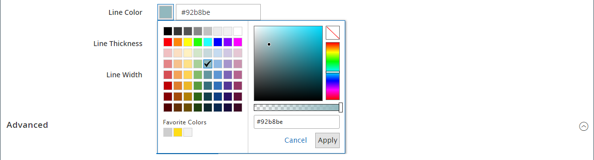

# Elementen - Verdeler

Gebruik het _Verdeler_ inhoudstype om een regel als visuele onderbreking tussen secties van inhoud in het [[!DNL Page Builder]  stadium &#x200B;](workspace.md#stage) toe te voegen. U kunt de lijnkleur, dikte en breedte van de scheidingslijn opgeven. U kunt ook de uitlijning bepalen, de marges en opvulling instellen en de opmaak van de containerrand instellen. Standaard is de scheidingslijn een haarlijnregel die de volledige breedte van de container uitbreidt, met ruimte voor opvulling.

{width="500" zoomable="yes"}

Hoewel de meeste verdeler containers onzichtbaar zijn, toont het volgende voorbeeld de container met een rode gestippelde grens zodat kunt u het verband tussen de verdeler, de opvulling, en de container zien. U kunt de opvulling boven en onder aan de scheidingslijn aanpassen om de afstand tussen de elementen te bepalen.

{width="500" zoomable="yes"}

{{$include /help/_includes/page-builder-save-timeout.md}}

## Scheidingsgereedschapset

| Gereedschap | Pictogram | Beschrijving |
| ---- | --------------------| ------------|
| Verplaatsen | {width="25"} | Verplaatst de container van de verdeler naar een andere geldige plaats op de pagina. |
| (label) | SCHEIDINGSTEKEN | Identificeert de huidige container als een scheidingselement. |
| Instellingen | {width="25"} | Hiermee opent u de pagina Verdeler bewerken, waarin u de eigenschappen van de scheidingslijn en de bijbehorende container kunt wijzigen. |
| Verbergen | {width="25"} | Hiermee verbergt u de scheidingscontainer. |
| Tonen | {width="25"} | Hiermee wordt de verborgen scheidingscontainer weergegeven. |
| Dupliceren | {width="25"} | Hiermee maakt u een kopie van de container voor scheidingstekens. |
| Verwijderen | {width="25"} | Hiermee verwijdert u de container van de scheidingslijn en de inhoud ervan uit het werkgebied. |

{style="table-layout:auto"}

{{$include /help/_includes/page-builder-hidden-element-note.md}}

## Een scheidingslijn toevoegen

1. Vouw in het deelvenster [!DNL Page Builder] **[!UICONTROL Elements]** uit en sleep een tijdelijke aanduiding **[!UICONTROL Divider]** naar een rij, kolom of tabset in het werkgebied.

   Gebruik de rode hulplijn ter referentie wanneer u de scheidingslijn voor of na een andere inhoudscontainer in het werkgebied plaatst.

   {width="600" zoomable="yes"}

   In het volgende voorbeeld markeert de scheidingslijn het begin van een nieuwe tekstsectie.

   {width="500" zoomable="yes"} scheiden

1. Volg de volgende procedure om de instellingen van de nieuwe scheidingslijn op te geven.

## De instellingen voor de scheidingslijn wijzigen

1. Beweeg over de verdelercontainer om toolbox te tonen en de _pictogram van Montages_ te kiezen ( {width="20"}).

   {width="500" zoomable="yes"}

1. Wijzig de scheidingslijn **[!UICONTROL Line Color]** op een van de volgende manieren:

   - Ga een geldige [&#x200B; de kleurennaam van HTML &#x200B;](https://en.wikipedia.org/wiki/Web_colors) in. Bijvoorbeeld `Teal` .
   - Voer de hexadecimale kleurwaarde in. Bijvoorbeeld `#008080` .

   Klik op **[!UICONTROL Apply]** als de bewerking is voltooid.

   {width="600" zoomable="yes"}

1. Voer de **[!UICONTROL Line Thickness]** in pixels in.

1. Voer de **[!UICONTROL Line Width]** gevolgd door `px` of `%` in om de maateenheid aan te geven.

   {width="600" zoomable="yes"}

1. Werk de instellingen van _[!UICONTROL Advanced]_&#x200B;naar wens bij.

   - Kies de optie **[!UICONTROL Alignment]** als u de positie van de scheidingslijn in de bovenliggende container wilt bepalen:

     | Optie | Beschrijving |
     | ------ | ----------- |
     | `Default` | Hiermee past u de standaardinstelling voor uitlijning toe die is opgegeven in het stijlblad van het huidige thema. |
     | `Left` | Hiermee lijnt u de lijst uit langs de linkerrand van de bovenliggende container, waarbij rekening wordt gehouden met de opgegeven opvulling. |
     | `Center` | Hiermee lijnt u de lijst in het midden van de bovenliggende container uit, rekening houdend met de opgegeven opvulling. |
     | `Right` | Hiermee lijnt u het blok uit langs de rechterrand van de bovenliggende container, waarbij rekening wordt gehouden met de opgegeven opvulling. |

     {style="table-layout:auto"}

     In het volgende voorbeeld worden de opties zo ingesteld dat voor de scheidingslijn een uitlijning in het midden wordt gebruikt.

     {width="600" zoomable="yes"}

   - Stel de stijl **[!UICONTROL Border]** in die op alle vier zijden van de container van de scheidingslijn wordt toegepast:

     | Optie | Beschrijving |
     | ------ | ----------- |
     | `Default` | Past de standaardrandstijl toe die door het bijbehorende stijlblad wordt gespecificeerd. |
     | `None` | Geeft geen zichtbare indicatie van de containerranden. |
     | `Dotted` | De containerrand wordt weergegeven als een stippellijn. |
     | `Dashed` | De containerrand wordt weergegeven als een onderbroken lijn. |
     | `Solid` | De containerrand wordt weergegeven als een effen lijn. |
     | `Double` | De containerrand wordt weergegeven als een dubbele lijn. |
     | `Groove` | De containerrand wordt weergegeven als een gegroefde lijn. |
     | `Ridge` | De containerrand wordt weergegeven als een afgeronde lijn. |
     | `Inset` | De containerrand wordt weergegeven als een inzetlijn. |
     | `Outset` | De containerrand wordt weergegeven als een omtreklijn. |

     {style="table-layout:auto"}

   - Als u een andere randstijl dan `None` instelt, voert u de weergaveopties voor de rand in:

     | Optie | Beschrijving |
     | ------ |------------ |
     | [!UICONTROL Border Color] | Geef de kleur op door een staal te kiezen, op de kleurkiezer te klikken of door een geldige kleurnaam of een gelijkwaardige hexadecimale waarde in te voeren. |
     | [!UICONTROL Border Width] | Voer het aantal pixels in voor de lijnbreedte van de rand. |
     | [!UICONTROL Border Radius] | Voer het aantal pixels in om de grootte te bepalen van de straal die wordt gebruikt om elke hoek van de rand te afronden. |

     {style="table-layout:auto"}

   - (Optioneel) Geef de namen van **[!UICONTROL CSS classes]** op uit de huidige stijlpagina die u op de container wilt toepassen.

     Scheid meerdere klassennamen met een spatie.

   - Voer in pixels waarden in voor de **[!UICONTROL Margins and Padding]** om de buitenste marges en de binnenopvulling van de container van de verdeler te bepalen.

     Voer de overeenkomende waarden in het diagram in.

     | Containergebied | Beschrijving |
     | -------------- | ----------- |
     | [!UICONTROL Margins] | De hoeveelheid lege ruimte die wordt toegepast op de buitenrand van alle zijden van de container. Opties: `Top` / `Right` / `Bottom` / `Left` |
     | [!UICONTROL Padding] | De hoeveelheid lege ruimte die wordt toegepast op de binnenrand van alle zijden van de container. Opties: `Top` / `Right` / `Bottom` / `Left` |

     {style="table-layout:auto"}

1. Klik na afloop op **[!UICONTROL Save]** om de instellingen toe te passen en terug te keren naar de werkruimte van [!DNL Page Builder] .

   {width="500" zoomable="yes"} wordt gecentreerd

## Een scheidingslijn dupliceren

Voor een opgemaakte scheidingslijn met specifieke instellingen is het efficiënter om een duplicaat te maken in plaats van opnieuw te beginnen met een nieuwe plaatsaanduiding.

1. Beweeg over de verdelercontainer om toolbox te tonen en _te kiezen dupliceert_ ( {width="20"}) pictogram.

   De gedupliceerde container wordt net onder het origineel weergegeven.

   {width="500" zoomable="yes"}

1. Beweeg over de nieuwe verdelercontainer om toolbox te tonen en de _Beweging_ te kiezen ( {width="20"}) pictogram.

   {width="500" zoomable="yes"}

1. Selecteer en sleep de scheidingslijn totdat de rode hulplijn de nieuwe positie markeert.

   De boven- en onderrand van elke container worden weergegeven als onderbroken lijnen terwijl de scheidingslijn wordt verplaatst.

   {width="500" zoomable="yes"}

<!-- Last updated from includes: 2023-09-11 14:30:19 -->
