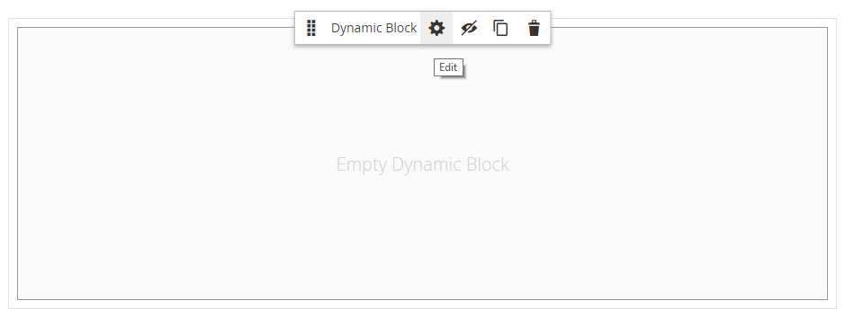

# Inhoud toevoegen - Dynamisch blok

Gebruik het Dynamische inhoudstype van het Blok om een bestaand [&#x200B; dynamisch blok &#x200B;](../content-design/dynamic-blocks.md) aan het [[!DNL Page Builder]  stadium &#x200B;](workspace.md#stage) toe te voegen.

{width="700" zoomable="yes"}

{{$include /help/_includes/page-builder-save-timeout.md}}

## Werkset Dynamisch blok

| Gereedschap | Pictogram | Beschrijving |
| --------- | ------------- | ----------------- |
| Verplaatsen | {width="25"} | Verplaatst de blokcontainer en de inhoud ervan naar een andere positie in het werkgebied. |
| Instellingen | {width="25"} | Opent de _uitgeven Blokpagina_, waar u het blok kunt kiezen en de eigenschappen van de container veranderen. |
| Verbergen | {width="25"} | Hiermee verbergt u de huidige blokcontainer en de inhoud ervan. |
| Tonen | {width="25"} | Toont de verborgen blokcontainer en de inhoud ervan. |
| Dupliceren | {width="25"} | Hiermee maakt u een kopie van de blokcontainer en de inhoud ervan. |
| Verwijderen | {width="25"} | Verwijdert de blokcontainer en de inhoud ervan uit het werkgebied. |

{style="table-layout:auto"}

{{$include /help/_includes/page-builder-hidden-element-note.md}}

## Een bestaand dynamisch blok toevoegen aan het werkgebied

1. Navigeer naar de werkruimte [!DNL Page Builder] op de doelpagina, het doelblok, het product of de doelcategorie.

1. Vouw [!DNL Page Builder] uit in het deelvenster **[!UICONTROL Add Content]** en sleep een tijdelijke aanduiding **[!UICONTROL Dynamic Block]** naar het werkgebied.

   {width="600" zoomable="yes"}

1. Beweeg over de lege dynamische blokcontainer om toolbox te tonen en de _Montages_ te kiezen ( {width="20"}).

   {width="600" zoomable="yes"}

1. Voor _geef Dynamisch Blok_ pagina uit, klik **[!UICONTROL Select Dynamic Block]** en gebruik de lijst om het blok te selecteren.

   {width="600" zoomable="yes"}

   Zoek in de lijst het dynamische blok dat u wilt invoegen en klik op **[!UICONTROL Select]** . Klik vervolgens op **[!UICONTROL Add Selected]** .

   {width="600" zoomable="yes"}

   Hieronder wordt een samenvatting van de dynamische blokinformatie weergegeven.

   {width="600" zoomable="yes"}

1. Stel **[!UICONTROL Template]** in op een van de volgende opties:

   | Optie | Beschrijving |
   | ------ | ----------- |
   | `Dynamic Block Block Template` | Voegt een standalone blok toe. |
   | `Dynamic Block Inline Template` | Voegt de blokinhoud in tekst in. |

   {style="table-layout:auto"}

   {width="200"}

1. Vul de gewenste geavanceerde instellingen in.

1. Klik na afloop op **[!UICONTROL Save]** om de instellingen toe te passen en terug te keren naar de werkruimte van [!DNL Page Builder] .

### Geavanceerde instellingen

1. Kies een **[!UICONTROL Alignment]** als u de plaatsing van het dynamische blok in de bovenliggende container wilt bepalen:

   | Optie | Beschrijving |
   | ------ | ----------- |
   | `Default` | Hiermee past u de standaardinstelling voor uitlijning toe die is opgegeven in het stijlblad van het huidige thema. |
   | `Left` | Hiermee lijnt u de lijst uit langs de linkerrand van de bovenliggende container, waarbij rekening wordt gehouden met de opgegeven opvulling. |
   | `Center` | Hiermee lijnt u de lijst in het midden van de bovenliggende container uit, rekening houdend met de opgegeven opvulling. |
   | `Right` | Hiermee lijnt u het blok uit langs de rechterrand van de bovenliggende container, waarbij rekening wordt gehouden met de opgegeven opvulling. |

   {style="table-layout:auto"}

1. Stel de stijl **[!UICONTROL Border]** in die wordt toegepast op alle vier zijden van de dynamische blokcontainer:

   | Optie | Beschrijving |
   | ------ | ----------- |
   | `Default` | Past de standaardrandstijl toe die door het bijbehorende stijlblad wordt gespecificeerd. |
   | `None` | Geeft geen zichtbare indicatie van de containerranden. |
   | `Dotted` | De containerrand wordt weergegeven als een stippellijn. |
   | `Dashed` | De containerrand wordt weergegeven als een onderbroken lijn. |
   | `Solid` | De containerrand wordt weergegeven als een effen lijn. |
   | `Double` | De containerrand wordt weergegeven als een dubbele lijn. |
   | `Groove` | De containerrand wordt weergegeven als een gegroefde lijn. |
   | `Ridge` | De containerrand wordt weergegeven als een afgeronde lijn. |
   | `Inset` | De containerrand wordt weergegeven als een inzetlijn. |
   | `Outset` | De containerrand wordt weergegeven als een omtreklijn. |

   {style="table-layout:auto"}

1. Als u een andere randstijl dan `None` instelt, voert u de weergaveopties voor de rand in:

   | Optie | Beschrijving |
   | ------ |------------ |
   | [!UICONTROL Border Color] | Geef de kleur op door een staal te kiezen, op de kleurkiezer te klikken of door een geldige kleurnaam of een gelijkwaardige hexadecimale waarde in te voeren. |
   | [!UICONTROL Border Width] | Voer het aantal pixels in voor de lijnbreedte van de rand. |
   | [!UICONTROL Border Radius] | Voer het aantal pixels in om de grootte te bepalen van de straal die wordt gebruikt om elke hoek van de rand te afronden. |

   {style="table-layout:auto"}

1. (Optioneel) Geef de namen van **[!UICONTROL CSS classes]** op uit de huidige stijlpagina die u op de container wilt toepassen.

   Scheid meerdere klassennamen met een spatie.

1. Voer in pixels waarden in voor de **[!UICONTROL Margins and Padding]** om de buitenste marges en binnenopvulling van de dynamische blokcontainer te bepalen.

   Voer de overeenkomende waarden in het diagram in.

   | Containergebied | Beschrijving |
   | -------------- | ----------- |
   | [!UICONTROL Margins] | De hoeveelheid lege ruimte die wordt toegepast op de buitenrand van alle zijden van de container. Opties: `Top` / `Right` / `Bottom` / `Left` |
   | [!UICONTROL Padding] | De hoeveelheid lege ruimte die wordt toegepast op de binnenrand van alle zijden van de container. Opties: `Top` / `Right` / `Bottom` / `Left` |

   {style="table-layout:auto"}

## Dynamische blokcontainerinstellingen bewerken

1. Beweeg over de dynamische blokcontainer om toolbox te tonen en de _pictogram van Montages_ te kiezen ( {width="20"}).

   {width="500" zoomable="yes"}

1. Wijzig zo nodig het dynamische blok:

   - Klik op **[!UICONTROL Select Dynamic Block]**.

     {width="20"}

   - Klik in de lijst met actieve dynamische blokken op **[!UICONTROL Select]** voor het blok dat u wilt toevoegen.

1. Werk de overige instellingen naar wens bij.

1. Klik na afloop op **[!UICONTROL Save]** om de instellingen toe te passen en terug te keren naar de werkruimte van [!DNL Page Builder] .

## Een dynamisch blok dupliceren

1. Beweeg over de dynamische blokcontainer om toolbox te tonen en _te kiezen dupliceert_ ( {width="20"}) pictogram.

   Het duplicaat wordt net onder het origineel weergegeven.

   {width="500" zoomable="yes"}

1. Om het nieuwe dynamische blok aan een verschillende positie te bewegen, beweegt zich over zijn container, en kiest dan _Beweging_ ( {width="20"}) in toolbox.

1. Selecteer en sleep het dynamische blok totdat de rode hulplijn op de nieuwe positie wordt weergegeven.

   De boven- en onderrand van elke container worden weergegeven als onderbroken lijnen terwijl het dynamische blok wordt verplaatst.

## Een dynamisch blok uit het werkgebied verwijderen

1. Beweeg over de dynamische blokcontainer om toolbox te tonen en _te kiezen verwijder_ ( {width="20"} ).

1. Klik op **[!UICONTROL OK]** wanneer u wordt gevraagd om te bevestigen.

<!-- Last updated from includes: 2023-09-11 14:30:19 -->
