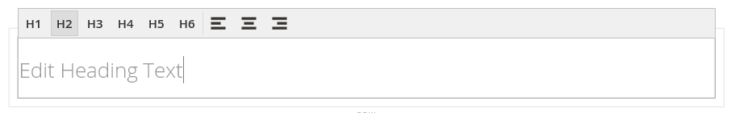

# Elementen - kop

Met kopniveaus wordt een hiërarchie ingesteld die inhoud ordent en zoekprogramma&#39;s helpt elke pagina te indexeren. Gebruik de _Kop_ inhoudstype in het dialoogvenster [[!DNL Page Builder] stadium](workspace.md#stage) om een tekstcontainer met een koptekstniveau van H1 tot H6 toe te voegen aan het werkgebied. Koppen worden opgemaakt op basis van het stijlblad dat is gekoppeld aan het huidige thema.

De [Inhoudskop](workspace.md) in het veld _[!UICONTROL Content]_kan worden gebruikt om een H1-kop boven aan de pagina toe te voegen. Het veld is echter een verouderde versie van het vorige [!DNL Commerce] versies en wordt geleverd ter ondersteuning van oudere inhoud. Dit veld benut geen voordeel van [!DNL Page Builder]Geavanceerde functies. U wordt aangeraden het veld Inhoudskop leeg te laten en de optie [!DNL Page Builder] Inhoudstype kop om koppen van een willekeurig niveau aan de pagina toe te voegen.

In het volgende voorbeeld ziet u hoe de inhoudsopgave Kop inhoud en Kop worden weergegeven wanneer deze worden opgemaakt door het thema Luma.

{width="700" zoomable="yes"}

U kunt een kop slepen vanuit de _Elementen_ van de [!DNL Page Builder] naar een rij, kolom of tabset in het werkgebied. U kunt het kopniveau en de uitlijning bepalen via de editor-werkbalk in het werkgebied of met de knop _Instellingen_ ( {width="20"} ).

{{$include /help/_includes/page-builder-save-timeout.md}}

## Kop-editor

{width="500" zoomable="yes"}

## Gereedschap Keuzerondje

Net als bij alle inhoudscontainers wordt de gereedschapset weergegeven wanneer u de muisaanwijzer op de container plaatst.

{width="500" zoomable="yes"}

| Gereedschap | Pictogram | Beschrijving |
| --------- | ----------------- | ---------------------- |
| Verplaatsen | {width="25"} | Hiermee verplaatst u de kopcontainer naar een andere geldige plaats op de pagina. |
| (label) | Kop | Identificeert de huidige container als een kop. |
| Instellingen | {width="25"} | Hiermee opent u de pagina Koptekst bewerken, waarin u de eigenschappen van de container kunt wijzigen. |
| Verbergen | {width="25"} | Hiermee verbergt u de container van de kop. |
| Tonen | {width="25"} | Hiermee wordt de verborgen kopcontainer weergegeven. |
| Dupliceren | {width="25"} | Hiermee maakt u een kopie van de kopcontainer. |
| Verwijderen | {width="25"} | Hiermee verwijdert u de kopcontainer en de inhoud ervan uit het werkgebied. |

{style="table-layout:auto"}

{{$include /help/_includes/page-builder-hidden-element-note.md}}

## Een kop toevoegen

1. In de [!DNL Page Builder] deelvenster, uitvouwen **[!UICONTROL Elements]** en sleep een **[!UICONTROL Heading]** plaatsaanduiding voor een rij, kolom of tabset in het werkgebied.

   {width="600" zoomable="yes"}

1. Voer in de editor de koptekst in boven de `Edit Heading Text` plaatsaanduiding.

   Standaard wordt aan de koptekst een koptekst van niveau twee (H2) toegewezen.

   {width="500" zoomable="yes"}

1. Kies in de werkbalk het juiste koptype tussen H1 en H6.

1. Wijzig indien nodig de uitlijning.

## Koptekstinstellingen bewerken

1. Houd de cursor boven de container van de kop om de gereedschapset weer te geven en kies de optie _Instellingen_ ( {width="20"} ).

   {width="500" zoomable="yes"}

1. De kopinhoud bijwerken (**[!UICONTROL Heading Type]** en **[!UICONTROL Heading Text]**) indien nodig.

   U kunt deze inhoud ook bijwerken in de kopteksteditor.

1. Werk de _[!UICONTROL Advanced]_instellingen.

   - Als u de positie van de kop in de bovenliggende container wilt bepalen, kiest u een **[!UICONTROL Alignment]**:

     | Optie | Beschrijving |
     | ------ | ----------- |
     | `Default` | Hiermee past u de standaardinstelling voor uitlijning toe die is opgegeven in het stijlblad van het huidige thema. |
     | `Left` | Hiermee lijnt u de lijst uit langs de linkerrand van de bovenliggende container, waarbij rekening wordt gehouden met de opgegeven opvulling. |
     | `Center` | Hiermee lijnt u de lijst in het midden van de bovenliggende container uit, rekening houdend met de opgegeven opvulling. |
     | `Right` | Hiermee lijnt u het blok uit langs de rechterrand van de bovenliggende container, waarbij rekening wordt gehouden met de opgegeven opvulling. |

     {style="table-layout:auto"}

   - Stel de **[!UICONTROL Border]** stijl toegepast op alle vier zijden van de container van de kop:

     | Optie | Beschrijving |
     | ------ | ----------- |
     | `Default` | Past de standaardrandstijl toe die door het bijbehorende stijlblad wordt gespecificeerd. |
     | `None` | Geeft geen zichtbare indicatie van de containerranden. |
     | `Dotted` | De containerrand wordt weergegeven als een stippellijn. |
     | `Dashed` | De containerrand wordt weergegeven als een onderbroken lijn. |
     | `Solid` | De containerrand wordt weergegeven als een effen lijn. |
     | `Double` | De containerrand wordt weergegeven als een dubbele lijn. |
     | `Groove` | De containerrand wordt weergegeven als een gegroefde lijn. |
     | `Ridge` | De containerrand wordt weergegeven als een afgeronde lijn. |
     | `Inset` | De containerrand wordt weergegeven als een inzetlijn. |
     | `Outset` | De containerrand wordt weergegeven als een omtreklijn. |

     {style="table-layout:auto"}

   - Als u een andere randstijl dan `None`, vult u de weergaveopties voor de rand in:

     | Optie | Beschrijving |
     | ------ |------------ |
     | [!UICONTROL Border Color] | Geef de kleur op door een staal te kiezen, op de kleurkiezer te klikken of door een geldige kleurnaam of een gelijkwaardige hexadecimale waarde in te voeren. |
     | [!UICONTROL Border Width] | Voer het aantal pixels in voor de lijnbreedte van de rand. |
     | [!UICONTROL Border Radius] | Voer het aantal pixels in om de grootte te bepalen van de straal die wordt gebruikt om elke hoek van de rand te afronden. |

     {style="table-layout:auto"}

   - (Optioneel) Geef de namen op van **[!UICONTROL CSS classes]** in het huidige stijlblad toe te passen op de container.

     Scheid meerdere klassennamen met een spatie.

   - Voer in pixels waarden in voor de **[!UICONTROL Margins and Padding]** om de buitenste marges en de binnenopvulling van de kopcontainer te bepalen.

     Voer de overeenkomende waarden in het diagram in.

     | Containergebied | Beschrijving |
     | -------------- | ----------- |
     | [!UICONTROL Margins] | De hoeveelheid lege ruimte die wordt toegepast op de buitenrand van alle zijden van de container. Opties: `Top` / `Right` / `Bottom` / `Left` |
     | [!UICONTROL Padding] | De hoeveelheid lege ruimte die wordt toegepast op de binnenrand van alle zijden van de container. Opties: `Top` / `Right` / `Bottom` / `Left` |

     {style="table-layout:auto"}

1. Klik op **[!UICONTROL Save]** om de instellingen toe te passen en terug te keren naar de [!DNL Page Builder] werkruimte.

## Een kop dupliceren

Voor een opgemaakte kop met specifieke instellingen is het efficiënter om de kop te dupliceren in plaats van opnieuw te beginnen met een nieuwe plaatsaanduiding.

1. Houd de cursor boven de container van de kop om de gereedschapset weer te geven en kies de optie _Dupliceren_ ( {width="20"} ).

   Het duplicaat wordt net onder het origineel weergegeven.

   {width="500" zoomable="yes"}

1. Houd de aanwijzer boven de nieuwe kopcontainer om de gereedschapset weer te geven en kies de optie _Verplaatsen_ ( {width="20"} ).

   {width="500" zoomable="yes"}

1. Selecteer en sleep de kop totdat de rode hulplijn de nieuwe positie markeert.

   De boven- en onderrand van elke container worden weergegeven als onderbroken lijnen terwijl de kop wordt verplaatst.

   {width="500" zoomable="yes"}

1. Als u het kopniveau wilt wijzigen, klikt u op de koptekst en kiest u het nieuwe niveau in de editor-werkbalk.

   {width="500" zoomable="yes"}
