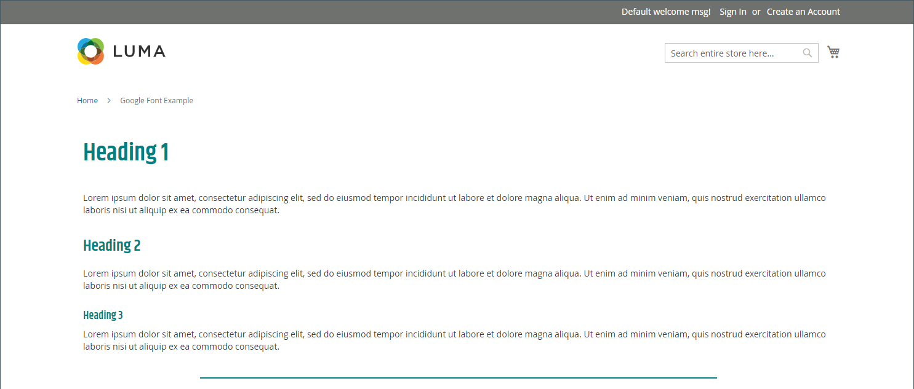

# Elements - HTML-code

Gebruik de _HTML-code_ inhoudstype om fragmenten van HTML-, CSS- en JavaScript-code toe te voegen in de [[!DNL Page Builder] stadium](workspace.md#stage). U kunt bijvoorbeeld aangepaste HTML toevoegen, een CSS-klasse declareren die op een element op de pagina kan worden toegepast. Of u wilt een codefragment toevoegen voor een logo, knop of banner die u van een externe provider hebt ontvangen.

## Gereedschap HTML-code

{width="500" zoomable="yes"}

| Gereedschap | Pictogram | Beschrijving |
| --------- | ---------- | ----------------- |
| Verplaatsen | {width="25"} | Verplaatst de container van de Code van de HTML naar een andere geldige plaats op de pagina. |
| Instellingen | {width="25"} | Hiermee opent u de pagina HTML-code bewerken, waarin u de eigenschappen van de container kunt wijzigen. |
| Verbergen | {width="25"} | Verbergt de container van de Code van de HTML. |
| Tonen | {width="25"} | Toont de verborgen container van de Code van HTML. |
| Dupliceren | {width="25"} | Hiermee maakt u een kopie van de container HTML Code. |
| Verwijderen | {width="25"} | Hiermee verwijdert u de container HTML Code en de inhoud ervan uit het werkgebied. |

{{$include /help/_includes/page-builder-hidden-element-note.md}}

## HTML-code toevoegen

In het volgende voorbeeld wordt getoond hoe u kunt insluiten [Google-lettertype][1] code en declareer aangepaste kopklassen die de huidige stijlpagina overschrijven.

### Stap 1: Kies een Google-lettertype

1. Ga naar [Google-lettertypen][1] en kiest u de lettertypefamilie die u wilt gebruiken.

1. Kopieer de gegenereerde code die moet worden ingesloten in de `<head>` van de pagina en plak deze tijdelijk in een teksteditor.

   - Fontcode insluiten
   - CSS-regel

1. Voeg de regel font-family toe aan elke kopklasse en sluit de kopklassen in een `<style>` -tag.

   Deze code wordt geplakt in [!DNL Page Builder].

   ```html
   <style>
      h1 {color: teal; font-family: 'Khand', sans-serif; }
      h2 {color: teal; font-family: 'Khand', sans-serif; }
      h3 {color: teal; font-family: 'Khand', sans-serif; }
   </style>
   ```

### Stap 2: Voeg de code toe aan de pagina

1. In de _Beheerder_ zijbalk van je winkel, ga naar **[!UICONTROL Content]** > _[!UICONTROL Elements]_>**[!UICONTROL Pages]**.

1. Zoek de pagina waar het lettertype beschikbaar moet zijn en open het in de bewerkingsmodus.

1. Omlaag schuiven en de **[!UICONTROL Content]** sectie.

1. In de [!DNL Page Builder] deelvenster, uitvouwen **[!UICONTROL Elements]** en sleep een **[!UICONTROL HTML Code]** plaatsaanduiding voor een rij, kolom of tabset in het werkgebied.

   Gebruik de rode hulplijn om de scheidingslijn voor of na een andere inhoudscontainer in de rij, kolom of tabset te plaatsen.

   {width="600" zoomable="yes"}

1. Houd de muisaanwijzer boven de container HTML om de gereedschapset weer te geven en kies de optie _Instellingen_ ( {width="20"} ), pictogram.

1. Plak in het tekstvak de code en stijldeclaraties voor Google-fonts insluiten die u hebt voorbereid.

   U kunt een paar spaties invoeren om de code te laten inspringen, zodat u deze eenvoudiger kunt lezen.

   {width="500" zoomable="yes"}

1. Wijzig desgewenst de overige instellingen (zie [Instellingen voor HTML-code wijzigen](#html-settings) voor meer informatie).

1. Klik in de rechterbovenhoek op **[!UICONTROL Save]** om de instellingen toe te passen en terug te keren naar de [!DNL Page Builder] werkruimte.

   Het nieuwe lettertype wordt weergegeven wanneer de pagina via een browser wordt weergegeven.

### Stap 3: Voorvertoning van de pagina weergeven

1. In de _[!UICONTROL Currently Active]_sectie, set **[!UICONTROL Enable Page]**tot `Yes`.

   {width="600" zoomable="yes"}

1. Klik in de rechterbovenhoek op de knop **[!UICONTROL Save]** en kiest u **[!UICONTROL Save & Close]**.

1. De pagina in het raster zoeken en **[!UICONTROL View]** in de _[!UICONTROL Actions]_kolom.

   {width="700" zoomable="yes"}

## Instellingen voor HTML-code wijzigen {#html-settings}

1. Houd de muisaanwijzer boven de container HTML om de gereedschapset weer te geven en kies de optie _Instellingen_ ( {width="20"} ).

1. Bewerk in het tekstvak de code naar wens.

   HTML-, CSS- en JavaScript-code worden ondersteund. Codefragmenten die in de `<head>` sectie van de pagina kan hier worden ingegaan.

   De redacteur verstrekt ook knopen om speciale elementen in de code op te nemen:

   | Knop | Beschrijving |
   | ------ | ----------- |
   | Widget invoegen... | Klik om een widget in te voegen op de positie van de cursor in het tekstvak HTML. |
   | Afbeelding invoegen... | Klik om een geüploade afbeelding of een afbeelding uit de galerie in te voegen op de positie van de cursor in het tekstvak HTML. |
   | Variabele invoegen... | Klik om een variabele op de positie van de cursor in het tekstvak HTML in te voegen. |

1. Werk de _[!UICONTROL Advanced]_instellingen.

   - Als u de positie van de code in de bovenliggende container wilt bepalen, kiest u een **[!UICONTROL Alignment]**:

     | Optie | Beschrijving |
     | ------ | ----------- |
     | `Default` | Hiermee past u de standaardinstelling voor uitlijning toe die is opgegeven in het stijlblad van het huidige thema. |
     | `Left` | Hiermee lijnt u de lijst uit langs de linkerrand van de bovenliggende container, waarbij rekening wordt gehouden met de opgegeven opvulling. |
     | `Center` | Hiermee lijnt u de lijst in het midden van de bovenliggende container uit, rekening houdend met de opgegeven opvulling. |
     | `Right` | Hiermee lijnt u het blok uit langs de rechterrand van de bovenliggende container, waarbij rekening wordt gehouden met de opgegeven opvulling. |

     In het volgende voorbeeld worden de opties zo ingesteld dat ze een uitlijning in het midden gebruiken voor het gerenderde codeblok.

     {width="600" zoomable="yes"}

   - Stel de **[!UICONTROL Border]** stijl toegepast op alle vier zijden van de codecontainer:

     | Optie | Beschrijving |
     | ------ | ----------- |
     | `Default` | Past de standaardrandstijl toe die door het bijbehorende stijlblad wordt gespecificeerd. |
     | `None` | Geeft geen zichtbare indicatie van de containerranden. |
     | `Dotted` | De containerrand wordt weergegeven als een stippellijn. |
     | `Dashed` | De containerrand wordt weergegeven als een onderbroken lijn. |
     | `Solid` | De containerrand wordt weergegeven als een effen lijn. |
     | `Double` | De containerrand wordt weergegeven als een dubbele lijn. |
     | `Groove` | De containerrand wordt weergegeven als een gegroefde lijn. |
     | `Ridge` | De containerrand wordt weergegeven als een afgeronde lijn. |
     | `Inset` | De containerrand wordt weergegeven als een inzetlijn. |
     | `Outset` | De containerrand wordt weergegeven als een omtreklijn. |

   - Als u een andere randstijl dan `None`, vult u de weergaveopties voor de rand in:

     | Optie | Beschrijving |
     | ------ |------------ |
     | [!UICONTROL Border Color] | Geef de kleur op door een staal te kiezen, op de kleurkiezer te klikken of door een geldige kleurnaam of een gelijkwaardige hexadecimale waarde in te voeren. |
     | [!UICONTROL Border Width] | Voer het aantal pixels in voor de lijnbreedte van de rand. |
     | [!UICONTROL Border Radius] | Voer het aantal pixels in om de grootte te bepalen van de straal die wordt gebruikt om elke hoek van de rand te afronden. |

     {style="table-layout:auto"}

   - (Optioneel) Geef de namen op van **[!UICONTROL CSS classes]** in het huidige stijlblad toe te passen op de container.

     Scheid meerdere klassennamen met een spatie.

   - Voer in pixels waarden in voor de **[!UICONTROL Margins and Padding]** om de buitenste marges en de binnenopvulling van de codecontainer te bepalen.

     Voer de overeenkomende waarden in het diagram in.

     | Containergebied | Beschrijving |
     | -------------- | ----------- |
     | [!UICONTROL Margins] | De hoeveelheid lege ruimte die wordt toegepast op de buitenrand van alle zijden van de container. Opties: `Top` / `Right` / `Bottom` / `Left` |
     | [!UICONTROL Padding] | De hoeveelheid lege ruimte die wordt toegepast op de binnenrand van alle zijden van de container. Opties: `Top` / `Right` / `Bottom` / `Left` |

[1]: https://fonts.google.com/
