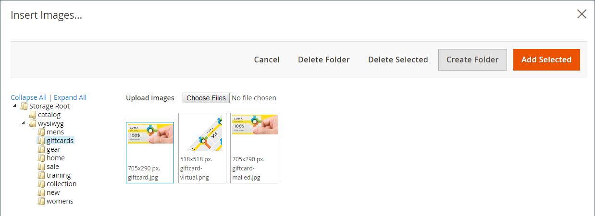
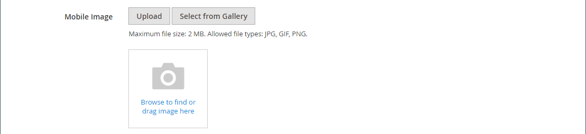
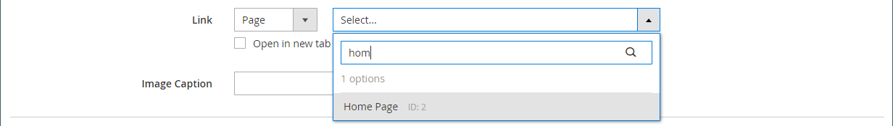
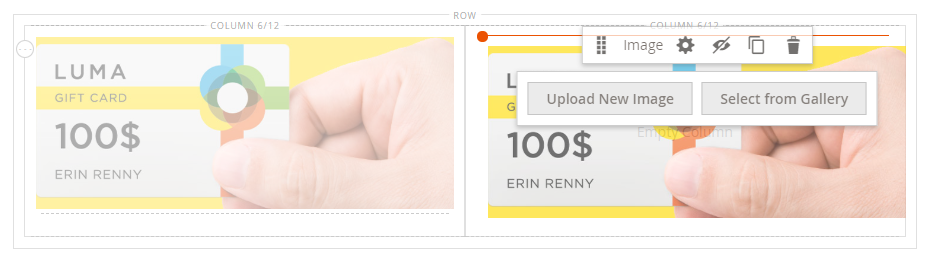

# Media - Afbeelding

Gebruik de _Afbeelding_ inhoudstype om een JPG-, GIF- of PNG-afbeelding toe te voegen aan de [[!DNL Page Builder] stadium](workspace.md#stage). Naast de standaard desktopafbeelding kunt u ook een secundaire afbeelding voor mobiele apparaten opgeven. U kunt ook een bijschrift toevoegen dat onder de afbeelding wordt weergegeven en de afbeelding koppelen aan een URL, product, categorie of pagina.

>[!TIP]
>
>U kunt de [Adobe Stock-integratie](../content-design/adobe-stock.md) om een geschikt middel te vinden en te bewaren van één van de miljoenen die door [Adobe Stock](https://stock.adobe.com). Zie [Adobe Stock-afbeeldingen gebruiken](../content-design/adobe-stock-manage.md) voor meer informatie over het zoeken, verfijnen en opslaan van Adobe Stock-middelen in uw galerie.

{{$include /help/_includes/page-builder-save-timeout.md}}

## Gereedschap Afbeelding

De gereedschapset voor afbeeldingen wordt weergegeven wanneer u de muisaanwijzer op de container van de afbeelding plaatst.

{width="500" zoomable="yes"}

| Gereedschap | Pictogram | Beschrijving |
|--- |--- |--- |
| Verplaatsen | {width="25"} | Hiermee verplaatst u de afbeelding naar een andere positie in het werkgebied. |
| (label) | Afbeelding | Hiermee wordt de huidige inhoudscontainer geïdentificeerd als een afbeelding. Houd de muisaanwijzer boven de container van de afbeelding om de gereedschapset weer te geven. |
| Instellingen | {width="25"} | Hiermee opent u de _Afbeelding bewerken_ pagina, waar u de eigenschappen van de afbeelding en container kunt wijzigen. |
| Verbergen | {width="25"} | Hiermee verbergt u de huidige afbeelding. |
| Tonen | {width="25"} | De verborgen afbeelding wordt weergegeven. |
| Dupliceren | {width="25"} | Hiermee maakt u een kopie van de afbeelding. |
| Verwijderen | {width="25"} | Hiermee verwijdert u de afbeelding uit het werkgebied. |
| Nieuwe afbeelding uploaden |  | Uploadt een afbeelding van uw lokale bestandssysteem naar de galerie. |
| Selecteren in galerie |  | Hiermee kiest u een bestaande afbeelding uit de galerie. |

{style="table-layout:auto"}

{{$include /help/_includes/page-builder-hidden-element-note.md}}

## Een afbeelding toevoegen

1. In de [!DNL Page Builder] deelvenster, uitvouwen **[!UICONTROL Media]** en sleep een **[!UICONTROL Image]** plaatsaanduiding naar de doelcontainer.

   U kunt een afbeelding toevoegen aan een rij, kolom of tab. In het volgende voorbeeld wordt de afbeelding naar een lege kolom gesleept.

   {width="600" zoomable="yes"}

1. Gebruik een van de volgende methoden om het afbeeldingselement toe te voegen:

   {width="500" zoomable="yes"}

   >[!NOTE]
   >
   >De maximale bestandsgrootte is 4 MB. Ondersteunde bestandstypen zijn JPG, GIF en PNG.

   - _**Een nieuwe afbeelding uploaden**_: Gebruik deze methode om een nieuw afbeeldingsbestand van uw systeem te uploaden.

      - Klik op **[!UICONTROL Upload Image]**.

      - Zoek en kies de afbeelding die u aan de galerie en doelcontainer wilt toevoegen.

     Als alternatief kunt u ook een afbeeldingsbestand van uw systeem slepen en op het _Camera_ ( {width="20"} ).

   - _**Een bestaand element selecteren**_: Gebruik deze methode om een bestaand afbeeldingselement te selecteren in de media-opslag/galerie.

      - Klik op **[!UICONTROL Select from Gallery]**.

      - Gebruik de structuur om naar de afbeelding te navigeren.

      - Klik op de miniatuur en klik op **[!UICONTROL Add Selected]**.

        {width="600" zoomable="yes"}

   - _**Een Adobe Stock-afbeelding zoeken en selecteren**_: Gebruik deze methode om een afbeelding te zoeken vanuit Adobe Stock.

     >[!NOTE]
     >
     >Deze methode vereist een [Adobe Stock-integratie](../content-design/adobe-stock.md) geconfigureerd voor uw beheerder.

      - Klikken **[!UICONTROL Search Adobe Stock]** en zoek naar een afbeelding.

      - Sla de voorvertoning of afbeelding met licentie op in de galerie.

        Zie [Adobe Stock-afbeeldingen gebruiken](../content-design/adobe-stock-manage.md) voor meer informatie over het werken met Adobe Stock-middelen.

      - Selecteer de elementminiatuur in de galerie en klik op **[!UICONTROL Add Selected]**.

   De afbeelding wordt weergegeven in de doelcontainer op de locatie van de plaatsaanduiding. In tegenstelling tot een achtergrondafbeelding kunt u de afbeelding naar een andere positie in de huidige container of naar een andere container verplaatsen.

   >[!NOTE]
   >
   >De [Banner](banner.md) en [Slider](slider.md) inhoudssoorten omvatten ook _Afbeelding uploaden_ en _Selecteren in galerie_ opties voor het toevoegen van afbeeldingen.

   {width="500" zoomable="yes"}

## Afbeeldingsinstellingen wijzigen

1. Houd de muisaanwijzer boven de container van de afbeelding om het gereedschapvak weer te geven en kies de optie _Instellingen_ ({width="20"} ).
De bestandsnaam, afmetingen en bestandsgrootte worden weergegeven onder de huidige afbeelding.

   {width="600" zoomable="yes"}

1. De huidige **[!UICONTROL Image]** Voer een van de volgende handelingen uit:

   - _**Een nieuwe afbeelding uploaden**_: Gebruik deze methode om een nieuw afbeeldingsbestand van uw systeem te uploaden.

      - Klik op **[!UICONTROL Upload Image]**.

      - Zoek en kies de afbeelding die u aan de galerie en doelcontainer wilt toevoegen.

   - _**Een bestaand element selecteren**_: Gebruik deze methode om een bestaand afbeeldingselement te selecteren in de media-opslag/galerie.

      - Klik op **[!UICONTROL Select from Gallery]**.

      - Gebruik de structuur om naar de afbeelding te navigeren.

      - Klik op de miniatuur en klik op **[!UICONTROL Add Selected]**.

        {width="600" zoomable="yes"}

   - **Een Adobe Stock-afbeelding zoeken en selecteren**: Gebruik deze methode om een afbeelding te zoeken vanuit Adobe Stock.

     >[!NOTE]
     >
     >Deze methode vereist een [Adobe Stock-integratie](../content-design/adobe-stock.md) geconfigureerd voor uw beheerder.

      - Klikken **[!UICONTROL Search Adobe Stock]** en zoek naar een afbeelding.

      - Sla de voorvertoning of afbeelding met licentie op in de galerie.

        Zie [Adobe Stock-afbeeldingen gebruiken](../content-design/adobe-stock-manage.md) voor meer informatie over het werken met Adobe Stock-middelen.

      - Selecteer de elementminiatuur in de galerie en klik op **[!UICONTROL Add Selected]**.

1. Als u een **[!UICONTROL Mobile Image]** Selecteer op dezelfde manier als in de vorige stap is beschreven een afbeelding die u wilt gebruiken voor weergave op mobiele apparaten.

   {width="600" zoomable="yes"}

1. Geef indien nodig een **[!UICONTROL Link]** voor de afbeelding.

   De koppeling is de doelpagina die wordt weergegeven wanneer de klant op de afbeelding klikt. U kunt een van de volgende drie typen koppelingen gebruiken:

   - **[!UICONTROL URL]** - Koppelingen naar een relatieve of volledig gekwalificeerde URL.

   - **[!UICONTROL Product]** - Identificeert de bestemmingspagina die op de productnaam of SKU wordt gebaseerd. Zoek het product op naam die op of een gedeeltelijke of volledige naam wordt gebaseerd. Kies het product in de lijst met zoekresultaten.

     {width="600" zoomable="yes"}

   - **[!UICONTROL Category]** - Hiermee wordt de doelpagina geïdentificeerd als een specifieke categorie of subcategorie in de categoriestructuur. Zoek de categorie op basis van een gedeeltelijke of volledige naam. Kies de categorie in het uitgebreide gedeelte van de weergegeven structuur.

     {width="600" zoomable="yes"}

   - **[!UICONTROL Page]** - Identificeert de doelpagina als een specifieke inhoudspagina. Zoeken naar de pagina op basis van een gedeeltelijke of volledige naam. Kies de pagina in de lijst met zoekresultaten.

     {width="600" zoomable="yes"}

   Als u wilt voorkomen dat de bezoeker van uw winkel af navigeert, selecteert u de optie **[!UICONTROL Open in new tab]** selectievakje. Wanneer het selectievakje is uitgeschakeld, wordt de gekoppelde bestemming geopend op hetzelfde browsertabblad, waardoor de bezoeker daadwerkelijk van de winkel kan wegnavigeren.

1. Om een **[!UICONTROL Image Caption]** Voer de tekst in die u onder de afbeelding wilt weergeven.

   De opmaak van het bijschrift wordt bepaald door de stijlpagina die aan het huidige thema is gekoppeld.

   Het bijschrift wordt doorgaans onder de afbeelding weergegeven en biedt bezoekers en zoekmachines informatie over de afbeelding. Als uw site in meerdere talen beschikbaar is, kunt u dezelfde afbeelding gebruiken, maar het bijschrift vertalen. In HTML, `<figcaption>` -tag is een subset van de `<figure>` -tag. `<figcaption>This is the image caption</figcaption>`

1. Werk een van de andere instellingen naar wens bij:

   - [Optimalisatie zoekmachine](#search-engine-optimization)
   - [Geavanceerd](#advanced)

1. Klik op **[!UICONTROL Save]** om de instellingen toe te passen en terug te keren naar de [!DNL Page Builder] werkruimte.

## Een afbeelding verplaatsen

1. Houd de muisaanwijzer boven de container van de afbeelding om de gereedschapset weer te geven en kies de optie _Verplaatsen_ ({width="20"} ).

   {width="500" zoomable="yes"}

1. Selecteer de afbeelding en sleep deze naar de nieuwe positie, net onder de rode hulplijn.

   {width="500" zoomable="yes"}

## Een afbeelding verwijderen

1. Houd de muisaanwijzer boven de container van de afbeelding om de gereedschapset weer te geven en kies de optie _Verwijderen_ ( {width="20"} ).

1. Klik wanneer u wordt gevraagd om te bevestigen **[!UICONTROL OK]**.

## Optimalisatie zoekmachine

Tekst voor deze instellingen is zichtbaar voor zoekprogramma&#39;s en verbetert de manier waarop de pagina wordt geïndexeerd.

- Voor **[!UICONTROL Alternative Text]**, voert u een _alt_ tekstbeschrijving voor gereedschappen voor digitale toegankelijkheid die moeten worden weergegeven.

  Het gebruik van alt-tekst is een beste praktijk op het gebied van toegankelijkheid en wordt in sommige landinstellingen wettelijk voorgeschreven. In HTML, `alt` kenmerk is een subset van het `image` tag: `<image title="tooltip" alt="description" src="image.jpg">`.

- Voor **[!UICONTROL Title Attribute]**, voert u de tekst in die u als knopinfo wilt weergeven bij de muisaanwijzer.

  U kunt het beste een beschrijvende titel met veel trefwoorden kiezen om de manier waarop de afbeelding wordt geïndexeerd door zoekprogramma&#39;s te verbeteren. In HTML, `title` kenmerk is een subset van het `image` tag: `<image title="tooltip" alt="description" src="image.jpg">`.

## [!UICONTROL Advanced]

- Als u de horizontale plaatsing wilt bepalen van de afbeeldingen die aan de container worden toegevoegd, kiest u een **[!UICONTROL Alignment]**.

  | Optie | Beschrijving |
  | ------ | ----------- |
  | `Default` | Hiermee past u de standaardinstelling voor uitlijning toe die is opgegeven in het stijlblad van het huidige thema. |
  | `Left` | Hiermee lijnt u de afbeeldingsinhoud uit langs de linkerrand van de afbeeldingscontainer, waarbij rekening wordt gehouden met de opgegeven opvulling. |
  | `Center` | Hiermee lijnt u de afbeeldingsinhoud uit in het midden van de afbeeldingscontainer, waarbij rekening wordt gehouden met de opgegeven opvulling. |
  | `Right` | Hiermee lijnt u de afbeeldingsinhoud uit langs de rechterrand van de afbeeldingscontainer, waarbij rekening wordt gehouden met de opgegeven opvulling. |

  {style="table-layout:auto"}

- Stel de **[!UICONTROL Border]** stijl toegepast op alle vier zijden van de afbeeldingscontainer:

  | Optie | Beschrijving |
  | ------ | ----------- |
  | `Default` | Past de standaardrandstijl toe die door het bijbehorende stijlblad wordt gespecificeerd. |
  | `None` | Geeft geen zichtbare indicatie van de containerranden. |
  | `Dotted` | De containerrand wordt weergegeven als een stippellijn. |
  | `Dashed` | De containerrand wordt weergegeven als een onderbroken lijn. |
  | `Solid` | De containerrand wordt weergegeven als een effen lijn. |
  | `Double` | De containerrand wordt weergegeven als een dubbele lijn. |
  | `Groove` | De containerrand wordt weergegeven als een gegroefde lijn. |
  | `Ridge` | De containerrand wordt weergegeven als een afgeronde lijn. |
  | `Inset` | De containerrand wordt weergegeven als een inzetlijn. |
  | `Outset` | De containerrand wordt weergegeven als een omtreklijn. |

  {style="table-layout:auto"}

- Als u een andere randstijl dan `None`, vult u de weergaveopties voor de rand in:

  {width="600" zoomable="yes"}

  | Optie | Beschrijving |
  | ------ |------------ |
  | [!UICONTROL Border Color] | Geef de kleur op door een staal te kiezen, op de kleurkiezer te klikken of door een geldige kleurnaam of een gelijkwaardige hexadecimale waarde in te voeren. |
  | [!UICONTROL Border Width] | Voer het aantal pixels in voor de lijnbreedte van de rand. |
  | [!UICONTROL Border Radius] | Voer het aantal pixels in om de grootte te bepalen van de straal die wordt gebruikt om elke hoek van de rand te afronden. |

  {style="table-layout:auto"}

- (Optioneel) Geef de namen op van **[!UICONTROL CSS classes]** in het huidige stijlblad toe te passen op de afbeeldingscontainer.

  Scheid meerdere klassennamen met een spatie.

- Voer in pixels waarden in voor de **[!UICONTROL Margins and Padding]** om de buitenmarges en de binnenopvulling van de afbeeldingscontainer op te geven.

  Voer elke bijbehorende waarde in het diagram van de afbeeldingscontainer in.

  | Containergebied | Beschrijving |
  | -------------- | ----------- |
  | [!UICONTROL Margins] | De hoeveelheid lege ruimte die wordt toegepast op de buitenrand van alle zijden van de container. |
  | [!UICONTROL Padding] | De hoeveelheid lege ruimte die wordt toegepast op de binnenrand van alle zijden van de container. |

  {style="table-layout:auto"}
