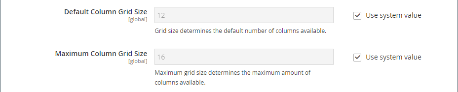

# Media - toewijzen

Gebruik het _inhoudstype van de Kaart_ om een kaart van [[!DNL Google Maps]  Platform ][1] aan het [[!DNL Page Builder]  stadium ](workspace.md#stage) toe te voegen. Bijvoorbeeld, zou u een kaart aan een blok kunnen toevoegen, en dan het blok toevoegen aan [ Ongeveer de pagina&#39;s van ons ](../content-design/pages.md#about-us) en [ Contact ](../getting-started/store-details.md#contact-us-form).

Om de meesten van [!DNL Google Maps] Platform te krijgen, kunt u de kaart aanpassen, uw opslagplaatsen benadrukken, en Google [ Plaatsen ][2] gebruiken om rijke informatie over uw opslag aan allen [!DNL Google Maps] toe te voegen.

## Voordelen van het insluiten van een Google-kaart

1. Biedt kopers een volledig bereik aan informatie over je bedrijf (telefoonnummer, website, revisies, sterrenwaarderingen, enzovoort) op je site.

1. Een Google-kaart markeert meestal nabijgelegen attracties, parken, restaurants, enzovoort. Deze informatie helpt uw klanten uw fysieke plaats bepalen en hun reis plannen.

1. Maakt het voor klanten gemakkelijk om het adres voor uw fysieke opslag te vinden zonder de behoefte om een nieuw browser venster te openen en uw plaats te verlaten.

1. Als u een keten van fysieke winkels hebt, kunt u door het toevoegen van een Google Map op uw site uw merkbekendheid en geloofwaardigheid in de vorm van gemarkeerde items vergroten.

{width="700" zoomable="yes"}

{{$include /help/_includes/page-builder-save-timeout.md}}

## Gereedschap Kaart

De kaarttoolbox verschijnt wanneer u over de kaartcontainer beweegt.

| Gereedschap | Pictogram | Beschrijving |
|--- |--- |--- |
| Verplaatsen | {width="25"} | Hiermee verplaatst u de kaart naar een andere positie in het werkgebied. |
| (label) | [!UICONTROL Map] | Identificeert de huidige inhoudscontainer als een kaart. Houd de muis boven de kaartcontainer om de gereedschapset te zien. |
| Instellingen | {width="25"} | Hiermee opent u de pagina Kaart bewerken, waarin u de eigenschappen van de kaart en de container kunt wijzigen. |
| Verbergen | {width="25"} | Hiermee verbergt u de huidige kaart. |
| Tonen | {width="25"} | Hiermee geeft u de verborgen kaart weer. |
| Dupliceren | {width="25"} | Hiermee maakt u een kopie van de kaart. |
| Verwijderen | {width="25"} | Hiermee verwijdert u de kaart uit het werkgebied. |

{style="table-layout:auto"}

{{$include /help/_includes/page-builder-hidden-element-note.md}}

## [!DNL Google Maps] voor uw beheerder configureren

Alvorens een kaart toe te voegen, moet u een [ rekening ][3] voor een vrije proef van [!DNL Google Maps] Platform eerst openen. De gratis proefversie duurt 12 maanden en omvat een krediet van € 300. Als je je creditering opgebruikt, factureert Google je account niet zonder je toestemming.

### Stap 1: De API-sleutel van [!DNL Google Maps] ophalen

Afhankelijk van het feit of u al een [!DNL Google Maps] -toets hebt, gebruikt u een van de volgende procedures om de API-sleutel te verkrijgen die vereist is voor de configuratie. Als u een [!DNL Google Maps] -sleutel wilt instellen, moet u een sitebeheerder zijn die geautoriseerd is om facturering voor uw account in te schakelen. Als u niet klaar bent om een [!DNL Google Maps] Platform-account in te stellen, kunt u deze stap overslaan en de tijdelijke kaart nu gebruiken.

1. Ga naar de [ Console van het Platform van Google Cloud ](https://cloud.google.com/console/google/maps-apis/overview).

1. Klik het project drop-down en selecteer of creeer het project waarvoor u een API sleutel wilt toevoegen.

1. Om uw API geloofsbrieven te vormen, volg de [ instructies ][4] in de [!DNL Google Maps] documenten.

1. Kopieer de API-sleutel naar het klembord.

### Stap 2: configureren [!DNL Google Maps] in [!DNL Commerce]

1. In _Admin_ sidebar, ga **[!UICONTROL Stores]** > _[!UICONTROL Settings]_>**[!UICONTROL Configuration]**.

1. Kies in het linkerdeelvenster onder _[!UICONTROL General]_de optie **[!UICONTROL Content Management]**.

1. Breid  **[!UICONTROL Advanced Content Tools]** uit.

   {width="600" zoomable="yes"}

   Voor meer informatie over de de configuratieopties van Hulpmiddelen van het Beheer van de Inhoud Geavanceerde, zie de [ Gids van de Verwijzing van de Configuratie ](../configuration-reference/general/content-management.md).

1. Plak voor **[!UICONTROL Google Maps API Key]** de sleutel die u in stap 1 hebt gekopieerd.

1. Klik op **[!UICONTROL Test Key]**.

   Als er een probleem is met uw sleutel, gaat u terug naar de [!DNL Google Maps] Platform-site om het probleem op te lossen. Probeer het vervolgens opnieuw.

1. Klik op **[!UICONTROL Save Config]** nadat de toets is geverifieerd.

## Een kaart toevoegen aan het werkgebied

1. Open de pagina, het blok of het dynamische blok naar de werkruimte van [!DNL Page Builder] .

1. Vouw **[!UICONTROL Media]** uit in het deelvenster [!DNL Page Builder] en sleep een tijdelijke aanduiding **[!UICONTROL Map]** naar het werkgebied.

   {width="600" zoomable="yes"}

   Als [!DNL Google Maps] Platform voor uw opslag wordt gevormd, verschijnt een kaart voor uw archiefplaats.

   ![[!DNL Google Maps]](./assets/pb-tutorial2-google-map.png){width="600" zoomable="yes"}

   Als het [!DNL Google Maps] Platform nog niet voor uw opslag wordt gevormd, verschijnt een placeholder kaart in plaats daarvan.

   ![[!DNL Google Maps] Placeholder ](./assets/pb-tutorial2-media-map-not-configured.png){width="600" zoomable="yes"}

## Een locatie voor een aangepaste kaart toevoegen

1. Beweeg over de kaartcontainer om toolbox te tonen en de _pictogram van Montages_ te kiezen ( {width="20"}).

1. Klik in de rechterbovenhoek van de pagina _[!UICONTROL Edit Map]_op **[!UICONTROL Add Location]**.

1. Voer de **[!UICONTROL Location Name]** in die u aan de pin op de kaart wilt koppelen.

1. Verzamel de locatiecoördinaten die u wilt gebruiken voor de aangepaste locatie.

   U kunt ook in het vak **[!UICONTROL Position]** het punt in de weergegeven kaart verslepen.

   Ga zo nodig naar [[!DNL Google Maps]][5] in een nieuw browservenster en gebruik een van de volgende methoden om de coördinaten op te halen:

   {width="600" zoomable="yes"}

   **Methode 1:** Exemplaar van URL

   - In de upper-left hoek, ga het adres in het **[!UICONTROL Search]** vakje in en klik het _Onderzoek_ ( {width="20"}) pictogram.

   - Kopieer de coördinaten in de URL en plak ze in een notedop.

   **Methode 2:** Exemplaar van &quot;wat hier is?&quot;

   - Klik met de rechtermuisknop op het rode punt dat de locatie op de kaart markeert en kies **[!UICONTROL What's here?]** in het menu.

   - Kopieer in het weergegeven label de tekst, inclusief de coördinaten, en plak de tekst in een notitiepad.

1. Voer in elk van de vakken **[!UICONTROL Coordinates]** de getallen zonder komma in.

   U kunt ook zoveel van de resterende informatie invoeren die u op de kaart beschikbaar wilt hebben.

1. Verwerk andere informatie die u aan de kaartlocatie wilt koppelen:

   | Optie | Beschrijving |
   | ------ | ----------- |
   | [!UICONTROL Phone Number] | Het telefoonnummer van de locatie. |
   | [!UICONTROL Street Address] | Het adres van de straat van de locatie. |
   | [!UICONTROL City] | De stad van de locatie. |
   | [!UICONTROL Region/State] | Het gebied of de staat van de plaats. |
   | [!UICONTROL Zip/Postal Code] | De postcode of postcode van de locatie. |
   | [!UICONTROL Country] | Het land van de locatie. |
   | [!UICONTROL Comment] | Opmerkingen die u wilt opnemen. |

   {style="table-layout:auto"}

1. Klik op **[!UICONTROL Save]** als de bewerking is voltooid.

   De nieuwe locatie wordt weergegeven op de kaart en in het locatieraster van de kaart op de pagina _[!UICONTROL Edit Map]_.

   ![[!DNL Page Builder] - hiermee wordt het locatieraster toegewezen ](./assets/pb-media-maps-settings-add-location-grid.png){width="600" zoomable="yes"}

## De kaart opmaken {#styling}

Met de wizard [!DNL Google Maps] Platformstijlen kunt u een van de zes vooraf gedefinieerde thema&#39;s toepassen of een aangepast thema maken. U kunt een JSON-bestand genereren met de stijleigenschappen van de kaart of een koppeling naar de gestileerde kaart.

### De kaartstijl wijzigen

1. In _Admin_ sidebar, ga **[!UICONTROL Stores]** > _[!UICONTROL Settings]_>**[!UICONTROL Configuration]**.

1. Kies in het linkerdeelvenster onder _[!UICONTROL General]_de optie **[!UICONTROL Content Management]**.

1. Breid  **[!UICONTROL Advanced Content Tools]** uit.

1. Onder het **[!UICONTROL Google Maps Style]** tekstvakje, klik [ creeer de Stijl van de Kaart ][6].

   Deze actie opent de [[!DNL Google Maps]  Tovenaar van de Stijlvorming van het Platform ][6] in een afzonderlijk lusje, waar u een stijl voor uw [!DNL Google Maps] project van het Platform kunt bepalen.

1. Klik op **[!UICONTROL Create a Style]** en volg de instructies.

   Klik op **[!UICONTROL Finish]** als de bewerking is voltooid.

1. Exporteer de voltooide stijl als JSON-code of als een URL zodat u deze aan de [!DNL Commerce] -configuratie kunt toevoegen.

   - **JSON**: Onder de doos met de geproduceerde code JSON, klik **[!UICONTROL Copy JSON]**.

   - **[!UICONTROL URL]**: Klik onder het vak met de gegenereerde URL op **[!UICONTROL Copy URL]** .

1. Keer aan uw browser Admin lusje terug en kleef de geproduceerde code of URL in het **vakje van de Stijl van de Kaarten van Google**.

   Als u een URL gebruikt, vervangt u de tijdelijke aanduiding `YOUR_API_KEY` door de API-sleutel van [!DNL Google Maps] . Deze URL is gekoppeld aan uw opgemaakte Google Map.

1. Klik in de rechterbovenhoek op **[!UICONTROL Save Config]** .

### De kaartinstellingen wijzigen

1. Beweeg over de kaartcontainer om de hulpmiddeldoos te tonen en het _pictogram van Montages_ te kiezen ( {width="20"}).

1. Wijzig desgewenst de basisinstellingen:

   | Optie | Beschrijving |
   | ------ | ----------- |
   | [!UICONTROL Height] | Hiermee geeft u de hoogte van de weergegeven kaart op in pixels. |
   | [!UICONTROL Show Controls] | Hiermee bepaalt u of de standaard Google Map-besturingselementen worden weergegeven. |

   {style="table-layout:auto"}

1. Wijzig desgewenst de instellingen voor _[!UICONTROL Advanced]_:

   - Kies een **[!UICONTROL Alignment]** als u de horizontale plaatsing wilt bepalen van de kaartinhoud die aan de container is toegevoegd:

     | Optie | Beschrijving |
     | ------ | ----------- |
     | `Default` | Hiermee past u de standaardinstelling voor uitlijning toe die is opgegeven in het stijlblad van het huidige thema. |
     | `Left` | Hiermee lijnt u de inhoud uit langs de linkerrand van de kaartcontainer, waarbij rekening wordt gehouden met de opgegeven opvulling. |
     | `Center` | Hiermee wordt de inhoud in het midden van de kaartcontainer uitgelijnd, waarbij rekening wordt gehouden met de opgegeven opvulling. |
     | `Right` | Hiermee lijnt u de inhoud uit langs de rechterrand van de kaartcontainer, waarbij rekening wordt gehouden met de opgegeven opvulling. |

     {style="table-layout:auto"}

   - Stel de stijl **[!UICONTROL Border]** in die op alle vier zijden van de kaartcontainer wordt toegepast:

     | Optie | Beschrijving |
     | ------ | ----------- |
     | `Default` | Past de standaardrandstijl toe die door het bijbehorende stijlblad wordt gespecificeerd. |
     | `None` | Geeft geen zichtbare indicatie van de containerranden. |
     | `Dotted` | De containerrand wordt weergegeven als een stippellijn. |
     | `Dashed` | De containerrand wordt weergegeven als een onderbroken lijn. |
     | `Solid` | De containerrand wordt weergegeven als een effen lijn. |
     | `Double` | De containerrand wordt weergegeven als een dubbele lijn. |
     | `Groove` | De containerrand wordt weergegeven als een gegroefde lijn. |
     | `Ridge` | De containerrand wordt weergegeven als een afgeronde lijn. |
     | `Inset` | De containerrand wordt weergegeven als een inzetlijn. |
     | `Outset` | De containerrand wordt weergegeven als een omtreklijn. |

     {style="table-layout:auto"}

   - Als u een andere randstijl dan `None` instelt, voert u de weergaveopties voor de rand in:

     {width="600" zoomable="yes"}

     | Optie | Beschrijving |
     | ------ |------------ |
     | [!UICONTROL Border Color] | Geef de kleur op door een staal te kiezen, op de kleurkiezer te klikken of door een geldige kleurnaam of een gelijkwaardige hexadecimale waarde in te voeren. |
     | [!UICONTROL Border Width] | Voer het aantal pixels in voor de lijnbreedte van de rand. |
     | [!UICONTROL Border Radius] | Voer het aantal pixels in om de grootte te bepalen van de straal die wordt gebruikt om elke hoek van de rand te afronden. |

     {style="table-layout:auto"}

   - (Optioneel) Geef de namen van **[!UICONTROL CSS classes]** op uit het huidige stijlblad dat u wilt toepassen op de kaartcontainer.

     Scheid meerdere klassennamen met een spatie.

   - Voer in pixels waarden in voor de **[!UICONTROL Margins and Padding]** om de buitenste marges en de binnenopvulling van de kaartcontainer op te geven.

     Ga elke overeenkomstige waarde in het diagram van de kaartcontainer in.

     | Containergebied | Beschrijving |
     | -------------- | ----------- |
     | [!UICONTROL Margins] | De hoeveelheid lege ruimte die wordt toegepast op de buitenrand van alle zijden van de container. |
     | [!UICONTROL Padding] | De hoeveelheid lege ruimte die wordt toegepast op de binnenrand van alle zijden van de container. |

     {style="table-layout:auto"}

     >[!NOTE]
     >
     >Opvulling is niet beschikbaar voor het inhoudstype Kaart.

1. Klik na afloop op **[!UICONTROL Save]** om de instellingen toe te passen en terug te keren naar de werkruimte van [!DNL Page Builder] .

### De rastergrootte wijzigen

De netgrootte bepaalt de grootte van de kaart met betrekking tot a [ kolom ](column.md) op het [!DNL Page Builder] stadium. De kaart is standaard 12 kolommen breed, met een maximum van 16 kolommen.

1. In _Admin_ sidebar, ga **[!UICONTROL Stores]** > _[!UICONTROL Settings]_>**[!UICONTROL Configuration]**.

1. Kies in het linkerdeelvenster onder _[!UICONTROL General]_de optie **[!UICONTROL Content Management]**.

1. Breid  **[!UICONTROL Advanced Content Tools]** uit.

1. Werk de rasteropties naar wens bij:

   >[!NOTE]
   >
   >Schakel indien nodig het selectievakje **[!UICONTROL Use system value]** uit om deze instellingen te wijzigen.

   - Voer bij **[!UICONTROL Default Column Grid Size]** een nieuwe waarde in voor de standaardgrootte van het raster.

   - Voer bij **[!UICONTROL Maximum Column Grid Size]** een nieuwe waarde in voor de standaard maximale rastergrootte.

   {width="600" zoomable="yes"}

1. Klik op **[!UICONTROL Save Config]** als de bewerking is voltooid.

[1]: https://cloud.google.com/maps-platform/
[2]: https://cloud.google.com/maps-platform/places/
[3]: https://cloud.google.com/maps-platform/user-guide/
[4]: https://developers.google.com/maps/documentation/javascript/get-api-key
[5]: https://www.google.com/maps
[6]: https://mapstyle.withgoogle.com/
