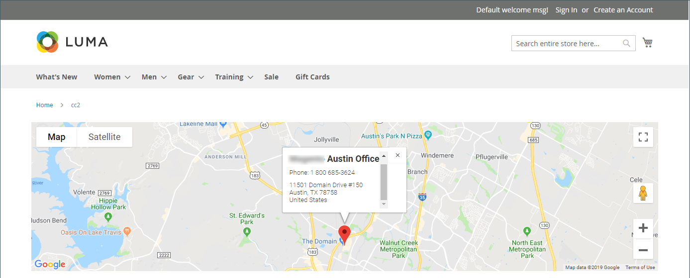
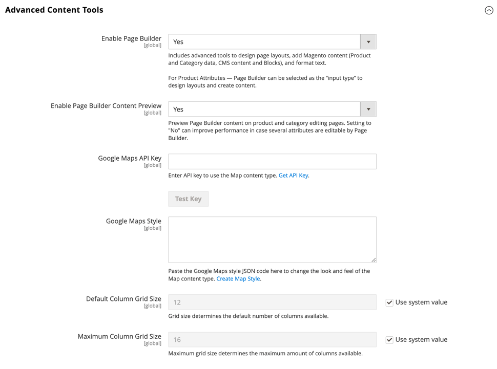

# Media - toewijzen

Gebruik de _Kaart_ inhoudstype om een kaart toe te voegen van [[!DNL Google Maps] Platform][1] aan de [[!DNL Page Builder] stadium](workspace.md#stage). U kunt bijvoorbeeld een kaart aan een blok toevoegen en vervolgens het blok aan het blok toevoegen [Over ons](../content-design/pages.md#about-us) en [Contact opnemen](../getting-started/store-details.md#contact-us-form) pagina&#39;s.

Om het meeste van te krijgen van [!DNL Google Maps] Platform, kunt u de kaart aanpassen, uw opslagplaatsen benadrukken en Google gebruiken [Plaatsen][2] om uitgebreide informatie over je winkel aan iedereen toe te voegen [!DNL Google Maps].

## Voordelen van het insluiten van een Google-kaart

1. Biedt kopers een volledig bereik aan informatie over je bedrijf (telefoonnummer, website, revisies, sterrenwaarderingen, enzovoort) op je site.

1. Een Google-kaart markeert meestal nabijgelegen attracties, parken, restaurants, enzovoort. Deze informatie helpt uw klanten uw fysieke plaats bepalen en hun reis plannen.

1. Maakt het voor klanten gemakkelijk om het adres voor uw fysieke opslag te vinden zonder de behoefte om een nieuw browser venster te openen en uw plaats te verlaten.

1. Als u een keten van fysieke winkels hebt, kunt u door het toevoegen van een Google Map op uw site uw merkbekendheid en geloofwaardigheid in de vorm van gemarkeerde items vergroten.

{width="700" zoomable="yes"}

{{$include /help/_includes/page-builder-save-timeout.md}}

## Gereedschap Kaart

De kaarttoolbox verschijnt wanneer u over de kaartcontainer beweegt.

| Gereedschap | Pictogram | Beschrijving |
|--- |--- |--- |
| Verplaatsen | {width="25"} | Hiermee verplaatst u de kaart naar een andere positie in het werkgebied. |
| (label) | [!UICONTROL Map] | Identificeert de huidige inhoudscontainer als een kaart. Houd de muis boven de kaartcontainer om de gereedschapset te zien. |
| Instellingen | {width="25"} | Hiermee opent u de pagina Kaart bewerken, waarin u de eigenschappen van de kaart en de container kunt wijzigen. |
| Verbergen | {width="25"} | Hiermee verbergt u de huidige kaart. |
| Tonen | {width="25"} | Hiermee geeft u de verborgen kaart weer. |
| Dupliceren | {width="25"} | Hiermee maakt u een kopie van de kaart. |
| Verwijderen | {width="25"} | Hiermee verwijdert u de kaart uit het werkgebied. |

{style="table-layout:auto"}

{{$include /help/_includes/page-builder-hidden-element-note.md}}

## Configureren [!DNL Google Maps] voor uw beheerder

Voordat u een kaart toevoegt, moet u eerst een [account][3] voor een gratis proces van [!DNL Google Maps] Platform. De gratis proefversie duurt 12 maanden en omvat een krediet van € 300. Als je je creditering opgebruikt, factureert Google je account niet zonder je toestemming.

### Stap 1: Krijg uw [!DNL Google Maps] API-sleutel

Afhankelijk van of u al een [!DNL Google Maps] -toets, gebruikt u een van de volgende procedures om de API-sleutel te verkrijgen die vereist is voor de configuratie. Als u een [!DNL Google Maps] sleutel, moet u een plaatsbeheerder zijn geautoriseerd om het factureren voor uw rekening toe te laten. Als u niet klaar bent om een [!DNL Google Maps] Platformaccount, kunt u deze stap overslaan en voorlopig de tijdelijke kaart gebruiken.

1. Ga naar de [Google Cloud Platform Console](https://cloud.google.com/console/google/maps-apis/overview).

1. Klik het project drop-down en selecteer of creeer het project waarvoor u een API sleutel wilt toevoegen.

1. Om uw API geloofsbrieven te vormen, volg [instructies][4] in de [!DNL Google Maps] documenten.

1. Kopieer de API-sleutel naar het klembord.

### Stap 2: configureren [!DNL Google Maps] in [!DNL Commerce]

1. In de _Beheerder_ zijbalk, ga naar **[!UICONTROL Stores]** > _[!UICONTROL Settings]_>**[!UICONTROL Configuration]**.

1. In het linkerdeelvenster onder _[!UICONTROL General]_, kiest u **[!UICONTROL Content Management]**.

1. Uitbreiden  **[!UICONTROL Advanced Content Tools]**.

   {width="600" zoomable="yes"}

   Voor meer informatie over de configuratieopties van Geavanceerde hulpmiddelen van het Beheer van de Inhoud, zie [Referentiehandleiding voor configuratie](../configuration-reference/general/content-management.md).

1. Voor **[!UICONTROL Google Maps API Key]** plakken, plakt u de sleutel die u in stap 1 hebt gekopieerd.

1. Klik op **[!UICONTROL Test Key]**.

   Als er een probleem is met uw sleutel, keert u terug naar de [!DNL Google Maps] Platformsite om het probleem op te lossen. Probeer het vervolgens opnieuw.

1. Klik op **[!UICONTROL Save Config]**.

## Een kaart toevoegen aan het werkgebied

1. Open de pagina, het blok of het dynamische blok voor [!DNL Page Builder] werkruimte.

1. In de [!DNL Page Builder] deelvenster, uitvouwen **[!UICONTROL Media]** en sleep een **[!UICONTROL Map]** tijdelijke aanduiding naar het werkgebied.

   {width="600" zoomable="yes"}

   Indien [!DNL Google Maps] Platform is geconfigureerd voor uw winkel. Er wordt een kaart weergegeven voor uw winkellocatie.

   ![[!DNL Google Maps]](./assets/pb-tutorial2-google-map.png){width="600" zoomable="yes"}

   Indien [!DNL Google Maps] Platform is nog niet geconfigureerd voor uw winkel, maar er wordt een tijdelijke kaart weergegeven.

   ![[!DNL Google Maps] Plaatsaanduiding](./assets/pb-tutorial2-media-map-not-configured.png){width="600" zoomable="yes"}

## Een locatie voor een aangepaste kaart toevoegen

1. Houd de muisaanwijzer boven de kaartcontainer om de gereedschapset weer te geven en kies de optie _Instellingen_ ( {width="20"} ).

1. In de rechterbovenhoek van het dialoogvenster _[!UICONTROL Edit Map]_pagina, klikt u **[!UICONTROL Add Location]**.

1. Voer de **[!UICONTROL Location Name]** dat u aan de speld op de kaart wilt worden geassocieerd.

1. Verzamel de locatiecoördinaten die u wilt gebruiken voor de aangepaste locatie.

   Als alternatief, in **[!UICONTROL Position]** kunt u het punt in de weergegeven kaart verslepen.

   Ga zo nodig naar [[!DNL Google Maps]][5] in een nieuw browservenster en gebruik een van de volgende methoden om de coördinaten op te halen:

   {width="600" zoomable="yes"}

   **Methode 1:** Kopiëren van URL

   - Voer in de linkerbovenhoek het adres in het dialoogvenster **[!UICONTROL Search]** en klik op _Zoeken_ ( {width="20"} ).

   - Kopieer de coördinaten in de URL en plak ze in een notedop.

   **Methode 2:** Kopie van &quot;Wat is hier?&quot;

   - Klik met de rechtermuisknop op het rode punt dat de locatie op de kaart markeert en kies **[!UICONTROL What's here?]** in het menu.

   - Kopieer in het weergegeven label de tekst, inclusief de coördinaten, en plak de tekst in een notitiepad.

1. Voer in elk van de **[!UICONTROL Coordinates]** vakken.

   U kunt ook zoveel van de resterende informatie invoeren die u op de kaart beschikbaar wilt hebben.

1. Verwerk andere informatie die u aan de kaartlocatie wilt koppelen:

   | Optie | Beschrijving |
   | ------ | ----------- |
   | [!UICONTROL Phone Number] | Het telefoonnummer van de locatie. |
   | [!UICONTROL Street Address] | Het adres van de straat van de locatie. |
   | [!UICONTROL City] | De stad van de locatie. |
   | [!UICONTROL Region/State] | Het gebied of de staat van de plaats. |
   | [!UICONTROL Zip/Postal Code] | De postcode of postcode van de locatie. |
   | [!UICONTROL Country] | Het land van de locatie. |
   | [!UICONTROL Comment] | Opmerkingen die u wilt opnemen. |

   {style="table-layout:auto"}

1. Klik op **[!UICONTROL Save]**.

   De nieuwe locatie wordt weergegeven op de kaart en in het locatieraster van de kaart op de _[!UICONTROL Edit Map]_pagina.

   ![[!DNL Page Builder] - locatieraster met kaarten](./assets/pb-media-maps-settings-add-location-grid.png){width="600" zoomable="yes"}

## De kaart opmaken {#styling}

Gebruik de [!DNL Google Maps] De Tovenaar van de Stijl van het platform om één van zes vooraf bepaalde thema&#39;s toe te passen of een douanethema tot stand te brengen. U kunt een JSON-bestand genereren met de stijleigenschappen van de kaart of een koppeling naar de gestileerde kaart.

### De kaartstijl wijzigen

1. In de _Beheerder_ zijbalk, ga naar **[!UICONTROL Stores]** > _[!UICONTROL Settings]_>**[!UICONTROL Configuration]**.

1. In het linkerdeelvenster onder _[!UICONTROL General]_, kiest u **[!UICONTROL Content Management]**.

1. Uitbreiden  **[!UICONTROL Advanced Content Tools]**.

1. Onder de **[!UICONTROL Google Maps Style]** tekstvak, klik op [Kaartstijl maken][6].

   Deze handeling opent de [[!DNL Google Maps] Wizard Platformstijlen][6] op een apart tabblad kunt u een stijl definiëren voor uw [!DNL Google Maps] Platformproject.

1. Klikken **[!UICONTROL Create a Style]** en volgt u de geleverde instructies.

   Klik op **[!UICONTROL Finish]**.

1. De voltooide stijl als code JSON of als URL uitvoeren zodat u het aan kunt toevoegen [!DNL Commerce] configuratie.

   - **JSON**: Klik onder het vak met de gegenereerde JSON-code op **[!UICONTROL Copy JSON]**.

   - **[!UICONTROL URL]**: Klik onder het vak met de gegenereerde URL op **[!UICONTROL Copy URL]**.

1. Ga terug naar het tabblad Admin-browser en plak de gegenereerde code of URL in het dialoogvenster **Google Maps-stijl** doos.

   Als u een URL gebruikt, vervangt u de `YOUR_API_KEY` plaatsaanduiding met uw [!DNL Google Maps] API-sleutel. Deze URL is gekoppeld aan uw opgemaakte Google Map.

1. Klik in de rechterbovenhoek op **[!UICONTROL Save Config]**.

### De kaartinstellingen wijzigen

1. Houd de aanwijzer boven de kaartcontainer om het gereedschapvak weer te geven en kies de optie _Instellingen_ ( {width="20"} ).

1. Wijzig desgewenst de basisinstellingen:

   | Optie | Beschrijving |
   | ------ | ----------- |
   | [!UICONTROL Height] | Hiermee geeft u de hoogte van de weergegeven kaart op in pixels. |
   | [!UICONTROL Show Controls] | Hiermee bepaalt u of de standaard Google Map-besturingselementen worden weergegeven. |

   {style="table-layout:auto"}

1. Wijzig de _[!UICONTROL Advanced]_instellingen naar wens:

   - Als u de horizontale positionering wilt bepalen van de kaartinhoud die aan de container is toegevoegd, kiest u een **[!UICONTROL Alignment]**:

     | Optie | Beschrijving |
     | ------ | ----------- |
     | `Default` | Hiermee past u de standaardinstelling voor uitlijning toe die is opgegeven in het stijlblad van het huidige thema. |
     | `Left` | Hiermee lijnt u de inhoud uit langs de linkerrand van de kaartcontainer, waarbij rekening wordt gehouden met de opgegeven opvulling. |
     | `Center` | Hiermee wordt de inhoud in het midden van de kaartcontainer uitgelijnd, waarbij rekening wordt gehouden met de opgegeven opvulling. |
     | `Right` | Hiermee lijnt u de inhoud uit langs de rechterrand van de kaartcontainer, waarbij rekening wordt gehouden met de opgegeven opvulling. |

     {style="table-layout:auto"}

   - Stel de **[!UICONTROL Border]** stijl toegepast op alle vier zijden van de kaartcontainer:

     | Optie | Beschrijving |
     | ------ | ----------- |
     | `Default` | Past de standaardrandstijl toe die door het bijbehorende stijlblad wordt gespecificeerd. |
     | `None` | Geeft geen zichtbare indicatie van de containerranden. |
     | `Dotted` | De containerrand wordt weergegeven als een stippellijn. |
     | `Dashed` | De containerrand wordt weergegeven als een onderbroken lijn. |
     | `Solid` | De containerrand wordt weergegeven als een effen lijn. |
     | `Double` | De containerrand wordt weergegeven als een dubbele lijn. |
     | `Groove` | De containerrand wordt weergegeven als een gegroefde lijn. |
     | `Ridge` | De containerrand wordt weergegeven als een afgeronde lijn. |
     | `Inset` | De containerrand wordt weergegeven als een inzetlijn. |
     | `Outset` | De containerrand wordt weergegeven als een omtreklijn. |

     {style="table-layout:auto"}

   - Als u een andere randstijl dan `None`, vult u de weergaveopties voor de rand in:

     {width="600" zoomable="yes"}

     | Optie | Beschrijving |
     | ------ |------------ |
     | [!UICONTROL Border Color] | Geef de kleur op door een staal te kiezen, op de kleurkiezer te klikken of door een geldige kleurnaam of een gelijkwaardige hexadecimale waarde in te voeren. |
     | [!UICONTROL Border Width] | Voer het aantal pixels in voor de lijnbreedte van de rand. |
     | [!UICONTROL Border Radius] | Voer het aantal pixels in om de grootte te bepalen van de straal die wordt gebruikt om elke hoek van de rand te afronden. |

     {style="table-layout:auto"}

   - (Optioneel) Geef de namen op van **[!UICONTROL CSS classes]** van het huidige stijlblad toe te passen op de kaartcontainer.

     Scheid meerdere klassennamen met een spatie.

   - Voer in pixels waarden in voor de **[!UICONTROL Margins and Padding]** om de buitenmarges en de binnenopvulling van de kaartcontainer op te geven.

     Ga elke overeenkomstige waarde in het diagram van de kaartcontainer in.

     | Containergebied | Beschrijving |
     | -------------- | ----------- |
     | [!UICONTROL Margins] | De hoeveelheid lege ruimte die wordt toegepast op de buitenrand van alle zijden van de container. |
     | [!UICONTROL Padding] | De hoeveelheid lege ruimte die wordt toegepast op de binnenrand van alle zijden van de container. |

     {style="table-layout:auto"}

     >[!NOTE]
     >
     >Opvulling is niet beschikbaar voor het inhoudstype Kaart.

1. Klik op **[!UICONTROL Save]** om de instellingen toe te passen en terug te keren naar de [!DNL Page Builder] werkruimte.

### De rastergrootte wijzigen

De rastergrootte bepaalt de grootte van de kaart voor een [kolom](column.md) op de [!DNL Page Builder] in het werkgebied. De kaart is standaard 12 kolommen breed, met een maximum van 16 kolommen.

1. In de _Beheerder_ zijbalk, ga naar **[!UICONTROL Stores]** > _[!UICONTROL Settings]_>**[!UICONTROL Configuration]**.

1. In het linkerdeelvenster onder _[!UICONTROL General]_, kiest u **[!UICONTROL Content Management]**.

1. Uitbreiden  **[!UICONTROL Advanced Content Tools]**.

1. Werk de rasteropties naar wens bij:

   >[!NOTE]
   >
   >Wis indien nodig de **[!UICONTROL Use system value]** Schakel het selectievakje in om deze instellingen te wijzigen.

   - Voor **[!UICONTROL Default Column Grid Size]** Voer een nieuwe waarde in voor de standaardgrootte van het raster.

   - Voor **[!UICONTROL Maximum Column Grid Size]** Voer een nieuwe waarde in voor de standaardmaximale rastergrootte.

   {width="600" zoomable="yes"}

1. Klik op **[!UICONTROL Save Config]**.

[1]: https://cloud.google.com/maps-platform/
[2]: https://cloud.google.com/maps-platform/places/
[3]: https://cloud.google.com/maps-platform/user-guide/
[4]: https://developers.google.com/maps/documentation/javascript/get-api-key
[5]: https://www.google.com/maps
[6]: https://mapstyle.withgoogle.com/
