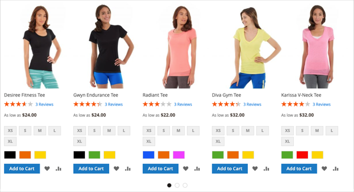
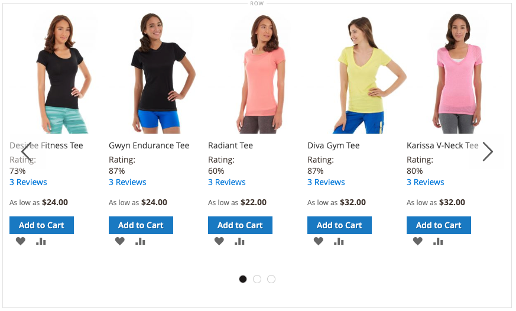

# Inhoud toevoegen - Producten

Gebruik de _Producten_ inhoudstype om een lijst met producten aan de [[!DNL Page Builder] stadium](workspace.md#stage)met een raster- of carrousellay-out. Gebruik de [Inhoud toevoegen - Blokkeren](block.md) om het blok op de [!DNL Page Builder] en plaatst vervolgens een productlijst in het blok. U kunt de productlijst ook rechtstreeks in een rij op een pagina toevoegen.

## Richtlijnen voor het gebruik van de productcarrousel

De productcarrousel biedt een krachtige en boeiende manier om uw producten te laten zien. Om er het beste uit te halen, worden de volgende richtlijnen geadviseerd:

- Voeg productcarrousels rechtstreeks toe aan containers met paginabreedte, zoals rijen, tabbladen of lay-outs met één kolom. Door lay-outs met paginabreedte kunt u uw producten het beste weergeven. [!DNL Page Builder] Hiermee verkleint u het aantal weergegeven producten, afhankelijk van de breedte van de pagina en niet van de breedte van de container.

- Voeg geen productcarrousel aan een smalle kolom toe. Zoals vermeld, [!DNL Page Builder]Hiermee bepaalt u standaard het aantal producten dat wordt weergegeven op basis van de paginabreedte, niet de kolombreedte.

- Als u wilt dat de productcarrousel continu automatisch schuift, stelt u beide in **[!UICONTROL Autoplay]** en **[!UICONTROL Infinite Loop]** tot `Yes`. Als Automatisch afspelen is ingesteld op `Yes` maar oneindige lus is ingesteld op `No`, wordt automatisch schuiven gestopt aan het einde van de lijst met producten.

- Stel de **[!UICONTROL Carousel Mode]** tot `Continuous` één product tegelijk in de carrousel markeren, centreren en schuiven. De andere producten zijn zichtbaar in de lijst, maar transparant om het gecentreerde product te benadrukken.

  {width="600"}

- Als u in de carrousel maximaal vijf producten tegelijk wilt weergeven en schuiven, houdt u de **[!UICONTROL Carousel Mode]** instellen op `Default`.

  {width="600"}

De volgende instructies tonen hoe te om een lijst van Producten aan een blok toe te voegen. U kunt vervolgens een [widget](../content-design/widgets.md) om het blok bij een specifieke plaats op om het even welke pagina in uw opslag te plaatsen.

{{$include /help/_includes/page-builder-save-timeout.md}}

## De werkset Producten

| Gereedschap | Pictogram | Beschrijving |
| --------- | ------------- | ----------------- |
| Verplaatsen | {width="25"} | Hiermee verplaatst u de productcontainer en de inhoud ervan naar een andere positie in het werkgebied. |
| Instellingen | {width="25"} | Hiermee opent u de _Producten bewerken_ pagina, waar u de lijst met producten kunt kiezen en de eigenschappen van de container kunt wijzigen. |
| Verbergen | {width="25"} | Verbergt de huidige productcontainer en de inhoud ervan. |
| Tonen | {width="25"} | Toont de container van de verborgen producten en zijn inhoud. |
| Dupliceren | {width="25"} | Hiermee maakt u een kopie van de container met producten en de inhoud ervan. |
| Verwijderen | {width="25"} | Hiermee verwijdert u de productcontainer en de inhoud ervan uit het werkgebied. |

{style="table-layout:auto"}

{{$include /help/_includes/page-builder-hidden-element-note.md}}

## Een productlijstblok maken

1. Op de _Beheerder_ zijbalk, ga naar **[!UICONTROL Content]** > _[!UICONTROL Elements]_>**[!UICONTROL Blocks]**.

1. Klik op **[!UICONTROL Add New Block]**.

1. Voer de **[!UICONTROL Block Title]** en **[!UICONTROL Identifier]**.

1. Kies de optie **[!UICONTROL Store View]** wanneer het blok beschikbaar moet zijn.

1. Omlaag schuiven en klikken **[!UICONTROL Edit with Page Builder]** of in het voorvertoningsgebied van de inhoud om het dialoogvenster [!DNL Page Builder] werkruimte.

1. In de [!DNL Page Builder] deelvenster, uitvouwen **[!UICONTROL Add Content]** en sleep een **[!UICONTROL Products]** tijdelijke aanduiding naar het werkgebied.

   {width="600" zoomable="yes"}

## De container voor de lijst met producten configureren

Houd de muisaanwijzer boven de lege huls _Producten_ -container om de gereedschapset weer te geven en op de knop _Instellingen_ ({width="20"} ).

{width="500" zoomable="yes"}

Voltooi de _Instellingen_ volgens de volgende punten:

### Weergave

1. Om te bepalen hoe de lijst met producten op de pagina wordt weergegeven, kiest u een van de weergavetypen:

   | Type | Beschrijving |
   | ---- | ----------- |
   | Productraster | Hiermee geeft u de producten weer in een raster met vijf producten per rij (standaard), met zoveel rijen als nodig zijn om het nummer weer te geven dat is ingevoerd in het dialoogvenster **[!UICONTROL Number of Products to Display]** instellen. |
   | Product Carousel | Geeft de producten in een carrousel weer (ook wel schuifregelaar genoemd). De carrousel bevat maximaal vijf producten per dia.   **Waarschuwing reactie**: Als u deze weergave selecteert, kunt u het inhoudssoort Producten het beste rechtstreeks toevoegen aan een rij, tab of lay-out met één kolom waarop wordt gereageerd, waarbij minder producten per zijde op kleinere schermen worden weergegeven. Als u het aan inhoudstypes toevoegt die smaller zijn dan de breedte van de pagina (zoals een smalle kolom), toont de carrousel meer producten per dia dan de container toestaat, ongeacht de schermgrootte. |

   {style="table-layout:auto"}

   {width="300"}

   Als u de productcarrousel kiest, moet u ook de [Carousel-instellingen](#carousel-settings).

1. Voor **[!UICONTROL Select Products By]** kiest u de methode voor de selectie van de producten:

   U kunt uw producten op categorie, SKU, of voorwaarde selecteren. Deze opties sluiten elkaar uit. U kunt bijvoorbeeld niet de optie Categorie selecteren, de Categoriekiezer gebruiken en vervolgens overschakelen op de optie Voorwaarde om enkele voorwaarden toe te voegen. Uw producten worden alleen geselecteerd op basis van wat u instelt voor _één_ van deze drie opties.

   - **[!UICONTROL Category]** - Kies deze optie als u producten in een geselecteerde categorie wilt weergeven.

     {width="500"}

     Als deze optie is geselecteerd, wordt een **[!UICONTROL Category]** kiezer. Klik op de pijl en boor omlaag om de productcategorie te kiezen die u wilt weergeven. In het dialoogvenster [!DNL Commerce] monstergegevens, inboren en selecteren van de _Vrouwen > Tops > Teeën_ geeft alle producten voor die categorie weer.

     {width="500"}

   - **[!UICONTROL SKU]** - Kies deze optie om producten weer te geven met een of meer SKU&#39;s

     Als deze optie is geselecteerd, wordt een **[!UICONTROL Product SKUs]** in het tekstvak waarin u een lijst met SKU&#39;s moet opgeven die door komma&#39;s worden gescheiden.

     {width="500"}

   - **[!UICONTROL Condition]** - Kies deze optie om producten weer te geven onder een of meer voorwaarden die u definieert.

     Als deze optie is geselecteerd, zijn er gereedschappen beschikbaar waarmee u voorwaarden kunt toevoegen aan de selectie van uw producten. U kunt bijvoorbeeld alleen producten selecteren waarvoor de optie Geslacht is ingesteld op Unisex.

     {width="500"}

     >[!NOTE]
     >
     >Als u de optie Categorie of SKU selecteert, kunt u **[!UICONTROL Sort By]** optie van `Position`. Met deze sorteeroptie worden de producten in dezelfde volgorde weergegeven als in de catalogus. 
     >
     >Als u voor de optie Categorie sorteert op positie, worden de producten in dezelfde volgorde weergegeven als in de catalogus. Voor de optie SKU geeft het sorteren op positie de producten in de volgorde weer dat u ze in de **[!UICONTROL Product SKUs]** textbox.

1. Voor **[!UICONTROL Sort By]** kiest u de sorteervolgorde voor de producten in de lijst:

   | Optie | Beschrijving |
   | ------ | ----------- |
   | `Position` (alleen voor opties voor Categorie en SKU) | Als u de optie Categorie selecteert, worden de producten in dezelfde volgorde weergegeven als de positie in de catalogus. Wanneer u de optie SKU selecteert, toont de Positie producten in de zelfde orde zoals SKUs binnen het van het Product SKUs textbox. |
   | `Newest products first` | Sorteert producten door de datum dat zij aan de catalogus werden toegevoegd, tonend de producten met de meest recente ingangsdata eerst. |
   | `Oldest products first` | Sorteert producten door de datum dat zij aan de catalogus werden toegevoegd, tonend de producten met de oudste ingangsdata eerst. |
   | `Name: A - Z` | Sorteert producten in alfabetische volgorde. |
   | `Name: Z - A` | Sorteert producten in omgekeerde alfabetische volgorde. |
   | `SKU: ascending` | Sorteert producten op SKU in alfanumerieke orde. |
   | `SKU: descending` | Sorteert producten door SKU in omgekeerde alfanumerieke orde. |
   | `Stock: low stock first` | Sorteert producten van de laagste tot de hoogste beschikbare voorraad. |
   | `Stock: high stock first` | Sorteert producten van de hoogste aan de laagste beschikbare voorraad. |
   | `Price: high to low` | Sorteert producten van hoogste aan laagste prijs. |
   | `Price: low to high` | Sorteert producten van laagste tot hoogste prijs. |

   {style="table-layout:auto"}

   {width="300"}

1. Voer de **[!UICONTROL Number of Products to Display]** in de carrousel of het raster.

   Waarden kunnen afkomstig zijn van `1` tot `999`. De standaardwaarde is `5` voor een raster en `20` voor een carrousel.

   >[!NOTE]
   >
   >Sommige producten in de instellingen Categorie, SKU of Voorwaarde worden mogelijk niet weergegeven in het raster of de carrousel van uw producten. Bijvoorbeeld, gehandicapte producten, producten die als niet zichtbaar worden gemerkt, uit-van-voorraad producten, en producten die aan een andere website worden toegewezen worden niet getoond.

   >[!IMPORTANT]
   >
   >De prijzen voor configureerbare, gegroepeerde en gebundelde (dynamische prijs) producten zijn ongedefinieerd in Admin. Deze producten worden daarom niet weergegeven in het dialoogvenster **[!UICONTROL Preview]** indien de producten naar prijs worden gefilterd. Deze producten kunnen niet correct in het **[!UICONTROL Preview]** indien besteld door de prijs.

### Carousel-instellingen

1. Als u wilt bepalen hoe de producten in de carrousel worden weergegeven, kiest u de optie **[!UICONTROL Carousel Mode]**:

   | Optie | Beschrijving |
   | ------ | ----------- |
   | `Default` | In de carrousel worden standaard vijf producten per dia weergegeven en wordt dit aantal indien nodig responsief verlaagd. |
   | `Continuous` | De carrousel geeft standaard vijf producten per dia weer (met de helft van een product rechts en links), maar centreert en verschuift één product tegelijk in een oneindige lus. De producten aan het recht en de linkerzijde van het gecentreerde product worden verduisterd zodat het centrumproduct wordt benadrukt. |

   {style="table-layout:auto"}

   Als u tussen deze twee modi schakelt, blijven de andere carrouselinstellingen behouden, behalve de **[!UICONTROL Infinite Loop]** instellen, die altijd is ingesteld op `Yes` in de modus Doorlopend en het veld is uitgeschakeld.

   {width="600" zoomable="yes"}

1. Stel, indien nodig, de **[!UICONTROL Autoplay]** optie voor `Yes`.

   Wanneer Automatisch afspelen is ingeschakeld, wordt automatisch door de carrousel geschoven wanneer de pagina wordt geladen. Als u de standaardinstelling (`No`), moet de klant op de dianavigatie (punten of pijlen) klikken om elke dia in de juiste volgorde weer te geven.

   Als u deze functie inschakelt, voert u **[!UICONTROL Autoplay Speed]** om de vertraging in milliseconden tussen elke dia te specificeren. De standaardwaarde is `4000` (4 seconden).

1. Stel, indien nodig, de **[!UICONTROL Infinite Loop]** optie voor `Yes`.

   Als een oneindige lus is ingeschakeld, wordt de presentatie eindeloos opnieuw afgespeeld terwijl de pagina is geopend. Als u de standaardinstelling (`No`), wordt de presentatie slechts eenmaal afgespeeld.

   >[!NOTE]
   >
   >Als u **[!UICONTROL Infinite Loop]** tot `No` en **[!UICONTROL Autoplay]** instellen op `Yes`, stopt het automatisch afspelen aan het einde van het aantal producten dat moet worden weergegeven.

1. Stel, indien nodig, de **[!UICONTROL Show Arrows]** optie voor `Yes`.

   Als deze optie is ingeschakeld, bevat elke dia _next_ en _vorige_ navigatiepijlen aan de linker- en rechterkant. Als u de standaardinstelling (`No`), worden in de dia&#39;s geen navigatiepijlen weergegeven.

1. Stel, indien nodig, de **[!UICONTROL Show Dots]** optie voor `No`.

   Wanneer ingesteld op de standaardinstelling (`Yes`), worden navigatiepunten weergegeven onder aan de schuifregelaar. Als u deze instelling uitschakelt, geeft de schuifregelaar carrousel geen navigatiepunten weer.

### Geavanceerd

1. Als u de positie van de lijst Producten in de bovenliggende container wilt bepalen, kiest u de optie **[!UICONTROL Alignment]**:

   | Optie | Beschrijving |
   | ------ | ----------- |
   | `Default` | Hiermee past u de standaardinstelling voor uitlijning toe die is opgegeven in het stijlblad van het huidige thema. |
   | `Left` | Hiermee lijnt u de lijst uit langs de linkerrand van de bovenliggende container, waarbij rekening wordt gehouden met de opgegeven opvulling. |
   | `Center` | Hiermee lijnt u de lijst in het midden van de bovenliggende container uit, rekening houdend met de opgegeven opvulling. |
   | `Right` | Hiermee lijnt u de lijst uit langs de rechterrand van de bovenliggende container, waarbij rekening wordt gehouden met de opgegeven opvulling. |

   {style="table-layout:auto"}

1. Stel de **[!UICONTROL Border]** stijl die wordt toegepast op alle vier zijden van de container van Producten:

   | Optie | Beschrijving |
   | ------ | ----------- |
   | `Default` | Past de standaardrandstijl toe die door het bijbehorende stijlblad wordt gespecificeerd. |
   | `None` | Geeft geen zichtbare indicatie van de containerranden. |
   | `Dotted` | De containerrand wordt weergegeven als een stippellijn. |
   | `Dashed` | De containerrand wordt weergegeven als een onderbroken lijn. |
   | `Solid` | De containerrand wordt weergegeven als een effen lijn. |
   | `Double` | De containerrand wordt weergegeven als een dubbele lijn. |
   | `Groove` | De containerrand wordt weergegeven als een gegroefde lijn. |
   | `Ridge` | De containerrand wordt weergegeven als een afgeronde lijn. |
   | `Inset` | De containerrand wordt weergegeven als een inzetlijn. |
   | `Outset` | De containerrand wordt weergegeven als een omtreklijn. |

   {style="table-layout:auto"}

1. Als u een andere randstijl dan `None`, vult u de weergaveopties voor de rand in:

   | Optie | Beschrijving |
   | ------ |------------ |
   | [!UICONTROL Border Color] | Geef de kleur op door een staal te kiezen, op de kleurkiezer te klikken of door een geldige kleurnaam of een gelijkwaardige hexadecimale waarde in te voeren. |
   | [!UICONTROL Border Width] | Voer het aantal pixels in voor de lijnbreedte van de rand. |
   | [!UICONTROL Border Radius] | Voer het aantal pixels in om de grootte te bepalen van de straal die wordt gebruikt om elke hoek van de rand te afronden. |

   {style="table-layout:auto"}

1. (Optioneel) Geef de namen op van **[!UICONTROL CSS classes]** in het huidige stijlblad toe te passen op de container.

   Scheid meerdere klassennamen met een spatie.

1. Voer in pixels waarden in voor de **[!UICONTROL Margins and Padding]** om de buitenmarges en de binnenopvulling van de container van Producten te bepalen.

   Voer de overeenkomende waarden in het diagram in.

   | Containergebied | Beschrijving |
   | -------------- | ----------- |
   | [!UICONTROL Margins] | De hoeveelheid lege ruimte die wordt toegepast op de buitenrand van alle zijden van de container. Opties: `Top` / `Right` / `Bottom` / `Left` |
   | [!UICONTROL Padding] | De hoeveelheid lege ruimte die wordt toegepast op de binnenrand van alle zijden van de container. Opties: `Top` / `Right` / `Bottom` / `Left` |

## Opslaan en voorvertonen in het werkgebied

Klik in de rechterbovenhoek op **[!UICONTROL Save]** om de instellingen toe te passen en terug te keren naar de [!DNL Page Builder] werkruimte.

Als u een productcarrousel vormde, zou het aan het volgende voorbeeld gelijkaardig moeten kijken:

{width="600"}

U kunt nu een [widget](../content-design/widgets.md) om dit blok te plaatsen waar u het in de winkel wilt verschijnen. U kunt ook [Inhoud toevoegen - Blokkeren](block.md) om het blok toe te voegen aan een bestaande pagina, tab of blok.
