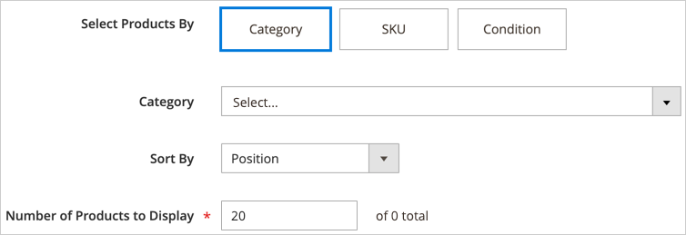

# Inhoud toevoegen - Producten

Gebruik het _inhoudstype van Producten_ om een lijst van producten aan het [[!DNL Page Builder]  stadium ](workspace.md#stage) toe te voegen, gebruikend of een net of carrousellay-out. Gebruik [ toevoegen Inhoud - het hulpmiddel van het Blok ](block.md) om het blok op het [!DNL Page Builder] stadium te plaatsen en dan een productlijst binnen het blok te plaatsen. U kunt de productlijst ook rechtstreeks in een rij op een pagina toevoegen.

## Richtlijnen voor het gebruik van de productcarrousel

De productcarrousel biedt een krachtige en boeiende manier om uw producten te laten zien. Om er het beste uit te halen, worden de volgende richtlijnen geadviseerd:

- Voeg productcarrousels rechtstreeks toe aan containers met paginabreedte, zoals rijen, tabbladen of lay-outs met één kolom. Door lay-outs met paginabreedte kunt u uw producten het beste weergeven. [!DNL Page Builder] vermindert het aantal producten dat wordt weergegeven, afhankelijk van de breedte van de pagina, niet de breedte van de container.

- Voeg geen productcarrousel aan een smalle kolom toe. Zoals vermeld, bepaalt [!DNL Page Builder], door gebrek, het aantal producten aan vertoning gebaseerd op de paginabreedte, niet de kolombreedte.

- Stel zowel **[!UICONTROL Autoplay]** als **[!UICONTROL Infinite Loop]** in op `Yes` als u wilt dat de productcarrousel continu automatisch schuift. Als Automatisch afspelen is ingesteld op `Yes` maar de optie Oneindige lus is ingesteld op `No` , stopt automatisch schuiven aan het einde van de lijst met producten.

- Stel **[!UICONTROL Carousel Mode]** in op `Continuous` om één product tegelijk in de carrousel te markeren, centreren en schuiven. De andere producten zijn zichtbaar in de lijst, maar transparant om het gecentreerde product te benadrukken.

  {width="600"}

- Als u in de carrousel maximaal vijf producten tegelijk wilt weergeven en schuiven, stelt u de **[!UICONTROL Carousel Mode]** in op `Default` .

  {width="600"}

De volgende instructies tonen hoe te om een lijst van Producten aan een blok toe te voegen. U kunt a [ widget ](../content-design/widgets.md) dan gebruiken om het blok bij een specifieke plaats op om het even welke pagina in uw opslag te plaatsen.

{{$include /help/_includes/page-builder-save-timeout.md}}

## De werkset Producten

| Gereedschap | Pictogram | Beschrijving |
| --------- | ------------- | ----------------- |
| Verplaatsen | {width="25"} | Hiermee verplaatst u de productcontainer en de inhoud ervan naar een andere positie in het werkgebied. |
| Instellingen | {width="25"} | Opent _uitgeeft Producten_ pagina, waar u de productlijst kunt kiezen en de eigenschappen van de container veranderen. |
| Verbergen | {width="25"} | Verbergt de huidige productcontainer en de inhoud ervan. |
| Tonen | {width="25"} | Toont de container van de verborgen producten en zijn inhoud. |
| Dupliceren | {width="25"} | Hiermee maakt u een kopie van de container met producten en de inhoud ervan. |
| Verwijderen | {width="25"} | Hiermee verwijdert u de productcontainer en de inhoud ervan uit het werkgebied. |

{style="table-layout:auto"}

{{$include /help/_includes/page-builder-hidden-element-note.md}}

## Een productlijstblok maken

1. Voor _Admin_ sidebar, ga **[!UICONTROL Content]** > _[!UICONTROL Elements]_>**[!UICONTROL Blocks]**.

1. Klik op **[!UICONTROL Add New Block]**.

1. Voer de **[!UICONTROL Block Title]** en **[!UICONTROL Identifier]** in.

1. Kies de locatie **[!UICONTROL Store View]** waar het blok beschikbaar moet zijn.

1. Schuif omlaag en klik op **[!UICONTROL Edit with Page Builder]** of in het voorvertoningsgebied van de inhoud om de werkruimte van [!DNL Page Builder] te openen.

1. Vouw [!DNL Page Builder] uit in het deelvenster **[!UICONTROL Add Content]** en sleep een tijdelijke aanduiding **[!UICONTROL Products]** naar het werkgebied.

   {width="600" zoomable="yes"} toe

## De container voor de lijst met producten configureren

Beweeg over de lege _container van Producten_ om toolbox te tonen en _te klikken Montages_ ({width="20"}).

{width="500" zoomable="yes"}

Voltooi de _Montages_ volgens de volgende secties:

### Weergave

1. Om te bepalen hoe de lijst met producten op de pagina wordt weergegeven, kiest u een van de weergavetypen:

   | Type | Beschrijving |
   | ---- | ----------- |
   | Productraster | Geeft de producten weer in een raster met standaard vijf producten per rij, met zoveel rijen als nodig zijn om het getal weer te geven dat u hebt ingevoerd in de instelling **[!UICONTROL Number of Products to Display]** . |
   | Product Carousel | Geeft de producten in een carrousel weer (ook wel schuifregelaar genoemd). De carrousel bevat maximaal vijf producten per dia.   **Alarm van de Reactie**: Wanneer u deze verschijning selecteert, is het best om het inhoudstype van Producten aan een rij, een lusje, of een-kolomlay-out direct toe te voegen waar het ontvankelijk is, tonend minder producten per kant op kleinere schermen. Als u het aan inhoudstypes toevoegt die smaller zijn dan de breedte van de pagina (zoals een smalle kolom), toont de carrousel meer producten per dia dan de container toestaat, ongeacht de schermgrootte. |

   {style="table-layout:auto"}

   {width="300"}

   Als u de productcarrousel kiest, moet u ook de [ Montages van de Carrousel ](#carousel-settings) vormen.

1. Kies bij **[!UICONTROL Select Products By]** de methode voor productselectie:

   U kunt uw producten op categorie, SKU, of voorwaarde selecteren. Deze opties sluiten elkaar uit. U kunt bijvoorbeeld niet de optie Categorie selecteren, de Categoriekiezer gebruiken en vervolgens overschakelen op de optie Voorwaarde om enkele voorwaarden toe te voegen. Uw producten worden geselecteerd gebaseerd slechts op wat u voor _één_ van deze drie opties plaatst.

   - **[!UICONTROL Category]** - Kies deze optie om producten met een geselecteerde categorie weer te geven.

     {width="500"}

     Als deze optie is geselecteerd, beschikt u over een **[!UICONTROL Category]** kiezer. Klik op de pijl en boor omlaag om de productcategorie te kiezen die u wilt weergeven. Bijvoorbeeld, in de [!DNL Commerce] steekproefgegevens, het borstelen binnen en het selecteren van de _Vrouwen > Tops > Tees_ toont alle producten voor die categorie.

     {width="500"}

   - **[!UICONTROL SKU]** - Kies deze optie om producten weer te geven met een of meer SKU&#39;s

     Als deze optie is geselecteerd, wordt in het tekstvak **[!UICONTROL Product SKUs]** een lijst met SKU&#39;s met komma&#39;s weergegeven.

     {width="500"}

   - **[!UICONTROL Condition]** - Kies deze optie om producten weer te geven onder een of meer voorwaarden die u definieert.

     Als deze optie is geselecteerd, zijn er gereedschappen beschikbaar waarmee u voorwaarden kunt toevoegen aan de selectie van uw producten. U kunt bijvoorbeeld alleen producten selecteren waarvoor de optie Geslacht is ingesteld op Unisex.

     {width="500"}

     >[!NOTE]
     >
     >Als u de optie Categorie of SKU selecteert, kunt u de optie **[!UICONTROL Sort By]** van `Position` kiezen. Met deze sorteeroptie, verschijnen de producten in de zelfde orde dat zij in uw catalogus verschijnen. 
     >
     >Als u voor de optie Categorie sorteert op positie, worden de producten in dezelfde volgorde weergegeven als in de catalogus. Bij de optie SKU worden de producten weergegeven in de volgorde waarin u ze invoert in het tekstvak **[!UICONTROL Product SKUs]** .

1. Kies bij **[!UICONTROL Sort By]** de sorteervolgorde voor de producten in de lijst:

   | Optie | Beschrijving |
   | ------ | ----------- |
   | `Position` (alleen voor opties voor Categorie en SKU) | Als u de optie Categorie selecteert, worden de producten in dezelfde volgorde weergegeven als de positie in de catalogus. Wanneer u de optie SKU selecteert, toont de Positie producten in de zelfde orde zoals SKUs binnen het van het Product SKUs textbox. |
   | `Newest products first` | Sorteert producten door de datum dat zij aan de catalogus werden toegevoegd, tonend de producten met de meest recente ingangsdata eerst. |
   | `Oldest products first` | Sorteert producten door de datum dat zij aan de catalogus werden toegevoegd, tonend de producten met de oudste ingangsdata eerst. |
   | `Name: A - Z` | Sorteert producten in alfabetische volgorde. |
   | `Name: Z - A` | Sorteert producten in omgekeerde alfabetische volgorde. |
   | `SKU: ascending` | Sorteert producten op SKU in alfanumerieke orde. |
   | `SKU: descending` | Sorteert producten door SKU in omgekeerde alfanumerieke orde. |
   | `Stock: low stock first` | Sorteert producten van de laagste tot de hoogste beschikbare voorraad. |
   | `Stock: high stock first` | Sorteert producten van de hoogste aan de laagste beschikbare voorraad. |
   | `Price: high to low` | Sorteert producten van hoogste aan laagste prijs. |
   | `Price: low to high` | Sorteert producten van laagste tot hoogste prijs. |

   {style="table-layout:auto"}

   {width="300"}

1. Voer de **[!UICONTROL Number of Products to Display]** in de carrousel of het raster in.

   Waarden kunnen variëren van `1` tot `999` . De standaardwaarde is `5` voor een raster en `20` voor een carrousel.

   >[!NOTE]
   >
   >Sommige producten in de instellingen Categorie, SKU of Voorwaarde worden mogelijk niet weergegeven in het raster of de carrousel van uw producten. Bijvoorbeeld, gehandicapte producten, producten die als niet zichtbaar worden gemerkt, uit-van-voorraad producten, en producten die aan een andere website worden toegewezen worden niet getoond.

   >[!IMPORTANT]
   >
   >De prijzen voor configureerbare, gegroepeerde en gebundelde (dynamische prijs) producten zijn ongedefinieerd in Admin. Deze producten worden daarom niet weergegeven in **[!UICONTROL Preview]** als de producten op prijs worden gefilterd. Deze producten kunnen niet correct in **[!UICONTROL Preview]** worden bevolen als bevolen door prijs.

### Carousel-instellingen

1. Kies de optie **[!UICONTROL Carousel Mode]** om te bepalen hoe de producten in de carrousel worden weergegeven:

   | Optie | Beschrijving |
   | ------ | ----------- |
   | `Default` | In de carrousel worden standaard vijf producten per dia weergegeven en wordt dit aantal indien nodig responsief verlaagd. |
   | `Continuous` | De carrousel geeft standaard vijf producten per dia weer (met de helft van een product rechts en links), maar centreert en verschuift één product tegelijk in een oneindige lus. De producten aan het recht en de linkerzijde van het gecentreerde product worden verduisterd zodat het centrumproduct wordt benadrukt. |

   {style="table-layout:auto"}

   Als u tussen deze twee modi schakelt, blijven de andere carrouselinstellingen behouden, behalve de instelling **[!UICONTROL Infinite Loop]** , die altijd is ingesteld op `Yes` in de modus Doorlopend en het veld is uitgeschakeld.

   {width="600" zoomable="yes"}

1. Stel indien nodig de optie **[!UICONTROL Autoplay]** in op `Yes` .

   Wanneer Automatisch afspelen is ingeschakeld, wordt automatisch door de carrousel geschoven wanneer de pagina wordt geladen. Als u het gebrek plaatst (`No`) verlaat, moet de klant de dianavigatie (punten of pijlen) klikken om elke dia in opeenvolging te tonen.

   Als u deze functie inschakelt, voert u **[!UICONTROL Autoplay Speed]** in om de vertraging in milliseconden tussen elke dia op te geven. De standaardwaarde is `4000` (4 seconden).

1. Stel indien nodig de optie **[!UICONTROL Infinite Loop]** in op `Yes` .

   Als een oneindige lus is ingeschakeld, wordt de presentatie eindeloos opnieuw afgespeeld terwijl de pagina is geopend. Als u de standaardinstelling (`No`) verlaat, wordt de presentatie slechts eenmaal afgespeeld.

   >[!NOTE]
   >
   >Als u **[!UICONTROL Infinite Loop]** instelt op `No` en **[!UICONTROL Autoplay]** instelt op `Yes` , stopt het automatisch afspelen aan het einde van het aantal producten dat moet worden weergegeven.

1. Stel indien nodig de optie **[!UICONTROL Show Arrows]** in op `Yes` .

   Wanneer deze optie wordt toegelaten, omvat elke dia _volgende_ en _vorige_ navigatiepijlen op de linker en juiste kant. Als u het gebrek het plaatsen (`No`) verlaat, tonen de dia&#39;s geen navigatiepijlen.

1. Stel indien nodig de optie **[!UICONTROL Show Dots]** in op `No` .

   Wanneer ingesteld op de standaardinstelling (`Yes`), worden navigatiepunten weergegeven onder aan de schuifregelaar carrousel. Als u deze instelling uitschakelt, geeft de schuifregelaar carrousel geen navigatiepunten weer.

### Geavanceerd

1. Kies de optie **[!UICONTROL Alignment]** als u de plaatsing van de lijst Producten in de bovenliggende container wilt bepalen:

   | Optie | Beschrijving |
   | ------ | ----------- |
   | `Default` | Hiermee past u de standaardinstelling voor uitlijning toe die is opgegeven in het stijlblad van het huidige thema. |
   | `Left` | Hiermee lijnt u de lijst uit langs de linkerrand van de bovenliggende container, waarbij rekening wordt gehouden met de opgegeven opvulling. |
   | `Center` | Hiermee lijnt u de lijst in het midden van de bovenliggende container uit, rekening houdend met de opgegeven opvulling. |
   | `Right` | Hiermee lijnt u de lijst uit langs de rechterrand van de bovenliggende container, waarbij rekening wordt gehouden met de opgegeven opvulling. |

   {style="table-layout:auto"}

1. Stel de stijl **[!UICONTROL Border]** in die wordt toegepast op alle vier zijden van de container met producten:

   | Optie | Beschrijving |
   | ------ | ----------- |
   | `Default` | Past de standaardrandstijl toe die door het bijbehorende stijlblad wordt gespecificeerd. |
   | `None` | Geeft geen zichtbare indicatie van de containerranden. |
   | `Dotted` | De containerrand wordt weergegeven als een stippellijn. |
   | `Dashed` | De containerrand wordt weergegeven als een onderbroken lijn. |
   | `Solid` | De containerrand wordt weergegeven als een effen lijn. |
   | `Double` | De containerrand wordt weergegeven als een dubbele lijn. |
   | `Groove` | De containerrand wordt weergegeven als een gegroefde lijn. |
   | `Ridge` | De containerrand wordt weergegeven als een afgeronde lijn. |
   | `Inset` | De containerrand wordt weergegeven als een inzetlijn. |
   | `Outset` | De containerrand wordt weergegeven als een omtreklijn. |

   {style="table-layout:auto"}

1. Als u een andere randstijl dan `None` instelt, voert u de weergaveopties voor de rand in:

   | Optie | Beschrijving |
   | ------ |------------ |
   | [!UICONTROL Border Color] | Geef de kleur op door een staal te kiezen, op de kleurkiezer te klikken of door een geldige kleurnaam of een gelijkwaardige hexadecimale waarde in te voeren. |
   | [!UICONTROL Border Width] | Voer het aantal pixels in voor de lijnbreedte van de rand. |
   | [!UICONTROL Border Radius] | Voer het aantal pixels in om de grootte te bepalen van de straal die wordt gebruikt om elke hoek van de rand te afronden. |

   {style="table-layout:auto"}

1. (Optioneel) Geef de namen van **[!UICONTROL CSS classes]** op uit de huidige stijlpagina die u op de container wilt toepassen.

   Scheid meerdere klassennamen met een spatie.

1. Voer in pixels waarden in voor de **[!UICONTROL Margins and Padding]** om de buitenste marges en binnenopvulling van de container met producten te bepalen.

   Voer de overeenkomende waarden in het diagram in.

   | Containergebied | Beschrijving |
   | -------------- | ----------- |
   | [!UICONTROL Margins] | De hoeveelheid lege ruimte die wordt toegepast op de buitenrand van alle zijden van de container. Opties: `Top` / `Right` / `Bottom` / `Left` |
   | [!UICONTROL Padding] | De hoeveelheid lege ruimte die wordt toegepast op de binnenrand van alle zijden van de container. Opties: `Top` / `Right` / `Bottom` / `Left` |

## Opslaan en voorvertonen in het werkgebied

Klik in de rechterbovenhoek op **[!UICONTROL Save]** om de instellingen toe te passen en terug te keren naar de werkruimte van [!DNL Page Builder] .

Als u een productcarrousel vormde, zou het aan het volgende voorbeeld gelijkaardig moeten kijken:

{width="600"}

U kunt a [ widget ](../content-design/widgets.md) nu gebruiken om dit blok te plaatsen waar u het in de opslag wilt verschijnen. Of, kunt u [ gebruiken voeg Inhoud - Blok ](block.md) toe om het blok aan een bestaande pagina, een lusje, of een blok toe te voegen.

<!-- Last updated from includes: 2023-09-11 14:30:19 -->
