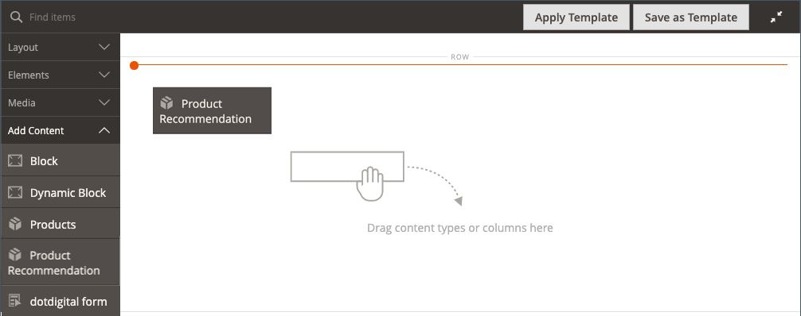

# Inhoud toevoegen - Productaanbevelingen

Gebruik het _inhoudstype van de Aanbevelingen van het 0&rbrace; Product &lbrace;om een bestaande, actieve_ aanbeveling eenheid [ aan het ](https://experienceleague.adobe.com/nl/docs/commerce/product-recommendations/admin/create) stadium [[!DNL Page Builder]  voor een CMS pagina, een blok, of een dynamisch blok toe te voegen.](workspace.md#stage)

>[!NOTE]
>
>Het [!DNL Page Builder] _inhoudstype van 1&rbrace; de Aanbevelingen van het Product_ wordt gesteund in Adobe Commerce 2.4.4 en later en beschikbaar in de [ metapakketversies van de Aanbevelingen van het Product 3.0.x of later ](https://commercemarketplace.adobe.com/magento-product-recommendations.html). Om [!DNL Page Builder] steun voor de Aanbevelingen van het Product toe te voegen, [ zie de installatieinformatie ](https://experienceleague.adobe.com/nl/docs/commerce/product-recommendations/getting-started/install-configure). **Dit inhoudstype is niet beschikbaar voor Magento Open Source.**

{{$include /help/_includes/page-builder-save-timeout.md}}

## Werkset Productaanbevelingen

| Gereedschap | Pictogram | Beschrijving |
| --- | --| --- |
| Verplaatsen | {width="25"} | Hiermee verplaatst u de container met productaanbevelingen en de inhoud ervan naar een andere positie in het werkgebied. |
| Instellingen | {width="25"} | Opent de Edit pagina van de Aanbeveling van het Product, waar u de aanbeveling eenheid kunt kiezen en de eigenschappen van de container veranderen. |
| Verbergen | {width="25"} | Hiermee verbergt u de huidige container met productaanbevelingen en de inhoud ervan. |
| Tonen | {width="25"} | Toont de verborgen container van de productaanbeveling en zijn inhoud. |
| Dupliceren | {width="25"} | Hiermee maakt u een gedupliceerde kopie van de container met productaanbevelingen en de inhoud ervan. |
| Verwijderen | {width="25"} | Hiermee verwijdert u de container met productaanbevelingen en de inhoud ervan uit het werkgebied. |

{style="table-layout:auto"}

{{$include /help/_includes/page-builder-hidden-element-note.md}}

## Een bestaande aanbevolen eenheid toevoegen

1. Zorg ervoor u reeds [ een aanbeveling eenheid ](https://experienceleague.adobe.com/nl/docs/commerce/product-recommendations/admin/create) voor het [!DNL Page Builder] paginatype hebt gecreeerd.

>[!NOTE]
>
>U kunt alleen in de standaardwinkelweergave aanbevolen eenheden voor het paginatype [!DNL Page Builder] maken.

1. Open de pagina, het blok of het dynamische blok in de bewerkingsmodus.

1. Vouw de sectie _[!UICONTROL Content]_&#x200B;uit en klik op **[!UICONTROL Edit with Page Builder]**&#x200B;of in het voorvertoningsgebied van de inhoud om de werkruimte van [!DNL Page Builder] te openen.

1. Sleep in het deelvenster [!DNL Page Builder] onder _[!UICONTROL Layout]_&#x200B;een tijdelijke aanduiding voor **[!UICONTROL Row]**&#x200B;naar het werkgebied.

1. Sleep in het deelvenster [!DNL Page Builder] onder _[!UICONTROL Add Content]_&#x200B;een tijdelijke aanduiding **[!UICONTROL Product Recommendation]**&#x200B;naar de rij.

   {width="600" zoomable="yes"}

1. Voer een van de volgende handelingen uit:

   - Klik op **[!UICONTROL Edit Product Recommendation]**.
   - Beweeg over de lege container om toolbox te tonen en de _Montages_ te klikken ().

   {width="600" zoomable="yes"}

1. Klik in de sectie _[!UICONTROL Selection]_&#x200B;op **[!UICONTROL Select]**.

1. Zoek in de lijst met actieve productaanbevelingen de rij met de aanbevolen eenheid die u wilt toevoegen en klik op **[!UICONTROL Select]** in de laatste kolom.

   {width="600" zoomable="yes"}

1. Klik in de rechterbovenhoek op **[!UICONTROL Add Selected]** .

   De naam van de geselecteerde productaanbeveling wordt weergegeven in de sectie _[!UICONTROL Selection]_&#x200B;van de pagina&#x200B;_[!UICONTROL Edit Product Recommendation]_ .

1. Breng om het even welke veranderingen noodzakelijk aan de [ Geavanceerde montages ](#advanced-settings) aan.

   {width="600" zoomable="yes"}

1. Voer de volgende handelingen uit wanneer deze zijn voltooid:

   - Als het werken met volledig gemaximaliseerd browser venster, klik het _Dichte Volledige Scherm_ () pictogram in de hoger-juiste hoek van de werkruimte.

   - Klik op **[!UICONTROL Save]** om de instellingen toe te passen en terug te keren naar de werkruimte van [!DNL Page Builder] .

   Wanneer u terugkeert naar het werkgebied, worden voorlopige afbeeldingen van het product weergegeven in de container.

## Aanbevolen eenheidsinstellingen bewerken

1. Beweeg over de container van de aanbevelingseenheid om toolbox te tonen en de _Montages_ te klikken ().

   {width="600" zoomable="yes"}

1. Breng om het even welke veranderingen noodzakelijk aan de [ Geavanceerde montages ](#advanced-settings) aan.

1. Klik na afloop op **[!UICONTROL Save]** om de instellingen toe te passen en terug te keren naar de werkruimte van [!DNL Page Builder] .

## Een aanbevolen eenheid dupliceren

1. Beweeg over de container van de aanbevelingseenheid om toolbox te tonen en _te klikken dupliceert_ () pictogram in toolbox.

   Het duplicaat wordt net onder het origineel weergegeven.

1. Om de gedupliceerde aanbeveling te bewegen eenheid aan een nieuwe positie, over de container te bewegen en de _Beweging_ () te klikken pictogram in toolbox.

1. Selecteer en sleep de aanbevolen eenheid totdat de rode hulplijn op de nieuwe positie wordt weergegeven.

   De boven- en onderrand van elke container worden weergegeven als onderbroken lijnen terwijl de aanbevolen eenheid wordt verplaatst.

## Een aanbevolen eenheid uit het werkgebied verwijderen

1. Beweeg over de container van de aanbevelingseenheid en klik _verwijderen_ ( ) pictogram in toolbox.

1. Klik op **[!UICONTROL OK]** wanneer u wordt gevraagd om te bevestigen.

## Geavanceerde instellingen

1. Kies de optie **[!UICONTROL Alignment]** als u de plaatsing van de eenheid met productaanbevelingen in de bovenliggende container wilt bepalen:

   | Optie | Beschrijving |
   | ------ | ----------- |
   | `Default` | Hiermee past u de standaardinstelling voor uitlijning toe die is opgegeven in het stijlblad van het huidige thema. |
   | `Left` | Hiermee lijnt u de eenheid uit langs de linkerrand van de bovenliggende container, waarbij rekening wordt gehouden met de opgegeven opvulling. |
   | `Center` | Hiermee lijnt u de eenheid in het midden van de bovenliggende container uit, waarbij rekening wordt gehouden met de opgegeven opvulling. |
   | `Right` | Hiermee lijnt u de eenheid uit langs de rechterrand van de bovenliggende container, waarbij rekening wordt gehouden met de opgegeven opvulling. |

   {style="table-layout:auto"}

1. Stel de stijl **[!UICONTROL Border]** in die wordt toegepast op alle vier zijden van de eenheid Productaanbevelingen:

   | Optie | Beschrijving |
   | ------ | ----------- |
   | `Default` | Past de standaardrandstijl toe die door het bijbehorende stijlblad wordt gespecificeerd. |
   | `None` | Geeft geen zichtbare indicatie van de eenheidsgrenzen. |
   | `Dotted` | De rand van de eenheid wordt weergegeven als een stippellijn. |
   | `Dashed` | De rand van de eenheid wordt weergegeven als een onderbroken lijn. |
   | `Solid` | De rand van de eenheid wordt weergegeven als een effen lijn. |
   | `Double` | De rand van de eenheid wordt weergegeven als een dubbele lijn. |
   | `Groove` | De rand van de eenheid wordt weergegeven als een gegroefde lijn. |
   | `Ridge` | De rand van de eenheid wordt weergegeven als een afgeronde lijn. |
   | `Inset` | De rand van de eenheid wordt weergegeven als een inzetlijn. |
   | `Outset` | De rand van de eenheid wordt weergegeven als een omtreklijn. |

   {style="table-layout:auto"}

1. Als u een andere randstijl dan `None` instelt, voert u de weergaveopties voor de rand in:

   | Optie | Beschrijving |
   | ------ |------------ |
   | [!UICONTROL Border Color] | Geef de kleur op door een staal te kiezen, op de kleurkiezer te klikken of door een geldige kleurnaam of een gelijkwaardige hexadecimale waarde in te voeren. |
   | [!UICONTROL Border Width] | Voer het aantal pixels in voor de lijnbreedte van de rand. |
   | [!UICONTROL Border Radius] | Voer het aantal pixels in om de grootte te bepalen van de straal die wordt gebruikt om elke hoek van de rand te afronden. |

   {style="table-layout:auto"}

1. (Optioneel) Geef de namen van **[!UICONTROL CSS classes]** op uit het huidige stijlblad die u op de eenheid wilt toepassen.

   Scheid meerdere klassennamen met een spatie.

1. Voer in pixels waarden in voor de **[!UICONTROL Margins and Padding]** om de buitenste marges en binnenopvulling van de eenheid te bepalen.

   Voer de overeenkomende waarden in het diagram in.

   | Containergebied | Beschrijving |
   | ------ | ----------- |
   | [!UICONTROL Margins] | De hoeveelheid lege ruimte die wordt toegepast op de buitenrand van alle zijden van de eenheid. Opties: `Top` / `Right` / `Bottom` / `Left` |
   | [!UICONTROL Padding] | De hoeveelheid lege ruimte die wordt toegepast op de binnenrand van alle zijden van de eenheid. Opties: `Top` / `Right` / `Bottom` / `Left` |

   {style="table-layout:auto"}

<!-- Last updated from includes: 2023-09-11 14:30:19 -->
