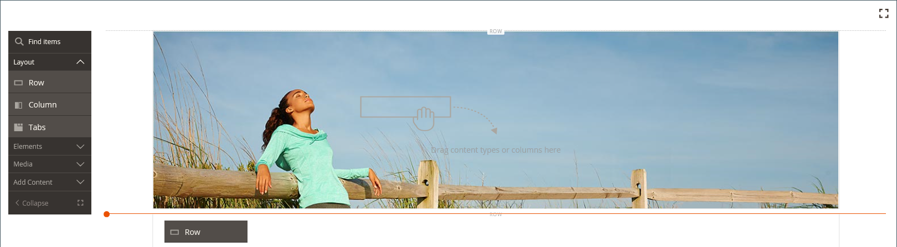

# Layout - Rij

Gebruik de _Rij_ inhoudstype om een rij toe te voegen in de [[!DNL Page Builder] stadium](workspace.md#stage).

{{$include /help/_includes/page-builder-save-timeout.md}}

## Gereedschapset Rij

De rijgereedschapset wordt weergegeven wanneer u de muisaanwijzer op de rijcontainer plaatst. De gereedschapset bevat opties voor het verplaatsen, verbergen, dupliceren, bewerken of verwijderen van de rij. De selectie van instellingen bepaalt de vormgeving, achtergrond en lay-out van de rij. Aanvullende inhoudselementen kunnen vanuit de [!DNL Page Builder] aan de linkerkant.

{width="600" zoomable="yes"}

| Gereedschap | Pictogram | Beschrijving |
| --------- | ---------- | ----------- |
| Verplaatsen | {width="25"} | Hiermee verplaatst u de rij naar een andere positie ten opzichte van andere rijen in het werkgebied. |
| (label) | [!UICONTROL Row] | Hiermee wordt de huidige inhoudscontainer aangeduid als een rij. Houd de muisaanwijzer boven de container om de gereedschapset weer te geven. |
| Instellingen | {width="25"} | Hiermee opent u de pagina Rij bewerken, waarin u de eigenschappen van de container kunt wijzigen. |
| Verbergen | {width="25"} | Hiermee verbergt u de huidige rij. |
| Tonen | {width="25"} | De verborgen rij wordt weergegeven. |
| Dupliceren | {width="25"} | Maakt een kopie van de rij. |
| Verwijderen | {width="25"} | Hiermee verwijdert u de rijcontainer en de inhoud ervan uit het werkgebied. |

{style="table-layout:auto"}

{{$include /help/_includes/page-builder-hidden-element-note.md}}

## Een rij toevoegen

1. In de [!DNL Page Builder] paneel onder _[!UICONTROL Layout]_, sleept u een nieuwe **[!UICONTROL Row]**naar het werkgebied, net onder de eerste rij.

1. Als u de rij wilt opmaken, plaatst u de muisaanwijzer boven de rijcontainer om de gereedschapset weer te geven en kiest u de optie _Instellingen_ ( {width="20"} ).

   Gebruik de volgende secties voor gedetailleerde informatie over de voltooiing van de beschikbare montages.

   {width="600" zoomable="yes"}

## Rijinstellingen wijzigen

1. Houd de muisaanwijzer boven de rijcontainer om de gereedschapset weer te geven en kies de optie _Instellingen_ ( {width="20"} ).

   {width="600" zoomable="yes"}

1. Gebruik de volgende secties voor gedetailleerde informatie over het bijwerken van de beschikbare montages.

1. Klik op **[!UICONTROL Save]** om de instellingen toe te passen en terug te keren naar de [!DNL Page Builder] werkruimte.

## Weergave

Gebruik de _Weergave_ instellingen om te bepalen hoe inhoud in de rij wordt weergegeven.

{width="600" zoomable="yes"}

- Als u wilt bepalen hoe de achtergrondkleur en/of achtergrondafbeelding wordt weergegeven ten opzichte van de container en de breedte van het inhoudsgebied, kiest u de uitlijning:

  | Optie | Beschrijving |
  | ------ | ----------- |
  | [!UICONTROL Contained] | De achtergrondkleur of -afbeelding is beperkt tot de maximale paginabreedte die door het thema wordt gedefinieerd. |
  | [!UICONTROL Full Width] | Hiermee beperkt u de inhoud tot de maximale paginabreedte die door het thema wordt gedefinieerd. De achtergrondkleur en/of -afbeelding zijn niet beperkt en breidt de volledige breedte van de rij uit. |
  | [!UICONTROL Full Bleed] | De inhoud en achtergrondafbeelding en/of -kleur zijn niet beperkt en de rij is breder. Volledig afloopgebied kan alleen worden gebruikt met [thema&#39;s](../content-design/themes.md) die de lay-out ondersteunen. |

  {style="table-layout:auto"}

- Voer de **[!UICONTROL Minimum Height]** voor de rij. Deze waarde kan een getal zijn met elke geldige CSS-eenheid (zoals `100px`, `50%`, `50em`, `100vh`) of een berekening (zoals `100vh - 237px`).

  U kunt bijvoorbeeld de minimumhoogte van een rij instellen om de volledige hoogte van de pagina te vergroten, zodat u aantrekkelijke opties hebt voor achtergrondafbeeldingen en video&#39;s van volledige pagina.

- Kies een **[!UICONTROL Vertical Alignment]** het plaatsen om om het even welke inhoudscontainers uit te lijnen die aan de rij (Boven, Midden, of Onder) worden toegevoegd.

## Achtergrond

Er zijn veel opties voor het definiëren van de achtergrondweergave van een rij. U kunt een eenvoudige kleur- of achtergrondafbeelding toepassen en geavanceerde effecten beheren.

### Achtergrondkleur

Geef de achtergrondkleur op door een staal te kiezen, op de kleurkiezer te klikken of door een geldige kleurnaam of een gelijkwaardige hexadecimale waarde in te voeren. Deze instelling bepaalt de achtergrondkleur van de rij. U kunt ook de dekking van de kleur aanpassen.

{width="200"}

U kunt de waarde op drie manieren instellen:

- Een vooraf gedefinieerde kleurnaam, zoals `White`
- De hexadecimale kleurwaarde voor de kleur, zoals `#ffffff`
- De RGB-waarde voor de kleur, met een dekkingspercentage, zoals `rgba(255, 255, 255, 0.75)`

Als u een kleur wilt kiezen, klikt u op het staal links van het dialoogvenster _Geen kleur_ doos.

{width="600" zoomable="yes"}

Als u nogmaals op het kleurvak klikt om de kleurkiezer te openen, worden in het vak onder de schuifregelaar de huidige waarden voor rood, groen, blauw en alpha (rgba) weergegeven. Het laatste getal geeft het huidige dekkingspercentage aan als een decimaal. U kunt de schuifregelaar gebruiken om de dekking aan te passen of de gewenste decimale waarde invoeren.

{width="600" zoomable="yes"}

>[!NOTE]
>
>[!DNL Page Builder] ook een transparantielaag ondersteunt, of _alfakanaal_ in achtergrondafbeeldingen die kunnen worden gebruikt om achtergronden met verschillende dekkingsgraden te maken.

### [!UICONTROL Background Type]

Een achtergrondtype kan een afbeelding of video zijn. [!DNL Page Builder] standaardinstellingen `Image` en worden verschillende afbeeldingsinstellingen weergegeven. Als u `Video`, [!DNL Page Builder] Hiermee vervangt u de afbeeldingsinstellingen door video-instellingen. Beide achtergrondtypen worden als volgt beschreven.

{width="200"}

### Instellingen voor afbeeldingstypen

Als u de _[!UICONTROL Background Type]_tot `Image`gebruikt u de volgende instellingen om de weergave van de achtergrondafbeelding te definiëren.

{width="600" zoomable="yes"}

- **[!UICONTROL Background Image]** - Kies zo nodig met de beschikbare gereedschappen een achtergrondafbeelding die u op de rij wilt toepassen:

  | Optie | Beschrijving |
  | ------ | ----------- |
  | [!UICONTROL Upload] | Uploadt een afbeeldingsbestand van uw lokale computer naar de galerie en past het vervolgens toe als de achtergrondafbeelding voor de rij. |
  | [!UICONTROL Select from Gallery] | Hiermee wordt u gevraagd een bestaande afbeelding in de galerie te kiezen als achtergrondafbeelding voor de rij. |
  | {width="25"} | Hiermee kunt u de afbeelding naar de tegel van de camera slepen of naar de afbeelding in uw lokale bestandssysteem bladeren. |

  {style="table-layout:auto"}

- **[!UICONTROL Background Mobile Image]** - Gebruik indien nodig dezelfde gereedschappen om een andere achtergrondafbeelding te kiezen die u wilt gebruiken voor weergave op mobiele apparaten.

- **[!UICONTROL Background Size]** - Stel deze optie in om te bepalen hoe de achtergrondafbeelding wordt geschaald ten opzichte van de breedte van de rij:

  | Optie | Beschrijving |
  | ------ | ----------- |
  | `Cover` | De achtergrondafbeelding bedekt de volledige breedte van de rij. |
  | `Contain` | De achtergrondafbeelding is beperkt tot de breedte van het inhoudsgebied. |
  | `Auto` | Hiermee past u de grootte van het huidige stijlblad toe. |

  {style="table-layout:auto"}

  {width="250"}

- **[!UICONTROL Background Position]** - Stel deze optie in om te bepalen hoe de achtergrondafbeelding wordt verankerd ten opzichte van de rij:

  | Ankerpunt | Positie |
  | ------ | ----------- |
  | `Top` | Links/midden/rechts |
  | `Center` | Links/midden/rechts |
  | `Bottom` | Links/midden/rechts |

  {style="table-layout:auto"}

  Het ankerpunt is als een drukknop die de afbeelding op de opgegeven achtergrondpositie aan de rij koppelt.

- **[!UICONTROL Background Attachment]** - Stel het type bijlage in om te bepalen hoe de achtergrondafbeelding ten opzichte van de schuifpagina wordt verplaatst:

  | Optie | Beschrijving |
  | ------ | ----------- |
  | `Scroll` | De bijgevoegde achtergrondafbeelding wordt gesynchroniseerd zodat deze omlaag wordt verplaatst wanneer de pagina wordt verschoven. Gebruik de Parallax-achtergrond om de schuifsnelheid te bepalen. |
  | `Fixed` | (Niet beschikbaar voor mobiele apparaten) De achtergrondafbeelding wordt niet verplaatst wanneer de container over de afbeelding schuift en op de opgegeven achtergrondpositie wordt vastgezet. |

  {style="table-layout:auto"}

- **[!UICONTROL Background Repeat]** - Instellen op `Yes` om de achtergrondafbeelding te herhalen en zo de beschikbare ruimte in de rij te vullen.

### Instellingen voor videotypen

Als u de _Achtergrondtype_ tot `Video`gebruikt u de volgende instellingen om de weergave van de achtergrondafbeelding te definiëren.

- **[!UICONTROL Video URL]** - Voer een geldige video-URL in. Geldige video-URL&#39;s kunnen koppelingen zijn naar:

   - YouTube-video&#39;s: `https://youtu.be/CoDhMRUUjeI`
   - Vimeo-video&#39;s: `https://vimeo.com/190156113`
   - Geldige videobestanden (`.mp4` wordt aanbevolen): `https://myvideos.com/spiral.mp4`

  {width="300"}

- **[!UICONTROL Overlay Color]** - Selecteer een kleur om een transparante tint toe te passen op de video.

- **[!UICONTROL Infinite Loop]** - Instellen op `No` om de video eenmaal af te spelen en te stoppen. Wanneer deze optie is ingesteld op `Yes` (standaard), wordt de video herhaald in een oneindige lus.

- **[!UICONTROL Lazy Load]** - Instellen op `No` om de video met de pagina te laden, zelfs als deze niet zichtbaar is. Wanneer deze optie is ingesteld op `Yes` (standaard), wordt de video alleen uit de bron geladen wanneer deze op het scherm wordt weergegeven.

- **[!UICONTROL Play Only When Visible]** - Instellen op `No` om ervoor te zorgen dat de video direct wordt afgespeeld nadat deze is geladen, ongeacht of deze zichtbaar is. Wanneer deze optie is ingesteld op `Yes` (standaard) wordt het afspelen van de video alleen gestart wanneer deze zichtbaar is.

- **[!UICONTROL Fallback Image]** - Geef indien nodig een afbeelding op die op het scherm moet worden weergegeven voordat de video wordt geladen en als de video om een of andere reden niet wordt geladen.

## Parallax-achtergrond

Gebruik deze opties om de snelheid van een schuivende achtergrondafbeelding of -video te bepalen in verhouding tot het schuiven van de pagina. De achtergrond kan worden ingesteld om langzamer te schuiven om een gevoel van onderdompeling te creëren.

- Set **Parallax-achtergrond inschakelen** tot `Yes`.
- Voer de **Parallaxsnelheid** als decimale waarde tussen `-1.0` en `2.0`.

{width="600" zoomable="yes"}

## Geavanceerd

- Als u de horizontale plaatsing wilt bepalen van inhoudscontainers die aan de rij worden toegevoegd, kiest u een **[!UICONTROL Alignment]**:

  | Optie | Beschrijving |
  | ------ | ----------- |
  | `Default` | Hiermee past u de standaardinstelling voor uitlijning toe die is opgegeven in het stijlblad van het huidige thema. |
  | `Left` | Hiermee lijnt u de inhoudscontainers uit langs de linkerrand van de rijcontainer, waarbij rekening wordt gehouden met de opgegeven opvulling. |
  | `Center` | Hiermee lijnt u de inhoudscontainer in het midden van de rijcontainer uit, waarbij rekening wordt gehouden met de opgegeven opvulling. |
  | `Right` | Hiermee lijnt u de inhoudscontainer uit langs de rechterrand van de rijcontainer, waarbij rekening wordt gehouden met de opgegeven opvulling. |

  {style="table-layout:auto"}

- Stel de **[!UICONTROL Border]** stijl die wordt toegepast op alle vier zijden van de rijcontainer:

  | Optie | Beschrijving |
  | ------ | ----------- |
  | `Default` | Past de standaardrandstijl toe die door het bijbehorende stijlblad wordt gespecificeerd. |
  | `None` | Geeft geen zichtbare indicatie van de containerranden. |
  | `Dotted` | De containerrand wordt weergegeven als een stippellijn. |
  | `Dashed` | De containerrand wordt weergegeven als een onderbroken lijn. |
  | `Solid` | De containerrand wordt weergegeven als een effen lijn. |
  | `Double` | De containerrand wordt weergegeven als een dubbele lijn. |
  | `Groove` | De containerrand wordt weergegeven als een gegroefde lijn. |
  | `Ridge` | De containerrand wordt weergegeven als een afgeronde lijn. |
  | `Inset` | De containerrand wordt weergegeven als een inzetlijn. |
  | `Outset` | De containerrand wordt weergegeven als een omtreklijn. |

  {style="table-layout:auto"}

- Als u een andere randstijl dan `None`, vult u de weergaveopties voor de rand in:

  {width="600" zoomable="yes"}

  | Optie | Beschrijving |
  | ------ |------------ |
  | [!UICONTROL Border Color] | Geef de kleur op door een staal te kiezen, op de kleurkiezer te klikken of door een geldige kleurnaam of een gelijkwaardige hexadecimale waarde in te voeren. |
  | [!UICONTROL Border Width] | Voer het aantal pixels in voor de lijnbreedte van de rand. |
  | [!UICONTROL Border Radius] | Voer het aantal pixels in om de grootte te bepalen van de straal die wordt gebruikt om elke hoek van de rand te afronden. |

  {style="table-layout:auto"}

  De rij in het volgende voorbeeld heeft een randstraal van 15.

  {width="500"}

- (Optioneel) Geef de namen op van **[!UICONTROL CSS classes]** van het huidige stijlblad toe te passen op de rijcontainer.

  Scheid meerdere klassennamen met een spatie.

- Voer in pixels waarden in voor de **[!UICONTROL Margins and Padding]** om de buitenmarges en de binnenopvulling van de rij op te geven.

  Ga elke overeenkomstige waarde in het diagram van de rijcontainer in.

  | Containergebied | Beschrijving |
  | -------------- | ----------- |
  | [!UICONTROL Margins] | De hoeveelheid lege ruimte die wordt toegepast op de buitenrand van alle zijden van de container. Opties: `Top` / `Right` / `Bottom` / `Left` |
  | [!UICONTROL Padding] | De hoeveelheid lege ruimte die wordt toegepast op de binnenrand van alle zijden van de container. Opties: `Top` / `Right` / `Bottom` / `Left` |

  {style="table-layout:auto"}

  {width="600" zoomable="yes"}
