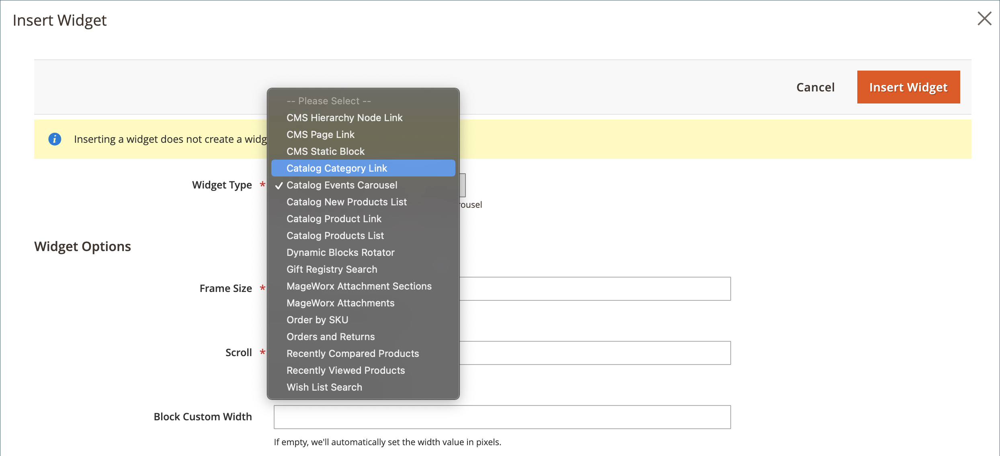
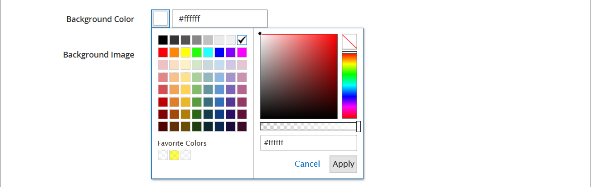

# Media - schuifregelaar

Gebruik de _Slider_ inhoudstype om een presentatie van afbeeldingen toe te voegen aan de [[!DNL Page Builder] stadium](workspace.md#stage). U kunt nieuwe afbeeldingen uploaden of bestaande afbeeldingen kiezen in de galerie of productcatalogus. Een schuifregelaar kan worden ingesteld op automatisch afspelen of kan handmatig met navigatieknoppen worden beheerd. Als u de schuifregelaar wilt koppelen aan een specifieke promotie, raadpleegt u [Dynamisch blok](dynamic-block.md).

{width="700" zoomable="yes"}

{{$include /help/_includes/page-builder-save-timeout.md}}

## Werkbalken

Wanneer u met het inhoudstype Slider werkt, voegt u afzonderlijke dia&#39;s en de schuifregelaarcontainer toe en bewerkt deze die een of meer dia&#39;s bevat. Elke dia heeft een eigen gereedschapset waarmee u dia&#39;s kunt ontwerpen op de [!DNL Page Builder] in het werkgebied.

## Afzonderlijke dia, gereedschapset

{width="500" zoomable="yes"}

| Gereedschap | Pictogram | Beschrijving |
|--- |--- |--- |
| Verplaatsen | {width="25"} | Hiermee verplaatst u de dia naar een andere positie op de schuifregelaar. |
| (label) | Dianummer | Hiermee wordt het nummer van de huidige dia aangegeven. |
| Instellingen | {width="25"} | Hiermee opent u de _[!UICONTROL Edit Slide]_pagina, waar u de eigenschappen van de huidige dia kunt wijzigen. |
| Dupliceren | {width="25"} | Maakt een kopie van de huidige dia. |
| Verwijderen | {width="25"} | Hiermee verwijdert u de huidige dia uit de schuifregelaar. |

{style="table-layout:auto"}

## Gereedschapset Schuiven

| Gereedschap | Pictogram | Beschrijving |
|--- |--- |--- |
| Verplaatsen | {width="25"} | Hiermee verplaatst u de schuifregelaar naar een andere positie in het werkgebied. |
| (label) | [!UICONTROL Slider] | Hiermee wordt de container van de schuifregelaar aangegeven. |
| Instellingen | {width="25"} | Hiermee opent u de _[!UICONTROL Edit Slider]_pagina, waar u de eigenschappen van de video en container kunt wijzigen. |
| Verbergen | {width="25"} | Hiermee verbergt u de huidige schuifregelaar. |
| Tonen | {width="25"} | Geeft de verborgen schuifregelaar weer. |
| Dupliceren | {width="25"} | Maakt een kopie van de schuifregelaar. |
| Verwijderen | {width="25"} | Hiermee verwijdert u de schuifregelaar uit het werkgebied. |

{style="table-layout:auto"}

{{$include /help/_includes/page-builder-hidden-element-note.md}}

## Een afzonderlijke dia toevoegen

1. Open de pagina, het blok of het dynamische blok waar u de schuifregelaar wilt plaatsen en vouw de **[!UICONTROL Content]** sectie.

1. In de [!DNL Page Builder] deelvenster, uitvouwen **[!UICONTROL Media]** en sleep een **[!UICONTROL Slider]** plaatsaanduiding voor een rij, kolom of tab in het werkgebied.

   In het volgende voorbeeld is de achtergrondkleur van de rij geel (`#fffd16`).

   {width="600" zoomable="yes"}

   De schuifregelaarcontainer wordt in het werkgebied weergegeven met één lege dia.

1. Klik in de schuifregelaarcontainer om de [teksteditor](../content-design/editor.md) en voer inhoud in voor de eerste dia.

   U kunt ook complexere bannerinhoud opnemen met de opdracht [Inhoud](#content) instellingen.

1. Klik op de navigatiepunt onder aan de schuifregelaar om de gereedschapset voor de afzonderlijke dia weer te geven en kies de optie _Instellingen_ ( {width="20"} ).

   Schuifregelaars hebben twee gereedschapskisten. Zorg ervoor dat u de dioolbox bij de bodem gebruikt.

1. Vul de instellingen zo nodig in volgens de volgende secties:

   - [[!UICONTROL Appearance]](#appearance)
   - [[!UICONTROL Background]](#background)
   - [[!UICONTROL Content]](#content)
   - [[!UICONTROL Search Engine Optimization]](#seo)
   - [[!UICONTROL Advanced]](#advanced)

1. Klik op **[!UICONTROL Save]** om de instellingen toe te passen en terug te keren naar de [!DNL Page Builder] werkruimte.

## Meer dia&#39;s toevoegen

In de volgende secties wordt een reeks stappen beschreven die moeten beginnen met een afzonderlijke dia en wordt een responsieve schuifregelaar gemaakt die functies en koppelingen naar specifieke producten bevat. Als u nog geen afzonderlijke dia hebt, volgt u de vorige instructies om een afzonderlijke dia aan het werkgebied toe te voegen.

U kunt als volgt dia&#39;s toevoegen:

### Methode 1: Een bestaande dia dupliceren

U kunt tijd besparen door een dia te dupliceren die al met de benodigde instellingen is geconfigureerd.

1. Klik op de navigatiepunt onder de dia om de gereedschapset weer te geven en kies de _Dupliceren_ ( {width="20"} ).

   {width="500" zoomable="yes"}

1. Klik op de navigatiepunt voor de nieuwe dia en om de gereedschapset weer te geven en kies _Instellingen_ ( {width="20"} ).

1. Wijzig desgewenst de instellingen in de volgende secties:

   - [[!UICONTROL Appearance]](#appearance)
   - [[!UICONTROL Background]](#background)
   - [[!UICONTROL Content]](#content)
   - [[!UICONTROL Advanced]](#advanced)

1. Klik op **[!UICONTROL Save]** om de instellingen toe te passen en terug te keren naar de [!DNL Page Builder] werkruimte.

### Methode 2: Een nieuwe, lege dia toevoegen

1. Houd de muisaanwijzer boven de schuifregelaarcontainer bovenaan om de gereedschapset weer te geven en kies de optie _Toevoegen_ ( {width="20"} ).

   {width="500" zoomable="yes"}

   Er wordt een nieuwe lege dia met een eigen navigatiepunt en gereedschapset toegevoegd aan de schuifregelaar en weergegeven in het werkgebied.

   {width="500" zoomable="yes"}

1. Klik op de navigatiepunt voor de nieuwe dia en om de gereedschapset weer te geven en kies _Instellingen_ ( {width="20"} ).

1. Wijzig desgewenst de instellingen in de volgende secties:

   - [[!UICONTROL Appearance]](#appearance)
   - [[!UICONTROL Background]](#background)
   - [[!UICONTROL Content]](#content)
   - [[!UICONTROL Advanced]](#advanced)

1. Klik op **[!UICONTROL Save]** in de rechterbovenhoek om het dialoogvenster _[!UICONTROL Edit Slide]_pagina.

### Widget toevoegen aan een dia

U kunt elke [widgettype](../content-design/widgets.md#widget-types) naar uw dia in een [!DNL Page Builder] met de volgende stappen:

1. [De widget maken](../content-design/widget-create.md) die u op een dia wilt zien.

1. Open de pagina, het blok of het dynamische blok waar u de schuifregelaar wilt plaatsen en vouw de **[!UICONTROL Content]** sectie.

1. In de [!DNL Page Builder] deelvenster, uitvouwen **[!UICONTROL Media]** en sleep een **[!UICONTROL Slider]** plaatsaanduiding voor een rij, kolom of tab in het werkgebied.

1. Klik in de schuifregelaarcontainer om de [teksteditor](../content-design/editor.md) en klik op de knop _Widget invoegen_ ( {width="20"} ).

1. Selecteer de **[!UICONTROL Widget Type]** dat is nodig.

1. Geef de instellingen op. Deze verschillen afhankelijk van het type widget

   {width="600" zoomable="yes"}

1. Klik op **[!UICONTROL Insert Widget]** in de rechterbovenhoek.

1. Wijzig desgewenst de andere instellingen.

1. Klik op **[!UICONTROL Save]** in de rechterbovenhoek.

   {width="600" zoomable="yes"}

### Elke dia weergeven

Als u elke dia in het werkgebied wilt weergeven, klikt u op de volgende stip onder de momenteel weergegeven dia.

{width="500" zoomable="yes"}

De dia in het voorgaande voorbeeld heeft een achtergrondafbeelding, een transparante mobiele afbeelding en een inline-afbeelding die uit de teksteditor is toegevoegd. Deze techniek werkt goed op mobiele apparaten door de achtergrondafbeelding uit te schakelen en alleen de kleinere inline-afbeelding weer te geven. De productdia in dit voorbeeld heeft de volgende aanvullende instellingen:

| Optie | Voorbeeld instellen |
|--- |--- |
| [!UICONTROL Appearance] | `Collage Right` |
| [!UICONTROL Background Color] | `#ffffff` (Wit) |
| [!UICONTROL Background Image] | De afbeelding op deze dia is opgeslagen vanaf de productpagina en geüpload naar de galerie. |
| [!UICONTROL Mobile Background Image] | De mobiele achtergrondafbeelding is een transparante afbeelding van 10 pixels vierkant. Als u een lege afbeelding voor mobiele apparaten gebruikt, wordt de standaardachtergrondafbeelding vervangen door een onzichtbare afbeelding. |
| [!UICONTROL Background Size] | `Auto` |
| [!UICONTROL Message Text] | `Minerva LumaTech&trade; V-Tee` (Centreren) met ingevoegde afbeelding geschaald op 40% (midden uitlijnen) |
| [!UICONTROL Link] | `Product` |
| [!UICONTROL Show Button] | `Always` |
| [!UICONTROL Button Text] | `Buy Now` |
| [!UICONTROL Show Overlay] | `Never Show` |
| [!UICONTROL Alignment] | `Center` (om de knop uit te lijnen) |
| [!UICONTROL Border] | `Solid` |
| [!UICONTROL Border Color] | `#000000` (Zwart) |
| [!UICONTROL Border Width] | `1 px` |

{style="table-layout:auto"}

## Afzonderlijke dia-instellingen wijzigen

1. Wijzig de weergave van de schuifregelaar in het werkgebied en bekijk de dia die u wilt wijzigen.

1. Kies in de afzonderlijke gereedschapset voor dia de optie _Instellingen_ ( {width="20"} ) en vult de instellingen zo nodig in volgens de volgende secties.

1. Klik in de rechterbovenhoek op **[!UICONTROL Save]** om de instellingen toe te passen en terug te keren naar de [!DNL Page Builder] werkruimte.

### [!UICONTROL Appearance]

1. Kies een van de volgende typen diaplaatsing:

   | Type | Beschrijving |
   | ---- | ----------- |
   | `Poster` | Hiermee centreert u de dia-inhoud in de container van de schuifregelaar. Als u de bedekking gebruikt, wordt de volledige breedte van de schuifregelaar uitgebreid. |
   | `Collage Left` | Hiermee plaatst u de dia-inhoud in een gedefinieerd gebied aan de linkerkant van de schuifregelaarcontainer. De bedekking dekt, indien gebruikt, alleen het gedefinieerde gebied. |
   | `Collage Center` | Hiermee plaatst u de dia-inhoud in een gedefinieerd gebied dat is gecentreerd op de schuifregelaarcontainer. De bedekking dekt, indien gebruikt, alleen het gedefinieerde gebied. |
   | `Collage Right` | Hiermee plaatst u de dia-inhoud in een gedefinieerd gebied aan de rechterkant van de schuifregelaarcontainer. De bedekking dekt, indien gebruikt, alleen het gedefinieerde gebied. |

   {style="table-layout:auto"}

   {width="600" zoomable="yes"}

1. Voer de **[!UICONTROL Slide Name]**.

   In de bewerkingsmodus wordt de dianaam weergegeven als knopinfo boven de navigatiepunt. De dianaam is niet zichtbaar van de storefront.

   {width="500" zoomable="yes"}

1. Voer de **[!UICONTROL Minimum Height]** voor de dia.

   De minimumhoogte kan een getal zijn met elke geldige CSS-eenheid (zoals `100px`, `50%`, `50em`, `100vh`) of een berekening (zoals `100vh - 237px`).

   U kunt bijvoorbeeld instellen dat de minimale hoogte van de dia de volledige hoogte van de pagina beslaat en vervolgens achtergrondafbeeldingen en video&#39;s gebruiken voor aantrekkelijke ontwerpopties.

   >[!NOTE]
   >
   >Wanneer de dia op de volledige hoogte van de pagina (100vh) wordt geplaatst, rekt de schuif die de dia bevat ook de volledige hoogte van de pagina om de hoogte van de dia aan te passen.

## [!UICONTROL Background]

Er zijn veel opties voor het definiëren van de achtergrondweergave van een dia. U kunt een eenvoudige kleur- of achtergrondafbeelding toepassen en geavanceerde effecten beheren.

### [!UICONTROL Background Color]

Geef de achtergrondkleur op door een staal te kiezen, op de kleurkiezer te klikken of door een geldige kleurnaam of een gelijkwaardige hexadecimale waarde in te voeren. Deze instelling bepaalt de achtergrondkleur van de rij. U kunt ook de dekking van de kleur aanpassen.

{width="200"}

U kunt de waarde op drie manieren instellen:

- Een vooraf gedefinieerde kleurnaam, zoals `White`
- De hexadecimale kleurwaarde voor de kleur, zoals `#ffffff`
- De RGB-waarde voor de kleur, met een dekkingspercentage, zoals `rgba(255, 255, 255, 0.75)`

Als u een kleur wilt kiezen, klikt u op het staal links van het dialoogvenster _Geen kleur_ doos.

{width="600" zoomable="yes"}

Als u nogmaals op het kleurvak klikt om de kleurkiezer te openen, worden in het vak onder de schuifregelaar de huidige waarden voor rood, groen, blauw en alpha (rgba) weergegeven. Het laatste getal geeft het huidige dekkingspercentage aan als een decimaal. U kunt de schuifregelaar gebruiken om de dekking aan te passen of de gewenste decimale waarde invoeren.

{width="600" zoomable="yes"}

>[!NOTE]
>
>[!DNL Page Builder] ook een transparantielaag ondersteunt, of _alfakanaal_ in achtergrondafbeeldingen die kunnen worden gebruikt om achtergronden met verschillende dekkingsgraden te maken.

### [!UICONTROL Background Type]

Een achtergrondtype kan een afbeelding of video zijn. [!DNL Page Builder] standaardinstellingen `Image` en worden verschillende afbeeldingsinstellingen weergegeven. Als u `Video`, [!DNL Page Builder] Hiermee vervangt u de afbeeldingsinstellingen door video-instellingen. Beide instellingen voor achtergrondtypen worden in de volgende secties beschreven.

{width="400"}

### Instellingen voor afbeeldingstypen

Als u de _[!UICONTROL Background Type]_tot `Image`gebruikt u de volgende instellingen om de weergave van de achtergrondafbeelding te definiëren.

{width="600" zoomable="yes"}

- **[!UICONTROL Background Image]** - Kies zo nodig met de beschikbare gereedschappen een achtergrondafbeelding die u op de banner wilt toepassen:

  | Gereedschap | Beschrijving |
  | ---- | ----------- |
  | [!UICONTROL Upload] | Uploadt een afbeeldingsbestand van uw lokale computer naar de galerie en past het vervolgens toe als de achtergrondafbeelding voor de banner. |
  | [!UICONTROL Select from Gallery] | Hiermee wordt u gevraagd een bestaande afbeelding in de galerie te kiezen als achtergrondafbeelding voor de banner. |
  | {width="25"} | Hiermee kunt u de afbeelding naar de tegel van de camera slepen of naar de afbeelding in uw lokale bestandssysteem bladeren. |

  {style="table-layout:auto"}

- **[!UICONTROL Background Mobile Image]** - Gebruik indien nodig dezelfde gereedschappen om een andere achtergrondafbeelding te kiezen die u wilt gebruiken voor weergave op mobiele apparaten.

- **[!UICONTROL Background Size]** - Kies hoe de achtergrondafbeelding wordt geschaald ten opzichte van de breedte van de banner:

  | Optie | Beschrijving |
  | ------ | ----------- |
  | `Cover` | De achtergrondafbeelding bedekt de volledige breedte van de banner. |
  | `Contain` | De achtergrondafbeelding is beperkt tot de breedte van het inhoudsgebied. |
  | `Auto` | Hiermee past u de grootte van het huidige stijlblad toe. |

  {style="table-layout:auto"}

  {width="400"}

- **[!UICONTROL Background Position]** - Kies hoe de achtergrondafbeelding ten opzichte van de banner is verankerd:

  | Ankerpunt | Positie |
  | ------------ | -------- |
  | `Top` | Links/midden/rechts |
  | `Center` | Links/midden/rechts |
  | `Bottom` | Links/midden/rechts |

  {style="table-layout:auto"}

  Het ankerpunt is als een drukknop die de afbeelding op de opgegeven achtergrondpositie aan de banner koppelt.

- **[!UICONTROL Background Repeat]** - Als u de achtergrondafbeelding wilt herhalen om de ruimte te vullen, wijzigt u deze instelling `Yes`.

### Instellingen voor videotypen

Als u de _Achtergrondtype_ tot `Video`gebruikt u de volgende instellingen om de weergave van de achtergrondafbeelding te definiëren.

- **[!UICONTROL Video URL]** - Voer een geldige video-URL in. Geldige video-URL&#39;s kunnen koppelingen zijn naar:

   - YouTube-video&#39;s: `https://youtu.be/CoDhMRUUjeI`
   - Vimeo-video&#39;s: `https://vimeo.com/190156113`
   - Geldige videobestanden (`.mp4` wordt aanbevolen): `https://myvideos.com/spiral.mp4`

  {width="500"}

- **[!UICONTROL Overlay Color]** - Selecteer een kleur om een transparante tint toe te passen op de video.

- **[!UICONTROL Infinite Loop]** - Instellen op `No` om de video eenmaal af te spelen en te stoppen. Wanneer deze optie is ingesteld op `Yes` (standaard), wordt de video herhaald in een oneindige lus.

- **[!UICONTROL Lazy Load]** - Instellen op `No` om de video met de pagina te laden, zelfs als deze niet zichtbaar is. Wanneer deze optie is ingesteld op `Yes` (standaard), wordt de video alleen uit de bron geladen wanneer deze op het scherm wordt weergegeven.

- **[!UICONTROL Play Only When Visible]** - Instellen op `No` om ervoor te zorgen dat de video direct wordt afgespeeld nadat deze is geladen, ongeacht of deze zichtbaar is. Wanneer deze optie is ingesteld op `Yes` (standaard) wordt het afspelen van de video alleen gestart wanneer deze zichtbaar is.

- **[!UICONTROL Fallback Image]** - Geef indien nodig een afbeelding op die op het scherm moet worden weergegeven voordat de video wordt geladen en als de video om een of andere reden niet wordt geladen.

## [!UICONTROL Content]

U kunt de dia-inhoud rechtstreeks in het werkgebied wijzigen of wanneer u de instellingen wijzigt. De instellingen bieden complexere inhoudseigenschappen, zoals diakoppelingen en knoppen, en overlays. De positie van de inhoud weerspiegelt de [Weergave](#appearance) plaatsingsinstelling.

### Eenvoudige inhoud in het werkgebied

1. Klik op de tijdelijke aanduiding of de bestaande tekst en voer de nieuwe tekst in die u op de dia wilt weergeven.

   De editor-werkbalk wordt boven het tekstvak weergegeven.

1. Gebruik de editor-werkbalk om tekst in te voeren en op te maken, en om elementen in te voegen, zoals koppelingen, afbeeldingen en widgets.

   {width="500" zoomable="yes"}

### Complexe inhoud in de instellingen

1. Klik op de navigatiepunt onder aan de schuifregelaar om de gereedschapset voor de afzonderlijke dia weer te geven en kies de optie _Instellingen_ ( {width="20"} ).

1. In de _[!UICONTROL Content]_in, voert u de **[!UICONTROL Message Text]**die u bij de dia wilt weergeven.

1. Omlaag schuiven naar de _[!UICONTROL Content]_en de **[!UICONTROL Message Text]**editor om bannertekst in te voeren en op te maken.

   U kunt ook elementen invoegen, zoals tekstkoppelingen, afbeeldingen en widgets.

1. Maak de tekst desgewenst op met de editor-werkbalk.

   De eerste dia in dit voorbeeld heeft een achtergrondafbeelding, maar geen berichttekst. De `Buy 3 Get 1 Free` tekst boven de schuifregelaar bevindt zich in een tekstcontainer (later toegevoegd).

1. Geef indien nodig een **[!UICONTROL Link]** voor de dia.

   De koppeling is de doelpagina die wordt weergegeven wanneer de klant op het diagebied klikt. U kunt een van de volgende drie typen koppelingen gebruiken:

   - **[!UICONTROL URL]** - Koppelingen naar een relatieve of volledig gekwalificeerde URL.

   - **[!UICONTROL Product]** - Identificeert de bestemmingspagina die op de productnaam of SKU wordt gebaseerd. Zoek het product op naam die op of een gedeeltelijke of volledige naam wordt gebaseerd. Kies het product in de lijst met zoekresultaten.

     {width="600" zoomable="yes"}

   - **[!UICONTROL Category]** - Hiermee wordt de doelpagina geïdentificeerd als een specifieke categorie of subcategorie in de categoriestructuur. Zoek de categorie op basis van een gedeeltelijke of volledige naam. Kies de categorie in het uitgebreide gedeelte van de weergegeven structuur.

     {width="600" zoomable="yes"}

   - **[!UICONTROL Page]** - Identificeert de doelpagina als een specifieke inhoudspagina. Zoeken naar de pagina op basis van een gedeeltelijke of volledige naam. Kies de pagina in de lijst met zoekresultaten.

     {width="600" zoomable="yes"}

   

   Vanaf de release van 2.4.1, [!DNL Page Builder] biedt geen ondersteuning meer voor het koppelen van de dia en koppelingen in de geneste tekst vanwege problemen met de weergave in de winkel. Als u een koppeling gebruikt in de _[!UICONTROL Message Text]_, kunt u niet _ vormen[!UICONTROL Link]_ optie. Als u liever één koppeling gebruikt voor de hele dia, kunt u alle koppelingen uit de tekst verwijderen.

   {width="300"}
   

   Als u wilt voorkomen dat de bezoeker van uw winkel af navigeert, selecteert u de optie **[!UICONTROL Open in new tab]** selectievakje. Wanneer het selectievakje is uitgeschakeld, wordt de gekoppelde bestemming geopend op hetzelfde browsertabblad, waardoor de bezoeker daadwerkelijk van de winkel kan wegnavigeren.

1. Voeg zo nodig een knop toe om klanten te vragen de koppeling te volgen.

   De dia _Weergave_ Hiermee plaatst u één koppeling of knop onder de tekst. Vul de eigenschappen in van de koppeling of knop die u wilt toevoegen.

   {width="600" zoomable="yes"}

   >[!NOTE]
   >
   >U kunt ook meerdere knoppen of koppelingen gebruiken door een [blok](block.md) op de banner. U voorkomt conflicten door alle koppelingen of knoppen in het aparte blok te houden en geen koppeling of knop rechtstreeks aan de banner toe te voegen.

   - Set **[!UICONTROL Show Button]** op een van de volgende wijzen:

     | Optie | Beschrijving |
     | ------ | ----------- |
     | `Always` | Er verschijnt altijd een knop op de dia. |
     | `On Hover` | Een knop verschijnt alleen op de dia als u de muisaanwijzer plaatst. |
     | `Never Show` | Er verschijnt nooit een knop op de dia. |

     {style="table-layout:auto"}

   - Voer de **[!UICONTROL Button Text]** om op de knop weer te geven.

   - Set **[!UICONTROL Button Type]** op een van de volgende wijzen:

     | Optie | Beschrijving |
     | ------ | ----------- |
     | `Primary` | Past de primaire knoopstijl van het huidige stijlblad toe. |
     | `Secondary` | Past de secundaire knoopstijl van het huidige stijlblad toe, indien van toepassing. |
     | `Link` | Maakt een hyperlink in plaats van een knop. |

     {style="table-layout:auto"}

     De knopstijl van het huidige thema bepaalt de knopindeling. Een primaire knop heeft doorgaans een prominentere achtergrondkleur dan een secundaire knop.

1. Set **[!UICONTROL Show Overlay]** op een van de volgende wijzen:

   | Optie | Beschrijving |
   | ------ | ----------- |
   | `Always` | De bedekking is altijd zichtbaar. |
   | `On Hover` | De bedekking wordt alleen weergegeven bij aanwijzen. |
   | `Never Show` | De bedekking is niet zichtbaar. |

   {style="table-layout:auto"}

   Met een bedekking kunt u een achtergrondkleur toepassen op het actieve inhoudsgebied dat wordt gedefinieerd door de instelling Weergave. De achtergrondafbeelding van de dia blijft zichtbaar voor de volledige breedte van de dia.

   {width="600" zoomable="yes"}

   Als u een bedekking wilt weergeven, stelt u de optie **[!UICONTROL Overlay Color]**:

   - Klik op de knop _Geen kleur_ en kies een staal.
   - In de **[!UICONTROL Color]** in. Voer een geldige kleurnaam of een hexadecimale waarde in.

   {width="600" zoomable="yes"}

## [!UICONTROL Search Engine Optimization] {#seo}

Tekst voor deze instellingen is zichtbaar voor zoekprogramma&#39;s en verbetert de manier waarop de pagina wordt geïndexeerd.

- Voor **[!UICONTROL Alternative Text]**, voert u een _alt_ tekstbeschrijving voor gereedschappen voor digitale toegankelijkheid die moeten worden weergegeven.

  Het gebruik van alt-tekst is een beste praktijk op het gebied van toegankelijkheid en wordt in sommige landinstellingen wettelijk voorgeschreven. In HTML, `alt` kenmerk is een subset van het `image` tag: `<image title="tooltip" alt="description" src="image.jpg">`.

- Voor **[!UICONTROL Title Attribute]**, voert u de tekst in die u als knopinfo wilt weergeven bij de muisaanwijzer.

  U kunt het beste een beschrijvende titel met veel trefwoorden kiezen om de manier waarop de afbeelding wordt geïndexeerd door zoekprogramma&#39;s te verbeteren. In HTML, `title` kenmerk is een subset van het `image` tag: `<image title="tooltip" alt="description" src="image.jpg">`.

## [!UICONTROL Advanced]

1. Als u de horizontale plaatsing wilt bepalen van de inhoud die aan de dia wordt toegevoegd, kiest u de optie **[!UICONTROL Alignment]**:

   | Optie | Beschrijving |
   | ------ | ----------- |
   | `Default` | Hiermee past u de standaardinstelling voor uitlijning toe die is opgegeven in het stijlblad van het huidige thema. |
   | `Left` | Hiermee lijnt u de inhoud uit langs de linkerrand van de dia, waarbij rekening wordt gehouden met de opgegeven opvulling. |
   | `Center` | Hiermee lijnt u de inhoud in het midden van de dia uit, rekening houdend met de opgegeven opvulling. |
   | `Right` | Hiermee lijnt u de inhoud uit langs de rechterrand van de dia, waarbij rekening wordt gehouden met de opgegeven opvulling. |

   {style="table-layout:auto"}

1. Stel de **[!UICONTROL Border]** stijl die op alle vier kanten van de dia wordt toegepast:

   | Optie | Beschrijving |
   | ------ | ----------- |
   | `Default` | Past de standaardrandstijl toe die door het bijbehorende stijlblad wordt gespecificeerd. |
   | `None` | Hiermee geeft u geen zichtbare indicatie van de diaranden. |
   | `Dotted` | De containerrand wordt weergegeven als een stippellijn. |
   | `Dashed` | De containerrand wordt weergegeven als een onderbroken lijn. |
   | `Solid` | De containerrand wordt weergegeven als een effen lijn. |
   | `Double` | De containerrand wordt weergegeven als een dubbele lijn. |
   | `Groove` | De containerrand wordt weergegeven als een gegroefde lijn. |
   | `Ridge` | De containerrand wordt weergegeven als een afgeronde lijn. |
   | `Inset` | De containerrand wordt weergegeven als een inzetlijn. |
   | `Outset` | De containerrand wordt weergegeven als een omtreklijn. |

   {style="table-layout:auto"}

1. Als u een andere randstijl dan `None`, vult u de weergaveopties voor de rand in:

   {width="600" zoomable="yes"}

   | Optie | Beschrijving |
   | ------ |------------ |
   | [!UICONTROL Border Color] | Geef de kleur op door een staal te kiezen, op de kleurkiezer te klikken of door een geldige kleurnaam of een gelijkwaardige hexadecimale waarde in te voeren. |
   | [!UICONTROL Border Width] | Voer het aantal pixels in voor de lijnbreedte van de rand. |
   | [!UICONTROL Border Radius] | Voer het aantal pixels in om de grootte te bepalen van de straal die wordt gebruikt om elke hoek van de rand te afronden. |

   {style="table-layout:auto"}

1. (Optioneel) Geef de namen op van **[!UICONTROL CSS classes]** van het huidige stijlblad toe te passen op de dia.

   Scheid meerdere klassennamen met een spatie.

1. Voer in pixels waarden in voor de **[!UICONTROL Margins and Padding]** om de buitenmarges en de binnenopvulling van de dia op te geven.

   Voer elke bijbehorende waarde in het diadiagram in.

   | Containergebied | Beschrijving |
   | -------------- | ----------- |
   | [!UICONTROL Margins] | De hoeveelheid lege ruimte die op de buitenrand van alle kanten van de dia wordt toegepast. |
   | [!UICONTROL Padding] | De hoeveelheid lege ruimte die op de binnenrand van alle kanten van de dia wordt toegepast. |

   {style="table-layout:auto"}

## Een titel van een schuifregelaar toevoegen

Als u een titel boven de schuifregelaar wilt plaatsen, voegt u een [Type tekstinhoud] boven de regelaar. Maak de tekst vervolgens zo nodig op.

1. In de [!DNL Page Builder] deelvenster, uitvouwen **[!UICONTROL Elements]** en sleep een **Tekst** plaatsaanduiding voor een rij, kolom of tabset in het werkgebied.

   Terwijl u sleept, markeert een rode hulplijn het invoegpunt boven de schuifregelaar.

   {width="600" zoomable="yes"}

1. Gebruik de editor om de tekst zo nodig op te maken.

   {width="500" zoomable="yes"}

## Instellingen van schuifregelaar wijzigen

1. Houd de muisaanwijzer boven de container van de schuifregelaar om de hoofdgereedschapset weer te geven en kies de optie _Instellingen_ ( {width="20"} ).

   {width="500" zoomable="yes"}

1. Voer de **[!UICONTROL Minimum Height]** voor de dia.

   De minimumhoogte kan een getal zijn met elke geldige CSS-eenheid (zoals `100px`, `50%`, `50em`, `100vh`) of een berekening (zoals `100vh - 237px`).

   U kunt bijvoorbeeld de minimumhoogte van een schuifregelaar zo instellen dat de volledige hoogte van de pagina wordt uitgerekt. Zo hebt u aantrekkelijke opties voor achtergrondafbeeldingen en video&#39;s van volledige pagina.

   {width="400"}

1. Als u wilt dat de schuifregelaar begint wanneer de pagina wordt geladen, stelt u **[!UICONTROL Autoplay]** tot `Yes` en instellen **[!UICONTROL Autoplay Speed]** tot het aantal milliseconden in de vertraging tussen dia&#39;s.

   De snelheid wordt standaard ingesteld op 4000 ms. Dit is vier seconden. Als u Automatisch afspelen instelt op `No`De eerste dia wordt standaard weergegeven en de klant moet op de schuifnavigatie (punten of pijlen) klikken om de volgende dia in de juiste volgorde weer te geven.

   {width="600" zoomable="yes"}

1. Als u de overgang van de ene dia naar de andere vloeiend wilt maken, stelt u **[!UICONTROL Fade]** tot `Yes`.

   Met vervagen lijken de dia&#39;s op hun plaats te blijven, maar de inhoud verandert van de ene naar de andere vloeiend. Zonder vervagen ziet u de horizontale verplaatsing van de ene dia naar de volgende.

   {width="600" zoomable="yes"}

1. Als u de presentatie oneindig wilt herhalen terwijl de pagina is geopend, stelt u **[!UICONTROL Infinite Loop]** tot `Yes`.

1. Ga als volgt te werk om het type navigatie-elementen voor de schuifregelaar te kiezen:

   - Opnemen _Volgende_ en _Vorige_ Pijlen links en rechts van elke dia, instellen **[!UICONTROL Show Arrows]** tot `Yes`.

   - Als u een set navigatiepunten onder de schuifregelaar wilt opnemen, stelt u **[!UICONTROL Show Dots]** tot `Yes`.

   {width="600" zoomable="yes"}

1. Voltooi de [Geavanceerd](#slider-advanced) schuifregelaarinstellingen.

1. Klik op **[!UICONTROL Save]** om de instellingen toe te passen en terug te keren naar de [!DNL Page Builder] werkruimte.

### Geavanceerd - schuifregelaar {#slider-advanced}

1. Als u de positionering van de dia&#39;s in de bovenliggende schuifregelaarcontainer wilt bepalen, kiest u de optie **[!UICONTROL Alignment]**:

   | Optie | Beschrijving |
   | ------ | ----------- |
   | `Default` | Hiermee past u de standaardinstelling voor uitlijning toe die is opgegeven in het stijlblad van het huidige thema. |
   | `Left` | Hiermee lijnt u de dia&#39;s uit langs de linkerrand van de schuifregelaarcontainer, waarbij rekening wordt gehouden met de opgegeven opvulling. |
   | `Center` | Hiermee lijnt u de dia&#39;s uit in het midden van de schuifregelaarcontainer, waarbij rekening wordt gehouden met de opgegeven opvulling. |
   | `Right` | Hiermee lijnt u de dia&#39;s uit langs de rechterrand van de schuifregelaarcontainer, waarbij rekening wordt gehouden met de opgegeven opvulling. |

   {style="table-layout:auto"}

1. Stel de **[!UICONTROL Border]** stijl die wordt toegepast op alle vier zijden van de schuifregelaarcontainer:

   | Optie | Beschrijving |
   | ------ | ----------- |
   | `Default` | Past de standaardrandstijl toe die door het bijbehorende stijlblad wordt gespecificeerd. |
   | `None` | Geeft geen zichtbare indicatie van de containerranden. |
   | `Dotted` | De containerrand wordt weergegeven als een stippellijn. |
   | `Dashed` | De containerrand wordt weergegeven als een onderbroken lijn. |
   | `Solid` | De containerrand wordt weergegeven als een effen lijn. |
   | `Double` | De containerrand wordt weergegeven als een dubbele lijn. |
   | `Groove` | De containerrand wordt weergegeven als een gegroefde lijn. |
   | `Ridge` | De containerrand wordt weergegeven als een afgeronde lijn. |
   | `Inset` | De containerrand wordt weergegeven als een inzetlijn. |
   | `Outset` | De containerrand wordt weergegeven als een omtreklijn. |

   {style="table-layout:auto"}

1. Als u een andere randstijl dan `None`, vult u de weergaveopties voor de rand in:

   | Optie | Beschrijving |
   | ------ |------------ |
   | [!UICONTROL Border Color] | Geef de kleur op door een staal te kiezen, op de kleurkiezer te klikken of door een geldige kleurnaam of een gelijkwaardige hexadecimale waarde in te voeren. |
   | [!UICONTROL Border Width] | Voer het aantal pixels in voor de lijnbreedte van de rand. |
   | [!UICONTROL Border Radius] | Voer het aantal pixels in om de grootte te bepalen van de straal die wordt gebruikt om elke hoek van de rand te afronden. |

   {style="table-layout:auto"}

1. (Optioneel) Geef de namen op van **[!UICONTROL CSS classes]** in het huidige stijlblad toe te passen op de schuifregelaarcontainer.

   Scheid meerdere klassennamen met een spatie.

1. Voer in pixels waarden in voor de **[!UICONTROL Margins and Padding]** om de buitenmarges en de binnenopvulling van de schuifregelaarcontainer te bepalen.

   Voer de overeenkomende waarden in het diagram in.

   | Containergebied | Beschrijving |
   | -------------- | ----------- |
   | [!UICONTROL Margins] | De hoeveelheid lege ruimte die wordt toegepast op de buitenrand van alle zijden van de container. |
   | [!UICONTROL Padding] | De hoeveelheid lege ruimte die wordt toegepast op de binnenrand van alle zijden van de container. |

   {style="table-layout:auto"}

## De schuifregelaar testen

1. Open de pagina waarop u de schuifregelaar hebt geplaatst **[!UICONTROL Enable Page]** tot `Yes`.

1. Klik in de rechterbovenhoek op de knop **[!UICONTROL Save]** en kiest u **[!UICONTROL Save & Close]**.

1. De pagina zoeken in het dialoogvenster _Pagina&#39;s_ raster en selecteer **[!UICONTROL View]** in de _[!UICONTROL Action]_kolom.

   {width="600" zoomable="yes"}

   Wanneer u de schuifregelaar voorvertoont, wijzigt u de grootte van het venster, zodat u kunt zien hoe het op een mobiel apparaat wordt weergegeven.

   {width="400" zoomable="yes"}
