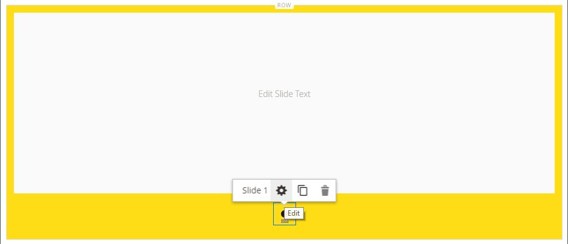

# Media - schuifregelaar

Gebruik het _inhoudstype van de Schuif_ om een diapresentatie van beelden aan het [[!DNL Page Builder]  stadium ](workspace.md#stage) toe te voegen. U kunt nieuwe afbeeldingen uploaden of bestaande afbeeldingen kiezen in de galerie of productcatalogus. Een schuifregelaar kan worden ingesteld op automatisch afspelen of kan handmatig met navigatieknoppen worden beheerd. Om de schuif met een specifieke bevordering te associëren, zie [ Dynamisch Blok ](dynamic-block.md).

{width="700" zoomable="yes"}

{{$include /help/_includes/page-builder-save-timeout.md}}

## Werkbalken

Wanneer u met het inhoudstype Slider werkt, voegt u afzonderlijke dia&#39;s en de schuifregelaarcontainer toe en bewerkt deze die een of meer dia&#39;s bevat. Elke dia heeft een eigen gereedschapset waarmee u dia&#39;s in het [!DNL Page Builder] -werkgebied kunt ontwerpen.

## Afzonderlijke dia, gereedschapset

{width="500" zoomable="yes"}

| Gereedschap | Pictogram | Beschrijving |
|--- |--- |--- |
| Verplaatsen | {width="25"} | Hiermee verplaatst u de dia naar een andere positie op de schuifregelaar. |
| (label) | Dianummer | Hiermee wordt het nummer van de huidige dia aangegeven. |
| Instellingen | {width="25"} | Hiermee opent u de pagina _[!UICONTROL Edit Slide]_, waar u de eigenschappen van de huidige dia kunt wijzigen. |
| Dupliceren | {width="25"} | Maakt een kopie van de huidige dia. |
| Verwijderen | {width="25"} | Hiermee verwijdert u de huidige dia uit de schuifregelaar. |

{style="table-layout:auto"}

## Gereedschapset Schuiven

| Gereedschap | Pictogram | Beschrijving |
|--- |--- |--- |
| Verplaatsen | {width="25"} | Hiermee verplaatst u de schuifregelaar naar een andere positie in het werkgebied. |
| (label) | [!UICONTROL Slider] | Hiermee wordt de container van de schuifregelaar aangegeven. |
| Instellingen | {width="25"} | Hiermee opent u de pagina _[!UICONTROL Edit Slider]_, waar u de eigenschappen van de video en de container kunt wijzigen. |
| Verbergen | {width="25"} | Hiermee verbergt u de huidige schuifregelaar. |
| Tonen | {width="25"} | Geeft de verborgen schuifregelaar weer. |
| Dupliceren | {width="25"} | Maakt een kopie van de schuifregelaar. |
| Verwijderen | {width="25"} | Hiermee verwijdert u de schuifregelaar uit het werkgebied. |

{style="table-layout:auto"}

{{$include /help/_includes/page-builder-hidden-element-note.md}}

## Een afzonderlijke dia toevoegen

1. Open de pagina, het blok of het dynamische blok waar u de schuifregelaar wilt plaatsen en vouw de sectie **[!UICONTROL Content]** uit.

1. Vouw in het deelvenster [!DNL Page Builder] **[!UICONTROL Media]** uit en sleep een tijdelijke aanduiding **[!UICONTROL Slider]** naar een rij, kolom of tab in het werkgebied.

   In het volgende voorbeeld is de achtergrondkleur van de rij geel (`#fffd16`).

   {width="600" zoomable="yes"}

   De schuifregelaarcontainer wordt in het werkgebied weergegeven met één lege dia.

1. Klik in de schuifcontainer om de [ tekstredacteur ](../content-design/editor.md) te tonen en inhoud voor de eerste dia in te gaan.

   U kunt complexere bannerinhoud ook omvatten gebruikend de [ montages van de Inhoud ](#content).

1. Klik de navigatiepunt bij de bodem van de schuif om toolbox voor de individuele dia te tonen en het _pictogram van Montages_ te kiezen ( {width="20"}).

   Schuifregelaars hebben twee gereedschapskisten. Zorg ervoor dat u de dioolbox bij de bodem gebruikt.

1. Vul de instellingen zo nodig in volgens de volgende secties:

   - [[!UICONTROL Appearance]](#appearance)
   - [[!UICONTROL Background]](#background)
   - [[!UICONTROL Content]](#content)
   - [[!UICONTROL Search Engine Optimization]](#seo)
   - [[!UICONTROL Advanced]](#advanced)

1. Klik na afloop op **[!UICONTROL Save]** om de instellingen toe te passen en terug te keren naar de werkruimte van [!DNL Page Builder] .

## Meer dia&#39;s toevoegen

In de volgende secties wordt een reeks stappen beschreven die moeten beginnen met een afzonderlijke dia en wordt een responsieve schuifregelaar gemaakt die functies en koppelingen naar specifieke producten bevat. Als u nog geen afzonderlijke dia hebt, volgt u de vorige instructies om een afzonderlijke dia aan het werkgebied toe te voegen.

U kunt als volgt dia&#39;s toevoegen:

### Methode 1: Een bestaande dia dupliceren

U kunt tijd besparen door een dia te dupliceren die al met de benodigde instellingen is geconfigureerd.

1. Klik de navigatiepunt onder de dia om toolbox te tonen en _te kiezen dupliceert_ ( {width="20"}) pictogram.

   {width="500" zoomable="yes"}

1. Klik de navigatiepunt voor de nieuwe dia en om toolbox te tonen en _te kiezen Montages_ ( {width="20"}).

1. Wijzig desgewenst de instellingen in de volgende secties:

   - [[!UICONTROL Appearance]](#appearance)
   - [[!UICONTROL Background]](#background)
   - [[!UICONTROL Content]](#content)
   - [[!UICONTROL Advanced]](#advanced)

1. Klik na afloop op **[!UICONTROL Save]** om de instellingen toe te passen en terug te keren naar de werkruimte van [!DNL Page Builder] .

### Methode 2: Een nieuwe, lege dia toevoegen

1. Beweeg over de schuifcontainer bij de bovenkant om toolbox te tonen en _te kiezen voeg_ toe ( {width="20"} toe) pictogram.

   {width="500" zoomable="yes"}

   Er wordt een nieuwe lege dia met een eigen navigatiepunt en gereedschapset toegevoegd aan de schuifregelaar en weergegeven in het werkgebied.

   {width="500" zoomable="yes"}

1. Klik de navigatiepunt voor de nieuwe dia en om toolbox te tonen en _te kiezen Montages_ ( {width="20"}).

1. Wijzig desgewenst de instellingen in de volgende secties:

   - [[!UICONTROL Appearance]](#appearance)
   - [[!UICONTROL Background]](#background)
   - [[!UICONTROL Content]](#content)
   - [[!UICONTROL Advanced]](#advanced)

1. Wanneer u klaar bent, klikt u op **[!UICONTROL Save]** in de rechterbovenhoek om de pagina _[!UICONTROL Edit Slide]_&#x200B;te sluiten.

### Widget toevoegen aan een dia

U kunt om het even welk [ widget type ](../content-design/widgets.md#widget-types) aan uw dia in a [!DNL Page Builder] stadium toevoegen gebruikend de volgende stappen:

1. [ creeer widget ](../content-design/widget-create.md) die u op een dia wilt zien.

1. Open de pagina, het blok of het dynamische blok waar u de schuifregelaar wilt plaatsen en vouw de sectie **[!UICONTROL Content]** uit.

1. Vouw in het deelvenster [!DNL Page Builder] **[!UICONTROL Media]** uit en sleep een tijdelijke aanduiding **[!UICONTROL Slider]** naar een rij, kolom of tab in het werkgebied.

1. Klik in de slidercontainer om de [ 1&rbrace; toolbar van de tekstredacteur &lbrace;te tonen en ](../content-design/editor.md) Widget van het Tussenvoegsel _(_ pictogram van het Tussenvoegsel widget {width="20"}

1. Selecteer de **[!UICONTROL Widget Type]** die u nodig hebt.

1. Geef de instellingen op. Deze verschillen afhankelijk van het type widget

   {width="600" zoomable="yes"}

1. Klik na voltooiing op **[!UICONTROL Insert Widget]** in de rechterbovenhoek.

1. Wijzig desgewenst de andere instellingen.

1. Klik na voltooiing op **[!UICONTROL Save]** in de rechterbovenhoek.

   {width="600" zoomable="yes"}

### Elke dia weergeven

Als u elke dia in het werkgebied wilt weergeven, klikt u op de volgende stip onder de momenteel weergegeven dia.

{width="500" zoomable="yes"}

De dia in het voorgaande voorbeeld heeft een achtergrondafbeelding, een transparante mobiele afbeelding en een inline-afbeelding die uit de teksteditor is toegevoegd. Deze techniek werkt goed op mobiele apparaten door de achtergrondafbeelding uit te schakelen en alleen de kleinere inline-afbeelding weer te geven. De productdia in dit voorbeeld heeft de volgende aanvullende instellingen:

| Optie | Voorbeeld instellen |
|--- |--- |
| [!UICONTROL Appearance] | `Collage Right` |
| [!UICONTROL Background Color] | `#ffffff` (wit) |
| [!UICONTROL Background Image] | De afbeelding op deze dia is opgeslagen vanaf de productpagina en geüpload naar de galerie. |
| [!UICONTROL Mobile Background Image] | De mobiele achtergrondafbeelding is een transparante afbeelding van 10 pixels vierkant. Als u een lege afbeelding voor mobiele apparaten gebruikt, wordt de standaardachtergrondafbeelding vervangen door een onzichtbare afbeelding. |
| [!UICONTROL Background Size] | `Auto` |
| [!UICONTROL Message Text] | `Minerva LumaTech&trade; V-Tee` (Centreren) met ingevoegde afbeelding geschaald op 40% (midden uitlijnen) |
| [!UICONTROL Link] | `Product` |
| [!UICONTROL Show Button] | `Always` |
| [!UICONTROL Button Text] | `Buy Now` |
| [!UICONTROL Show Overlay] | `Never Show` |
| [!UICONTROL Alignment] | `Center` (om de knop uit te lijnen) |
| [!UICONTROL Border] | `Solid` |
| [!UICONTROL Border Color] | `#000000` (Zwart) |
| [!UICONTROL Border Width] | `1 px` |

{style="table-layout:auto"}

## Afzonderlijke dia-instellingen wijzigen

1. Wijzig de weergave van de schuifregelaar in het werkgebied en bekijk de dia die u wilt wijzigen.

1. Voor individuele diasoolbox, kies het _pictogram van Montages_ ( {width="20"}) en voltooi de montages, zoals nodig, volgens volgende secties.

1. Klik in de rechterbovenhoek op **[!UICONTROL Save]** om de instellingen toe te passen en terug te keren naar de werkruimte van [!DNL Page Builder] .

### [!UICONTROL Appearance]

1. Kies een van de volgende typen diaplaatsing:

   | Type | Beschrijving |
   | ---- | ----------- |
   | `Poster` | Hiermee centreert u de dia-inhoud in de container van de schuifregelaar. Als u de bedekking gebruikt, wordt de volledige breedte van de schuifregelaar uitgebreid. |
   | `Collage Left` | Hiermee plaatst u de dia-inhoud in een gedefinieerd gebied aan de linkerkant van de schuifregelaarcontainer. De bedekking dekt, indien gebruikt, alleen het gedefinieerde gebied. |
   | `Collage Center` | Hiermee plaatst u de dia-inhoud in een gedefinieerd gebied dat is gecentreerd op de schuifregelaarcontainer. De bedekking dekt, indien gebruikt, alleen het gedefinieerde gebied. |
   | `Collage Right` | Hiermee plaatst u de dia-inhoud in een gedefinieerd gebied aan de rechterkant van de schuifregelaarcontainer. De bedekking dekt, indien gebruikt, alleen het gedefinieerde gebied. |

   {style="table-layout:auto"}

   {width="600" zoomable="yes"}

1. Voer de **[!UICONTROL Slide Name]** in.

   In de bewerkingsmodus wordt de dianaam weergegeven als knopinfo boven de navigatiepunt. De dianaam is niet zichtbaar van de storefront.

   {width="500" zoomable="yes"}

1. Voer de **[!UICONTROL Minimum Height]** in voor de dia.

   De minimumhoogte kan een getal zijn met elke geldige CSS-eenheid (zoals `100px` , `50%` , `50em` , `100vh` ) of een berekening (zoals `100vh - 237px` ).

   U kunt bijvoorbeeld instellen dat de minimale hoogte van de dia de volledige hoogte van de pagina beslaat en vervolgens achtergrondafbeeldingen en video&#39;s gebruiken voor aantrekkelijke ontwerpopties.

   >[!NOTE]
   >
   >Wanneer de dia op de volledige hoogte van de pagina (100vh) wordt geplaatst, rekt de schuif die de dia bevat ook de volledige hoogte van de pagina om de hoogte van de dia aan te passen.

## [!UICONTROL Background]

Er zijn veel opties voor het definiëren van de achtergrondweergave van een dia. U kunt een eenvoudige kleur- of achtergrondafbeelding toepassen en geavanceerde effecten beheren.

### [!UICONTROL Background Color]

Geef de achtergrondkleur op door een staal te kiezen, op de kleurkiezer te klikken of door een geldige kleurnaam of een gelijkwaardige hexadecimale waarde in te voeren. Deze instelling bepaalt de achtergrondkleur van de rij. U kunt ook de dekking van de kleur aanpassen.

{width="200"}

U kunt de waarde op drie manieren instellen:

- Een vooraf gedefinieerde kleurnaam, zoals `White`
- De hexadecimale kleurwaarde voor de kleur, zoals `#ffffff`
- De RGB-waarde voor de kleur, met een dekkingspercentage, zoals `rgba(255, 255, 255, 0.75)`

Als u een kleur wilt kiezen, klik het monster links van _Geen doos van de Kleur_.

{width="600" zoomable="yes"}

Als u nogmaals op het kleurvak klikt om de kleurkiezer te openen, worden in het vak onder de schuifregelaar de huidige waarden voor rood, groen, blauw en alpha (rgba) weergegeven. Het laatste getal geeft het huidige dekkingspercentage aan als een decimaal. U kunt de schuifregelaar gebruiken om de dekking aan te passen of de gewenste decimale waarde invoeren.

{width="600" zoomable="yes"}

>[!NOTE]
>
>[!DNL Page Builder] steunt ook een transparantielaag, of _alpha- kanaal_, in achtergrondbeelden die kunnen worden gebruikt om achtergronden met variërende graden van opaciteit tot stand te brengen.

### [!UICONTROL Background Type]

Een achtergrondtype kan een afbeelding of video zijn. [!DNL Page Builder] is standaard ingesteld op `Image` en geeft verschillende afbeeldingsinstellingen weer. Als u `Video` selecteert, vervangt [!DNL Page Builder] de afbeeldingsinstellingen door video-instellingen. Beide instellingen voor achtergrondtypen worden in de volgende secties beschreven.

{width="400"}

### Instellingen voor afbeeldingstypen

Als u de _[!UICONTROL Background Type]_&#x200B;op `Image` instelt, gebruikt u de volgende instellingen om de weergave van de achtergrondafbeelding te definiëren.

{width="600" zoomable="yes"}

- **[!UICONTROL Background Image]** - Kies zo nodig met de beschikbare gereedschappen een achtergrondafbeelding die u op de banner wilt toepassen:

  | Gereedschap | Beschrijving |
  | ---- | ----------- |
  | [!UICONTROL Upload] | Uploadt een afbeeldingsbestand van uw lokale computer naar de galerie en past het vervolgens toe als de achtergrondafbeelding voor de banner. |
  | [!UICONTROL Select from Gallery] | Hiermee wordt u gevraagd een bestaande afbeelding in de galerie te kiezen als achtergrondafbeelding voor de banner. |
  | {width="25"} | Hiermee kunt u de afbeelding naar de tegel van de camera slepen of naar de afbeelding in uw lokale bestandssysteem bladeren. |

  {style="table-layout:auto"}

- **[!UICONTROL Background Mobile Image]** - Gebruik indien nodig dezelfde gereedschappen om een andere achtergrondafbeelding te kiezen die u wilt gebruiken voor weergave op mobiele apparaten.

- **[!UICONTROL Background Size]** - Kies hoe de achtergrondafbeelding wordt geschaald ten opzichte van de breedte van de banner:

  | Optie | Beschrijving |
  | ------ | ----------- |
  | `Cover` | De achtergrondafbeelding bedekt de volledige breedte van de banner. |
  | `Contain` | De achtergrondafbeelding is beperkt tot de breedte van het inhoudsgebied. |
  | `Auto` | Hiermee past u de grootte van het huidige stijlblad toe. |

  {style="table-layout:auto"}

  {width="400"}

- **[!UICONTROL Background Position]** - Kies hoe de achtergrondafbeelding ten opzichte van de banner is verankerd:

  | Ankerpunt | Positie |
  | ------------ | -------- |
  | `Top` | Links/midden/rechts |
  | `Center` | Links/midden/rechts |
  | `Bottom` | Links/midden/rechts |

  {style="table-layout:auto"}

  Het ankerpunt is als een drukknop die de afbeelding op de opgegeven achtergrondpositie aan de banner koppelt.

- **[!UICONTROL Background Repeat]** - Als u de achtergrondafbeelding wilt herhalen om de ruimte te vullen, wijzigt u deze instelling `Yes` .

### Instellingen voor videotypen

Als u het _Type van Achtergrond_ aan `Video` plaatst, gebruik de volgende montages om de vertoning van het achtergrondbeeld te bepalen.

- **[!UICONTROL Video URL]** - Voer een geldige video-URL in. Geldige video-URL&#39;s kunnen koppelingen zijn naar:

   - YouTube-video&#39;s: `https://youtu.be/CoDhMRUUjeI`
   - Vimeo-video&#39;s: `https://vimeo.com/190156113`
   - Geldige videobestanden (`.mp4` wordt aanbevolen): `https://myvideos.com/spiral.mp4`

  {width="500"}

- **[!UICONTROL Overlay Color]** - Selecteer een kleur om een transparante tint toe te passen op de video.

- **[!UICONTROL Infinite Loop]** - Ingesteld op `No` om de video eenmaal af te spelen en te stoppen. Wanneer deze optie is ingesteld op `Yes` (standaardwaarde), wordt de video in een oneindige lus herhaald.

- **[!UICONTROL Lazy Load]** - Ingesteld op `No` om de video met de pagina te laden, zelfs als deze niet zichtbaar is. Wanneer deze optie is ingesteld op `Yes` (standaardwaarde), wordt de video alleen vanaf de bron geladen wanneer deze zichtbaar is op het scherm.

- **[!UICONTROL Play Only When Visible]** - Ingesteld op `No` om het afspelen van de video direct te starten nadat deze is geladen, ongeacht of deze zichtbaar is. Wanneer deze optie is ingesteld op `Yes` (standaardwaarde), wordt het afspelen van de video alleen gestart wanneer deze zichtbaar is.

- **[!UICONTROL Fallback Image]** - Geef indien nodig een afbeelding op die op het scherm moet worden weergegeven voordat de video wordt geladen en als de video om welke reden dan ook niet wordt geladen.

## [!UICONTROL Content]

U kunt de dia-inhoud rechtstreeks in het werkgebied wijzigen of wanneer u de instellingen wijzigt. De instellingen bieden complexere inhoudseigenschappen, zoals diakoppelingen en knoppen, en overlays. De positie van de inhoud wijst op de [ Verschijning ](#appearance) plaatsing die.

### Eenvoudige inhoud in het werkgebied

1. Klik op de tijdelijke aanduiding of de bestaande tekst en voer de nieuwe tekst in die u op de dia wilt weergeven.

   De editor-werkbalk wordt boven het tekstvak weergegeven.

1. Gebruik de editor-werkbalk om tekst in te voeren en op te maken, en om elementen in te voegen, zoals koppelingen, afbeeldingen en widgets.

   {width="500" zoomable="yes"}

### Complexe inhoud in de instellingen

1. Klik de navigatiepunt bij de bodem van de schuif om toolbox voor de individuele dia te tonen en het _pictogram van Montages_ te kiezen ( {width="20"}).

1. Voer in de sectie _[!UICONTROL Content]_&#x200B;de **[!UICONTROL Message Text]**&#x200B;in die u bij de dia wilt weergeven.

1. Blader omlaag naar de sectie _[!UICONTROL Content]_&#x200B;en gebruik de editor **[!UICONTROL Message Text]**&#x200B;om bannertekst in te voeren en op te maken.

   U kunt ook elementen invoegen, zoals tekstkoppelingen, afbeeldingen en widgets.

1. Maak de tekst desgewenst op met de editor-werkbalk.

   De eerste dia in dit voorbeeld heeft een achtergrondafbeelding, maar geen berichttekst. De `Buy 3 Get 1 Free` -tekst boven de schuifregelaar bevindt zich in een tekstcontainer (later toegevoegd).

1. Geef indien nodig een **[!UICONTROL Link]** voor de dia op.

   De koppeling is de doelpagina die wordt weergegeven wanneer de klant op het diagebied klikt. U kunt een van de volgende drie typen koppelingen gebruiken:

   - **[!UICONTROL URL]** - Koppelingen naar een relatieve of volledig gekwalificeerde URL.

   - **[!UICONTROL Product]** - Identificeert de bestemmingspagina die op de productnaam of SKU wordt gebaseerd. Zoek het product op naam die op of een gedeeltelijke of volledige naam wordt gebaseerd. Kies het product in de lijst met zoekresultaten.

     {width="600" zoomable="yes"} te verbinden

   - **[!UICONTROL Category]** - Hiermee wordt de doelpagina geïdentificeerd als een specifieke categorie of subcategorie in de categoriestructuur. Zoek de categorie op basis van een gedeeltelijke of volledige naam. Kies de categorie in het uitgebreide gedeelte van de weergegeven structuur.

     {width="600" zoomable="yes"} te verbinden

   - **[!UICONTROL Page]** - Hiermee wordt de doelpagina geïdentificeerd als een specifieke inhoudspagina. Zoeken naar de pagina op basis van een gedeeltelijke of volledige naam. Kies de pagina in de lijst met zoekresultaten.

     {width="600" zoomable="yes"}

   

   Vanaf versie 2.4.1 ondersteunt [!DNL Page Builder] geen koppeling meer tussen de dia en koppelingen in de geneste tekst vanwege problemen met de weergave op de winkel. Als u een verbinding in _ [!UICONTROL Message Text]_ gebruikt, kunt u niet de _ [!UICONTROL Link] _optie vormen. Als u liever één koppeling gebruikt voor de hele dia, kunt u alle koppelingen uit de tekst verwijderen.

   {width="300"}
   

   Schakel het selectievakje **[!UICONTROL Open in new tab]** in als u wilt voorkomen dat de bezoeker uit uw winkel navigeert. Wanneer het selectievakje is uitgeschakeld, wordt de gekoppelde bestemming geopend op hetzelfde browsertabblad, waardoor de bezoeker daadwerkelijk van de winkel kan wegnavigeren.

1. Voeg zo nodig een knop toe om klanten te vragen de koppeling te volgen.

   De dia _Verschijning_ positie plaatst één enkele verbinding of knoop onder de tekst. Vul de eigenschappen in van de koppeling of knop die u wilt toevoegen.

   {width="600" zoomable="yes"}

   >[!NOTE]
   >
   >U kunt veelvoudige knopen of verbindingen ook gebruiken door a [ blok ](block.md) aan de banner toe te voegen. U voorkomt conflicten door alle koppelingen of knoppen in het aparte blok te houden en geen koppeling of knop rechtstreeks aan de banner toe te voegen.

   - Stel **[!UICONTROL Show Button]** in op een van de volgende opties:

     | Optie | Beschrijving |
     | ------ | ----------- |
     | `Always` | Er verschijnt altijd een knop op de dia. |
     | `On Hover` | Een knop verschijnt alleen op de dia als u de muisaanwijzer plaatst. |
     | `Never Show` | Er verschijnt nooit een knop op de dia. |

     {style="table-layout:auto"}

   - Voer de **[!UICONTROL Button Text]** in die u op de knop wilt weergeven.

   - Stel **[!UICONTROL Button Type]** in op een van de volgende opties:

     | Optie | Beschrijving |
     | ------ | ----------- |
     | `Primary` | Past de primaire knoopstijl van het huidige stijlblad toe. |
     | `Secondary` | Past de secundaire knoopstijl van het huidige stijlblad toe, indien van toepassing. |
     | `Link` | Maakt een hyperlink in plaats van een knop. |

     {style="table-layout:auto"}

     De knopstijl van het huidige thema bepaalt de knopindeling. Een primaire knop heeft doorgaans een prominentere achtergrondkleur dan een secundaire knop.

1. Stel **[!UICONTROL Show Overlay]** in op een van de volgende opties:

   | Optie | Beschrijving |
   | ------ | ----------- |
   | `Always` | De bedekking is altijd zichtbaar. |
   | `On Hover` | De bedekking wordt alleen weergegeven bij aanwijzen. |
   | `Never Show` | De bedekking is niet zichtbaar. |

   {style="table-layout:auto"}

   Met een bedekking kunt u een achtergrondkleur toepassen op het actieve inhoudsgebied dat wordt gedefinieerd door de instelling Weergave. De achtergrondafbeelding van de dia blijft zichtbaar voor de volledige breedte van de dia.

   {width="600" zoomable="yes"}

   Als u een bedekking wilt weergeven, stelt u de optie **[!UICONTROL Overlay Color]** in:

   - Klik het _Geen Monster van de Kleur_, en kies een monster.
   - Voer in het veld **[!UICONTROL Color]** een geldige kleurnaam of een hexadecimale waarde in.

   {width="600" zoomable="yes"}

## [!UICONTROL Search Engine Optimization] {#seo}

Tekst voor deze instellingen is zichtbaar voor zoekprogramma&#39;s en verbetert de manier waarop de pagina wordt geïndexeerd.

- Voor **[!UICONTROL Alternative Text]**, ga een _alt_ tekstbeschrijving voor digitale toegankelijkheidshulpmiddelen in om te tonen.

  Het gebruik van alt-tekst is een beste praktijk op het gebied van toegankelijkheid en wordt in sommige landinstellingen wettelijk voorgeschreven. In HTML is het kenmerk `alt` een subset van de tag `image` tag: `<image title="tooltip" alt="description" src="image.jpg">` .

- Voer bij **[!UICONTROL Title Attribute]** de tekst in die als knopinfo bij mouseover moet worden weergegeven.

  U kunt het beste een beschrijvende titel met veel trefwoorden kiezen om de manier waarop de afbeelding wordt geïndexeerd door zoekprogramma&#39;s te verbeteren. In HTML is het kenmerk `title` een subset van de tag `image` tag: `<image title="tooltip" alt="description" src="image.jpg">` .

## [!UICONTROL Advanced]

1. Kies de optie **[!UICONTROL Alignment]** als u de horizontale plaatsing wilt bepalen van de inhoud die aan de dia wordt toegevoegd:

   | Optie | Beschrijving |
   | ------ | ----------- |
   | `Default` | Hiermee past u de standaardinstelling voor uitlijning toe die is opgegeven in het stijlblad van het huidige thema. |
   | `Left` | Hiermee lijnt u de inhoud uit langs de linkerrand van de dia, waarbij rekening wordt gehouden met de opgegeven opvulling. |
   | `Center` | Hiermee lijnt u de inhoud in het midden van de dia uit, rekening houdend met de opgegeven opvulling. |
   | `Right` | Hiermee lijnt u de inhoud uit langs de rechterrand van de dia, waarbij rekening wordt gehouden met de opgegeven opvulling. |

   {style="table-layout:auto"}

1. Stel de **[!UICONTROL Border]** -stijl in die op alle vier de zijden van de dia wordt toegepast:

   | Optie | Beschrijving |
   | ------ | ----------- |
   | `Default` | Past de standaardrandstijl toe die door het bijbehorende stijlblad wordt gespecificeerd. |
   | `None` | Hiermee geeft u geen zichtbare indicatie van de diaranden. |
   | `Dotted` | De containerrand wordt weergegeven als een stippellijn. |
   | `Dashed` | De containerrand wordt weergegeven als een onderbroken lijn. |
   | `Solid` | De containerrand wordt weergegeven als een effen lijn. |
   | `Double` | De containerrand wordt weergegeven als een dubbele lijn. |
   | `Groove` | De containerrand wordt weergegeven als een gegroefde lijn. |
   | `Ridge` | De containerrand wordt weergegeven als een afgeronde lijn. |
   | `Inset` | De containerrand wordt weergegeven als een inzetlijn. |
   | `Outset` | De containerrand wordt weergegeven als een omtreklijn. |

   {style="table-layout:auto"}

1. Als u een andere randstijl dan `None` instelt, voert u de weergaveopties voor de rand in:

   {width="600" zoomable="yes"}

   | Optie | Beschrijving |
   | ------ |------------ |
   | [!UICONTROL Border Color] | Geef de kleur op door een staal te kiezen, op de kleurkiezer te klikken of door een geldige kleurnaam of een gelijkwaardige hexadecimale waarde in te voeren. |
   | [!UICONTROL Border Width] | Voer het aantal pixels in voor de lijnbreedte van de rand. |
   | [!UICONTROL Border Radius] | Voer het aantal pixels in om de grootte te bepalen van de straal die wordt gebruikt om elke hoek van de rand te afronden. |

   {style="table-layout:auto"}

1. (Optioneel) Geef de namen van **[!UICONTROL CSS classes]** op uit de huidige stijlpagina die u op de dia wilt toepassen.

   Scheid meerdere klassennamen met een spatie.

1. Voer in pixels waarden in voor de **[!UICONTROL Margins and Padding]** om de buitenste marges en de binnenopvulling van de dia op te geven.

   Voer elke bijbehorende waarde in het diadiagram in.

   | Containergebied | Beschrijving |
   | -------------- | ----------- |
   | [!UICONTROL Margins] | De hoeveelheid lege ruimte die op de buitenrand van alle kanten van de dia wordt toegepast. |
   | [!UICONTROL Padding] | De hoeveelheid lege ruimte die op de binnenrand van alle kanten van de dia wordt toegepast. |

   {style="table-layout:auto"}

## Een titel van een schuifregelaar toevoegen

Als u een titel boven de schuif wilt, voeg eenvoudig het inhoudstype van de a [ Tekst ] boven de schuif toe. Maak de tekst vervolgens zo nodig op.

1. In het [!DNL Page Builder] paneel, breid **[!UICONTROL Elements]** uit en sleep placeholder van de a **Tekst** aan een rij, een kolom, of een lusjereeks op het stadium.

   Terwijl u sleept, markeert een rode hulplijn het invoegpunt boven de schuifregelaar.

   {width="600" zoomable="yes"}

1. Gebruik de editor om de tekst zo nodig op te maken.

   {width="500" zoomable="yes"}

## Instellingen van schuifregelaar wijzigen

1. Beweeg over de slidercontainer om belangrijkste toolbox te tonen en de _Montages_ te kiezen ( {width="20"}).

   {width="500" zoomable="yes"}

1. Voer de **[!UICONTROL Minimum Height]** in voor de dia.

   De minimumhoogte kan een getal zijn met elke geldige CSS-eenheid (zoals `100px` , `50%` , `50em` , `100vh` ) of een berekening (zoals `100vh - 237px` ).

   U kunt bijvoorbeeld de minimumhoogte van een schuifregelaar zo instellen dat de volledige hoogte van de pagina wordt uitgerekt. Zo hebt u aantrekkelijke opties voor achtergrondafbeeldingen en video&#39;s van volledige pagina.

   {width="400"}

1. Als u wilt dat de schuifregelaar begint wanneer de pagina wordt geladen, stelt u **[!UICONTROL Autoplay]** in op `Yes` en stelt u **[!UICONTROL Autoplay Speed]** in op het aantal milliseconden in de vertraging tussen de dia&#39;s.

   De snelheid wordt standaard ingesteld op 4000 ms. Dit is vier seconden. Als u Automatisch afspelen instelt op `No` , wordt standaard de eerste dia weergegeven en moet de klant op de schuifnavigatie (punten of pijlen) klikken om de volgende dia in de juiste volgorde weer te geven.

   {width="600" zoomable="yes"}

1. Als u de overgang van de ene dia naar de andere vloeiend wilt maken, stelt u **[!UICONTROL Fade]** in op `Yes` .

   Met vervagen lijken de dia&#39;s op hun plaats te blijven, maar de inhoud verandert van de ene naar de andere vloeiend. Zonder vervagen ziet u de horizontale verplaatsing van de ene dia naar de volgende.

   {width="600" zoomable="yes"}

1. Als u wilt dat de diapresentatie oneindig wordt herhaald terwijl de pagina is geopend, stelt u **[!UICONTROL Infinite Loop]** in op `Yes` .

1. Ga als volgt te werk om het type navigatie-elementen voor de schuifregelaar te kiezen:

   - Om _Volgende_ en _Vorige_ pijlen op de linkerzijde en de rechterkant van elke dia te omvatten, plaats **[!UICONTROL Show Arrows]** aan `Yes`.

   - Stel **[!UICONTROL Show Dots]** in op `Yes` als u een set navigatiepunten onder de schuifregelaar wilt opnemen.

   {width="600" zoomable="yes"}

1. Voltooi de [ Geavanceerde ](#slider-advanced) slidermontages zoals nodig.

1. Klik na afloop op **[!UICONTROL Save]** om de instellingen toe te passen en terug te keren naar de werkruimte van [!DNL Page Builder] .

### Geavanceerd - schuifregelaar {#slider-advanced}

1. Kies de optie **[!UICONTROL Alignment]** als u de positionering van de dia&#39;s binnen de bovenliggende schuifregelaarcontainer wilt bepalen:

   | Optie | Beschrijving |
   | ------ | ----------- |
   | `Default` | Hiermee past u de standaardinstelling voor uitlijning toe die is opgegeven in het stijlblad van het huidige thema. |
   | `Left` | Hiermee lijnt u de dia&#39;s uit langs de linkerrand van de schuifregelaarcontainer, waarbij rekening wordt gehouden met de opgegeven opvulling. |
   | `Center` | Hiermee lijnt u de dia&#39;s uit in het midden van de schuifregelaarcontainer, waarbij rekening wordt gehouden met de opgegeven opvulling. |
   | `Right` | Hiermee lijnt u de dia&#39;s uit langs de rechterrand van de schuifregelaarcontainer, waarbij rekening wordt gehouden met de opgegeven opvulling. |

   {style="table-layout:auto"}

1. Stel de stijl **[!UICONTROL Border]** in die wordt toegepast op alle vier zijden van de schuifregelaarcontainer:

   | Optie | Beschrijving |
   | ------ | ----------- |
   | `Default` | Past de standaardrandstijl toe die door het bijbehorende stijlblad wordt gespecificeerd. |
   | `None` | Geeft geen zichtbare indicatie van de containerranden. |
   | `Dotted` | De containerrand wordt weergegeven als een stippellijn. |
   | `Dashed` | De containerrand wordt weergegeven als een onderbroken lijn. |
   | `Solid` | De containerrand wordt weergegeven als een effen lijn. |
   | `Double` | De containerrand wordt weergegeven als een dubbele lijn. |
   | `Groove` | De containerrand wordt weergegeven als een gegroefde lijn. |
   | `Ridge` | De containerrand wordt weergegeven als een afgeronde lijn. |
   | `Inset` | De containerrand wordt weergegeven als een inzetlijn. |
   | `Outset` | De containerrand wordt weergegeven als een omtreklijn. |

   {style="table-layout:auto"}

1. Als u een andere randstijl dan `None` instelt, voert u de weergaveopties voor de rand in:

   | Optie | Beschrijving |
   | ------ |------------ |
   | [!UICONTROL Border Color] | Geef de kleur op door een staal te kiezen, op de kleurkiezer te klikken of door een geldige kleurnaam of een gelijkwaardige hexadecimale waarde in te voeren. |
   | [!UICONTROL Border Width] | Voer het aantal pixels in voor de lijnbreedte van de rand. |
   | [!UICONTROL Border Radius] | Voer het aantal pixels in om de grootte te bepalen van de straal die wordt gebruikt om elke hoek van de rand te afronden. |

   {style="table-layout:auto"}

1. (Optioneel) Geef de namen van **[!UICONTROL CSS classes]** op uit het huidige stijlblad die u wilt toepassen op de schuifregelaarcontainer.

   Scheid meerdere klassennamen met een spatie.

1. Voer in pixels waarden in waarmee de buitenste marges en de binnenopvulling van de schuifregelaar worden bepaald door de **[!UICONTROL Margins and Padding]** .

   Voer de overeenkomende waarden in het diagram in.

   | Containergebied | Beschrijving |
   | -------------- | ----------- |
   | [!UICONTROL Margins] | De hoeveelheid lege ruimte die wordt toegepast op de buitenrand van alle zijden van de container. |
   | [!UICONTROL Padding] | De hoeveelheid lege ruimte die wordt toegepast op de binnenrand van alle zijden van de container. |

   {style="table-layout:auto"}

## De schuifregelaar testen

1. Open de pagina waar u de schuifregelaar hebt opgenomen en stel **[!UICONTROL Enable Page]** in op `Yes` .

1. Klik in de rechterbovenhoek op de pijl **[!UICONTROL Save]** en kies **[!UICONTROL Save & Close]** .

1. Vind de pagina in het _Net van Pagina&#39;s_ en selecteer **[!UICONTROL View]** in de _[!UICONTROL Action]_&#x200B;kolom.

   {width="600" zoomable="yes"}

   Wanneer u de schuifregelaar voorvertoont, wijzigt u de grootte van het venster, zodat u kunt zien hoe het op een mobiel apparaat wordt weergegeven.

   {width="400" zoomable="yes"}

<!-- Last updated from includes: 2023-09-11 14:30:19 -->
