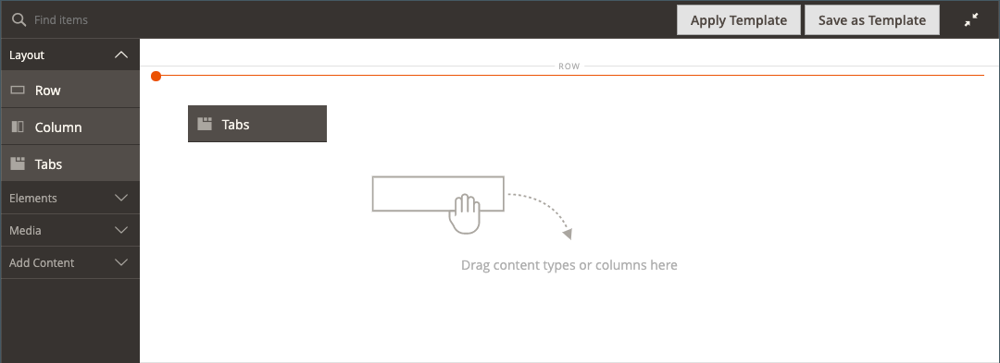

# Layout - tabbladen

Gebruik het _inhoudstype van Lusjes_ om een reeks lusjes in het [[!DNL Page Builder]  stadium ](workspace.md#stage) toe te voegen. Wanneer u de tijdelijke aanduiding voor tabs van het deelvenster naar het werkgebied sleept, wordt in eerste instantie één standaardtabblad weergegeven. U kunt meer tabbladen toevoegen om een volledige set te maken. De breedte van de tabset wordt bepaald door de breedte van de bovenliggende container en de instellingen voor opvulling.

{width="500" zoomable="yes"}

{{$include /help/_includes/page-builder-save-timeout.md}}

## Werkbalken

Wanneer u met het _inhoudstype van Lusjes_ werkt, voegt u individuele lusjes en de container van lusjes toe en uitgeeft die één of meerdere lusjes houdt. Elk tabblad heeft een eigen gereedschapset waarmee u tabbladen in het [!DNL Page Builder] -werkgebied kunt ontwerpen.

### Afzonderlijke tabgereedschapset

{width="500" zoomable="yes"}

| Gereedschap | Pictogram | Beschrijving |
|--- |--- |--- |
| Verplaatsen | {width="25"} | Dit besturingselement naast het tablabel wordt gebruikt om de afzonderlijke tab naar een andere positie in de tabset te verplaatsen. |
| Instellingen | {width="25"} | Hiermee opent u de pagina Tabs bewerken, waarin u de eigenschappen van het afzonderlijke tabblad kunt wijzigen. |
| Dupliceren | {width="25"} | Hiermee maakt u een kopie van de tab. |
| Verwijderen | {width="25"} | Hiermee verwijdert u de tab uit de tabset. |

{style="table-layout:auto"}

### Gereedschapset voor tabcontainers

{width="500" zoomable="yes"}

| Gereedschap | Pictogram | Beschrijving |
|--- |--- |--- |
| Verplaatsen | {width="25"} | Hiermee verplaatst u de set met tabbladen naar een andere positie op het raster in de bovenliggende container. |
| Toevoegen | {width="25"} toe | Hiermee voegt u een tab toe aan de tabset. |
| (label) | [!UICONTROL Tabs] | Identificeert de huidige container als tabset. Houd de muisaanwijzer boven de bovenrand van de container om de gereedschapset weer te geven. |
| Instellingen | {width="25"} | Hiermee opent u de pagina Tabblad bewerken, waarin u de eigenschappen van de container kunt wijzigen. |
| Verbergen | {width="25"} | Hiermee verbergt u de tabcontainer. |
| Tonen | {width="25"} | Hiermee wordt de verborgen tabcontainer weergegeven. |
| Dupliceren | {width="25"} | Hiermee maakt u een kopie van het huidige tabblad. |
| Verwijderen | {width="25"} | Hiermee verwijdert u de huidige tabset uit het werkgebied. |

{style="table-layout:auto"}

{{$include /help/_includes/page-builder-hidden-element-note.md}}

## Een afzonderlijk tabblad toevoegen

1. Sleep de tijdelijke aanduiding **[!UICONTROL Tabs]** in het deelvenster [!DNL Page Builder] onder _[!UICONTROL Layout]_rechtstreeks naar het werkgebied of naar een rij of kolom in het werkgebied.

   {width="600" zoomable="yes"}

1. Klik het **[!UICONTROL Tab 1]** etiket om individuele tabtoolbox te tonen en de _Montages_ te kiezen ( {width="20"} ).

1. Voer de **[!UICONTROL Tab Name]** in die u als label wilt gebruiken.

   {width="600" zoomable="yes"} ingaat

1. Voer indien nodig de **[!UICONTROL Minimum Height]** voor de tab in.

   Deze waarde kan een getal zijn met elke geldige CSS-eenheid (zoals `100px` , `50%` , `50em` , `100vh` ) of een berekening (zoals `100vh - 237px` ).

1. Kies een instelling **[!UICONTROL Vertical Alignment]** om inhoudscontainers uit te lijnen die aan het tabblad zijn toegevoegd (Boven, Midden of Onder).

1. Stel zo nodig de andere opties in met de volgende secties als richtlijn:

   - [[!UICONTROL Background]][background]
   - [[!UICONTROL Advanced]][advanced]

1. Klik in de rechterbovenhoek op **[!UICONTROL Save]** om de instellingen toe te passen en terug te keren naar de werkruimte van [!DNL Page Builder] .

## Een set tabbladen toevoegen

De volgende stappen beginnen met een afzonderlijk tabblad en maken een set van drie tabbladen in een tabcontainer. Als u nog geen afzonderlijke tab hebt, volgt u de vorige instructies om één tab aan het werkgebied toe te voegen.

1. Beweeg over de lussencontainer om toolbox te tonen en _te kiezen voeg_ toe ( {width="20"} toe) pictogram.

1. Klik in het label **[!UICONTROL Tab 2]** om de cursor weer te geven en voer uw eigen label voor het tabblad in.

1. Klik opnieuw het tweede lusje op het stadium en kies _Dupliceer_ ( {width="20"}) pictogram.

1. Klik in het label YourName **[!UICONTROL Copy]** om de cursor weer te geven en voer uw eigen label voor het derde tabblad in.

{width="600" zoomable="yes"}

## Een tabblad in de set verplaatsen

1. Klik op het tabblad dat u wilt verplaatsen.

1. Selecteer en sleep het _pictogram van de Beweging_ ( {width="20"}), dat net vóór de tekst van het lusjelabel verschijnt, aan een nieuwe positie binnen de lusjereeks.

## Inhoud toevoegen aan een tabblad

U kunt elk inhoudstype op een tabblad toepassen, net als bij een rij. Gebruik de volgende stappen om een tekstinhoudstype als voorbeeld toe te voegen.

1. Klik op het tabblad waar u de inhoud wilt toevoegen.

1. In het [!DNL Page Builder] paneel, breid **[!UICONTROL Elements]** uit en sleep placeholder van de a **Tekst** aan de tabel.

1. Typ of plak tekst in de editor en gebruik de editor-werkbalk om deze zo nodig op te maken.

   Zie [ Elementen - Tekst ](text.md) voor meer informatie over het werken met het type van tekstinhoud.

   {width="500" zoomable="yes"} wordt toegevoegd

1. Klik in de rechterbovenhoek op **[!UICONTROL Save]** .

## Afzonderlijke tabinstellingen wijzigen

1. Beweeg over een individueel lusje om toolbox te tonen en de _pictogram van Montages_ te kiezen ( {width="20"}).

1. Wijzig zo nodig de basisinstellingen voor het tabblad:

   - **[!UICONTROL Tab Name]** - Voer gereviseerde tekst voor het tablabel in. U kunt het label ook rechtstreeks in het werkgebied wijzigen.

   - **[!UICONTROL Minimum Height]** - ga als pixel in als u de automatische hoogte wilt met voeten treden. U kunt bijvoorbeeld de minimumhoogte instellen zodat deze overeenkomt met de hoogte van een achtergrondafbeelding, zodat de volledige afbeelding zichtbaar is.

   - **[!UICONTROL Vertical Alignment]** - Kies de verticale positie van inhoudscontainers die aan het tabblad worden toegevoegd.

1. Wijzig desgewenst de overige instellingen met de volgende secties voor meer informatie.

1. Klik na afloop op **[!UICONTROL Save]** om de instellingen toe te passen en terug te keren naar de werkruimte van [!DNL Page Builder] .

### Achtergrond

- **[!UICONTROL Background Color]** - Geef de achtergrondkleur op door een staal te kiezen, op de kleurkiezer te klikken of door een geldige kleurnaam of een gelijkwaardige hexadecimale waarde in te voeren. Deze instelling bepaalt de achtergrondkleur van de rij. U kunt ook de dekking van de kleur aanpassen.

  {width="200"}

  U kunt een waarde op drie manieren invoeren:

   - Een vooraf gedefinieerde kleurnaam, zoals `White`

   - De hexadecimale kleurwaarde voor de kleur, zoals `#ffffff`

   - De RGB-waarde voor de kleur, met een dekkingspercentage, zoals `rgba(255, 255, 255, 0.75)`

  Als u een kleur wilt kiezen, klik het monster links van _Geen doos van de Kleur_.

  {width="600" zoomable="yes"}

  Als u nogmaals op het kleurvak klikt om de kleurkiezer te openen, worden in het vak onder de schuifregelaar de huidige waarden voor rood, groen, blauw en alpha (rgba) weergegeven. Het laatste getal geeft het huidige dekkingspercentage aan als een decimaal. U kunt de schuifregelaar gebruiken om de dekking aan te passen of de gewenste decimale waarde invoeren.

  {width="600" zoomable="yes"}

  >[!NOTE]
  >
  >[!DNL Page Builder] steunt ook een transparantielaag, of _alpha- kanaal_, in achtergrondbeelden die kunnen worden gebruikt om achtergronden met variërende graden van opaciteit tot stand te brengen.

- **[!UICONTROL Background Image]** - Kies zo nodig met de beschikbare gereedschappen een achtergrondafbeelding die u op het tabblad wilt toepassen:

  | Gereedschap | Beschrijving |
  |--- |--- |
  | [!UICONTROL Upload] | Uploadt een afbeeldingsbestand van uw lokale computer naar de galerie en past het vervolgens toe als achtergrondafbeelding voor de tab. |
  | [!UICONTROL Select from Gallery] | Hiermee wordt u gevraagd een bestaande afbeelding in de galerie te kiezen als achtergrondafbeelding voor het tabblad. |
  | {width="25"} | Hiermee kunt u de afbeelding naar de tegel van de camera slepen of naar de afbeelding in uw lokale bestandssysteem bladeren. |

  {style="table-layout:auto"}

- **[!UICONTROL Background Mobile Image]** - Gebruik indien nodig dezelfde gereedschappen om een andere achtergrondafbeelding te kiezen die u wilt gebruiken voor weergave op mobiele apparaten.

- **[!UICONTROL Background Size]** - Kies hoe de achtergrondafbeelding wordt geschaald ten opzichte van de breedte van het tabblad:

  | Optie | Beschrijving |
  |--- |--- |
  | `Cover` | De achtergrondafbeelding bedekt de volledige breedte van de tab. |
  | `Contain` | De achtergrondafbeelding is beperkt tot de breedte van het tabgebied. |
  | `Auto` | Hiermee past u de grootte van het huidige stijlblad toe. |

  {style="table-layout:auto"}

- **[!UICONTROL Background Position]** - Bepaal hoe de achtergrondafbeelding ten opzichte van het tabblad wordt verankerd: `Top Left` / `Top Center` / `Top Right` / `Center Left` / `Center` / `Center Right` / `Bottom Left` / `Bottom Center` / `Bottom Right`

- **[!UICONTROL Background Attachment]** - Kies het type bijlage om te bepalen hoe de achtergrondafbeelding ten opzichte van de schuifpagina wordt verplaatst:

  | Optie | Beschrijving |
  | --- | --- |
  | `Scroll` | De bijgevoegde achtergrondafbeelding wordt gesynchroniseerd zodat deze omlaag wordt verplaatst wanneer de pagina wordt verschoven. |
  | `Fixed` | (Niet beschikbaar voor mobiele apparaten) De achtergrondafbeelding wordt niet verplaatst wanneer de container over de afbeelding schuift en op de opgegeven achtergrondpositie wordt vastgezet. |

  {style="table-layout:auto"}

- **[!UICONTROL Background Repeat]** - Ingesteld op `Yes` om de achtergrondafbeelding te herhalen en de beschikbare ruimte op het tabblad te vullen.

### Geavanceerd

- Kies een **[!UICONTROL Alignment]** als u de horizontale uitlijning wilt bepalen van inhoudscontainers die aan het tabblad worden toegevoegd.

  | Optie | Beschrijving |
  | --- | --- |
  | `Default` | Hiermee past u de standaardinstelling voor uitlijning toe die is opgegeven in het stijlblad van het huidige thema. |
  | `Left` | Hiermee lijnt u de inhoudscontainers uit langs de linkerrand van het tabblad, waarbij rekening wordt gehouden met de opgegeven opvulling. |
  | `Center` | Hiermee lijnt u de inhoudscontainer uit in het midden van het tabblad, waarbij rekening wordt gehouden met de opgegeven opvulling. |
  | `Right` | Hiermee lijnt u de inhoudscontainer uit langs de rechterrand van het tabblad, waarbij rekening wordt gehouden met de opgegeven opvulling. |

  {style="table-layout:auto"}

- Stel de stijl **[!UICONTROL Border]** in die op alle vier zijden van de tabcontainer wordt toegepast:

  | Optie | Beschrijving |
  | --- | --- |
  | `Default` | Past de standaardrandstijl toe die door het bijbehorende stijlblad wordt gespecificeerd. |
  | `None` | Geeft geen zichtbare indicatie van de containerranden. |
  | `Dotted` | De containerrand wordt weergegeven als een stippellijn. |
  | `Dashed` | De containerrand wordt weergegeven als een onderbroken lijn. |
  | `Solid` | De containerrand wordt weergegeven als een effen lijn. |
  | `Double` | De containerrand wordt weergegeven als een dubbele lijn. |
  | `Groove` | De containerrand wordt weergegeven als een gegroefde lijn. |
  | `Ridge` | De containerrand wordt weergegeven als een afgeronde lijn. |
  | `Inset` | De containerrand wordt weergegeven als een inzetlijn. |
  | `Outset` | De containerrand wordt weergegeven als een omtreklijn. |

  {style="table-layout:auto"}

- Als u een andere randstijl dan `None` instelt, voert u de weergaveopties voor de rand in:

  {width="600" zoomable="yes"}

  | Optie | Beschrijving |
  | ------ |------------ |
  | [!UICONTROL Border Color] | Geef de kleur op door een staal te kiezen, op de kleurkiezer te klikken of door een geldige kleurnaam of een gelijkwaardige hexadecimale waarde in te voeren. |
  | [!UICONTROL Border Width] | Voer het aantal pixels in voor de lijnbreedte van de rand. |
  | [!UICONTROL Border Radius] | Voer het aantal pixels in om de grootte te bepalen van de straal die wordt gebruikt om elke hoek van de rand te afronden. |

  {style="table-layout:auto"}

  De rij in het volgende voorbeeld heeft een randstraal van 15.

  {width="500"}

- (Optioneel) Geef de namen van **[!UICONTROL CSS classes]** op uit het huidige stijlblad die u wilt toepassen op de kolomcontainer.

  Scheid meerdere klassennamen met een spatie.

- Voer in pixels waarden in voor de **[!UICONTROL Margins and Padding]** om de buitenste marges en de binnenopvulling van de kolom op te geven.

  Voer elke bijbehorende waarde in het tabcontainerdiagram in.

  | Containergebied | Beschrijving |
  | -------------- | ---------- |
  | [!UICONTROL Margins] | De hoeveelheid lege ruimte die wordt toegepast op de buitenrand van alle zijden van de container. Opties: `Top` / `Right` / `Bottom` / `Left` |
  | [!UICONTROL Padding] | De hoeveelheid lege ruimte die wordt toegepast op de binnenrand van alle zijden van de container. Opties: `Top` / `Right` / `Bottom` / `Left` |

  {style="table-layout:auto"}

## Instellingen van tabsets wijzigen

1. Beweeg over de hoogste grens van de lusje vastgestelde container om toolbox te tonen en de _pictogram van Montages_ te kiezen ( {width="20"}).

1. Wijzig indien nodig de **[!UICONTROL Default Active Tab]** .

   Kies de tab in de set die u actief wilt maken wanneer de pagina wordt geladen.

1. Voer de markering **[!UICONTROL Minimum Height]** in pixels in als u de automatische hoogte voor de tabset wilt overschrijven.

1. Als u de navigatietabels langs de bovenkant van de tabset wilt plaatsen, kiest u **[!UICONTROL Tab Navigation Alignment]** (`Left` , `Center` of `Right`).

   {width="500" zoomable="yes"}

1. Stel de Geavanceerde opties voor de tabset in:

   - Kies een **[!UICONTROL Alignment]** als u de positie van de tabset in de bovenliggende container wilt bepalen:

     | Optie | Beschrijving |
     | ------ | ---------- |
     | `Default` | Hiermee past u de standaardinstelling voor uitlijning toe die is opgegeven in het stijlblad van het huidige thema. |
     | `Left` | Hiermee lijnt u de tabset uit langs de linkerrand van de bovenliggende container, waarbij rekening wordt gehouden met de opgegeven opvulling. |
     | `Center` | Hiermee lijnt u de tabset uit in het midden van de bovenliggende container, waarbij rekening wordt gehouden met de opgegeven opvulling. |
     | `Right` | Hiermee lijnt u de tabset uit langs de rechterrand van de bovenliggende container, waarbij rekening wordt gehouden met de opgegeven opvulling. |

     {style="table-layout:auto"}

   - Stel de stijl **[!UICONTROL Border]** in die op alle vier zijden van de container met tabbladen wordt toegepast:

     | Optie | Beschrijving |
     | ------ | ---------- |
     | `Default` | Past de standaardrandstijl toe die door het bijbehorende stijlblad wordt gespecificeerd. |
     | `None` | Geeft geen zichtbare indicatie van de containerranden. |
     | `Dotted` | De containerrand wordt weergegeven als een stippellijn. |
     | `Dashed` | De containerrand wordt weergegeven als een onderbroken lijn. |
     | `Solid` | De containerrand wordt weergegeven als een effen lijn. |
     | `Double` | De containerrand wordt weergegeven als een dubbele lijn. |
     | `Groove` | De containerrand wordt weergegeven als een gegroefde lijn. |
     | `Ridge` | De containerrand wordt weergegeven als een afgeronde lijn. |
     | `Inset` | De containerrand wordt weergegeven als een inzetlijn. |
     | `Outset` | De containerrand wordt weergegeven als een omtreklijn. |

     {style="table-layout:auto"}

   - Als u een andere randstijl dan `None` instelt, voert u de weergaveopties voor de rand in:

     | Optie | Beschrijving |
     | ------ |------------ |
     | [!UICONTROL Border Color] | Geef de kleur op door een staal te kiezen, op de kleurkiezer te klikken of door een geldige kleurnaam of een gelijkwaardige hexadecimale waarde in te voeren. |
     | [!UICONTROL Border Width] | Voer het aantal pixels in voor de lijnbreedte van de rand. |
     | [!UICONTROL Border Radius] | Voer het aantal pixels in om de grootte te bepalen van de straal die wordt gebruikt om elke hoek van de rand te afronden. |

     {style="table-layout:auto"}

   - (Optioneel) Geef de namen van **[!UICONTROL CSS classes]** op uit het huidige stijlblad die u wilt toepassen op de tabcontainer.

     Scheid meerdere klassennamen met een spatie.

   - Voer in pixels waarden in waarmee de buitenste marges en de binnenopvulling van de tabs-container worden bepaald door de **[!UICONTROL Margins and Padding]** .

     Voer de bijbehorende waarden in het tabbladcontainerdiagram in.

     | Containergebied | Beschrijving |
     | -------------- | ---------- |
     | [!UICONTROL Margins] | De hoeveelheid lege ruimte die wordt toegepast op de buitenrand van alle zijden van de container. Opties: `Top` / `Right` / `Bottom` / `Left` |
     | [!UICONTROL Padding] | De hoeveelheid lege ruimte die wordt toegepast op de binnenrand van alle zijden van de container. Opties: `Top` / `Right` / `Bottom` / `Left` |

     {style="table-layout:auto"}

1. Klik na afloop op **[!UICONTROL Save]** om de instellingen toe te passen en terug te keren naar de werkruimte van [!DNL Page Builder] .

[background]: #background
[advanced]: #advanced
