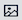

# Elementen - tekst

Gebruik de _Tekst_ inhoudstype om een tekstcontainer met een WYSIWYG-editor (&quot;Wat u ziet, is wat u krijgt&quot;) toe te voegen in de [[!DNL Page Builder] stadium](workspace.md#stage). Daarnaast kunt u koppelingen, afbeeldingen, [variabelen](../systems/variables-predefined.md)en widgets naar de tekst vanuit de editor-werkbalk.

{width="700"}

{{$include /help/_includes/page-builder-save-timeout.md}}

## Gereedschappen voor teksteditor

U kunt de teksteditor rechtstreeks vanuit het werkgebied of vanaf een instellingspagina openen. Wijzigingen die rechtstreeks in het werkgebied worden aangebracht, worden automatisch opgeslagen. Zie voor meer informatie [De Editor gebruiken](../content-design/editor.md).

{width="600"}

## Gereedschap Tekstcontainer

{width="600"}

| Gereedschap | Pictogram | Beschrijving |
| --------- | --------------------- | -------------- |
| Verplaatsen | {width="25"} | Verplaatst de tekstcontainer naar een andere geldige plaats op de pagina. |
| (label) | TEXT | Identificeert de huidige container als een tekstelement. |
| Instellingen | {width="25"} | Hiermee opent u de eigenschappen van de tekstcontainer in de bewerkingsmodus. |
| Verbergen | {width="25"} | Verbergt de tekstcontainer. |
| Tonen | {width="25"} | Hiermee wordt de verborgen tekstcontainer weergegeven. |
| Dupliceren | {width="25"} | Maakt een kopie van de tekstcontainer. |
| Verwijderen | {width="25"} | Verwijdert de tekstcontainer en de inhoud ervan uit het werkgebied. |

{style="table-layout:auto"}

{{$include /help/_includes/page-builder-hidden-element-note.md}}

## Tekst toevoegen

1. In de [!DNL Page Builder] deelvenster, uitvouwen **[!UICONTROL Elements]** en sleep een **[!UICONTROL Text]** plaatsaanduiding voor een rij, kolom of tabset in het werkgebied.

   {width="600" zoomable="yes"}

1. Gebruik de editor om zo nodig tekst in te voeren en op te maken.

   Zie voor meer informatie [De Editor gebruiken](../content-design/editor.md).

   {width="600"}

## Een koppeling maken

Met de knop Koppeling invoegen in de editor kunt u gemakkelijk een hyperlink naar een afbeelding in de galerie toevoegen. Het kan echter ook worden gebruikt om een inline-koppeling in tekst te maken, als u de URL vooraf hebt. In tegenstelling tot de knop Widget is de knop Koppeling invoegen/bewerken niet geïntegreerd met pagina&#39;s, producten of categorieën in de winkel.

Als u een koppeling voor een telefoonnummer of e-mailadres wilt maken, raadpleegt u [Aangepaste variabelen toevoegen](../systems/variables-custom.md).

1. Navigeer in de storefront naar de pagina die de doelbestemming voor de koppeling moet zijn en kopieer de koppelingsinformatie.

   U kunt volledig - gekwalificeerde URL of een relatieve URL gebruiken die de verwijzing naar uw archiefdomein weglaat.

   Volledige URL - `https://mystore.com/women/tops-women/tees-women.html`

   Relatieve URL - `../women/tops-women/tees-women.html`

1. Selecteer de tekst in de Editor-ruimte en klik op _Koppeling invoegen/bewerken_ ( {width="20"} ) op de editor-werkbalk.

   {width="500" zoomable="yes"}

1. Voor **[!UICONTROL URL]**, voert u de relatieve koppeling in die u hebt voorbereid.

1. Set **[!UICONTROL Target]** tot `None`.

   Met deze instelling wordt de pagina in hetzelfde browservenster geopend in plaats van een nieuw tabblad te openen.

1. Voor **[!UICONTROL Title]**, enter `Shop Tees`.

   De `Title` Het koppelingskenmerk wordt door sommige browsers gebruikt als knopinfo.

1. De koppeling opslaan en terugkeren naar de [!DNL Page Builder] werkruimte, klikken **[!UICONTROL OK]**.

   {width="500" zoomable="yes"}

## Een afbeelding invoegen

1. Plaats de cursor in de tekst waar u de afbeelding wilt invoegen.

1. Klikken _Afbeelding invoegen/bewerken_ ( {width="20"} ) op de editor-werkbalk.

1. Voor **[!UICONTROL Source]** klikt u op het zoekpictogram om de mediaopslag te gebruiken voor het zoeken naar en selecteren van een afbeelding.

1. Voor **[!UICONTROL Image Description]** Voer een beschrijvende tekst in voor de afbeelding.

   Deze tekst vult de `alt` koppelingskenmerk voor de afbeelding en wordt door sommige browsers gebruikt voor toegankelijkheid.

1. Voer de breedte en hoogte in **[!UICONTROL Dimensions]**, in pixels, voor het weergeven van de afbeelding op de pagina.

   Houd de **[!UICONTROL Constrain proportions]** Schakel dit selectievakje in om de hoogte-breedteverhouding voor de afbeelding automatisch te behouden.

1. Als u de afbeelding wilt invoegen, gaat u terug naar de knop [!DNL Page Builder] werkruimte, klikken **[!UICONTROL OK]**.

## Tekstinstellingen wijzigen

1. Houd de muisaanwijzer boven de tekstcontainer om de gereedschapset weer te geven en kies de optie _Instellingen_ ( {width="20"} ).

   >[!NOTE]
   >
   >Omdat de tekstcontainer stevig in een andere container wordt genest, zorg ervoor dat u correcte toolbox hebt.

1. Werk de inhoud naar wens bij.

1. Werk de _[!UICONTROL Advanced]_instellingen.

   - Als u de positie van de tekst in de bovenliggende container wilt bepalen, kiest u een **[!UICONTROL Alignment]**:

     | Optie | Beschrijving |
     | ------ |------------ |
     | `Default` | Hiermee past u de standaardinstelling voor uitlijning toe die is opgegeven in het stijlblad van het huidige thema. |
     | `Left` | Hiermee lijnt u de lijst uit langs de linkerrand van de bovenliggende container, waarbij rekening wordt gehouden met de opgegeven opvulling. |
     | `Center` | Hiermee lijnt u de lijst in het midden van de bovenliggende container uit, rekening houdend met de opgegeven opvulling. |
     | `Right` | Hiermee lijnt u het blok uit langs de rechterrand van de bovenliggende container, waarbij rekening wordt gehouden met de opgegeven opvulling. |

     {style="table-layout:auto"}

   - Stel de **[!UICONTROL Border]** stijl die wordt toegepast op alle vier zijden van de tekstcontainer:

     | Optie | Beschrijving |
     | ------ |------------ |
     | `Default` | Past de standaardrandstijl toe die door het bijbehorende stijlblad wordt gespecificeerd. |
     | `None` | Geeft geen zichtbare indicatie van de containerranden. |
     | `Dotted` | De containerrand wordt weergegeven als een stippellijn. |
     | `Dashed` | De containerrand wordt weergegeven als een onderbroken lijn. |
     | `Solid` | De containerrand wordt weergegeven als een effen lijn. |
     | `Double` | De containerrand wordt weergegeven als een dubbele lijn. |
     | `Groove` | De containerrand wordt weergegeven als een gegroefde lijn. |
     | `Ridge` | De containerrand wordt weergegeven als een afgeronde lijn. |
     | `Inset` | De containerrand wordt weergegeven als een inzetlijn. |
     | `Outset` | De containerrand wordt weergegeven als een omtreklijn. |

     {style="table-layout:auto"}

   - Als u een andere randstijl dan `None`, vult u de weergaveopties voor de rand in:

     | Optie | Beschrijving |
     | ------ |------------ |
     | [!UICONTROL Border Color] | Geef de kleur op door een staal te kiezen, op de kleurkiezer te klikken of door een geldige kleurnaam of een gelijkwaardige hexadecimale waarde in te voeren. |
     | [!UICONTROL Border Width] | Voer het aantal pixels in voor de lijnbreedte van de rand. |
     | [!UICONTROL Border Radius] | Voer het aantal pixels in om de grootte te bepalen van de straal die wordt gebruikt om elke hoek van de rand te afronden. |

     {style="table-layout:auto"}

   - (Optioneel) Geef de namen op van **[!UICONTROL CSS classes]** in het huidige stijlblad toe te passen op de container.

     Scheid meerdere klassennamen met een spatie.

   - Voer in pixels waarden in voor de **[!UICONTROL Margins and Padding]** om de buitenste marges en de binnenopvulling van de tekstcontainer te bepalen.

     Voer de overeenkomende waarden in het diagram in.

     | Containergebied | Beschrijving |
     | -------------- |------------ |
     | [!UICONTROL Margins] | De hoeveelheid lege ruimte die wordt toegepast op de buitenrand van alle zijden van de container. Opties: `Top` / `Right` / `Bottom` / `Left` |
     | [!UICONTROL Padding] | De hoeveelheid lege ruimte die wordt toegepast op de binnenrand van alle zijden van de container. Opties: `Top` / `Right` / `Bottom` / `Left` |

     {style="table-layout:auto"}

1. Klik op **[!UICONTROL Save]** om de instellingen toe te passen en terug te keren naar de [!DNL Page Builder] werkruimte.
