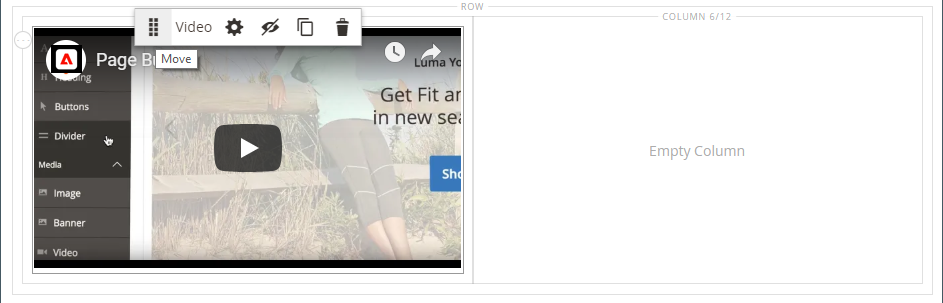
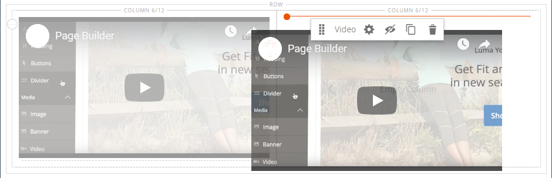

# Media - Video

Gebruik de _Video_ inhoudstype om een video toe te voegen waarop wordt gehost [YouTube][1] of [Vimeo][2] aan de [[!DNL Page Builder] stadium](workspace.md#stage). U kunt video eenvoudig insluiten in een pagina of blok of in product- en categorieredetecties.

{width="700" zoomable="yes"}

{{$include /help/_includes/page-builder-save-timeout.md}}

## Video, werkset

{width="600" zoomable="yes"}

| Gereedschap | Pictogram | Beschrijving |
|--- |--- |--- |
| Verplaatsen | {width="25"} | Hiermee verplaatst u de video naar een andere positie in het werkgebied. |
| (label) | [!UICONTROL Video] | Identificeert de huidige inhoudscontainer als video. Houd de muisaanwijzer boven de container van de afbeelding om de gereedschapset weer te geven. |
| Instellingen | {width="25"} | Hiermee opent u de _[!UICONTROL Edit Video]_pagina, waar u de eigenschappen van de video en container kunt wijzigen. |
| Verbergen | {width="25"} | Hiermee verbergt u de huidige video. |
| Tonen | {width="25"} | De verborgen video wordt weergegeven. |
| Dupliceren | {width="25"} | Maakt een kopie van de video. |
| Verwijderen | {width="25"} | Hiermee verwijdert u de video uit het werkgebied. |

{style="table-layout:auto"}

{{$include /help/_includes/page-builder-hidden-element-note.md}}

## Een video toevoegen

1. Navigeer voordat u begint naar het dialoogvenster [YouTube][1] of [Vimeo][2] video die u wilt insluiten, en de verbinding kopiëren.

   U kunt ook een directe koppeling naar een geldig videobestand kopiëren. Zie [Standaardvideo-instellingen](#basic-video-settings) voor geldige koppelingen.

1. In de [!DNL Commerce] Beheerder, terugkeren naar de [!DNL Page Builder] waar u de video wilt toevoegen.

1. In de [!DNL Page Builder] deelvenster, uitvouwen **[!UICONTROL Media]** en sleep een **[!UICONTROL Video]** tijdelijke aanduiding naar het werkgebied.

   {width="600" zoomable="yes"}

1. Houd de muisaanwijzer boven de videopcontainer om de gereedschapset weer te geven en kies de optie _Instellingen_ ( {width="20"} ).

1. Voor **[!UICONTROL Video URL]** plakken, plakt u de URL van de video die u hebt gekopieerd.

   De URL van de [!DNL Page Builder] De video die in dit voorbeeld wordt gebruikt is: `https://www.youtube.com/watch?v=Y0KNS7C5dZA`.

1. Als u de **[!UICONTROL Maximum Width]** Voer de maximale breedte in pixels in.

   Als de video leeg is, is deze zo breed als is toegestaan door de container, wat marges en opvulling toestaat.

1. Klik in de rechterbovenhoek op **[!UICONTROL Save]** om de instellingen toe te passen en terug te keren naar de [!DNL Page Builder] werkruimte.

## Video-instellingen wijzigen

1. Houd de muisaanwijzer boven de videopcontainer om de gereedschapset weer te geven en kies de optie _Instellingen_ ( {width="20"} ).

1. Wijzig de instellingen volgens de volgende secties:

   - [Basis](#basic-video-settings)
   - [Geavanceerd](#advanced)

1. Klik in de rechterbovenhoek op **[!UICONTROL Save]** om de instellingen toe te passen en terug te keren naar de [!DNL Page Builder] werkruimte.

### Standaardvideo-instellingen

1. Als u de huidige video wilt wijzigen, werkt u de **[!UICONTROL Video URL]**.

   Voer een geldige video-URL in. Geldige video-URL&#39;s kunnen koppelingen zijn naar:

   - YouTube-video&#39;s: `https://youtu.be/CoDhMRUUjeI`
   - Vimeo-video&#39;s: `https://vimeo.com/190156113`
   - Geldige videobestanden (`.mp4` wordt aanbevolen): `https://myvideos.com/spiral.mp4`

1. Als u de toegestane breedte voor de video in de winkelvoorgrond wilt wijzigen, voert u de nieuwe **[!UICONTROL Maximum Width]** in pixels.

   Als de video leeg is, wordt de volledige breedte van de container uitgebreid, minus marges en opvulling.

1. Als u de video automatisch wilt starten nadat de pagina is geladen, stelt u **[!UICONTROL Autoplay]** tot `Yes`.

   Als Automatisch afspelen is ingesteld op `Yes`, wordt de video gedempt bij het afspelen volgens het beleid. Zelfs met deze instelling kunnen mobiele apparaten uw video&#39;s echter niet automatisch afspelen. Raadpleeg de volgende bronnen voor ontwikkelaars voor meer informatie over dit beleid:

   - [Beleid automatisch afspelen vanuit Vimeo](https://vimeo.zendesk.com/hc/en-us/articles/115004485728-Autoplaying-and-looping-embedded-videos)
   - [Beleid automatisch afspelen vanuit Google (Chrome/YouTube)](https://developer.chrome.com/blog/autoplay/)
   - [Beleid voor automatisch afspelen van lokale video&#39;s](https://developer.mozilla.org/en-US/docs/Web/Media/Autoplay_guide)

   Als Automatisch afspelen is ingesteld op `No`De video wordt alleen op verzoek van de gebruiker afgespeeld.

### [!UICONTROL Advanced]

1. Als u de horizontale plaatsing van de video in de container wilt bepalen, kiest u een **[!UICONTROL Alignment]**:

   | Optie | Beschrijving |
   | ------ | ----------- |
   | `Default` | Hiermee past u de standaardinstelling voor uitlijning toe die is opgegeven in het stijlblad van het huidige thema. |
   | `Left` | Hiermee lijnt u de inhoud uit langs de linkerrand van de videocontainer, waarbij rekening wordt gehouden met de opgegeven opvulling. |
   | `Center` | Hiermee lijnt u de inhoud uit in het midden van de videopcontainer, waarbij rekening wordt gehouden met de opgegeven opvulling. |
   | `Right` | Hiermee lijnt u de inhoud uit langs de rechterrand van de videocontainer, waarbij rekening wordt gehouden met de opgegeven opvulling. |

   {style="table-layout:auto"}

- Stel de **[!UICONTROL Border]** stijl die wordt toegepast op alle vier zijden van de videopcontainer:

  | Optie | Beschrijving |
  | ------ | ----------- |
  | `Default` | Past de standaardrandstijl toe die door het bijbehorende stijlblad wordt gespecificeerd. |
  | `None` | Geeft geen zichtbare indicatie van de containerranden. |
  | `Dotted` | De containerrand wordt weergegeven als een stippellijn. |
  | `Dashed` | De containerrand wordt weergegeven als een onderbroken lijn. |
  | `Solid` | De containerrand wordt weergegeven als een effen lijn. |
  | `Double` | De containerrand wordt weergegeven als een dubbele lijn. |
  | `Groove` | De containerrand wordt weergegeven als een gegroefde lijn. |
  | `Ridge` | De containerrand wordt weergegeven als een afgeronde lijn. |
  | `Inset` | De containerrand wordt weergegeven als een inzetlijn. |
  | `Outset` | De containerrand wordt weergegeven als een omtreklijn. |

  {style="table-layout:auto"}

- Als u een andere randstijl dan `None`, vult u de weergaveopties voor de rand in:

  {width="600" zoomable="yes"}

  | Optie | Beschrijving |
  | ------ |------------ |
  | [!UICONTROL Border Color] | Geef de kleur op door een staal te kiezen, op de kleurkiezer te klikken of door een geldige kleurnaam of een gelijkwaardige hexadecimale waarde in te voeren. |
  | [!UICONTROL Border Width] | Voer het aantal pixels in voor de lijnbreedte van de rand. |
  | [!UICONTROL Border Radius] | Voer het aantal pixels in om de grootte te bepalen van de straal die wordt gebruikt om elke hoek van de rand te afronden. |

  {style="table-layout:auto"}

- (Optioneel) Geef de namen op van **[!UICONTROL CSS classes]** in het huidige stijlblad toe te passen op de videopcontainer.

  Scheid meerdere klassennamen met een spatie.

- Voer in pixels waarden in voor de **[!UICONTROL Margins and Padding]** om de buitenste marges en de binnenopvulling van de videopcontainer op te geven.

  Voer elke corresponderende waarde in het diagram van de videopcontainer in.

  | Containergebied | Beschrijving |
  | -------------- | ----------- |
  | [!UICONTROL Margins] | De hoeveelheid lege ruimte die wordt toegepast op de buitenrand van alle zijden van de container. |
  | [!UICONTROL Padding] | De hoeveelheid lege ruimte die wordt toegepast op de binnenrand van alle zijden van de container. |

  {style="table-layout:auto"}

## Een video verplaatsen

1. Houd de muisaanwijzer boven de videopcontainer om de gereedschapset weer te geven en kies de optie _Verplaatsen_ ( {width="20"} ).

   {width="500" zoomable="yes"}

1. Selecteer en sleep de video naar de nieuwe positie, net onder de rode hulplijn.

   {width="500" zoomable="yes"}

## Een video uit het werkgebied verwijderen

1. Houd de muisaanwijzer boven de videopcontainer om de gereedschapset weer te geven en kies de optie _Verwijderen_ ().

1. Klik wanneer u wordt gevraagd om te bevestigen **[!UICONTROL OK]**.

[1]: https://www.youtube.com/
[2]: https://vimeo.com/
