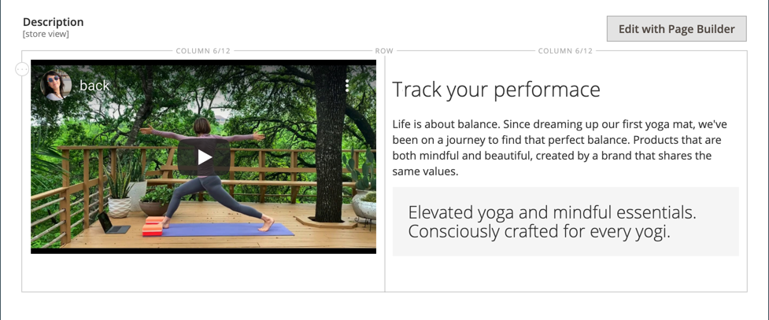

# [!DNL Page Builder] Workspace

Wanneer [[!DNL Page Builder]  &#x200B;](setup.md) wordt toegelaten, worden de _[!UICONTROL Content]_&#x200B;sectie en het proces van de inhoudsverwezenlijking gewijzigd om uit de geavanceerde [!DNL Page Builder] hulpmiddelen voor CMS [&#x200B; pagina&#39;s &#x200B;](../content-design/page-add.md), [&#x200B; product &#x200B;](../catalog/product-content.md) en [&#x200B; categorie &#x200B;](../catalog/categories-content-settings.md) pagina&#39;s, [&#x200B; blokken &#x200B;](../content-design/block-add.md), en [&#x200B; dynamische blokken &#x200B;](../content-design/dynamic-blocks.md) voordeel te halen. Deze sectie omvat het gebied van de Kop van de a_ Inhoud _, een voorproef van de inhoud, en gemakkelijke toegang tot het volledig-schermwerkruimte [!DNL Page Builder].

![&#x200B; sectie van de Inhoud met [!DNL Page Builder] voorproef &#x200B;](./assets/pb-content-preview.png){width="700" zoomable="yes"}

## Inhoudskop

Omdat zoekprogramma&#39;s op niveau 1 (H1) koppen zoeken, is het toevoegen van een kop op niveau 1 een eenvoudige manier om ervoor te zorgen dat de pagina correct wordt geïndexeerd.

>[!NOTE]
>
>Het veld _[!UICONTROL Content Heading]_&#x200B;dat boven aan de pagina wordt weergegeven, is een verouderd veld dat inhoud ondersteunt die is gemaakt met eerdere [!DNL Commerce] -releases. Het maakt echter geen deel uit van [!DNL Page Builder] . De [!UICONTROL Content Heading] wordt opgemaakt als een H1-kop op basis van het stijlblad dat aan het huidige thema is gekoppeld. Deze bevindt zich vlak boven het actieve inhoudsgebied dat wordt gedefinieerd door het [!DNL Page Builder] -werkgebied.

Voor de beste controle over het plaatsen en het formaat van rubrieken van alle niveaus, adviseert men dat u het _[!UICONTROL Content Heading]_&#x200B;gebied leeg verlaat, en het [!DNL Page Builder] [&#x200B; &#x200B;](heading.md) inhoudstype van de Rubriek gebruikt.

{width="700" zoomable="yes"}

## Voorvertoning

Wanneer u de sectie _[!UICONTROL Content]_&#x200B;uitbreidt en er bestaande inhoud met [!DNL Page Builder] is gemaakt, wordt een voorvertoning van de inhoud weergegeven zoals deze op een pagina wordt weergegeven. Klik op **[!UICONTROL Edit with Page Builder]**&#x200B;of in het voorvertoningsgebied voor inhoud om de [!DNL Page Builder] -werkruimte te openen, waar u de benodigde updates kunt uitvoeren.

>[!NOTE]
>
>In de pagina Builder-inhoudseditor wordt geen voorbeeld weergegeven van CMS Page-elementen die niet beschikbaar zijn in de standaardweergave Winkel. U kunt bijvoorbeeld geen voorbeeld bekijken van een CMS-blok dat alleen is toegewezen aan niet-standaard winkelweergaven. In dit geval moet je eerst je CMS-pagina publiceren. Vervolgens kunt u deze pagina rechtstreeks bekijken in de winkelruimte. U kunt de pagina ook weergeven vanuit het raster [!UICONTROL Pages] in Beheer door de CMS-pagina [!UICONTROL View] in de kolom [!UICONTROL Action] te selecteren.

{width="500" zoomable="yes"}

>[!NOTE]
>
>Voor de product- en categorieformulieren is deze voorbeeldweergave van de inhoud standaard ingeschakeld, maar kan deze worden uitgeschakeld. Als de prestaties te lijden hebben aan het laden van de voorproef, kunt u de voorproef in de [&#x200B; configuratie van het Beheer van de Inhoud &#x200B;](../configuration-reference/general/content-management.md#advanced-content-tools) montages onbruikbaar maken.

## Werkgebied

Wanneer u de [!DNL Page Builder] -werkruimte opent vanuit de voorvertoning, is het werkgebied het belangrijkste werkgebied waarin u inhoud kunt maken en opmaken en zelfs snel inhoud kunt bewerken. Het werkgebied is aanvankelijk leeg, zodat u het ontwerpoppervlak hebt waarin u rijen, kolommen en tabbladen vanuit het linkerdeelvenster kunt slepen.

>[!NOTE]
>
>Vanaf de release 2.4.1 is het bewerken van inhoud nu alleen op volledig scherm beschikbaar voor alle gebieden die door [!DNL Page Builder] worden beheerd: CMS-pagina&#39;s, product- en categoriepagina&#39;s, blokken en dynamische blokken. Bij bewerking op volledig scherm krijgt de inhoud de focus en wordt een weergave geboden die beter aansluit bij de gebruikerservaring op de winkel.

{width="600" zoomable="yes"}

{{$include /help/_includes/page-builder-save-timeout.md}}

## Viewports

A _viewport_ is het zichtbare gebied van een Web-pagina die een gebruiker ziet. In de ontwerpmodus Volledig scherm worden de viewportknoppen boven het werkgebied van [!DNL Page Builder] weergegeven om u de inhoud te laten zien zoals de gebruiker die op de site ziet.

{width="500" zoomable="yes"}

[!DNL Page Builder] definieert ook onderbrekingspunten voor viewports. Met onderbrekingspunten worden de minimale en maximale breedte gedefinieerd waarbinnen bepaalde stijlen worden toegepast. De viewports van [!DNL Page Builder] verstrekken de volgende inhoudsuitbreekpunten:

- **breekpunt van de Desktop** - `min-width: 1024px`. Dit onderbrekingspunt past stijlen toe die voor viewport breedten worden bepaald die 1024 pixel en breder meten.
- **Mobiele breekpunten** - `max-width: 768px, min-width: 640px`. Deze onderbrekingspunten passen stijlen toe die zijn gedefinieerd voor viewport-breedten tussen 768 pixels en 640 pixels.

[!DNL Page Builder] viewports verstrekt twee eigenschappen: **_inhoudvoorproeven_** en **_breekpuntmontages_**.

### Voorvertoningen van inhoud

Standaard biedt [!DNL Page Builder] twee voorvertoningen van viewport:

- **Desktop** — Toont de inhoudsvoorproef zonder een vooraf bepaalde breedte. Door het bureaublad gedefinieerde stijlen (met een minimale breedte van 1024 pixels voor het onderbrekingspunt) worden nog steeds toegepast op de pagina. Maar de viewport van de Desktop breedte wordt bepaald door montages voor containerinhoudstypes, zoals Rijen. Als u de Desktop-viewport selecteert, ziet u hoe uw inhoud op de winkel is opgemaakt als de paginabreedte van de browser 1024 pixels en breder is.

  {width="500" zoomable="yes"}

- **Mobiel** — Toont de inhoudsvoorproef bij een vooraf bepaalde breedte van 768 pixel. In tegenstelling tot de Desktop viewport, toont Mobile viewport uw paginainhoud bij een breedte van 768 pixel, samen met de stijlen die voor de breekpuntbreedten van 768 pixel (maximum) en 640 pixel (minimum) worden bepaald.

  {width="500" zoomable="yes"}

### Instellingen voor onderbrekingspunten

Met de viewport-knoppen kunt u ook verschillende onderbrekingspuntstijlen toepassen op inhoudstypen op basis van de geselecteerde viewport. Standaard biedt [!DNL Page Builder] onderbrekingspuntinstellingen voor de velden _[!UICONTROL Minimum Height]_&#x200B;Rijen, Kolommen, Tabs, Tabitems, Banners, Sliders en Dia&#39;s. Wanneer u de Mobiele viewport selecteert, dan open de redacteur voor één van die inhoudstypes, kunt u gebiedswaarden ingaan specifiek voor de Mobiele viewport breekpunten. In velden met inhoudstypen die specifieke instellingen voor onderbrekingspunten toestaan, wordt rechts van het veld een pictogram weergegeven, vergelijkbaar met het volgende voorbeeld voor een rij:

{width="400"} plaatst

## Deelvenster

Het deelvenster [!DNL Page Builder] bevindt zich links van het werkgebied en bevat inhoudstypen die naar het werkgebied kunnen worden gesleept. Een container die specifiek is voor het inhoudstype wordt dan weergegeven met een gereedschapset met opties. De inhoudstypen worden als volgt geordend in het deelvenster:

### Layout

De sectie _[!UICONTROL Layout]_&#x200B;van het deelvenster [!DNL Page Builder] wordt gebruikt om rijen, kolommen of tabs toe te voegen aan het werkgebied. Wanneer u een inhoudstype van het paneel aan het stadium sleept, verschijnt een container met toolbox van opties die voor het inhoudstype specifiek zijn.

Standaard is het werkgebied van [!DNL Page Builder] leeg. Terwijl u de inhoudstypen van de lay-out van het deelvenster naar het werkgebied sleept, kunt u ze boven, onder of in andere lay-outcontainers op de pagina plaatsen. Rijen kunnen alleen rechtstreeks aan het werkgebied worden toegevoegd.

![[!DNL Page Builder] met inhoudstypen voor de layout en het werkgebied &#x200B;](./assets/pb-stage-toolbox.png){width="600" zoomable="yes"}

| Inhoudstype Layout | Beschrijving |
| ------------------- |------------ |
| [&#x200B; Rij &#x200B;](row.md) | U kunt een nieuwe rij alleen slepen vanuit het deelvenster naar het werkgebied en boven of onder een andere rij, tab of kolomgroep plaatsen. Met de optie Dupliceren kunt u ook een kopie van een bestaande rij maken. |
| [&#x200B; Kolom &#x200B;](column.md) | U kunt een kolom van het deelvenster naar het werkgebied of naar rijen en tabs slepen. Het maximumaantal kolommen dat kan worden toegevoegd wordt bepaald door het aantal netstreken die in de [&#x200B; configuratie &#x200B;](setup.md) worden gespecificeerd. |
| [&#x200B; Lusjes &#x200B;](tabs.md) | U kunt één tabblad van het deelvenster naar het werkgebied of naar rijen en kolommen slepen. U kunt extra tabbladen toevoegen vanuit de gereedschapset. |

{style="table-layout:auto"}

### Elementen

Gebruik de _[!UICONTROL Elements]_&#x200B;sectie van het [!DNL Page Builder] paneel om tekst, rubrieken, knopen, verdelers, en code van HTML aan om het even welke lay-outcontainer op het [[!DNL Page Builder]  stadium &#x200B;](workspace.md#stage) toe te voegen. Wanneer u een inhoudstype van het paneel aan of een rij of een kolom, of aan een lusjereeks op het stadium sleept, verschijnt een container. Gebruik de gereedschapset voor inhoudstypen voor toegang tot de instellingen die specifiek zijn voor de tekst.

![[!DNL Page Builder] met inhoudstypen voor Element &#x200B;](./assets/pb-elements.png){width="600" zoomable="yes"}

| Type inhoud element | Beschrijving |
| -------------------- | ----------- |
| [&#x200B; Tekst &#x200B;](text.md) | Hiermee voegt u een tekstcontainer en -editor toe aan het werkgebied. |
| [&#x200B; Kop &#x200B;](heading.md) | Voegt een kopcontainer toe aan het werkgebied. |
| [&#x200B; Knopen &#x200B;](buttons.md) | Hiermee voegt u een container voor een afzonderlijke knop of een set knoppen toe aan het werkgebied. |
| [&#x200B; Scheidingsreiziger &#x200B;](divider.md) | Voegt een container voor een scheidingslijn toe aan het werkgebied. |
| [&#x200B; de Code van HTML &#x200B;](html-code.md) | Voegt een container voor HTML-code toe aan het werkgebied. |

{style="table-layout:auto"}

### Media

Gebruik de _[!UICONTROL Media]_&#x200B;sectie van het [!DNL Page Builder] paneel om beelden, video, banners, schuiven, en [!DNL Google Maps] aan om het even welke lay-outcontainer op het [[!DNL Page Builder]  stadium &#x200B;](workspace.md#stage) toe te voegen. Wanneer een type media-inhoud van het deelvenster naar het werkgebied wordt gesleept, wordt een container weergegeven met een gereedschapset met opties die specifiek zijn voor het inhoudstype.

![[!DNL Page Builder] met media-inhoudstypen &#x200B;](./assets/pb-media-content-types.png){width="600" zoomable="yes"}

| Het inhoudstype Media | Beschrijving |
| ------------------- | ------------------------------------------ |
| [&#x200B; Beeld &#x200B;](image.md) | Voegt een afbeeldingscontainer toe aan het werkgebied. |
| [&#x200B; Video &#x200B;](video.md) | Voegt een videopcontainer toe aan het werkgebied. |
| [&#x200B; Banner &#x200B;](banner.md) | Voegt een bannercontainer toe aan het werkgebied. |
| [&#x200B; Schuifregelaar &#x200B;](slider.md) | Voegt een schuifregelaarcontainer toe aan het werkgebied. |
| [&#x200B; Kaart &#x200B;](map.md) | Voegt een [!DNL Google Maps] -container toe aan het werkgebied. |

{style="table-layout:auto"}

### Inhoud toevoegen

Gebruik de _[!UICONTROL Add Content]_&#x200B;sectie van het [!DNL Page Builder] paneel om bestaande inhoud aan het [[!DNL Page Builder]  stadium &#x200B;](workspace.md#stage) toe te voegen. Wanneer u een inhoudstype voor media van het deelvenster naar het werkgebied sleept, wordt een container weergegeven. Gebruik inhoudstype toolbox om tot de_ Montages _toegang te hebben die voor het type specifiek zijn.

![[!DNL Page Builder] met Typen inhoud toevoegen &#x200B;](./assets/pb-add-content.png){width="600" zoomable="yes"}

| Inhoudstype | Beschrijving |
| ---------------------------------------------------------------- | -------------------------------------------- |
| [&#x200B; Blok &#x200B;](block.md) | Voegt een bestaand blok aan het stadium toe. |
| [&#x200B; Dynamisch Blok &#x200B;](dynamic-block.md) | Voegt een bestaand dynamisch blok toe aan het werkgebied. |
| [&#x200B; Producten &#x200B;](products.md) | Hiermee voegt u een lijst met producten toe aan het werkgebied. |
|  [&#x200B; Aanbevelingen van het Product &#x200B;](recommendations.md) | Voegt een aanbevolen eenheid aan het stadium toe. |

{style="table-layout:auto"}

## Gereedschapset

Elke inhoudscontainer in het werkgebied heeft een gereedschapset met opties. De opties variëren per inhoudstype, maar omvatten typisch Beweging, Montages, Verbergen/tonen, Dupliceren, en Verwijderen.

### De gereedschapset weergeven

Houd de muisaanwijzer boven de container om de gereedschapset weer te geven en kies een optie.

{width="600" zoomable="yes"}

### Opties voor gereedschapsset

| Optie | Pictogram | Beschrijving |
| --------- | ---------------------------------------- | ------------ |
| Verplaatsen | {width="25"} | Verplaatst de huidige inhoudscontainer naar een andere positie in het werkgebied. |
| Toevoegen | {width="25"} toe | Hiermee voegt u onderliggende elementen toe, zoals een knop, dia of tab. |
| (label) |           | Identificeert het containerinhoudstype. |
| Instellingen | {width="25"} | Hiermee opent u de eigenschappen van de inhoudscontainer in de bewerkingsmodus. |
| Verbergen | {width="25"} | Verbergt de huidige inhoudscontainer. |
| Tonen | {width="25"} | Hiermee wordt de huidige inhoudscontainer weergegeven. |
| Dupliceren | {width="25"} | Maakt een kopie van de huidige inhoudscontainer. |
| Verwijderen | {width="25"} | Hiermee verwijdert u de huidige inhoudscontainer uit het werkgebied. |

{style="table-layout:auto"}

{{$include /help/_includes/page-builder-hidden-element-note.md}}

<!-- Last updated from includes: 2023-09-11 14:30:19 -->
