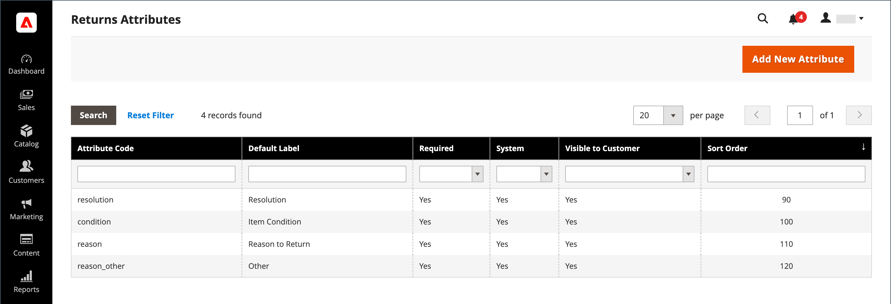
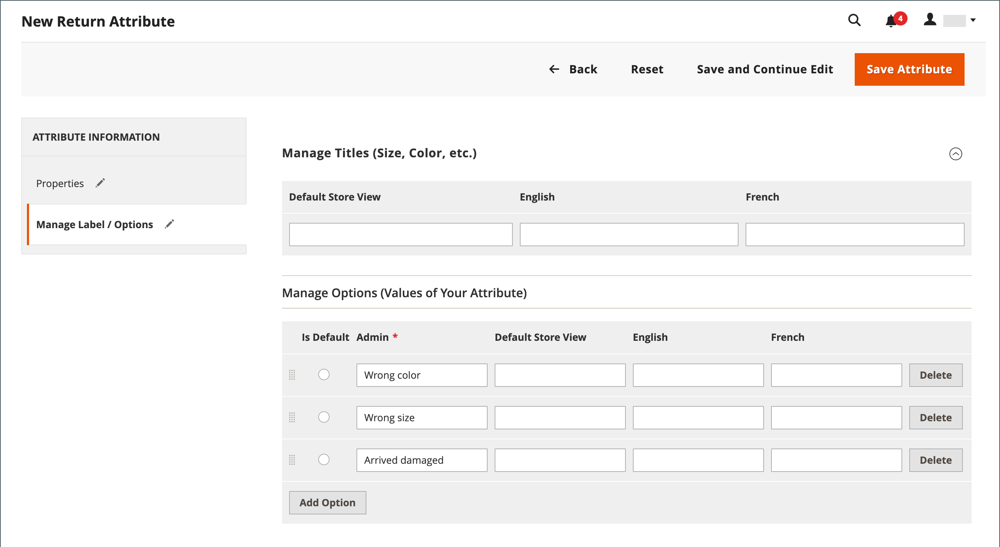

# Retourneert, kenmerk

{{ee-feature}}

De terugkeerattributen worden gebruikt om informatie op te slaan die tijdens het proces van de productterugkeer nodig is. De standaardattributen omvatten de voorwaarde van het teruggekeerde product, de reden voor de terugkeer, en een gebied dat erop wijst hoe de terugkeer werd opgelost. Het proces om een terugkeerattribuut tot stand te brengen is gelijkaardig aan het creëren van a [ klantenattributen ](../customers/attribute-properties.md).

{width="700" zoomable="yes"} terug

## Een kenmerk voor geretourneerde waarden maken

1. Voor _Admin_ sidebar, ga **[!UICONTROL Stores]** > _[!UICONTROL Attributes]_>**[!UICONTROL Returns]**.

1. Klik in de rechterbovenhoek op **[!UICONTROL Add New Attribute]** .

   {width="600" zoomable="yes"}

### Eigenschappen definiëren

1. Als u het kenmerk wilt identificeren tijdens het invoeren van gegevens, stelt u de **[!UICONTROL Default Label]** in.

1. Voer bij **[!UICONTROL Attribute Code]** een code in die het kenmerk in het systeem identificeert.

1. Stel **[!UICONTROL Input Type]** in op een van de volgende opties om het type invoerbesturingselement te bepalen dat wordt gebruikt voor gegevensinvoer:

   - `Text Field`
   - `Text Area`
   - `Dropdown`
   - `Yes/No`
   - `File`
   - `Image File`

1. Als u van het veld een vereist item wilt maken, stelt u **[!UICONTROL Values Required]** in op `Yes` .

1. Voer een **[!UICONTROL Default Value]** in om een beginwaarde aan het veld toe te wijzen.

1. Als u de juistheid van de gegevens die in het veld zijn ingevoerd wilt controleren voordat de record wordt opgeslagen, stelt u **[!UICONTROL Input Validation]** in op een van de volgende waarden:

   - `None`
   - `Alphanumeric`
   - `Alphanumeric with Space`
   - `Numeric Only`
   - `Alpha Only`
   - `URL`
   - `Email`

1. Voer voor de invoertypen `Text Field` en `Text Area` de waarden **[!UICONTROL Minimum Text Length]** en **[!UICONTROL Maximum Text Length]** in.

1. Als u een voorverwerkingsfilter wilt toepassen, stelt u **[!UICONTROL Input/Output Filter]** in op een van de volgende opties:

   - `None`
   - `Strip HTML Tags`
   - `Escape  HTML Entities`

1. Als u het kenmerk zichtbaar wilt maken voor klanten, stelt u **[!UICONTROL Show on Storefront]** in op `Yes` in de sectie _[!UICONTROL Storefront Properties]_.

1. (Optioneel) Voer bij **[!UICONTROL Sort Order]** een getal in om te bepalen waar dit kenmerk wordt weergegeven ten opzichte van de andere kenmerken in hetzelfde gedeelte van de pagina. (`0` = first, `1` = second, `2` = third, enzovoort.)

### De labels/opties beheren

1. Kies **[!UICONTROL Manage Labels/Options]** in het linkerdeelvenster.

1. Voer in de sectie **[!UICONTROL Manage Titles (Size, Color, etc.)]** het label voor elke winkelweergave in.

   {width="600" zoomable="yes"}

1. Als **[!UICONTROL Input Type]** voor het kenmerk `Dropdown` is, beheert u de opties in de sectie **[!UICONTROL Manage Options (Values of Your Attribute)]** .

   - Als u een optie wilt toevoegen, klikt u op **[!UICONTROL Add Option]** en voert u het label voor Admin en elke winkelweergave in.
   - Kies **[!UICONTROL Is Default]** als u van een optie de geselecteerde standaardinstelling wilt maken.
   - Klik op **[!UICONTROL Delete]** om een optie te verwijderen.

1. Klik op **[!UICONTROL Save Attribute]** om de wijzigingen op te slaan.
