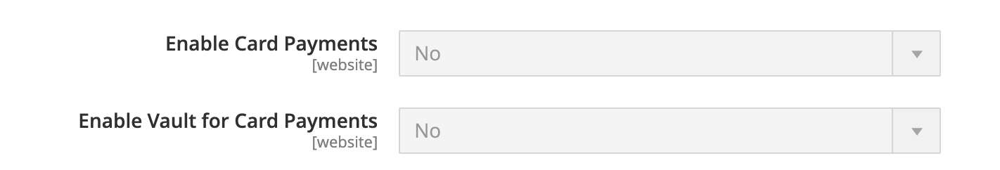

# Braintree

Braintree biedt een volledig aanpasbare uitcheckervaring met fraudedetectie en PayPal-integratie. Het ondersteunt [!DNL Apple Pay], [!DNL Google Pay], ACH, Venmo en lokale betalingsmethoden. Braintree vermindert de PCI nalevingslast voor handelaren omdat de transactie op het systeem van de Braintree plaatsvindt. De integratie van Braintree Payments wordt ontwikkeld door [GENE Commerce](https://www.gene.co.uk/gene-braintree-payments/).

>[!NOTE]
>
>Als u een upgrade uitvoert naar 2.4.x vanuit een eerdere versie van Adobe Commerce of Magento Open Source met de Braintree-extensie van de geïnstalleerde Commerce Marketplace, raadpleegt u de [2.4 opmerkingen bij upgrades](#24-upgrade-notes) aan het einde van deze pagina.

## Stap 1: Krijg uw geloofsbrieven van de Braintree

Ga naar [Braintreeën][1] en meld u aan voor een account.

## Stap 2: De basisinstellingen voltooien

1. Op de _Beheerder_ zijbalk, ga naar **[!UICONTROL Stores]** > _[!UICONTROL Settings]_>**[!UICONTROL Configuration]**.

1. Vouw in het linkerdeelvenster uit **[!UICONTROL Sales]** en kiest u **[!UICONTROL Payment Methods]**.

   - Als uw installatie van de Handel veelvoudige websites, opslag of meningen, in de hogere linkerhoek heeft, kies **[!UICONTROL Store View]** waar de configuratie van toepassing is.

   - In de _[!UICONTROL Merchant Location]_sectie, verifieer dat **[!UICONTROL Merchant Country]**wordt ingesteld op de locatie van uw bedrijf.

1. Onder _[!UICONTROL Recommended Solutions]_in de_[!UICONTROL Braintree Payments] (door [GENE Commerce](https://www.gene.co.uk/gene-braintree-payments/) v4.6.1 - [Opmerkingen bij de release](https://support.gene.co.uk/support/solutions/articles/35000228529)_sectie, klikken **[!UICONTROL Configure]**.

   {width="600" zoomable="yes"}

1. Voor **[!UICONTROL Title]**, voert u een titel in die Braintree tijdens het afrekenen als betalingsoptie aanduidt.

1. Huidige werking instellen **[!UICONTROL Environment]** voor Braintree `Sandbox` of `Production`

   Gebruik bij het testen van de configuratie in een sandbox alleen [creditcardnummers][2] die door de Braintree worden aanbevolen. Wanneer u klaar bent om met Braintree naar de productie te gaan, stelt u **[!UICONTROL Environment]** tot `Production`.

   {width="600" zoomable="yes"}

1. Set **[!UICONTROL Payment Action]** op een van de volgende wijzen:

   - `Authorize Only` - Goedkeuring van de aankoop en blokkering van de middelen. Het bedrag wordt pas van de bankrekening van de klant gehaald als de verkoop _vastgelegd_ door de handelaar.|
   - `Intent Sale`  - Het bedrag van de aankoop wordt toegestaan en onmiddellijk van de rekening van de klant teruggetrokken. **_Opmerking:_** Deze waarde is  _Autoriseren en vastleggen_ in 2.3.x en eerdere versies.|

1. Voer de **[!UICONTROL Sandbox Merchant ID / Merchant ID]** van uw Braintree account.

1. Voer de volgende gegevens in vanaf uw Braintree-account:

   - **[!UICONTROL Sandbox Public Key / Public Key]**
   - **[!UICONTROL Sandbox Private Key / Private Key]**

   >[!NOTE]
   >
   >Er zijn verschillende velden voor beide **(Sandbox en Production)** omgevingen en de andere velden worden gerenderd op basis van de geselecteerde omgeving.

1. Klik voordat u de configuratie opslaat op **[!UICONTROL Validate Credentials]** om uw referenties te valideren.

1. Set **[!UICONTROL Enable Card Payments]** tot `Yes`.

   {width="600" zoomable="yes"}

   Als u de capaciteit wilt om klanteninformatie veilig op te slaan, zodat moeten de klanten niet het telkens opnieuw ingaan als zij een aankoop maken, plaatsen **[!UICONTROL Enable Vault for Card Payments]** tot `Yes`.

## Stap 3: De geavanceerde instellingen voltooien

1. Uitbreiden  de **[!UICONTROL Advanced Braintree Settings]** sectie.

   {width="550" zoomable="yes"}

1. Voor **[!UICONTROL Vault Title]**, voert u een beschrijvende titel voor uw referentie in die de vault identificeert waar de gegevens van uw klantenkaart zijn opgeslagen.

1. Voer de **[!UICONTROL Merchant Account ID]** van uw Braintree account.

   Als u niet de te gebruiken handelsrekening specificeert, verwerkt de Braintree de transactie gebruikend uw standaard handelaarrekening.

1. Als je een snellere afhandeling wilt bieden met Express Payment Options aan het begin van het afhandelingsproces, zoals PayPal, PayPal, Apple Pay en Google Pay, moet je **[!UICONTROL Enable Checkout Express Payments]** tot `Yes`.

1. Als u wilt voorkomen dat de transactie ter evaluatie wordt verzonden als onderdeel van de geavanceerde controles van de Fraudegereedschappen, voor orders die via de beheerfunctie worden geplaatst, stelt u **[!UICONTROL Skip Fraud Checks on Admin Orders]** tot `Yes`.

1. Stel de **[!UICONTROL Bypass Fraud Protection Threshold]** zodat de `Advanced Fraud Protection` controles worden overgeslagen wanneer de drempel wordt bereikt of overschreden.

   Als u dit veld leeg laat, wordt deze optie uitgeschakeld.

1. Als u wilt dat het systeem een logbestand met interacties tussen de winkel en de Braintree opslaat, stelt u **[!UICONTROL Debug]** tot `Yes`.

1. Om klanten te verplichten de driecijferige veiligheidscode van de rug van een creditcard te verstrekken, reeks **[!UICONTROL CVV Verification]** tot `Yes`.

   Bij gebruik van CVV-verificatie moet AVS en/of CVV in de _Instellingen/verwerking_ van uw Braintree account.

1. Als u de winkelwagentjes voor alle betalingsmethoden wilt verzenden, stelt u **[!UICONTROL Send Card Line Items]** tot `Yes`.

1. Voor **[!UICONTROL Credit Card Types]**, selecteer elke creditcard die door je winkel wordt geaccepteerd als betaling via Braintree.

   Als u meerdere kaarttypen wilt selecteren, houdt u Ctrl (PC) of Command (Mac) ingedrukt en klikt u op elke optie.

1. Voor **[!UICONTROL Sort Order]**, voert u een getal in om de volgorde te bepalen waarin Braintree wordt weergegeven wanneer deze bij andere betalingsmethoden wordt aangeboden tijdens het afrekenen.

## Stap 4: Voltooi de Braintree webhaakinstellingen

{width="600" zoomable="yes"}

1. Set **[!UICONTROL Enable Webhook]** tot `Yes` de webhaakfunctionaliteit voor fraudebescherming, ACH-betalingen en lokale betalingsmethoden mogelijk te maken.

1. Kopieer de URL in het dialoogvenster **[!UICONTROL Fraud Protection URL]** en voeg het toe aan uw Braintree account als de _[!UICONTROL Webhook Destination URL]_.

   >[!IMPORTANT]
   >
   >Deze URL moet veilig en openbaar toegankelijk zijn.

1. Stel de **[!UICONTROL Fraud Protection Approve Order Status]** vast te stellen wanneer de fraudebescherming door de Braintree wordt goedgekeurd.

   De geselecteerde orderstatus wordt toegewezen aan de handelsorder.

1. Stel de **[!UICONTROL Fraud Protection Reject Order Status]** vast te stellen wanneer fraudebescherming door de Braintree wordt verworpen.

   De geselecteerde orderstatus wordt toegewezen aan de handelsorder.

## Stap 5: Vul de landspecifieke instellingen in

1. Set **[!UICONTROL Payment from Applicable Countries]** op een van de volgende wijzen:

   - `All Allowed Countries` - Klanten van iedereen [landen](../getting-started/store-details.md#country-options) Deze betalingsmethode kan worden gebruikt.
   - `Specific Countries` - Nadat u deze optie hebt gekozen, _[!UICONTROL Payment from Specific Countries]_wordt weergegeven. Houd Ctrl (PC) of Command (Mac) ingedrukt en selecteer elk land in de lijst waar klanten aankopen kunnen doen in uw winkel.

   {width="600" zoomable="yes"}

1. Aan opstelling **[!UICONTROL Country Specific Credit Card Types]**:

   - Klik op **[!UICONTROL Add]**.

   - Stel de **[!UICONTROL Country]** en kiest u elk **[!UICONTROL Allowed Credit Card Type]**.

   - Herhaal dit om de creditcards te identificeren die vanuit elk land worden geaccepteerd.

## Stap 6: Voltooi ACH door de montages van de Braintree

{width="600" zoomable="yes"}

1. Als u ACH wilt opnemen als een betalingsoptie met Braintree, stelt u **[!UICONTROL Enable ACH Direct Debit]** tot `Yes`.

1. Klanten kunnen hun betalingsmethode voor automatische incasso voor eenmalig gebruik berekenen en deze opslaan voor toekomstig gebruik. Klanten kunnen na de vault ACH automatische incasso opnieuw gebruiken zonder dat ze hun betalingsgegevens opnieuw hoeven in te voeren of te verifiëren, indien deze zijn ingesteld **[!UICONTROL Enable Vault for ACH Direct Debit]** tot `Yes`.

1. Voor **[!UICONTROL Sort Order]**, voert u een getal in om de volgorde te bepalen waarin de Braintree ACH-betalingsoptie wordt weergegeven wanneer deze bij andere betalingsopties wordt aangeboden tijdens het afrekenen.

## Stap 7: Voltooi de [!UICONTROL Apple Pay] via Braintree-instellingen

{width="600" zoomable="yes"}

1. Opnemen [!DNL Apple Pay] als een betalingsoptie met Braintree ingesteld **[!UICONTROL Enable ApplePay through Braintree]** tot `Yes`.

   Zorg ervoor dat [uw domeinnaam verifiëren](https://developer.paypal.com/braintree/docs/guides/apple-pay/configuration/javascript/v3) eerst in uw Braintree account.

1. Als u de mogelijkheid wilt hebben om klantgegevens veilig op te slaan, zodat klanten deze niet telkens opnieuw hoeven in te voeren wanneer ze een aankoop doen via Apple Pay, stelt u **[!UICONTROL Enable Vault for ApplePay]** tot `Yes`.

1. Set **[!UICONTROL Payment Action]** op een van de volgende wijzen:

   - `Authorize Only` - Goedkeuring van de aankoop en blokkering van de middelen. Het bedrag wordt pas van de bankrekening van de klant gehaald als de verkoop _vastgelegd_ door de handelaar.
   - `Intent Sale` - Het bedrag van de aankoop wordt toegestaan en onmiddellijk van de rekening van de klant teruggetrokken.

1. Voor **[!UICONTROL Merchant Name]**, voert u tekst in die het label opgeeft dat aan klanten wordt weergegeven in het dialoogvenster Apple Pay.

1. Voor **[!UICONTROL Sort Order]** voert u een getal in om de volgorde te bepalen waarin [!DNL Apple Pay] Er wordt een betalingsoptie weergegeven wanneer deze bij andere betalingsopties wordt aangeboden tijdens het afrekenen.

## Stap 8: de instellingen voor lokale betalingsmethoden invullen

1. Als u lokale betalingsmethoden wilt opnemen als betalingsoptie met Braintree, stelt u **[!UICONTROL Enable Local Payment Methods]** tot `Yes`.

1. Voor **[!UICONTROL Title]**, voert u de tekst in die u wilt gebruiken voor het label dat wordt weergegeven in het gedeelte Betalingsmethode voor uitchecken (standaardwaarde): `Local Payments`).

1. Voor **[!UICONTROL Fallback Button Text]**, voert u de tekst in die u wilt gebruiken voor de knop die op de pagina voor de Braintree van de fallback wordt weergegeven, zodat de klant terug naar de website kan gaan (bijvoorbeeld `Complete Checkout`).

1. Voor **[!UICONTROL Redirect on Fail]**, voert u de URL in waar klanten moeten worden omgeleid wanneer transacties met lokale betalingsmethoden worden geannuleerd, mislukt of fouten optreden. Dit moet de betalingspagina voor afrekening zijn (bijvoorbeeld `https://www.domain.com/checkout#payment`).

1. Voor **[!UICONTROL Allowed Payment Methods]**, selecteert u de lokale betalingsmethode die moet worden ingeschakeld.

   Opties: `Bancontact` / `EPS` / `giropay` / `iDeal` / `Klarna Pay Now` / `SOFORT` / `MyBank` / `P24` / `SEPA/ELV Direct Debit` (nog niet ondersteund)

   {width="600" zoomable="yes"}

   >[!NOTE]
   >
   >De extensie van de gebundelde Braintree ondersteunt niet alle lokale betalingsmethoden die in de [Braintree ontwikkelaarsdocumentatie](https://developer.paypal.com/braintree/docs/guides/local-payment-methods/overview). Andere lokale betalingsmethoden worden momenteel ontwikkeld en zullen in toekomstige versies worden ondersteund.

1. Voor **[!UICONTROL Sort Order]** Voer een getal in om de volgorde te bepalen waarin de lokale betalingsmethode wordt weergegeven wanneer deze bij andere betalingsopties wordt aangeboden tijdens het afrekenen.

## Stap 9: Voltooi de [!DNL Google Pay] via Braintree-instellingen

{width="600" zoomable="yes"}

1. Opnemen [!DNL Google Pay] als een betalingsoptie met Braintree ingesteld **[!UICONTROL Enable GooglePay Through Braintree]** tot `Yes`.

1. Als u de mogelijkheid wilt hebben om klantgegevens veilig op te slaan, zodat klanten deze niet telkens opnieuw hoeven in te voeren wanneer ze een aankoop doen via Google Pay, stelt u **[!UICONTROL Enable Vault for GooglePay]** tot `Yes`.

1. Set **[!UICONTROL Payment Action]** op een van de volgende wijzen:

   - `Authorize Only` - Goedkeuring van de aankoop en blokkering van de middelen. Het bedrag wordt pas van de bankrekening van de klant gehaald als de verkoop _vastgelegd_ door de handelaar.
   - `Intent Sale`  - Het bedrag van de aankoop wordt toegestaan en onmiddellijk van de rekening van de klant teruggetrokken.

1. Set **[!UICONTROL Button Color]** om de kleur van [!DNL Google Pay] knop: `White` of `Black`

1. Voor **[!UICONTROL Merchant ID]**, voer je MerchantID in (opgegeven door Google).

1. Voor **[!UICONTROL Accepted Cards]** selecteert u het type kaart dat een klant kan gebruiken om een bestelling te plaatsen met [!DNL Google Pay].

   Opties: `Visa` / `MasterCard` / `AMEX` / `Discover` / `JCB`

1. Voor **[!UICONTROL Sort Order]** voert u een getal in om de volgorde te bepalen waarin [!DNL Google Pay] wordt weergegeven wanneer deze bij andere betalingsopties wordt aangeboden tijdens het afrekenen.

## Stap 10: Vul de Venmo-instellingen in via de Braintree

1. Als u Venmo wilt opnemen als betalingsoptie met Braintree, stelt u **[!UICONTROL Enable Venmo through Braintree]** tot `Yes`.

1. Set **[!UICONTROL Enable Vault for Venmo]** tot `Yes` om het gebruik van een beveiligde kluis mogelijk te maken voor het opslaan van de Venmo-account van klanten, zodat de klant zich niet opnieuw hoeft aan te melden bij zijn Venmo-account voor toekomstige transacties.

   {width="600" zoomable="yes"}

1. Set **[!UICONTROL Payment Action]** op een van de volgende wijzen:

   - `Authorize Only` - Goedkeuring van de aankoop en blokkering van de middelen. Het bedrag wordt pas van de bankrekening van de klant gehaald als de verkoop _vastgelegd_ door de handelaar.
   - `Intent Sale`  - Het bedrag van de aankoop wordt toegestaan en onmiddellijk van de rekening van de klant teruggetrokken.

1. Voor **[!UICONTROL Sort Order]**, voert u een getal in om de volgorde te bepalen waarin Venmo wordt weergegeven bij andere betalingsopties tijdens het afrekenen.

## Stap 11: Voltooi de PayPal-Braintree-instellingen

{width="550" zoomable="yes"}

1. Als u PayPal wilt opnemen als betalingsoptie met Braintree, stelt u **[!UICONTROL Enable PayPal through Braintree]** tot `Yes`.

1. Geef je PayPal-rekening op via de betalingsmethode voor Braintreeën:

   >[!NOTE]
   >
   >Willekeurig **[!DNL PayPal Credit]** of **[!DNL PayPal PayLater]** kan worden ingeschakeld. Beide methoden kunnen niet tegelijkertijd worden ingeschakeld.

   - Opnemen [!DNL PayPal Credit] als een betalingsoptie met Braintree ingesteld **[!UICONTROL Enable PayPal Credit through Braintree]** tot `Yes`.

     Wanneer **PayPal inschakelen via Braintree** is ingesteld op `Yes`wordt alleen dit veld weergegeven.

     >[!NOTE]
     >
     >PayPal-krediet is alleen beschikbaar in de Verenigde Staten en het Verenigd Koninkrijk. PayPal-krediet is uitgeschakeld als de geselecteerde waarde voor de _[!UICONTROL Merchant Country]_veld is niet `US` of `UK`.

   - Opnemen [!DNL PayPal PayLater] als een betalingsoptie met Braintree ingesteld **[!UICONTROL Enable PayPal PayLater through Braintree]** tot `Yes`.

     Wanneer **[!UICONTROL Enable PayPal PayLater through Braintree]** is ingesteld op `Yes`wordt alleen dit veld weergegeven.

     Je kunt PayPal-berichten op je site weergeven voor aanbiedingen, zoals _Betalen in 3_, waardoor klanten met drie rentevrije maandelijkse betalingen kunnen betalen. De Braintree-integratie kan berichten op uw site weergeven om deze functie te promoten. Je kunt PayPal-aanbiedingen niet promoten met andere inhoud, marketing of materialen.

1. Voor **[!UICONTROL Title]**, voer een titel in die de Braintree aangeeft die via PayPal is betaald tijdens het afrekenen.

1. Set **[!UICONTROL Vault Enabled]** tot `Yes` om het gebruik van een beveiligde kluis in te schakelen voor het opslaan van het PayPal-account van klanten. U kunt een Vaulted PayPal-account gebruiken voor toekomstige transacties, waardoor het aantal stappen voor klanten afneemt.

1. Set **[!UICONTROL Send Cart Line Items for PayPal]** tot `Yes` om de regelobjecten (bestelling) samen met creditcards naar PayPal te sturen, cadeau voor objecten, Gift Wrapping voor bestelling, Winkelkrediet, Verzending en Belasting als lijnobjecten.

1. Voor **[!UICONTROL Sort Order]**, voert u een getal in om de volgorde te bepalen waarin de Braintree PayPal-betalingsoptie wordt weergegeven wanneer deze bij andere betalingsopties wordt aangeboden tijdens het afrekenen.

1. De handelsnaam anders weergeven dan de naam die in uw [winkelconfiguratie](../getting-started/store-details.md#store-information), voert u de naam in in het dialoogvenster **[!UICONTROL Override Merchant Name]** in het veld dat u wilt weergeven.

1. Set **[!UICONTROL Payment Action]** op een van de volgende wijzen:

   - `Authorize Only` - Goedkeuring van de aankoop en blokkering van de middelen. Het bedrag wordt pas van de bankrekening van de klant gehaald als de verkoop _vastgelegd_ door de handelaar.
   - `Authorize and Capture` - Het bedrag van de aankoop wordt toegestaan en onmiddellijk van de rekening van de klant teruggetrokken.

1. Set **[!UICONTROL Payment from Applicable Countries]** naar een van de volgende opties voor door PayPal verwerkte Braintreeën:

   - `All Allowed Countries` - Klanten van iedereen [landen](../getting-started/store-details.md#country-options) Deze betalingsmethode kan worden gebruikt.
   - `Specific Countries` - Nadat u deze optie hebt gekozen, _[!UICONTROL Payment from Specific Countries]_wordt weergegeven. Houd Ctrl (PC) of Command (Mac) ingedrukt en selecteer elk land in de lijst waar klanten aankopen kunnen doen in uw winkel.

1. Om klanten te vereisen om een het facturerings adres te verstrekken, plaats **[!UICONTROL Require Customer's Billing Address]** tot `Yes`.

   >[!NOTE]
   >
   >Deze functie moet voor uw account zijn ingeschakeld door de technische ondersteuning van PayPal.

1. Als u een logbestand met interacties tussen uw winkel en PayPal wilt opslaan via Braintree, stelt u **[!UICONTROL Debug]** tot `Yes`.

1. Als u de PayPal-knop wilt weergeven op de pagina met de mini-winkelwagentje en de winkelwagentje, stelt u **[!UICONTROL Display on Shopping Cart]** tot `Yes`.

## Stap 12: De stijlinstellingen instellen

1. Voor **[!UICONTROL Location]**, kies waar PayPal-knoppen en -berichten worden weergegeven: `Mini-Cart and Cart Page`, `Checkout Page`, of `Product Page`

   {width="600" zoomable="yes"}

### [!UICONTROL Mini-Cart and Cart Page]

De opties en instellingen in deze sectie variëren afhankelijk van de instelling in het dialoogvenster _[!UICONTROL Location]_veld.

1. Set **[!UICONTROL PayPal Button Type]** tot één van drie soorten knopen: `PayPal Button` / `PayPal Pay Later Button` / `PayPal Credit Button`

**[!UICONTROL PayPal Button]**

De opties en instellingen in deze sectie variëren afhankelijk van het knoptype dat u in het dialoogvenster _[!UICONTROL PayPal Button Type]_veld.

1. Als u de PayPal-knop op de winkel op de geselecteerde locatie wilt weergeven, stelt u **[!UICONTROL Show PayPal Button]** tot `Yes`.

1. Voor **[!UICONTROL Button Label]**, selecteert u het PayPal-knoplabel: `Paypal`, `Checkout`, `Buynow`, of `Pay`

1. Voor **[!UICONTROL Color]**, selecteert u de PayPal-knopkleur: `Blue`, `Black`, `Gold`, of `Silver`

1. Voor **[!UICONTROL Shape]** Selecteer de vorm van de PayPal-knop: `Pill` of `Rectangle`

1. Voor **[!UICONTROL Size (Deprecated)]**, selecteert u de PayPal-knopgrootte: `Medium`, `Large`, of `Responsive`

>[!NOTE]
>
>De **[!DNL Size(Deprecated)]** Het configuratieveld is vervangen en wordt niet gebruikt om de PayPal-knoppen op te maken.

**[!UICONTROL PayLater Messaging]**

1. Weergeven [!DNL PayLater] berichten op de storefront bij de geselecteerde plaats, reeks **[!UICONTROL Show PayLater Messaging]** tot `Yes`.

   Dit bericht bevat de weergave van [!DNL PayLater] berichten voor beschikbare voorstellen ([beperkingen gelden](https://developer.paypal.com/docs/checkout/pay-later/us/)).

1. Voor **[!UICONTROL Message Layout]**, selecteert u de [!DNL PayLater] berichtindeling: `Text` of `Flex`

1. Voor **[!UICONTROL Logo]**, selecteert u het type PayPal-logo: `Inline`, `Primary`, `Alternative`, of `None`

1. Voor **[!UICONTROL Logo Position]**, selecteert u de positie van het PayPal-logo: `Left`, `Right`, of `Top`

1. Voor **[!UICONTROL Text Color]**, selecteert u de [!DNL PayLater] kleur berichttekst: `Black`, `White`, `Monochrome`, of `Grayscale`

Wanneer deze opties zijn ingesteld, kunt u een voorvertoning van de PayPal-knoppen en PayPal-berichten zien. U kunt de instellingen toepassen of de waarden opnieuw instellen met behulp van de volgende besturingselementen:

- Als u de geselecteerde opmaakinstellingen voor knoppen en PayLater-berichten wilt opslaan en deze op de huidige locatie en het huidige knoptype wilt toepassen, klikt u op **[!UICONTROL Apply]**.

- als u de geselecteerde opmaakinstellingen voor knoppen en berichtwaarden voor PayPal wilt opslaan en deze wilt toepassen op alle knoptypen en -locaties, klikt u op **[!UICONTROL Apply to All Buttons]**.

- Als u de opmaakinstellingen wilt terugzetten op de aanbevolen standaardwaarden voor knoppen en PayLater-berichten en deze wilt toepassen op alle knoptypen en -locaties, klikt u op **[!UICONTROL Reset to Recommended Defaults]**.

## Stap 13: De instellingen voor 3D-verificatie voltooien

1. Als u een verificatiestap wilt toevoegen voor klanten die creditcards gebruiken die zijn ingeschreven voor een verificatieprogramma (zoals _Gecontroleerd door VISA_), set **[!UICONTROL 3D Secure Verification]** tot `Yes`.

   Tijdens het proces wordt het transactiebedrag dat ter controle wordt voorgelegd gecontroleerd tegen het bedrag dat voor goedkeuring wordt verzonden.

2. Om het 3D Veilige verzoek voor alle transacties altijd aan te vechten, reeks **[!UICONTROL Always request 3DS]** tot `Yes`.

3. Voor **[!UICONTROL Threshold Amount]** Voer het minimale orderbedrag in dat vereist is om 3D-verificatie te starten.

4. Set **[!UICONTROL Verify for Applicable Countries]** op een van de volgende wijzen:

   - `All Allowed Countries` - Klanten van iedereen [landen](../getting-started/store-details.md#country-options) Deze betalingsmethode kan worden gebruikt.
   - `Specific Countries` - Nadat u deze optie hebt gekozen, _[!UICONTROL Verify for Specific Countries]_wordt weergegeven. Houd Ctrl (PC) of Command (Mac) ingedrukt en selecteer elk land in de lijst waar klanten aankopen kunnen doen in uw winkel.

   {width="600" zoomable="yes"}

## Stap 14: Opstelling de dynamische beschrijvers van de Braintree

De volgende beschrijvingen worden gebruikt om aankopen te identificeren op creditcardoverzichten van klanten. U kunt het aantal terugbetalingen verminderen door duidelijk het bedrijf te identificeren dat met elke aankoop wordt geassocieerd. Als dynamische beschrijvingen niet zijn ingeschakeld voor uw account, neemt u contact op met de ondersteuning van Braintreeën.

{width="600" zoomable="yes"}

1. Voer de dynamische descriptor in voor de **[!UICONTROL Name]**, **[!UICONTROL Phone]**, en **[!UICONTROL URL]** volgens deze richtsnoeren :

   - **[!UICONTROL Name]** - De naamdescriptor bestaat uit twee delen, die worden gescheiden door een asterisk (*). Bijvoorbeeld:

     `company*myproduct`

     Het eerste deel van de descriptor identificeert het bedrijf of de DBA en het tweede deel identificeert het product. De lengte van de `company` en `product` delen van de descriptor kunnen op de volgende manieren worden toegewezen, voor een gecombineerde lengte van maximaal 22 tekens.

     **_Tekens in naamdescriptor_**

     _Optie 1:_ `Company` moet uit drie tekens bestaan; `Product` mag maximaal 18 tekens bevatten

     _Optie 2:_ `Company` moet uit zeven tekens bestaan; `Product` mag maximaal 14 tekens bevatten

     _Optie 3_: `Company` moet uit 12 tekens bestaan, `Product` mag maximaal negen tekens bevatten

   - **[!UICONTROL Phone]** - De telefoondescriptor moet 10 tot 14 tekens lang zijn en mag alleen cijfers, streepjes, haakjes en punten bevatten. Bijvoorbeeld:

     `9999999999`

     `(999) 999-9999`

     `999.999.9999`

   - **[!UICONTROL URL]** - De URL-descriptor vertegenwoordigt uw domeinnaam en kan maximaal 13 tekens lang zijn. Bijvoorbeeld:

     `company.com`

1. Wanneer uw configuratie van de Braintree volledig is, klik **[!UICONTROL Save Config]**.

## 2.4 opmerkingen bij upgrades

Vanaf Adobe Commerce en Magento Open Source 2.4.0 is de extensie Braintree opgenomen in de release. Als u naar Handel 2.4.x van een versie pre 2.4.0 migreert die de uitbreiding van de Braintree van de Marketplace heeft geïnstalleerd, moet u die uitbreiding verwijderen (`paypal/module-braintree` of `gene/module-braintree`) en eventuele codeaanpassingen bijwerken om de `PayPal_Braintree` naamruimte in plaats van `Magento_Braintree`. De montages van de configuratie van de kernBetalingen van de Braintree van de Handel gebundelde uitbreiding en de uitbreiding die op Commerce Marketplace wordt verdeeld blijven bestaan en de betalingen die met die vorige versies worden geplaatst kunnen nog worden gevangen, ongeldig worden verklaard, of worden teruggegeven als normaal.

[1]: https://www.braintreepayments.com/
[2]: https://developers.braintreepayments.com/reference/general/testing/php
