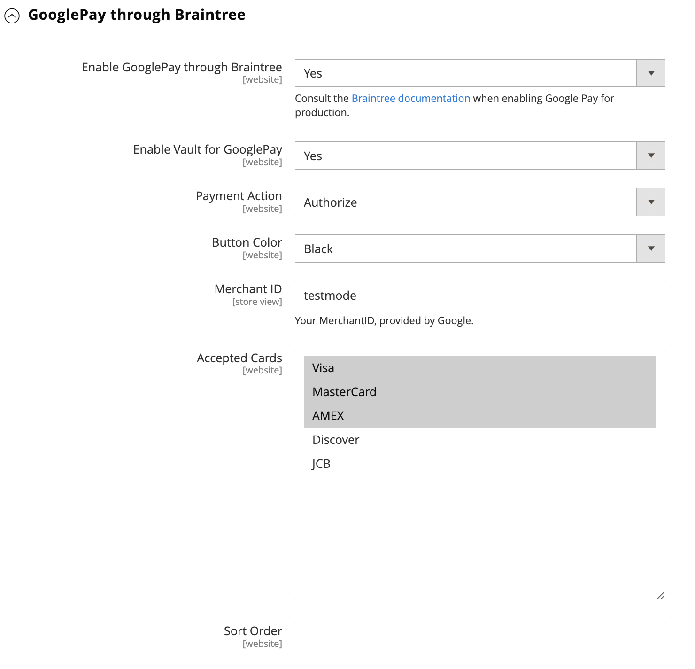

# Braintree

>[!IMPORTANT]
>
>Als u hulp met onverwachte kosten op uw kaart nodig hebt, bezoek [ annuleer abonnement ](https://helpx.adobe.com/nl/manage-account/using/cancel-subscription.html) pagina voor hulp.

Braintree biedt een volledig aanpasbare afrekenervaring met fraudedetectie en PayPal-integratie. Deze biedt ondersteuning voor [!DNL Apple Pay] -, [!DNL Google Pay] -, ACH-, Venmo- en lokale betalingsmethoden. Braintree vermindert de PCI-nalevingslast voor handelaren omdat de transactie plaatsvindt op het Braintree-systeem. De integratie van de Betalingen van Braintree wordt ontwikkeld door [ GENE Commerce ](https://www.gene.co.uk/gene-braintree-payments/).

>[!NOTE]
>
>Als u een upgrade uitvoert naar 2.4.x vanuit een eerdere versie van Adobe Commerce of Magento Open Source waarop de Braintree-extensie van Commerce Marketplace is geïnstalleerd, raadpleegt u de opmerkingen bij[&#128279;](#24-upgrade-notes) de 2.4-upgrade aan het einde van deze pagina.

## Stap 1: Verkrijg uw Braintree-inloggegevens

Ga naar [Braintree Payments][1] en meld je aan voor een account.

## Stap 2: Voltooi de basisinstellingen

1. Voor _Admin_ sidebar, ga **[!UICONTROL Stores]** > _[!UICONTROL Settings]_>**[!UICONTROL Configuration]**.

1. Vouw in het linkerdeelvenster **[!UICONTROL Sales]** uit en kies **[!UICONTROL Payment Methods]** .

   - Als uw Commerce-installatie meerdere websites, winkels of weergaven heeft, kiest u in de linkerbovenhoek de **[!UICONTROL Store View]** waar de configuratie van toepassing is.

   - Controleer in de sectie _[!UICONTROL Merchant Location]_&#x200B;of **[!UICONTROL Merchant Country]**&#x200B;is ingesteld op de locatie van uw bedrijf.

1. Onder _[!UICONTROL Recommended Solutions]_, in_[!UICONTROL Braintree Payments] (door [ GENE Commerce ](https://www.gene.co.uk/gene-braintree-payments/) v4.7.0 - [ de Nota&#39;s van de Versie ](https://support.gene.co.uk/support/solutions/articles/35000278668) _sectie, klik **[!UICONTROL Configure]**.

   

1. Voer bij **[!UICONTROL Title]** een titel in die Braintree tijdens het afrekenen als betalingsoptie aanduidt.

1. Stel het huidige besturingssysteem **[!UICONTROL Environment]** voor Braintree-transacties in op `Sandbox` of `Production`

   Wanneer het testen van de configuratie in een zandbak, gebruik slechts [ creditcardaantallen ][2] die door Braintree worden geadviseerd. Wanneer u gereed bent om te gaan produceren met Braintree, stelt u **[!UICONTROL Environment]** in op `Production` .

   

1. Stel **[!UICONTROL Payment Action]** in op een van de volgende opties:

   - `Authorize Only` - Hiermee gaat u akkoord met de aankoop en houdt u de middelen in de wacht. Het bedrag wordt niet teruggetrokken van de bankrekening van de klant tot de verkoop __ door de handelaar wordt gevangen.|
   - `Intent Sale` - Het bedrag van de aankoop wordt geautoriseerd en onmiddellijk van de rekening van de klant teruggetrokken. **_Nota:_** Deze waarde was _machtigt en vangt_ in 2.3.x en vroegere versies.|

1. Voer de **[!UICONTROL Sandbox Merchant ID / Merchant ID]** in vanaf uw Braintree-account.

1. Voer de volgende gegevens in vanaf uw Braintree-account:

   - **[!UICONTROL Sandbox Public Key / Public Key]**
   - **[!UICONTROL Sandbox Private Key / Private Key]**

   >[!NOTE]
   >
   >Er zijn afzonderlijke gebieden voor zowel **(Sandbox en Productie)** milieu&#39;s, en de andere gebieden geven terug gebaseerd op welke milieu wordt geselecteerd.

1. Klik voordat u de configuratie opslaat op **[!UICONTROL Validate Credentials]** om uw referenties te valideren.

1. Stel **[!UICONTROL Enable Card Payments]** in op `Yes` .

1. Als u klantgegevens veilig wilt opslaan, zodat klanten deze niet telkens opnieuw hoeven in te voeren wanneer ze een aankoop doen, stelt u **[!UICONTROL Enable Vault for Card Payments]** in op `Yes` .

1. Als u wilt dat een klant bij elke aankoop het CVV-nummer voor de door hem gearchiveerde kaart verifieert, stelt u **[!UICONTROL Enable Vault CVV Re-verification]** in op `Yes` .

## Stap 3: De geavanceerde instellingen voltooien

1. Breid  de **[!UICONTROL Advanced Braintree Settings]** sectie uit.

   

1. Voer bij **[!UICONTROL Vault Title]** een beschrijvende titel in voor uw referentie die de vault identificeert waar de gegevens van uw klantenkaart zijn opgeslagen.

1. Voer de **[!UICONTROL Merchant Account ID]** in vanaf uw Braintree-account.

   Als u niet opgeeft welke zakelijke account moet worden gebruikt, verwerkt Braintree de transactie met uw standaard zakelijke account.

1. Als u een snellere afhandeling wilt bieden met de opties voor Express Payment aan het begin van het afhandelingsproces, zoals PayPal, PayPal, Apple Pay en Google Pay, stelt u **[!UICONTROL Enable Checkout Express Payments]** in op `Yes` .

1. Als u wilt voorkomen dat de transactie ter evaluatie wordt verzonden als onderdeel van de controles van Geavanceerde fraudegereedschappen, stelt u **[!UICONTROL Skip Fraud Checks on Admin Orders]** in op `Yes` voor via de beheerder geplaatste opdrachten.

1. Stel de **[!UICONTROL Bypass Fraud Protection Threshold]** zodanig in dat de controles van `Advanced Fraud Protection` worden overgeslagen wanneer de drempel wordt gehaald of overschreden.

   Als u dit veld leeg laat, wordt deze optie uitgeschakeld.

1. Stel **[!UICONTROL Debug]** in op `Yes` als u wilt dat het systeem een logbestand met interacties tussen uw winkel en Braintree opslaat.

1. Stel **[!UICONTROL CVV Verification]** in op `Yes` als u wilt dat klanten vanaf de achterkant van een creditcard de driecijferige beveiligingscode opgeven.

   Als het gebruiken van controle CVV, zorg ervoor om AVS en/of CVV in de _Montages/sectie van de Verwerking_ van uw rekening van Braintree toe te laten.

1. Stel **[!UICONTROL Send Card Line Items]** in op `Yes` als u de tekenregelitems voor alle betalingsmethoden wilt verzenden.

1. Selecteer voor **[!UICONTROL Credit Card Types]** elke creditcard die je winkel accepteert als betaling via Braintree.

   Als u meerdere kaarttypen wilt selecteren, houdt u Ctrl (PC) of Command (Mac) ingedrukt en klikt u op elke optie.

1. Voer bij **[!UICONTROL Sort Order]** een getal in om de volgorde te bepalen waarin Braintree wordt weergegeven wanneer dit bij andere betalingsmethoden wordt aangeboden tijdens het afrekenen.

## Stap 4: De Braintree-instellingen voor webhaken voltooien

1. Stel **[!UICONTROL Enable Webhook]** in op `Yes` om de webhafunctionaliteit in te schakelen voor fraudebeveiliging, ACH-betalingen en lokale betalingsmethoden.

1. Kopieer de URL in het veld **[!UICONTROL Fraud Protection URL]** en voeg deze toe aan uw Braintree-account als de _[!UICONTROL Webhook Destination URL]_.

   >[!IMPORTANT]
   >
   >Deze URL moet veilig en openbaar toegankelijk zijn.

1. Stel het **[!UICONTROL Fraud Protection Approve Order Status]** veld in om te bepalen wanneer fraudebescherming wordt goedgekeurd door Braintree.

   De geselecteerde orderstatus wordt toegewezen aan de Commerce-order.

1. Stel het veld **[!UICONTROL Fraud Protection Reject Order Status]** in om te bepalen wanneer fraudebeveiliging door Braintree wordt geweigerd.

   De status van de geselecteerde bestelling wordt toegewezen aan de Commerce-bestelling.

## Stap 5: Vul de landspecifieke instellingen in

1. Stel **[!UICONTROL Payment from Applicable Countries]** in op een van de volgende opties:

   - `All Allowed Countries` - de klanten van alle [ landen ](../getting-started/store-details.md#country-options) die in uw opslagconfiguratie worden gespecificeerd kunnen deze betalingsmethode gebruiken.
   - `Specific Countries` - Nadat u deze optie hebt gekozen, wordt de lijst _[!UICONTROL Payment from Specific Countries]_&#x200B;weergegeven. Houd Ctrl (PC) of Command (Mac) ingedrukt en selecteer elk land in de lijst waar klanten aankopen kunnen doen in uw winkel.

   

1. Instellen **[!UICONTROL Country Specific Credit Card Types]** :

   - Klik op **[!UICONTROL Add]**.

   - Stel de **[!UICONTROL Country]** in en kies elke **[!UICONTROL Allowed Credit Card Type]** .

   - Herhaal dit om de creditcards te identificeren die vanuit elk land worden geaccepteerd.

## Stap 6: Voltooi de ACH via Braintree-instellingen

1. Als u ACH als betalingsoptie wilt opnemen in Braintree, stelt u deze in **[!UICONTROL Enable ACH Direct Debit]** op `Yes`.

1. Klanten kunnen hun betalingsmethode voor automatische incasso voor eenmalig gebruik berekenen en deze opslaan voor toekomstig gebruik. Als de automatische incasso eenmaal in de kluis is is geplaatst, kunnen klanten de automatische incasso opnieuw gebruiken zonder dat ze hun betalingsgegevens opnieuw hoeven in te voeren of te verifiëren als ze **[!UICONTROL Enable Vault for ACH Direct Debit]** op `Yes` hebben ingesteld.

1. Voer bij **[!UICONTROL Sort Order]** een getal in om de volgorde te bepalen waarin de Braintree ACH-betalingsoptie wordt weergegeven wanneer deze bij andere betalingsopties wordt aangeboden tijdens het afrekenen.

## Stap 7: Voltooi de instellingen voor [!UICONTROL Apple Pay] tot en met Braintree

1. Als u [!DNL Apple Pay] wilt opnemen als een betalingsoptie bij Braintree, stelt u **[!UICONTROL Enable ApplePay through Braintree]** in op `Yes` .

   Zorg ervoor om [ uw domeinnaam ](https://developer.paypal.com/braintree/docs/guides/apple-pay/configuration/javascript/v3) in uw rekening van Braintree eerst te verifiëren.

1. Als u de mogelijkheid wilt hebben om klantgegevens veilig op te slaan, zodat klanten deze niet telkens opnieuw hoeven in te voeren wanneer ze een aankoop doen via Apple Pay, stelt u **[!UICONTROL Enable Vault for ApplePay]** in op `Yes` .

1. Stel **[!UICONTROL Payment Action]** in op een van de volgende opties:

   - `Authorize Only` - Hiermee gaat u akkoord met de aankoop en houdt u de middelen in de wacht. Het bedrag wordt niet teruggetrokken van de bankrekening van de klant tot de verkoop __ door de handelaar wordt gevangen.
   - `Intent Sale` - Het bedrag van de aankoop wordt geautoriseerd en onmiddellijk van de rekening van de klant teruggetrokken.

1. Voer bij **[!UICONTROL Merchant Name]** tekst in die het label opgeeft dat aan klanten wordt weergegeven in het dialoogvenster Apple betalen.

1. Voer bij **[!UICONTROL Sort Order]** een getal in om de volgorde te bepalen waarin de betalingsoptie [!DNL Apple Pay] wordt weergegeven wanneer deze bij andere betalingsopties wordt aangeboden tijdens het afrekenen.

## Stap 8: de instellingen voor lokale betalingsmethoden invullen

1. Als u lokale betalingsmethoden wilt opnemen als een betalingsoptie met Braintree, stelt u **[!UICONTROL Enable Local Payment Methods]** in op `Yes` .

1. Voer bij **[!UICONTROL Title]** de tekst in die u wilt gebruiken voor het label dat wordt weergegeven in het gedeelte betalingsmethode voor uitchecken (standaardwaarde: `Local Payments` ).

1. Voer bij **[!UICONTROL Fallback Button Text]** de tekst in die u wilt gebruiken voor de knop die wordt weergegeven op de pagina voor de noodoplossing van Braintree om de klant terug te nemen naar de website (bijvoorbeeld `Complete Checkout` ).

1. Voer bij **[!UICONTROL Redirect on Fail]** de URL in waar klanten omgeleid moeten worden wanneer lokale betalingstransacties geannuleerd, mislukt of fouten optreden. Dit moet de betalingspagina voor uitchecken zijn (bijvoorbeeld `https://www.domain.com/checkout#payment` ).

1. Selecteer voor **[!UICONTROL Allowed Payment Methods]** de lokale betalingsmethode die moet worden ingeschakeld.

   Opties: `Bancontact` / `EPS` / `giropay` / `iDeal` / `Klarna Pay Now` / `SOFORT` / `MyBank` / `P24` / `SEPA/ELV Direct Debit` (nog niet ondersteund)

   

   >[!NOTE]
   >
   >De gebundelde uitbreiding van Braintree steunt niet alle lokale betalingsmethodes die in [ worden vermeld de ontwikkelaarsdocumentatie van Braintree ](https://developer.paypal.com/braintree/docs/guides/local-payment-methods/overview). Andere lokale betalingsmethoden worden momenteel ontwikkeld en zullen in toekomstige versies worden ondersteund.

1. Voer bij **[!UICONTROL Sort Order]** een getal in om de volgorde te bepalen waarin de lokale betalingsmethode wordt weergegeven wanneer deze bij andere betalingsopties wordt aangeboden tijdens het afrekenen.

## Stap 9: Voltooi de instellingen voor [!DNL Google Pay] tot en met Braintree

1. Als u [!DNL Google Pay] wilt opnemen als een betalingsoptie bij Braintree, stelt u **[!UICONTROL Enable GooglePay Through Braintree]** in op `Yes` .

1. Als u de mogelijkheid wilt hebben om klantgegevens veilig op te slaan, zodat klanten deze niet telkens opnieuw hoeven in te voeren wanneer ze een aankoop doen via Google Pay, stelt u **[!UICONTROL Enable Vault for GooglePay]** in op `Yes` .

1. Stel **[!UICONTROL Payment Action]** in op een van de volgende opties:

   - `Authorize Only` - Hiermee gaat u akkoord met de aankoop en houdt u de middelen in de wacht. Het bedrag wordt niet teruggetrokken van de bankrekening van de klant tot de verkoop __ door de handelaar wordt gevangen.
   - `Intent Sale` - Het bedrag van de aankoop wordt geautoriseerd en onmiddellijk van de rekening van de klant teruggetrokken.

1. Stel **[!UICONTROL Button Color]** in om de kleur van de knop [!DNL Google Pay] te bepalen: `White` of `Black`

1. Voer voor **[!UICONTROL Merchant ID]** uw MerchantID in (opgegeven door Google).

1. Selecteer bij **[!UICONTROL Accepted Cards]** het type kaart dat een klant kan gebruiken om een bestelling te plaatsen met [!DNL Google Pay] .

   Opties: `Visa` / `MasterCard` / `AMEX` / `Discover` / `JCB`

1. Voer bij **[!UICONTROL Sort Order]** een getal in om de volgorde te bepalen waarin [!DNL Google Pay] wordt weergegeven wanneer deze bij andere betalingsopties wordt weergegeven tijdens het uitchecken.

## Stap 10: De instellingen voor Venmo voltooien via Braintree

1. Als u Venmo wilt opnemen als betalingsoptie bij Braintree, stelt u **[!UICONTROL Enable Venmo through Braintree]** in op `Yes` .

1. Stel **[!UICONTROL Enable Vault for Venmo]** in op `Yes` om het gebruik van een beveiligde kluis voor het opslaan van de Venmo-account van klanten in te schakelen, zodat klanten zich niet opnieuw hoeven aan te melden bij hun Venmo-account voor toekomstige transacties.

   

1. Stel **[!UICONTROL Payment Action]** in op een van de volgende opties:

   - `Authorize Only` - Hiermee gaat u akkoord met de aankoop en houdt u de middelen in de wacht. Het bedrag wordt niet teruggetrokken van de bankrekening van de klant tot de verkoop __ door de handelaar wordt gevangen.
   - `Intent Sale`  - Het bedrag van de aankoop wordt geautoriseerd en onmiddellijk van de rekening van de klant afgeschreven.

1. Voor **[!UICONTROL Sort Order]** voert u een getal in om de volgorde te bepalen waarin Venmo wordt weergegeven wanneer deze tijdens het afrekenen wordt vermeld met andere betalingsopties.

## Stap 11: Voltooi de instellingen van PayPal via Braintree

1. Als u PayPal als betalingsoptie wilt opnemen in Braintree, stelt u **[!UICONTROL Enable PayPal through Braintree]** in op `Yes` .

1. Geef je PayPal-rekening op met de betalingsmethode van Braintree:

   >[!NOTE]
   >
   >U kunt **[!DNL PayPal Credit]** of **[!DNL PayPal PayLater]** inschakelen. Beide methoden kunnen niet tegelijkertijd worden ingeschakeld.

   - Als u [!DNL PayPal Credit] wilt opnemen als een betalingsoptie bij Braintree, stelt u **[!UICONTROL Enable PayPal Credit through Braintree]** in op `Yes` .

     Wanneer **PayPal door Braintree** toelaat wordt geplaatst aan `Yes`, slechts verschijnt dit gebied.

     >[!NOTE]
     >
     >PayPal-krediet is alleen beschikbaar in de Verenigde Staten en het Verenigd Koninkrijk. PayPal-krediet is uitgeschakeld als de geselecteerde waarde voor het veld _[!UICONTROL Merchant Country]_&#x200B;niet `US` of `UK` is.

   - Als u [!DNL PayPal PayLater] wilt opnemen als een betalingsoptie bij Braintree, stelt u **[!UICONTROL Enable PayPal PayLater through Braintree]** in op `Yes` .

     Wanneer **[!UICONTROL Enable PayPal PayLater through Braintree]** is ingesteld op `Yes` , wordt alleen dit veld weergegeven.

     U kunt het overseinen van PayLater op uw plaats voor aanbiedingen, zoals _betalen in 3_ tonen, die klanten met drie renteloze maandelijkse betalingen laat betalen. De Braintree-integratie kan berichten op uw site weergeven om deze functie te promoten. U kunt PayLater-aanbiedingen niet promoten met andere inhoud, marketing of materialen.

1. Voer **[!UICONTROL Title]** tijdens het afrekenen een titel in die de Braintree-betaling via PayPal-optie identificeert.

1. Stel deze optie **[!UICONTROL Vault Enabled]** in `Yes` om het gebruik van een beveiligde kluis mogelijk te maken om het PayPal-account van klanten op te slaan. Een opgeslagen PayPal-account kan worden gebruikt voor toekomstige transacties, waardoor het aantal stappen voor klanten wordt verminderd.

1. Stel **[!UICONTROL Send Cart Line Items for PayPal]** in op `Yes` om de lijstitems (bestelling-objecten) samen met Cards, Cadeauverpakking voor objecten, Cadeauverpakking voor bestelling, Creditering, Verzending en Belasting als lijnobjecten naar PayPal te sturen.

1. Voer bij **[!UICONTROL Sort Order]** een getal in om de volgorde te bepalen waarin de Braintree PayPal-betalingsoptie wordt weergegeven wanneer deze bij andere betalingsopties wordt aangeboden tijdens het afrekenen.

1. Om uw handelsnaam verschillend te tonen dan wat in uw [ opslagconfiguratie ](../getting-started/store-details.md#store-information) wordt bepaald, ga de naam op het **[!UICONTROL Override Merchant Name]** gebied in aangezien u het wilt verschijnen.

1. Stel **[!UICONTROL Payment Action]** in op een van de volgende opties:

   - `Authorize Only` - Hiermee gaat u akkoord met de aankoop en houdt u de middelen in de wacht. Het bedrag wordt niet teruggetrokken van de bankrekening van de klant tot de verkoop __ door de handelaar wordt gevangen.
   - `Authorize and Capture` - Het bedrag van de aankoop wordt geautoriseerd en onmiddellijk van de rekening van de klant teruggetrokken.

1. Stel **[!UICONTROL Payment from Applicable Countries]** in op een van de volgende opties voor Braintree-transacties die worden verwerkt door PayPal:

   - `All Allowed Countries` - de klanten van alle [ landen ](../getting-started/store-details.md#country-options) die in uw opslagconfiguratie worden gespecificeerd kunnen deze betalingsmethode gebruiken.
   - `Specific Countries` - Nadat u deze optie hebt gekozen, wordt de lijst _[!UICONTROL Payment from Specific Countries]_&#x200B;weergegeven. Houd Ctrl (PC) of Command (Mac) ingedrukt en selecteer elk land in de lijst waar klanten aankopen kunnen doen in uw winkel.

   

1. Als u wilt dat klanten een factuuradres opgeven, stelt u deze in **[!UICONTROL Require Customer's Billing Address]** op `Yes`.

   >[!NOTE]
   >
   >Deze functie moet voor uw account zijn ingeschakeld door de technische ondersteuning van PayPal.

1. Als u de pagina voor de beoordeling van de bestelling voor PayPal Express wilt overslaan, stelt u deze in **[!UICONTROL Skip Order Review Step]** op `Yes`.

   Voor klanten die betalen met PayPal Express: als u wilt dat klanten worden omgeleid naar een overzichtspagina voordat ze de betaling voltooien, stelt u deze in op `No` . Als u liever wilt dat klanten de overzichtspagina overslaan, stelt u deze in op `Yes` .

1. Als u een logbestand wilt opslaan met interacties tussen uw winkel en PayPal via Braintree, stelt u **[!UICONTROL Debug]** in op `Yes` .

1. Als u de PayPal-knop wilt weergeven op zowel de miniwinkelwagentje als de winkelwagentje pagina, stelt u **[!UICONTROL Display on Shopping Cart]** in op `Yes` .

1. Stel **[!UICONTROL Send Package Tracking]** in op `Yes` als u trackinggegevens voor pakketten naar PayPal wilt verzenden.

   Gegevens over het bijhouden van pakketten worden alleen naar PayPal verzonden voor PayPal-transacties/bestellingen. De functie [!UICONTROL Package Tracking] werkt alleen correct als u het configuratieveld [!UICONTROL Send Cart Line Items for PayPal] inschakelt.

1. Als u een koper of betaler via PayPal op de hoogte wilt stellen van de updates voor het bijhouden van het pakket, stelt u **[!UICONTROL Use PayPal's "Notify Payer" functionality]** in op `Yes` .

## Stap 12: De stijlinstellingen instellen

1. Kies bij **[!UICONTROL Location]** waar PayPal-knoppen en -berichten worden weergegeven: `Mini-Cart and Cart Page` , `Checkout Page` of `Product Page`

   

### [!UICONTROL Mini-Cart and Cart Page]

De opties en instellingen in deze sectie variëren afhankelijk van de instelling in het veld _[!UICONTROL Location]_.

1. Stel **[!UICONTROL PayPal Button Type]** in op een van de drie typen knoppen: `PayPal Button` / `PayPal Pay Later Button` / `PayPal Credit Button`

**[!UICONTROL PayPal Button]**

De opties en instellingen in deze sectie variëren afhankelijk van het knoptype dat is geselecteerd in het veld _[!UICONTROL PayPal Button Type]_.

1. Stel **[!UICONTROL Show PayPal Button]** in op `Yes` om de PayPal-knop in de winkel op de geselecteerde locatie weer te geven.

1. Selecteer bij **[!UICONTROL Button Label]** het PayPal-knoplabel: `Paypal` , `Checkout` , `Buynow` of `Pay`

1. Selecteer voor **[!UICONTROL Color]** de PayPal-knopkleur: `Blue` , `Black` , `Gold` of `Silver`

1. Selecteer bij **[!UICONTROL Shape]** de knopvorm PayPal: `Pill` of `Rectangle`

1. Selecteer bij **[!UICONTROL Size (Deprecated)]** de grootte van de PayPal-knop: `Medium` , `Large` of `Responsive`

>[!NOTE]
>
>Het configuratieveld **[!DNL Size(Deprecated)]** is afgekeurd en wordt niet gebruikt om de PayPal-knoppen op te maken.

Wanneer deze opties zijn ingesteld, kunt u een voorvertoning van de PayPal-knoppen bekijken. U kunt de instellingen toepassen of de waarden opnieuw instellen met behulp van de volgende besturingselementen:

- Klik op **[!UICONTROL Apply]** als u de geselecteerde opmaakinstellingen voor knoppen en PayLater-berichten wilt opslaan en deze op de huidige locatie en het huidige knoptype wilt toepassen.

- Klik op **[!UICONTROL Apply to All Buttons]** als u de geselecteerde opmaakinstellingen voor knoppen en berichtwaarden in PayLater wilt opslaan en deze wilt toepassen op alle knoptypen en -locaties.

- Klik op **[!UICONTROL Reset to Recommended Defaults]** als u de opmaakinstellingen wilt terugzetten op de aanbevolen standaardwaarden voor knoppen en PayLater-berichten en deze wilt toepassen op alle typen knoppen en locaties.

## Stap 13: Later berichten betalen

**[!UICONTROL Product Page]**

1. Stel **[!UICONTROL Show PayLater Messaging]** in op `Yes` als u [!DNL Pay Later] messaging wilt weergeven op de winkelpagina op de productpagina.

   Geeft Later berichten over betalen weer voor beschikbare voorstellen. Er gelden beperkingen. Zie [de documentatie](https://developer.paypal.com/studio/checkout/pay-later/us) van PayPal.

1. Selecteer voor **[!UICONTROL Message Layout]** de [!DNL Pay Later] berichtlay-out: `Text` of `Flex`

1. Selecteer voor **[!UICONTROL Logo]** het PayPal-logotype: `Inline`, `Primary`, `Alternative`, of `None`

1. Selecteer voor **[!UICONTROL Logo Position]** de positie van het PayPal-logo: `Left`, `Right`, of `Top`

1. Selecteer voor **[!UICONTROL Text Color]** de tekstkleur van het [!DNL PayLater] bericht: `Black`, `White`, `Monochrome`, of `Grayscale`

**[!UICONTROL Cart]**

1. Stel **[!UICONTROL Show PayLater Messaging]** in op `Yes` om [!DNL Pay Later] -berichten weer te geven op de winkelpagina op de miniwinkelwagentje- of winkelpagina.

   Geeft Later berichten over betalen weer voor beschikbare voorstellen. Er gelden beperkingen. Zie {de documentatie van 0} PayPal [&#128279;](https://developer.paypal.com/studio/checkout/pay-later/us).

1. Selecteer voor **[!UICONTROL Message Layout]** de [!DNL Pay Later] berichtlay-out: `Text` of `Flex`

1. Selecteer bij **[!UICONTROL Logo]** het PayPal-logotype: `Inline` , `Primary` , `Alternative` of `None`

1. Selecteer bij **[!UICONTROL Logo Position]** de positie van het PayPal-logo: `Left` , `Right` of `Top`

1. Selecteer bij **[!UICONTROL Text Color]** de tekstkleur [!DNL PayLater] message: `Black` , `White` , `Monochrome` of `Grayscale`

**[!UICONTROL Checkout]**

1. Stel **[!UICONTROL Show PayLater Messaging]** in op `Yes` als u het [!DNL Pay Later] -bericht wilt weergeven in de winkel bij het uitchecken.

   Geeft Later berichten over betalen weer voor beschikbare voorstellen. Er zijn beperkingen van toepassing. Zie [de documentatie](https://developer.paypal.com/studio/checkout/pay-later/us) van PayPal.

1. Voor **[!UICONTROL Text Align]**, selecteer de tekst uitlijnen voor [!DNL Pay Later] bericht: `Text` of `Center` of `Right`

1. Selecteer voor **[!UICONTROL Text Color]** de tekstkleur [!DNL Pay Later] message: `Black` , `White`

## Stap 14: De instellingen voor 3D-verificatie voltooien

1. Als u een verificatiestap voor klanten wilt toevoegen gebruikend creditcards die in een verificatieprogramma (zoals _die door VISA_ wordt geverifieerd) worden ingeschreven, plaats **[!UICONTROL 3D Secure Verification]** aan `Yes`.

   Tijdens het proces wordt het transactiebedrag dat ter controle wordt voorgelegd gecontroleerd tegen het bedrag dat voor goedkeuring wordt verzonden.

2. Stel **[!UICONTROL Always request 3DS]** in op `Yes` als u de 3D Secure-aanvraag voor alle transacties altijd wilt uitdagen.

3. Voer bij **[!UICONTROL Threshold Amount]** het minimale orderbedrag in dat vereist is om de 3D-verificatie te activeren.

4. Stel **[!UICONTROL Verify for Applicable Countries]** in op een van de volgende opties:

   - `All Allowed Countries` - de klanten van alle [ landen ](../getting-started/store-details.md#country-options) die in uw opslagconfiguratie worden gespecificeerd kunnen deze betalingsmethode gebruiken.
   - `Specific Countries` - Nadat u deze optie hebt gekozen, wordt de lijst _[!UICONTROL Verify for Specific Countries]_&#x200B;weergegeven. Houd Ctrl (PC) of Command (Mac) ingedrukt en selecteer elk land in de lijst waar klanten aankopen kunnen doen in uw winkel.

   

## Stap 15: Stel de dynamische descriptoren van Braintree in

De volgende descriptoren worden gebruikt om aankopen op creditcardafschriften van klanten te identificeren. U kunt het aantal terugboekingen verminderen door het bedrijf dat bij elke aankoop betrokken is duidelijk te identificeren. Als dynamische descriptoren niet zijn ingeschakeld voor uw account, neemt u contact op met Braintree-ondersteuning.

1. Voer de dynamische descriptor voor de **[!UICONTROL Name]** , **[!UICONTROL Phone]** en **[!UICONTROL URL]** volgens deze richtlijnen in:

   - **[!UICONTROL Name]** - De naamdescriptor bestaat uit twee delen, die door een sterretje (*) worden gescheiden. Bijvoorbeeld:

     `company*myproduct`

     Het eerste deel van de descriptor identificeert het bedrijf of de DBA en het tweede deel identificeert het product. De lengte van de `company` - en `product` -onderdelen van het descriptorbestand kan op de volgende manieren worden toegewezen, voor een gecombineerde lengte van maximaal 22 tekens.

     **_Karakters in naambeschrijver_**

     _Optie 1:_ `Company` moet drie karakters zijn, `Product` kan tot 18 karakters zijn

     _Optie 2:_ `Company` moet zeven karakters zijn, `Product` kan tot 14 karakters zijn

     _Optie 3_: `Company` moet 12 karakters zijn, `Product` kan tot negen karakters zijn

   - **[!UICONTROL Phone]** - De telefoonbeschrijving moet 10 tot 14 tekens lang zijn en mag alleen cijfers, streepjes, haakjes en punten bevatten. Bijvoorbeeld:

     `9999999999`

     `(999) 999-9999`

     `999.999.9999`

   - **[!UICONTROL URL]** - De URL-descriptor vertegenwoordigt uw domeinnaam en kan maximaal 13 tekens lang zijn. Bijvoorbeeld:

     `company.com`

1. Klik op **[!UICONTROL Save Config]** wanneer uw Braintree-configuratie is voltooid.

## 2.4 opmerkingen bij upgrades

Vanaf Adobe Commerce en Magento Open Source 2.4.0 wordt de extensie Braintree opgenomen in de release. Als u naar Commerce 2.4.x migreert vanaf een versie van vóór 2.4.0 waarop de extensie Marketplace Braintree is geïnstalleerd, moet u die extensie verwijderen ( `paypal/module-braintree` of `gene/module-braintree` ) en eventuele codeaanpassingen bijwerken om de naamruimte `PayPal_Braintree` te gebruiken in plaats van `Magento_Braintree` . De montages van de configuratie van de kernCommerce Braintree Betalingen bundelden uitbreiding en de uitbreiding die op Commerce Marketplace wordt verdeeld blijft bestaan en de betalingen die met die vorige versies worden geplaatst kunnen nog worden gevangen, worden geannuleerd, of worden teruggegeven als normaal.

[1]: https://www.braintreepayments.com/
[2]: https://developers.braintreepayments.com/reference/general/testing/php
