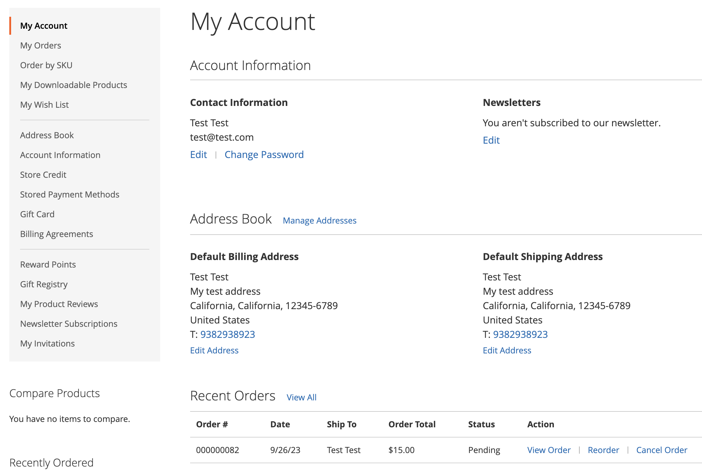

# Annuleren van bestelling toestaan

Als deze optie is ingeschakeld, kunt u een bestelling rechtstreeks vanaf de account van de klant annuleren. Annuleren is standaard uitgeschakeld.

## Criteria voor annulering die moeten worden ingeschakeld voor een bestelling

- De _Volgorde annuleren_ De configuratieoptie moet worden ingeschakeld.

- Als de volgorde in `Hold`, `Canceled`, `Complete`, of `Closed` status, wordt de optie Annuleren uitgeschakeld in de winkel.

- Als een van de items in de bestelling is verzonden, is de optie Annuleren uitgeschakeld in de winkel.

- Als er een object is betaald, is de optie Annuleren ingeschakeld en wordt de restitutie voor dat object gemaakt.

- Als de volgorde in `Pending` of `Processing` status, wordt de optie Annuleren ingeschakeld in de winkel.

## Configureren om annulering door klanten toe te staan en de annuleringsredenen aan te passen

1. Op de _Beheerder_ zijbalk, ga naar **[!UICONTROL Stores]** > _[!UICONTROL Settings]_>**[!UICONTROL Configuration]**.

1. Vouw in het linkerdeelvenster uit **[!UICONTROL Sales]** en selecteert u **[!UICONTROL Sales]**.

1. Uitbreiden  de **[!UICONTROL Order cancellation]** sectie.

   {width="600" zoomable="yes"}

1. Set **[!UICONTROL Order cancellation through GraphQL]** tot `Yes`.

   Met deze instelling wordt de functionaliteit voor annuleren ingeschakeld vanuit de klantenaccount in de winkel.

1. In de **[!UICONTROL Order Order cancellation reasons]** u kunt annuleringsredenen toevoegen, verwijderen of wijzigen.

   Met deze instelling worden annuleringsredenen weergegeven in de winkel aan de klant wanneer deze een bestelling annuleert.
Zorg ervoor dat u ten minste één reden hebt opgegeven.

1. Klik op **[!UICONTROL Save Config]**.

## Annuleren vanuit de winkel

Een klant kan de functie voor annuleren voor een specifieke bestelling starten op drie pagina&#39;s:

- _Mijn bestellingen_ page

- _Weergave bestelling_ page

- _Mijn account_ page

### Mijn bestellingen

De _Bestelling annuleren_ wordt weergegeven op de pagina Mijn bestellingen als de bestelling kan worden geannuleerd.

{width="700" zoomable="yes"}

### Weergavepagina Volgorde

De _Bestelling annuleren_ wordt weergegeven op de pagina Weergavevolgorde als de volgorde kan worden geannuleerd.

{width="700" zoomable="yes"}

### Mijn account

De _Bestelling annuleren_ wordt weergegeven in de sectie Recente bestellingen van de pagina Mijn account als de bestelling kan worden geannuleerd.

{width="700" zoomable="yes"}

