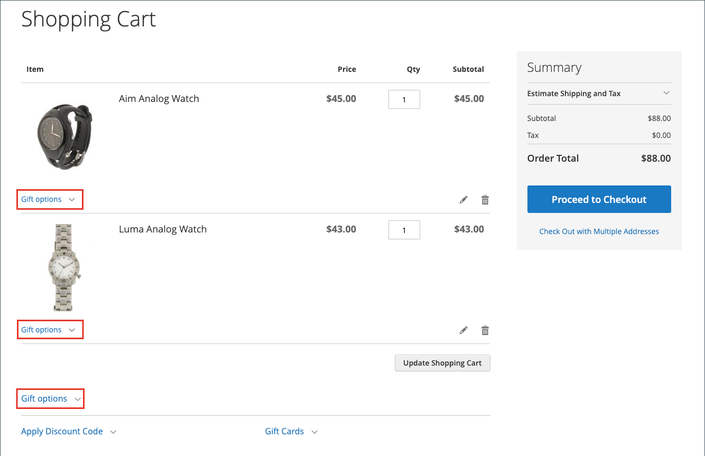

# Winkelconfiguratie

De configuratie van het winkelwagentje bepaalt hoe het winkelwagentje voor uw winkelklanten werkt, inclusief wanneer de klant wordt omgeleid naar de winkelwagentje en welke afbeeldingen worden gebruikt voor productminiaturen. U kunt een orde ook vereisen om een minimumbedrag te bereiken alvorens het controleproces begint, specificeer het aantal dagen geciteerde prijzen geldig blijven, en specificeer de orde van punten in de _Totalen van de Orde_ sectie.

[**Mini kart**](#mini-cart) - Vorm deze optie om te bepalen als de het karretverbinding/pictogram het aantal verschillende producten (of SKUs) in het karretje, of de totale hoeveelheid alle punten toont.

[**Mini kart verbinding**](#configure-the-cart-link) - vorm deze optie om te bepalen als de mini kart verschijnt wanneer een klant het aantal punten in het kartpictogram bij de bovenkant van een opslagpagina klikt.

[**opnieuw richt aan wagentje**](#redirect-to-cart) - vorm deze optie om te bepalen als de het winkelen kartpagina verschijnt wanneer een punt aan de kar wordt toegevoegd, of slechts wanneer een klant verkiest om naar de pagina te gaan.

[**leven van het Citaat**](#quote-lifetime) - vorm deze optie om te specificeren hoe lang een prijs geldig is.

[**Minimale orde bedrag**](#minimum-order-amount) - Vorm deze opties om een minimumbedrag te specificeren, nadat de kortingen worden toegepast, dat de orde subtotals worden vereist om te ontmoeten en het overseinen die in het het winkelwagentje worden getoond.

[**Minimale ordehoeveelheid**](#minimum-order-quantity) - vorm deze opties om een minimumaantal punten te specificeren die worden vereist om een orde te plaatsen.

[**de duimnagels van het Kunst**](#cart-thumbnails) - Vorm de opties van de wortelduimnagel om de duimnagels te bepalen die in de kar voor gegroepeerde of configureerbare producten worden getoond.

[**de opties van het Cadeautje**](#gift-options) - Vorm giftopties om te bepalen als de klanten een geschenkbericht of een groetkaart kunnen toevoegen, en als gift-verpakken opties die beschikbaar zijn.

>[!NOTE]
>
>Voor informatie over het vormen van het controleproces, zie [ Opties van de Controle ](checkout-process.md).

## Minikaart

De _mini kart_ toont een samenvatting van punten in de kar. Deze optie is standaard ingeschakeld en wordt weergegeven wanneer u op de koppeling Winkelwagentje boven aan de pagina klikt.
De verbinding kan worden gevormd om het aantal verschillende producten (of SKUs) in het karretje, of de totale hoeveelheid alle punten te tonen.

{width="700" zoomable="yes"}

>[!NOTE]
>
>Voor a _geregistreerde_ klant, zijn er gevallen wanneer de MinKaart niet automatisch over de veelvoudige apparaten en browsers kan worden gesynchroniseerd. Om de MinKar in dergelijke gevallen te synchroniseren, kan de klant eenvoudig de [ Shopping Kart ](cart.md) pagina op dat apparaat of browser openen.

### De minikaart configureren

1. Voor _Admin_ sidebar, ga **[!UICONTROL Stores]** > _[!UICONTROL Settings]_>**[!UICONTROL Configuration]**.

1. Vouw in het linkerdeelvenster **[!UICONTROL Sales]** uit en kies **[!UICONTROL Checkout]** .

1. Breid  de _[!UICONTROL Mini Cart]_sectie uit.

   {width="600" zoomable="yes"}

1. Als het plaatsen voor een specifieke opslagmening is, [ kies de opslagmening ](../configuration-reference/scope-change.md#set-the-scope) waar de configuratie van toepassing is.

   Klik op **[!UICONTROL OK]** als u daarom wordt gevraagd om door te gaan.

1. Stel **[!UICONTROL Display Mini Cart]** in op een van de volgende opties:

   - `Yes` - Geeft de miniwinkelwagentje weer op winkelpagina&#39;s. De vormgeving van het zijpaneel is afhankelijk van het thema.
   - `No` - Schakelt de weergave van de miniwinkelwagentje op winkelpagina&#39;s uit.

1. Als de weergave is ingeschakeld, werkt u de andere opties bij om de weergave te configureren:

   - Voer bij **[!UICONTROL Number of Items to Display Scrollbar]** het aantal items in dat in het zijpaneel kan worden weergegeven voordat de schuifbalk wordt geactiveerd.
   - Voer bij **[!UICONTROL Maximum Display Recently Added Item(s)]** het maximumaantal onlangs toegevoegde items in dat u wilt weergeven in de minikaart.

1. Klik op **[!UICONTROL Save Config]**.

### De koppeling met het winkelwagentje configureren

1. Op _Admin_ sidebar, moest aan **[!UICONTROL Stores]** > _[!UICONTROL Settings]_>**[!UICONTROL Configuration]**.

1. Vouw in het linkerdeelvenster **[!UICONTROL Sales]** uit en kies **[!UICONTROL Checkout]** .

1. Breid  de **[!UICONTROL My Cart Link]** sectie uit.

1. Stel **[!UICONTROL Display Cart Summary]** in op een van de volgende instellingen:

   - `Display item quantities` - Deze instelling geeft het totale aantal producten in het winkelwagentje weer, waarbij de hoeveelheden voor elk product worden opgeteld.
   - `Display number of items in cart` - Met deze instelling geeft u het aantal producten in het winkelwagentje weer, ongeacht het aantal.

   {width="600" zoomable="yes"}

1. Klik op **[!UICONTROL Save Config]**.

## Omleiden naar winkelwagentje

De winkelwagenpagina kan zo worden geconfigureerd dat deze altijd wordt weergegeven wanneer een item aan het winkelwagentje wordt toegevoegd of alleen wanneer klanten ervoor kiezen naar de pagina te gaan. De basisinformatie over de punten momenteel in de kar is altijd beschikbaar in de [ mini kar ](#mini-cart). Het besluit is een kwestie van het in evenwicht brengen van de voordelen om klanten te laten blijven winkelen, met de voordelen van het aanmoedigen van klanten om verder te gaan met afrekenen. Het kan een kwestie van persoonlijke voorkeur zijn. Als u echter een back-up wilt maken van getallen, kunt u een A/B-test uitvoeren om te zien welke methode een hogere conversiesnelheid oplevert.

**_om te vormen wanneer het karretje verschijnt:_**

1. Voor _Admin_ sidebar, ga **[!UICONTROL Stores]** > _[!UICONTROL Settings]_>**[!UICONTROL Configuration]**.

1. Vouw in het linkerdeelvenster **[!UICONTROL Sales]** uit en kies **[!UICONTROL Checkout]** .

1. Breid  de **[!UICONTROL Shopping Cart]** sectie uit.

   {width="600" zoomable="yes"} worden uitgebreid

1. Als het plaatsen voor een specifieke opslagmening is, [ kies de opslagmening ](../configuration-reference/scope-change.md#set-the-scope) waar de configuratie van toepassing is.

   Klik op **[!UICONTROL OK]** als u daarom wordt gevraagd om door te gaan.

1. Stel **[!UICONTROL After Adding a Product Redirect to Shopping Cart]** in op een van de volgende opties:

   - `Yes` - Geeft de winkelwagenpagina weer direct nadat een product aan de winkelwagentje is toegevoegd.
   - `No` - Hiermee schakelt u de omleiding naar het winkelwagentje uit nadat een product aan het winkelwagentje is toegevoegd.

1. Klik op **[!UICONTROL Save Config]**.

## Offerteleven

Met de installatie en enablement van Adobe Commerce B2B, kunt u steun voor de _Citaten_ eigenschap toevoegen. Hierdoor kunnen geautoriseerde kopers het onderhandelingsproces voor de prijs starten door een aanvraag van het winkelwagentje in te dienen. Het _Citaten_ net maakt een lijst van elk ontvangen citaat, en handhaaft een geschiedenis van de communicatie tussen koper en verkoper. Voor meer informatie over de eigenschappen B2B, zie [ Onderhandelde citaten ](../b2b/quotes.md) in de _Gids van de Gebruiker van Adobe Commerce B2B_.

U kunt bepalen hoe lang een prijs geldig is door het leven van het wortelcitaat in de configuratie te plaatsen. Als een winkelier bijvoorbeeld een winkelwagen na meerdere dagen zonder toezicht verlaat, is de prijs voor sommige objecten mogelijk niet meer gelijk. Standaard is de prijszetlevensduur ingesteld op 30 dagen.

**_om het citaatleven te vormen:_**

1. Voor _Admin_ sidebar, ga **[!UICONTROL Stores]** > _[!UICONTROL Settings]_>**[!UICONTROL Configuration]**.

1. Vouw in het linkerdeelvenster **[!UICONTROL Sales]** uit en kies **[!UICONTROL Checkout]** .

1. Breid  de **[!UICONTROL Shopping Cart]** sectie uit.

   {width="600" zoomable="yes"} worden uitgebreid

1. Als het plaatsen voor een specifieke opslagmening is, [ kies de opslagmening ](../configuration-reference/scope-change.md#set-the-scope) waar de configuratie van toepassing is.

   Klik op **[!UICONTROL OK]** als u daarom wordt gevraagd om door te gaan.

1. Voer voor **[!UICONTROL Quote Lifetime (days)]** het aantal dagen in dat een geciteerde prijs geldig blijft.

1. Klik op **[!UICONTROL Save Config]**.

## Minimumbedrag voor bestelling

Met de configuratie kunt u een minimumbedrag opgeven, nadat kortingen zijn toegepast, dat de subtotalen van de volgorde moeten voldoen. Bestellingen die naar meerdere adressen worden verzonden, kunnen nodig zijn om aan het minimale orderbedrag per adres te voldoen. De knop Uitchecken wordt pas beschikbaar nadat het minimale orderbedrag is bereikt.

{width="700" zoomable="yes"}

**_om een minimumordehoeveelheid te vormen:_**

1. Voor _Admin_ sidebar, ga **[!UICONTROL Stores]** > _[!UICONTROL Settings]_>**[!UICONTROL Configuration]**.

1. Vouw in het linkerdeelvenster **[!UICONTROL Sales]** uit en kies **[!UICONTROL Sales]** eronder.

1. Breid  de **[!UICONTROL Minimum Order Amount]** sectie uit.

   {width="600" zoomable="yes"} worden uitgebreid

1. Stel **[!UICONTROL Enable]** in op `Yes` als u een minimale hoeveelheid bestellingen wilt.

1. Als de minimumorde wordt toegelaten, plaats de volgende opties om het vereiste te vormen:

   - Voer de **[!UICONTROL Minimum Amount]** in die vereist is voor het subtotaal, nadat kortingen zijn toegepast.

   - Stel **[!UICONTROL Include Discount Amount]** in op een van de volgende opties:

      - `Yes` - Vereist dat het subtotaal voldoet aan het minimumbedrag met inbegrip van kortingen. Als u een voorbeeld gebruikt van een minimum van € 50, als de winkelwagen een top van € 60 bevat waarop een korting van 25% is toegepast, is het resulterende subtotaal $45 en voldoet het winkelwagentje niet aan het minimum.
      - `No` - Vereist dat het subtotaal voldoet aan het minimumbedrag zonder kortingen.

   - Stel **[!UICONTROL Include Tax to Amount]** in op een van de volgende opties:

      - `Yes` - Het subtotaal moet voldoen aan het minimumbedrag inclusief belasting.
      - `No` - Het subtotaal moet voldoen aan het minimumbedrag zonder belasting.

1. Pas desgewenst de instellingen voor het minimumbedrag van de bestelling aan:

   - Voer bij **[!UICONTROL Description Message]** de tekst in die u wilt gebruiken om het bericht aan te passen dat boven aan het winkelwagentje wordt weergegeven wanneer het subtotaal niet voldoet aan de minimumhoeveelheid.

   - Voer bij **[!UICONTROL Error to Show in Shopping Cart]** de tekst in die u wilt gebruiken om het foutbericht voor het winkelwagentje aan te passen.

   Laat de velden voor de berichtbeschrijving leeg om de standaardberichten te gebruiken.

1. Indien nodig, vorm minimumorde die voor multi-adresorden plaatst:

   - Stel **[!UICONTROL Validate Each Address Separately in Multi-address Checkout]** in op `Yes` als u wilt dat elk adres in een volgorde met meerdere adressen voldoet aan de minimale orderhoeveelheid.

   - Pas desgewenst de instellingen voor het minimumbedrag van de bestelling aan:

      - **[!UICONTROL Multi-address Description Message]** - Voer de tekst in die u wilt gebruiken om het bericht aan te passen dat boven aan het winkelwagentje wordt weergegeven voor bestellingen met meerdere adressen die niet aan het minimum voldoen.

      - **[!UICONTROL Multi-address Error to Show in Shopping Cart]** - Voer de tekst in die u wilt gebruiken om het foutbericht van het winkelwagentje aan te passen voor bestellingen met meerdere adressen die niet aan het minimum voldoen. Voer de tekst in het vak in.

     Laat de velden voor de berichtbeschrijving leeg om de standaardberichten te gebruiken.

1. Klik op **[!UICONTROL Save Config]**.

## Minimumhoeveelheid bestelling

U kunt de minimumhoeveelheid instellen die voor een bestelling is toegestaan. De minimumhoeveelheid kan ook worden gevormd volgens elke klantengroep.

1. Ga naar **[!UICONTROL Stores]** > _[!UICONTROL Settings]_>**[!UICONTROL Configuration]**.

1. Vouw in het linkerdeelvenster **[!UICONTROL Catalog]** uit en kies **[!UICONTROL Inventory]** .

1. Breid  de **[!UICONTROL Product Stock Options]** sectie uit.

   {width="600" zoomable="yes"}

1. Stel bij **[!UICONTROL Minimum Qty Allowed in Shopping Cart]** de minimale hoeveelheid van het product voor een bestelling in.

   Schakel indien nodig het selectievakje **[!UICONTROL Use system value]** uit om deze instellingen te wijzigen.

   - Wijzig de instelling **[!UICONTROL Customer Group]** in een specifieke groep en voer de waarde **[!UICONTROL Minimum Qty]** voor die groep in. Klik op **[!UICONTROL Add Minimum Qty]** als u nog een groep- en kwantitatieve beperking wilt toevoegen.

   - Als u dezelfde minimale kwantitatieve limiet voor alle klanten wilt instellen, selecteert u `ALL GROUPS` en voert u de **[!UICONTROL Minimum Qty]** in.

1. Klik op **[!UICONTROL Save Config]**.

   {width="700" zoomable="yes"}

## Miniaturen van winkelwagentjes

 (slechts Adobe Commerce)

De miniatuurafbeeldingen die in het winkelwagentje worden weergegeven, geven klanten een snel overzicht van de items die ze op het punt staan te kopen. Voor producten met meerdere opties komt de afbeelding mogelijk niet overeen met de variatie van het product in de winkelwagentje. Als de klant een item in een bepaalde kleur koopt, moet de miniatuur in het winkelwagentje overeenkomen.

De miniatuurafbeelding voor zowel gegroepeerde als configureerbare producten kan zo worden ingesteld dat de afbeelding wordt weergegeven vanuit het &quot;bovenliggende&quot; product of de productvariatie.

{width="700" zoomable="yes"}

**_om wortelduimnagels te vormen:_**

1. Voor _Admin_ sidebar, ga **[!UICONTROL Stores]** > _[!UICONTROL Settings]_>**[!UICONTROL Configuration]**.

1. Vouw in het linkerdeelvenster **[!UICONTROL Sales]** uit en kies **[!UICONTROL Checkout]** .

1. Breid  de **[!UICONTROL Shopping Cart]** sectie uit.

   {width="600" zoomable="yes"} worden uitgebreid

1. Plaats **[!UICONTROL Grouped Product Image]** om de duimnagel te bepalen die in de kar voor [ gegroepeerde producten ](../catalog/product-create-grouped.md) wordt gebruikt:

   - `Product Thumbnail Itself` - Hiermee gebruikt u de miniatuur die is toegewezen aan de productvariatie die aan het winkelwagentje is toegevoegd.
   - `Parent Product Thumbnail` - Gebruikt de miniatuur die aan het bovenliggende product is toegewezen.

1. Plaats **[!UICONTROL Configurable Product Image]** om de duimnagel te bepalen die in de kar voor [ configureerbare producten ](../catalog/product-create-configurable.md) wordt gebruikt:

   - `Product Thumbnail Itself` - Hiermee gebruikt u de miniatuur die is toegewezen aan de productvariatie die aan het winkelwagentje is toegevoegd.
   - `Parent Product Thumbnail` - Gebruikt de miniatuur die aan het bovenliggende product is toegewezen.

1. Klik op **[!UICONTROL Save Config]**.

## Cadeauopties

De selectie van beschikbare cadeauopties wordt in het winkelwagentje weergegeven voordat het afrekenproces begint. De configuratie met cadeauopties bepaalt of klanten een cadeaubericht of wenskaart kunnen toevoegen en of er opties voor het verpakken van cadeaus beschikbaar zijn. Elk item in de volgorde kan een aparte bericht- en cadeauverpakking hebben. Wanneer klanten op de volledige bestelling worden toegepast, kunnen ze ook een kwitantie- en wenskaart toevoegen.

{width="700" zoomable="yes"}

De configuratie Cadeauopties is van toepassing op de gehele website, maar kan op productniveau worden overschreven.

### Enable gift options

1. Voor _Admin_ sidebar, ga **[!UICONTROL Stores]** > _[!UICONTROL Settings]_>**[!UICONTROL Configuration]**.

1. Vouw in het linkerdeelvenster **[!UICONTROL Sales]** uit en kies **[!UICONTROL Sales]** eronder.

1. Breid  **[!UICONTROL Gift Options]** op de pagina uit.

   {width="600" zoomable="yes"}

1. Stel de berichtopties voor cadeautjes in op basis van uw voorkeur:

   - Selecteer `Yes` bij **[!UICONTROL Allow Gift Messages on Order Level]** als u één cadeaubericht voor de hele volgorde wilt inschakelen.
   - Selecteer voor **[!UICONTROL Allow Gift Messages for Order Items]** de optie `Yes` om het toevoegen van aparte cadeauberichten voor afzonderlijke items in het winkelwagentje van de klant in te schakelen.

1.  (Adobe Commerce slechts) plaats de gift-verpakken opties volgens uw voorkeur:

   - Selecteer `Yes` bij **[!UICONTROL Allow Gift Wrapping on Order Level]** als u één cadeauverpakking voor de volledige volgorde wilt inschakelen.
   - Selecteer voor **[!UICONTROL Allow Gift Wrapping for Order Items]** `Yes` om het toevoegen van cadeauverpakking aan elk artikel in het winkelwagentje van de klant mogelijk te maken.

   U kunt verschillende [ gift-omsluitende ontwerpen ](#gift-wrap) ook bepalen zodat de klanten de omslag kunnen kiezen.

1.  (Adobe Commerce slechts) om klanten van een optie te voorzien om een geschenkontvangstbewijs te omvatten, reeks **[!UICONTROL Allow Gift Receipt]** aan `Yes`.

1.  (Adobe Commerce slechts) om klanten van een optie te voorzien om een gedrukte kaart te omvatten, reeks **[!UICONTROL Allow Printed Card]** aan `Yes`.

1.  (Adobe Commerce slechts) gaat **[!UICONTROL Default Price for Printed Card]** in.

1. Klik op **[!UICONTROL Save Config]**.

### Cadeauverpakking

 (slechts Adobe Commerce)

Cadeauverpakking is beschikbaar voor elk product dat kan worden verzonden en kan worden aangeboden voor afzonderlijke objecten of voor de volledige bestelling. U kunt een aparte prijs in rekening brengen voor elk geschenompontwerp en een miniatuurafbeelding uploaden voor elk ontwerp dat als optie voor een product in de kar verschijnt. Wanneer een klant op de miniatuur van de cadeauterugloop klikt, wordt een afbeelding op volledige grootte weergegeven. Tijdens controleoverzicht, verschijnt de lading van de geschenkomslag met andere [ controletotalen ](checkout-totals-sort-order.md) in de _Samenvatting van de Orde_ sectie.

De geschenkompafbeelding moet een staal zijn met het herhalende patroon en kan ook een voorbeeld van het te gebruiken lint bevatten. U kunt het papier scannen of een foto nemen van een verpakking. De geüploade afbeelding kan een GIF-, JPG- of PNG-afbeelding zijn en moet vierkant zijn. In het volgende voorbeeld is de geüploade geschenomslagafbeelding 230 x 230 pixels.

{width="700" zoomable="yes"}

#### Een geschenkompontwerp toevoegen

1. Voor _Admin_ sidebar, ga **[!UICONTROL Stores]** > _[!UICONTROL Other Settings]_>**[!UICONTROL Gift Wrapping]**.

   {width="700" zoomable="yes"}

1. Klik in de rechterbovenhoek op **[!UICONTROL Add Gift Wrapping]** .

1. Voer de naam in voor de **[!UICONTROL Gift Wrapping Design]** die tijdens het uitchecken moet worden weergegeven.

   Indien nodig, kunt u **[!UICONTROL Scope]** veranderen en een verschillende naam voor elke archiefmening vormen.

1. Selecteer **[!UICONTROL Websites]** waar het ontwerp van de cadeauverpakking beschikbaar is.

1. Stel **[!UICONTROL Status]** in op `Enabled` .

   Als de optie voor seizoensgebonden omloop is ingeschakeld, kunt u deze instellen op `Disabled` als u niet wilt dat deze optie beschikbaar is.

1. Voer de **[!UICONTROL Price]** in van het omloopontwerp van de cadeauverpakking.

   Deze instelling kan worden overschreven door de prijs voor cadeauverpakking die op productniveau is ingesteld.

   {width="600" zoomable="yes"}

1. Als u een miniatuur **[!UICONTROL Image]** van de cadeauverpakking wilt uploaden, klikt u op **[!UICONTROL Choose File]** en selecteert u het bestand dat u wilt uploaden in de map.

   Er wordt een miniatuur van de afbeelding weergegeven in de _[!UICONTROL Gift Wrapping Information]_nadat de record is opgeslagen.

1. Klik op **[!UICONTROL Save]**.

#### Een geschenkompontwerp bewerken

1. Voor _Admin_ sidebar, ga **[!UICONTROL Stores]** > _[!UICONTROL Other Settings]_>**[!UICONTROL Gift Wrapping]**.

1. Zoek de teruglooprecord van het geschenk in de lijst.

1. In de _kolom van de Actie_, klik **[!UICONTROL Edit]**.

   {width="600" zoomable="yes"} uit

1. Breng de gewenste wijzigingen aan.

1. Klik op **[!UICONTROL Save]**.

#### Indelingsontwerpen voor cadeaus verwijderen

Met het _open net van de Wrapping van het Cadeautje_ {, gebruik één van deze methodes om omslagontwerpen te schrappen.

**_Methode 1: Schrap één enkel ontwerp van de geschenkomslag_**

1. Open het cadeau-wrapping-ontwerp in de bewerkingsmodus.

1. Klik boven aan de werkruimte op **[!UICONTROL Delete]** .

1. Klik op **[!UICONTROL OK]** om te bevestigen wanneer hierom wordt gevraagd.

**_Methode 2: Schrap veelvoudige ontwerpen van de geschenkomslag_**

1. In het _net van de Wrapping van het Cadeautje_, selecteer checkbox van elk ontwerp van de cadeauomslag dat u wilt schrappen.

1. Stel het besturingselement **[!UICONTROL Actions]** in op `Delete` .

1. Klik op **[!UICONTROL Submit]**.

### Cadeauoptietaks

 (slechts Adobe Commerce)

Cadeauverpakking en prijzen voor afgedrukte cadeaukaarten kunnen worden geconfigureerd voor het opnemen of uitsluiten van belasting, of voor het weergeven van beide opties. U kunt ook een belastingklasse voor deze items opgeven, op algemeen niveau of op websiteniveau.

**_om geschenkoptiesbelastingen te vormen:_**

1. Voor _Admin_ sidebar, ga **[!UICONTROL Stores]** > _[!UICONTROL Settings]_>**[!UICONTROL Configuration]**.

1. Vouw in het linkerdeelvenster **[!UICONTROL Sales]** uit en kies **[!UICONTROL Tax]** .

1. Breid  de **[!UICONTROL Tax Classes]** sectie uit.

   {width="600" zoomable="yes"}

1. Stel **[!UICONTROL Tax Class for Gift Options]** in op de toepasselijke belastingklasse.

1. Breid  de **[!UICONTROL Orders, Invoices, Credit Memos Display Settings]** sectie uit.

   {width="600" zoomable="yes"}

1. Stel **[!UICONTROL Display Gift Wrapping Prices]** in op een van de volgende opties:

   - `Excluding Tax`
   - `Including Tax`
   - `Including and Excluding Tax`

1. Stel **[!UICONTROL Display Printed Card Prices]** in op een van de volgende opties:

   - `Excluding Tax`
   - `Including Tax`
   - `Including and Excluding Tax`

1. Klik op **[!UICONTROL Save Config]**.
