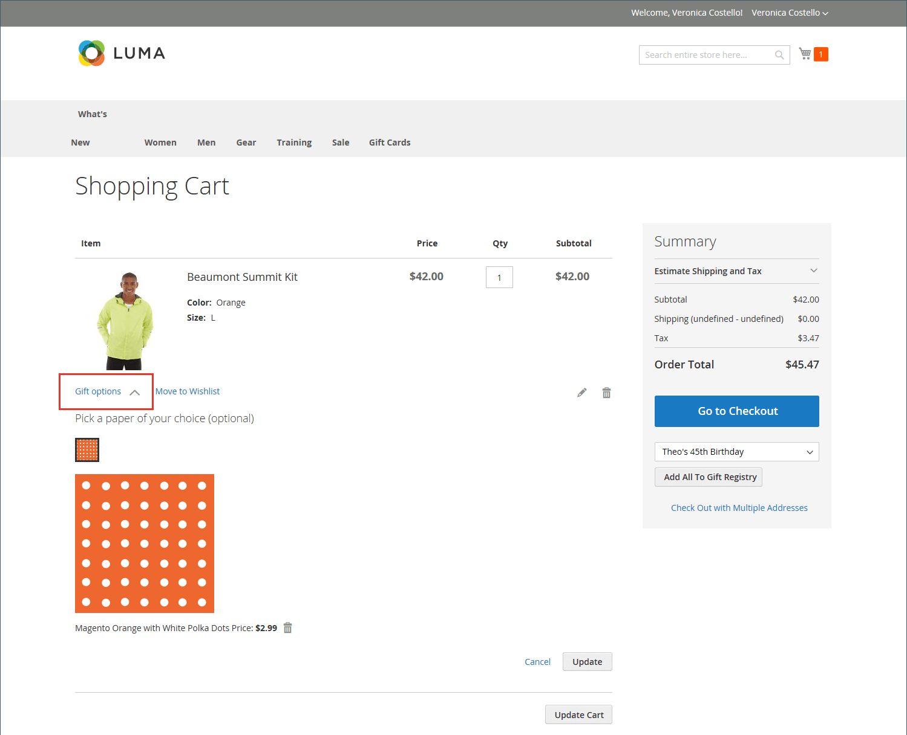

# Winkelconfiguratie

De configuratie van het winkelwagentje bepaalt hoe het winkelwagentje voor uw winkelklanten werkt, inclusief wanneer de klant wordt omgeleid naar de winkelwagentje en welke afbeeldingen worden gebruikt voor productminiaturen. U kunt ook een bestelling vereisen om een minimumbedrag te bereiken voordat het afrekenen begint, het aantal dagen opgeven dat de genoteerde prijzen geldig blijven en de volgorde van de objecten in het dialoogvenster _Totalen bestellen_ sectie.

[**Minikaart**](#mini-cart) - Configureer deze optie om te bepalen of in de winkelwagentje/het pictogram het aantal verschillende producten (of SKU&#39;s) in de winkelwagentje of de totale hoeveelheid van alle items wordt weergegeven.

[**Mini-karretje**](#configure-the-cart-link) - Configureer deze optie om te bepalen of de miniwinkelwagentje wordt weergegeven wanneer een klant op het aantal items in het winkelwagentje boven aan een winkelpagina klikt.

[**Omleiden naar winkelwagentje**](#redirect-to-cart)- Configureer deze optie om te bepalen of de winkelwagenpagina wordt weergegeven wanneer een item aan het winkelwagentje wordt toegevoegd of alleen wanneer een klant ervoor kiest naar de pagina te gaan.

[**Offerteleven**](#quote-lifetime) - Vorm deze optie om te specificeren hoe lang een prijs geldig is.

[**Minimumbedrag voor bestelling**](#minimum-order-amount) - Configureer deze opties om een minimumbedrag op te geven, nadat kortingen zijn toegepast, dat subtotalen van bestellingen vereist zijn om te voldoen aan de wensen en de berichten die worden weergegeven in het winkelwagentje.

[**Minimumhoeveelheid bestelling**](#minimum-order-quantity) - Vorm deze opties om een minimumaantal punten te specificeren die worden vereist om een orde te plaatsen.

[**Miniaturen van winkelwagentjes**](#cart-thumbnails)  - Configureer de opties voor de miniaturen van de winkelwagentjes om te bepalen welke miniaturen in de winkelwagentje worden weergegeven voor gegroepeerde of configureerbare producten.

[**Cadeauopties**](#gift-options) - Configureer schenkingsopties om te bepalen of klanten een cadeaubericht of wenskaart kunnen toevoegen en of er opties voor het verpakken van cadeaus beschikbaar zijn.

>[!NOTE]
>
>Voor informatie over het vormen van het controleproces, zie [Afhandelingsopties](checkout-process.md).

## Minikaart

De _minikaart_ geeft een overzicht van de artikelen in het winkelwagentje weer. Deze optie is standaard ingeschakeld en wordt weergegeven wanneer u op de koppeling Winkelwagentje boven aan de pagina klikt.
De verbinding kan worden gevormd om het aantal verschillende producten (of SKUs) in het karretje, of de totale hoeveelheid alle punten te tonen.

{width="700" zoomable="yes"}

>[!NOTE]
>
>Voor een _geregistreerd_ -klant, zijn er gevallen waarin de Mini Cart niet automatisch wordt gesynchroniseerd op meerdere apparaten en browsers. Als u in dergelijke gevallen de Mini Cart wilt synchroniseren, kan de klant gewoon de opdracht [Winkelwagentje](cart.md) op dat apparaat of die browser.

### De minikaart configureren

1. Op de _Beheerder_ zijbalk, ga naar **[!UICONTROL Stores]** > _[!UICONTROL Settings]_>**[!UICONTROL Configuration]**.

1. Vouw in het linkerdeelvenster uit **[!UICONTROL Sales]** en kiest u **[!UICONTROL Checkout]**.

1. Uitbreiden  de _[!UICONTROL Mini Cart]_sectie.

   {width="600" zoomable="yes"}

1. Als de instelling geldt voor een specifieke winkelweergave, [kiezen in de winkelweergave](../configuration-reference/scope-change.md#set-the-scope) waar de configuratie van toepassing is.

   Klik op **[!UICONTROL OK]** om door te gaan.

1. Set **[!UICONTROL Display Mini Cart]** op een van de volgende wijzen:

   - `Yes` - Geeft de miniwinkelwagentje weer op winkelpagina&#39;s. De vormgeving van het zijpaneel is afhankelijk van het thema.
   - `No` - Schakelt de weergave van de miniwinkelwagentje op winkelpagina&#39;s uit.

1. Als de weergave is ingeschakeld, werkt u de andere opties bij om de weergave te configureren:

   - Voor **[!UICONTROL Number of Items to Display Scrollbar]** Voer het aantal items in dat in het zijpaneel kan worden weergegeven voordat de schuifbalk wordt geactiveerd.
   - Voor **[!UICONTROL Maximum Display Recently Added Item(s)]**, voert u het maximumaantal onlangs toegevoegde items in dat u in de miniwinkelwagentje wilt weergeven.

1. Klik op **[!UICONTROL Save Config]**.

### De koppeling met het winkelwagentje configureren

1. Op de _Beheerder_ sidebar, pas aan **[!UICONTROL Stores]** > _[!UICONTROL Settings]_>**[!UICONTROL Configuration]**.

1. Vouw in het linkerdeelvenster uit **[!UICONTROL Sales]** en kiest u **[!UICONTROL Checkout]**.

1. Uitbreiden  de **[!UICONTROL My Cart Link]** sectie.

1. Set **[!UICONTROL Display Cart Summary]** naar een van de volgende instellingen:

   - `Display item quantities` - Met deze instelling wordt het totale aantal producten in het winkelwagentje weergegeven, waarbij de hoeveelheden voor elk product worden opgeteld.
   - `Display number of items in cart` - Met deze instelling wordt het aantal producten in de winkelwagentje weergegeven, ongeacht het aantal.

   {width="600" zoomable="yes"}

1. Klik op **[!UICONTROL Save Config]**.

## Omleiden naar winkelwagentje

De winkelwagenpagina kan zo worden geconfigureerd dat deze altijd wordt weergegeven wanneer een item aan het winkelwagentje wordt toegevoegd of alleen wanneer klanten ervoor kiezen naar de pagina te gaan. De basisinformatie over de objecten die momenteel in het winkelwagentje staan, is altijd beschikbaar in de [minikaart](#mini-cart). Het besluit is een kwestie van het in evenwicht brengen van de voordelen om klanten te laten blijven winkelen, met de voordelen van het aanmoedigen van klanten om verder te gaan met afrekenen. Het kan een kwestie van persoonlijke voorkeur zijn. Als u echter een back-up wilt maken van getallen, kunt u een A/B-test uitvoeren om te zien welke methode een hogere conversiesnelheid oplevert.

**_Configureer wanneer het winkelwagentje verschijnt:_**

1. Op de _Beheerder_ zijbalk, ga naar **[!UICONTROL Stores]** > _[!UICONTROL Settings]_>**[!UICONTROL Configuration]**.

1. Vouw in het linkerdeelvenster uit **[!UICONTROL Sales]** en kiest u **[!UICONTROL Checkout]**.

1. Uitbreiden  de **[!UICONTROL Shopping Cart]** sectie.

   {width="600" zoomable="yes"}

1. Als de instelling geldt voor een specifieke winkelweergave, [kiezen in de winkelweergave](../configuration-reference/scope-change.md#set-the-scope) waar de configuratie van toepassing is.

   Klik op **[!UICONTROL OK]** om door te gaan.

1. Set **[!UICONTROL After Adding a Product Redirect to Shopping Cart]** op een van de volgende wijzen:

   - `Yes` - Geeft de winkelwagentje pagina weer direct nadat een product aan het winkelwagentje is toegevoegd.
   - `No` - Hiermee schakelt u de omleiding naar het winkelwagentje uit nadat een product aan het winkelwagentje is toegevoegd.

1. Klik op **[!UICONTROL Save Config]**.

## Offerteleven

Met de installatie en activering van Adobe Commerce B2B kunt u ondersteuning toevoegen voor de _Aanhalingen_ gebruiken. Hierdoor kunnen geautoriseerde kopers het onderhandelingsproces voor de prijs starten door een aanvraag van het winkelwagentje in te dienen. De _Aanhalingen_ Het raster geeft een overzicht van elke ontvangen offerte en houdt een geschiedenis bij van de communicatie tussen koper en verkoper. Zie voor meer informatie over de B2B-functies [Onderhandelde aanhalingstekens](../b2b/quotes.md) in de _Adobe Commerce B2B-gebruikershandleiding_.

U kunt bepalen hoe lang een prijs geldig is door het leven van het wortelcitaat in de configuratie te plaatsen. Als een winkelier bijvoorbeeld een winkelwagen na meerdere dagen zonder toezicht verlaat, is de prijs voor sommige objecten mogelijk niet meer gelijk. Standaard is de prijszetlevensduur ingesteld op 30 dagen.

**_Om het citaatleven te vormen:_**

1. Op de _Beheerder_ zijbalk, ga naar **[!UICONTROL Stores]** > _[!UICONTROL Settings]_>**[!UICONTROL Configuration]**.

1. Vouw in het linkerdeelvenster uit **[!UICONTROL Sales]** en kiest u **[!UICONTROL Checkout]**.

1. Uitbreiden  de **[!UICONTROL Shopping Cart]** sectie.

   {width="600" zoomable="yes"}

1. Als de instelling geldt voor een specifieke winkelweergave, [kiezen in de winkelweergave](../configuration-reference/scope-change.md#set-the-scope) waar de configuratie van toepassing is.

   Klik op **[!UICONTROL OK]** om door te gaan.

1. Voor **[!UICONTROL Quote Lifetime (days)]**, geeft u het aantal dagen op waarop een geprijsde prijs geldig blijft.

1. Klik op **[!UICONTROL Save Config]**.

## Minimumbedrag voor bestelling

Met de configuratie kunt u een minimumbedrag opgeven, nadat kortingen zijn toegepast, dat de subtotalen van de volgorde moeten voldoen. Bestellingen die naar meerdere adressen worden verzonden, kunnen nodig zijn om aan het minimale orderbedrag per adres te voldoen. De knop Uitchecken wordt pas beschikbaar nadat het minimale orderbedrag is bereikt.

{width="700" zoomable="yes"}

**_Een minimale orderhoeveelheid configureren:_**

1. Op de _Beheerder_ zijbalk, ga naar **[!UICONTROL Stores]** > _[!UICONTROL Settings]_>**[!UICONTROL Configuration]**.

1. Vouw in het linkerdeelvenster uit **[!UICONTROL Sales]** en kiest u **[!UICONTROL Sales]** onder.

1. Uitbreiden  de **[!UICONTROL Minimum Order Amount]** sectie.

   {width="600" zoomable="yes"}

1. Als u een minimumorderbedrag wilt opgeven, stelt u **[!UICONTROL Enable]** tot `Yes`.

1. Als de minimumorde wordt toegelaten, plaats de volgende opties om het vereiste te vormen:

   - Voer de **[!UICONTROL Minimum Amount]** dat voor het subtotaal vereist is, na toepassing van kortingen.

   - Set **[!UICONTROL Include Discount Amount]** op een van de volgende wijzen:

      - `Yes` - Vereist dat het subtotaal voldoet aan het minimumbedrag met inbegrip van eventuele kortingen. Als u een voorbeeld gebruikt van een minimum van € 50, als de winkelwagen een top van € 60 bevat waarop een korting van 25% is toegepast, is het resulterende subtotaal $45 en voldoet het winkelwagentje niet aan het minimum.
      - `No` - Vereist dat het subtotaal voldoet aan het minimumbedrag zonder kortingen.

   - Set **[!UICONTROL Include Tax to Amount]** op een van de volgende wijzen:

      - `Yes` - Vereist dat het subtotaal voldoet aan het minimumbedrag inclusief belasting.
      - `No` - Het subtotaal moet voldoen aan het minimumbedrag zonder belasting.

1. Pas desgewenst de instellingen voor het minimumbedrag van de bestelling aan:

   - Voor **[!UICONTROL Description Message]** Voer de tekst in die u wilt gebruiken om het bericht aan te passen dat boven aan het winkelwagentje wordt weergegeven wanneer het subtotaal niet voldoet aan het minimumbedrag.

   - Voor **[!UICONTROL Error to Show in Shopping Cart]**, voert u de tekst in die u wilt gebruiken om het foutbericht voor het winkelwagentje aan te passen.

   Laat de velden voor de berichtbeschrijving leeg om de standaardberichten te gebruiken.

1. Indien nodig, vorm minimumorde die voor multi-adresorden plaatst:

   - Om te vereisen dat elk adres in een multi-adresorde aan het minimumordebedrag voldoet, reeks **[!UICONTROL Validate Each Address Separately in Multi-address Checkout]** tot `Yes`.

   - Pas desgewenst de instellingen voor het minimumbedrag van de bestelling aan:

      - **[!UICONTROL Multi-address Description Message]** - Voer de tekst in die u wilt gebruiken om het bericht aan te passen dat boven aan het winkelwagentje wordt weergegeven voor bestellingen met meerdere adressen die niet aan het minimum voldoen.

      - **[!UICONTROL Multi-address Error to Show in Shopping Cart]** - Voer de tekst in die u wilt gebruiken om het foutbericht van het winkelwagentje aan te passen voor bestellingen met meerdere adressen die niet aan het minimum voldoen. Voer de tekst in het vak in.

     Laat de velden voor de berichtbeschrijving leeg om de standaardberichten te gebruiken.

1. Klik op **[!UICONTROL Save Config]**.

## Minimumhoeveelheid bestelling

U kunt de minimumhoeveelheid instellen die voor een bestelling is toegestaan. De minimumhoeveelheid kan ook worden gevormd volgens elke klantengroep.

1. Ga naar **[!UICONTROL Stores]** > _[!UICONTROL Settings]_>**[!UICONTROL Configuration]**.

1. Vouw in het linkerdeelvenster uit **[!UICONTROL Catalog]** en kiest u **[!UICONTROL Inventory]**.

1. Uitbreiden  de **[!UICONTROL Product Stock Options]** sectie.

   {width="600" zoomable="yes"}

1. Voor **[!UICONTROL Minimum Qty Allowed in Shopping Cart]** de minimumhoeveelheid van het product voor een bestelling.

   Wis indien nodig de **[!UICONTROL Use system value]** Schakel het selectievakje in om deze instellingen te wijzigen.

   - Wijzig de **[!UICONTROL Customer Group]** instellen op een specifieke groep en de instelling **[!UICONTROL Minimum Qty]** voor die groep. Als u nog een groep- en kwantitatieve limiet wilt toevoegen, klikt u op **[!UICONTROL Add Minimum Qty]**.

   - Als u voor alle klanten dezelfde minimumhoeveelheid wilt instellen, moet u de `ALL GROUPS` en voert u de **[!UICONTROL Minimum Qty]**.

1. Klik op **[!UICONTROL Save Config]**.

   {width="700" zoomable="yes"}

## Miniaturen van winkelwagentjes

 (alleen Adobe Commerce)

De miniatuurafbeeldingen die in het winkelwagentje worden weergegeven, geven klanten een snel overzicht van de items die ze op het punt staan te kopen. Voor producten met meerdere opties komt de afbeelding mogelijk niet overeen met de variatie van het product in de winkelwagentje. Als de klant een item in een bepaalde kleur koopt, moet de miniatuur in het winkelwagentje overeenkomen.

De miniatuurafbeelding voor zowel gegroepeerde als configureerbare producten kan zo worden ingesteld dat de afbeelding wordt weergegeven vanuit het &quot;bovenliggende&quot; product of de productvariatie.

{width="700" zoomable="yes"}

**_Miniaturen van winkelwagentjes configureren:_**

1. Op de _Beheerder_ zijbalk, ga naar **[!UICONTROL Stores]** > _[!UICONTROL Settings]_>**[!UICONTROL Configuration]**.

1. Vouw in het linkerdeelvenster uit **[!UICONTROL Sales]** en kiest u **[!UICONTROL Checkout]**.

1. Uitbreiden  de **[!UICONTROL Shopping Cart]** sectie.

   {width="600" zoomable="yes"}

1. Set **[!UICONTROL Grouped Product Image]** om de miniatuur te bepalen die wordt gebruikt in het winkelwagentje voor [gegroepeerde producten](../catalog/product-create-grouped.md):

   - `Product Thumbnail Itself` - Hiermee gebruikt u de miniatuur die is toegewezen aan de productvariatie die aan het winkelwagentje is toegevoegd.
   - `Parent Product Thumbnail` - Gebruikt de miniatuur die aan het bovenliggende product is toegewezen.

1. Set **[!UICONTROL Configurable Product Image]** om de miniatuur te bepalen die wordt gebruikt in het winkelwagentje voor [configureerbare producten](../catalog/product-create-configurable.md):

   - `Product Thumbnail Itself` - Hiermee gebruikt u de miniatuur die is toegewezen aan de productvariatie die aan het winkelwagentje is toegevoegd.
   - `Parent Product Thumbnail` - Gebruikt de miniatuur die aan het bovenliggende product is toegewezen.

1. Klik op **[!UICONTROL Save Config]**.

## Cadeauopties

De selectie van beschikbare cadeauopties wordt in het winkelwagentje weergegeven voordat het afrekenproces begint. De configuratie met cadeauopties bepaalt of klanten een cadeaubericht of wenskaart kunnen toevoegen en of er opties voor het verpakken van cadeaus beschikbaar zijn. Elk item in de volgorde kan een aparte bericht- en cadeauverpakking hebben. Wanneer klanten op de volledige bestelling worden toegepast, kunnen ze ook een kwitantie- en wenskaart toevoegen.

{width="700" zoomable="yes"}

De configuratie Cadeauopties is van toepassing op de gehele website, maar kan op productniveau worden overschreven.

### Enable gift options

1. Op de _Beheerder_ zijbalk, ga naar **[!UICONTROL Stores]** > _[!UICONTROL Settings]_>**[!UICONTROL Configuration]**.

1. Vouw in het linkerdeelvenster uit **[!UICONTROL Sales]** en kiest u **[!UICONTROL Sales]** onder.

1. Uitbreiden  **[!UICONTROL Gift Options]** op de pagina.

   {width="600" zoomable="yes"}

1. Stel de berichtopties voor cadeautjes in op basis van uw voorkeur:

   - Voor **[!UICONTROL Allow Gift Messages on Order Level]**, selecteert u `Yes` om één geschenk voor de volledige orde toe te laten.
   - Voor **[!UICONTROL Allow Gift Messages for Order Items]**, selecteert u `Yes` om het toevoegen van aparte cadeauberichten voor afzonderlijke artikelen in het winkelwagentje van de klant mogelijk te maken.

1.  (Alleen Adobe Commerce) Stel de opties voor het inpakken van cadeaus in op basis van uw voorkeur:

   - Voor **[!UICONTROL Allow Gift Wrapping on Order Level]**, selecteert u `Yes` om één enkele gift voor de volledige orde in te laten verpakken.
   - Voor **[!UICONTROL Allow Gift Wrapping for Order Items]**, selecteert u `Yes` om het toevoegen van cadeauverpakking aan elk artikel in het winkelwagentje van de klant mogelijk te maken.

   U kunt ook verschillende [cadeau-wrapping-ontwerpen](#gift-wrap) zodat klanten de onmiddellijke verpakking kunnen kiezen.

1.  (Alleen Adobe Commerce) Als u klanten de mogelijkheid wilt bieden om een cadeaubon op te nemen, stelt u **[!UICONTROL Allow Gift Receipt]** tot `Yes`.

1.  (Alleen Adobe Commerce) Als u klanten de mogelijkheid wilt bieden om een afgedrukte kaart op te nemen, stelt u **[!UICONTROL Allow Printed Card]** tot `Yes`.

1.  (Alleen Adobe Commerce) Voer de **[!UICONTROL Default Price for Printed Card]**.

1. Klik op **[!UICONTROL Save Config]**.

### Cadeauverpakking

 (alleen Adobe Commerce)

Cadeauverpakking is beschikbaar voor elk product dat kan worden verzonden en kan worden aangeboden voor afzonderlijke objecten of voor de volledige bestelling. U kunt een aparte prijs in rekening brengen voor elk geschenompontwerp en een miniatuurafbeelding uploaden voor elk ontwerp dat als optie voor een product in de kar verschijnt. Wanneer een klant op de miniatuur van de cadeauterugloop klikt, wordt een afbeelding op volledige grootte weergegeven. Tijdens de afhandeling wordt de omloopkosten van het geschenk samen met de andere weergegeven [uitchecktotalen](checkout-totals-sort-order.md) in de _Overzicht van bestellingen_ sectie.

De geschenkompafbeelding moet een staal zijn met het herhalende patroon en kan ook een voorbeeld van het te gebruiken lint bevatten. U kunt het papier scannen of een foto nemen van een verpakking. De geüploade afbeelding kan een GIF-, JPG- of PNG-afbeelding zijn en moet vierkant zijn. In het volgende voorbeeld is de geüploade geschenomslagafbeelding 230 x 230 pixels.

{width="700" zoomable="yes"}

#### Een geschenkompontwerp toevoegen

1. Op de _Beheerder_ zijbalk, ga naar **[!UICONTROL Stores]** > _[!UICONTROL Other Settings]_>**[!UICONTROL Gift Wrapping]**.

   {width="700" zoomable="yes"}

1. Klik in de rechterbovenhoek op **[!UICONTROL Add Gift Wrapping]**.

1. Voer de naam in voor de **[!UICONTROL Gift Wrapping Design]** om tijdens het afrekenen te worden weergegeven.

   Indien nodig kunt u de **[!UICONTROL Scope]** en configureer een andere naam voor elke winkelweergave.

1. Selecteer de **[!UICONTROL Websites]** waar het ontwerp van de cadeauverpakking beschikbaar is.

1. Set **[!UICONTROL Status]** tot `Enabled`.

   Als u seizoensgebonden omloopopties hebt, kunt u deze instellen op `Disabled` als u niet wilt dat de optie beschikbaar is.

1. Voer de **[!UICONTROL Price]** van het ontwerp van de cadeauverpakking.

   Deze instelling kan worden overschreven door de prijs voor cadeauverpakking die op productniveau is ingesteld.

   {width="600" zoomable="yes"}

1. Een miniatuur uploaden **[!UICONTROL Image]** van de cadeauverpakking klikt u op **[!UICONTROL Choose File]** en selecteer het bestand dat u wilt uploaden vanuit uw map.

   Er wordt een miniatuur van de afbeelding weergegeven in het dialoogvenster _[!UICONTROL Gift Wrapping Information]_nadat de record is opgeslagen.

1. Klik op **[!UICONTROL Save]**.

#### Een geschenkompontwerp bewerken

1. Op de _Beheerder_ zijbalk, ga naar **[!UICONTROL Stores]** > _[!UICONTROL Other Settings]_>**[!UICONTROL Gift Wrapping]**.

1. Zoek de teruglooprecord van het geschenk in de lijst.

1. In de _Handeling_ kolom, klik **[!UICONTROL Edit]**.

   {width="600" zoomable="yes"}

1. Breng de gewenste wijzigingen aan.

1. Klik op **[!UICONTROL Save]**.

#### Indelingsontwerpen voor cadeaus verwijderen

Met de _Cadeauverpakking_ open raster, gebruik één van deze methodes om omloopontwerpen te schrappen.

**_Methode 1: één concept van een cadeauomslag verwijderen_**

1. Open het cadeau-wrapping-ontwerp in de bewerkingsmodus.

1. Klik boven aan de werkruimte op **[!UICONTROL Delete]**.

1. Klik op **[!UICONTROL OK]** ter bevestiging.

**_Methode 2: Meerdere ontwerpen voor cadeauomslag verwijderen_**

1. In de _Cadeauverpakking_ , schakelt u het selectievakje in van elk geschenkomloopontwerp dat u wilt verwijderen.

1. Stel de **[!UICONTROL Actions]** controle op `Delete`.

1. Klik op **[!UICONTROL Submit]**.

### Cadeauoptietaks

 (alleen Adobe Commerce)

Cadeauverpakking en prijzen voor afgedrukte cadeaukaarten kunnen worden geconfigureerd voor het opnemen of uitsluiten van belasting, of voor het weergeven van beide opties. U kunt ook een belastingklasse voor deze items opgeven, op algemeen niveau of op websiteniveau.

**_Belastingen voor schenkingsopties configureren:_**

1. Op de _Beheerder_ zijbalk, ga naar **[!UICONTROL Stores]** > _[!UICONTROL Settings]_>**[!UICONTROL Configuration]**.

1. Vouw in het linkerdeelvenster uit **[!UICONTROL Sales]** en kiest u **[!UICONTROL Tax]**.

1. Uitbreiden  de **[!UICONTROL Tax Classes]** sectie.

   {width="600" zoomable="yes"}

1. Set **[!UICONTROL Tax Class for Gift Options]** op de toepasselijke belastingklasse.

1. Uitbreiden  de **[!UICONTROL Orders, Invoices, Credit Memos Display Settings]** sectie.

   {width="600" zoomable="yes"}

1. Set **[!UICONTROL Display Gift Wrapping Prices]** op een van de volgende wijzen:

   - `Excluding Tax`
   - `Including Tax`
   - `Including and Excluding Tax`

1. Set **[!UICONTROL Display Printed Card Prices]** op een van de volgende wijzen:

   - `Excluding Tax`
   - `Including Tax`
   - `Including and Excluding Tax`

1. Klik op **[!UICONTROL Save Config]**.
