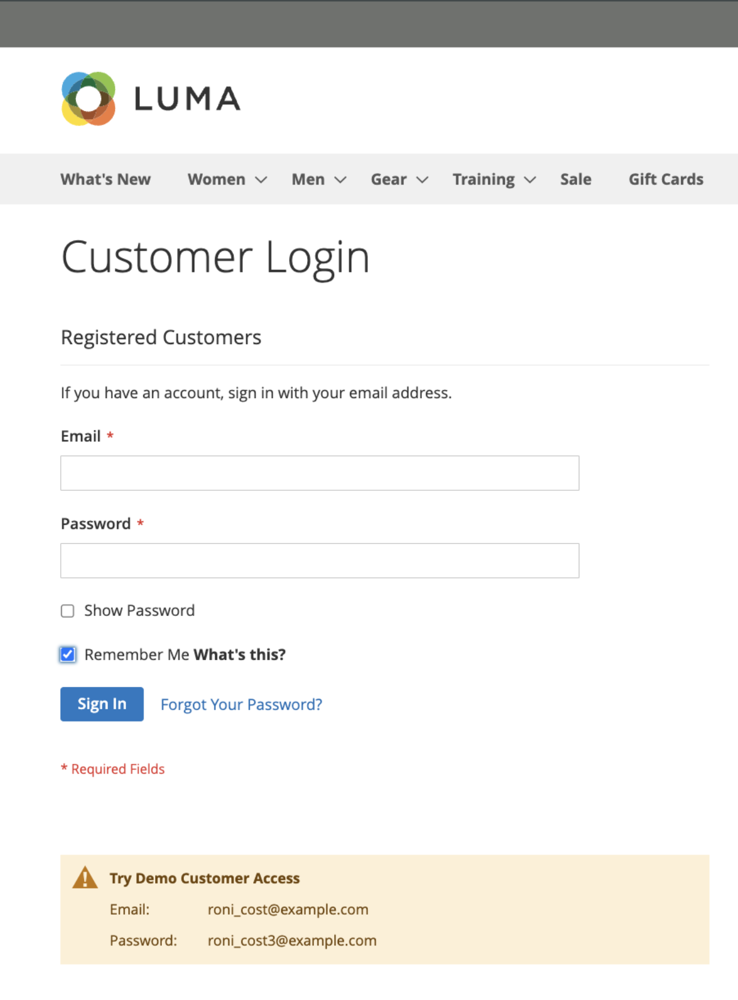

# persistentie van winkelwagentjes

Een hardnekkig winkelwagentje slaat een verwijzing naar de rekening van de klant op het huidige apparaat op, die ervoor zorgt dat de inhoud van het winkelwagentje toegankelijk blijft wanneer de aangemelde sessie verloopt.

Als een klant _wordt herinnerd_, blijft de inhoud van hun het winkelwagentje toegankelijk op het huidige apparaat wanneer de het programma geopende zitting verloopt. Nadat de sessie is verlopen, wordt het winkelwagentje van de klant geopend met behulp van de permanente winkelwagentsessie. Als dezelfde klant zich aanmeldt op een ander apparaat of een andere browser en iets toevoegt aan zijn winkelwagentje en vervolgens terugkeert naar het apparaat met een actieve, permanente sessie, wordt het winkelwagentje bijgewerkt met de toegevoegde items.

Een hardnekkig winkelwagentje kan het aantal verlaten winkelwagentjes verminderen en de verkoop verhogen. Het blijvende het winkelwagentje **stelt niet** gevoelige rekeningsinformatie op geen enkel ogenblik bloot.

Om het gebruik van kartpersistentie voor uw plaats of binnen specifieke archiefmeningen te beheren, kunt u [ blijvende het winkelen kar ](#configure-a-persistent-cart) montages vormen. Voor meer informatie over hoe deze montages de verkoopervaring in uw winkelfront beïnvloeden, zie [ het Blijvende werkschema van het karretje ](#persistent-cart-workflow).

>[!NOTE]
>
>De mogelijkheid tot hardnekkig winkelwagentje is alleen beschikbaar voor klanten die zijn geregistreerd en aangemeld. Klanten van gasten kunnen de functie hardnekkig winkelwagentje niet gebruiken.

## Blijvende workflow voor winkelwagentjes

Wanneer het blijvende het winkelwagentje  wordt toegelaten, hangt het werkschema van af:

- De waarden van de instellingen _[!UICONTROL Enable Remember Me]_en_[!UICONTROL Clear Persistence on Log Out]_
- De beslissing van de klant om het selectievakje _[!UICONTROL Remember Me]_in of uit te schakelen
- Wanneer de permanente cookie wordt gewist

Wanneer de klantensessie verloopt, wordt een koppeling `Not Jane Smith?` onder de volgende voorwaarden weergegeven in de paginakoptekst:
- de aangemelde klant heeft de optie _[!UICONTROL Remember Me]_geselecteerd en er wordt een permanente cookie toegepast
- de klant meldt zich af wanneer het systeem is geconfigureerd met _[!UICONTROL Clear Persistence on Sign Out]_ingesteld op `No` .

Het systeem houdt een verslag van de het winkelwagentinhoud op het huidige apparaat, zelfs als de het programma geopende zitting verloopt. Met de koppeling `Not Jane Smith?` kan de klant de blijvende sessie beëindigen en als gast gaan werken, of zich aanmelden als een andere of dezelfde klant.

Als de klant tijdens het aanmelden het selectievakje _[!UICONTROL Remember Me]_heeft ingeschakeld, wordt in uw winkel een aparte, permanente cookie gemaakt en onderhouden. Met dit cookie blijft het winkelwagentje van de klant toegankelijk, zelfs nadat de browser is gesloten of naar een andere site is gegaan en de aangemelde sessie is verlopen.

Als dezelfde klant uw winkel bezoekt met meerdere browsers terwijl hij zich heeft aangemeld of als een permanente sessie actief is, worden de wijzigingen die de klant aanbrengt in de inhoud van het winkelwagentje in één browser weerspiegeld in andere browsers wanneer de pagina wordt vernieuwd.

>[!NOTE]
>
>Om ervoor te zorgen dat de kartsynchronisatie op meerdere apparaten of browsers plaatsvindt, moeten klanten zich aanmelden op elk nieuw apparaat dat ze gebruiken voor winkelen. Voor aangemelde klanten wordt de inhoud van het winkelwagentje gesynchroniseerd op meerdere apparaten en browsers zolang ze zijn aangemeld onder dezelfde account, ongeacht de configuratie voor continue winkelwagentjes.

### Functie van het selectievakje Onthouden

Klanten kunnen het selectievakje _[!UICONTROL Remember Me]_inschakelen op de aanmeldingspagina, de verificatiepop-up, inloggen bij uitchecken of bij het maken van een nieuwe account om de inhoud van het winkelwagentje toegankelijk te houden op het huidige apparaat wanneer de aanmeldingssessie verloopt.

| Herinner me? | Resultaat |
| ------------ |  ------ |
| Geselecteerd | Maakt een permanente cookie en zorgt ervoor dat de inhoud van de winkelwagentje toegankelijk blijft op het huidige apparaat wanneer de aanmeldingssessie van de klant verloopt. |
| Niet geselecteerd | Er wordt geen permanente cookie gemaakt en de inhoud van het winkelwagentje blijft op het huidige apparaat beschikbaar wanneer de aanmeldingssessie verloopt. De inhoud van het winkelwagentje wordt nog steeds opgeslagen in de account van de klant en de volgende keer dat de klant zich aanmeldt, opnieuw geladen. |

{style="table-layout:auto"}

{width="600" zoomable="yes"}
{width="600" zoomable="yes"}
{width="600" zoomable="yes"}

### Persistentie bij afmelden wissen, gedrag

Wanneer de klant het programma opent of met _registreert me_ geselecteerde optie onthoudt, bepaalt de configuratie van _Duidelijke persistentie op Ondertekenen uit_ optie het Persistente gedrag van de Kar.

|  | Persistentie bij afmelden wissen ingesteld op Ja | Persistentie bij afmelden wissen ingesteld op Nee |
| ------ | ------ | ------ |
| _Onthouden_ klantenlogout | Verwijdert zowel sessie- als permanente cookies, zodat de inhoud van het winkelwagentje op het huidige apparaat verdwijnt totdat dezelfde klant zich weer aanmeldt. | Verwijdert de sessiecookie maar de permanente cookie blijft van kracht. De inhoud van het winkelwagentje blijft toegankelijk op het huidige apparaat. |
| _Onthouden_ klant meldt niet uit maar het zittingskoekje verloopt | De permanente cookie blijft van kracht en de inhoud van het winkelwagentje is toegankelijk vanaf het huidige apparaat. | De permanente cookie blijft van kracht en de inhoud van het winkelwagentje is toegankelijk vanaf het huidige apparaat. |

### Een voorbeeld van een open sessie op een gedeelde computer

Jane voltooit haar vakantie die als a _wordt winkelen Onthouden_ het programma geopende klant. Ze voegt een cadeautje voor John toe aan haar kar en iets voor haar moeder. Daarna gaat ze naar de keuken voor een snack en haar aanmeldsessie verloopt.

John zit op de computer om snel te winkelen terwijl Jane in de keuken is. Zonder de koppeling `Not Jane Smith?` boven aan de pagina te zien, vindt John een leuk cadeau voor Jane en voegt het toe aan de winkelwagen. Wanneer hij uitcheckt, merkt hij op dat de verzend- en factureringsadressen vooraf zijn ingevuld en denkt dat hij is aangemeld. John is in zulk een haast dat hij niet de extra punten tijdens _Overzicht van de Orde_ opmerkt, en legt de orde voor. Jane&#39;s winkelwagen is nu leeg en John heeft alle geschenken gekocht.

## Een blijvende poort configureren

Tijdens de opstelling van een blijvend winkelwagentje, kunt u de levensduur van de koekjes specificeren, en welke opties u voor diverse klantenactiviteiten ter beschikking wilt stellen.

Als u het hardnekkige winkelwagentje wilt gebruiken, moet de browser van de klant zo zijn ingesteld dat cookies zijn toegestaan. Er worden twee soorten cookies gebruikt voor winkelwagentjes:

- **koekje van de Zitting** - een kortetermijnzittingskoekje bestaat tijdens één enkel bezoek aan uw plaats. Dit cookie verloopt wanneer de klant zich afmeldt of wanneer de sessie verloopt.

- **het Aanhoudende Koekje** - een langdurige, blijvende koekje blijft bestaan na het het programma geopende zittingseind. Dit cookie zorgt ervoor dat de inhoud van het winkelwagentje van een klant toegankelijk blijft wanneer de klant zich afmeldt of de sessie verloopt.

Voor meer informatie over hoe deze configuratiemontages het klantenwerkschema beïnvloeden, zie [ het Blijvende werkschema van het karretje ](#persistent-cart-workflow).

{{$include /help/_includes/persistent-cart-configuration.md}}

<!-- Last updated from includes: 2024-10-31 10:02:14 -->
