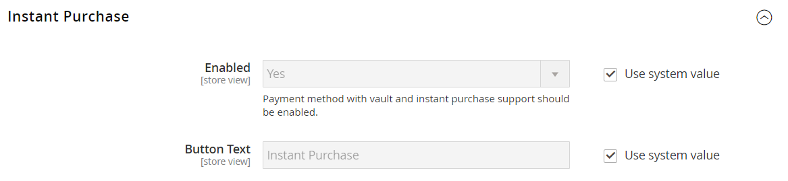

# Direct aanschaffen

_Direct aanschaffen_ kunnen klanten het afrekenen versnellen met behulp van informatie die in hun account is opgeslagen. Als deze optie is ingeschakeld, wordt _Direct aanschaffen_ wordt onder de knop _Toevoegen aan winkelwagentje_ op de productpagina voor klanten die aan de vereisten voldoen.

{width="700" zoomable="yes"}

## Klantvereisten

- Klant is [aangemeld](../customers/customer-sign-in.md) op hun rekening.

- Klantenaccount heeft een [standaardfacturering en -verzendadres](../customers/account-dashboard-address-book.md).

- Ten minste één [verzendmethode](delivery.md) is beschikbaar voor het land dat is opgegeven in het standaardverzendadres.

- Klantenaccount heeft een [opgeslagen betaling](../stores-purchase/stored-payment-methods.md) methode met vault ingeschakeld.

  De volgende betalingsmethoden kunnen worden gebruikt om beveiligde toegang tot opgeslagen creditcardgegevens te bieden:

   - [Kredietkaarten voor Braintreeën](braintree.md) (Directe aankoop kan niet worden gebruikt met creditcards voor Braintreeën als 3D Secure is ingeschakeld.)
   - [Braintree met PayPal ingeschakeld](braintree.md)
   - [PayPal Payflow Pro](paypal-payflow-pro.md)

## Directe aankoop op de winkel

1. In de winkel gaat de klant naar de productpagina van het aan te schaffen object.

1. Hiermee selecteert u de vereiste opties en klikt u **[!UICONTROL Instant Purchase]**.

   {width="500" zoomable="yes"}

1. Hiermee controleert u de **[!UICONTROL Instant Purchase Confirmation]** informatie en klikken **[!UICONTROL OK]** om de transactie te voltooien.

   Boven aan de productpagina worden een bevestigingsbericht en een bestelnummer weergegeven.

## Directe aankoop configureren

### Stap 1: Open de configuratiepagina

1. Op de _Beheerder_ zijbalk, ga naar **[!UICONTROL Stores]** > _[!UICONTROL Settings]_>**[!UICONTROL Configuration]**.

### Stap 2: De vault van de betalingsmethode configureren

U kunt Direct kopen met Braintree of Betalingsservices gebruiken voor Adobe Commerce en Magento Open Source. Vaulting moet zijn ingeschakeld voordat een winkelier de functie Onmiddellijk kopen kan gebruiken.

Leer hoe u de betalingsmethode configureert en het valideren van Braintree- of betalingsservices inschakelt:

- [Braintree](braintree.md)
- [Documentatie betalingsservices](https://experienceleague.adobe.com/docs/commerce-merchant-services/payment-services/guide-overview.html)

### Stap 3: Directe aankoop inschakelen

1. In het linkerdeelvenster onder het dialoogvenster _[!UICONTROL Sales]_sectie, kiest u **[!UICONTROL Sales]**.

1. Uitbreiden  de **[!UICONTROL Instant Purchase]** sectie.

1. Als deze wijziging geldt voor een specifieke winkelweergave, [kiezen in de winkelweergave](../configuration-reference/scope-change.md#set-the-scope) waar de configuratie van toepassing is.

   Klik op **[!UICONTROL OK]** om door te gaan.

1. Set **[!UICONTROL Enabled]** tot `Yes`.

1. Voer de **[!UICONTROL Button Text]** die u op de knop wilt weergeven.

   De knoptekst kan voor elke winkelweergave of taal worden gewijzigd. Standaard is de knoptekst `Instant Purchase`.

   {width="600" zoomable="yes"}

   Voor een gedetailleerde beschrijving van elk van deze configuratiemontages, zie [Direct aanschaffen](../configuration-reference/sales/sales.md#instant-purchase) in de _Referentiehandleiding voor configuratie_.

1. Klik op **[!UICONTROL Save Config]**.

1. Klik wanneer u wordt gevraagd de cache bij te werken op **[!UICONTROL Cache Management]** in het systeembericht en volg de instructies om de cache leeg te maken.
