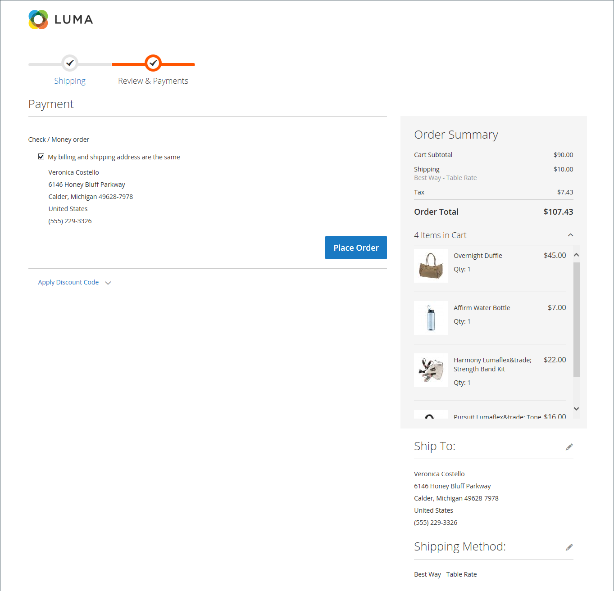

# Afhandelingsproces en opties

Wanneer het uitcheckproces begint, verschuift de transactie naar een veilig, gecodeerd kanaal. Er verschijnt een hangslotsymbool op de adresbalk van de browser en de URL verandert van `http` tot `https`.

## Proces

Het doel voor het afrekenen is de informatie te verzamelen noodzakelijk om de transactie te voltooien. De _Afhandeling_ pagina leidt de klant door elke stap van het proces. Klanten die zijn aangemeld bij hun accounts kunnen de afhandeling snel voltooien, omdat veel van de gegevens al in hun accounts staan. Klanten die zijn gekoppeld aan een bedrijfsaccount dat kooporders gebruikt, hebben een iets andere workflow.

### Verzending

De eerste stap van het afrekenproces is dat de klant de verzendadresgegevens invult en de verzendmethode kiest. Als de klant een account heeft, wordt het verzendadres automatisch ingevoerd, maar kan het indien nodig worden gewijzigd.

 (Alleen Adobe Commerce) Het formaat van het adres van de straat voor de ontvanger en de verzender wordt bepaald door de eigenschappen van de [adreskenmerk van klant](../customers/address-attributes.md). De instelling voor invoervalidatie bepaalt de geldige tekens die in een verzendadres kunnen worden gebruikt.

De voortgangsbalk boven aan de pagina volgt elke stap van het uitcheckproces en het overzicht van de volgorde toont aan dat de informatie die u tot nu toe hebt ingevoerd.

{width="600" zoomable="yes"}

#### Naar een ander adres verzenden

1. Als er extra ingangen in het adresboek zijn, vindt de klant het adres waar de orde moet worden verscheept.

1. Klik op het adres om het te selecteren **[!UICONTROL Ship Here]**.

#### Een adres toevoegen

1. Onder aan het dialoogvenster _[!UICONTROL Shipping Address]_sectie, klikt de klant **[!UICONTROL + New Address]**.

1. Hiermee voltooit u het _[!UICONTROL Shipping Address]_formulier.

   Standaard worden de voor- en achternaam van de klant in eerste instantie in het formulier weergegeven.

   {width="600" zoomable="yes"}

1. Om het nieuwe adres in het adresboek te bewaren, selecteert de klant checkbox bij de bodem van de vorm.

1. Klikken **[!UICONTROL Save Address]**.

   Het nieuwe adres is nu geselecteerd als het verzendadres.

   {width="600" zoomable="yes"}

#### Kies de verzendmethode

1. In de lijst van [verzending](delivery.md) methoden, kiest de klant de optie die hij of zij wil gebruiken.

   {width="600" zoomable="yes"}

1. Klikken **[!UICONTROL Next]** om door te gaan.

### Controle en betalingen - Regelmatige bestelling

Tijdens de tweede stap van het uitcheckproces kiest de klant [betalingsmethode](payments.md)en past coupons met promotiecodes toe op de aankoop. Alle informatie kan worden gecontroleerd en indien nodig worden bewerkt. Indien ingeschakeld, moet de klant akkoord gaan met de verkoopvoorwaarden voordat de bestelling wordt geplaatst.

>[!NOTE]
>
>Hoewel Commerce het configureren van meerdere couponcodes toestaat, kan een klant slechts één couponcode op de kaart toepassen. (Zie de [Couponcodes](../merchandising-promotions/price-rules-cart-coupon.md) voor meer informatie .)

{width="700" zoomable="yes"}

### Controle en betalingen - Inkooporder

 (Alleen beschikbaar bij Adobe Commerce B2B)

Wanneer een klant met een bedrijf wordt geassocieerd dat heeft toegelaten [inkooporders](../b2b/purchase-order-flow.md), worden alle orders verwerkt als kooporders. De beschikbare betalingsmethoden worden bepaald door de instellingen van de bedrijfsaccount.

1. De klant selecteert een betalingsmethode.

   Wanneer u de opdracht _Betaling op rekening_ de [!UICONTROL Custom Reference Number] kan worden gebruikt om naar een factuurnummer te verwijzen.

1. De klant klikt **[!UICONTROL Place Purchase Order]**.

   De kooporder wordt geplaatst.

Indien de onderneming is opgericht [goedkeuringsregels](../b2b/account-dashboard-approval-rules.md)Het inkooporderformulier wordt door het goedkeuringsproces doorlopen. Anders wordt het onmiddellijk verwerkt.

{width="700" zoomable="yes"}

### Aantal items dat wordt weergegeven in het orderoverzicht

Gebruikers van Admin kunnen het maximumaantal items dat bij het uitchecken in het orderoverzicht wordt weergegeven, wijzigen om de weergave met minder producten te stroomlijnen. Deze waarde is standaard ingesteld op 10.

{width="700" zoomable="yes"}

1. Op de _Beheerder_ zijbalk, ga naar **[!UICONTROL Stores]** > _[!UICONTROL Settings]_>**[!UICONTROL Configuration]**.

1. Vouw in het linkerdeelvenster uit **[!UICONTROL Sales]** en kiest u **[!UICONTROL Checkout]**.

1. Uitbreiden  de **[!UICONTROL Checkout Options]** sectie.

1. Voor **[!UICONTROL Maximum Number of Items to Display in Order Summary]**, voert u het maximum aantal items in dat moet worden weergegeven.

1. Klik op **[!UICONTROL Save Config]**.

   Met deze update is het tijdens het afrekenen weergegeven overzicht van de bestelling beperkt tot het opgegeven aantal items.

### Bevestiging van bestelling

De bevestiging van de bestelling wordt weergegeven nadat de bestelling is geplaatst. Voor geregistreerde klanten bevat de pagina het ordernummer met een koppeling naar de account van de klant en een koppeling om een ontvangstbewijs te genereren. Geregistreerde klanten wordt verteld dat ze per e-mail informatie over het bevestigen en volgen van bestellingen moeten ontvangen. Gasten worden aangeraden een account te maken om de bestelling te volgen. Geregistreerde klanten kunnen een ontvangstbewijs produceren door een verbinding te klikken.

De pagina voor bevestiging van de bestelling wordt ook wel de _Succes_ en wordt gebruikt door analyseprogramma&#39;s om conversies bij te houden.

{width="700" zoomable="yes"}

## Opties voor uitchecken

De opties voor uitchecken bepalen verschillende kenmerken voor de uitcheckpagina, waaronder de lay-out. Er zijn opties die u kunt configureren om beperkingen op het afrekenen te plaatsen, waaronder het toestaan van uitchecken door gasten en het afdwingen van een overeenkomst met voorwaarden. Er zijn ook opties voor het beheren van de weergave van informatie tijdens het uitrekenen.

{width="700" zoomable="yes"}

Voor een gedetailleerde beschrijving van elk van deze configuratiemontages, zie [Afhandelingsopties](../configuration-reference/sales/checkout.md#checkout-options) in de _Referentiehandleiding voor configuratie_.

### De opties voor uitchecken wijzigen

1. Op de _Beheerder_ zijbalk, ga naar **[!UICONTROL Stores]** > _[!UICONTROL Settings]_>**[!UICONTROL Configuration]**.
1. Vouw in het linkerdeelvenster uit **[!UICONTROL Sales]** en kiest u **[!UICONTROL Checkout]**.
1. Stel de volgende opties naar wens in.
1. Klik op **[!UICONTROL Save Config]**.

1. Uitbreiden  de **[!UICONTROL Checkout Options]** sectie.

1. Als de instellingen voor een specifieke opslagweergave zijn, [kiezen in de winkelweergave](../configuration-reference/scope-change.md#set-the-scope) waar de configuratie van toepassing is.

   Klik op **[!UICONTROL OK]** om door te gaan.

1. Stel de uitcheckopties in.

1. Klik op **[!UICONTROL Save Config]**.

### Beschikbare opties voor uitchecken

| Veld | [Toepassingsgebied](../getting-started/websites-stores-views.md#scope-settings) | Beschrijving |
|--- |--- |--- |
| [!UICONTROL Enable Onepage Checkout] | Winkelweergave | Hiermee wordt bepaald of [Afhandeling van één pagina](checkout-one-page.md) Dit is de standaardindeling voor uitchecken. Opties: Ja/Nee |
| [!UICONTROL Allow Guest Checkout] | Winkelweergave | Hiermee wordt bepaald of gasten door kunnen gaan [afrekenen zonder registratie](checkout-guest.md) voor een account bij je winkel. Opties: `Yes` / `No` |
| [!UICONTROL Enable Terms and Conditions] | Winkelweergave | Hiermee bepaalt u of klanten akkoord moeten gaan met de [Voorwaarden en bepalingen](terms-and-conditions.md) van de verkoop voordat een aankoop wordt gedaan. Opties: `Yes` / `No` |
| [!UICONTROL Display Billing Address On] | Winkelweergave | Hiermee bepaalt u de locatie van het factuuradres tijdens het afrekenen. Opties: `Payment Method` / `Payment Page` |
| [!UICONTROL Maximum Number of Items to Display in Order Summary] | Winkelweergave | Hiermee bepaalt u het maximumaantal items dat tijdens het uitchecken in het overzicht van de volgorde kan worden weergegeven. De standaardwaarde is `10`. |
| [!UICONTROL Enable Address Search] | Website |  (Alleen Adobe Commerce) Hiermee wordt bepaald of klanten deze functie kunnen gebruiken [adreszoekopdracht](checkout-address-search.md) functionaliteit voor _Verzending_ en de _Reviseren en betalen_ stappen. Wanneer deze functie is ingeschakeld, gebruikt u de opdracht _[!UICONTROL Number of Customer Addresses Limit]_om het aantal opgeslagen adressen in te stellen dat vereist is om deze functie te activeren tijdens het uitchecken. Opties: `Yes` / `No` |
| [!UICONTROL Number of Customer Addresses Limit] | Website |  (Alleen Adobe Commerce) Wanneer het adres wordt gezocht **[!UICONTROL Enabled]**, bepaalt het aantal opgeslagen adressen dat is vereist om deze functie te activeren tijdens het uitchecken. Wanneer het aantal opgeslagen adressen van de klant aan dit aantal of overschrijdt, slechts wordt het standaardadres teruggegeven op _Verzending_ en _Reviseren en betalen_ stappen. De klant kan een zoekfunctie gebruiken om het geselecteerde adres te wijzigen. De standaardwaarde is 10. |

{style="table-layout:auto"}
