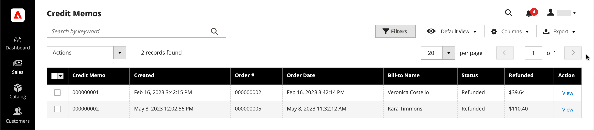

# Creditmemo&#39;s

A _creditmemo_ is een document dat het bedrag toont dat de klant voor een volledige of gedeeltelijke terugbetaling verschuldigd is. Het bedrag kan op een aankoop worden toegepast of aan de klant worden terugbetaald. U kunt een creditnota voor één enkele orde, of voor veelvoudige orden als partij drukken. Voordat een creditnota kan worden afgedrukt, moet deze eerst voor de bestelling worden gegenereerd. De _Memo&#39;s van het Krediet_ pagina maakt een lijst van de kredietmemo&#39;s die aan klanten zijn uitgegeven.

{width="700" zoomable="yes"}

## Restitutiemethode

De [&#x200B; betalingsmethode &#x200B;](payments.md) voor de orde bepaalt, in zekere mate, de methode waardoor u een orde terugbetaalt.

U kunt bestellingen op drie manieren terugbetalen:

- Creditering account - Betalingen met een creditrekening kunnen worden terugbetaald als een creditering van de rekening:
   -  (Adobe Commerce slechts) [&#x200B; Krediet van de Opslag &#x200B;](../customers/store-credit-using.md)
   -  (Beschikbaar met Adobe Commerce B2B) [&#x200B; Betaling op Rekening &#x200B;](../b2b/enable-basic-features.md#configure-payment-on-account) (off-line methode)
   -  (Beschikbaar met Adobe Commerce B2B) [&#x200B; Bedrijfskrediet &#x200B;](../b2b/credit-company.md)
- [&#x200B; Online terugbetaling &#x200B;](payments.md#online-payment-methods) - de Orders die door creditcard door een betaalgateway, zoals PayPal of Braintree worden betaald, worden online teruggegeven via de betalingsbewerker.
- [&#x200B; Off-line teruggave &#x200B;](payments.md#offline-payment-methods) - Orders die door Geld op Levering ([&#x200B; CZV &#x200B;](cash-on-delivery.md)) of door [&#x200B; controle of postorde &#x200B;](check-money-order.md) worden betaald offline terugbetaald.

U kunt voor elke betalingsmethode een offlinerestitutie of een creditering van de account (indien ingeschakeld) uitgeven.

Een orde die door Geld op Levering ([&#x200B; CZV &#x200B;](cash-on-delivery.md)) of door [&#x200B; controle of postorde &#x200B;](check-money-order.md) werd betaald wordt offline teruggegeven.

## Terugbetalingsworkflow

1. **de actie van de Betaling** - als de [&#x200B; configuratie van de Actie van de Betaling &#x200B;](credit-memo-create.md#payment-action-setting) aan `Authorize` wordt geplaatst, moet u een factuur produceren alvorens een krediet memo-te creëren te gaan aan stap 2. Indien ingesteld op `Authorize and Capture` , is al een factuur gegenereerd. Ga verder met stap 3.

1. **produceer factuur** - [&#x200B; creeer een factuur &#x200B;](invoices.md#create-an-invoice) voor de orde, zodat u een terugbetaling naar de klant via creditnota kunt verzenden.

1. **creeer creditnota** - [&#x200B; geef een creditnota &#x200B;](credit-memo-create.md) in Admin voor a [&#x200B; kredietaankoop &#x200B;](credit-memo-create.md#issue-a-refund-for-a-credit-purchase) uit, of a [&#x200B; controle of geldorde &#x200B;](credit-memo-create.md#issue-an-offline-refund-for-check-or-money-order).

## Kolombeschrijvingen

| Kolom | Beschrijving |
|--- |--- |
| [!UICONTROL Select] | Schakel de selectievakjes in voor de onderdelen van het creditnota die aan een handeling moeten worden onderworpen, of gebruik het selectiegereedschap in de kolomkop. Opties: `Select All` / `Deselect All` |
| [!UICONTROL Credit Memo] | Een unieke numerieke id die wordt toegewezen wanneer een aanvraag voor een creditnota wordt ingediend. |
| [!UICONTROL Created] | De datum en het tijdstip waarop de koper de aanvraag voor een creditcard voor het eerst heeft ingediend. |
| [!UICONTROL Order#] | Order-id van de bestelling waarvan de producten worden geretourneerd. |
| [!UICONTROL Order Date] | De datum en het tijdstip waarop de koper een bestelling heeft geplaatst. |
| [!UICONTROL Bill-to Name] | De naam van de persoon die verantwoordelijk is voor de betaling van de beschikking. |
| [!UICONTROL Status] | Geeft de huidige status van een aanvraag voor een creditcard aan. |
| [!UICONTROL Refunded] | Het totale bedrag dat van de orde wordt terugbetaald. |
| [!UICONTROL Actions] | **[!UICONTROL View]** - Hiermee opent u het verzoek om een creditnota en houdt u een overzicht bij van de onderhandelingen tussen koper en verkoper. |
| [!UICONTROL Order Status] | Hiermee wordt de status van de volgorde aangegeven. |
| [!UICONTROL Purchased From] | Geeft de website-, opslag- en opslagweergave aan waarin de volgorde is geplaatst. |
| [!UICONTROL Billing Address] | Het factureringsadres van de klant die de orde plaatste. |
| [!UICONTROL Shipping Address] | Het adres waar de bestelling moet worden verzonden. |
| [!UICONTROL Customer Name] | De voornaam en achternaam van de klant die de bestelling heeft geplaatst. |
| [!UICONTROL Email] | Het e-mailadres van de persoon die de bestelling heeft geplaatst. |
| [!UICONTROL Customer Group] | De klantengroep waaraan de klant wordt toegewezen. |
| [!UICONTROL Payment Method] | De wijze van betaling die voor de betaling moet worden gebruikt. |
| [!UICONTROL Shipping Information] | De methode die moet worden gebruikt om de bestelling te verzenden. |
| [!UICONTROL Subtotal] | Het subtotaal van de bestelling, zonder verzending en belasting. |
| [!UICONTROL Shipping & Handling] | Het bedrag dat in rekening wordt gebracht voor verzending. |
| [!UICONTROL Adjustment Refund] | Het bedrag dat wordt opgeteld bij het totale bedrag dat wordt terugbetaald als extra restitutie. |
| [!UICONTROL Adjustment Fee] | Het bedrag dat wordt afgetrokken van het totale terugbetaalde bedrag. |
| [!UICONTROL Grand Total] | Het totaal van de bestelling. |

{style="table-layout:auto"}
