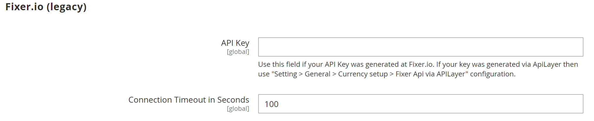

# Valutaconfiguratie

Voordat u afzonderlijke valutakoersen gaat instellen, moet u eerst de reikwijdte van het [basisvaluta](../configuration-reference/general/currency-setup.md). De waarde is standaard ingesteld op globaal, waarbij de instelling voor de basisvaluta wordt toegepast op de gehele waarde [opslaghiërarchie](../getting-started/websites-stores-views.md). Als u een Adobe Commerce- of Magento Open Source-installatie met meerdere sites hebt, kunt u meerdere basisvaluta&#39;s beheren door het bereik in te stellen op websiteniveau.

U geeft ook de valuta&#39;s op die u accepteert en de valuta die u wilt gebruiken voor de weergave van [prijzen](../catalog/catalog-price-scope.md) in uw winkel. In het volgende diagram wordt het bereik van de basisvaluta ingesteld op websiteniveau, zodat elke website een andere basisvaluta kan hebben.

{width="600" zoomable="yes"}

## Stap 1: Kies de geaccepteerde valuta&#39;s

1. Op de _Beheerder_ zijbalk, ga naar **[!UICONTROL Stores]** > _[!UICONTROL Settings]_>**[!UICONTROL Configuration]**.

1. In de linkerbovenhoek, plaats **[!UICONTROL Scope]** op de archiefmening waar de configuratie van toepassing is.

1. In het linkerdeelvenster onder _Algemeen_, kiest u **[!UICONTROL Currency Setup]**.

1. Uitbreiden  de **[!UICONTROL Currency Options]** en stelt u de volgende opties in:

   - **[!UICONTROL Base Currency]** — Instellen op de primaire valuta die u gebruikt voor online transacties.

   - **[!UICONTROL Default Display Currency]** — Instellen op de valuta die u gebruikt om de prijsstelling in de winkelweergave weer te geven.

   - **[!UICONTROL Allowed Currencies]** — Selecteer alle valuta&#39;s die je als betaling accepteert in de winkelweergave. Selecteer ook de primaire valuta.

     Houd voor meerdere valuta&#39;s de Ctrl-toets (PC) of de Command-toets (Mac) ingedrukt en klik op elke optie.

   {width="600" zoomable="yes"}

   Voor een gedetailleerde beschrijving van elk van deze configuratiemontages, zie [Valuta-opties](../configuration-reference/general/currency-setup.md) in de _Referentiehandleiding voor configuratie_.

1. Klik wanneer u wordt gevraagd de cache te vernieuwen op _Sluiten_ (  ) in de rechterbovenhoek van het systeembericht.

   U kunt [cache vernieuwen](../systems/cache-management.md) later.

1. Bepaal de reikwijdte van de basisvaluta:

   - Vouw in het linkerdeelvenster uit **[!UICONTROL Catalog]** en kiest u **[!UICONTROL Catalog]** onder.

   - Omlaag schuiven en uitbreiden  de **[!UICONTROL Price]** sectie. (Deze sectie wordt alleen weergegeven als het bereik is ingesteld als **[!UICONTROL Store View:]** _Standaardconfiguratie_.)

   - Set **[!UICONTROL Catalog Price Scope]** hetzij `Global` of `Website`.

   {width="600" zoomable="yes"}

## Stap 2: De importverbinding configureren

1. Blader naar de bovenkant van de pagina.

1. Vouw in het linkerdeelvenster uit **[!UICONTROL General]** en kiest u **[!UICONTROL Currency Setup]**.

1. Configureer uw verbinding met de valutaservice:

   Er zijn drie serviceopties: _[!UICONTROL Fixer.io (legacy)]_,_[!UICONTROL Fixer Api (APILayer)]_, en _[!UICONTROL Currency Converter API]_

   >[!IMPORTANT]
   >
   >Vanaf de release van 2.4.6 kunt u [[!DNL Fixer.io]](https://fixer.io/) service is vervangen door de [[!DNL Fixer API] (APILayer)](https://apilayer.com/marketplace/fixer-api) service. Het wordt ten zeerste aanbevolen om een APILayer-account te gebruiken in plaats van een vervangen account [!DNL Fixer.io] account.

   - _Als u verbinding wilt maken met de [fixer.io-service](https://fixer.io/):_

      - Uitbreiden  de **[!UICONTROL Fixer.io]** sectie.

      - Voer uw fixer.io in **[!UICONTROL API key]**.

      - Voor **[!UICONTROL Connection Timeout in Seconds]**, ga het aantal seconden van inactiviteit in om toe te staan alvorens de verbindingstijden uit.

     {width="600" zoomable="yes"}

   - _Als u verbinding wilt maken met de [[!DNL Fixer Api (APILayer)] service](https://apilayer.com/):_

      - Uitbreiden  de **[!UICONTROL Fixer Api (APILayer)]** sectie.

      - Voer uw [!DNL APILayer] **[!UICONTROL API key]**.

      - Voor **[!UICONTROL Connection Timeout in Seconds]**, ga het aantal seconden van inactiviteit in om toe te staan alvorens de verbindingstijden uit.

     {width="600" zoomable="yes"}

   - _Als u verbinding wilt maken met de [[!DNL Currency Convertor API] service](https://free.currencyconverterapi.com/):_

      - Uitbreiden  de **[!UICONTROL Currency Convertor API]** sectie.

      - Voer uw valutaconvertor in **[!UICONTROL API key]**.

      - Voor **[!UICONTROL Connection Timeout in Seconds]**, ga het aantal seconden van inactiviteit in om toe te staan alvorens de verbindingstijden uit.

     {width="600" zoomable="yes"}

## Stap 3: Configureer de geplande importinstellingen

1. Doorgaan met Valuta-instelling, uitbreiden  de **[!UICONTROL Scheduled Import Settings]** sectie.

   {width="600" zoomable="yes"}

1. Als u de valutakoersen automatisch wilt bijwerken, stelt u **[!UICONTROL Enabled]** tot `Yes`.

1. Stel de update-opties in:

   - **[!UICONTROL Service]** — Instellen op de tariefprovider. De standaardwaarde is `Fixer.io (legacy)`.

   - **[!UICONTROL Start Time]** — Stel dit in op het uur, de minuut en de seconde waarop de tarieven volgens het schema worden bijgewerkt.

   - **[!UICONTROL Frequency]** — Stel een van de volgende opties in om te bepalen hoe vaak de tarieven worden bijgewerkt:

      - `Daily`
      - `Weekly`
      - `Monthly`

   - **[!UICONTROL Error Email Recipient]** — Voer het e-mailadres in van de persoon die een e-mailmelding moet ontvangen als er tijdens het importeren een fout optreedt.

     Als u meerdere e-mailadressen wilt invoeren, scheidt u deze met een komma.

   - **[!UICONTROL Error Email Sender]** — Instellen op [contactpersoon voor winkel](../getting-started/store-details.md#store-email-addresses) die wordt weergegeven als de afzender van de foutmelding.

   - **[!UICONTROL Error Email Template]** — Instellen op de e-mailsjabloon die wordt gebruikt voor de foutmelding.

1. Klik op **[!UICONTROL Save Config]**.

1. Klik op de knop **[!UICONTROL Cache Management]** de ongeldige cache koppelen en vernieuwen.

   {width="600" zoomable="yes"}

## Stap 4: De wisselkoersen bijwerken

De wisselkoersen moeten met de huidige waarden worden bijgewerkt voordat ze in werking treden. [De tarieven bijwerken](currency-update.md) handmatig of automatisch te importeren.

## Stap 5: Valutasymbolen aanpassen (optioneel)

Met behulp van Valutasymbolen kunt u het symbool aanpassen dat is gekoppeld aan elke valuta die als betaling in uw winkel wordt geaccepteerd.

{width="600" zoomable="yes"}

1. Op de _Beheerder_ zijbalk, ga naar **[!UICONTROL Stores]** > _[!UICONTROL Currency]_>**[!UICONTROL Currency Symbols]**.

   Elke valuta die voor je winkel is ingeschakeld, wordt weergegeven in de _[!UICONTROL Currency]_lijst.

1. Wijzig desgewenst de instellingen in de lijst:

   - Voer een aangepast symbool in voor elke valuta die u wilt gebruiken, of selecteer de **[!UICONTROL Use Standard]** selectievakje voor elke valuta.

   - Als u het standaardsymbool wilt overschrijven, schakelt u het _[!UICONTROL Use Standard]_Schakel het selectievakje in en voer het symbool in dat u wilt gebruiken.

   >[!NOTE]
   >
   >Het is niet mogelijk de uitlijning van het valutasymbool van links naar rechts te wijzigen.

1. Klik op **[!UICONTROL Save Currency Symbols]**.

1. Klik op de knop **[!UICONTROL Cache Management]** een koppeling maken en een ongeldige cache vernieuwen.
