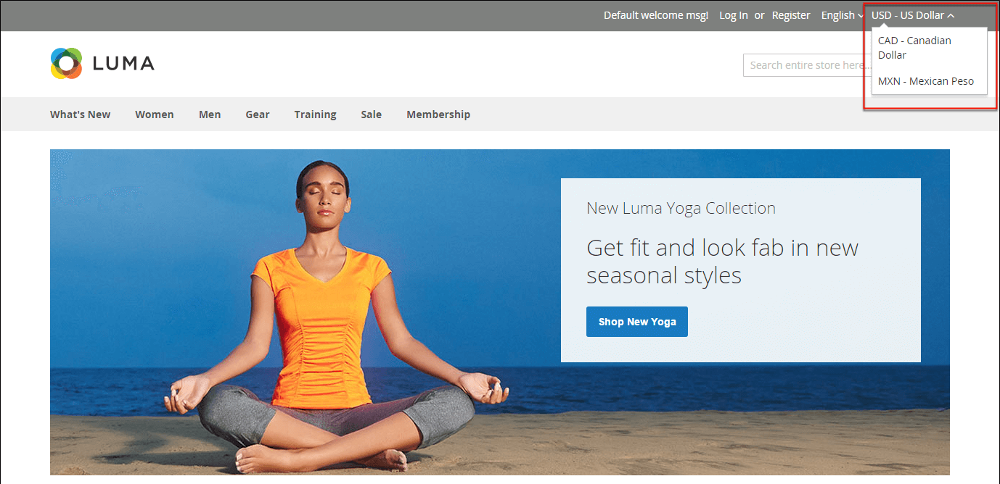

# Valuta

Adobe Commerce geeft je de mogelijkheid om valuta&#39;s te accepteren uit meer dan 200 landen over de hele wereld. Als de winkel meerdere valuta&#39;s ondersteunt, kunt u een _valutaselectie_ verschijnt in de koptekst nadat de valutakoersen zijn [bijgewerkt](currency-update.md).

>[!NOTE]
>
>Als u betaling in meerdere valuta&#39;s accepteert, moet u de instellingen voor de valutakoers in het oog houden, omdat fluctuaties van invloed kunnen zijn op uw winstmarge.

Valutasymbolen worden weergegeven in productprijzen en verkoopdocumenten zoals orders en facturen. U kunt de valutasymbolen naar wens aanpassen en ook de prijsweergave voor elke winkel of weergave afzonderlijk instellen.

{width="700" zoomable="yes"}
