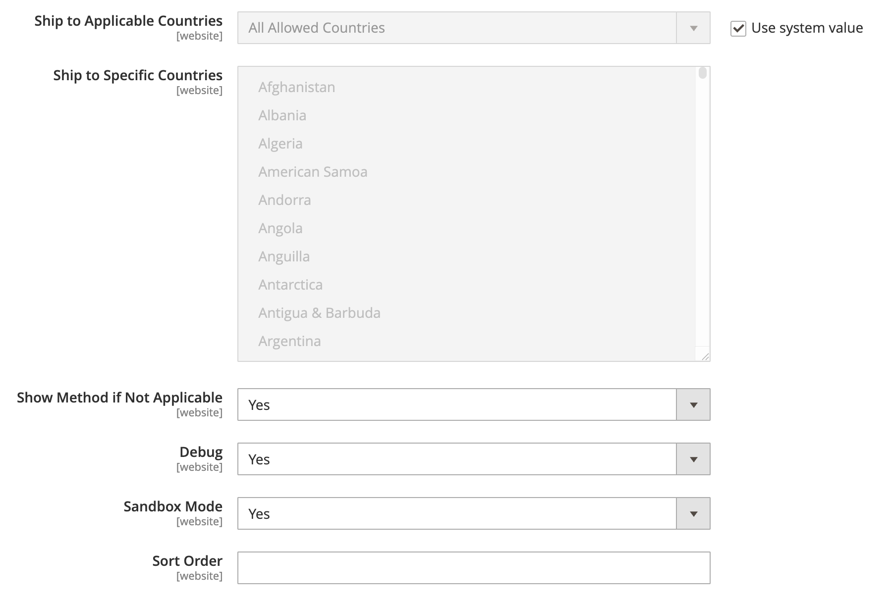

# DHL

DHL biedt geïntegreerde internationale diensten en op maat gesneden, klantgerichte oplossingen voor het beheren en vervoeren van brieven, goederen en informatie.

## Stap 1: DHL inschakelen

1. Voor _Admin_ sidebar, ga **[!UICONTROL Stores]** > _[!UICONTROL Settings]_>**[!UICONTROL Configuration]**.

1. Vouw in het linkerdeelvenster **[!UICONTROL Sales]** uit en kies **[!UICONTROL Delivery Methods]** .

1. Breid  de **[!UICONTROL DHL]** sectie uit.

   >[!NOTE]
   >
   >Schakel indien nodig eerst het selectievakje **[!UICONTROL Use system value]** uit om de volgende instellingen te wijzigen zoals beschreven.

1. Stel **[!UICONTROL Enabled for Checkout]** in op `Yes` .

1. Stel **[!UICONTROL DHL Type]** in op `DHL REST` als u de DHL REST-API gebruikt.

   Als u de DHL XML API gebruikt, stelt u **[!UICONTROL DHL Type]** in op `DHL XML` .

   >[!NOTE]
   >
   >De DHL REST API is de voorkeursmethode voor integratie met DHL. De XML API is afgekeurd en kan in toekomstige versies worden verwijderd.

1. Gebruik de geloofsbrieven die door DHL worden verstrekt om de volgende gebieden te voltooien:

Als u de DHL REST API gebruikt, moet u de volgende geloofsbrieven verstrekken:

    - **[!UICONTROL API KEY]**
    - **[!UICONTROL API SECRET]**

Als u de DHL XML API gebruikt, moet u de volgende geloofsbrieven verstrekken:

    - **[!UICONTROL Access ID]**
    - **[!UICONTROL Password]**
    - **[!UICONTROL Account Number]**

{width="600" zoomable="yes"}

## Stap 2; Voer een pakketbeschrijving in en verpakkingskosten

1. Selecteer in de lijst **[!UICONTROL Content Type]** de optie die het beste het type pakket beschrijft dat u verzendt:

   - `Documents`
   - `Non documents`

1. Configureer de opties voor de behandelingskosten naar wens.

   De afhandelingskosten zijn optioneel en worden als extra kosten aan de DHL-verzendkosten toegevoegd. Voer de volgende handelingen uit als u verpakkingskosten wilt opnemen:

   - Selecteer voor **[!UICONTROL Calculate Handling Fee]** de methode die u wilt gebruiken voor het berekenen van de afhandelingskosten:

      - `Fixed`
      - `Percentage`

   - Selecteer bij **[!UICONTROL Handling Applied]** hoe de verwerkingskosten moeten worden toegepast:

      - `Per Order`
      - `Per Package`

   - Voer voor **[!UICONTROL Handling Fee]** het bedrag in dat moet worden aangerekend, op basis van de methode die u hebt gekozen om het bedrag te berekenen.

     Als de kosten bijvoorbeeld zijn gebaseerd op een vaste vergoeding, voert u het bedrag in als een decimaal, bijvoorbeeld `4.90` . Als de behandelingskosten echter zijn gebaseerd op een percentage van de bestelling, voert u het bedrag in als een percentage. Als u bijvoorbeeld zes procent van de volgorde in rekening brengt, voert u de waarde in als `6` .

   - Stel **[!UICONTROL Divide Order Weight]** in op `Yes` om het totale gewicht van de bestelling op te splitsen voor een juiste berekening van de verzendkosten.

   - Stel de **[!UICONTROL Weight Unit]** van het pakket in op een van de volgende opties:

      - `Pounds`
      - `Kilograms`

   - Stel de **[!UICONTROL Size]** van een doorsnee pakket in op een van de volgende opties:

      - `Regular`
      - `Specific`

     Als u `Specific` kiest, voert u de tekens **[!UICONTROL Height]** , **[!UICONTROL Depth]** en **[!UICONTROL Width]** van het pakket in centimeters in.

   >[!NOTE]
   >
   >Als er geen afmetingen zijn opgegeven, wordt voor elke waarde een minimumwaarde van 3 gebruikt.

   {width="600" zoomable="yes"}

## Stap 3: Toegestane leveringsmethoden opgeven

1. Kies voor **[!UICONTROL Allowed Methods]** elke methode die u beschikbaar wilt maken voor klanten.

   Als u meerdere methoden wilt selecteren, houdt u Ctrl (PC) of Command (Mac) ingedrukt en klikt u op elke optie.

   Om de correcte lijst van leveringsmethodes te tonen, moet u eerst het [ Land van Oorsprong ](../configuration-reference/sales/shipping-settings.md) specificeren.

1. Voer voor **[!UICONTROL Ready Time]** het aantal uren in nadat een bestelling is verzonden dat een pakket klaar is om te worden verzonden.

1. Bewerk de **[!UICONTROL Displayed Error Message]** indien nodig.

   Dit bericht wordt weergegeven wanneer een geselecteerde methode niet beschikbaar is.

1. Als u a [ Vrij Verschepend ](shipping-free.md) optie door DHL wilt verstrekken, plaats de vrije het verschepen opties.

   - Kies bij **[!UICONTROL Free Method]** de methode die u voor gratis verzending wilt gebruiken.

   - Instellen **[!UICONTROL Free Shipping Amount Threshold]** :

     `Enable` - Als je Gratis verzending met Minimumbestelling aanbiedt, voer je de **[!UICONTROL Minimum Order Amount for Free Shipping]** in.

     `Disable` - Geldt geen gratis DHL-verzending voor bestellingen.

     Dit het plaatsen is gelijkaardig aan die voor de standaard _Vrij Verschepende_ methode, maar verschijnt in de sectie van DHL zodat weten de klanten welke methode voor hun orde wordt gebruikt.

   - Voer voor **[!UICONTROL Free Shipping Amount Threshold]** het minimumbedrag in voor een bestelling die in aanmerking komt voor gratis verzending.

     {width="600" zoomable="yes"}

## Stap 4: Specificeer de toepasselijke landen

1. Stel **[!UICONTROL Ship to Applicable Countries]** in op een van de volgende opties:

   - `All Allowed Countries`
   - `Specific Countries`

   Als u objecten naar bepaalde landen verzendt, selecteert u elk land in de lijst **[!UICONTROL Ship to Specific Countries]** .

1. Instellen **[!UICONTROL Show Method if Not Applicable]** :

   `Yes` - Geeft DHL weer als een verzendmethode tijdens het afrekenen, zelfs als dit niet van toepassing is op de bestelling.

   `No` - Geeft DHL alleen als verzendmethode tijdens het uitchecken weer, indien van toepassing.

1. Als u een logbestand wilt maken met de details van DHL-verzendingen die vanuit uw winkel worden gemaakt, stelt u **[!UICONTROL Debug]** in op `Yes` .

1. DHL biedt een optie **[!UICONTROL sandbox mode]** . Als u de sandboxmodus gebruikt, stelt u **[!UICONTROL sandbox mode]** in op `Yes` .
Als u de live modus gebruikt, stelt u **[!UICONTROL sandbox mode]** in op `No` .

   >[!NOTE]
   >
   >De sandboxmodus wordt alleen voor testdoeleinden gebruikt. Het staat u toe om uw integratie met DHL te testen zonder uw levende opslag te beïnvloeden.

1. Voer bij **[!UICONTROL Sort Order]** een getal in om de volgorde te bepalen waarin DHL wordt weergegeven wanneer deze bij andere leveringsmethoden wordt vermeld tijdens het uitchecken.

   `0` = first, `1` = second, `2` = third, enzovoort.

1. Klik op **[!UICONTROL Save Config]** .

   {width="600" zoomable="yes"}
