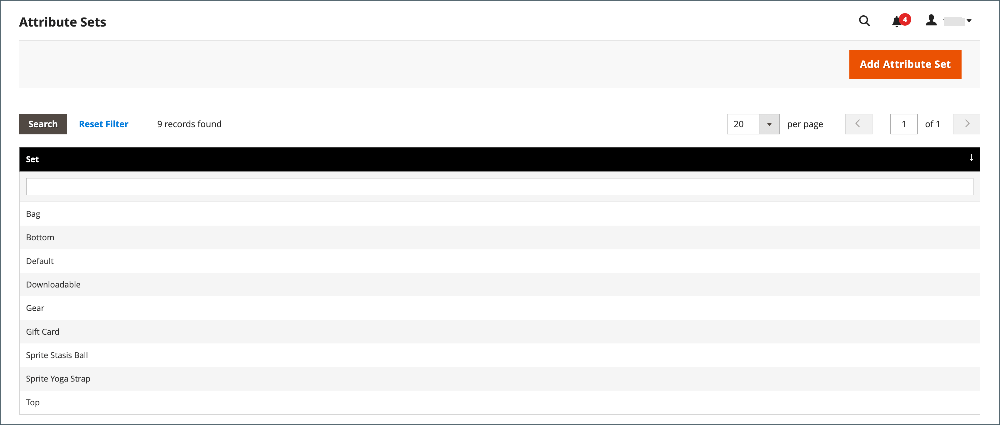

# Vaste productbelasting (FPT)

Sommige belastingjurisdicties hebben een vaste belasting die aan bepaalde soorten producten moet worden toegevoegd. U kunt opstelling a _vaste productbelasting_ (FPT) zoals nodig voor de belastingberekeningen van uw opslag. In sommige landen kan FPT worden gebruikt om een belasting op afgedankte elektrische en elektronische apparatuur (AEEA) in te voeren. Deze belasting is ook genoemd geworden _ecologische belasting_ of _milieubelasting_, en op bepaalde soorten elektronica wordt geïnd om de kosten van recycling te compenseren. Het gaat om een vast bedrag in plaats van om een percentage van de productprijs.

Op basis van het product zijn vaste productbelastingen van toepassing op artikelniveau. In sommige rechtsgebieden is deze belasting onderworpen aan een extra % belastingberekening. Uw belastingjurisdictie zou ook regels kunnen hebben over hoe de productprijs aan klanten, of met of zonder belasting lijkt. Zorg ervoor dat u de regels begrijpt en stel de weergaveopties voor FPT dienovereenkomstig in.

Wees voorzichtig wanneer u FPT-prijzen per e-mail citeert, omdat het prijsverschil het vertrouwen van de klant in hun bestellingen kan beïnvloeden. Als u bijvoorbeeld de prijzen voor het controleren van bestellingen weergeeft zonder FPT te tonen, zien klanten die items kopen met het bijbehorende FPT een totaal dat het FPT-belastingbedrag bevat, maar zonder een gespecificeerde uitsplitsing. Het prijsverschil kan ertoe leiden dat sommige klanten hun winkelwagen verlaten omdat het totaal verschilt van het verwachte bedrag.

## Weergaveprijzen voor FPT

| FPT | Instelling en berekening weergeven | |
|--- |--- |---|
| Niet met Taxed | **[!UICONTROL Excluding FPT]** | FPT wordt weergegeven als een aparte rij in de winkelwagen en de waarde wordt gebruikt in de juiste belastingberekeningen. |
| | **[!UICONTROL Including FPT]** | FPT wordt toegevoegd aan de basisprijs van een post, maar is niet inbegrepen in op belastingregels gebaseerde berekeningen. |
| | **[!UICONTROL Excluding FPT, FPT Description, Final Price]** | Prijzen worden weergegeven zonder FPT-hoeveelheid of -beschrijving. FPT is niet opgenomen in op belastingregels gebaseerde berekeningen. |
| Taxed | **[!UICONTROL Excluding FPT]** | FPT wordt weergegeven als een aparte rij in de winkelwagen en de waarde wordt gebruikt in de juiste belastingberekeningen. |
| | **[!UICONTROL Including FPT]** | FPT is inbegrepen in de prijs van een voorwerp, en geen verandering in belastingberekeningen wordt vereist. |
| | **[!UICONTROL Excluding FPT, FPT Description, Final Price]** | Prijzen worden weergegeven zonder de FPT-hoeveelheid of -beschrijving. FPT is echter opgenomen in berekeningen op basis van belastingregels. |

{style="table-layout:auto"}

## FPT configureren

Het Vaste de inputtype van de Belasting van het Product (FPT)  leidt tot een sectie van gebieden voor het beheren van belasting voor elk gebied.

In de volgende instructies ziet u hoe u een vaste productbelasting voor uw winkel kunt instellen, bijvoorbeeld met &quot;eco-belasting&quot;. Na het bepalen van de draagwijdte voor de belasting en de landen en staten waar de belasting van toepassing is, en afhankelijk van de opties u kiest, kunnen de inputgebieden veranderen volgens de lokale vereisten. Meer leren, zie [ productattributen ](../catalog/attribute-product-create.md) creëren.

### Stap 1: Vaste productbelasting inschakelen

1. Voor _Admin_ sidebar, ga **[!UICONTROL Stores]** > _[!UICONTROL Settings]_>**[!UICONTROL Configuration]**.

1. Vouw in het linkerdeelvenster **[!UICONTROL Sales]** uit en kies **[!UICONTROL Tax]** .

1. Breid  de **[!UICONTROL Fixed Product Taxes]** sectie uit.

1. Stel **[!UICONTROL Enable FPT]** in op `Yes` .

1. Om te bepalen hoe de vaste productbelastingen in archiefprijzen worden gebruikt, verkies het FPT plaatsen voor elk van de volgende plaatsen van de prijsvertoning:

   - **[!UICONTROL Display Prices in Product Lists]**
   - **[!UICONTROL Display Prices on Product View Page]**
   - **[!UICONTROL Display Prices in Sales Modules]**
   - **[!UICONTROL Display Prices in Emails]**

   Opties (dezelfde voor elke):

   - `Including FPT Only`
   - `Including FPT and FPT description`
   - `Excluding FPT. Including FPT description and final price`
   - `Excluding FPT`

1. Stel **[!UICONTROL Apply Tax to FPT]** naar wens in.

1. Stel **[!UICONTROL Include FPT in Subtotal]** naar wens in.

   {width="600" zoomable="yes"}

   Voor een gedetailleerde beschrijving van elk van deze configuratiemontages, zie [ Vaste Belastingen van het Product ](../configuration-reference/sales/tax.md#fixed-product-taxes) in de _Gids van de Verwijzing van de Configuratie_.

1. Klik op **[!UICONTROL Save Config]** als de bewerking is voltooid.

### Stap 2: Een FPT-kenmerk maken

1. Voor _Admin_ sidebar, ga **[!UICONTROL Stores]** > _[!UICONTROL Attributes]_>**[!UICONTROL Product]**.

1. Klik in de rechterbovenhoek op **[!UICONTROL Add New Attribute]** en voer de volgende handelingen uit:

   - Voer bij **[!UICONTROL Default Label]** een label in dat het kenmerk identificeert.

   - Stel **[!UICONTROL Catalog Input for Store Owner]** in op `Fixed Product Tax` .

   {width="600" zoomable="yes"}

1. Breid  de **[!UICONTROL Advanced Attribute Properties]** sectie uit en plaats de bezitsopties:

   - **[!UICONTROL Attribute Code]** - Voer een unieke id in kleine letters in, zonder spaties of speciale tekens. De maximumlengte is 30 tekens. U kunt het veld leeg laten naar de tekst in het veld Standaardlabel.

   - **[!UICONTROL Add to Column Options]** - als u het FPT gebied in de [ lijst van Producten ](../catalog/products-list.md) wilt verschijnen, die aan `Yes` wordt geplaatst.

   - **[!UICONTROL Use in Filter Options]** - als u [ filter ](../getting-started/admin-workspace.md) producten in het net wilt kunnen {zijn dat op de waarde van het FPT gebied wordt gebaseerd, aan `Yes` wordt geplaatst.

   {width="600" zoomable="yes"}

1. (Optioneel) Kies **[!UICONTROL Manage Labels]** in het linkerdeelvenster en voer een label in dat u wilt gebruiken in plaats van het standaardlabel voor elke winkelweergave.

   {width="600" zoomable="yes"}

1. Klik op **[!UICONTROL Save Attribute]** als de bewerking is voltooid.

1. Wanneer ertoe aangezet, vernieuw het [ geheime voorgeheugen ](../systems/cache-management.md).

### Stap 3: Voeg het FPT-kenmerk toe aan een kenmerkset

1. Voor _Admin_ sidebar, ga **[!UICONTROL Stores]** > _[!UICONTROL Attributes]_>**[!UICONTROL Attribute Set]**.

1. Klik in de lijst op het kenmerk dat is ingesteld om de record te openen in de bewerkingsmodus.

   {width="600" zoomable="yes"}

1. Sleep het kenmerk FPT uit de lijst met **[!UICONTROL Unassigned Attributes]** aan de rechterkant naar de lijst met **[!UICONTROL Groups]** in de middelste kolom.

   Elke groepsmap komt overeen met een sectie met productinformatie. U kunt het kenmerk overal plaatsen waar u het wilt weergeven wanneer het product in de bewerkingsmodus is geopend.

   {width="600" zoomable="yes"}

1. Klik op **[!UICONTROL Save]** als de bewerking is voltooid.

1. Herhaal deze stap voor elke kenmerkset die een vaste productbelasting moet bevatten.

### Stap 4: FPT toepassen op specifieke producten

1. Voor _Admin_ sidebar, ga **[!UICONTROL Catalog]** > **[!UICONTROL Products]**.

1. Open het product waarvoor een vaste productbelasting nodig is in de bewerkingsmodus.

1. Zoek de sectie **[!UICONTROL FPT]** met velden die u aan de kenmerkset hebt toegevoegd en klik op **[!UICONTROL Add Tax]** .

1. Geef de toepasselijke belasting voor het product op:

   {width="600" zoomable="yes"}

   - Als uw Commerce-instantie meerdere websites heeft, kiest u de juiste **[!UICONTROL Website]** en basisvaluta. In dit voorbeeld wordt het veld standaard ingesteld op `All Websites [USD]` .

   - Stel **[!UICONTROL Country/State]** in op het gebied waar de vaste productbelasting van toepassing is.

   - Voer bij **[!UICONTROL Tax]** de vaste productbelasting in als een decimaal bedrag.

1. Als u meer vaste productbelastingen wilt toevoegen, klikt u op **[!UICONTROL Add Tax]** en herhaalt u het proces.

1. Klik op **[!UICONTROL Save]** als de bewerking is voltooid.
