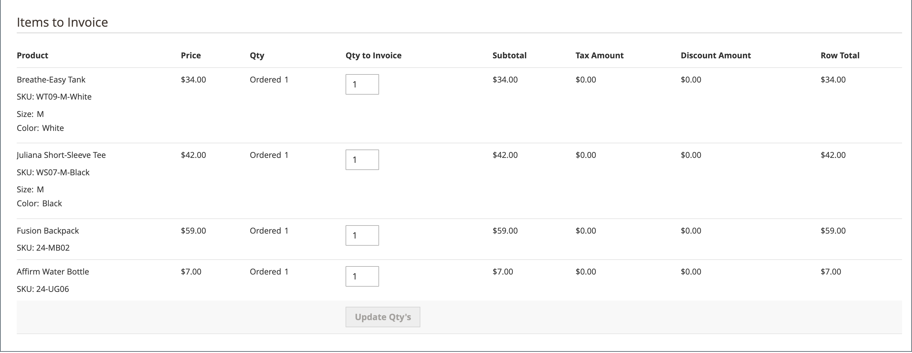

# Facturen

Een factuur is een overzicht van de betalingsgegevens van een bestelling. Meerdere facturen kunnen [gemaakt](#create-an-invoice) voor één bestelling. Elk product kan maximaal of slechts een klein deel van de aangeschafte producten bevatten die u opgeeft. U kunt ook [PDF-facturen klaar voor afdrukken](#print-invoices) als verkoopdocumenten voor uw klanten.

Op de _Beheerder_ zijbalk, ga naar **[!UICONTROL Sales]** > _Bewerkingen_ > **Facturen** om de _Facturen_ en toegang tot uw gemaakte facturen.

{width="700" zoomable="yes"}

## Kolombeschrijvingen

| Kolom | Beschrijving |
|--- |--- |
| [!UICONTROL Select] | Schakel de selectievakjes in voor de aanhalingstekens die aan een handeling moeten worden onderworpen of gebruik het selectiegereedschap in de kolomkop. Opties: `Select All` / `Deselect All` |
| [!UICONTROL Invoice] | Een unieke numerieke id die wordt toegewezen wanneer een factuur wordt verzonden door de beheerder. Wanneer u de factuurdetails weergeeft, wordt dit nummer boven aan de pagina weergegeven in plaats van de naam van het citaat. |
| [!UICONTROL Invoice Date] | De datum en het tijdstip waarop de beheerder de factuur voor het eerst heeft verzonden. |
| [!UICONTROL Order#] | Een unieke numerieke id die wordt toegewezen wanneer een bestelling door een koper wordt geplaatst. Wanneer u de factuurgegevens weergeeft, wordt dit nummer als een koppeling weergegeven in het vak Order &amp; Account Information. |
| [!UICONTROL Order Date] | De datum en tijd waarop de klant een bestelling voor het eerst heeft geplaatst. |
| [!UICONTROL Bill-to Name] | De naam van de persoon die verantwoordelijk is voor de betaling van de beschikking. |
| [!UICONTROL Status] | Geeft de huidige status van een factuur aan. De status kan alleen worden gewijzigd door actie van de koper of de verkoper. |
| [!UICONTROL Grand Total (Base)] | De totale prijs van de te kopen producten. Het totale bedrag wordt weergegeven in de basisvaluta van de website en in de valuta van de opslagplaats. |
| [!UICONTROL Grand Total (purchase)] | Het totaal-generaal aan producten die in de bestelling zijn aangeschaft. Het totale bedrag wordt weergegeven in de basisvaluta van de website en in de valuta van de opslagplaats. |
| [!UICONTROL Purchased From] | De website/winkel/winkel-weergave waaruit de factuur is gemaakt. |
| [!UICONTROL Billing Address] | Het factureringsadres van de klant die de orde plaatste. |
| [!UICONTROL Shipping Address] | Het adres waar de bestelling moet worden verzonden. |
| [!UICONTROL Customer Name] | De voornaam en achternaam van de klant die de factuur ontvangt. |
| [!UICONTROL Email] | Het e-mailadres van de klant die de factuur ontvangt. |
| [!UICONTROL Customer Group] | De klantgroep die is toegewezen aan de klant die de factuur ontvangt. |
| [!UICONTROL Payment Method] | De wijze van betaling die voor de betaling moet worden gebruikt. |
| [!UICONTROL Shipping Information] | De methode die moet worden gebruikt om de bestelling te verzenden. |
| [!UICONTROL Subtotal] | Het subtotaal van de bestelling, zonder verzending en belasting. |
| [!UICONTROL Shipping and Handling] | Het bedrag dat in rekening wordt gebracht voor verzending. |
| [!UICONTROL Action] | **[!UICONTROL View]** - opent de factuur in de bewerkingsmodus. |

{style="table-layout:auto"}

## Een factuur maken

Als u een factuur voor een bestelling maakt, wordt deze verplaatst naar een staat waarin deze niet kan worden geannuleerd of gewijzigd. Een nieuwe factuurpagina ziet er ongeveer hetzelfde uit als een voltooide bestelling, met enkele extra velden. Elke activiteit die verband houdt met een bestelling wordt vermeld in de sectie Opmerkingen van de factuur.

Gewoonlijk worden bestellingen gefactureerd en vastgelegd wanneer het verzendproces start. Als de betalingsmethode een kooporder is of als de [betalingsactie](../configuration-reference/sales/payment-methods.md#payment-actions) is ingesteld op `Authorize and Capture`, wordt de bestelling gefactureerd en wordt de betaling vastgelegd tijdens het afrekenen. U kunt een factuur genereren met een pakbon en ook verzendlabels afdrukken van uw transportaccount. Eén bestelling kan worden opgesplitst in gedeeltelijke overbrengingen, die indien nodig afzonderlijk worden gefactureerd.

Wanneer de status van nieuwe orders is ingesteld op `Processing`, de optie _Alle items automatisch factureren_ beschikbaar wordt in de configuratie. Sommige betalingsmethoden voor creditcards voltooien de factureringsstap als onderdeel van het proces waarbij [betalingsactie](../configuration-reference/sales/payment-methods.md#payment-actions) is ingesteld op `Authorize and Capture`. In dat geval wordt de knop Factuur niet weergegeven en kan de bestelling worden verzonden.

>[!NOTE]
>
>Facturen worden niet automatisch gemaakt voor orders die worden geplaatst met `Gift Card`, `Store Credit`, `Reward Points`of andere methoden voor offlinebetaling.

Er moet een factuur voor de bestelling worden gegenereerd voordat deze kan worden afgedrukt. Als u de PDF wilt weergeven of afdrukken, downloadt en installeert u eerst een PDF-lezer, zoals [Adobe Acrobat Reader][1].

**_Een bestelling factureren:_**

1. Op de _Beheerder_ zijbalk, ga naar **[!UICONTROL Sales]** > _[!UICONTROL Operations]_>**[!UICONTROL Orders]**.

1. Zoek de verkooporder met de status van `Processing` in het raster. Voer vervolgens de volgende handelingen uit:

1. In de _Handeling_ kolom, klik **[!UICONTROL View]**.

1. Kies in de koptekst van de verkooporder de optie **[!UICONTROL Invoice]** -optie.

   >[!NOTE]
   >
   >De _[!UICONTROL Invoice]_Deze optie wordt niet weergegeven als de [betalingsactie](../configuration-reference/sales/payment-methods.md#payment-actions) voor uw [betalingsmethode](../configuration-reference/sales/payment-methods.md) is ingesteld op `Authorize and Capture`, die automatisch een factuur genereert. Dit is ook het geval als de bestelling wordt geplaatst en de betalingsactie voor uw betalingsmethode is ingesteld op `Authorize` en de bestelling wordt gefactureerd.

   {width="700" zoomable="yes"}

   De nieuwe factuurpagina ziet er ongeveer hetzelfde uit als een pagina met voltooide bestellingen, met extra velden die kunnen worden bewerkt.

1. Als de objecten klaar zijn om te worden verzonden, genereert u een pakbon voor de verzending op het moment dat u de factuur maakt:

   - In de _Verzendgegevens_ klikt u op de **[!UICONTROL Create Shipment]** Schakel het selectievakje in om het te selecteren.

     De ladingslijst wordt gecreeerd tezelfdertijd dat de factuur wordt geproduceerd.

   - Een trackingnummer opnemen:

      - Klik op **[!UICONTROL Add Tracking Number]**.
      - Voer de volgende gegevens in: _[!UICONTROL Carrier]_,_[!UICONTROL Title]_, en _[!UICONTROL Number]_

     {width="600" zoomable="yes"}

   - U kunt desgewenst een gedeeltelijke factuur genereren:

      - In de _Factuurobjecten_ sectie, update de **[!UICONTROL Qty to Invoice]** kolom die alleen specifieke objecten op de factuur bevat.
      - Klik vervolgens op **[!UICONTROL Update Qty's]**.

        {width="600" zoomable="yes"}

1. Als voor de bestelling een online betalingsmethode is gebruikt, stelt u **[!UICONTROL Amount]** naar de juiste optie.

1. Ga als volgt te werk om klanten via e-mail op de hoogte te stellen wanneer de factuur wordt gegenereerd:

   - Selecteer de **[!UICONTROL Email Copy of Invoice]** selectievakje.

   - Voer een **[!UICONTROL Invoice Comments]**. Als u de opmerkingen wilt opnemen in de e-mailmelding, markeert u de **[!UICONTROL Append Comments]** selectievakje.

1. Klik op **[!UICONTROL Submit Invoice]** onder aan de pagina.

   **_Online betalingsmethode:_**

   {width="600" zoomable="yes"}

   **_Offline betalingsmethode:_**

   {width="600" zoomable="yes"}

   De status van de bestelling verandert van `Pending` tot `Complete`.

   {width="600" zoomable="yes"}

## Facturen afdrukken

Facturen kunnen afzonderlijk of als een batch worden afgedrukt. Voordat een factuur kan worden afgedrukt, moet deze echter eerst voor de bestelling worden gegenereerd. U kunt een logo met hoge resolutie uploaden voor een PDF-factuur die klaar is voor afdrukken en de [Order-id](../stores-purchase/sales-documents.md#add-reference-ids) in de koptekst. Als u de factuurtemplate wilt aanpassen met uw logo en adres, raadpleegt u [Vereisten voor PDF-logo](../stores-purchase/sales-documents.md#image-formats).

>[!NOTE]
>
>Als u de PDF wilt weergeven of afdrukken, hebt u een PDF-lezer nodig. U kunt downloaden [Adobe Reader][1] zonder kosten.

### Eén factuur afdrukken

1. Op de _Beheerder_ zijbalk, ga naar **[!UICONTROL Sales]** > _[!UICONTROL Operations]_>**[!UICONTROL Invoices]**.

1. In de _[!UICONTROL Invoices]_raster, zoek de factuur en klik op **[!UICONTROL View]**in de_ Handeling _kolom.

1. Klik boven aan de factuur op **[!UICONTROL Print]** om een PDF van de factuur te genereren.

1. Sla de gegenereerde PDF op in een bestand of druk het af.

### Meerdere facturen afdrukken

1. Op de _Beheerder_ zijbalk, ga naar **[!UICONTROL Sales]** > _[!UICONTROL Operations]_>**[!UICONTROL Invoices]**.

1. In de _[!UICONTROL Invoices]_, schakelt u het selectievakje in voor elke factuur die u wilt afdrukken.

1. Stel de **[!UICONTROL Actions]** controle op `PDF Invoices`.

   {width="600" zoomable="yes"}

De facturen worden opgeslagen in één PDF-bestand dat naar een printer kan worden verzonden of dat kan worden opgeslagen.

## Bronnen voor probleemoplossing

Raadpleeg de volgende bronnen voor hulp bij het oplossen van problemen met facturen _Kennisbank handelsondersteuning_ artikelen:

- [Kan bundel virtuele en eenvoudige producten niet factureren](https://experienceleague.adobe.com/docs/commerce-knowledge-base/kb/support-tools/patches/v1-0-9/mdva-30889-magento-patch-can-t-invoice-bundle-products-virtual-and-simple.html)
- [Factuur zonder crediteringsgegevens van winkel](https://experienceleague.adobe.com/docs/commerce-knowledge-base/kb/support-tools/patches/v1-0-8/mdva-31150-magento-patch-invoice-without-store-credit-info.html)
- [Belasting wordt weergegeven op factuur met korting van 100%](https://experienceleague.adobe.com/docs/commerce-knowledge-base/kb/support-tools/patches/v1-0-22/mdva-35773-tax-appears-on-invoice-with-100-discount.html)
- [Facturen bestellen wordt niet automatisch verzonden](https://experienceleague.adobe.com/docs/commerce-knowledge-base/kb/support-tools/patches/v1-0-13/mdva-32545-magento-patch-order-invoices-don-t-send-automatically.html)

[1]: https://www.adobe.com/acrobat/pdf-reader.html "Adobe Reader ophalen"
