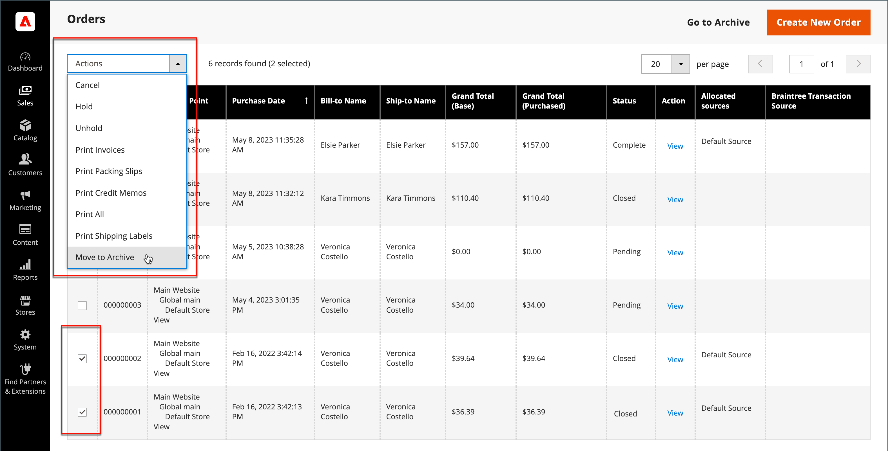

# Bestanden archiveren

{{ee-feature}}

Door bestellingen te archiveren worden de prestaties regelmatig verbeterd en blijft uw werkruimte vrij van overbodige informatie, zodat u zich op het huidige bedrijf kunt concentreren. Facturen, verzendingen en creditnota&#39;s kunnen automatisch of handmatig worden gearchiveerd en op elk gewenst moment worden weergegeven.

>[!NOTE]
>
>De _[!UICONTROL Archive]_in het dialoogvenster [[!UICONTROL Sales] menu](sales-menu.md) alleen wanneer archivering [enabled](../configuration-reference/sales/sales.md).

## Het orderarchief configureren

Uw winkel kan na een bepaald aantal dagen worden geconfigureerd voor het archiveren van bestellingen, facturen, verzendingen en creditnota&#39;s. U kunt bestellingen en de bijbehorende documenten verplaatsen naar het archief of de vorige status ervan herstellen. Gearchiveerde bestellingen worden niet verwijderd en blijven beschikbaar bij de beheerder. Gearchiveerde gegevens kunnen naar een CSV-bestand worden geëxporteerd en in een spreadsheet worden geopend. Als deze optie is ingeschakeld, wordt _Archief_ wordt boven in de werkruimte weergegeven.

1. Op de _Beheerder_ zijbalk, ga naar **[!UICONTROL Stores]** > _[!UICONTROL Settings]_>**[!UICONTROL Configuration]**.

1. Vouw in het linkerdeelvenster de **[!UICONTROL Sales]** en kiest u **[!UICONTROL Sales]** onder.

1. Uitbreiden  de **[!UICONTROL Orders, Invoices, Shipments, Credit Memos Archiving]** sectie.

   {width="600" zoomable="yes"}

1. Set **[!UICONTROL Enable Archiving]** tot `Yes`.

   >[!NOTE]
   >
   >Als u later besluit archivering uit te schakelen, worden alle gearchiveerde bestellingen teruggezet naar de vorige status.

1. Set **[!UICONTROL Archive Orders Purchased]** tot het aantal dagen dat moet worden gewacht voordat voltooide bestellingen worden gearchiveerd.

   Standaard worden bestellingen 30 dagen na de aankoop gearchiveerd.

1. In de **[!UICONTROL Order Statuses to be Archived]** selecteert u elke orderstatus die u wilt gebruiken voor het identificeren van te archiveren bestellingen.

   Als u meerdere items wilt selecteren, houdt u Ctrl (Windows) of Command (Mac) ingedrukt terwijl u op elk item klikt.

1. Klik op **[!UICONTROL Save Config]**.

1. Vernieuw een ongeldige cache als daarom wordt gevraagd.

## Gearchiveerde documenten weergeven

1. In de _[!UICONTROL Sales]_menu onder_[!UICONTROL Archive]_ kiest u een van de volgende opties:

   - **[!UICONTROL Orders]**
   - **[!UICONTROL Invoices]**
   - **[!UICONTROL Shipments]**
   - **[!UICONTROL Credit Memos]**

1. Als u details wilt weergeven, klikt u op een gearchiveerd document in de lijst.

## Een handeling toepassen op een gearchiveerd document

Selecteer elk document dat het doel van de handeling moet zijn en kies een van de volgende opties **[!UICONTROL Actions]**:

- `Cancel`
- `Hold`
- `Unhold`
- `Print`
- `Move to Orders Management`

## Documenten handmatig archiveren

1. Selecteer het type document dat u wilt archiveren als volgt:

   - **[!UICONTROL Orders]**
   - **[!UICONTROL Invoices]**
   - **[!UICONTROL Shipments]**
   - **[!UICONTROL Credit Memos]**

1. Schakel het selectievakje in van elk item dat u wilt archiveren.

1. In de rechterbovenhoek stelt u **[!UICONTROL Actions]** tot `Move to Archive`.

1. Klikken **[!UICONTROL Submit]** de geselecteerde documenten archiveren.

## Gearchiveerde documenten herstellen

1. Kies het type document dat u wilt herstellen.

1. Selecteer documenten met een van de volgende opties:

   - Klik in de linkerbovenhoek op **[!UICONTROL Select Visible]**.

   - Schakel handmatig het selectievakje in van elk document dat u wilt herstellen.

1. Rechtsboven instellen **[!UICONTROL Action]** tot `Move to Orders Management`.

1. Klikken **[!UICONTROL Submit]** om de documenten te herstellen.

## Gearchiveerde documenten exporteren

1. Kies het type document dat u wilt exporteren.

1. In het hoger-juiste menu, plaats **[!UICONTROL Export to:]** op een van de volgende waarden:

   - `CSV`
   - `Excel`

1. Klik op **[!UICONTROL Export]**.

Uw winkel kan na een bepaald aantal dagen worden geconfigureerd voor het archiveren van bestellingen, facturen, verzendingen en creditnota&#39;s. U kunt bestellingen en de bijbehorende documenten verplaatsen naar het archief of de vorige status ervan herstellen. Gearchiveerde bestellingen worden niet verwijderd en blijven beschikbaar bij de beheerder. Gearchiveerde gegevens kunnen naar een CSV-bestand worden geëxporteerd en in een spreadsheet worden geopend. Als deze optie is ingeschakeld, wordt _[!UICONTROL Archive]_wordt boven in de werkruimte weergegeven.

## Handmatig bestellingen archiveren

1. Op de _Beheerder_ zijbalk, ga naar **[!UICONTROL Sales]** > _[!UICONTROL Operations]_>**[!UICONTROL Orders]**.

1. Selecteer het selectievakje in de eerste kolom om de volgorde op het raster te selecteren.

1. Stel de **[!UICONTROL Actions]** controle op `Move to Archive` en zoek het bericht dat de bestelling is gearchiveerd.

   {width="700" zoomable="yes"}

>[!TIP]
>
>Als u een lijst wilt opgeven met orderstatussen die kunnen worden gearchiveerd, raadpleegt u [Het orderarchief configureren](#configure-the-order-archive).

## Een gearchiveerde volgorde weergeven

1. Open de archiefweergave op een van de volgende manieren:

   - In de knopbalk boven de knop _[!UICONTROL Orders]_raster, klikken **[!UICONTROL Go to Archive]**.

   - Op de _Beheerder_ zijbalk, ga naar **[!UICONTROL Sales]** > _[!UICONTROL Archive]_>**[!UICONTROL Orders]**.

   >[!NOTE]
   >
   >Net als de pagina Bestellingen is de titel van de gearchiveerde orderpagina _[!UICONTROL Orders]_. Het enige merkbare verschil is de optie in de knopbalk om_[!UICONTROL Return to Orders Management]_. De URL van de pagina geeft ook aan dat u zich in het orderarchief bevindt.

1. In de _Handeling_ kolom, klik **[!UICONTROL View]**.

   {width="600" zoomable="yes"}

## Een gearchiveerde volgorde herstellen

>[!NOTE]
>
>Een orde die van een gearchiveerde orde wordt hersteld wordt opnieuw gearchiveerd volgens het aantal dagen gevormd in [!UICONTROL Archive Orders Purchased] instellen (zie [Het orderarchief configureren](#configure-the-order-archive)). Het aantal dagen wordt berekend op basis van de [!UICONTROL Updated At] datum voor de bestelling, die wordt gewijzigd wanneer de bestelling uit het archief wordt verplaatst.

1. Op de _Beheerder_ zijbalk, ga naar **[!UICONTROL Sales]** > _[!UICONTROL Operations]_>**[!UICONTROL Orders]**.

1. Klik op de knopbalk op **[!UICONTROL Go to Archive]**.

1. Zoek de record die moet worden hersteld en klik op het selectievakje om deze te selecteren.

   {width="600" zoomable="yes"}

1. Stel de **[!UICONTROL Actions]** besturingswaarde voor `Move to Order Management`.

Zoek het bericht dat de gearchiveerde orde uit het archief is verwijderd.

## Gearchiveerde volgorde exporteren

1. Op de _Beheerder_ zijbalk, ga naar **[!UICONTROL Sales]** > _[!UICONTROL Operations]_>**[!UICONTROL Orders]**.

1. Klik in het menu Handeling op **[!UICONTROL Export]** en selecteert u de gewenste indeling.
