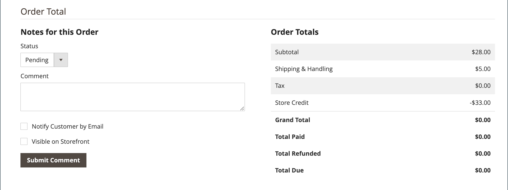

# Workflow en verwerking van bestellingen

Wanneer een klant een bestelling plaatst, wordt een verkooporder gecreeerd als tijdelijk verslag van de transactie. In het net van Orden, hebben de verkooporden aanvankelijk het statuut van &quot;in behandeling,&quot;en kunnen op elk ogenblik worden geannuleerd tot de betaling wordt verwerkt. Nadat de betaling is bevestigd, kan de bestelling worden gefactureerd en verzonden.

**Stap 1: Plaatsvolgorde** - Het afrekenproces begint wanneer de gebruiker klikt. **[!UICONTROL Go to Checkout]** op de winkelwagentje of [retoriek](reorders-allow.md) rechtstreeks vanaf hun klantenaccount.

**Stap 2: bestelling in behandeling** - De status van de oorspronkelijke verkooporder is `Pending`. In dat geval is de betaling niet verwerkt en kan de bestelling nog steeds worden bewerkt of geannuleerd. Deze status treedt op wanneer de betalingsmethode wordt geconfigureerd voor de machtigingsmodus.

**Stap 3: Betaling ontvangen** - De orderstatus verandert in `Processing` wanneer de betaling is ontvangen of geautoriseerd. Afhankelijk van de betalingsmethode ontvangt u mogelijk een melding wanneer de transactie is geautoriseerd of verwerkt. Deze status treedt automatisch op wanneer de betalingsmethode is geconfigureerd voor de modus Vastleggen of Intent Verkoop.

**Stap 4: Factuurvolgorde** - Een bestelling wordt doorgaans gefactureerd nadat de betaling is ontvangen. De betalingsmethode bepaalt welke factureringsopties nodig zijn voor de bestelling. Nadat de factuur is gegenereerd en verzonden, wordt een kopie naar de klant verzonden. Als de betalingsmethode is geconfigureerd met de `capture` of `intent sale` betalingsactie, wordt automatisch een factuur gegenereerd wanneer de betaling wordt geautoriseerd en vastgelegd.

>[!NOTE]
>
>Facturen worden niet automatisch gemaakt voor orders die worden geplaatst met `Gift Card`, `Store Credit`, `Reward Points`of andere methoden voor offlinebetaling.

**Stap 5: één verzending boeken** - De orderstatus verandert in `Complete` wanneer de verzendgegevens volledig zijn, wordt de zending geboekt en wordt de verzending ingesteld. Aan de verzendverplichting is voldaan met een afgedrukte pakbon en een verzendlabel of het _Melding voorbereiden voor afhalen_ is geselecteerd (in-store leveringsmethode). De klant ontvangt een melding en het pakket wordt verzonden. Als trackingnummers worden gebruikt, kan de verzending worden bijgehouden vanaf de account van de klant.

>[!NOTE]
>
>Voor meer informatie over de status van de bestelling en de configuratieopties voor de betalingsmethode raadpleegt u [Status van bestelling](order-status.md) en [Betalingen](payments.md).

## Een bestelling weergeven

1. Op de _Beheerder_ zijbalk, ga naar **[!UICONTROL Sales]** > _[!UICONTROL Operations]_>**[!UICONTROL Orders]**.

1. Zoek de volgorde in het raster.

1. In de _[!UICONTROL Action]_kolom, klik **[!UICONTROL View]**.

1. Status van bestelling controleren:

   - A `Pending` bestelling kan worden gewijzigd, opgeschort, geannuleerd of gefactureerd en verzonden.

   - A `Processing` bestelling kan niet meer ingrijpend worden bewerkt of geannuleerd, maar het factuuradres en het verzendadres kunnen worden bewerkt.

   - A `Completed` de volgorde kan worden gewijzigd.

Het e-mailadres van de klant kan op elk gewenst moment in de workflow worden bewerkt door de klant te bewerken. Het e-mailbericht kan niet worden bewerkt als de bestelling door een gast is geplaatst.

Het linkerdeelvenster voor een open volgorde biedt toegang tot verschillende typen informatie die betrekking hebben op de volgorde.

{width="700" zoomable="yes"}

## Een bestelling verwerken

Wanneer een klant een bestelling plaatst, wordt een verkooporder gecreeerd als tijdelijk verslag van de transactie. De verkooporder heeft een status van `Pending` totdat de betaling is ontvangen. Tijdens het aanmelden `Pending` status, kunnen bestellingen worden bewerkt of geannuleerd tot het moment waarop de betaling wordt ontvangen en een factuur wordt gegenereerd. Een gemakkelijke manier om het te bedenken is dat bestellingen facturen worden en facturen overbrengingen. In het raster Orden worden alle bestellingen weergegeven, ongeacht de locatie van de bestellingen in de workflow. Ga voor meer informatie over hoe u klanten met een bestelling kunt helpen [Een bestelling bijwerken](order-update.md).

{width="700" zoomable="yes"}

Als u een `Pending` bestellen, klikt u op **[!UICONTROL Edit]** in de rechterbovenhoek.

>[!NOTE]
>
>Bestellingen kunnen alleen worden bewerkt als u zich `Pending` status. De knop Bewerken is niet zichtbaar voor orders met een andere status of voor orders die zijn gebaseerd op een [onderhandelde offerte](../b2b/quotes.md).

{width="600" zoomable="yes"}

Bekijk de volgende secties in de verkooporder en gebruik de veldbeschrijvingen ter referentie.

### Weergavebeschrijvingen voor bestellingen

| Tab | Beschrijving |
|--- |--- |
| [!UICONTROL Information] | Geef gedetailleerde informatie weer over de bestelling en de account, waaronder het factuuradres en het verzendadres, de betalings- en leveringsmethoden, de bestellingen, de totalen en de notities. |
| [!UICONTROL Invoices] | Vermeldt elke factuur die aan de bestelling is gekoppeld. |
| [!UICONTROL Credit Memos] | Vermeldt elke creditmemo die aan de bestelling is gekoppeld. |
| [!UICONTROL Shipments] | Vermeldt elke ladingsverslag die met de orde wordt geassocieerd. |
| [!UICONTROL Comments History] | Hiermee worden alle notities weergegeven die betrekking hebben op de volgorde. |

{style="table-layout:auto"}

>[!NOTE]
>
>Een Admin-gebruiker moet **[!UICONTROL Sales / Archive]** [machtigingen](../systems/permissions-user-roles.md) voor hun rolbereik: _Facturen_, _Creditnota&#39;s_, en _Overbrengingen_ tabbladen bestellen.

### Knopbalk

| Knop | Beschrijving |
|--- |--- |
| **[!UICONTROL Back]** | Hiermee gaat u terug naar de pagina Bestellingen zonder wijzigingen op te slaan. |
| **[!UICONTROL Cancel]** | Hiermee annuleert u de verkooporder. |
| **[!UICONTROL Send Email]** | Stuur een e-mail over de bestelling naar de klant. |
| **[!UICONTROL Hold]** / **[!UICONTROL Unhold]** | Hiermee wijzigt u de status van de verkooporder in `On Hold`. Om de greep op de verkooporde vrij te geven, verkies **[!UICONTROL Unhold]**. |
| **[!UICONTROL Invoice]** | Maakt een factuur van de verkooporder door de bestelling om te zetten in een factuur. |
| **[!UICONTROL Ship]** | Hiermee maakt u een verzendrecord voor de bestelling. |
| **[!UICONTROL Notify Order is Ready for Pickup]** | Wordt alleen weergegeven wanneer een bestelling als een in-store-levering wordt geplaatst. Meldt aan de klant dat de bestelling klaar is om te worden opgehaald. |
| **[!UICONTROL Reorder]** | Hiermee maakt u een verkooporder op basis van de huidige bestelling. |
| **[!UICONTROL Edit]** | Hiermee wordt een volgorde geopend die in behandeling is in de bewerkingsmodus. De knop Bewerken is niet zichtbaar voor bestellingen met de status `Processing`, of orders die zijn gebaseerd op onderhandelde koersen. |

{style="table-layout:auto"}

### Een bestelling annuleren

U kunt [cancel](order-update.md) orders die nog niet zijn gefactureerd. A [creditnota](credit-memos.md) moet worden uitgegeven als een klant een bestelling wil annuleren nadat deze is gefactureerd (betaling wordt vastgelegd).

Als een bestelling `Pending` of `Processing` en de betaling niet wordt vastgelegd of niet volledig wordt vastgelegd, kunt u [de volgorde te laten vervallen](#void-an-order) in plaats van het te annuleren.

Als u een geannuleerde volgorde wilt herstellen, klikt u op de knop **[!UICONTROL Reorder]** en er wordt een nieuwe volgorde gemaakt met de status `Pending`.

>[!NOTE]
>
>Als u een bestelling annuleert, resulteert dit ook in een &#39;void&#39;, maar het annuleren van een bestelling leidt niet tot annulering.

### Een bestelling wissen

Alleen verkooporders die niet zijn gefactureerd, hebben de status `Processing`en [betalingsintegratie-instelling `Authorize`](../configuration-reference/sales/payment-methods.md#payment-actions)kan [gezind](order-update.md#void-a-processing-order). Nadat u een bestelling hebt verwijderd, kunt u deze annuleren.

### [!UICONTROL Order and Account Information]

{width="600" zoomable="yes"}

#### Ordergegevens

| Veld | Beschrijving |
|--- |--- |
| [!UICONTROL Order Number] | Het ordernummer wordt boven aan de verkooporder weergegeven, gevolgd door een opmerking die aangeeft of het bevestigingsbericht is verzonden. |
| [!UICONTROL Order Date] | De datum en tijd waarop de bestelling is geplaatst. |
| [!UICONTROL Purchased From] | Geeft de website-, opslag- en opslagweergave aan waarin de volgorde is geplaatst. |
| [!UICONTROL Placed from IP] | Wijst op het IP adres van de computer waarvan de orde werd geplaatst. |
| [!UICONTROL Order Placed from Quote] |  (Beschikbaar bij B2B voor Adobe Commerce) Hiermee wordt de [citeren](../b2b/quotes.md) van waaruit de order is gegenereerd, indien van toepassing. De naam van het citaat is verbonden met het citaat. |

{style="table-layout:auto"}

#### Accountgegevens

| Veld | Beschrijving |
|--- |--- |
| [!UICONTROL Customer Name] | De naam van de klant of koper die de bestelling heeft geplaatst. De naam van de klant is gekoppeld aan het profiel van de klant. |
| [!UICONTROL Email] | Het e-mailadres van de klant of koper. Het e-mailadres is gekoppeld aan een nieuw e-mailbericht. |
| [!UICONTROL Customer Group] | De naam van de klantengroep of gedeelde catalogus waaraan de klant is toegewezen. |
| [!UICONTROL Company Name] |  (Beschikbaar bij B2B voor Adobe Commerce) De naam van de onderneming waarbij de koper is aangesloten en namens wie de order wordt geplaatst. De bedrijfsnaam is gekoppeld aan de [bedrijfsprofiel](../b2b/account-companies.md). |

{style="table-layout:auto"}

### [!UICONTROL Address Information]

{width="600" zoomable="yes"}

| Veld | Beschrijving |
|--- |--- |
| [!UICONTROL Billing Address] | De naam van de klant of de koper die de bestelling heeft geplaatst, gevolgd door het factuuradres, het telefoonnummer en [BTW](vat.md), indien van toepassing. Het telefoonnummer is gekoppeld aan een autowijzerplaat op een mobiel apparaat. |
| [!UICONTROL Shipping Address] | De naam van de persoon onder wiens aandacht de bestelling moet worden verzonden, gevolgd door het verzendadres en telefoonnummer. Het telefoonnummer is gekoppeld aan een autowijzerplaat op een mobiel apparaat. |

{style="table-layout:auto"}

### [!UICONTROL Payment & Shipping Method]

{width="600" zoomable="yes"}

| Veld | Beschrijving |
|--- |--- |
| [!UICONTROL Payment Information] | De wijze van betaling die voor de order moet worden gebruikt, en het inkoopordernummer, indien van toepassing, gevolgd door de valuta die voor de order is gebruikt. Als het bedrijfskrediet van de bestelling wordt afgeschreven met behulp van [Betaling op rekening](../b2b/enable-basic-features.md#configure-payment-on-account), wordt het op de rekening in rekening gebrachte bedrag vermeld. |
| [!UICONTROL Shipping & Handling Information] | De te gebruiken verzendmethode en eventuele verpakkingskosten. |

{style="table-layout:auto"}

### Geordende items controleren

{width="600" zoomable="yes"}

In de **[!UICONTROL Order Total]** Ga als volgt te werk:

1. Voer een **[!UICONTROL Comment]** in de volgorde op te nemen.

1. Als u de opmerking per e-mail aan de klant wilt verzenden, selecteert u de optie **[!UICONTROL Notify Customer by Email]** selectievakje.

1. Als u de opmerking wilt weergeven in de klantenaccount, selecteert u de optie **[!UICONTROL Visible on Storefront]** selectievakje.

   {width="600" zoomable="yes"}

1. Als u klaar bent om de bestelling te factureren, klikt u op **[!UICONTROL Invoice]** en volgt u de instructies op [een factuur maken](invoices.md#create-an-invoice).

#### [!UICONTROL Items Ordered]

| Veld | Beschrijving |
|--- |--- |
| [!UICONTROL Product] | De productnaam, SKU en opties, indien van toepassing. |
| [!UICONTROL Item Status] | Geeft de status van het item aan. Waarde: `Ordered` |
| [!UICONTROL Original Price] | De oorspronkelijke catalogusprijs van het object vóór kortingen. |
| [!UICONTROL Price] | De aankoopprijs van het object. Deze waarde geeft alle kortingen weer die op het item uit de gedeelde catalogus zijn toegepast, indien van toepassing. |
| [!UICONTROL Qty] | De bestelde hoeveelheid. |
| [!UICONTROL Subtotal] | Het subtotaal is de aankoopprijs vermenigvuldigd met de hoeveelheid. |
| [!UICONTROL Tax Amount] | Het bedrag aan belasting dat op het punt als decimale waarde van toepassing is. |
| [!UICONTROL Tax Percent] | Het percentage van de belasting dat op dit object wordt toegepast als een percentage. |
| [!UICONTROL Discount Amount] | De korting die op dit object van toepassing is. De disconteringswaarde is nul als de orde op een citaat gebaseerd is. |
| [!UICONTROL Row Total] | Het totaal van de posten, inclusief de toepasselijke belastingen die op productniveau verschuldigd zijn, minus kortingen. |

{style="table-layout:auto"}

#### [!UICONTROL Notes for this Order]

| Veld | Beschrijving |
|--- |--- |
| [!UICONTROL Status] | Geeft de status van de verkooporder weer. |
| [!UICONTROL Comment] | Een tekstvak dat wordt gebruikt om een opmerking in te voeren bij de klant die de bestelling vergezelt.  **[!UICONTROL Notify Customer by Email]**- Schakel het selectievakje in als u de opmerking als aparte e-mail naar de klant wilt sturen. **[!UICONTROL Visible on Storefront]** - Schakel het selectievakje in als u wilt dat de opmerking zichtbaar is vanaf het account van de klant.  **[!UICONTROL Submit Comment]**- Verzendt de opmerking en verzendt deze, indien van toepassing, per e-mail. |

{style="table-layout:auto"}

#### [!UICONTROL Order Totals]

| Veld | Beschrijving |
|--- |--- |
| [!UICONTROL Shipping & Handling] | Het bedrag dat in rekening wordt gebracht voor verzendkosten. |
| [!UICONTROL Tax] | Het bedrag van de belasting die op de order wordt toegepast, indien van toepassing. |
| [!UICONTROL Grand Total] | Het totaal van de bestelling. |
| [!UICONTROL Total Paid] | Het totale bedrag dat naar de bestelling is betaald, indien van toepassing. |
| [!UICONTROL Total Refunded] | Het totale bedrag dat van de bestelling is terugbetaald, indien van toepassing. |
| [!UICONTROL Total Due] | Het totale verschuldigde bedrag. |
| [!UICONTROL Store Credit] |  (Alleen Adobe Commerce) Het bedrag van het beschikbare winkelkrediet dat op de bestelling wordt toegepast, indien van toepassing. |
| [!UICONTROL Catalog Total Price] |  (Beschikbaar bij B2B voor Adobe Commerce) De totale prijs van de items in het citaat zonder belasting, afhankelijk van de prijsstelling in de gedeelde catalogus of de standaardcatalogus die als basis voor het citaat wordt gebruikt. Als de weergavevaluta van de winkel verschilt van de basisvaluta, wordt de waarde in beide valuta&#39;s weergegeven, met de storefront tussen vierkante haken. |
| [!UICONTROL Negotiated Discount] |  (Beschikbaar bij B2B voor Adobe Commerce) De korting die het resultaat is van een prijsopgave waarover tussen koper en verkoper is onderhandeld. Als de weergavevaluta van de winkel verschilt van de basisvaluta, wordt de waarde in beide valuta&#39;s weergegeven, met de storefront tussen vierkante haken. |
| [!UICONTROL Subtotal] |  (Beschikbaar bij B2B voor Adobe Commerce) De totale catalogusprijs minus de overeengekomen korting. |

{style="table-layout:auto"}

## Bestelverwerkingsdemo

Bekijk deze video en meer informatie over de verwerking en status van bestellingen:

>[!VIDEO](https://video.tv.adobe.com/v/343935/?quality=12)
