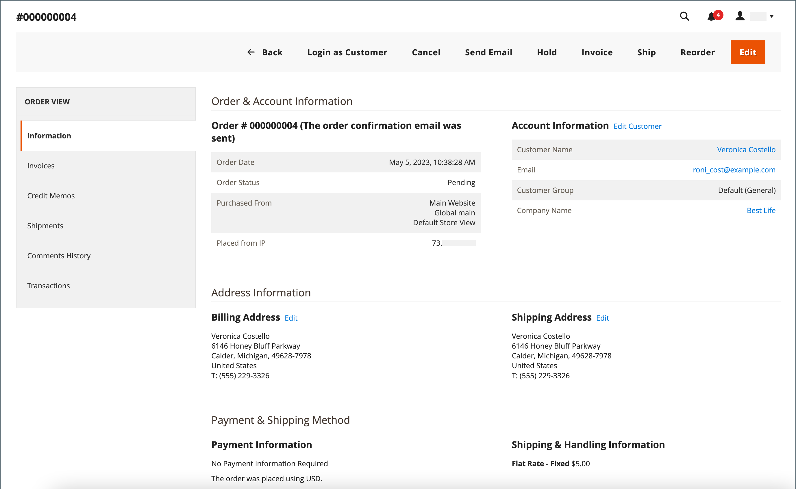

# Workflow en verwerking van bestellingen

Wanneer een klant een bestelling plaatst, wordt een verkooporder gecreeerd als tijdelijk verslag van de transactie. In het net van Orden, hebben de verkooporden aanvankelijk het statuut van &quot;in behandeling,&quot;en kunnen op elk ogenblik worden geannuleerd tot de betaling wordt verwerkt. Nadat de betaling is bevestigd, kan de bestelling worden gefactureerd en verzonden.

**Stap 1: De Orde van de Plaats** - het controleproces begint wanneer de verkoopster **[!UICONTROL Go to Checkout]** op de het winkelen kartpagina klikt of [ reorders ](reorders-allow.md) direct van hun klantenrekening.

**Stap 2: De orde in afwachting van** - de aanvankelijke status van de verkooporde is `Pending`. In dat geval is de betaling niet verwerkt en kan de bestelling nog steeds worden bewerkt of geannuleerd. Deze status treedt op wanneer de betalingsmethode wordt geconfigureerd voor de machtigingsmodus.

**Stap 3: Ontvang Betaling** - de ordestatus verandert in `Processing` wanneer de betaling wordt ontvangen of geautoriseerd. Afhankelijk van de betalingsmethode ontvangt u mogelijk een melding wanneer de transactie is geautoriseerd of verwerkt. Deze status treedt automatisch op wanneer de betalingsmethode is geconfigureerd voor de modus Vastleggen of Intent Verkoop.

**Stap 4: Factuurvolgorde** - een orde wordt typisch gefactureerd nadat de betaling wordt ontvangen. De betalingsmethode bepaalt welke factureringsopties nodig zijn voor de bestelling. Nadat de factuur is gegenereerd en verzonden, wordt een kopie naar de klant verzonden. Als de betalingsmethode is geconfigureerd met de `capture` - of `intent sale` -betalingsactie, wordt automatisch een factuur gegenereerd wanneer de betaling wordt geautoriseerd en vastgelegd.

>[!NOTE]
>
>Facturen worden niet automatisch gemaakt voor orders die worden geplaatst met `Gift Card` , `Store Credit` , `Reward Points` of andere methoden voor offlinebetalingen.

**Stap 5: Boek Één enkele Verzending** - de veranderingen van de ordestatus in `Complete` wanneer het ladingsdetail volledig is, wordt de verzending geboekt, en de verschepen wordt geplaatst. Het verschepende vereiste wordt voldaan aan een gedrukte pakbon en het verschepen etiket of _deelt Klaar voor Behalen_ wordt geselecteerd (in-store leveringsmethode). De klant ontvangt een melding en het pakket wordt verzonden. Als trackingnummers worden gebruikt, kan de verzending worden bijgehouden vanaf de account van de klant.

>[!NOTE]
>
>Voor details over de status van de orde en de configuratieopties van de betalingsmethode, zie [ status van de Orde ](order-status.md) en [ Betalingen ](payments.md).

## Een bestelling weergeven

1. Voor _Admin_ sidebar, ga **[!UICONTROL Sales]** > _[!UICONTROL Operations]_>**[!UICONTROL Orders]**.

1. Zoek de volgorde in het raster.

1. Klik in de kolom _[!UICONTROL Action]_op **[!UICONTROL View]**.

1. Status van bestelling controleren:

   - Een bestelling `Pending` kan worden gewijzigd, opgeschort, geannuleerd of gefactureerd en verzonden.

   - Een bestelling van `Processing` kan niet meer ingrijpend worden bewerkt of geannuleerd, maar het factuuradres en het verzendadres kunnen worden bewerkt.

   - Een `Completed` -volgorde kan opnieuw worden geordend.

Het e-mailadres van de klant kan op elk gewenst moment in de workflow worden bewerkt door de klant te bewerken. Het e-mailbericht kan niet worden bewerkt als de bestelling door een gast is geplaatst.

Het linkerdeelvenster voor een open volgorde biedt toegang tot verschillende typen informatie die betrekking hebben op de volgorde.

{width="700" zoomable="yes"}

## Een bestelling verwerken

Wanneer een klant een bestelling plaatst, wordt een verkooporder gecreeerd als tijdelijk verslag van de transactie. De verkooporder heeft de status `Pending` totdat de betaling is ontvangen. In de `Pending` -status kunnen bestellingen worden bewerkt of geannuleerd tot het moment dat de betaling wordt ontvangen en een factuur wordt gegenereerd. Een gemakkelijke manier om het te bedenken is dat bestellingen facturen worden en facturen overbrengingen. In het raster Orden worden alle bestellingen weergegeven, ongeacht de locatie van de bestellingen in de workflow. Leren hoe te om klanten met een orde te helpen, zie [ een orde ](order-update.md) bijwerken.

{width="700" zoomable="yes"}

Als u een `Pending` -volgorde wilt openen, klikt u op **[!UICONTROL Edit]** in de rechterbovenhoek.

>[!NOTE]
>
>Orders kunnen alleen worden bewerkt als ze de status `Pending` hebben. De Edit knoop is niet zichtbaar voor orden in een verschillende status of voor orden die op a [ besproken citaat ](../b2b/quotes.md) gebaseerd zijn.

{width="600" zoomable="yes"}

Bekijk de volgende secties in de verkooporder en gebruik de veldbeschrijvingen ter referentie.

### Weergavebeschrijvingen voor bestellingen

| Tab | Beschrijving |
|--- |--- |
| [!UICONTROL Information] | Geef gedetailleerde informatie weer over de bestelling en de account, waaronder het factuuradres en het verzendadres, de betalings- en leveringsmethoden, de bestellingen, de totalen en de notities. |
| [!UICONTROL Invoices] | Vermeldt elke factuur die aan de bestelling is gekoppeld. |
| [!UICONTROL Credit Memos] | Vermeldt elke creditmemo die aan de bestelling is gekoppeld. |
| [!UICONTROL Shipments] | Vermeldt elke ladingsverslag die met de orde wordt geassocieerd. |
| [!UICONTROL Comments History] | Hiermee worden alle notities weergegeven die betrekking hebben op de volgorde. |

{style="table-layout:auto"}

>[!NOTE]
>
>Een gebruiker Admin moet **[!UICONTROL Sales / Archive]** [ toestemmingen ](../systems/permissions-user-roles.md) voor hun rolwerkingsgebied hebben om de _Facturen_, _Kredietmemo&#39;s_, en _Verzendingen_ ordetlusjes te zien.

### Knopbalk

| Knop | Beschrijving |
|--- |--- |
| **[!UICONTROL Back]** | Hiermee gaat u terug naar de pagina Bestellingen zonder wijzigingen op te slaan. |
| **[!UICONTROL Cancel]** | Hiermee annuleert u de verkooporder. |
| **[!UICONTROL Send Email]** | Stuur een e-mail over de bestelling naar de klant. |
| **[!UICONTROL Hold]** / **[!UICONTROL Unhold]** | Hiermee wijzigt u de status van de verkooporder in `On Hold` . Kies **[!UICONTROL Unhold]** om de greep op de verkooporder vrij te geven. |
| **[!UICONTROL Invoice]** | Maakt een factuur van de verkooporder door de bestelling om te zetten in een factuur. |
| **[!UICONTROL Ship]** | Hiermee maakt u een verzendrecord voor de bestelling. |
| **[!UICONTROL Notify Order is Ready for Pickup]** | Wordt alleen weergegeven wanneer een bestelling als een in-store-levering wordt geplaatst. Meldt aan de klant dat de bestelling klaar is om te worden opgehaald. |
| **[!UICONTROL Reorder]** | Hiermee maakt u een verkooporder op basis van de huidige bestelling. |
| **[!UICONTROL Edit]** | Hiermee wordt een volgorde geopend die in behandeling is in de bewerkingsmodus. De knop Bewerken is niet zichtbaar voor bestellingen met de status `Processing` of bestellingen die zijn gebaseerd op onderhandelde aanhalingstekens. |

{style="table-layout:auto"}

### Een bestelling annuleren

U kunt [ annuleren ](order-update.md) orden die nog niet worden gefactureerd. A [ creditmemo ](credit-memos.md) moet worden uitgegeven als een klant een orde wil annuleren nadat het wordt gefactureerd (betaling wordt gevangen).

Als een orde `Pending` of `Processing` is en de betaling niet wordt gevangen of niet volledig gevangen, kunt u [ de orde ](#void-an-order) nietig verklaren in plaats van het te annuleren.

Als u een geannuleerde volgorde wilt herstellen, klikt u op de knop **[!UICONTROL Reorder]** en wordt een nieuwe volgorde gemaakt met de status `Pending` .

>[!NOTE]
>
>Als u een bestelling annuleert, resulteert dit ook in een &#39;void&#39;, maar het annuleren van een bestelling leidt niet tot annulering.

### Een bestelling wissen

Slechts verkooporden die niet worden gefactureerd, hebben een status van `Processing`, en a [ betalings integratie het plaatsen van `Authorize`](../configuration-reference/sales/payment-methods.md#payment-actions), kunnen [ ongeldig worden verklaard ](order-update.md#void-a-processing-order). Nadat u een bestelling hebt verwijderd, kunt u deze annuleren.

### [!UICONTROL Order and Account Information]

{width="600" zoomable="yes"}

#### Ordergegevens

| Veld | Beschrijving |
|--- |--- |
| [!UICONTROL Order Number] | Het ordernummer wordt boven aan de verkooporder weergegeven, gevolgd door een opmerking die aangeeft of het bevestigingsbericht is verzonden. |
| [!UICONTROL Order Date] | De datum en tijd waarop de bestelling is geplaatst. |
| [!UICONTROL Purchased From] | Geeft de website-, opslag- en opslagweergave aan waarin de volgorde is geplaatst. |
| [!UICONTROL Placed from IP] | Wijst op het IP adres van de computer waarvan de orde werd geplaatst. |
| [!UICONTROL Order Placed from Quote] |  (Beschikbaar met Adobe Commerce B2B) wijst op het [ citaat ](../b2b/quotes.md) waarvan de orde werd geproduceerd, als toepasselijk. De naam van het citaat is verbonden met het citaat. |

{style="table-layout:auto"}

#### Accountgegevens

| Veld | Beschrijving |
|--- |--- |
| [!UICONTROL Customer Name] | De naam van de klant of koper die de bestelling heeft geplaatst. De naam van de klant is gekoppeld aan het profiel van de klant. |
| [!UICONTROL Email] | Het e-mailadres van de klant of koper. Het e-mailadres is gekoppeld aan een nieuw e-mailbericht. |
| [!UICONTROL Customer Group] | De naam van de klantengroep of gedeelde catalogus waaraan de klant is toegewezen. |
| [!UICONTROL Company Name] |  (Beschikbaar met Adobe Commerce B2B) De naam van het bedrijf waaraan de koper wordt geassocieerd, en namens wie de orde wordt geplaatst. De bedrijfsnaam is verbonden met het [ bedrijfsprofiel ](../b2b/account-companies.md). |

{style="table-layout:auto"}

### [!UICONTROL Address Information]

{width="600" zoomable="yes"}

| Veld | Beschrijving |
|--- |--- |
| [!UICONTROL Billing Address] | De naam van de klant of de koper die de orde plaatste, die door het het factureren adres, telefoonnummer, en [ BTW ](vat.md) wordt gevolgd, als toepasselijk. Het telefoonnummer is gekoppeld aan een autowijzerplaat op een mobiel apparaat. |
| [!UICONTROL Shipping Address] | De naam van de persoon onder wiens aandacht de bestelling moet worden verzonden, gevolgd door het verzendadres en telefoonnummer. Het telefoonnummer is gekoppeld aan een autowijzerplaat op een mobiel apparaat. |

{style="table-layout:auto"}

### [!UICONTROL Payment & Shipping Method]

{width="600" zoomable="yes"}

| Veld | Beschrijving |
|--- |--- |
| [!UICONTROL Payment Information] | De wijze van betaling die voor de order moet worden gebruikt, en het inkoopordernummer, indien van toepassing, gevolgd door de valuta die voor de order is gebruikt. Als de orde aan bedrijfskrediet gebruikend [ Betaling op Rekening ](../b2b/enable-basic-features.md#configure-payment-on-account) in rekening wordt gebracht, wordt het bedrag dat aan de rekening in rekening wordt gebracht vermeld. |
| [!UICONTROL Shipping & Handling Information] | De te gebruiken verzendmethode en eventuele verpakkingskosten. |

{style="table-layout:auto"}

### Geordende items controleren

{width="600" zoomable="yes"}

Ga als volgt te werk in de sectie **[!UICONTROL Order Total]** :

1. Voer een **[!UICONTROL Comment]** in die u in de volgorde wilt opnemen.

1. Als u de opmerking per e-mail naar de klant wilt verzenden, schakelt u het selectievakje **[!UICONTROL Notify Customer by Email]** in.

1. Schakel het selectievakje **[!UICONTROL Visible on Storefront]** in als de opmerking zichtbaar moet zijn in de klantenaccount.

   {width="600" zoomable="yes"}

1. Als u bereid bent om de orde te factureren, klik **[!UICONTROL Invoice]** en volg de instructies om [ een factuur ](invoices.md#create-an-invoice) tot stand te brengen.

#### [!UICONTROL Items Ordered]

| Veld | Beschrijving |
|--- |--- |
| [!UICONTROL Product] | De productnaam, SKU en opties, indien van toepassing. |
| [!UICONTROL Item Status] | Geeft de status van het item aan. Waarde: `Ordered` |
| [!UICONTROL Original Price] | De oorspronkelijke catalogusprijs van het object vóór kortingen. |
| [!UICONTROL Price] | De aankoopprijs van het object. Deze waarde geeft alle kortingen weer die op het item uit de gedeelde catalogus zijn toegepast, indien van toepassing. |
| [!UICONTROL Qty] | De bestelde hoeveelheid. |
| [!UICONTROL Subtotal] | Het subtotaal is de aankoopprijs vermenigvuldigd met de hoeveelheid. |
| [!UICONTROL Tax Amount] | Het bedrag aan belasting dat op het punt als decimale waarde van toepassing is. |
| [!UICONTROL Tax Percent] | Het percentage van de belasting dat op dit object wordt toegepast als een percentage. |
| [!UICONTROL Discount Amount] | De korting die op dit object van toepassing is. De disconteringswaarde is nul als de orde op een citaat gebaseerd is. |
| [!UICONTROL Row Total] | Het totaal van de posten, inclusief de toepasselijke belastingen die op productniveau verschuldigd zijn, minus kortingen. |

{style="table-layout:auto"}

#### [!UICONTROL Notes for this Order]

| Veld | Beschrijving |
|--- |--- |
| [!UICONTROL Status] | Geeft de status van de verkooporder weer. |
| [!UICONTROL Comment] | Een tekstvak dat wordt gebruikt om een opmerking in te voeren bij de klant die de bestelling vergezelt.  **[!UICONTROL Notify Customer by Email]**- Schakel het selectievakje in als u de opmerking als aparte e-mail naar de klant wilt sturen. **[!UICONTROL Visible on Storefront]** - Schakel het selectievakje in als u wilt dat de opmerking zichtbaar is vanaf het account van de klant.  **[!UICONTROL Submit Comment]**- Verzendt de opmerking en verzendt deze per e-mail, indien van toepassing. |

{style="table-layout:auto"}

#### [!UICONTROL Order Totals]

| Veld | Beschrijving |
|--- |--- |
| [!UICONTROL Shipping & Handling] | Het bedrag dat in rekening wordt gebracht voor verzendkosten. |
| [!UICONTROL Tax] | Het bedrag van de belasting die op de order wordt toegepast, indien van toepassing. |
| [!UICONTROL Grand Total] | Het totaal van de bestelling. |
| [!UICONTROL Total Paid] | Het totale bedrag dat naar de bestelling is betaald, indien van toepassing. |
| [!UICONTROL Total Refunded] | Het totale bedrag dat van de bestelling is terugbetaald, indien van toepassing. |
| [!UICONTROL Total Due] | Het totale verschuldigde bedrag. |
| [!UICONTROL Store Credit] |  (Adobe Commerce slechts) de hoeveelheid beschikbaar opslagkrediet dat op de orde wordt toegepast, als toepasselijk. |
| [!UICONTROL Catalog Total Price] |  (Beschikbaar met Adobe Commerce B2B) de totale prijs van de punten in het citaat zonder belasting, volgens prijs in de gedeelde catalogus of de standaardcatalogus die als basis van het citaat wordt gebruikt. Als de weergavevaluta van de winkel verschilt van de basisvaluta, wordt de waarde in beide valuta&#39;s weergegeven, met de storefront tussen vierkante haken. |
| [!UICONTROL Negotiated Discount] |  (Beschikbaar met Adobe Commerce B2B) De korting die het resultaat van een citaat is dat tussen koper en verkoper wordt besproken. Als de weergavevaluta van de winkel verschilt van de basisvaluta, wordt de waarde in beide valuta&#39;s weergegeven, met de storefront tussen vierkante haken. |
| [!UICONTROL Subtotal] |  (Beschikbaar met Adobe Commerce B2B) de Totale Prijs van de Catalogus minus de Onderhandelde Korting. |

{style="table-layout:auto"}

## Bestelverwerkingsdemo

Bekijk deze video en meer informatie over de verwerking en status van bestellingen:

>[!VIDEO](https://video.tv.adobe.com/v/343935/?quality=12&learn=on)
