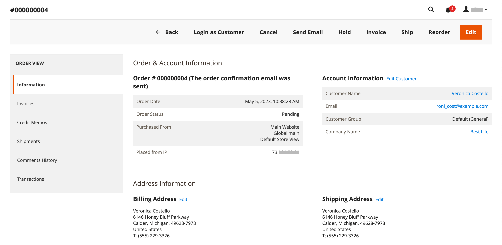

# Een bestelling bijwerken

Wanneer u een klant helpt die een bestelling heeft geplaatst, moet u de status van de bestelling bepalen. De beschikbare opties voor een `Pending` de volgorde verschilt van de opties voor een `Processing` bestelling. Zie voor meer informatie [Een bestelling verwerken](order-processing.md).

## Bestellingen in behandeling

Nadat een klant een bestelling heeft geplaatst, maar voordat de betaling is ontvangen, wordt de bestelling in `Pending` status. U kunt de volgorde bewerken, in de wachtstand zetten of volledig annuleren. De knopbalk van een bestelling in behandeling geeft een overzicht van de beschikbare handelingen voor een bestelling.

{width="600" zoomable="yes"}

Als u wezenlijke delen van een orde wijzigt, wordt de originele orde geannuleerd en een nieuwe orde wordt geproduceerd. U kunt de facturering of het verzendadres echter wijzigen zonder een nieuwe bestelling te genereren.

| Knop | Beschrijving |
|--- |--- |
| **[!UICONTROL Back]** | Hiermee gaat u terug naar de pagina Bestellingen zonder wijzigingen op te slaan. |
| **[!UICONTROL Login as Customer]** | Staat een admin gebruiker toe om klanten met hun orden bij te staan. |
| **[!UICONTROL Cancel]** | Annuleert de in behandeling zijnde bestelling. |
| **[!UICONTROL Send Email]** | Stuur een e-mail over de bestelling die in behandeling is naar de klant. |
| **[!UICONTROL Hold]** / **[!UICONTROL Unhold]** | Hiermee wijzigt u de status van de in behandeling zijnde order in `On Hold`. Kies _[!UICONTROL Unhold]_. |
| **[!UICONTROL Invoice]** | Maakt een [factuur](invoices.md#create-an-invoice) van de in behandeling zijnde bestelling door de bestelling om te zetten in een factuur en de status van de bestelling te wijzigen in `processing`. |
| **[!UICONTROL Ship]** | Maakt een [verzending](shipments.md#create-a-shipment) record voor de bestelling. |
| **[!UICONTROL Reorder]** | Hiermee maakt u een nieuwe volgorde in behandeling die een duplicaat is van de huidige volgorde in behandeling. |
| **[!UICONTROL Edit]** | Hiermee wordt een volgorde geopend die in behandeling is in de bewerkingsmodus. De knop Bewerken is alleen beschikbaar voor in behandeling zijnde bestellingen of voor bestellingen op basis van onderhandelingen [aanhalingstekens](../b2b/quotes.md). |

{style="table-layout:auto"}

## Verwerkingsopdrachten

Een bestelling voert een `Processing` status wanneer:

* De betaling voor een bestelling wordt ontvangen/vastgelegd en de factuur wordt gegenereerd—wanneer de betalingsactie wordt ingesteld op `Authorize and Capture`.
* Een ordertransactie is geautoriseerd, maar de betaling is nog niet vastgelegd—wanneer de betalingsactie is ingesteld op `Authorize`.

De [betalingsactieconfiguratie](../configuration-reference/sales/payment-methods.md#payment-actions) bepaalt welke bestelacties beschikbaar zijn nadat een orde wordt gecreeerd.

U kunt een `Processing` bestellen, maar u kunt het facturerings- en verzendadres bewerken.

{width="600" zoomable="yes"}

>[!NOTE]
>
>Wanneer de betalingsactie van de betalingsmethode is ingesteld op `Authorize and Capture`, wordt automatisch een factuur gemaakt wanneer de klant een bestelling plaatst. In dat geval kunt u de middelen terugbetalen via een [creditnota](credit-memo-create.md), maar niet [cancel](#cancel-a-pending-order) of [void](#void-a-processing-order) de bestelling.

| Knop | Beschrijving |
|--- |--- |
| **[!UICONTROL Back]** | Hiermee gaat u terug naar de pagina Bestellingen zonder wijzigingen op te slaan. |
| **[!UICONTROL Send Email]** | Stuur een e-mail over de bestelling naar de klant. |
| **[!UICONTROL Void]** | [Void](#void-a-processing-order) een ordertransactie of een gedeeltelijke ordertransactie. |
| **[!UICONTROL Credit Memo]** | Hiermee wordt het proces gestart om een [creditnota](credit-memo-create.md). |
| **[!UICONTROL Hold]** / **[!UICONTROL Unhold]** | Hiermee wijzigt u de status van de verkooporder in `On Hold`. Om de greep op de verkooporde vrij te geven, verkies _[!UICONTROL Unhold]_. |
| **[!UICONTROL Reorder]** | Hiermee maakt u een nieuwe volgorde in behandeling op basis van de huidige volgorde. |
| **[!UICONTROL Create Returns]** |  (Alleen Adobe Commerce) Initieert het proces naar [return](returns.md) een of meer items in de bestelling. |

{style="table-layout:auto"}

## Void een verwerkingsopdracht uit

Wanneer een order zich nog in een `Processing` status en de integratie van de betalingen `Authorize` (niet `Authorize and Capture`), kunt u alleen een transactie annuleren of een bestelling annuleren. [Een bestelling annuleren](#cancel-a-pending-order) ook de vergunning wordt ingetrokken .

Wanneer een order met een betalingsmethode wordt geplaatst waarbij de betalingsactie is ingesteld op `Authorize and Capture` u kunt de middelen terugbetalen via creditnota, maar u kunt deze niet annuleren omdat ze zijn gefactureerd en de betaling is vastgelegd.

Je betalingsmethode bepaalt de beschikbare betalingsacties. Zie [Betalingsacties](../configuration-reference/sales/payment-methods.md#payment-actions) voor meer informatie .

**_Een bestelling wissen:_**

1. Op de _Beheerder_ zijbalk, ga naar **[!UICONTROL Sales]** > _[!UICONTROL Operations]_>**[!UICONTROL Orders]**.

1. In de **[!UICONTROL Action]** voor de volgorde die moet worden bewerkt, klikt u op **[!UICONTROL View]**.

1. Klikken **[!UICONTROL Void]** om de bestelling te wissen.

1. Klik op **[!UICONTROL OK]** om de bestelling te wissen.

U kunt alle benodigde restituties uitgeven met een [creditnota](credit-memo-create.md) nadat de middelen zijn vrijgemaakt. U kunt ook een [RMA (Return merchandise Authorisation)](returns.md) uitgegeven voor productinformatie. Zie voor meer informatie [Een bestelling verwerken](order-processing.md).

## Een bestelling in behandeling bewerken

1. Op de _Beheerder_ zijbalk, ga naar **[!UICONTROL Sales]** > _[!UICONTROL Operations]_>**[!UICONTROL Orders]**.

1. In de **[!UICONTROL Action]** voor de volgorde die moet worden bewerkt, klikt u op **[!UICONTROL View]**.

1. Klik op **[!UICONTROL Edit]**.

   {width="600" zoomable="yes"}

1. Klik op **[!UICONTROL OK]** om verder te gaan met bewerken.

1. Werk de volgorde naar wens bij.

1. Pas uw wijzigingen toe:
   * Als u de wijzigingen in het facturerings- of verzendadres wilt opslaan, klikt u op **[!UICONTROL Save]**.
   * Als u de wijzigingen in de lijstitems wilt opslaan en de volgorde wilt herverwerken, klikt u op **[!UICONTROL Submit Order]**.

## Een bestelling in de wachtstand zetten

Als de voorkeursmethode van de klant niet beschikbaar is of als het object tijdelijk buiten voorraad is, kunt u de bestelling in de wacht zetten.

1. In de _Orders_ raster, zoek de `Pending` volgorde die u in de wachtstand wilt zetten.

1. In de _Handeling_ kolom, klik **[!UICONTROL View]**.

1. Klikken **[!UICONTROL Hold]** om de bestelling in de wachtstand te zetten.

Als u de greep van een bestelling wilt verwijderen, bewerkt u de bestelling opnieuw en klikt u op **[!UICONTROL Unhold]**.

## Een lopende order annuleren

Als u een bestelling annuleert, wordt de status van de bestelling gewijzigd van `Pending` tot `Canceled`.

1. In de _[!UICONTROL Orders]_, zoekt u naar de volgorde die in behandeling is en die moet worden geannuleerd.

1. In de _[!UICONTROL Action]_kolom, klik **[!UICONTROL View]**.

1. Klikken **[!UICONTROL Cancel]** om de bestelling te annuleren.

De status van de bestelling is nu `Canceled`.
