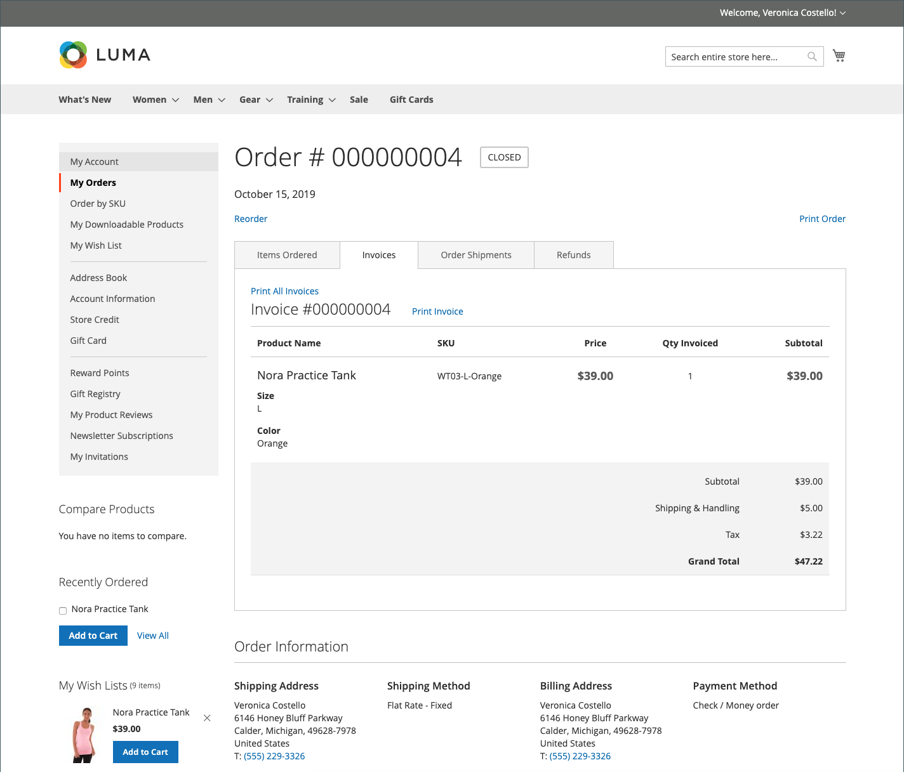

# Storefront-orderbeheer

Klanten hebben toegang tot al hun bestellingen via hun account. Bestellingen kunnen als nieuwe bestellingen worden weergegeven, gefilterd, bijgehouden en opnieuw worden verzonden. Afhankelijk van de status van de bestelling kunnen klanten hun bestellingen, facturen, verzendingen en terugbetalingsgegevens afdrukken.

## Filterorders

{{b2b-feature}}

Uw initiële _[!UICONTROL My Orders]_&#x200B;resultaten bevatten ook overeenkomende opdrachten van ondergeschikte gebruikers van alle websites in de instantie commerce. Een klant die aan een bedrijfrekening wordt geassocieerd kan de orderlijst filtreren om verslagen binnen de resultaten snel te vinden. Om de filteropties te tonen, klikt de klant **[!UICONTROL Filter]**, en klikt **[!UICONTROL Close]**&#x200B;om de filters te verbergen.

{width="700" zoomable="yes"}

| Filter | Beschrijving |
| ------ | ----------- |
| [!UICONTROL SKU or Product Name] | Voer een SKU- of productnaam in. |
| [!UICONTROL Order Number] | Kan een geheel of gedeeltelijk ordernummer zijn. |
| [!UICONTROL Order Status] | Hiermee kiest u een waarde uit de vervolgkeuzelijst om te filteren op status. |
| [!UICONTROL Invoice Number] | Voer een volledig of gedeeltelijk factuurnummer in. |
| [!UICONTROL Order Date] | Hiermee stelt u een of beide datumvelden in die op de orderdatum moeten worden gefilterd. |
| [!UICONTROL Created by] | Hiermee filtert u de orders van het bedrijf door de maker van de order. |
| [!UICONTROL Order Total] | Hiermee stelt u de waarden min, max of beide in op filteren op totaal van volgorde. |

## Een bestelling weergeven

Een klant zoekt de volgorde in de lijst en klikt op **[!UICONTROL View Order]** . Vanuit de open volgorde kunnen ze een van de volgende handelingen uitvoeren:

{width="700" zoomable="yes"}

### Onlangs bestelde producten weergeven

Het blok **[!UICONTROL Recent Orders]** wordt weergegeven op de zijbalk en op de pagina **[!UICONTROL My Account]** voor klanten die zich na het plaatsen van een bestelling hebben aangemeld. Er worden vijf producten weergegeven vanaf de laatste aankoop.

De klant kan producten aan de kar lezen door de producten te selecteren en **[!UICONTROL Add to Cart]** te klikken. Ze kunnen ook de laatste volgorde weergeven door op **[!UICONTROL View all]** te klikken. Hiermee wordt doorgegaan naar de pagina _[!UICONTROL My Account]_&#x200B;en het blok **[!UICONTROL Recent Orders]**.

### Afdrukvolgorde

1. De klant klikt op **[!UICONTROL Print Order]** .

1. Volg de instructies in het dialoogvenster Afdrukken om het afdrukken te voltooien.

### Facturen afdrukken

1. Op het tabblad **[!UICONTROL Invoices]** klikt de klant op een van de volgende opties:

   - **[!UICONTROL Print All Invoices]**

   - **[!UICONTROL Print Invoice]**

   {width="700" zoomable="yes"}

1. Gebruikt het dialoogvenster Afdrukken om het afdrukken te voltooien.

### Afdrukken

1. Op het tabblad **[!UICONTROL Order Shipments]** klikt de klant op een van de volgende opties:

   - **[!UICONTROL Print All Shipments]**

   - **[!UICONTROL Print Shipment]**

   {width="700" zoomable="yes"}

1. Gebruikt het dialoogvenster Afdrukken om het afdrukken te voltooien.

### Een verzending volgen

1. Klik op het tabblad **[!UICONTROL Order Shipments]** op **[!UICONTROL Track this Shipment]** .

   Alle beschikbare trackinggegevens worden weergegeven in een pop-upvenster.

1. Wanneer deze gereed is, klikt de klant op **[!UICONTROL Close Window]** .

### Afdrukrestituties

1. Op **terugkeert** lusje terug, klikt de klant één van het volgende:

   - **Druk Alle Terugbetalingen**

   - **Terugbetaling van de Druk**

   {width="700" zoomable="yes"}

1. Gebruikt het dialoogvenster Afdrukken om het afdrukken te voltooien.

Reorders zijn beschikbaar aan klanten wanneer [_toestaat opnieuw rangschikt_](reorders-allow.md) configuratieoptie wordt toegelaten.

Een klant kan de functionaliteit voor opnieuw ordenen voor een specifieke volgorde op twee pagina&#39;s starten:

- Pagina Mijn bestellingen
- Weergavepagina Volgorde

## Herschikkingen

De koppeling _[!UICONTROL Reorder]_&#x200B;wordt weergegeven in de lijst met bestellingen bij de koppeling&#x200B;_[!UICONTROL View]_ .

{width="700" zoomable="yes"}

**Geval 1.** Alle producten van de bestelling zijn beschikbaar voor herschikking

De klant wordt omgeleid naar het winkelwagentje en alle producten worden aan het winkelwagentje toegevoegd.

**Geval 2.** Sommige/alle producten van de bestelling zijn niet beschikbaar voor herschikking

>[!NOTE]
>
>Het is mogelijk om `Not Visible Individually` -producten opnieuw te ordenen.

De koppeling _[!UICONTROL Reorder]_&#x200B;wordt niet weergegeven op de pagina&#39;s&#x200B;_[!UICONTROL My Orders]_ en _[!UICONTROL View Order]_.

{width="700" zoomable="yes"}

>[!TIP]
>
>Als het winkelwagentje niet leeg is en de klant op **[!UICONTROL Reorder]** klikt (vanaf de pagina [!UICONTROL My Orders] of [!UICONTROL Order View] ), blijven de bestaande producten in het winkelwagentje met de toegevoegde producten voor opnieuw ordenen.

## Bestellingen annuleren

Annuleren is beschikbaar aan klanten wanneer [_toestaat annuleer_](cancel-allow.md) configuratieoptie wordt toegelaten.

Een klant kan de functie voor annuleren voor een specifieke bestelling starten op drie pagina&#39;s:

- Pagina Mijn bestellingen
- Weergavepagina Volgorde
- Pagina Mijn account

De koppeling _[!UICONTROL Cancel Order]_&#x200B;wordt weergegeven bij de koppeling&#x200B;_[!UICONTROL Reorder]_ . Als de volgorde niet kan worden geannuleerd, wordt de koppeling niet weergegeven.

{width="700" zoomable="yes"}

Om annuleren uit te voeren, annuleert de klant:

1. Klikken **[!UICONTROL Cancel Order]**

1. Verstrekt een annuleringsreden

   {width="700" zoomable="yes"}

   U kunt de annuleringsredenen op [_aanpassen toestaat annuleert_](cancel-allow.md) pagina.

1. Klikken **[!UICONTROL Confirm]**

   {width="700" zoomable="yes"}

   Na de annulering worden de bestellingen die de status _[!UICONTROL Pending]_&#x200B;hadden, gewijzigd in&#x200B;_[!UICONTROL Canceled]_ status, de bestellingen die de status _[!UICONTROL Processing]_&#x200B;hadden, gewijzigd in&#x200B;_[!UICONTROL Closed]_ status en terugbetaald.

   Wanneer de annulering is voltooid, wordt een e-mail verzonden naar de klant.

   {width="700" zoomable="yes"}

   De annuleringsinformatie wordt toegevoegd aan de ordergeschiedenis van de klant. Deze wordt weergegeven in de notities bij de volgorde en op het tabblad Overzicht van opmerkingen.

   {width="700" zoomable="yes"}

   {width="700" zoomable="yes"}

   Als de bestelling om een of andere reden is gewijzigd in een status die niet kan worden geannuleerd en de klant de pagina niet heeft vernieuwd, wordt de koppeling om de bestelling te annuleren nog steeds weergegeven. Wanneer ze echter proberen te annuleren, wordt een foutbericht weergegeven.

   {width="700" zoomable="yes"}

   Nadat u de pagina hebt vernieuwd, ziet u dat de volgorde al is voltooid. Daarom werkt de annulering niet.

   {width="700" zoomable="yes"}
