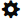
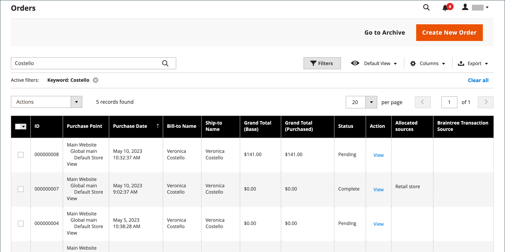

# Orders

De _Orders_ het net maakt een lijst van alle huidige orden en volgt hun vooruitgang en [orderstatus](order-status.md) via de [werkstroom](order-processing.md). Een gemakkelijke manier om het basisproces te begrijpen is dat een orde een [factuur](invoices.md)en een factuur wordt een [verzending](shipments.md). Het raster vertegenwoordigt de eerste fase van het proces en is de locatie waar u [update](order-update.md) bestaande bestellingen te maken en bestellingen te maken.

Gewoonlijk worden bestellingen gemaakt wanneer klanten het afrekenproces vanuit de winkel voltooien. Als een klant echter hulp nodig heeft, kunt u ook toegang krijgen tot [winkelwagentje](shopping-assisted-cart-manage.md) of [een bestelling maken](customer-account-create-order.md) hetzij van de _Orders_ net of rechtstreeks vanaf hun klantenaccount.

## De werkruimte voor bestellingen

In de werkruimte Bestellingen worden alle huidige bestellingen weergegeven en kunt u bestaande bestellingen bewerken en [maken](customer-account-create-order.md) bestellingen. Elke rij in het raster staat voor de volgorde van de klant en elke kolom staat voor een kenmerk of gegevensveld. De standaard gebruiken [besturingselementen](../getting-started/admin-grid-controls.md) om de lijst te sorteren en te filteren, bestellingen te zoeken en toe te passen [handelingen](../getting-started/admin-actions-control.md) op geselecteerde bestellingen. Met de tabbladen boven de pagineringsbesturingselementen kunt u de lijst filteren, de standaardweergave wijzigen, kolommen wijzigen en opnieuw rangschikken en gegevens exporteren.

{width="700" zoomable="yes"}

### Rasterindeling

De selectie van kolommen en hun volgorde in het raster kunnen naar wens worden gewijzigd. De nieuwe lay-out kan worden opgeslagen als een raster _weergave_. Standaard worden slechts negen van de 20 beschikbare kolommen in het raster opgenomen.

{width="600" zoomable="yes"}

#### De kolomselectie wijzigen

Klik in de rechterbovenhoek op de knop _Kolommen_ (  ) en voer de volgende handelingen uit:

- Schakel het selectievakje in van de kolommen die u aan het raster wilt toevoegen.
- Schakel het selectievakje uit van elke kolom die u uit het raster wilt verwijderen.

#### De kolomselectie opnieuw instellen

1. Klik op de knop _Kolommen_ (  ).

1. Klik op **[!UICONTROL Reset]**.

   De rasterlay-out wordt alleen weergegeven [standaardkolommen](#column-descriptions).

#### Een kolom verplaatsen

1. Klik en houd de kopbal van de kolom.

1. Sleep de kolom naar de nieuwe positie en laat deze los.

#### Een rasterweergave opslaan

1. Klik op de knop **[!UICONTROL View]** (  ).

1. Klik op **[!UICONTROL Save Current View]**.

1. Voer een **[!UICONTROL name]** voor de weergave.

1. Als u alle wijzigingen wilt opslaan, klikt u op de pijl (  ).

   De naam van de weergave wordt nu weergegeven als de huidige weergave.

#### De weergave wijzigen

Klik op de knop **[!UICONTROL View]** (  ). Voer vervolgens een van de volgende handelingen uit:

- Klik op de naam van de weergave als u een andere weergave wilt gebruiken.

- Als u de naam van een weergave wilt wijzigen, klikt u op de knop _Bewerken_ (  ) en werkt de naam bij.

### Besturingselementen werkruimte

| Besturing | Beschrijving |
|--- |--- |
| [!UICONTROL Create New Order] | Hiermee maakt u een volgorde. Zie [Een volgorde maken](customer-account-create-order.md) voor meer informatie . |
| [!UICONTROL Go to Archive] | Hiermee geeft u de lijst met gearchiveerde bestellingen weer. |
| [!UICONTROL Search] | Hiermee wordt een zoekopdracht naar bestellingen gestart op basis van de huidige filters. |
| [!UICONTROL Filters] | Definieert een set zoekparameters die wordt gebruikt om de records te filteren die in het raster worden weergegeven. |
| [!UICONTROL Default View] | Bepaalt de standaardkolomlay-out van het raster. |
| [!UICONTROL Columns] | Bepaalt de selectie van kolommen en hun orde in het net. De kolomlay-out kan worden gewijzigd en opgeslagen als een _weergave_. Standaard worden slechts enkele kolommen in het raster opgenomen. |
| [!UICONTROL Export] | Hiermee exporteert u de geselecteerde records als een CSV- of Excel XML-bestand. |

{style="table-layout:auto"}

### Handelingen

Als u een actie wilt toepassen op specifieke orders, schakelt u het selectievakje in de eerste kolom van elke volgorde in. Als u alle bestellingen wilt selecteren of deselecteren, gebruikt u het besturingselement boven aan de kolom.

{width="600" zoomable="yes"}

| Besturing | Beschrijving |
|--- |--- |
| [!UICONTROL Actions] | Hiermee geeft u alle handelingen weer die op geselecteerde bestellingen kunnen worden toegepast. Als u een handeling wilt toepassen op een bestelling of groep bestellingen, schakelt u het selectievakje in de eerste kolom van elke bestelling in.  Handelingen bestellen: `Cancel` / `Hold` / `Unhold` / `Print Invoices` / `Print Packing Slips` / `Print Credit Memos` / `Print All` / `Print Shipping Labels` / `Move to Archive`  (alleen Adobe Commerce) |
| [!UICONTROL Mass Actions] | Kan worden gebruikt om meerdere records te selecteren als het doel van de handeling. Schakel het selectievakje in de eerste kolom van elke record waarop de actie betrekking heeft. Opties: `Select All` / `Unselect All` / `Select Visible` / `Unselect Visible` |
| [!UICONTROL Submit] | Past de huidige actie op de geselecteerde ordecords toe. |
| [!UICONTROL Edit] | Hiermee opent u de volgorde in de bewerkingsmodus. |

{style="table-layout:auto"}

### Kolombeschrijvingen

| Kolom | Beschrijving |
|--- |--- |
| [!UICONTROL Select] | Schakel de selectievakjes in voor de aanhalingstekens die aan een handeling moeten worden onderworpen of gebruik het selectiegereedschap in de kolomkop. Opties: Alles selecteren / Alles deselecteren |
| [!UICONTROL ID] | Een uniek, opeenvolgend aantal dat wordt toegewezen wanneer een nieuwe orde voor het eerst wordt bewaard. |
| [!UICONTROL Purchase Point] | Hiermee wordt de winkelweergave aangegeven waar de bestelling is geplaatst. |
| [!UICONTROL Purchase Date] | De datum en het tijdstip waarop de bestelling is geplaatst. Deze wordt altijd weergegeven op basis van de standaardtijdzone. |
| [!UICONTROL Bill-to Name] | De naam van de persoon die verantwoordelijk is voor de betaling van de beschikking. |
| [!UICONTROL Ship-to Name] | De naam van de persoon aan wie de order moet worden verzonden. |
| [!UICONTROL Grand Total (Base)] | Het totale bedrag van de bestelling. |
| [!UICONTROL Grand Total (Purchased)] | Het totaal-generaal aan producten die in de bestelling zijn aangeschaft. |
| [!UICONTROL Status] | De huidige orderstatus. |
| [!UICONTROL Action] | _[!UICONTROL View]_Hiermee opent u de volgorde in de bewerkingsmodus. |
| [!UICONTROL Allocated sources] | De bronnen die aan die specifieke orde worden toegewezen. |

{style="table-layout:auto"}

Extra beschikbare kolommen:

| Kolom | Beschrijving |
|--- |--- |
| [!UICONTROL Billing Address] | Het factureringsadres van de klant die de orde plaatste. |
| [!UICONTROL Shipping Address] | Het adres waar de bestelling moet worden verzonden. |
| [!UICONTROL Shipping Information] | De methode die moet worden gebruikt om de orde te verschepen. |
| [!UICONTROL Customer Email] | Het e-mailadres van de persoon die de bestelling heeft geplaatst. |
| [!UICONTROL Customer Group] | De klantengroep waaraan de persoon wordt toegewezen die de orde plaatste. |
| [!UICONTROL Subtotal] | Het subtotaal van de bestelling, zonder verzending en belasting. |
| [!UICONTROL Shipping and Handling] | Het bedrag dat in rekening wordt gebracht voor verzending. |
| [!UICONTROL Customer Name] | De voornaam en achternaam van de klant die de bestelling heeft geplaatst. |
| [!UICONTROL Payment Method] | De wijze van betaling die voor de bestelling moet worden gebruikt. |
| [!UICONTROL Total Refunded] | Elk bedrag van de bestelling dat aan de klant moet worden terugbetaald. |
| [!UICONTROL Refunded to Store Credit] |  (Alleen Adobe Commerce) Elk bedrag uit de bestelling dat moet worden terugbetaald aan het winkelkrediet van de klant. |
| [!UICONTROL Company Name] |  (Beschikbaar bij B2B voor Adobe Commerce) De naam van de [bedrijf](../b2b/account-companies.md) die de bestelling heeft geplaatst. |

{style="table-layout:auto"}

## Zoeken in bestellingen

Het vakje van het Onderzoek in het hogere linkerzijde van het net van Orden kan worden gebruikt om specifieke orden door sleutelwoord te vinden, of door de ordecords in het net te filtreren.

{width="600" zoomable="yes"}

### Zoeken naar een overeenkomst

1. Voer een zoekterm in het zoekvak van de pagina in.

1. Klik op _Zoeken_ (  ).

### De zoekopdracht filteren

1. Als u de selectie van zoekfilters wilt weergeven, klikt u op de knop _Filters_ (  ).

   {width="600" zoomable="yes"}

1. Voer zoveel filters in als u wilt om de volgorde te beschrijven die u wilt zoeken.

1. Klikken **[!UICONTROL Apply Filters]** om de resultaten weer te geven.

### Zoekfilters

| Filter | Beschrijving |
|--- |--- |
| [!UICONTROL Purchase Date] | Hiermee filtert u de zoekopdracht op basis van de aangeschafte datum. Als u opdrachten wilt zoeken binnen een datumbereik, voert u zowel het **[!UICONTROL from]** en **[!UICONTROL to]** datums. |
| [!UICONTROL ID] | Hiermee filtert u de zoekopdracht op basis van bestellings-id. |
| [!UICONTROL Grand Total (Base)] | Hiermee filtert u de zoekopdracht op basis van het Eindtotaal van elke bestelling, inclusief eventuele credits die op de bestelling zijn toegepast. |
| [!UICONTROL Grand Total (Purchased)] | Hiermee filtert u de zoekopdracht op basis van het Eindtotaal van items die in elke bestelling zijn aangeschaft. |
| [!UICONTROL Bill-to Name] | Hiermee filtert u de zoekopdracht op basis van de naam van de persoon die voor de bestelling verantwoordelijk is. |
| [!UICONTROL Ship-to Name] | Hiermee filtert u de zoekopdracht op basis van de naam van de persoon aan wie de bestelling wordt verzonden. |
| [!UICONTROL Purchase Point] | Hiermee filtert u de zoekopdracht op website, in de winkel of in de opslagweergave waarin de bestelling is geplaatst. |
| [!UICONTROL Status] | Hiermee filtert u de zoekopdracht op basis van de orderstatus. Opties: `Canceled` / `Closed` / `Complete` / `Suspected Fraud` / `On Hold` / `Payment Review` / `PayPal Canceled Reversal` /` PayPal Reversed` /` Pending` / `Pending Payment` / `Pending PayPal` / `Processing` |
| [!UICONTROL Braintree Transaction Source] | Hiermee wordt de zoekopdracht gefilterd op basis van de transactiebron. |

{style="table-layout:auto"}

### Zoeken in gereedschappen

| Gereedschap | Beschrijving |
|--- |--- |
| [!UICONTROL Apply Filters] | Hiermee past u alle filters toe op de zoekresultaten. |
| [!UICONTROL Cancel] | Annuleert de huidige zoekopdracht. |
| [!UICONTROL Clear All] | Wist alle zoekfilters. |

{style="table-layout:auto"}

## Bronnen voor probleemoplossing

Voor hulp bij de kwesties van de het oplossen van problemenorde, zie de volgende artikelen van de Kennisbank van de Steun van de Handel:

- [Weergavefout voor bestellingen](https://experienceleague.adobe.com/docs/commerce-knowledge-base/kb/troubleshooting/storefront/magento-2.4.0-known-issue-orders-display-error.html)
- [PayPal-fout bij dubbele bestellingen 10415](https://experienceleague.adobe.com/docs/commerce-knowledge-base/kb/support-tools/patches/v1-0-6/mdva-31006-magento-patch-paypal-duplicate-orders-10415-error.html)
- [Nieuwe bestellingen worden naar archief verzonden](https://experienceleague.adobe.com/docs/commerce-knowledge-base/kb/troubleshooting/known-issues-patches-attached/new-orders-are-sent-to-archive.html)
- [Orders worden niet weergegeven in het raster Orders in Beheer](https://experienceleague.adobe.com/docs/commerce-knowledge-base/kb/troubleshooting/known-issues-patches-attached/orders-not-displayed-in-the-orders-grid-in-the-admin.html)
- [Orderstatus - onjuiste verzending gemaakt via REST API](https://experienceleague.adobe.com/docs/commerce-knowledge-base/kb/support-tools/patches/v1-0-7/mdva-30972-magento-patch-order-status-incorrect-shipment-created-via-rest-api.html)
