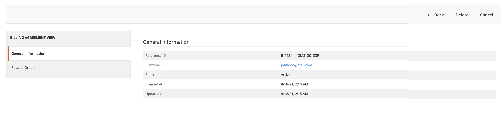
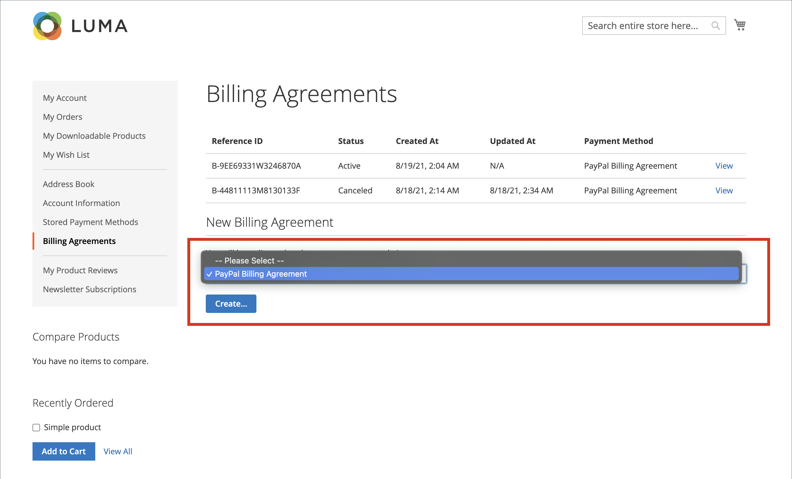
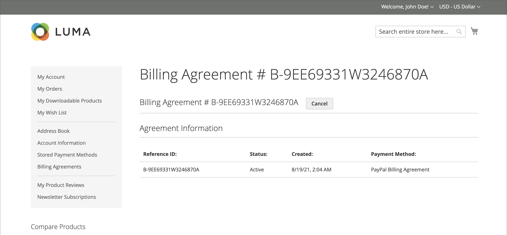

# Betalingsovereenkomsten met PayPal

Om het afhandelingsproces te vereenvoudigen, kunnen klanten een factureringsovereenkomst aangaan met PayPal als de betalingsdienstaanbieder. Tijdens het afrekenen kiest de klant de factureringsovereenkomst als betalingsmethode. Het betalingssysteem verifieert de factureringsovereenkomst aan de hand van het unieke nummer en brengt de rekening van de klant in rekening. Als er een factureringsovereenkomst is, is het niet langer nodig dat de klant voor elke aankoop betalingsgegevens invoert. Klanten kunnen hun factureringsovereenkomsten beheren vanaf het dashboard van hun klantenaccount, waar de status van elk wordt weergegeven als _Actief_ of _Geannuleerd_. Wanneer een factureringsovereenkomst wordt geannuleerd, kan deze niet opnieuw worden geactiveerd.

## Workflow voor factureringsovereenkomsten

1. **De klant ondertekent voor een factureringsovereenkomst**. Nadat er een factureringsovereenkomst is gesloten, kunnen alleen aanvullende factureringsovereenkomsten van de klantenaccount worden toegevoegd. Er is geen limiet aan het aantal factureringsovereenkomsten dat een klant kan maken. Klanten kunnen de volgende methoden gebruiken om zich aan te melden voor factureringsovereenkomsten:

   - **Aanmelden bij klantenaccount** - Klanten kunnen zich aanmelden voor een factureringsovereenkomst van hun klantenaccounts.
   - **Aanmelden bij uitchecken** - Klanten die betalen voor een aankoop met PayPal Express Checkout kunnen een selectievakje aanvinken om een factureringsovereenkomst te maken. Hoewel de factureringsovereenkomst niet wordt gebruikt voor de huidige bestelling, wordt deze beschikbaar als een optie voor de betalingsmethode wanneer de klant de volgende keer een bestelling plaatst.
   - **Aanmelden door de beheerder van de winkel** - Op verzoek van de klant, kan de opslagbeheerder een verkooporde tot stand brengen gebruikend de klant factureringsovereenkomst.

1. **PayPal verifieert en registreert de overeenkomst**. Wanneer de klant de order met betalingsovereenkomst plaatst, worden de referentie-id van de factureringsovereenkomst en de betalingsgegevens van de verkooporder naar PayPal overgebracht en in de klantenrekening opgenomen, samen met de referentiegegevens. Als de betaling is toegestaan, wordt een bestelling in de handel geplaatst. De referentie-id van de factureringsovereenkomst wordt naar de klant en de winkel verzonden.

## Factureringsovereenkomsten beheren

De _[!UICONTROL Billing Agreements]_op de pagina worden alle factureringsovereenkomsten tussen uw winkel en zijn klanten weergegeven. De handelaren kunnen de verslagen door de klant of de informatie van de factureringsovereenkomst met inbegrip van de verwijzings identiteitskaart van de factureringsovereenkomst, status, en aanmaakdatum filtreren. Elk record bevat algemene informatie over de factureringsovereenkomst en alle verkooporders die deze als betalingsmethode hebben gebruikt. U kunt factureringsovereenkomsten van klanten weergeven, annuleren of verwijderen. Een geannuleerde factureringsovereenkomst kan slechts door de archiefbeheerder worden geschrapt.

### Een factureringsovereenkomst weergeven

1. Op de _Beheerder_ zijbalk, ga naar **[!UICONTROL Sales]** > _[!UICONTROL Operations]_>**[!UICONTROL Billing Agreements]**.

1. Zoek de factureringsovereenkomst in de lijst en klik om deze te openen.

Elke pagina met factureringsovereenkomsten bestaat uit twee tabbladen: _[!UICONTROL General Information]_en_[!UICONTROL Related Orders]_.

#### Algemene informatie

Dit tabblad bevat de algemene informatie over de factureringsovereenkomst:

- [!UICONTROL Reference ID]: Een unieke numerieke id die is toegewezen aan de huidige factureringsovereenkomst.
- [!UICONTROL Customer]: De account van de klant die is toegewezen aan de huidige factureringsovereenkomst.
- [!UICONTROL Status]: status betalingsovereenkomst.
- [!UICONTROL Created At]: Aanmaakdatum.
- [!UICONTROL Updated At]: Datum bijwerken.

{width="600" zoomable="yes"}

#### Verwante bestellingen

Op dit tabblad wordt de lijst weergegeven met de orders die zijn geplaatst met de huidige factureringsovereenkomst.

{width="600" zoomable="yes"}

### Een factureringsovereenkomst annuleren

1. Op de _Beheerder_ zijbalk, ga naar **[!UICONTROL Sales]** > _[!UICONTROL Operations]_>**[!UICONTROL Billing Agreements]**.

1. Zoek de factureringsovereenkomst in de lijst en klik om deze te openen.

1. Klik in de rechterbovenhoek op **[!UICONTROL Cancel]**.

1. Klik op **[!UICONTROL OK]**.

### Een factureringsovereenkomst verwijderen

1. Op de _Beheerder_ zijbalk, ga naar **[!UICONTROL Sales]** > _[!UICONTROL Operations]_>**[!UICONTROL Billing Agreements]**.

1. Zoek de factureringsovereenkomst in de lijst en klik om deze te openen.

1. Klik in de rechterbovenhoek op **[!UICONTROL Delete]**.

1. Klik op **[!UICONTROL OK]**.

### Kolombeschrijvingen

| Kolom | Beschrijving |
|--- |--- |
| [!UICONTROL ID] | Een unieke numerieke id die aan elke factureringsovereenkomst is toegewezen |
| [!UICONTROL Email] | E-mail met contact van een klant |
| [!UICONTROL First Name] | Voornaam van een klant |
| [!UICONTROL Last Name] | Achternaam van een klant |
| [!UICONTROL Reference ID] | Een unieke, numerieke referentie-id die aan elke factureringsovereenkomst is toegewezen |
| [!UICONTROL Status] | Status betalingsovereenkomst. Opties: `Active` of `Canceled` |
| [!UICONTROL Created] | Aanmaakdatum |
| [!UICONTROL Updated] | Datum bijwerken |

{style="table-layout:auto"}

## Storefront-ervaring

Klanten die een factureringsovereenkomst met een betalingsdienstaanbieder aangaan, kunnen nu aankopen doen en later voor hen betalen, overeenkomstig de overeenkomst. De

{width="700" zoomable="yes"}

| Kolom | Beschrijving |
|--- |--- |
| [!UICONTROL Reference ID] | Een unieke, numerieke referentie-id die aan elke factureringsovereenkomst is toegewezen |
| [!UICONTROL Status] | Status betalingsovereenkomst. Opties: `Active` of `Canceled` |
| [!UICONTROL Created At] | Aanmaakdatum |
| [!UICONTROL Updated At] | Datum bijwerken |
| [!UICONTROL Payment Method] | Een betalingsaanbieder van een factureringsovereenkomst |
| [!UICONTROL View] | Knop die wordt gebruikt voor het weergeven van factureringsovereenkomsten |

{style="table-layout:auto"}

### Een factureringsovereenkomst maken

1. Van hun rekeningdashboard, selecteert de klant **[!UICONTROL Billing Agreements]**.

1. Onder **[!UICONTROL New Billing Agreement]**, selecteert een betalingsaanbieder.

1. Klik op **[!UICONTROL Create]**.

Deze handeling leidt de klant om naar de website van het betalingssysteem.

{width="700" zoomable="yes"}

### Een factureringsovereenkomst weergeven

1. Van hun rekeningdashboard, selecteert de klant **[!UICONTROL Billing Agreements]**.

1. Selecteert de factureringsovereenkomst en klikt **[!UICONTROL View]**.

{width="700" zoomable="yes"}

### Een factureringsovereenkomst annuleren

1. Van hun rekeningdashboard, selecteert de klant **[!UICONTROL Billing Agreements]**.

1. Selecteert de factureringsovereenkomst en klikt **[!UICONTROL View]**.

1. Klik in de rechterbovenhoek op **[!UICONTROL Cancel]** en vervolgens **[!UICONTROL OK]** ter bevestiging.

>[!NOTE]
>
>Als een Admin-gebruiker (handelaar) de factureringsovereenkomst annuleert, kan deze niet worden geannuleerd op de winkelserver. De _Geannuleerd_ status wordt weergegeven voor deze overeenkomst.
