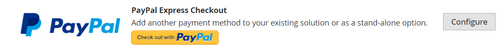

# PayPal Express-afhandeling

Met PayPal Express Checkout kunt u de verkoop verhogen door uw klanten de mogelijkheid te bieden met een creditcard of via de beveiliging van hun persoonlijke PayPal-rekening te betalen. Tijdens het afrekenen wordt de klant omgeleid naar de beveiligde PayPal-site om de betalingsgegevens te voltooien. De klant wordt dan teruggegeven aan uw opslag om de rest van het controleproces te voltooien. Als je Uitdrukkelijke afhandeling kiest, wordt de bekende PayPal-knop aan je winkel toegevoegd. Deze button wordt naar verluidt meer verkocht.

>[!IMPORTANT]
>
>**PSD2 Eisen:**  
>Vanaf 14 september 2019 zouden Europese banken betalingen kunnen terugdringen die niet voldoen aan [PSD 2](../getting-started/compliance-payment-services-directive.md) eisen. Er is geen actie nodig om PayPal Express Checkout te laten voldoen aan PSD2 omdat alle vereisten door PayPal worden afgehandeld.

Klanten met huidige PayPal-accounts kunnen in één stap een aankoop doen door op de knop _[!UICONTROL Check out with PayPal]_knop. Uitdrukkelijke afhandeling kan worden gebruikt als een zelfstandige, of met een van de PayPal alles-in-één oplossingen. Als je al online creditcards accepteert, kun je Express Checkout aanbieden als extra optie om nieuwe klanten aan te trekken die liever met PayPal betalen.

>[!NOTE]
>
>PayPal heeft de ondersteuning voor de verkoop van digitale goederen via PayPal Express Checkout vervangen en raadt u aan om ofwel [PayPal Payments Standard](paypal-payments-standard.md) of een andere PayPal-betaalgateway om bestellingen te verwerken die [virtuele producten](../catalog/product-create-virtual.md).

## Vereisten

- Merchant: [Business PayPal-account][1]
- Klant: [Persoonlijke PayPal-rekening][2]

## Workflow voor uitchecken

In tegenstelling tot andere betalingsmethoden kan de klant via PayPal Express Checkout aan het begin van de gebruikelijke afrekenworkflow uitchecken via de productpagina, de mini-winkelwagen en het winkelwagentje.

1. **Bestelling plaatsen klant** - De klant klikt of tikt op de _[!UICONTROL Check out with PayPal]_knop.
1. **De klant wordt omgeleid naar de PayPal-site** - De klant wordt omgeleid naar de PayPal-site om de transactie te voltooien.
1. **De klant meldt zich aan bij zijn PayPal-account** - De klant moet zich aanmelden bij zijn PayPal-rekening om de transactie te voltooien. Het betalingssysteem gebruikt de facturerings- en verzendgegevens van hun PayPal-rekening.
1. **Klanten keren terug naar de afhandelingspagina** - De klant wordt weer teruggeleid naar de uitcheckpagina in uw winkel om de bestelling te controleren.
1. **Bestelling plaatsen klant** - De klant plaatst de bestelling en de bestelgegevens worden naar PayPal verzonden.
1. **PayPal lost de transactie op** - PayPal ontvangt de bestelling en lost de transactie op.

>[!NOTE]
>
>PayPal Express Checkout ondersteunt geen bestellingen met meerdere adressen.

## Afhandeling in context

PayPal&#39;s _In context uitchecken_ maakt het makkelijker dan ooit online te betalen. Klanten verliezen uw winkel nooit uit het oog tijdens deze vereenvoudigde, naadloze afhandeling met één of twee klikken. In-context-afhandeling werkt net zo goed op computers en pc&#39;s en biedt een consistente ervaring op desktopcomputers, tablets en mobiele apparaten. Zie voor meer informatie [Afhandeling in context in Express afhandeling][5].

{width="700" zoomable="yes"}

[_PayPal-betalingsdemo in context_][6]

Wanneer u uw winkel configureert voor [!DNL PayPal Express Checkout]kunt u deze optie inschakelen.

## Uw PayPal-account configureren

Voordat u PayPal Express Checkout instelt in Commerce Admin, moet u uw zakelijke account configureren op de Paypal-website.

1. Meld u aan bij uw geavanceerde PayPal-account op [manager.paypal.com][3].

1. Ga naar **[!UICONTROL Service Settings]** > **[!UICONTROL Hosted Checkout Pages]** > **[!UICONTROL Set Up]** en stel de volgende instellingen in:

   - **[!UICONTROL AVS]**: `No`
   - **[!UICONTROL CSC]**: `No`
   - **[!UICONTROL Enable Secure Token]**: `Yes`

1. Klik op **[!UICONTROL Save Changes]**.

1. Een andere gebruiker instellen (aanbevolen door PayPal):

   - Ga naar [manager.paypal.com][3] en meld u aan bij uw account.

   - Volg de instructies om een andere gebruiker in te stellen.

   - Klik op **[!UICONTROL Update]**.

## PayPal Express Checkout instellen in de handel

Er kunnen twee PayPal-oplossingen tegelijkertijd actief zijn: PayPal Express Checkout en een alles-in-één oplossing. Als u een andere oplossing inschakelt, wordt de eerder gebruikte oplossing automatisch gedeactiveerd.

>[!NOTE]
>
>Klikken **[!UICONTROL Save Config]** om uw voortgang op elk gewenst moment op te slaan.

### Stap 1: Begin met de configuratie

1. Op de _Beheerder_ zijbalk, ga naar **[!UICONTROL Stores]** > _[!UICONTROL Settings]_>**[!UICONTROL Configuration]**.

1. Vouw in het linkerdeelvenster uit **[!UICONTROL Sales]** en kiest u **[!UICONTROL Payment Methods]**.

1. Als uw installatie meerdere websites, winkels of weergaven bevat, stelt u **[!UICONTROL Store View]** op de archiefmening waar u deze configuratie wilt toepassen.

1. In de _[!UICONTROL Merchant Location]_selecteert u de **[!UICONTROL Merchant Country]**waar uw bedrijf wordt gevestigd.

   Deze instelling bepaalt de selectie van PayPal-oplossingen die in de configuratie worden weergegeven.

   {width="600" zoomable="yes"}

1. Onder _[!UICONTROL Recommended Solutions]_, klikt u op **[!UICONTROL Configure]**for **[!UICONTROL PayPal Express Checkout]**.

   {width="600"}

### Stap 2: Je PayPal-account inschakelen en verbinden

1. Indien nodig uitbreiden  de **[!UICONTROL Required PayPal Settings]** sectie.

   {width="600" zoomable="yes"}

1. Sluit uw account aan voor test- of productiedoeleinden:

   - Voor de testmodus (ontwikkeling) klikt u op **[!UICONTROL Sandbox Credentials]** en voer uw [PayPal-sandbox][7] referenties.
   - Voor de productiemodus klikt u op **[!UICONTROL Connect with PayPal]** en voer de gegevens van uw productieaccount in.

   Wanneer de verbinding wordt gevalideerd, kunt u doorgaan.

1. Set **[!UICONTROL Enable this Solution]** tot `Yes`.

1. Inschakelen [In context PayPal-afhandeling](#in-context-checkout):

   - Set **[!UICONTROL Enable In-Context Checkout Experience]** tot `Yes`.

   - Voer je PayPal in **[!UICONTROL Merchant Account ID]**.

     Je zakelijke account-id staat in het profiel van je PayPal-rekening.

>[!NOTE]
>
>[PayPal-creditering](paypal.md#paypal-credit-and-pay-later) is standaard ingeschakeld voor deze betalingsoptie.

### Stap 3: Voer de vereiste PayPal-instellingen in

1. Indien nodig uitbreiden  de **[!UICONTROL Express Checkout]** sectie.

   {width="600" zoomable="yes"}

1. (Optioneel) Voer de **[!UICONTROL Email Associated with PayPal Merchant Account]**.

   >[!IMPORTANT]
   >
   >E-mailadressen zijn hoofdlettergevoelig. Om betaling te ontvangen, moet het e-mailadres dat u invoert, overeenkomen met het e-mailadres dat is opgegeven in uw PayPal-handelsaccount.

   Als u geen PayPal-rekening hebt, klikt u op **[!UICONTROL Start accepting payments via PayPal]**.

1. Set **[!UICONTROL API Authentication Methods]** op een van de volgende wijzen:

   - `API Signature` - Deze PayPal-verificatiemethode is het eenvoudigst te implementeren en is gebaseerd op uw gebruikersnaam, wachtwoord en een unieke reeks tekens en getallen die uw account identificeren. API-handtekeningreferenties verlopen niet.
   - `API Certificate` - Deze PayPal-verificatiemethode is veiliger en is gebaseerd op uw gebruikersnaam, wachtwoord en downloadbaar certificaat. API-referenties verlopen na drie jaar en moeten worden vernieuwd.

   Vul zo nodig het volgende in:

   - **[!UICONTROL API Username]**
   - **[!UICONTROL API Password]**
   - **[!UICONTROL API Signature]**

1. Als u referenties van uw sandboxaccount gebruikt, stelt u **[!UICONTROL Sandbox Mode]** tot `Yes`.

   Gebruik bij het testen van de configuratie in een sandbox alleen [creditcardnummers][4] die worden aanbevolen door PayPal. Wanneer u klaar bent om naar productie te gaan, terugkeer naar de configuratie en plaats de Wijze van Sandbox aan `No` en maak verbinding met uw productie-PayPal-account.

1. Als uw systeem een proxyserver gebruikt om de verbinding tussen Handel en het PayPal-betalingssysteem tot stand te brengen, stelt u **[!UICONTROL API Uses Proxy]** tot `Yes` en vult het volgende in:

   - **[!UICONTROL Proxy Host]**
   - **[!UICONTROL Proxy Port]**

Aan het einde van deze reeks stappen zijn de vereiste PayPal-instellingen voltooid. U kunt doorgaan met de instellingen Standaard en Geavanceerd of op **[!UICONTROL Save Config]** en later terugkeren om de configuratie aan te passen

### Stap 4: Adverteer PayPal-creditering / Adverteer PayPal Later (optioneel)

Vanaf de release 2.4.3 wordt PayPal PayLater ondersteund in implementaties die PayPal bevatten. Met deze functie kunnen kopers een bestelling in tweewekelijkse termijnen betalen in plaats van het volledige bedrag op het moment van aankoop te betalen. De PayPal-ervaring is afgekeurd.

Set **[!UICONTROL Enable PayPal PayLater Experience]** op een van de volgende wijzen:

- `Yes` - Adverteer PayPal PayPal later instellen
- `No` - Adverteren van PayPal-krediet instellen

>[!NOTE]
>
>De **[!UICONTROL Enable PayPal PayLater Experience]** het plaatsen maakt niet onbruikbaar [!DNL PayPal PayLater] en niet verwijderen **_[!UICONTROL PayPal PayLater]_** knoppen in de winkel. Beide uitschakelen **_[!UICONTROL PayPal PayLater]_** en **_[!UICONTROL PayPal Credit]_** in de winkel, moet u de knop `PayPal Credit` waarde voor de **[!UICONTROL Disable Funding Options]** instellen ([!UICONTROL Advanced Settings] krachtens [!UICONTROL Frontend Experience Settings]).

#### PayPal-krediet adverteren

1. Uitbreiden  de **[!UICONTROL Advertise PayPal Credit]** sectie.

1. Klik op **[!UICONTROL Get Publisher ID from PayPal]** en volgt u de instructies.

1. Voer uw **[!UICONTROL Publisher ID]**.

   {width="600" zoomable="yes"}

1. Uitbreiden  de **[!UICONTROL Home Page]** sectie.

1. Als u een banner op de pagina wilt plaatsen, stelt u **[!UICONTROL Display]** tot `Yes`.

1. Set **[!UICONTROL Position]** op een van de volgende wijzen:

   - `Header (center)`
   - `Sidebar (right)`

1. Set **[!UICONTROL Size]** op een van de volgende wijzen:

   - `190 x 100`
   - `234 x 60`
   - `300 x 50`
   - `468 x 60`
   - `728 x 90`
   - `800 x 66`

   {width="600" zoomable="yes"}

1. Uitbreiden  de overige secties en herhaal de vorige stappen:

   - [!UICONTROL Catalog Category Page]
   - [!UICONTROL Catalog Product Page]
   - [!UICONTROL Checkout Cart Page]

#### Adverteer PayPal PayPal Later

1. Uitbreiden  de **[!UICONTROL Advertise PayPal PayLater]** sectie.

1. Set **[!UICONTROL Enable PayPal PayLater]** tot `Yes`.

1. Uitbreiden  de **[!UICONTROL Home Page]** sectie.

1. Als u een banner op de pagina wilt plaatsen, stelt u **[!UICONTROL Display]** tot `Yes`.

1. Set **[!UICONTROL Position]** op een van de volgende wijzen:

   - `Header (center)`
   - `Sidebar`

1. Set **[!UICONTROL Style Layout]** op een van de volgende wijzen:

   - `Text`
   - `Flex`

1. Voor [!UICONTROL Style Layout] **[!UICONTROL Text]** alleen, instellen **[!UICONTROL Logo Type]** op een van de volgende wijzen:

   - `Primary`
   - `Alternative`
   - `Inline`
   - `None`

1. Voor [!UICONTROL Style Layout] **[!UICONTROL Text]** alleen, instellen **[!UICONTROL Logo Position]** op een van de volgende wijzen:

   - `Left`
   - `Right`
   - `Top`

1. Voor [!UICONTROL Style Layout] **[!UICONTROL Text]** alleen, instellen **[!UICONTROL Text Color]** op een van de volgende wijzen:

   - `Black`
   - `White`
   - `Monochrome`
   - `Grayscale`

1. Voor [!UICONTROL Style Layout] **[!UICONTROL Text]** alleen, instellen **[!UICONTROL Text Size]** op een van de volgende wijzen:

   - `10px`
   - `11px`
   - `12px`
   - `13px`
   - `14px`
   - `15px`
   - `16px`

1. Voor [!UICONTROL Style Layout] **[!UICONTROL Flex]** alleen, instellen **[!UICONTROL Ratio]** op een van de volgende wijzen:

   - `1x1`
   - `1x4`
   - `8x1`
   - `20x1`

1. Voor [!UICONTROL Style Layout] **[!UICONTROL Flex]** alleen, instellen **[!UICONTROL Color]** op een van de volgende wijzen:

   - `Blue`
   - `Black`
   - `White`
   - `White No Border`
   - `Gray`
   - `Monochrome`
   - `Grayscale`

   {width="600" zoomable="yes"}

1. Uitbreiden  de overige secties en herhaal de vorige stappen:

   - [!UICONTROL Catalog Product Page]
   - [!UICONTROL Checkout Cart Page]
   - [!UICONTROL Checkout Payment Step]
   - [!UICONTROL Catalog Category Page]

### Stap 5: De basisinstellingen voltooien

1. Uitbreiden  de **[!UICONTROL Basic Settings - PayPal Express Checkout]** sectie.

   {width="600" zoomable="yes"}

1. Voor **[!UICONTROL Title]**, voert u een titel in die deze betalingsmethode identificeert tijdens het afrekenen.

   U kunt de titel het beste gebruiken _PayPal_ voor alle winkelweergaven.

1. Als je meerdere betalingsmethoden aanbiedt, voer dan een nummer in voor **[!UICONTROL Sort Order]** om de volgorde te bepalen waarin PayPal Express Checkout wordt weergegeven wanneer deze bij de andere betalingsmethoden wordt aangeboden.

   Dit getal is relatief ten opzichte van de andere betalingsmethoden. (`0` = eerst, `1` = seconde, `2` = derde, enzovoort.)

1. Set **[!UICONTROL Payment Action]** op een van de volgende wijzen:

   - `Authorization` - Goedkeuring van de aankoop en blokkering van de middelen. Het bedrag wordt pas ingetrokken als het is _vastgelegd_ door de handelaar.
   - `Sale` - Het bedrag van de aankoop wordt toegestaan en onmiddellijk van de rekening van de klant teruggetrokken.
   - `Order` - Het bedrag van de bestelling wordt niet vastgelegd of geautoriseerd op de klantenbalans, bankrekening of creditcard bij PayPal. De betalingsactie voor bestellingen is een overeenkomst tussen het PayPal-betalingssysteem en de handelaar. Het stelt de handelaar in staat een of meer bedragen tot het geordende totaal van de klantenkopersrekening over een periode van maximaal 29 dagen af te halen. Nadat de fondsen zijn besteld, kan de handelaar ze op elk moment gedurende de volgende periode van 29 dagen opvangen. Het vastleggen van het orderbedrag kan alleen door de Commerce Admin worden uitgevoerd door een of meer facturen te maken.

1. Als u het dialoogvenster _[!UICONTROL Check out with PayPal]_op de productpagina, instellen **[!UICONTROL Display on Product Details Page]**tot `Yes`.

1. Als de betalingsactie is ingesteld op `Order`, voltooi het volgende

   - **[!UICONTROL Authorization Honor Period (days)]** - Hiermee wordt bepaald hoe lang de primaire toelating geldig blijft. De waarde moet gelijk zijn aan de corresponderende waarde in je PayPal-handelsaccount. De standaardwaarde in je PayPal Merchant-account is `3`. Neem contact op met PayPal om dit aantal te verhogen. De machtiging is op de laatste dag om 23:49 uur ongeldig.

   - **[!UICONTROL Order Valid Period (days)]** - Hiermee bepaalt u hoe lang de bestelling geldig blijft. Wanneer de bestelling ongeldig wordt, kunt u er geen facturen meer voor maken. Geef de waarde op die gelijk is aan de waarde voor Geldige periode bestellen in uw PayPal-zakelijke account. De standaardwaarde in je PayPal Merchant-account is `29`. Als je dit nummer wilt wijzigen, moet je contact opnemen met PayPal.

   - **[!UICONTROL Number of Child Authorizations]** - Geeft het maximumaantal machtigingen voor één bestelling aan, dat het maximumaantal gedeeltelijke onlinefacturen bepaalt dat u voor een bestelling kunt maken. Deze waarde moet gelijk zijn aan de corresponderende instelling in uw PayPal-handelsaccount. Het standaardaantal onderliggende autorisaties in uw PayPal-account is `1`. Neem contact op met PayPal om dit aantal te verhogen.

### Stap 6: De geavanceerde instellingen voltooien

1. Uitbreiden  de **[!UICONTROL Advanced Settings]** sectie.

   {width="600" zoomable="yes"}

1. Set **[!UICONTROL Display on Shopping Cart]** tot `Yes`.

1. Set **[!UICONTROL Payment Applicable From]** op een van de volgende wijzen:

   - `All Allowed Countries` - Klanten uit alle landen die in uw winkelconfiguratie zijn opgegeven, kunnen deze betalingsmethode gebruiken.
   - `Specific Countries` - Nadat u deze optie hebt gekozen, _[!UICONTROL Payment from Specific Countries]_wordt weergegeven. Als u meerdere landen wilt selecteren, houdt u Ctrl (PC) of Command (Mac) ingedrukt en klikt u op elk item.

1. Om mededelingen met het betalingssysteem in het logboekdossier te schrijven, plaats **[!UICONTROL Debug Mode]** tot `Yes`.

   Het logbestand voor Paypal Payments Advanced is `_payflow_advanced.log`.

   >[!NOTE]
   >
   >In overeenstemming met de normen van de Veiligheid van Gegevens PCI, wordt de creditcardinformatie niet geregistreerd in het logboekdossier.

1. Als u verificatie van de authenticiteit van de host wilt inschakelen, stelt u **[!UICONTROL Enable SSL Verification]** tot `Yes`.

1. Als u een volledig overzicht wilt weergeven van de bestelling van de klant per online item op de PayPal-site, stelt u **[!UICONTROL Transfer Cart Line Items]** tot `Yes`.

1. Als u maximaal tien verzendopties in het overzicht wilt opnemen, stelt u **[!UICONTROL Transfer Shipping Options]** tot `Yes`. (Deze optie wordt alleen weergegeven als regelitems zijn ingesteld op overdracht.)

1. Als u het type afbeelding wilt bepalen dat voor de PayPal-acceptatieknop wordt gebruikt, stelt u **[!UICONTROL Shortcut Buttons Flavor]** op een van de volgende wijzen:

   - `Dynamic` - (Aanbevolen) Hiermee wordt een afbeelding weergegeven die dynamisch kan worden gewijzigd van de PayPal-server.
   - `Static` - Hiermee geeft u een specifieke afbeelding weer die niet dynamisch kan worden gewijzigd.

1. Als u wilt toestaan dat klanten zonder PayPal-accounts een aankoop kunnen doen met deze methode, stelt u **[!UICONTROL Enable PayPal Guest Checkout]** tot `Yes`.

1. Set **[!UICONTROL Require Customer's Billing Address]** op een van de volgende wijzen:

   - `Yes` - Vereist het factuuradres van de klant voor alle aankopen.
   - `No` - Het factuuradres van de klant is niet vereist voor aankopen.
   - `For Virtual Quotes Only` - Vereist het factureringsadres van de klant voor virtuele citaten slechts.

   >[!NOTE]
   >
   >Deze functie moet zijn ingeschakeld voor het zakelijke account via technische ondersteuning van PayPal.

1. (Optioneel) Stel de **[!UICONTROL Billing Agreement Signup]** om klanten toe te staan een [factureringsovereenkomst](paypal-billing-agreements.md) met uw winkel in het PayPal-betalingssysteem als er geen actieve factureringsovereenkomsten beschikbaar zijn in de klantenaccount:

   - `Auto` - De klant kan een factureringsovereenkomst ondertekenen tijdens de expresafhandeling of een andere betalingsmethode gebruiken.
   - `Ask Customer` - De klant kan beslissen of hij een factureringsovereenkomst ondertekent tijdens de uitcheckprocedure.
   - `Never` - De klant kan geen factureringsovereenkomst ondertekenen tijdens de expresafhandeling.

   >[!NOTE]
   >
   >Handelaren moeten vragen [Technische ondersteuning van PayPal Merchant](https://developer.paypal.com/support/) factureringsovereenkomsten mogelijk te maken. De _Opname factureringsovereenkomst_ parameter wordt alleen ingeschakeld nadat PayPal heeft bevestigd dat factureringsovereenkomsten zijn ingeschakeld voor uw zakelijke account.

1. Als u wilt dat de klant de transactie kan voltooien vanaf de PayPal-site zonder deze terug te sturen naar uw winkel voor het controleren van bestellingen, stelt u **[!UICONTROL Skip Order Review Step]** tot `Yes`.

1. Vul de aanvullende secties in die nodig zijn voor uw winkel:

   - [Instellingen van betalingsovereenkomst](#paypal-billing-agreement-settings)
   - [Instellingen voor afwikkelingsrapport](#settlement-report-settings)
   - [Instellingen voor voorvertoning](#frontend-experience-settings)
   - [Slimme knoppen aanpassen](#customize-smart-buttons)
   - [Functies](#features)

1. Klik op **[!UICONTROL Save Config]**.

#### Instellingen van PayPal-factureringsovereenkomst

A [factureringsovereenkomst](paypal-billing-agreements.md) is een verkoopovereenkomst tussen de handelaar en de klant die door PayPal is goedgekeurd voor gebruik met meerdere bestellingen. Tijdens het afrekenen wordt de betalingsoptie Factureringsovereenkomst alleen weergegeven voor klanten die al een factureringsovereenkomst met uw bedrijf hebben gesloten. Nadat PayPal de overeenkomst heeft goedgekeurd, geeft het betalingssysteem een unieke referentie-id uit om elke bestelling te identificeren die aan de overeenkomst is gekoppeld. Net als bij een inkooporder is er geen limiet voor het aantal factureringsovereenkomsten dat een klant met uw bedrijf kan maken.

1. Uitbreiden  de **[!UICONTROL PayPal Billing Agreement Settings]** sectie.

   {width="600" zoomable="yes"}

1. Set **[!UICONTROL Enabled]** tot `Yes`.

1. Voor **[!UICONTROL Title]**, voert u een titel in die de methode aangeeft van de PayPal-factureringsovereenkomst tijdens het afrekenen.

1. Als je meerdere betalingsmethoden aanbiedt, voer dan een nummer in in het veld **[!UICONTROL Sort Order]** veld om te bepalen in welke volgorde factureringsovereenkomst wordt weergegeven wanneer deze bij andere betalingsmethoden wordt aangeboden tijdens het afrekenen.

1. Set **[!UICONTROL Payment Action]** op een van de volgende wijzen:

   - `Authorization` - Goedkeuring van de aankoop en blokkering van de middelen. De hoeveelheid wordt pas opgevraagd wanneer deze door de handelaar wordt &quot;gevangen&quot;.
   - `Sale` - Het bedrag van de aankoop wordt toegestaan en onmiddellijk van de rekening van de klant teruggetrokken.

1. Set **[!UICONTROL Payment Applicable From]** op een van de volgende wijzen:

   - `All Allowed Countries` - Klanten uit alle landen die in uw winkelconfiguratie zijn opgegeven, kunnen deze betalingsmethode gebruiken.
   - `Specific Countries` - Nadat u deze optie hebt gekozen, _[!UICONTROL Payment from Specific Countries]_wordt weergegeven. Als u meerdere landen wilt selecteren, houdt u Ctrl (PC) of Command (Mac) ingedrukt en klikt u op elk land.

1. Als u de communicatie met het betalingssysteem wilt opnemen in het logbestand, stelt u **[!UICONTROL Debug Mode]** tot `Yes`.

   >[!NOTE]
   >
   >Het logbestand wordt opgeslagen op de server en is alleen toegankelijk voor ontwikkelaars. In overeenstemming met de normen van de Veiligheid van Gegevens PCI, wordt de creditcardinformatie niet geregistreerd in het logboekdossier.

1. Als u SSL-verificatie wilt inschakelen, stelt u **[!UICONTROL Enable SSL Verification]** tot `Yes`.

1. Als u een overzicht wilt weergeven van elk regelitem in de bestelling van de klant op de pagina PayPal-betalingen, stelt u **[!UICONTROL Transfer Cart Line Items]** tot `Yes`.

1. Om klanten toe te staan om een factureringsovereenkomst van het dashboard van hun klantenrekening in werking te stellen, reeks **[!UICONTROL Allow in Billing Agreement Wizard]** tot `Yes`.

#### Instellingen voor afwikkelingsrapport

1. Uitbreiden  de **[!UICONTROL Settlement Report Settings]** sectie.

   {width="600" zoomable="yes"}

1. Voor **[!UICONTROL SFTP Credentials]** Ga als volgt te werk:

   - Als u zich hebt aangemeld bij de PayPal Secure FTP-server, voert u de volgende SFTP-aanmeldgegevens in:

      - Aanmelden
      - Wachtwoord

   - Testrapporten uitvoeren vóór _live gaan_ met Express Checkout op uw site, stelt u **[!UICONTROL Sandbox Mode]** tot `Yes`.

   - Voer de **[!UICONTROL Custom Endpoint Hostname or IP Address]**.

     De standaardwaarde is: `reports.paypal.com`

   - Voer de **[!UICONTROL Custom Path]** waarin rapporten worden opgeslagen.

     De standaardwaarde is: `/ppreports/outgoing`

1. Om rapporten volgens een programma te produceren, voltooi **[!UICONTROL Scheduled Fetching]** instellingen:

   - Set **[!UICONTROL Enable Automatic Fetching]** tot `Yes`.

   - Set **[!UICONTROL Schedule]** op een van de volgende wijzen:

      - `Daily`
      - `Every 3 Days`
      - `Every 7 Days`
      - `Every 10 Days`
      - `Every 14 Days`
      - `Every 30 Days`
      - `Every 40 Days`

     PayPal bewaart elk rapport 45 dagen.

   - Set **[!UICONTROL Time of Day]** tot het uur, de minuut, en de seconde wanneer u de rapporten wilt worden geproduceerd.

#### Instellingen voor voorvertoning

Met de instellingen voor de vooraf ingestelde ervaring kunt u kiezen welke PayPal-logo&#39;s op uw site worden weergegeven en kunt u de weergave van uw winkelpagina&#39;s van PayPal aanpassen.

1. Uitbreiden  de **[!UICONTROL Frontend Experience Settings]** sectie.

   {width="600" zoomable="yes"}

1. Selecteer de **[!UICONTROL PayPal Product Logo]** die je in het PayPal-blok in je winkel wilt weergeven.

   De PayPal-logo&#39;s zijn beschikbaar in vier stijlen en twee formaten:

   - `No Logo`
   - `We Prefer PayPal (150 x 60 or 150 x 40)`
   - `Now Accepting PayPal (150 x 60 or 150 x 40)`
   - `Payments by PayPal (150 x 60 or 150 x 40)`
   - `Shop Now Using PayPal (150 x 60 or 150 x 40)`

1. Ga als volgt te werk om de weergave van je PayPal-winkelpagina&#39;s aan te passen:

   - Voer de naam in van de **[!UICONTROL Page Style]** die je op je PayPal-handelpagina&#39;s wilt toepassen:

      - `paypal` - Gebruikt de paginastijl van PayPal.
      - `primary` - Gebruikt de paginastijl die u als _primair_ stijl in uw accountprofiel.
      - `your_custom_value` - Hiermee gebruikt u een aangepaste paginastijl voor betalingen, die in uw accountprofiel is opgegeven.

   - Voor **[!UICONTROL Header Image URL]** Voer de URL in van de afbeelding die u in de linkerbovenhoek van de betaalpagina wilt weergeven. De maximale bestandsgrootte is 750 pixels breed en 90 pixels hoog.

     >[!NOTE]
     >
     >PayPal raadt aan de afbeelding op een beveiligde server (https) te plaatsen. Anders kan een browser waarschuwen dat _de pagina bevat zowel beveiligde als niet-beveiligde items_.

   - Als u de kleur voor uw pagina&#39;s wilt instellen, voert u de hexadecimale code van zes tekens in, zonder de `#` symbool, voor elk van de volgende elementen:

      - **[!UICONTROL Header Background Color]** - Achtergrondkleur voor koptekst van uitcheckpagina.
      - **[!UICONTROL Header Border Color]** - Kleur voor een rand van twee pixels rondom de koptekst.
      - **[!UICONTROL Page Background Color]** - Achtergrondkleur voor de afhandelingspagina en rond de koptekst en het betalingsformulier.

#### Slimme knoppen aanpassen

De _Knoppen Slim betalen_ kunt u de PayPal-knop aanpassen. Deze knop kan worden weergegeven op de pagina&#39;s Afhandeling, Productgegevens, Winkelwagentje en Mini Cart. Uit intern onderzoek van PayPal blijkt dat de standaardopties zeer herkenbaar zijn en tot hogere aankoopsnelheden kunnen leiden, maar dat de standaardinstellingen niet overeenkomen met die van uw winkel. U kunt kiezen:

- De grootte, kleur en vorm van de PayPal-knop
- De tekst die wordt weergegeven op de PayPal-knop
- De lay-out wanneer meerdere knoppen worden weergegeven (horizontaal of verticaal)

Als u knoppen wilt aanpassen, vouwt u  elk van de volgende secties en pas de instellingen aan:

- **[!UICONTROL Checkout Page]**
- **[!UICONTROL Product Pages]**
- **[!UICONTROL Cart Page]**
- **[!UICONTROL Mini Cart]**

{width="600" zoomable="yes"}

**_De knopweergave voor elk paginatype configureren:_**

1. Uitbreiden  de sectie.

1. Set **[!UICONTROL Customize Button]** tot `Yes`.

1. Als u de tekst wilt instellen die door PayPal wordt weergegeven op de knop Slimme betaling, stelt u **[!UICONTROL Label]** op een van de volgende wijzen:

   - `Checkout` - PayPal-afhandeling
   - `Pay` - PayPal-afhandeling
   - `Buy Now` - Nu kopen met PayPal
   - `PayPal` - PayPal
   - `Installment`  - PayPal
   - `Credit` - PayPal-krediet

1. Set **[!UICONTROL Layout]** op een van de volgende wijzen:

   - `Vertical` - (Standaard) Geeft slimme PayPal-knoppen verticaal weer. De koper moet zich aanmelden bij PayPal of een PayPal-rekening maken, ongeacht of **[!UICONTROL Enable Guest Checkout]** is geselecteerd.
   - `Horizontal` - Geeft slimme PayPal-knoppen horizontaal weer. Wanneer **[!UICONTROL Enable Guest Checkout]** is geselecteerd, **[!UICONTROL Pay with Debit Card or Credit Card]** wordt weergegeven in het pop-upvenster PayPal. Anders moet de koper zich aanmelden bij PayPal of een PayPal-rekening maken.

1. Set **[!UICONTROL Size]** op een van de volgende wijzen:

   - `Medium` - 250 x 35 pixels.
   - `Large` - 350 x 40 pixels.
   - `Responsive` - (Standaard) Hiermee wordt de breedte van de container aangepast. De minimale breedte is 100 pixels en de maximale breedte is 500 pixels. De hoogte wordt dynamisch aangepast op basis van de breedte.

1. Set **[!UICONTROL Shape]** op een van de volgende wijzen:

   - `Pill` - (Standaard) De knop heeft de vorm van een vulling (lang in het midden en gebogen aan de uiteinden).
   - `Rectangle` - Vierkante vorm, zonder curven, in een rechthoek.

1. Set **[!UICONTROL Color]** op een van de volgende wijzen:

   - `Gold` (Standaard)
   - `Blue`
   - `Silver`
   - `Black`

#### Functies

Met de instellingen voor functies kunt u bepaalde functies voor deze PayPal-oplossing uitschakelen.

1. Uitbreiden  de **[!UICONTROL Features]** sectie.

   {width="600" zoomable="yes"}

1. Stel de **[!UICONTROL Disable Funding Options]** om te bepalen welke andere PayPal-financieringsopties worden weergegeven op de _Afhandeling_ pagina.

   De geselecteerde opties worden niet weergegeven op het tabblad _Afhandeling_ pagina. Niet-geselecteerde opties worden alleen weergegeven als PayPal de winkelvaluta en de locatie van de koper ondersteunt. U kunt onder andere de volgende opties kiezen:

   - PayPal-creditering
   - Venmo
   - PayPal-pictogrammen voor afhandeling via PayPal-rekening
   - Elektronisches Lastschriftverfahren - Duitse ELV

[1]: https://www.paypal.com/webapps/mpp/how-to-sell-online
[2]: https://www.paypal.com/webapps/mpp/buying-online
[3]: https://manager.paypal.com/
[4]: https://www.paypalobjects.com/en_AU/vhelp/paypalmanager_help/credit_card_numbers.htm
[5]: https://www.paypal.com/rs/webapps/mpp/express-checkout
[6]: https://demo.paypal.com/us/demo/navigation?merchant=bigbox&amp;amp;page=incontextProductCheckout
[7]: https://developer.paypal.com/docs/api-basics/sandbox/
