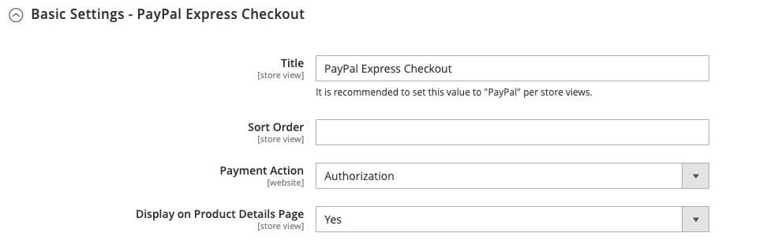

# PayPal Express-afhandeling

Met PayPal Express Checkout kunt u de verkoop verhogen door uw klanten de mogelijkheid te bieden met een creditcard of via de beveiliging van hun persoonlijke PayPal-rekening te betalen. Tijdens het afrekenen wordt de klant omgeleid naar de beveiligde PayPal-site om de betalingsgegevens te voltooien. De klant wordt dan teruggegeven aan uw opslag om de rest van het controleproces te voltooien. Als je Uitdrukkelijke afhandeling kiest, wordt de bekende PayPal-knop aan je winkel toegevoegd. Deze button wordt naar verluidt meer verkocht.

>[!IMPORTANT]
>
>**PSD2 Vereisten:**  
>Vanaf 14 september 2019, zouden de Europese banken betalingen kunnen verminderen die niet [ PSD2 ](../getting-started/compliance-payment-services-directive.md) vereisten voldoen. Er is geen actie nodig om PayPal Express Checkout te laten voldoen aan PSD2 omdat alle vereisten door PayPal worden afgehandeld.

Klanten met huidige PayPal-accounts kunnen in één stap een aankoop doen door op de knop _[!UICONTROL Check out with PayPal]_te klikken. Uitdrukkelijke afhandeling kan worden gebruikt als een zelfstandige, of met een van de PayPal alles-in-één oplossingen. Als je al online creditcards accepteert, kun je Express Checkout aanbieden als extra optie om nieuwe klanten aan te trekken die liever met PayPal betalen.

>[!NOTE]
>
>PayPal heeft steun voor de verkoop van digitale goederen door Uitdrukkelijke Betaling PayPal verouderd en adviseert dat u of [ de Norm van Betalingen van PayPal ](paypal-payments-standard.md) of een andere betaalgateway van PayPal gebruikt om het even welke orde te verwerken die [ virtuele producten ](../catalog/product-create-virtual.md) omvat.

## Vereisten

- Merchant: [ BedrijfsPayPal rekening ](https://www.paypal.com/webapps/mpp/how-to-sell-online)
- Klant: [ Persoonlijke Paypal- rekening ](https://www.paypal.com/webapps/mpp/buying-online)

## Workflow voor uitchecken

In tegenstelling tot andere betalingsmethoden kan de klant via PayPal Express Checkout aan het begin van de gebruikelijke afrekenworkflow uitchecken via de productpagina, de mini-winkelwagen en het winkelwagentje.

1. **Klant plaatst orde** - de klant klikt/tikt de _[!UICONTROL Check out with PayPal]_knoop.
1. **de Klant wordt opnieuw gericht aan de plaats van PayPal** - de klant wordt opnieuw gericht aan de plaats PayPal om de transactie te voltooien.
1. **de Klant login aan hun rekening PayPal** - de klant moet login aan hun rekening PayPal om de transactie te voltooien. Het betalingssysteem gebruikt de facturerings- en verzendgegevens van hun PayPal-rekening.
1. **Keert de Klant terug naar de controlepagina** - de klant wordt opnieuw gericht terug naar de controlepagina in uw opslag om de orde te herzien.
1. **Klant plaatst orde** - de klant plaatst de orde, en de ordeinformatie wordt voorgelegd aan PayPal.
1. **PayPal schikt de transactie** - PayPal ontvangt de orde en schikt de transactie.

>[!NOTE]
>
>PayPal Express Checkout ondersteunt geen bestellingen met meerdere adressen.

## Afhandeling in context

In-Context Checkout van PayPal _maakt het gemakkelijker dan ooit online te betalen._ Klanten verliezen uw winkel nooit uit het oog tijdens deze vereenvoudigde, naadloze afhandeling met één of twee klikken. In-context-afhandeling werkt net zo goed op computers en pc&#39;s en biedt een consistente ervaring op desktopcomputers, tablets en mobiele apparaten. Meer leren, zie [ In-Context Checkout in Uitdrukkelijke Controle ](https://www.paypal.com/rs/webapps/mpp/express-checkout).

{width="700" zoomable="yes"}

[_PayPal in-context checkout demo_ ](https://demo.paypal.com/us/demo/navigation?merchant=bigbox&amp;page=incontextProductCheckout)

Wanneer u de winkel configureert voor [!DNL PayPal Express Checkout] , kunt u deze optie inschakelen.

## Uw PayPal-account configureren

Voordat u PayPal Express Checkout instelt in Commerce Admin, moet u uw zakelijke account configureren op de Paypal-website.

1. Login aan uw Paypal Geavanceerde rekening bij [ manager.paypal.com ](https://manager.paypal.com/).

1. Ga naar **[!UICONTROL Service Settings]** > **[!UICONTROL Hosted Checkout Pages]** > **[!UICONTROL Set Up]** en stel de volgende instellingen in:

   - **[!UICONTROL AVS]**: `No`
   - **[!UICONTROL CSC]**: `No`
   - **[!UICONTROL Enable Secure Token]**: `Yes`

1. Klik op **[!UICONTROL Save Changes]**.

1. Een andere gebruiker instellen (aanbevolen door PayPal):

   - Ga naar [ manager.paypal.com ](https://manager.paypal.com/) en login aan uw rekening.

   - Volg de instructies om een andere gebruiker in te stellen.

   - Klik op **[!UICONTROL Update]**.

## PayPal Express Checkout instellen in Commerce

Er kunnen twee PayPal-oplossingen tegelijkertijd actief zijn: PayPal Express Checkout en een alles-in-één oplossing. Als u een andere oplossing inschakelt, wordt de eerder gebruikte oplossing automatisch gedeactiveerd.

>[!NOTE]
>
>Klik op **[!UICONTROL Save Config]** om de voortgang op te slaan.

### Stap 1: Begin met de configuratie

1. Voor _Admin_ sidebar, ga **[!UICONTROL Stores]** > _[!UICONTROL Settings]_>**[!UICONTROL Configuration]**.

1. Vouw in het linkerdeelvenster **[!UICONTROL Sales]** uit en kies **[!UICONTROL Payment Methods]** .

1. Als uw installatie meerdere websites, winkels of weergaven bevat, stelt u **[!UICONTROL Store View]** in op de winkelweergave waar u deze configuratie wilt toepassen.

1. Selecteer in de sectie _[!UICONTROL Merchant Location]_de **[!UICONTROL Merchant Country]**waar uw bedrijf zich bevindt.

   Deze instelling bepaalt de selectie van PayPal-oplossingen die in de configuratie worden weergegeven.

   {width="600" zoomable="yes"}

1. Klik onder _[!UICONTROL Recommended Solutions]_op **[!UICONTROL Configure]**for **[!UICONTROL PayPal Express Checkout]**.

   {width="600"}

### Stap 2: Je PayPal-account inschakelen en verbinden

1. Indien nodig, breid  de **[!UICONTROL Required PayPal Settings]** sectie uit.

   {width="600" zoomable="yes"}

1. Sluit uw account aan voor test- of productiedoeleinden:

   - Voor het testen (ontwikkeling) wijze, klik **[!UICONTROL Sandbox Credentials]** en ga uw [ PayPal zandbak ](https://developer.paypal.com/docs/api-basics/sandbox/) geloofsbrieven in.
   - Klik voor de productiemodus op **[!UICONTROL Connect with PayPal]** en voer de gegevens van uw productieaccount in.

   Wanneer de verbinding wordt gevalideerd, kunt u doorgaan.

1. Stel **[!UICONTROL Enable this Solution]** in op `Yes` .

1. Om [ PayPal in-Context Checkout ](#in-context-checkout) toe te laten:

   - Stel **[!UICONTROL Enable In-Context Checkout Experience]** in op `Yes` .

   - Voer je PayPal-rekening in **[!UICONTROL Merchant Account ID]** .

     Je zakelijke account-id staat in het profiel van je PayPal-rekening.

>[!NOTE]
>
>[ Krediet van PayPal ](paypal.md#paypal-credit-and-pay-later) wordt toegelaten door gebrek voor deze betalingsoptie.

### Stap 3: Voer de vereiste PayPal-instellingen in

1. Indien nodig, breid  de **[!UICONTROL Express Checkout]** sectie uit.

   {width="600" zoomable="yes"}

1. (Optioneel) Voer de **[!UICONTROL Email Associated with PayPal Merchant Account]** in.

   >[!IMPORTANT]
   >
   >E-mailadressen zijn hoofdlettergevoelig. Om betaling te ontvangen, moet het e-mailadres dat u invoert, overeenkomen met het e-mailadres dat is opgegeven in uw PayPal-handelsaccount.

   Klik op **[!UICONTROL Start accepting payments via PayPal]** als u geen PayPal-rekening hebt.

1. Stel **[!UICONTROL API Authentication Methods]** in op een van de volgende opties:

   - `API Signature` - Deze PayPal-verificatiemethode is het eenvoudigst te implementeren en is gebaseerd op uw gebruikersnaam, wachtwoord en een unieke tekenreeks met tekens en getallen die uw account identificeren. API-handtekeningreferenties verlopen niet.
   - `API Certificate` - Deze PayPal-verificatiemethode is veiliger en is gebaseerd op uw gebruikersnaam, wachtwoord en downloadbaar certificaat. API-referenties verlopen na drie jaar en moeten worden vernieuwd.

   Vul zo nodig het volgende in:

   - **[!UICONTROL API Username]**
   - **[!UICONTROL API Password]**
   - **[!UICONTROL API Signature]**

1. Stel **[!UICONTROL Sandbox Mode]** in op `Yes` als u referenties van uw sandboxaccount gebruikt.

   Wanneer het testen van de configuratie in een zandbak, gebruik slechts [ creditcardaantallen ](https://www.paypalobjects.com/en_AU/vhelp/paypalmanager_help/credit_card_numbers.htm) die door PayPal worden geadviseerd. Wanneer u gereed bent om te gaan produceren, gaat u terug naar de configuratie en stelt u de Sandbox-modus in op `No` en maakt u verbinding met uw productie-PayPal-account.

1. Als uw systeem een proxyserver gebruikt om de verbinding tussen Commerce en het PayPal-betalingssysteem tot stand te brengen, stelt u **[!UICONTROL API Uses Proxy]** in op `Yes` en voert u het volgende in:

   - **[!UICONTROL Proxy Host]**
   - **[!UICONTROL Proxy Port]**

Aan het einde van deze reeks stappen zijn de vereiste PayPal-instellingen voltooid. U kunt doorgaan met de instellingen Standaard en Geavanceerd of op **[!UICONTROL Save Config]** klikken en later terugkeren om de configuratie aan te passen

### Stap 4: Adverteer PayPal-creditering / Adverteer PayPal Later (optioneel)

Vanaf de release 2.4.3 wordt PayPal PayLater ondersteund in implementaties die PayPal bevatten. Met deze functie kunnen kopers een bestelling in tweewekelijkse termijnen betalen in plaats van het volledige bedrag op het moment van aankoop te betalen. De PayPal-ervaring is afgekeurd.

Stel **[!UICONTROL Enable PayPal PayLater Experience]** in op een van de volgende opties:

- `Yes` - Meer informatie over PayPal PayPal instellen
- `No` - Adverteer PayPal-creditering instellen

>[!NOTE]
>
>Met de instelling **[!UICONTROL Enable PayPal PayLater Experience]** wordt de functie [!DNL PayPal PayLater] niet uitgeschakeld en worden de knoppen **_[!UICONTROL PayPal PayLater]_** niet uit het winkelcentrum verwijderd. Als u zowel de knop **_[!UICONTROL PayPal PayLater]_** als de knop **_[!UICONTROL PayPal Credit]_** op de winkelachtergrond wilt uitschakelen, moet u de waarde `PayPal Credit` selecteren voor de instelling **[!UICONTROL Disable Funding Options]** ( [!UICONTROL Advanced Settings] onder [!UICONTROL Frontend Experience Settings] ).

#### PayPal-krediet adverteren

1. Breid  de **[!UICONTROL Advertise PayPal Credit]** sectie uit.

1. Klik op **[!UICONTROL Get Publisher ID from PayPal]** en volg de instructies op uw account om uw accountgegevens op te vragen.

1. Voer uw **[!UICONTROL Publisher ID]** in.

   {width="600" zoomable="yes"}

1. Breid  de **[!UICONTROL Home Page]** sectie uit.

1. Stel **[!UICONTROL Display]** in op `Yes` als u een banner op de pagina wilt plaatsen.

1. Stel **[!UICONTROL Position]** in op een van de volgende opties:

   - `Header (center)`
   - `Sidebar (right)`

1. Stel **[!UICONTROL Size]** in op een van de volgende opties:

   - `190 x 100`
   - `234 x 60`
   - `300 x 50`
   - `468 x 60`
   - `728 x 90`
   - `800 x 66`

   {width="600" zoomable="yes"}

1. Breid  de resterende secties uit en herhaal de vorige stappen:

   - [!UICONTROL Catalog Category Page]
   - [!UICONTROL Catalog Product Page]
   - [!UICONTROL Checkout Cart Page]

#### Adverteer PayPal PayPal Later

1. Breid  de **[!UICONTROL Advertise PayPal PayLater]** sectie uit.

1. Stel **[!UICONTROL Enable PayPal PayLater]** in op `Yes` .

1. Breid  de **[!UICONTROL Home Page]** sectie uit.

1. Stel **[!UICONTROL Display]** in op `Yes` als u een banner op de pagina wilt plaatsen.

1. Stel **[!UICONTROL Position]** in op een van de volgende opties:

   - `Header (center)`
   - `Sidebar`

1. Stel **[!UICONTROL Style Layout]** in op een van de volgende opties:

   - `Text`
   - `Flex`

1. Stel [!UICONTROL Style Layout] alleen **[!UICONTROL Text]** in op een van de volgende opties: **[!UICONTROL Logo Type]**

   - `Primary`
   - `Alternative`
   - `Inline`
   - `None`

1. Stel [!UICONTROL Style Layout] alleen **[!UICONTROL Text]** in op een van de volgende opties: **[!UICONTROL Logo Position]**

   - `Left`
   - `Right`
   - `Top`

1. Stel [!UICONTROL Style Layout] alleen **[!UICONTROL Text]** in op een van de volgende opties: **[!UICONTROL Text Color]**

   - `Black`
   - `White`
   - `Monochrome`
   - `Grayscale`

1. Stel [!UICONTROL Style Layout] alleen **[!UICONTROL Text]** in op een van de volgende opties: **[!UICONTROL Text Size]**

   - `10px`
   - `11px`
   - `12px`
   - `13px`
   - `14px`
   - `15px`
   - `16px`

1. Stel [!UICONTROL Style Layout] alleen **[!UICONTROL Flex]** in op een van de volgende opties: **[!UICONTROL Ratio]**

   - `1x1`
   - `1x4`
   - `8x1`
   - `20x1`

1. Stel [!UICONTROL Style Layout] alleen **[!UICONTROL Flex]** in op een van de volgende opties: **[!UICONTROL Color]**

   - `Blue`
   - `Black`
   - `White`
   - `White No Border`
   - `Gray`
   - `Monochrome`
   - `Grayscale`

   {width="600" zoomable="yes"}

1. Breid  de resterende secties uit en herhaal de vorige stappen:

   - [!UICONTROL Catalog Product Page]
   - [!UICONTROL Checkout Cart Page]
   - [!UICONTROL Checkout Payment Step]
   - [!UICONTROL Catalog Category Page]

### Stap 5: De basisinstellingen voltooien

1. Breid  de **[!UICONTROL Basic Settings - PayPal Express Checkout]** sectie uit.

   {width="600" zoomable="yes"}

1. Voer bij **[!UICONTROL Title]** een titel in die deze betalingsmethode identificeert tijdens het afrekenen.

   Het wordt geadviseerd dat u de titel _PayPal_ voor alle opslagmeningen gebruikt.

1. Als u meerdere betalingsmethoden aanbiedt, voert u een getal voor **[!UICONTROL Sort Order]** in om de volgorde te bepalen waarin PayPal Express Checkout wordt weergegeven wanneer deze bij de andere betalingsmethoden wordt aangeboden.

   Dit getal is relatief ten opzichte van de andere betalingsmethoden. (`0` = first, `1` = second, `2` = third, enzovoort.)

1. Stel **[!UICONTROL Payment Action]** in op een van de volgende opties:

   - `Authorization` - Hiermee gaat u akkoord met de aankoop en houdt u de middelen in de wacht. Het bedrag wordt niet teruggetrokken tot het __ door de koopman wordt gevangen.
   - `Sale` - Het bedrag van de aankoop wordt geautoriseerd en onmiddellijk van de rekening van de klant teruggetrokken.
   - `Order` - Het bedrag van de bestelling wordt niet vastgelegd of geautoriseerd op de klantenbalans, bankrekening of creditcard bij PayPal. De betalingsactie voor bestellingen is een overeenkomst tussen het PayPal-betalingssysteem en de handelaar. Het stelt de handelaar in staat een of meer bedragen tot het geordende totaal van de klantenkopersrekening over een periode van maximaal 29 dagen af te halen. Nadat de fondsen zijn besteld, kan de handelaar ze op elk moment gedurende de volgende periode van 29 dagen opvangen. Het vastleggen van het orderbedrag kan alleen worden uitgevoerd vanuit Commerce Admin door een of meer facturen te maken.

1. Stel _[!UICONTROL Check out with PayPal]_in op **[!UICONTROL Display on Product Details Page]**om de knop `Yes` op de productpagina weer te geven.

1. Als de betalingsactie is ingesteld op `Order` , voert u de volgende handelingen uit

   - **[!UICONTROL Authorization Honor Period (days)]** - Hiermee bepaalt u hoe lang de primaire autorisatie geldig blijft. De waarde moet gelijk zijn aan de corresponderende waarde in je PayPal-handelsaccount. De standaardwaarde in uw PayPal Merchant-account is `3` . Neem contact op met PayPal om dit aantal te verhogen. De vergunning wordt ongeldig om 11 :49 p.m., de Tijd van de Stille Oceaan van de V.S., van de laatste dag.

   - **[!UICONTROL Order Valid Period (days)]** - Hiermee wordt bepaald hoelang de volgorde geldig blijft. Wanneer de bestelling ongeldig wordt, kunt u er geen facturen meer voor maken. Geef de waarde op die gelijk is aan de waarde voor Geldige periode bestellen in uw PayPal-zakelijke account. De standaardwaarde in uw PayPal Merchant-account is `29` . Als je dit nummer wilt wijzigen, moet je contact opnemen met PayPal.

   - **[!UICONTROL Number of Child Authorizations]** - Geeft het maximumaantal machtigingen voor één bestelling op. Hiermee wordt het maximumaantal gedeeltelijke onlinefacturen bepaald dat u voor een bestelling kunt maken. Deze waarde moet gelijk zijn aan de corresponderende instelling in uw PayPal-handelsaccount. Het standaardaantal onderliggende autorisaties in uw Paypal-account is `1` . Neem contact op met PayPal om dit aantal te verhogen.

### Stap 6: De geavanceerde instellingen voltooien

1. Breid  de **[!UICONTROL Advanced Settings]** sectie uit.

   {width="600" zoomable="yes"}

1. Stel **[!UICONTROL Display on Shopping Cart]** in op `Yes` .

1. Stel **[!UICONTROL Payment Applicable From]** in op een van de volgende opties:

   - `All Allowed Countries` - Klanten uit alle landen die in uw winkelconfiguratie zijn opgegeven, kunnen deze betalingsmethode gebruiken.
   - `Specific Countries` - Nadat u deze optie hebt gekozen, wordt de lijst _[!UICONTROL Payment from Specific Countries]_weergegeven. Als u meerdere landen wilt selecteren, houdt u Ctrl (PC) of Command (Mac) ingedrukt en klikt u op elk item.

1. Als u communicatie met het betalingssysteem naar het logbestand wilt schrijven, stelt u **[!UICONTROL Debug Mode]** in op `Yes` .

   Het logbestand voor Paypal Payments Advanced is `_payflow_advanced.log` .

   >[!NOTE]
   >
   >In overeenstemming met de normen van de Veiligheid van Gegevens PCI, wordt de creditcardinformatie niet geregistreerd in het logboekdossier.

1. Als u verificatie van de authenticiteit van de host wilt inschakelen, stelt u **[!UICONTROL Enable SSL Verification]** in op `Yes` .

1. Stel **[!UICONTROL Transfer Cart Line Items]** in op `Yes` als u een volledig overzicht van de bestelling van de klant per lijstitem vanaf de PayPal-site wilt weergeven.

1. Als u maximaal tien verzendopties in het overzicht wilt opnemen, stelt u **[!UICONTROL Transfer Shipping Options]** in op `Yes` . (Deze optie wordt alleen weergegeven als regelitems zijn ingesteld op overdracht.)

1. Stel **[!UICONTROL Shortcut Buttons Flavor]** in op een van de volgende opties om te bepalen welk type afbeelding wordt gebruikt voor de PayPal-acceptatieknop:

   - `Dynamic` - (Aanbevolen) Hiermee wordt een afbeelding weergegeven die dynamisch kan worden gewijzigd van de PayPal-server.
   - `Static` - Geeft een specifieke afbeelding weer die niet dynamisch kan worden gewijzigd.

1. Stel **[!UICONTROL Enable PayPal Guest Checkout]** in op `Yes` als u wilt dat klanten zonder PayPal-accounts een aankoop kunnen doen met deze methode.

1. Stel **[!UICONTROL Require Customer's Billing Address]** in op een van de volgende opties:

   - `Yes` - Vereist het factuuradres van de klant voor alle aankopen.
   - `No` - Voor aankopen is het factuuradres van de klant niet vereist.
   - `For Virtual Quotes Only` - Vereist het factureringsadres van de klant slechts voor virtuele citaten.

   >[!NOTE]
   >
   >Deze functie moet zijn ingeschakeld voor het zakelijke account via technische ondersteuning van PayPal.

1. (Facultatief) plaats **[!UICONTROL Billing Agreement Signup]** om klanten toe te staan om a [ factureringsovereenkomst ](paypal-billing-agreements.md) met uw opslag in het PayPal betalingssysteem te ondertekenen wanneer er geen actieve factureringsovereenkomsten beschikbaar in de klantenrekening zijn:

   - `Auto` - De klant kan of een factureringsovereenkomst tijdens de Uitdrukkelijke stroom van de Afhandeling ondertekenen of een andere methode van betaling gebruiken.
   - `Ask Customer` - De klant kan beslissen of hij een factureringsovereenkomst ondertekent tijdens de uitcheckprocedure.
   - `Never` - De klant kan geen factureringsovereenkomst ondertekenen tijdens de expresafhandeling.

   >[!NOTE]
   >
   >De handelaren moeten [ PayPal Merchant Technische Steun ](https://developer.paypal.com/support/) vragen om factureringsovereenkomsten in hun rekeningen toe te laten. De _Opname van de Overeenkomst van de Facturering_ parameter wordt toegelaten slechts nadat PayPal bevestigt dat de factureringsovereenkomsten voor uw handelaarrekening worden toegelaten.

1. Stel **[!UICONTROL Skip Order Review Step]** in op `Yes` als u de klant wilt toestaan de transactie van de PayPal-site te voltooien zonder deze terug te sturen naar uw winkel voor het reviseren van bestellingen.

1. Vul de aanvullende secties in die nodig zijn voor uw winkel:

   - [Instellingen van betalingsovereenkomst](#paypal-billing-agreement-settings)
   - [Instellingen voor afwikkelingsrapport](#settlement-report-settings)
   - [Instellingen voor voorvertoning](#frontend-experience-settings)
   - [Slimme knoppen aanpassen](#customize-smart-buttons)
   - [Functies](#features)

1. Klik op **[!UICONTROL Save Config]** als de bewerking is voltooid.

#### Instellingen van PayPal-factureringsovereenkomst

A [ factureringsovereenkomst ](paypal-billing-agreements.md) is een verkoopovereenkomst tussen de handelaar en de klant die door PayPal voor gebruik met veelvoudige orden is gemachtigd. Tijdens het afrekenen wordt de betalingsoptie Factureringsovereenkomst alleen weergegeven voor klanten die al een factureringsovereenkomst met uw bedrijf hebben gesloten. Nadat PayPal de overeenkomst heeft goedgekeurd, geeft het betalingssysteem een unieke referentie-id uit om elke bestelling te identificeren die aan de overeenkomst is gekoppeld. Net als bij een inkooporder is er geen limiet voor het aantal factureringsovereenkomsten dat een klant met uw bedrijf kan maken.

1. Breid  de **[!UICONTROL PayPal Billing Agreement Settings]** sectie uit.

   {width="600" zoomable="yes"}

1. Stel **[!UICONTROL Enabled]** in op `Yes` .

1. Voer bij **[!UICONTROL Title]** een titel in die de methode van de PayPal-factureringsovereenkomst aangeeft tijdens het afrekenen.

1. Als u meerdere betalingsmethoden aanbiedt, voert u in het veld **[!UICONTROL Sort Order]** een getal in om de volgorde te bepalen waarin Factureringsovereenkomst wordt weergegeven wanneer deze bij andere betalingsmethoden wordt aangeboden tijdens het afrekenen.

1. Stel **[!UICONTROL Payment Action]** in op een van de volgende opties:

   - `Authorization` - Hiermee gaat u akkoord met de aankoop en houdt u de middelen in de wacht. De hoeveelheid wordt pas opgevraagd wanneer deze door de handelaar wordt &quot;gevangen&quot;.
   - `Sale` - Het bedrag van de aankoop wordt geautoriseerd en onmiddellijk van de rekening van de klant teruggetrokken.

1. Stel **[!UICONTROL Payment Applicable From]** in op een van de volgende opties:

   - `All Allowed Countries` - Klanten uit alle landen die in uw winkelconfiguratie zijn opgegeven, kunnen deze betalingsmethode gebruiken.
   - `Specific Countries` - Nadat u deze optie hebt gekozen, wordt de lijst _[!UICONTROL Payment from Specific Countries]_weergegeven. Als u meerdere landen wilt selecteren, houdt u Ctrl (PC) of Command (Mac) ingedrukt en klikt u op elk land.

1. Als u de communicatie met het betalingssysteem wilt opnemen in het logbestand, stelt u **[!UICONTROL Debug Mode]** in op `Yes` .

   >[!NOTE]
   >
   >Het logbestand wordt opgeslagen op de server en is alleen toegankelijk voor ontwikkelaars. In overeenstemming met de normen van de Veiligheid van Gegevens PCI, wordt de creditcardinformatie niet geregistreerd in het logboekdossier.

1. Als u SSL-verificatie wilt inschakelen, stelt u **[!UICONTROL Enable SSL Verification]** in op `Yes` .

1. Als u een overzicht wilt weergeven van elk regelitem in de bestelling van de klant op de pagina met PayPal-betalingen, stelt u **[!UICONTROL Transfer Cart Line Items]** in op `Yes` .

1. Stel **[!UICONTROL Allow in Billing Agreement Wizard]** in op `Yes` als u klanten wilt toestaan een factureringsovereenkomst te starten vanaf het dashboard van hun klantenaccount.

#### Instellingen voor afwikkelingsrapport

1. Breid  de **[!UICONTROL Settlement Report Settings]** sectie uit.

   {width="600" zoomable="yes"}

1. Voer voor **[!UICONTROL SFTP Credentials]** de volgende handelingen uit:

   - Als u zich hebt aangemeld bij de PayPal Secure FTP-server, voert u de volgende SFTP-aanmeldgegevens in:

      - Aanmelden
      - Wachtwoord

   - Om testrapporten in werking te stellen alvorens _levend_ met Uitdrukkelijke Controle op uw plaats te gaan, plaats **[!UICONTROL Sandbox Mode]** aan `Yes`.

   - Voer de **[!UICONTROL Custom Endpoint Hostname or IP Address]** in.

     De standaardwaarde is: `reports.paypal.com`

   - Voer de **[!UICONTROL Custom Path]** in waarin rapporten worden opgeslagen.

     De standaardwaarde is: `/ppreports/outgoing`

1. Als u rapporten wilt genereren volgens een schema, voert u de **[!UICONTROL Scheduled Fetching]** -instellingen in:

   - Stel **[!UICONTROL Enable Automatic Fetching]** in op `Yes` .

   - Stel **[!UICONTROL Schedule]** in op een van de volgende opties:

      - `Daily`
      - `Every 3 Days`
      - `Every 7 Days`
      - `Every 10 Days`
      - `Every 14 Days`
      - `Every 30 Days`
      - `Every 40 Days`

     PayPal bewaart elk rapport 45 dagen.

   - Stel **[!UICONTROL Time of Day]** in op het uur, de minuut en de seconde waarop u de rapporten wilt genereren.

#### Instellingen voor voorvertoning

Met de instellingen voor de vooraf ingestelde ervaring kunt u kiezen welke PayPal-logo&#39;s op uw site worden weergegeven en kunt u de weergave van uw winkelpagina&#39;s van PayPal aanpassen.

1. Breid  de **[!UICONTROL Frontend Experience Settings]** sectie uit.

   {width="600" zoomable="yes"}

1. Selecteer de **[!UICONTROL PayPal Product Logo]** die u in het PayPal-blok in uw winkel wilt weergeven.

   De PayPal-logo&#39;s zijn beschikbaar in vier stijlen en twee formaten:

   - `No Logo`
   - `We Prefer PayPal (150 x 60 or 150 x 40)`
   - `Now Accepting PayPal (150 x 60 or 150 x 40)`
   - `Payments by PayPal (150 x 60 or 150 x 40)`
   - `Shop Now Using PayPal (150 x 60 or 150 x 40)`

1. Ga als volgt te werk om de weergave van je PayPal-winkelpagina&#39;s aan te passen:

   - Voer de naam in van de **[!UICONTROL Page Style]** die u wilt toepassen op de handelspagina&#39;s van PayPal:

      - `paypal` - Gebruikt de paginastijl van PayPal.
      - `primary` - gebruikt de paginastijl die u als _primaire_ stijl in uw rekeningsprofiel identificeerde.
      - `your_custom_value` - Gebruikt een aangepaste paginastijl voor betalingen, die in uw accountprofiel is opgegeven.

   - Voer bij **[!UICONTROL Header Image URL]** de URL in van de afbeelding die u in de linkerbovenhoek van de betaalpagina wilt weergeven. De maximale bestandsgrootte is 750 pixels breed en 90 pixels hoog.

     >[!NOTE]
     >
     >PayPal raadt aan de afbeelding op een beveiligde server (https) te plaatsen. Anders, kan browser waarschuwen dat _de pagina zowel veilige als niet veilige punten_ bevat.

   - Als u de kleur voor uw pagina&#39;s wilt instellen, voert u voor elk van de volgende handelingen de zestekenige hexadecimale code in, zonder het symbool `#` :

      - **[!UICONTROL Header Background Color]** - Achtergrondkleur voor de koptekst van de uitcheckpagina.
      - **[!UICONTROL Header Border Color]** - Kleur voor rand van twee pixels rond de koptekst.
      - **[!UICONTROL Page Background Color]** - Achtergrondkleur voor de uitcheckpagina en rond de koptekst en het betalingsformulier.

#### Slimme knoppen aanpassen

De _Slimme eigenschap van de Knopen van de Betaling_ staat u toe om de knoop van PayPal aan te passen, die op de pagina&#39;s van de Afhandeling, van het Productdetail, van de Kar, en van de MinKaart kan worden getoond. Uit intern onderzoek van PayPal blijkt dat de standaardopties zeer herkenbaar zijn en tot hogere aankoopsnelheden kunnen leiden, maar dat de standaardinstellingen niet overeenkomen met die van uw winkel. U kunt kiezen:

- De grootte, kleur en vorm van de PayPal-knop
- De tekst die wordt weergegeven op de PayPal-knop
- De lay-out wanneer meerdere knoppen worden weergegeven (horizontaal of verticaal)

Om knopen aan te passen, breid  elk van de volgende secties uit en pas de montages aan:

- **[!UICONTROL Checkout Page]**
- **[!UICONTROL Product Pages]**
- **[!UICONTROL Cart Page]**
- **[!UICONTROL Mini Cart]**

{width="600" zoomable="yes"}

**_To vormt de knoopvertoning voor elk paginatype:_**

1. Breid  de sectie uit.

1. Stel **[!UICONTROL Customize Button]** in op `Yes` .

1. Als u de tekst wilt instellen die door PayPal wordt weergegeven op de knop voor slimme betalingen, stelt u **[!UICONTROL Label]** in op een van de volgende opties:

   - `Checkout` - PayPal-afhandeling
   - `Pay` - PayPal-afhandeling
   - `Buy Now` - Nu kopen met PayPal
   - `PayPal` - PayPal
   - `Installment` - PayPal
   - `Credit` - PayPal-krediet

1. Stel **[!UICONTROL Layout]** in op een van de volgende opties:

   - `Vertical` - (Standaard) Geeft slimme PayPal-knoppen verticaal weer. De koper moet zich aanmelden bij PayPal of een PayPal-account maken, ongeacht of **[!UICONTROL Enable Guest Checkout]** is geselecteerd.
   - `Horizontal` - Geeft slimme PayPal-knoppen horizontaal weer. Wanneer **[!UICONTROL Enable Guest Checkout]** is geselecteerd, wordt de knop **[!UICONTROL Pay with Debit Card or Credit Card]** weergegeven in het pop-upvenster van PayPal. Anders moet de koper zich aanmelden bij PayPal of een PayPal-rekening maken.

1. Stel **[!UICONTROL Size]** in op een van de volgende opties:

   - `Medium` - 250 pixels bij 35 pixels.
   - `Large` - 350 pixels bij 40 pixels.
   - `Responsive` - (Standaard) Hiermee past u de breedte van de container aan. De minimale breedte is 100 pixels en de maximale breedte is 500 pixels. De hoogte wordt dynamisch aangepast op basis van de breedte.

1. Stel **[!UICONTROL Shape]** in op een van de volgende opties:

   - `Pill` - (Standaard) De knop heeft de vorm van een vulling (lang in het midden en gekromd aan de uiteinden).
   - `Rectangle` - Vierkante vorm, zonder curven, in een rechthoek.

1. Stel **[!UICONTROL Color]** in op een van de volgende opties:

   - `Gold` (standaard)
   - `Blue`
   - `Silver`
   - `Black`

#### Functies

Met de instellingen voor functies kunt u bepaalde functies voor deze PayPal-oplossing uitschakelen.

1. Breid  de **[!UICONTROL Features]** sectie uit.

   {width="600" zoomable="yes"}

1. Plaats **[!UICONTROL Disable Funding Options]** om te bepalen welke andere PayPal financieringsopties op de _uitcheckpagina_ worden getoond.

   De geselecteerde opties worden niet getoond op de _Controle_ pagina. Niet-geselecteerde opties worden alleen weergegeven als PayPal de winkelvaluta en de locatie van de koper ondersteunt. U kunt onder andere de volgende opties kiezen:

   - PayPal-creditering
   - Venmo
   - PayPal-pictogrammen voor afhandeling via PayPal-rekening
   - Elektronisches Lastschriftverfahren - Duitse ELV
