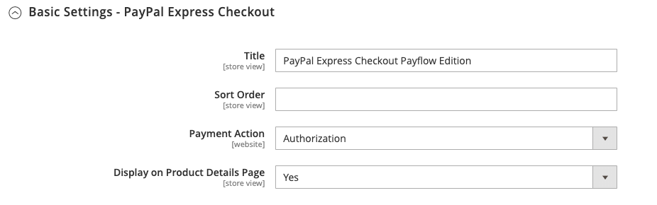

# PayPal Payflow Pro

PayPal Payflow Pro-gateway, voorheen bekend als _Verisign_, is beschikbaar voor klanten van de Verenigde Staten, Canada, Australië, en Nieuw-Zeeland. In tegenstelling tot andere PayPal-betalingsmethoden worden handelaren een vaste maandelijkse vergoeding aangerekend, plus een vaste vergoeding voor elke transactie, ongeacht het nummer.

{width="700" zoomable="yes"}

>[!IMPORTANT]
>
>**PSD2 Eisen:**  
>Vanaf 14 september 2019 zouden Europese banken betalingen kunnen terugdringen die niet voldoen aan [PSD 2](../getting-started/compliance-payment-services-directive.md) eisen. Om te voldoen aan PSD2, moet PayPal Payflow Pro zijn geïntegreerd met een externe insteekmodule. Zie voor meer informatie [3-D veilig voor Payflow](https://developer.paypal.com/api/nvp-soap/payflow/3d-secure-mpi/).

## Vereisten

- [PayPal Business-account][1] - De PayPal Payflow Pro-gateway koppelt de zakelijke rekening bij PayPal aan de commerciële website, die als gateway en als handelsrekening fungeert.

- Als u meerdere Adobe Commerce- en Magento Open Source-websites beheert, moet u voor elke website een aparte PayPal Merchant-account hebben.

## Workflow van de klant

1. **Klant gaat naar de kassa** - Tijdens het afrekenen kiest de klant ervoor te betalen met PayPal Payflow Pro en voert de creditcardgegevens in. Klanten hoeven geen persoonlijke PayPal-rekeningen te hebben. Afhankelijk van het handelende land kunnen klanten echter ook hun persoonlijke PayPal-rekening gebruiken om voor de bestelling te betalen.
1. **Klant verzendt bestelling** - De klant verzendt de bestelling en de bestelgegevens worden naar PayPal verzonden voor verwerking. De klant verlaat de afhandelingspagina van uw site niet.
1. **PayPal voltooit de transactie** - Betalingen worden aanvaard op het tijdstip waarop de bestelling wordt geplaatst. Afhankelijk van de betalingsactie die in de configuratie is opgegeven, wordt een verkooporder of een verkooporder en een factuur gemaakt.

## Workflow voor online orderverwerking

1. **Beheerder verzendt online factuur** - De beheerder van de winkel dient een online factuur in en er wordt dan een bijbehorende transactie en factuur aangemaakt.
1. **PayPal ontvangt de transactie** - De bestellingsgegevens worden naar PayPal verzonden. Er wordt een overzicht van de transactie en een factuur gegenereerd. U kunt alle Payflow Pro Gateway-transacties in uw [PayPal Merchant-account][2].

>[!NOTE]
>
>Gedeeltelijke facturen en gedeeltelijke terugbetalingen worden niet ondersteund door PayPal Payflow Pro.

## Uw PayPal-account configureren

1. Aanmelden bij uw [PayPal-zakelijke account][2].

1. Vorm [Gehoste afhandelingspagina&#39;s][4] met PayPal Manager de volgende instellingen:

   - Onder **[!UICONTROL Choose your settings]**, set **[!UICONTROL Transaction Process Mode]** tot `Live`.

   - Onder **[!UICONTROL Display options on payment page]**, set **URL-methode annuleren** tot `POST`.

   - Onder **[!UICONTROL Billing Information]**, selecteert u de beveiligingscode van de kaart **[!UICONTROL CSC]** selectievakjes voor vereiste en bewerkbare velden.

   - Onder **[!UICONTROL Payment Confirmation]**, set **[!UICONTROL Return URL Method]** tot `POST`.

   - Onder **[!UICONTROL Security Options]**, voer de volgende instellingen in:

      - **[!UICONTROL AVS]**: `No`
      - **[!UICONTROL CSC]**: `No`
      - **[!UICONTROL Enable Secure Token]**: `Yes`

   - Kies **[!UICONTROL Customize]** en kies vervolgens **[!UICONTROL Layout C]**.

     Layout C geeft alleen velden voor creditcards en betaalkaarten weer en kan op uw site worden geframed of als een zelfstandig popup worden gebruikt. De grootte is vast op 490 x 565 pixels, met extra ruimte voor foutberichten. Op sommige systemen corrigeert deze instelling een probleem met transparante omleiding.

1. Wanneer de configuratie-instellingen zijn voltooid, klikt u op **[!UICONTROL Save and Publish]**.

1. Kies in het menu PayPal Manager de optie **[!UICONTROL Account Administration]**.

1. Onder **[!UICONTROL Manage Security]**, klikt u op **[!UICONTROL Transaction Settings]** en voer de volgende handelingen uit:

   - Set **[!UICONTROL Allow reference transactions]** tot `Yes`.

   - Klik op **[!UICONTROL Confirm]**.

     >[!NOTE]
     >
     >Als u meerdere handels-websites hebt, moet u voor elke website een aparte geavanceerde Paypal-betalingsaccount maken.

1. Een andere gebruiker instellen (aanbevolen door PayPal):

   - Klik in de tweede rij van het hoofdmenu op **[!UICONTROL Manage Users]**.

   - Als u nog een gebruiker aan de account wilt toevoegen, klikt u op **[!UICONTROL Add User]**. De koppeling bevindt zich net boven de titel Gebruikers beheren.

   - Vul de vereiste velden in de volgende secties van het dialoogvenster _[!UICONTROL Add User]_formulier:

      - [!UICONTROL Admin Confirmation]
      - [!UICONTROL User Information]
      - [!UICONTROL User Login Information]
      - [!UICONTROL Assign Privilege to User]

   - Klik op **[!UICONTROL Update]**.

1. Log uit van je PayPal-rekening.

## PayPal Payflow Pro instellen in de handel

>[!TIP]
>
>Klikken **[!UICONTROL Save Config]** om uw voortgang op elk gewenst moment op te slaan.

### Stap 1: Begin met de configuratie

Bij deze instelmethode wordt ervan uitgegaan dat u een bestaand PayPal-account hebt.

1. Op de _Beheerder_ zijbalk, ga naar **[!UICONTROL Stores]** > _[!UICONTROL Settings]_>**[!UICONTROL Configuration]**.

1. Vouw in het linkerdeelvenster uit **[!UICONTROL Sales]** en kiest u **[!UICONTROL Payment Methods]**.

1. Als uw installatie van de Handel veelvoudige websites, opslag, of meningen heeft, plaats **[!UICONTROL Store View]** op de archiefmening waar u deze configuratie wilt toepassen.

1. In de _[!UICONTROL Merchant Location]_selecteert u de **[!UICONTROL Merchant Country]**waar uw bedrijf wordt gevestigd.

   Deze instelling bepaalt de selectie van PayPal-oplossingen die in de configuratie worden weergegeven.

   {width="600" zoomable="yes"}

1. Uitbreiden **[!UICONTROL PayPal Payment Gateways]** (indien nodig) en klik op **[!UICONTROL Configure]** for **[!UICONTROL Payflow Pro]**.

   {width="600" zoomable="yes"}

### Stap 2: Voltooi de vereiste PayPal-instellingen

{width="600" zoomable="yes"}

1. (Optioneel) Voer de **[!UICONTROL Email Associated with your PayPal Merchant Account]**.

   >[!IMPORTANT]
   >
   >E-mailadressen zijn hoofdlettergevoelig. Als je een betaling wilt ontvangen, moet het e-mailadres overeenkomen met het e-mailadres dat is opgegeven in je PayPal Merchant-account.

1. Voer een van de volgende gegevens in waarmee u zich aanmeldt bij uw PayPal-zakelijke account:

   - **[!UICONTROL Partner]** - Je PayPal-partner-id.
   - **[!UICONTROL User]** - De id van een andere gebruiker die is ingesteld op uw PayPal-account.
   - **[!UICONTROL Vendor]** - De gebruikersnaam van uw PayPal-gebruikersaanmelding.

1. Voer de **[!UICONTROL Password]** die aan uw PayPal-account is gekoppeld.

1. Als u testtransacties wilt uitvoeren, stelt u **[!UICONTROL Test Mode]** tot `Yes`.

   Gebruik bij het testen van de configuratie in een sandbox alleen [creditcardnummers][3] die worden aanbevolen door PayPal. Wanneer u klaar bent om naar productie te gaan, terugkeer naar de configuratie en plaats de Wijze van de Test aan `No`.

1. Als uw systeem een proxyserver gebruikt om de verbinding met het PayPal-systeem tot stand te brengen, stelt u **[!UICONTROL Use Proxy]** tot `Yes` en voer de volgende handelingen uit:

   - Voer het IP-adres in van de **[!UICONTROL Proxy Host]**.

   - Voer het poortnummer in van het dialoogvenster **[!UICONTROL Proxy Port]**.

     Er wordt een proxy gebruikt wanneer de serverfirewall directe toegang tot de PayPal-server voorkomt. In een dergelijk geval, wordt een derdenserver gebruikt om verkeer af te lossen.

1. Set **[!UICONTROL Enable this Solution]** tot `Yes`.

1. Als je wilt aanbieden [PayPal-creditering](paypal.md#paypal-credit-and-pay-later) aan uw klanten, reeks **[!UICONTROL Enable PayPal Credit]** tot `Yes`.

1. Als u de gegevens van de klantenbetaling/creditcard veilig wilt opslaan, zodat klanten niet telkens opnieuw betalingsgegevens hoeven in te voeren, stelt u **[!UICONTROL Vault Enabled]** tot `Yes`.

### Stap 3: Adverteer PayPal-creditering / Adverteer PayPal Later (optioneel)

Vanaf de release 2.4.3 wordt PayPal PayLater ondersteund in implementaties die PayPal bevatten. Met deze functie kunnen kopers een bestelling in tweewekelijkse termijnen betalen in plaats van het volledige bedrag op het moment van aankoop te betalen. De PayPal-ervaring is afgekeurd.

Set **[!UICONTROL Enable PayPal PayLater Experience]** op een van de volgende wijzen:

- `Yes` - Adverteer PayPal PayPal later instellen
- `No` - Adverteren van PayPal-krediet instellen

#### PayPal-krediet adverteren

1. Uitbreiden  de **[!UICONTROL Advertise PayPal Credit]** sectie.

   {width="600" zoomable="yes"}

1. Klik op **[!UICONTROL Get Publisher ID from PayPal]** en volgt u de instructies.

1. Voer uw **[!UICONTROL Publisher ID]**.

1. Uitbreiden  de **[!UICONTROL Home Page]** sectie.

   {width="600" zoomable="yes"}

1. Als u een banner op de pagina wilt plaatsen, stelt u **[!UICONTROL Display]** tot `Yes`.

1. Set **[!UICONTROL Position]** op een van de volgende wijzen:

   - `Header (center)`
   - `Sidebar (right)`

1. Set **[!UICONTROL Size]** op een van de volgende wijzen:

   - `190 x 100`
   - `234 x 60`
   - `300 x 50`
   - `468 x 60`
   - `728 x 90`
   - `800 x 66`

1. Uitbreiden  de overige secties en herhaal de vorige stappen voor de instellingen van de homepage:

   - **[!UICONTROL Catalog Category Page]**
   - **[!UICONTROL Catalog Product Page]**
   - **[!UICONTROL Checkout Cart Page]**

#### Adverteer PayPal PayPal Later

1. Uitbreiden  de **[!UICONTROL Advertise PayPal PayLater]** sectie.

1. Set **[!UICONTROL Enable PayPal PayLater]** tot `Yes`.

1. Uitbreiden  de **[!UICONTROL Home Page]** sectie.

   {width="600" zoomable="yes"}

1. Als u een banner op de pagina wilt plaatsen, stelt u **[!UICONTROL Display]** tot `Yes`.

1. Set **[!UICONTROL Position]** op een van de volgende wijzen:

   - `Header (center)`
   - `Sidebar`

1. Set **[!UICONTROL Style Layout]** op een van de volgende wijzen:

   - `Text`
   - `Flex`

1. Voor [!UICONTROL Style Layout] **[!UICONTROL Text]** alleen, instellen **[!UICONTROL Logo Type]** op een van de volgende wijzen:

   - `Primary`
   - `Alternative`
   - `Inline`
   - `None`

1. Voor [!UICONTROL Style Layout] **[!UICONTROL Text]** alleen, instellen **[!UICONTROL Logo Position]** op een van de volgende wijzen:

   - `Left`
   - `Right`
   - `Top`

1. Voor [!UICONTROL Style Layout] **[!UICONTROL Text]** alleen, instellen **[!UICONTROL Text Color]** op een van de volgende wijzen:

   - `Black`
   - `White`
   - `Monochrome`
   - `Grayscale`

1. Voor [!UICONTROL Style Layout] **[!UICONTROL Text]** alleen, instellen **[!UICONTROL Text Size]** op een van de volgende wijzen:

   - `10px`
   - `11px`
   - `12px`
   - `13px`
   - `14px`
   - `15px`
   - `16px`

1. Voor [!UICONTROL Style Layout] **[!UICONTROL Flex]** alleen, instellen **[!UICONTROL Ratio]** op een van de volgende wijzen:

   - `1x1`
   - `1x4`
   - `8x1`
   - `20x1`

1. Voor [!UICONTROL Style Layout] **[!UICONTROL Flex]** alleen, instellen **[!UICONTROL Color]** op een van de volgende wijzen:

   - `Blue`
   - `Black`
   - `White`
   - `White No Border`
   - `Gray`
   - `Monochrome`
   - `Grayscale`

1. Uitbreiden  de overige secties en herhaal de vorige stappen:

   - **[!UICONTROL Catalog Product Page]**
   - **[!UICONTROL Checkout Cart Page]**
   - **[!UICONTROL Checkout Payment Step]**
   - **[!UICONTROL Catalog Category Page]**

### Stap 4: De basisinstellingen voltooien

1. Uitbreiden  de **[!UICONTROL Basic Settings - PayPal Payflow Pro]** sectie.

   {width="600" zoomable="yes"}

1. Voor **[!UICONTROL Title]**, voer een titel in die PayPal Payflow Pro identificeert tijdens de afhandeling.

   U kunt de titel het beste gebruiken _Debet of creditcard_.

1. Als je meerdere betalingsmethoden aanbiedt, voer dan een nummer in voor **[!UICONTROL Sort Order]** om te bepalen in welke volgorde Payflow Pro wordt weergegeven wanneer deze bij de andere betalingsmethoden wordt aangeboden.

   Dit getal is relatief ten opzichte van de andere betalingsmethoden. (`0` = eerst, `1` = seconde, `2` = derde, enzovoort.)

1. Set **[!UICONTROL Payment Action]** op een van de volgende wijzen:

   - `Authorization` - Goedkeuring van de aankoop en blokkering van de middelen. De hoeveelheid wordt pas opgevangen nadat de handelaar deze heeft opgevangen.
   - `Sale` - Het bedrag van de aankoop wordt toegestaan en onmiddellijk van de rekening van de klant teruggetrokken.

1. Voor **[!UICONTROL Credit Card Settings]**, selecteer de creditcards die je accepteert voor betaling in je winkel.

   Als u meerdere kaarten wilt selecteren, houdt u Ctrl (PC) of Command (Mac) ingedrukt en klikt u op elke kaart.

   >[!NOTE]
   >
   >American Express vereist een extra overeenkomst.

### Stap 5: De geavanceerde instellingen voltooien

1. Uitbreiden  de **[!UICONTROL Advanced Settings]** sectie.

   {width="600" zoomable="yes"}

1. Set **[!UICONTROL Payment Applicable From]** op een van de volgende wijzen:

   - `All Allowed Countries` - Klanten van iedereen [landen](../getting-started/store-details.md#country-options) Deze betalingsmethode kan worden gebruikt.
   - `Specific Countries` - Nadat u deze optie hebt gekozen, _[!UICONTROL Payment from Specific Countries]_wordt weergegeven. Houd Ctrl (PC) of Command (Mac) ingedrukt en selecteer elk land in de lijst waar klanten aankopen kunnen doen in uw winkel.

1. Om mededelingen met het betalingssysteem in het logboekdossier te schrijven, plaats **[!UICONTROL Debug Mode]** tot `Yes`.

   >[!NOTE]
   >
   >In overeenstemming met de normen van de Veiligheid van Gegevens PCI, wordt de creditcardinformatie niet geregistreerd in het logboekdossier.

1. Als u verificatie van de authenticiteit van de host wilt inschakelen, stelt u **[!UICONTROL Enable SSL Verification]** tot `Yes`.

1. Om klanten te vereisen om een CVV code in te gaan, reeks **[!UICONTROL Require CVV Entry]** tot `Yes`.

1. Vul de volgende secties in, indien nodig voor uw winkel:

   - [CVV- en AVS-instellingen](#cvv-and-avs-settings)
   - [Instellingen voor afwikkelingsrapport](#settlement-report-settings)
   - [Instellingen voor voorvertoning](#frontend-experience-settings)

#### CVV- en AVS-instellingen

Om te bepalen wanneer een transactie zou moeten worden verworpen wanneer het Systeem van de Verificatie van het Adres een mismatch identificeert, specificeer hoe te om diverse scenario&#39;s te behandelen.

1. Uitbreiden  de **[!UICONTROL CVV and AVS Settings]** sectie.

   {width="600" zoomable="yes"}

1. Als u een transactie wilt afwijzen op basis van een niet-overeenkomende straatweergave, stelt u **[!UICONTROL AVS Street Does Not Match]** tot `Yes`.

1. Als u een transactie wilt afwijzen op basis van een niet-overeenkomende postcode, stelt u **[!UICONTROL AVS Zip Does Not Match]** tot `Yes`.

1. Als u een transactie wilt afwijzen op basis van een niet-overeenkomende landidentificatiecode, stelt u **[!UICONTROL International AVS Indicator Does Not Match]** tot `Yes`.

1. Als u een transactie wilt afwijzen op basis van een niet-overeenkomende CVV-code, stelt u **[!UICONTROL International Card Security Code Does Not Match]** tot `Yes`.

#### Instellingen voor afwikkelingsrapport

1. Uitbreiden  de **[!UICONTROL Settlement Report Settings]** sectie.

   {width="600" zoomable="yes"}

1. Voor **[!UICONTROL SFTP Credentials]** Ga als volgt te werk:

   - Als u zich hebt aangemeld bij de PayPal Secure FTP-server, voert u de volgende SFTP-aanmeldgegevens in:

      - Aanmelden
      - Wachtwoord

   - Als u testrapporten wilt uitvoeren voordat u live gaat met Express Checkout op uw site, stelt u **[!UICONTROL Sandbox Mode]** tot `Yes`.

   - Voer de **[!UICONTROL Custom Endpoint Hostname or IP Address]**.

     De standaardwaarde is `reports.paypal.com`.

   - Voer de **[!UICONTROL Custom Path]** waarin rapporten worden opgeslagen.

     De standaardwaarde is `/ppreports/outgoing`.

1. Om rapporten volgens een programma te produceren, voltooi **[!UICONTROL Scheduled Fetching]** instellingen:

   - Set **[!UICONTROL Enable Automatic Fetching]** tot `Yes`.

   - Set **[!UICONTROL Schedule]** op een van de volgende wijzen:

      - `Daily`
      - `Every 3 Days`
      - `Every 7 Days`
      - `Every 10 Days`
      - `Every 14 Days`
      - `Every 30 Days`
      - `Every 40 Days`

     PayPal bewaart elk rapport 45 dagen.

   - Set **[!UICONTROL Time of Day]** tot het uur, de minuut, en de seconde wanneer u de rapporten wilt worden geproduceerd.

#### Instellingen voor voorvertoning

Met de instellingen voor de vooraf ingestelde ervaring kunt u kiezen welke PayPal-logo&#39;s op uw site worden weergegeven en kunt u de weergave van uw winkelpagina&#39;s van PayPal aanpassen.

1. Uitbreiden  de **[!UICONTROL Frontend Experience Settings]** sectie.

   {width="600" zoomable="yes"}

1. Selecteer de **[!UICONTROL PayPal Product Logo]** die je in het PayPal-blok in je winkel wilt weergeven.

   De PayPal-logo&#39;s zijn beschikbaar in vier stijlen en twee formaten:

   - `No Logo`
   - `We Prefer PayPal (150 x 60 or 150 x 40)`
   - `Now Accepting PayPal (150 x 60 or 150 x 40)`
   - `Payments by PayPal (150 x 60 or 150 x 40)`
   - `Shop Now Using PayPal (150 x 60 or 150 x 40)`

1. De weergave van je PayPal-winkelpagina&#39;s aanpassen:

   - Voer de naam in van de **[!UICONTROL Page Style]** die je op je PayPal-handelpagina&#39;s wilt toepassen:

      - `paypal` - Gebruikt de paginastijl van PayPal.
      - `primary` - Gebruikt de paginastijl die u als _primair_ stijl in uw accountprofiel.
      - `your_custom_value` - Hiermee gebruikt u een aangepaste paginastijl voor betalingen, die in uw accountprofiel is opgegeven.

   - Voor **[!UICONTROL Header Image URL]** Voer de URL in van de afbeelding die u in de linkerbovenhoek van de betaalpagina wilt weergeven. De maximale bestandsgrootte is 750 pixels breed en 90 pixels hoog.

     >[!NOTE]
     >
     >PayPal raadt aan de afbeelding op een beveiligde server (https) te plaatsen. Anders kan een browser waarschuwen dat _de pagina bevat zowel beveiligde als niet-beveiligde items_.

   - Als u de kleur voor uw pagina&#39;s wilt instellen, voert u de hexadecimale code van zes tekens in, zonder de `#` symbool, voor elk van de volgende elementen:

      - **[!UICONTROL Header Background Color]** - Achtergrondkleur voor koptekst van uitcheckpagina.
      - **[!UICONTROL Header Border Color]** - Kleur voor een rand van twee pixels rondom de koptekst.
      - **[!UICONTROL Page Background Color]** - Achtergrondkleur voor de afhandelingspagina en rond de koptekst en het betalingsformulier.

### Stap 6: De basisinstellingen voor PayPal Express Checkout voltooien

1. Uitbreiden  de **[!UICONTROL Basic Settings - PayPal Express Checkout]** sectie.

   {width="600" zoomable="yes"}

1. Voor **[!UICONTROL Title]**, voert u een titel in die deze betalingsmethode identificeert tijdens het afrekenen.

   De titel instellen op _PayPal_ voor elke winkelweergave wordt aanbevolen.

1. Als je meerdere betalingsmethoden aanbiedt, voer dan een nummer in voor **[!UICONTROL Sort Order]** om de volgorde te bepalen waarin PayPal Express Checkout wordt weergegeven wanneer deze bij de andere betalingsmethoden wordt aangeboden.

   Dit getal is relatief ten opzichte van de andere betalingsmethoden. (`0` = eerst, `1` = seconde, `2` = derde, enzovoort.)

1. Set **[!UICONTROL Payment Action]** op een van de volgende wijzen:

   - `Authorization` - Goedkeuring van de aankoop en blokkering van de middelen. Het bedrag wordt pas ingetrokken als het is _vastgelegd_ door de handelaar.
   - `Sale` - Het bedrag van de aankoop wordt toegestaan en onmiddellijk van de rekening van de klant teruggetrokken.

1. Als u het dialoogvenster _[!UICONTROL Check out with PayPal]_op de productpagina, instellen **[!UICONTROL Display on Product Details Page]**tot `Yes`.

### Stap 7: De geavanceerde instellingen voor PayPal Express-afhandeling voltooien

1. Uitbreiden  de **[!UICONTROL Advanced Settings]** sectie.

   {width="600" zoomable="yes"}

1. Set **[!UICONTROL Display on Shopping Cart]** tot `Yes`.

1. Set **[!UICONTROL Payment Applicable From]** op een van de volgende wijzen:

   - `All Allowed Countries` - Klanten uit alle landen die in uw winkelconfiguratie zijn opgegeven, kunnen deze betalingsmethode gebruiken.
   - `Specific Countries` - Nadat u deze optie hebt gekozen, _[!UICONTROL Payment from Specific Countries]_wordt weergegeven. Als u meerdere landen wilt selecteren, houdt u Ctrl (PC) of Command (Mac) ingedrukt en klikt u op elk item.

1. Om mededelingen met het betalingssysteem in het logboekdossier te schrijven, plaats **[!UICONTROL Debug Mode]** tot `Yes`.

   >[!NOTE]
   >
   >In overeenstemming met de normen van de Veiligheid van Gegevens PCI, wordt de creditcardinformatie niet geregistreerd in het logboekdossier.

1. Als u verificatie van de authenticiteit van de host wilt inschakelen, stelt u **[!UICONTROL Enable SSL Verification]** tot `Yes`.

1. Als u een volledig overzicht wilt weergeven van de bestelling van de klant per online item op de PayPal-site, stelt u **[!UICONTROL Transfer Cart Line Items]** tot `Yes`.

1. Als u wilt dat de klant de transactie kan voltooien vanaf de PayPal-site zonder deze terug te sturen naar uw winkel voor het controleren van bestellingen, stelt u **[!UICONTROL Skip Order Review Step]** tot `Yes`.

1. Klik op **[!UICONTROL Save Config]**.

### Stap 8: Google reCAPTCHA toevoegen

Schakel Google reCAPTCHA in om PayPal Payflow Pro beter te beschermen. Het omvat opties om reCAPTCHA in werking te stellen gebruikend een klikbare interface of een onzichtbare controle om de klant te bevestigen. De onzichtbare optie wordt aanbevolen om de verkoopconversie te verhogen en uw winkel te beschermen. Zie voor meer informatie [Google reCAPTCHA](../systems/security-google-recaptcha.md).

[1]: https://www.paypal.com/webapps/mpp/how-to-sell-online
[2]: https://manager.paypal.com/
[3]: https://www.paypalobjects.com/en_AU/vhelp/paypalmanager_help/credit_card_numbers.htm
[4]: https://developer.paypal.com/docs/payflow/integration-guide/configure-hosted-checkout/#configuring-hosted-pages-using-paypal-manager
