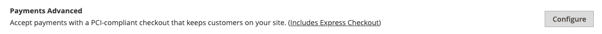

# PayPal-betalingen geavanceerd

[PayPal-betalingen geavanceerd][4] is een [PCI-compatibel](../getting-started/compliance-pci.md) oplossing waarmee uw klanten via een debet of creditcard kunnen betalen zonder uw site te verlaten. Deze pagina bevat een ingesloten afhandelingspagina die kan worden aangepast om een naadloze en veilige afhandeling te maken.

Zelfs klanten zonder PayPal-rekening kunnen aankopen doen via de beveiligde betaalgateway van PayPal. Geaccepteerde kaarten zijn Visa, MasterCard, Switch/Maestro en Solo creditcards in de Verenigde Staten en het Verenigd Koninkrijk. Voor extra gemak wordt PayPal Express Checkout meegeleverd bij Paypal Payments Advanced.

>[!IMPORTANT]
>
>**PSD2 Eisen:**  
>Vanaf 14 september 2019 zouden Europese banken betalingen kunnen terugdringen die niet voldoen aan [PSD 2](../getting-started/compliance-payment-services-directive.md) eisen. Om te voldoen aan PSD2, moet PayPal Payments Advanced zijn geïntegreerd met een externe insteekmodule. Zie voor meer informatie [3-D veilig voor Payflow](https://developer.paypal.com/api/nvp-soap/payflow/3d-secure-mpi/).

>[!NOTE]
>
>PayPal Payments Advanced kan niet worden gebruikt voor bestellingen die zijn gemaakt via de beheerder van uw winkel.

## Vereisten

- [PayPal-zakelijke account][1]
- Als u meerdere Adobe Commerce- en Magento Open Source-websites beheert, moet u voor elke website een aparte PayPal Merchant-account hebben.

## Workflow voor uitchecken

1. **Klant kiest betalingsmethode** - Tijdens het afrekenen kiest de klant ervoor te betalen met PayPal Payments Advanced. De knop Nu betalen wordt weergegeven in plaats van de knop Bestelling plaatsen.

1. **Nu betalen** - De klant klikt/tikt _Nu betalen_ en wordt er een formulier weergegeven dat door PayPal wordt gehost. De klant voert de kaartgegevens in en de kaart wordt geverifieerd. Als dit lukt, wordt de pagina voor bevestiging van de bestelling weergegeven.

   **Betalen met PayPal** - Het formulier bevat ook de _Betalen met PayPal_ , die de klant doorstuurt naar de PayPal-site, waar betaling kan worden gedaan met PayPal Express Checkout.

1. **Problemen oplossen** - Als de transactie om welke reden dan ook mislukt, verschijnt er een foutbericht op de uitcheckpagina en krijgt de klant de instructie het opnieuw te proberen. Alle problemen worden beheerd door PayPal.

## Workflow voor het verwerken van bestellingen

De verwerking van bestellingen met PayPal Payments Geavanceerd is hetzelfde als bij elke normale PayPal-bestelling. Bestellingen worden gefactureerd en verzonden, en creditnota&#39;s worden gegenereerd voor zowel online als offline terugbetalingen. Er zijn echter geen meerdere online terugbetalingen beschikbaar voor bestellingen die met PayPal Payments Advanced zijn betaald.

1. **Bestelling plaatsen klant** - In het laatste stadium van de afhandeling tikt de klant op de knop Plaatsvolgorde.

1. **PayPal reageert** - PayPal evalueert de aanvraag. Als deze geldig blijkt te zijn, verwerkt PayPal de transactie.

1. **Status van order instellen voor handel** - Handel ontvangt reactie van PayPal en stelt de status van de bestelling in op een van de volgende:

   - **Verwerking** - De transactie is voltooid.
   - **In behandeling** - Het systeem heeft geen reactie van PayPal ontvangen.
   - **Geannuleerd** - De transactie is om de een of andere reden niet succesvol
   - **Vermoedelijke fraude** - De transactie voldeed niet aan een deel van de [Paypal-fraudefilters](paypal.md#paypal-fraud-management-filters). Het systeem ontvangt van PayPal de reactie dat de transactie wordt gecontroleerd door de Fraud Service.

1. **Handelsmaatschappij voldoet aan order** - De handelsfactuur en de bestelling worden verzonden.

## Uw PayPal-account configureren

Voordat u Paypal Payments Advanced in Commerce instelt, moet u uw account configureren op de Paypal-website.

1. Aanmelden bij uw [PayPal-zakelijke account][2].

1. Ga naar **[!UICONTROL Service Settings]** > **[!UICONTROL Hosted Checkout Pages]** > **[!UICONTROL Set Up Menu]** en voer de volgende instellingen in:

   - **[!UICONTROL AVS]**: `No`
   - **[!UICONTROL CSC]**: `No`
   - **[!UICONTROL Enable Secure Token]**: `Yes`

1. **[!UICONTROL Save]** de instellingen.

   >[!NOTE]
   >
   >Als u meerdere handels-websites hebt, moet u voor elke website een aparte geavanceerde Paypal-betalingsaccount maken.

1. Ga als volgt te werk wanneer u wordt gevraagd een lay-out te maken:

   - Klik boven aan de pagina op **[!UICONTROL Customize]**.

   - Kies **[!UICONTROL Layout C]**.

   - Klik op **[!UICONTROL Save and Publish]**.

1. Een andere gebruiker instellen (aanbevolen door PayPal):

   - Aanmelden bij uw [PayPal-zakelijke account][2].

   - Volg de instructies om een andere gebruiker in te stellen.

   - **[!UICONTROL Save]** de wijzigingen.

## PayPal-betalingen geavanceerd instellen in Handel

>[!NOTE]
>
>Er kunnen twee PayPal-oplossingen tegelijk actief zijn: Express Checkout en een All-In-One of Payment Gateway-oplossing. Als u betalingsoplossingen wijzigt, is degene die eerder is gebruikt, uitgeschakeld.

>[!TIP]
>
>Klikken **[!UICONTROL Save Config]** om uw voortgang op elk gewenst moment op te slaan.

### Stap 1: Begin met de configuratie

1. Op de _Beheerder_ zijbalk, ga naar **[!UICONTROL Stores]** > _[!UICONTROL Settings]_>**[!UICONTROL Configuration]**.

1. Vouw in het linkerdeelvenster uit **[!UICONTROL Sales]** en kiest u **[!UICONTROL Payment Methods]**.

1. Als uw installatie van de Handel veelvoudige websites, opslag, of meningen heeft, plaats **[!UICONTROL Store View]** op de archiefmening waar u deze configuratie wilt toepassen.

1. In de _[!UICONTROL Merchant Location]_selecteert u de **[!UICONTROL Merchant Country]**waar uw bedrijf wordt gevestigd.

   Deze instelling bepaalt de selectie van PayPal-oplossingen die in de configuratie worden weergegeven.

   {width="600" zoomable="yes"}

1. Uitbreiden **[!UICONTROL PayPal All-in-One Payment Solution]** en klik op **[!UICONTROL Configure]** for **[!UICONTROL Payments Advanced]**.

   {width="600" zoomable="yes"}

### Stap 2: Voer de vereiste instellingen in

1. Uitbreiden  de **[!UICONTROL Required PayPal Settings]** , indien nodig.

   {width="600" zoomable="yes"}

1. (Optioneel) Voer de **[!UICONTROL Email Associated with your PayPal Merchant Account]**.

   >[!IMPORTANT]
   >
   >E-mailadressen zijn hoofdlettergevoelig. Als je een betaling wilt ontvangen, moet het e-mailadres overeenkomen met het e-mailadres dat is opgegeven in je PayPal Merchant-account.

   Als u geen PayPal-rekening hebt, klikt u op **[!UICONTROL Start accepting payments via PayPal]**.

1. Voer een van de volgende gegevens in waarmee u zich aanmeldt bij uw PayPal-zakelijke account:

   - **[!UICONTROL Partner]** - Je PayPal-partner-id.
   - **[!UICONTROL Vendor]** - De gebruikersnaam van uw PayPal-gebruikersaanmelding.
   - **[!UICONTROL User]** - De id van een andere gebruiker die is ingesteld op uw PayPal-account.

1. Voer de **[!UICONTROL Password]** die aan uw PayPal-account is gekoppeld.

1. Als u testtransacties wilt uitvoeren, stelt u **[!UICONTROL Test Mode]** tot `Yes`.

   Gebruik bij het testen van de configuratie in een sandbox alleen [creditcardnummers][3] die worden aanbevolen door PayPal. Wanneer u klaar bent om naar productie te gaan, terugkeer naar de configuratie en plaats de Wijze van de Test aan `No`.

1. Als uw systeem een proxyserver gebruikt om de verbinding met het PayPal-systeem tot stand te brengen, stelt u **[!UICONTROL Use Proxy]** tot `Yes` en voer de volgende handelingen uit:

   - Voer het IP-adres in van de **[!UICONTROL Proxy Host]**.

   - Voer het poortnummer in van het dialoogvenster **[!UICONTROL Proxy Port]**.

     Er wordt een proxy gebruikt wanneer de serverfirewall directe toegang tot de PayPal-server voorkomt. In dit geval, wordt een derdenserver gebruikt om verkeer af te lossen.

1. Set **[!UICONTROL Enable this Solution]** tot `Yes`.

1. Als je wilt aanbieden [PayPal-creditering](paypal.md#paypal-credit-and-pay-later) aan uw klanten, reeks **[!UICONTROL Enable PayPal Credit]** tot `Yes`.

### Stap 3: Adverteer PayPal-creditering / Adverteer PayPal Later (optioneel)

Vanaf de release 2.4.3 wordt PayPal PayLater ondersteund in implementaties die PayPal bevatten. Met deze functie kunnen kopers een bestelling in tweewekelijkse termijnen betalen in plaats van het volledige bedrag op het moment van aankoop te betalen. De PayPal-ervaring is afgekeurd.

Set **[!UICONTROL Enable PayPal PayLater Experience]** op een van de volgende wijzen:

- `Yes` - Adverteer PayPal PayPal later instellen
- `No` - Adverteren van PayPal-krediet instellen

#### PayPal-krediet adverteren

1. Uitbreiden  de **[!UICONTROL Advertise PayPal Credit]** sectie.

   {width="600" zoomable="yes"}

1. Klik op **[!UICONTROL Get Publisher ID from PayPal]** en volgt u de instructies.

1. Voer uw **[!UICONTROL Publisher ID]**.

1. Uitbreiden  de **[!UICONTROL Home Page]** sectie.

1. Als u een banner op de pagina wilt plaatsen, stelt u **[!UICONTROL Display]** tot `Yes`.

1. Set **[!UICONTROL Position]** op een van de volgende wijzen:

   - `Header (center)`
   - `Sidebar (right)`

1. Set **[!UICONTROL Size]** op een van de volgende wijzen:

   - `190 x 100`
   - `234 x 60`
   - `300 x 50`
   - `468 x 60`
   - `728 x 90`
   - `800 x 66`

   {width="600" zoomable="yes"}

1. Uitbreiden  de overige secties en herhaal de vorige stappen:

   - **[!UICONTROL Catalog Category Page]**
   - **[!UICONTROL Catalog Product Page]**
   - **[!UICONTROL Checkout Cart Page]**

#### Adverteer PayPal PayPal Later

1. Uitbreiden  de **[!UICONTROL Advertise PayPal PayLater]** sectie.

1. Set **[!UICONTROL Enable PayPal PayLater]** tot `Yes`.

1. Uitbreiden  de **[!UICONTROL Home Page]** sectie.

1. Als u een banner op de pagina wilt plaatsen, stelt u **[!UICONTROL Display]** tot `Yes`.

1. Set **[!UICONTROL Position]** op een van de volgende wijzen:

   - `Header (center)`
   - `Sidebar`

1. Set **[!UICONTROL Style Layout]** op een van de volgende wijzen:

   - `Text`
   - `Flex`

1. Voor [!UICONTROL Style Layout] **[!UICONTROL Text]** alleen, instellen **[!UICONTROL Logo Type]** op een van de volgende wijzen:

   - `Primary`
   - `Alternative`
   - `Inline`
   - `None`

1. Voor [!UICONTROL Style Layout] **[!UICONTROL Text]** alleen, instellen **[!UICONTROL Logo Position]** op een van de volgende wijzen:

   - `Left`
   - `Right`
   - `Top`

1. Voor [!UICONTROL Style Layout] **[!UICONTROL Text]** alleen, instellen **[!UICONTROL Text Color]** op een van de volgende wijzen:

   - `Black`
   - `White`
   - `Monochrome`
   - `Grayscale`

1. Voor [!UICONTROL Style Layout] **[!UICONTROL Text]** alleen, instellen **[!UICONTROL Text Size]** op een van de volgende wijzen:

   - `10px`
   - `11px`
   - `12px`
   - `13px`
   - `14px`
   - `15px`
   - `16px`

1. Voor [!UICONTROL Style Layout] **[!UICONTROL Flex]** alleen, instellen **[!UICONTROL Ratio]** op een van de volgende wijzen:

   - `1x1`
   - `1x4`
   - `8x1`
   - `20x1`

1. Voor [!UICONTROL Style Layout] **[!UICONTROL Flex]** alleen, instellen **[!UICONTROL Color]** op een van de volgende wijzen:

   - `Blue`
   - `Black`
   - `White`
   - `White No Border`
   - `Gray`
   - `Monochrome`
   - `Grayscale`

   {width="600" zoomable="yes"}

1. Uitbreiden  de overige secties en herhaal de vorige stappen:

   - **[!UICONTROL Catalog Product Page]**
   - **[!UICONTROL Checkout Cart Page]**
   - **[!UICONTROL Checkout Payment Step]**
   - **[!UICONTROL Catalog Category Page]**

### Stap 4: De basisinstellingen voltooien

1. Uitbreiden  de **[!UICONTROL Basic Settings - PayPal Payments Advanced]** , indien nodig.

   {width="600" zoomable="yes"}

1. Voer een **[!UICONTROL Title]**.

   U kunt de titel het beste gebruiken _Debet of creditcard_.

1. Als je meerdere betalingsmethoden aanbiedt, voer dan een nummer in voor **[!UICONTROL Sort Order]** om te bepalen in welke volgorde PayPal Payments Geavanceerd wordt weergegeven wanneer deze bij andere betalingsmethoden wordt aangeboden tijdens het afrekenen.

   Dit getal is relatief ten opzichte van de andere betalingsmethoden. (`0` = eerst, `1` = seconde, `2` = derde, enzovoort.)

1. Set **[!UICONTROL Payment Action]** op een van de volgende wijzen:

   - `Authorization` - Goedkeuring van de aankoop, maar blokkeert de middelen. Het bedrag wordt pas ingetrokken als het is _vastgelegd_ door de handelaar.
   - `Sale` - Het bedrag van de aankoop wordt toegestaan en onmiddellijk van de rekening van de klant teruggetrokken.

### Stap 5: De geavanceerde instellingen voltooien

1. Uitbreiden  de **[!UICONTROL Advanced Settings]** sectie.

   {width="600" zoomable="yes"}

1. Set **[!UICONTROL Payment Applicable From]** op een van de volgende wijzen:

   - `All Allowed Countries` - Klanten van iedereen [landen](../getting-started/store-details.md#country-options) Deze betalingsmethode kan worden gebruikt.
   - `Specific Countries` - Nadat u deze optie hebt gekozen, _[!UICONTROL Payment from Specific Countries]_wordt weergegeven. Houd Ctrl (PC) of Command (Mac) ingedrukt en selecteer elk land in de lijst waar klanten aankopen kunnen doen in uw winkel.

1. Om mededelingen met het betalingssysteem in het logboekdossier te schrijven, plaats **[!UICONTROL Debug Mode]** tot `Yes`.

   Het logbestand voor Paypal Payments Advanced is `payments_payflow_advanced.log`.

   >[!NOTE]
   >
   >In overeenstemming met de normen van de Veiligheid van Gegevens PCI, wordt de creditcardinformatie niet geregistreerd in het logboekdossier.

1. Als u verificatie van de authenticiteit van de host wilt inschakelen, stelt u **[!UICONTROL Enable SSL Verification]** tot `Yes`.

1. Om de klant in staat te stellen zijn vermelding van de driecijferige CVV-beveiligingscode vanaf de achterzijde van een creditcard te corrigeren, stelt u **[!UICONTROL CVV Entry is Editable]** tot `Yes`.

1. Om klanten te vereisen om een CVV code in te gaan, reeks **[!UICONTROL Require CVV Entry]** tot `Yes`.

1. Als u een bevestiging van de betaling aan de klant wilt verzenden, stelt u **[!UICONTROL Send Email Confirmation]** tot `Yes`.

1. Als u wilt bepalen welke methode wordt gebruikt om informatie uit te wisselen met de PayPal-server tijdens een transactie, stelt u de **[!UICONTROL URL method for Cancel URL and Return URL]** op een van de volgende wijzen:

   - `GET` - (Standaard) Hiermee wordt informatie opgehaald die het resultaat is van een proces.
   - `POST` - Hiermee wordt een gegevensblok, zoals gegevens die in een formulier zijn ingevoerd, aangeboden voor een gegevensverwerkingsproces.

   De _URL annuleren_ en _URL retourneren_ Raadpleeg de pagina waarop de klant terugkeert nadat het betalingsgedeelte van het afhandelingsproces op de PayPal-server is voltooid of geannuleerd.

1. Vul de volgende secties in, indien nodig voor uw winkel:

   - [Instellingen voor afwikkelingsrapport](#settlement-report-settings)
   - [Instellingen voor voorvertoning](#frontend-experience-settings)

#### Instellingen voor afwikkelingsrapport

1. Uitbreiden  de **[!UICONTROL Settlement Report Settings]** sectie.

   {width="600" zoomable="yes"}

1. Voor **[!UICONTROL SFTP Credentials]** Ga als volgt te werk:

   - Als u zich hebt aangemeld voor Secure FTP Server van PayPal, voert u de volgende SFTP-aanmeldgegevens in:

      - Aanmelden
      - Wachtwoord

   - Testrapporten uitvoeren voordat u live gaat, stelt u in **[!UICONTROL Sandbox Mode]** tot `Yes`.

   - Voer de **[!UICONTROL Custom Endpoint Hostname or IP Address]**.

     De standaardwaarde is `reports.paypal.com`.

   - Voer de **[!UICONTROL Custom Path]** waarin rapporten worden opgeslagen.

     De standaardwaarde is `/ppreports/outgoing`.

1. Om rapporten volgens een programma te produceren, voltooi **[!UICONTROL Scheduled Fetching]** instellingen:

   - Set **[!UICONTROL Enable Automatic Fetching]** tot `Yes`.

   - Set **[!UICONTROL Schedule]** op een van de volgende wijzen:

      - `Daily`
      - `Every 3 Days`
      - `Every 7 Days`
      - `Every 10 Days`
      - `Every 14 Days`
      - `Every 30 Days`
      - `Every 40 Days`

     PayPal bewaart elk rapport 45 dagen.

   - Set **[!UICONTROL Time of Day]** tot het uur, de minuut, en de seconde wanneer u de rapporten wilt worden geproduceerd.

#### Instellingen voor voorvertoning

Gebruik de _[!UICONTROL Frontend Experience Settings]_om te kiezen welke PayPal-logo&#39;s op uw site worden weergegeven en om de weergave van uw PayPal-handelpagina&#39;s aan te passen.

1. Uitbreiden  de **[!UICONTROL Frontend Experience Settings]** sectie.

   {width="600" zoomable="yes"}

1. Selecteer de **[!UICONTROL PayPal Product Logo]** die je in het PayPal-blok in je winkel wilt weergeven.

   De PayPal-logo&#39;s zijn beschikbaar in vier stijlen en twee formaten:

   - `No Logo`
   - `We Prefer PayPal (150 x 60 or 150 x 40)`
   - `Now Accepting PayPal (150 x 60 or 150 x 40)`
   - `Payments by PayPal (150 x 60 or 150 x 40)`
   - `Shop Now Using PayPal (150 x 60 or 150 x 40)`

1. De weergave van je PayPal-winkelpagina&#39;s aanpassen:

   - Voer de naam in van de **[!UICONTROL Page Style]** die je op je PayPal-handelpagina&#39;s wilt toepassen:

      - `paypal` - Gebruikt de paginastijl van PayPal.
      - `primary` - Gebruikt de paginastijl die u als _primair_ stijl in uw accountprofiel.
      - `your_custom_value` - Hiermee gebruikt u een aangepaste paginastijl voor betalingen, die in uw accountprofiel is opgegeven.

   - Voor **[!UICONTROL Header Image URL]** Voer de URL in van de afbeelding die u in de linkerbovenhoek van de betaalpagina wilt weergeven. De maximale bestandsgrootte is 750 pixels breed en 90 pixels hoog.

   >[!NOTE]
   >
   >PayPal raadt aan de afbeelding op een beveiligde server (https) te plaatsen. Anders kan een browser waarschuwen dat _de pagina bevat zowel beveiligde als niet-beveiligde items_.

   - Als u de kleur voor uw pagina&#39;s wilt instellen, voert u de hexadecimale code van zes tekens in, zonder de `#` symbool, voor elk van de volgende elementen:

      - **[!UICONTROL Header Background Color]** - Achtergrondkleur voor koptekst van uitcheckpagina.
      - **[!UICONTROL Header Border Color]** - Kleur voor een rand van twee pixels rondom de koptekst.
      - **[!UICONTROL Page Background Color]** - Achtergrondkleur voor de afhandelingspagina en rond de koptekst en het betalingsformulier.

### Stap 6: Volledige basisinstellingen voor PayPal Express Checkout

1. Uitbreiden  de **[!UICONTROL Basic Settings - PayPal Express Checkout]** sectie.

   {width="600" zoomable="yes"}

1. Voor **[!UICONTROL Title]**, voert u een titel in die deze betalingsmethode identificeert tijdens het afrekenen.

   De titel instellen op _PayPal_ voor elke winkelweergave wordt aanbevolen.

1. Als je meerdere betalingsmethoden aanbiedt, voer dan een nummer in voor **[!UICONTROL Sort Order]** om de volgorde te bepalen waarin PayPal Express Checkout wordt weergegeven wanneer deze bij de andere betalingsmethoden wordt aangeboden.

   Dit getal is relatief ten opzichte van de andere betalingsmethoden. (`0` = eerst, `1` = seconde, `2` = derde, enzovoort.)

1. Set **[!UICONTROL Payment Action]** op een van de volgende wijzen:

   - `Authorization` - Goedkeuring van de aankoop en blokkering van de middelen. Het bedrag wordt pas ingetrokken als het is _vastgelegd_ door de handelaar.
   - `Sale` - Het bedrag van de aankoop wordt toegestaan en onmiddellijk van de rekening van de klant teruggetrokken.

1. Als u het dialoogvenster _[!UICONTROL Check out with PayPal]_op de productpagina, instellen **[!UICONTROL Display on Product Details Page]**tot `Yes`.

### Stap 7: Volledige geavanceerde instellingen - PayPal Express Checkout

1. Uitbreiden  de **[!UICONTROL Advanced Settings]** sectie.

   {width="600" zoomable="yes"}

1. Als u PayPal Express Checkout beschikbaar wilt maken via het winkelwagentje en de minikaart, stelt u **[!UICONTROL Display on Shopping Cart]** tot `Yes`.

1. Set **[!UICONTROL Payment Applicable From]** op een van de volgende wijzen:

   - `All Allowed Countries` - Klanten van iedereen [landen](../getting-started/store-details.md#country-options) Deze betalingsmethode kan worden gebruikt.
   - `Specific Countries` |Nadat u deze optie hebt gekozen, _Betaling uit de lijst van specifieke landen_ wordt weergegeven. Houd Ctrl (PC) of Command (Mac) ingedrukt en klik op elk land in de lijst waar klanten aankopen kunnen doen in uw winkel.

1. Om mededelingen met het betalingssysteem in het logboekdossier te schrijven, plaats **[!UICONTROL Debug Mode]** tot `Yes`.

   >[!NOTE]
   >
   >overeenkomstig [PCI-standaarden voor gegevensbeveiliging](../getting-started/compliance-pci.md)worden creditcardgegevens niet in het logbestand opgenomen.

1. Als u verificatie van de authenticiteit van de host wilt inschakelen, stelt u **[!UICONTROL Enable SSL Verification]** tot `Yes`.

1. Als u een volledig overzicht wilt weergeven van de bestelling van de klant per online object op de PayPal-site, stelt u **[!UICONTROL Transfer Cart Line Items]** tot `Yes`.

1. Als u wilt dat de klant de transactie kan voltooien vanaf de PayPal-site zonder deze terug te sturen naar uw winkel voor het controleren van bestellingen, stelt u **[!UICONTROL Skip Order Review Step]** tot `Yes`.

1. Klik op **[!UICONTROL Save Config]**.

[1]: https://www.paypal.com/webapps/mpp/how-to-sell-online
[2]: https://manager.paypal.com/
[3]: https://www.paypalobjects.com/en_AU/vhelp/paypalmanager_help/credit_card_numbers.htm
[4]: https://developer.paypal.com/docs/payflow/gs-ppa-hosted-pages/
