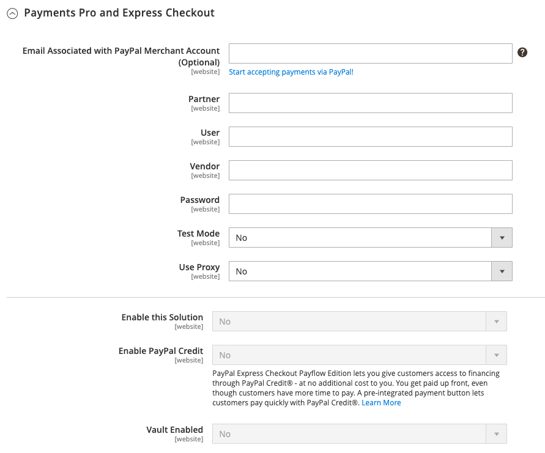

# PayPal Payments Pro

[ PayPal Betalingen Pro ][3] brengt u alle voordelen van een handels rekening en een betalingsgateway in één, plus de capaciteit om uw eigen, volledig aangepaste checkout ervaring tot stand te brengen. PayPal Express Checkout wordt automatisch ingeschakeld met PayPal Payments Pro, zodat je op meer dan 110 miljoen actieve PayPal-gebruikers kunt tikken.

{width="700" zoomable="yes"}

>[!IMPORTANT]
>
>**PSD2 Vereisten:**  
>Vanaf 14 september 2019, zouden de Europese banken betalingen kunnen verminderen die niet [&#x200B; PSD2 &#x200B;](../getting-started/compliance-payment-services-directive.md) vereisten voldoen. PayPal Payments Pro moet met een externe insteekmodule zijn geïntegreerd om aan PSD2 te voldoen.

>[!NOTE]
>
>Momenteel is PayPal Payments Pro beschikbaar in de VS, het Verenigd Koninkrijk en Canada.

## Vereisten

- [ PayPal Merchant Account ][1] (met geactiveerde Directe Betalingen)

## Workflow voor uitchecken

1. **de Klant gaat naar checkout** - de Klant voegt producten aan kar toe, en klikt/de kranen _gaat aan Afhandeling_ te werk.|
1. **de Klant kiest betalingsmethode** - tijdens controle, kiest de klant de _Direct Betaling PayPal_ optie, en gaat de creditcardinformatie in.
   - Als de klant met PayPal Payments Pro betaalt, blijft de klant tijdens het afrekenen op uw site.
   - Als je met PayPal Express Checkout betaalt, wordt de klant omgeleid naar de PayPal-site om de transactie te voltooien.

Op verzoek van de klant kan de beheerder van de winkel ook een bestelling maken van de beheerder en de transactie verwerken met PayPal Payments Pro.

## Workflow voor het verwerken van bestellingen

1. **geplaatste Orde** - de orde kan of Admin van uw opslag, of van uw PayPal handelaarrekening worden verwerkt.

1. **[!UICONTROL Payment Action]** - De in de configuratie opgegeven betalingsactie wordt toegepast op de bestelling. U kunt onder andere de volgende opties kiezen:

   - **machtigt** - Commerce leidt tot een verkooporde met de _status van de Verwerking_. In dit geval is het bedrag dat moet worden goedgekeurd in afwachting van goedkeuring.
   - **Verkoop** - Commerce leidt zowel tot een verkooporde als tot factuur.
   - **Vangst** - PayPal brengt het orderbedrag van het klantensaldo, de bankrekening, of creditcard aan de handelaarrekening over.

1. **Facturering** - een factuur wordt gecreeerd in Commerce nadat PayPal een onmiddellijk bericht van het betalingsbericht naar Commerce verzendt.

   Controleer of Directe betalingsmeldingen zijn ingeschakeld in je PayPal-handelsaccount.

   >[!NOTE]
   >
   >Indien nodig kan een bestelling gedeeltelijk worden gefactureerd voor een bepaalde hoeveelheid producten. Voor elke gedeeltelijke factuur die wordt ingediend, wordt een afzonderlijke transactie Vastleggen met een unieke id beschikbaar en wordt een aparte factuur gegenereerd.

   Betalingstransacties die alleen voor autorisatie bestemd zijn, worden pas afgesloten nadat het volledige bedrag van de bestelling is vastgelegd.

   Een bestelling kan op elk gewenst moment online worden verzonden tot het orderbedrag volledig is gefactureerd.

1. **Keert** terug - als de klant de gekochte producten terugkeert en een terugbetaling, zoals met orderbedrag vangt en factuurverwezenlijking eist, kunt u een online terugbetaling of van Admin of van uw handels PayPal rekening tot stand brengen.

## Uw PayPal-account configureren

Voordat u PayPal Payments Pro instelt in Commerce, moet u uw zakelijke account configureren op de Paypal-website.

1. Login aan uw [&#x200B; PayPal bedrijfsrekening &#x200B;](https://manager.paypal.com/).

1. Kies **[!UICONTROL Service Settings]** in het menu PayPal Manager.

1. Klik onder **[!UICONTROL Hosted Checkout Pages]** op **[!UICONTROL Set Up]** .

1. Stel onder **[!UICONTROL Choose your settings]** de waarde **[!UICONTROL Transaction Process Mode]** in op `Live` .

1. Stel onder **[!UICONTROL Display options on payment page]** de waarde **[!UICONTROL Cancel URL Method]** in op `POST` .

1. Selecteer onder **[!UICONTROL Billing Information]** de selectievakjes voor de beveiligingscode van de kaart **[!UICONTROL CSC]** voor vereiste en bewerkbare velden.

1. Stel onder **[!UICONTROL Payment Confirmation]** de waarde **[!UICONTROL Return URL Method]** in op `POST` .

1. Configureer onder **[!UICONTROL Security Options]** het volgende:

   - **[!UICONTROL AVS]**: `No`
   - **[!UICONTROL CSC]**: `No`
   - **[!UICONTROL Enable Secure Token]**: `Yes`

1. Klik op **[!UICONTROL Save Changes]**.

1. In het _menu van de Manager van PayPal_, kies **[!UICONTROL Service Settings]** en onder _Ontvangen Pagina&#39;s van de Controle_, kies **[!UICONTROL Customize]**.

1. Kies **[!UICONTROL Layout C]** .

   Layout C geeft alleen velden voor creditcards en betaalkaarten weer en kan op uw site worden geframed of als een zelfstandig popup worden gebruikt. De grootte is vast op 490 x 565 pixels, met extra ruimte voor foutberichten. Op sommige systemen corrigeert deze instelling een probleem met transparante omleiding.

1. Klik op **[!UICONTROL Save and Publish]**.

1. Kies **[!UICONTROL Account Administration]** in het menu PayPal Manager. Klik onder **[!UICONTROL Manage Security]** op **[!UICONTROL Transaction Settings]** .

1. Stel **[!UICONTROL Allow reference transactions]** in op `Yes` .

1. Klik op **[!UICONTROL Confirm]**.

   >[!NOTE]
   >
   >Als u meerdere Commerce-websites hebt, moet u voor elke website een aparte PayPal Payments Pro-account maken.

1. Een andere gebruiker instellen (aanbevolen door PayPal):

   - Klik in de tweede rij van het hoofdmenu op **[!UICONTROL Manage Users]** .

   - Klik op **[!UICONTROL Add User]** als u nog een gebruiker aan de account wilt toevoegen. De koppeling bevindt zich net boven de titel Gebruikers beheren.

   - Vul de vereiste velden in de volgende secties van het _[!UICONTROL Add User]_-formulier in:

      - [!UICONTROL Admin Confirmation]
      - [!UICONTROL User Information]
      - [!UICONTROL User Login Information]
      - [!UICONTROL Assign Privilege to User]

   - Klik op **[!UICONTROL Update]**.

1. Log uit van je PayPal-rekening.

## PayPal Payments Pro instellen in Commerce

>[!NOTE]
>
>U kunt twee oplossingen hebben PayPal die tezelfdertijd actief zijn: [&#x200B; Uitdrukkelijke Controle PayPal &#x200B;](paypal-express-checkout.md), plus om het even welke [&#x200B; alle-in-één oplossingen &#x200B;](paypal.md#paypal-all-in-one-payment-solutions). Als u betalingsoplossingen wijzigt, wordt de eerder gebruikte oplossing automatisch uitgeschakeld.

>[!TIP]
>
>Klik op **[!UICONTROL Save Config]** om de voortgang op te slaan.

### Stap 1: Begin met de configuratie

1. Voor _Admin_ sidebar, ga **[!UICONTROL Stores]** > _[!UICONTROL Settings]_>**[!UICONTROL Configuration]**.

1. Vouw in het linkerdeelvenster **[!UICONTROL Sales]** uit en kies **[!UICONTROL Payment Methods]** .

1. Als uw Commerce-installatie meerdere websites, winkels of weergaven bevat, stelt u **[!UICONTROL Store View]** in op de winkelweergave waar u deze configuratie wilt toepassen.

1. Selecteer in de sectie _[!UICONTROL Merchant Location]_&#x200B;de **[!UICONTROL Merchant Country]**&#x200B;waar uw bedrijf zich bevindt.

   Deze instelling bepaalt de selectie van PayPal-oplossingen die in de configuratie worden weergegeven.

   {width="600" zoomable="yes"}

1. Vouw **[!UICONTROL PayPal All-in-One Payment Solution]** uit en klik op **[!UICONTROL Configure]** for **[!UICONTROL Payments Pro]** .

   {width="600" zoomable="yes"}

### Stap 2: Voltooi de vereiste PayPal-instellingen

1. Breid  de **[!UICONTROL Payments Pro and Express Checkout]** sectie uit.

   {width="600" zoomable="yes"}

1. (Optioneel) Voer de **[!UICONTROL Email Associated with your PayPal Merchant Account]** in.

   >[!IMPORTANT]
   >
   >E-mailadressen zijn hoofdlettergevoelig. Als je een betaling wilt ontvangen, moet het e-mailadres overeenkomen met het e-mailadres dat is opgegeven in je PayPal Merchant-account.

   Klik op **[!UICONTROL Start accepting payments via PayPal]** als u geen PayPal-rekening hebt.

1. Voer een van de volgende gegevens in waarmee u zich aanmeldt bij uw PayPal-zakelijke account:

   - **[!UICONTROL Partner]** - Uw PayPal-partner-id.
   - **[!UICONTROL Vendor]** - De gebruikersnaam van uw PayPal-gebruikersaanmelding.
   - **[!UICONTROL User]** - De id van een andere gebruiker die is ingesteld op uw Paypal-account.

1. Voer de **[!UICONTROL Password]** in die aan uw Paypal-account is gekoppeld.

1. Als u testtransacties wilt uitvoeren, stelt u **[!UICONTROL Test Mode]** in op `Yes` .

   Wanneer het testen van de configuratie in een zandbak, gebruik slechts [ creditcardaantallen ][2] die door PayPal worden geadviseerd. Als u gereed bent om naar de productie te gaan, gaat u terug naar de configuratie en stelt u Testmodus in op `No` .

1. Als uw systeem een proxyserver gebruikt om de verbinding met het PayPal-systeem tot stand te brengen, stelt u **[!UICONTROL Use Proxy]** in op `Yes` en voert u de volgende handelingen uit:

   - Voer het IP-adres van de **[!UICONTROL Proxy Host]** in.

   - Voer het poortnummer van de **[!UICONTROL Proxy Port]** in.

   Er wordt een proxy gebruikt wanneer de serverfirewall directe toegang tot de PayPal-server voorkomt. In een dergelijk geval, wordt een derdenserver gebruikt om verkeer af te lossen.

1. Stel **[!UICONTROL Enable this Solution]** in op `Yes` .

1. Als u [&#x200B; Krediet van PayPal &#x200B;](paypal.md#paypal-credit-and-pay-later) aan uw klanten wilt aanbieden, plaats **[!UICONTROL Enable PayPal Credit]** aan `Yes`.

1. Als u de betaling-/creditcardgegevens van de klant veilig wilt opslaan, zodat klanten niet telkens opnieuw betalingsgegevens hoeven in te voeren, stelt u **[!UICONTROL Vault Enabled]** in op `Yes` .

### Stap 3: Adverteer PayPal-creditering / Adverteer PayPal Later (optioneel)

Vanaf de release 2.4.3 wordt PayPal PayLater ondersteund in implementaties die PayPal bevatten. Met deze functie kunnen kopers een bestelling in tweewekelijkse termijnen betalen in plaats van het volledige bedrag op het moment van aankoop te betalen. De PayPal-ervaring is afgekeurd.

Stel **[!UICONTROL Enable PayPal PayLater Experience]** in op een van de volgende opties:

- `Yes` - Meer informatie over PayPal PayPal instellen
- `No` - Adverteer PayPal-creditering instellen

#### PayPal-krediet adverteren

1. Breid  de **[!UICONTROL Advertise PayPal Credit]** sectie uit.

   {width="600" zoomable="yes"}

1. Klik op **[!UICONTROL Get Publisher ID from PayPal]** en volg de instructies op uw account om uw accountgegevens op te vragen.

1. Voer uw **[!UICONTROL Publisher ID]** in.

1. Breid  de **[!UICONTROL Home Page]** sectie uit.

   {width="600" zoomable="yes"}

1. Stel **[!UICONTROL Display]** in op `Yes` als u een banner op de pagina wilt plaatsen.

1. Stel **[!UICONTROL Position]** in op een van de volgende opties:

   - `Header (center)`
   - `Sidebar (right)`

1. Stel **[!UICONTROL Size]** in op een van de volgende opties:

   - `190 x 100`
   - `234 x 60`
   - `300 x 50`
   - `468 x 60`
   - `728 x 90`
   - `800 x 66`

1. Breid  de resterende secties uit en herhaal de vorige stappen:

   - **[!UICONTROL Catalog Category Page]**
   - **[!UICONTROL Catalog Product Page]**
   - **[!UICONTROL Checkout Cart Page]**

#### Adverteer PayPal PayPal Later

1. Breid  de **[!UICONTROL Advertise PayPal PayLater]** sectie uit.

1. Stel **[!UICONTROL Enable PayPal PayLater]** in op `Yes` .

1. Breid  de **[!UICONTROL Home Page]** sectie uit.

   {width="600" zoomable="yes"}

1. Stel **[!UICONTROL Display]** in op `Yes` als u een banner op de pagina wilt plaatsen.

1. Stel **[!UICONTROL Position]** in op een van de volgende opties:

   - `Header (center)`
   - `Sidebar`

1. Stel **[!UICONTROL Style Layout]** in op een van de volgende opties:

   - `Text`
   - `Flex`

1. Stel [!UICONTROL Style Layout] alleen **[!UICONTROL Text]** in op een van de volgende opties: **[!UICONTROL Logo Type]**

   - `Primary`
   - `Alternative`
   - `Inline`
   - `None`

1. Stel [!UICONTROL Style Layout] alleen **[!UICONTROL Text]** in op een van de volgende opties: **[!UICONTROL Logo Position]**

   - `Left`
   - `Right`
   - `Top`

1. Stel [!UICONTROL Style Layout] alleen **[!UICONTROL Text]** in op een van de volgende opties: **[!UICONTROL Text Color]**

   - `Black`
   - `White`
   - `Monochrome`
   - `Grayscale`

1. Stel [!UICONTROL Style Layout] alleen **[!UICONTROL Text]** in op een van de volgende opties: **[!UICONTROL Text Size]**

   - `10px`
   - `11px`
   - `12px`
   - `13px`
   - `14px`
   - `15px`
   - `16px`

1. Stel [!UICONTROL Style Layout] alleen **[!UICONTROL Flex]** in op een van de volgende opties: **[!UICONTROL Ratio]**

   - `1x1`
   - `1x4`
   - `8x1`
   - `20x1`

1. Stel [!UICONTROL Style Layout] alleen **[!UICONTROL Flex]** in op een van de volgende opties: **[!UICONTROL Color]**

   - `Blue`
   - `Black`
   - `White`
   - `White No Border`
   - `Gray`
   - `Monochrome`
   - `Grayscale`

1. Breid  de resterende secties uit en herhaal de vorige stappen:

   - **[!UICONTROL Catalog Product Page]**
   - **[!UICONTROL Checkout Cart Page]**
   - **[!UICONTROL Checkout Payment Step]**
   - **[!UICONTROL Catalog Category Page]**

### Stap 4: De basisinstellingen voltooien

1. Breid  de **[!UICONTROL Basic Settings - PayPal Payments Pro]** sectie uit.

   {width="600" zoomable="yes"}

1. Voer voor **[!UICONTROL Title]** een titel in die aangeeft dat PayPal Payments Pro wordt gebruikt tijdens het afrekenen.

   Men adviseert dat u de titel _Debit of Kaart_ gebruikt.

1. Als u meerdere betalingsmethoden aanbiedt, voert u een getal voor **[!UICONTROL Sort Order]** in om de volgorde te bepalen waarin PayPal Payments Pro wordt weergegeven wanneer deze bij andere betalingsmethoden wordt aangeboden tijdens het afrekenen.

   Dit getal is relatief ten opzichte van de andere betalingsmethoden. (`0` = first, `1` = second, `2` = third, enzovoort.)

1. Stel **[!UICONTROL Payment Action]** in op een van de volgende opties:

   - `Authorization` - Hiermee gaat u akkoord met de aankoop, maar u houdt de middelen in de wacht. Het bedrag wordt niet teruggetrokken tot het __ door de koopman wordt gevangen.
   - `Sale` - Het bedrag van de aankoop wordt geautoriseerd en onmiddellijk van de klantenrekening teruggetrokken.

1. Selecteer voor **[!UICONTROL Credit Card Settings]** de creditcards die je accepteert voor betaling in je winkel.

   Als u meerdere kaarten wilt selecteren, houdt u Ctrl (PC) of Command (Mac) ingedrukt en klikt u op elke kaart.

   >[!NOTE]
   >
   >American Express vereist een extra overeenkomst.

### Stap 5: De geavanceerde instellingen voltooien

1. Breid  de **[!UICONTROL Advanced Settings]** sectie uit.

   {width="600" zoomable="yes"}

1. Stel **[!UICONTROL Payment Applicable From]** in op een van de volgende opties:

   - `All Allowed Countries` - de klanten van alle [&#x200B; landen &#x200B;](../getting-started/store-details.md#country-options) die in uw opslagconfiguratie worden gespecificeerd kunnen deze betalingsmethode gebruiken.
   - `Specific Countries` - Nadat u deze optie hebt gekozen, wordt de lijst _[!UICONTROL Payment from Specific Countries]_&#x200B;weergegeven. Houd Ctrl (PC) of Command (Mac) ingedrukt en selecteer elk land in de lijst waar klanten aankopen kunnen doen in uw winkel.

1. Als u communicatie met het betalingssysteem naar het logbestand wilt schrijven, stelt u **[!UICONTROL Debug Mode]** in op `Yes` .

   >[!NOTE]
   >
   >In overeenstemming met de normen van de Veiligheid van Gegevens PCI, wordt de creditcardinformatie niet geregistreerd in het logboekdossier.

1. Als u verificatie van de authenticiteit van de host wilt inschakelen, stelt u **[!UICONTROL Enable SSL Verification]** in op `Yes` .

1. Stel **[!UICONTROL Require CVV Entry]** in op `Yes` als u wilt dat klanten een CVV-code invoeren.

1. Breid  de **[!UICONTROL CVV and AVS Settings]** sectie uit.

1. Om te bepalen wanneer een transactie zou moeten worden verworpen wanneer het Systeem van de Verificatie van het Adres een mismatch identificeert, specificeer hoe te om elk van de volgende scenario&#39;s te behandelen:

   - Als u een transactie wilt afwijzen die is gebaseerd op een niet-overeenkomende niet-overeenkomende straat, stelt u **[!UICONTROL AVS Street Does Not Match]** in op `Yes` .

   - Als u een transactie op basis van een niet-overeenkomende ZIP-code wilt afwijzen, stelt u **[!UICONTROL AVS Zip Does Not Match]** in op `Yes` .

   - Als u een transactie wilt afwijzen op basis van een niet-overeenkomende land-id, stelt u **[!UICONTROL International AVS Indicator Does Not Match]** in op `Yes` .

   - Als u een transactie op basis van een niet-overeenkomende CVV-code wilt afwijzen, stelt u **[!UICONTROL International Card Security Code Does Not Match]** in op `Yes` .

   {width="600" zoomable="yes"}

1. Vul de volgende secties in, indien nodig voor uw winkel:

   - [Instellingen voor afwikkelingsrapport](#settlement-report-settings)
   - [Instellingen voor voorvertoning](#frontend-experience-settings)

#### Instellingen voor afwikkelingsrapport

1. Breid  de **[!UICONTROL Settlement Report Settings]** sectie uit.

   {width="600" zoomable="yes"}

1. Voer voor **[!UICONTROL SFTP Credentials]** de volgende handelingen uit:

   - Als u zich hebt aangemeld voor Secure FTP Server van PayPal, voert u de volgende SFTP-aanmeldgegevens in:

      - Aanmelden
      - Wachtwoord

   - Stel **[!UICONTROL Sandbox Mode]** in op `Yes` als u testrapporten wilt uitvoeren voordat u live gaat met Payments Pro op uw site.

   - Voer de **[!UICONTROL Custom Endpoint Hostname or IP Address]** in.

     De standaardwaarde is `reports.paypal.com` .

   - Voer de **[!UICONTROL Custom Path]** in waarin rapporten worden opgeslagen.

     De standaardwaarde is `/ppreports/outgoing` .

1. Als u rapporten wilt genereren volgens een schema, voert u de **[!UICONTROL Scheduled Fetching]** -instellingen in:

   - Stel **[!UICONTROL Enable Automatic Fetching]** in op `Yes` .

   - Stel **[!UICONTROL Schedule]** in op een van de volgende opties:

      - `Daily`
      - `Every 3 Days`
      - `Every 7 Days`
      - `Every 10 Days`
      - `Every 14 Days`
      - `Every 30 Days`
      - `Every 40 Days`

     PayPal bewaart elk rapport 45 dagen.

   - Stel **[!UICONTROL Time of Day]** in op het uur, de minuut en de seconde waarop u de rapporten wilt genereren.

#### Instellingen voor voorvertoning

Gebruik _[!UICONTROL Frontend Experience Settings]_&#x200B;om te kiezen welke PayPal-logo&#39;s op uw site worden weergegeven en om de weergave van uw handelspagina&#39;s van PayPal aan te passen.

1. Breid  de **[!UICONTROL Frontend Experience Settings]** sectie uit.

   {width="600" zoomable="yes"}

1. Selecteer de **[!UICONTROL PayPal Product Logo]** die u in het PayPal-blok in uw winkel wilt weergeven.

   De PayPal-logo&#39;s zijn beschikbaar in vier stijlen en twee formaten:

   - `No Logo`
   - `We Prefer PayPal (150 x 60 or 150 x 40)`
   - `Now Accepting PayPal (150 x 60 or 150 x 40)`
   - `Payments by PayPal (150 x 60 or 150 x 40)`
   - `Shop Now Using PayPal (150 x 60 or 150 x 40)`

1. Ga als volgt te werk om de weergave van je PayPal-winkelpagina&#39;s aan te passen:

   - Voer de naam in van de **[!UICONTROL Page Style]** die u wilt toepassen op de handelspagina&#39;s van PayPal:

      - `paypal` - Gebruikt de paginastijl van PayPal.
      - `primary` - gebruikt de paginastijl die u als _primaire_ stijl in uw rekeningsprofiel identificeerde.
      - `your_custom_value` - Gebruikt een aangepaste paginastijl voor betalingen, die in uw accountprofiel is opgegeven.

   - Voer bij **[!UICONTROL Header Image URL]** de URL in van de afbeelding die u in de linkerbovenhoek van de betaalpagina wilt weergeven. De maximale bestandsgrootte is 750 pixels breed en 90 pixels hoog.

     >[!NOTE]
     >
     >PayPal raadt aan de afbeelding op een beveiligde server (https) te plaatsen. Anders, kan browser waarschuwen dat _de pagina zowel veilige als niet veilige punten_ bevat.

   - Als u de kleur voor uw pagina&#39;s wilt instellen, voert u voor elk van de volgende handelingen de zestekenige hexadecimale code in, zonder het symbool `#` :

      - **[!UICONTROL Header Background Color]** - Achtergrondkleur voor de koptekst van de uitcheckpagina.
      - **[!UICONTROL Header Border Color]** - Kleur voor rand van twee pixels rond de koptekst.
      - **[!UICONTROL Page Background Color]** - Achtergrondkleur voor de uitcheckpagina en rond de koptekst en het betalingsformulier.

### Stap 6: De basisinstellingen voor PayPal Express Checkout voltooien

1. Breid  de **[!UICONTROL Basic Settings - PayPal Express Checkout]** sectie uit.

   {width="600" zoomable="yes"}

1. Voer bij **[!UICONTROL Title]** een titel in die deze betalingsmethode identificeert tijdens het afrekenen.

   Het plaatsen van de titel aan _PayPal_ voor elke opslagmening wordt geadviseerd.

1. Als u meerdere betalingsmethoden aanbiedt, voert u een getal voor **[!UICONTROL Sort Order]** in om de volgorde te bepalen waarin PayPal Express Checkout wordt weergegeven wanneer deze bij de andere betalingsmethoden wordt aangeboden.

   Dit getal is relatief ten opzichte van de andere betalingsmethoden. (`0` = first, `1` = second, `2` = third, enzovoort.)

1. Stel **[!UICONTROL Payment Action]** in op een van de volgende opties:

   - `Authorization` - Hiermee gaat u akkoord met de aankoop en houdt u de middelen in de wacht. Het bedrag wordt niet teruggetrokken tot het __ door de koopman wordt gevangen.
   - `Sale` - Het bedrag van de aankoop wordt geautoriseerd en onmiddellijk van de rekening van de klant teruggetrokken.

1. Stel **[!UICONTROL Display on Product Details Page]** in op `Yes` om de knop _[!UICONTROL Check out with PayPal]_&#x200B;op de productpagina weer te geven.

### Stap 7: De geavanceerde instellingen voor PayPal Express-afhandeling voltooien

1. Breid  de **[!UICONTROL Advanced Settings]** sectie uit.

   {width="600" zoomable="yes"}

1. Stel **[!UICONTROL Display on Shopping Cart]** in op `Yes` .

1. Stel **[!UICONTROL Payment Applicable From]** in op een van de volgende opties:

   - `All Allowed Countries` - de klanten van alle [&#x200B; landen &#x200B;](../getting-started/store-details.md#country-options) die in uw opslagconfiguratie worden gespecificeerd kunnen deze betalingsmethode gebruiken.
   - `Specific Countries` - Nadat u deze optie hebt gekozen, wordt de lijst _[!UICONTROL Payment from Specific Countries]_&#x200B;weergegeven. Als u meerdere landen wilt selecteren, houdt u Ctrl (PC) of Command (Mac) ingedrukt en klikt u op elk item.

1. Als u communicatie met het betalingssysteem naar het logbestand wilt schrijven, stelt u **[!UICONTROL Debug Mode]** in op `Yes` .

   >[!NOTE]
   >
   >In overeenstemming met de normen van de Veiligheid van Gegevens PCI, wordt de creditcardinformatie niet geregistreerd in het logboekdossier.

1. Als u verificatie van de authenticiteit van de host wilt inschakelen, stelt u **[!UICONTROL Enable SSL Verification]** in op `Yes` .

1. Stel **[!UICONTROL Transfer Cart Line Items]** in op `Yes` als u een volledig overzicht van de bestelling van de klant per lijstitem vanaf de PayPal-site wilt weergeven.

1. Stel **[!UICONTROL Skip Order Review Step]** in op `Yes` als u de klant wilt toestaan de transactie van de PayPal-site te voltooien zonder deze terug te sturen naar uw winkel voor het reviseren van bestellingen.

1. Klik op **[!UICONTROL Save Config]** als de bewerking is voltooid.

[1]: https://www.paypal.com/webapps/mpp/how-to-sell-online
[2]: https://www.paypalobjects.com/en_AU/vhelp/paypalmanager_help/credit_card_numbers.htm
[3]: https://developer.paypal.com/docs/paypal-payments-pro/
