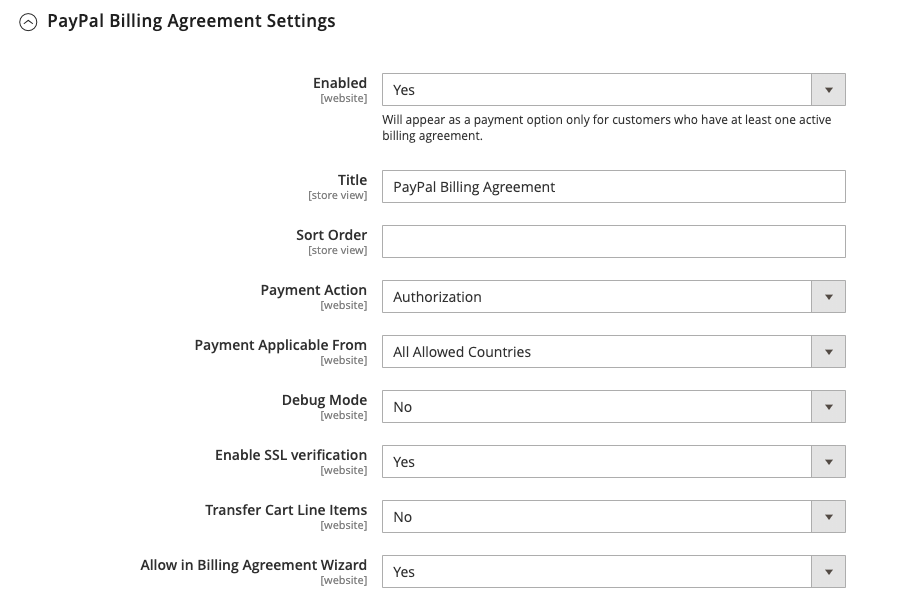

# PayPal Payments Standard

[ PayPal de Norm van Betalingen ][4] is de gemakkelijkste manier om betalingen online goed te keuren. Je kunt je klanten het gemak van betaling aanbieden, zowel via creditcard als via PayPal, door gewoon een button Afhandeling aan je winkel toe te voegen.

>[!NOTE]
>
>Voor handelaren buiten de V.S., wordt het genoemd _Norm van de Betalingen van de Website van PayPal_.

Met PayPal Payments Standard kunt u creditcards vegen op mobiele apparaten. Er zijn geen maandelijkse kosten en je kunt via eBay worden betaald. Tot de ondersteunde creditcards behoren Visa, MasterCard, Discover en American Express. Bovendien kunnen klanten rechtstreeks betalen via hun persoonlijke PayPal-rekening. PayPal Payments Standard is wereldwijd beschikbaar in alle landen op de PayPal-referentielijst.

>[!IMPORTANT]
>
>**PSD2 Vereisten:**  
>Vanaf 14 september 2019, zouden de Europese banken betalingen kunnen verminderen die niet [ PSD2 ](../getting-started/compliance-payment-services-directive.md) vereisten voldoen. Er is geen actie nodig om te voldoen aan de PayPal-betalingsstandaard aan PSD2, omdat alle vereisten door PayPal worden afgehandeld.

## Vereisten voor de handel

- [ PayPal Business Account ][1]

## Workflow voor uitchecken

Voor klanten is PayPal Payments Standard een eenstapsproces als de creditcardgegevens op hun persoonlijke PayPal-rekeningen up-to-date zijn.

1. {de Orde van de Plaatsen van de Klant van 0} **- de klant klikt of tikt _nu betalen_ knoop om de aankoop te voltooien.**

1. **PayPal verwerkt de Transactie** - de klant wordt opnieuw gericht aan de plaats PayPal om de transactie te voltooien.

## PayPal Payments Standard instellen

>[!NOTE]
>
>PayPal Payments Standard kan niet gelijktijdig worden gebruikt met een andere PayPal-methode, waaronder Express Checkout. Als u betalingsoplossingen wijzigt, wordt de eerder gebruikte oplossing uitgeschakeld.

>[!TIP]
>
>Klik op **[!UICONTROL Save Config]** om de voortgang op te slaan.

### Stap 1: Begin met de configuratie

Bij deze instelmethode wordt ervan uitgegaan dat u een bestaand PayPal-account hebt.

1. Voor _Admin_ sidebar, ga **[!UICONTROL Stores]** > _[!UICONTROL Settings]_>**[!UICONTROL Configuration]**.

1. Vouw in het linkerdeelvenster **[!UICONTROL Sales]** uit en kies **[!UICONTROL Payment Methods]** .

1. Als uw Commerce-installatie meerdere websites, winkels of weergaven bevat, stelt u **[!UICONTROL Store View]** in op de winkelweergave waar u deze configuratie wilt toepassen.

1. Selecteer in de sectie _[!UICONTROL Merchant Location]_de **[!UICONTROL Merchant Country]**waar uw bedrijf zich bevindt.

   Deze instelling bepaalt de selectie van PayPal-oplossingen die in de configuratie worden weergegeven.

   {width="600" zoomable="yes"}

1. Vouw **[!UICONTROL PayPal All-in-One Payment Solutions]** uit en klik op **[!UICONTROL Configure]** for **[!UICONTROL Payments Standard]** .

   {width="700" zoomable="yes"}

### Stap 2: Je PayPal-account inschakelen en verbinden

{width="600" zoomable="yes"}

1. Sluit uw account aan voor test- of productiedoeleinden:

   - Voor het testen (ontwikkeling) wijze, klik **[!UICONTROL Sandbox Credentials]** en ga uw [ PayPal zandbak ][3] geloofsbrieven in.
   - Klik voor de productiemodus op **[!UICONTROL Connect with PayPal]** en voer de gegevens van uw productieaccount in.

   Wanneer de verbinding wordt gevalideerd, kunt u doorgaan.

1. Stel **[!UICONTROL Enable this Solution]** in op `Yes` .

1. Als u [ Krediet van PayPal ](paypal.md#paypal-credit-and-pay-later) aan uw klanten wilt aanbieden, plaats **[!UICONTROL Enable PayPal Credit]** aan `Yes`.

### Stap 3: De standaardinstellingen voor betalingen voltooien

1. Breid  de **[!UICONTROL Payments Standard]** sectie uit.

   {width="600" zoomable="yes"}

1. Voer de **[!UICONTROL Email Associated with your PayPal Merchant Account]** in.

   >[!IMPORTANT]
   >
   >E-mailadressen zijn hoofdlettergevoelig. Om betaling te ontvangen, moet het e-mailadres dat u invoert, overeenkomen met het e-mailadres dat is opgegeven in uw PayPal-handelsaccount.

   Klik op **[!UICONTROL Start accepting payments via PayPal]** als u geen PayPal-rekening hebt.

1. Stel **[!UICONTROL API Authentication Methods]** in op een van de volgende opties:

   - `API Signature` - Deze PayPal-verificatiemethode is het eenvoudigst te implementeren en is gebaseerd op uw gebruikersnaam, wachtwoord en een unieke tekenreeks met tekens en getallen die uw account identificeren. API-handtekeningreferenties verlopen niet.
   - `API Certificate` - Deze PayPal-verificatiemethode is veiliger en is gebaseerd op uw gebruikersnaam, wachtwoord en downloadbaar certificaat. API-referenties verlopen na drie jaar en moeten worden vernieuwd.

   Vul zo nodig het volgende in:

   - **[!UICONTROL API Username]**
   - **[!UICONTROL API Password]**
   - **[!UICONTROL API Signature]**

1. Stel **[!UICONTROL Sandbox Mode]** in op `Yes` als u referenties van uw sandboxaccount gebruikt.

   Wanneer het testen van de configuratie in een zandbak, gebruik slechts [ creditcardaantallen ][2] die door PayPal worden geadviseerd. Wanneer u gereed bent om te gaan produceren, gaat u terug naar de configuratie en stelt u de Sandbox-modus in op `No` en maakt u verbinding met uw productie-PayPal-account.

1. Als uw systeem een proxyserver gebruikt om de verbinding tussen Adobe Commerce of Magento Open Source en het PayPal-betalingssysteem tot stand te brengen, stelt u **[!UICONTROL API Uses Proxy]** in op `Yes` en voert u het volgende in:

   - **[!UICONTROL Proxy Host]**
   - **[!UICONTROL Proxy Port]**

### Stap 4: Adverteer PayPal-creditering / Adverteer PayPal Later (optioneel)

Vanaf de release 2.4.3 wordt PayPal PayLater ondersteund in implementaties die PayPal bevatten. Met deze functie kunnen kopers een bestelling in tweewekelijkse termijnen betalen in plaats van het volledige bedrag op het moment van aankoop te betalen. De PayPal-ervaring is afgekeurd.

Stel **[!UICONTROL Enable PayPal PayLater Experience]** in op een van de volgende opties:

- `Yes` - Meer informatie over PayPal PayPal instellen
- `No` - Adverteer PayPal-creditering instellen

#### PayPal-krediet adverteren

1. Breid  de **[!UICONTROL Advertise PayPal Credit]** sectie uit.

   {width="600" zoomable="yes"}

1. Klik op **[!UICONTROL Get Publisher ID from PayPal]** en volg de instructies op uw account om uw accountgegevens op te vragen.

1. Voer uw **[!UICONTROL Publisher ID]** in.

   {width="600" zoomable="yes"}

1. Breid  de **[!UICONTROL Home Page]** sectie uit.

1. Stel **[!UICONTROL Display]** in op `Yes` als u een banner op de pagina wilt plaatsen.

1. Stel **[!UICONTROL Position]** in op een van de volgende opties:

   - `Header (center)`
   - `Sidebar (right)`

1. Stel **[!UICONTROL Size]** in op een van de volgende opties:

   - `190 x 100`
   - `234 x 60`
   - `300 x 50`
   - `468 x 60`
   - `728 x 90`
   - `800 x 66`

1. Breid  de resterende secties uit en herhaal de vorige stappen:

   - **[!UICONTROL Catalog Category Page]**
   - **[!UICONTROL Catalog Product Page]**
   - **[!UICONTROL Checkout Cart Page]**

#### Adverteer PayPal PayPal Later

1. Breid  de **[!UICONTROL Advertise PayPal PayLater]** sectie uit.

1. Stel **[!UICONTROL Enable PayPal PayLater]** in op `Yes` .

1. Breid  de **[!UICONTROL Home Page]** sectie uit.

   {width="600" zoomable="yes"}

1. Stel **[!UICONTROL Display]** in op `Yes` als u een banner op de pagina wilt plaatsen.

1. Stel **[!UICONTROL Position]** in op een van de volgende opties:

   - `Header (center)`
   - `Sidebar`

1. Stel **[!UICONTROL Style Layout]** in op een van de volgende opties:

   - `Text`
   - `Flex`

1. Stel [!UICONTROL Style Layout] alleen **[!UICONTROL Text]** in op een van de volgende opties: **[!UICONTROL Logo Type]**

   - `Primary`
   - `Alternative`
   - `Inline`
   - `None`

1. Stel [!UICONTROL Style Layout] alleen **[!UICONTROL Text]** in op een van de volgende opties: **[!UICONTROL Logo Position]**

   - `Left`
   - `Right`
   - `Top`

1. Stel [!UICONTROL Style Layout] alleen **[!UICONTROL Text]** in op een van de volgende opties: **[!UICONTROL Text Color]**

   - `Black`
   - `White`
   - `Monochrome`
   - `Grayscale`

1. Stel [!UICONTROL Style Layout] alleen **[!UICONTROL Text]** in op een van de volgende opties: **[!UICONTROL Text Size]**

   - `10px`
   - `11px`
   - `12px`
   - `13px`
   - `14px`
   - `15px`
   - `16px`

1. Stel [!UICONTROL Style Layout] alleen **[!UICONTROL Flex]** in op een van de volgende opties: **[!UICONTROL Ratio]**

   - `1x1`
   - `1x4`
   - `8x1`
   - `20x1`

1. Stel [!UICONTROL Style Layout] alleen **[!UICONTROL Flex]** in op een van de volgende opties: **[!UICONTROL Color]**

   - `Blue`
   - `Black`
   - `White`
   - `White No Border`
   - `Gray`
   - `Monochrome`
   - `Grayscale`

1. Breid  de resterende secties uit en herhaal de vorige stappen:

   - **[!UICONTROL Catalog Product Page]**
   - **[!UICONTROL Checkout Cart Page]**
   - **Stap van de Betaling van de Afhandeling**
   - **[!UICONTROL Catalog Category Page]**

### Stap 5: De basisinstellingen voltooien

1. Breid  de **[!UICONTROL Basic Settings - PayPal Website Payments Standard]** sectie uit.

   {width="600" zoomable="yes"}

1. Voer bij **[!UICONTROL Title]** een titel in die deze betalingsmethode identificeert tijdens het afrekenen.

   Het wordt geadviseerd dat u de titel _PayPal_ voor alle opslagmeningen gebruikt.

1. Als u meerdere betalingsmethoden aanbiedt, voert u een getal voor **[!UICONTROL Sort Order]** in om de volgorde te bepalen waarin PayPal Payments Standard wordt weergegeven wanneer deze bij de andere betalingsmethoden wordt vermeld.

   Dit getal is relatief ten opzichte van de andere betalingsmethoden. (`0` = first, `1` = second, `2` = third, enzovoort.)

1. Stel **[!UICONTROL Payment Action]** in op een van de volgende opties:

   - `Authorization` - Hiermee gaat u akkoord met de aankoop en houdt u de middelen in de wacht. De hoeveelheid wordt pas opgevangen nadat de handelaar deze heeft opgevangen.
   - `Sale` - Het bedrag van de aankoop wordt geautoriseerd en onmiddellijk van de rekening van de klant teruggetrokken.

1. Stel **[!UICONTROL Display on Product Details Page]** in op `Yes` om de knop _[!UICONTROL Check out with PayPal]_op de productpagina weer te geven.

### Stap 6: De geavanceerde instellingen voltooien

1. Breid  de **[!UICONTROL Advanced Settings]** sectie uit.

   {width="600" zoomable="yes"}

1. Als u PayPal Payments Standard beschikbaar wilt maken via zowel het winkelwagentje als de minikaart, stelt u **[!UICONTROL Display on Shopping Cart]** in op `Yes` .

1. Stel **[!UICONTROL Payment from Applicable Countries]** in op een van de volgende opties:

   - `All Allowed Countries` - de klanten van alle [ landen ](../getting-started/store-details.md#country-options) die in uw opslagconfiguratie worden gespecificeerd kunnen deze betalingsmethode gebruiken.
   - `Specific Countries` - Nadat u deze optie hebt gekozen, wordt de lijst _[!UICONTROL Payment from Specific Countries]_weergegeven. Als u meerdere landen wilt selecteren, houdt u Ctrl (PC) of Command (Mac) ingedrukt en klikt u op elke optie.

1. Als u de communicatie met het betalingssysteem wilt opnemen in het logbestand, stelt u **[!UICONTROL Debug Mode]** in op `Yes` .

   >[!NOTE]
   >
   >Het logbestand wordt opgeslagen op de server en is alleen toegankelijk voor ontwikkelaars. In overeenstemming met de normen van de Veiligheid van Gegevens PCI, wordt de creditcardinformatie niet geregistreerd in het logboekdossier.

1. Als u SSL-verificatie wilt inschakelen, stelt u **[!UICONTROL Enable SSL Verification]** in op `Yes` .

1. Stel **[!UICONTROL Transfer Cart Line Items]** in op `Yes` als u een overzicht wilt weergeven van elk regelitem in de bestelling op de pagina met PayPal-betalingen.

   Als u maximaal tien verzendopties in het overzicht wilt opnemen, stelt u **[!UICONTROL Transfer Shipping Options]** in op `Yes` . (Deze optie wordt alleen weergegeven als regelitems zijn ingesteld op overdracht.)

1. Stel **[!UICONTROL Shortcut Buttons Flavor]** in op een van de volgende opties om te bepalen welk type afbeelding wordt gebruikt voor de PayPal-acceptatieknop:

   - `Dynamic` - (Aanbevolen) Hiermee wordt een afbeelding weergegeven die dynamisch kan worden gewijzigd van de PayPal-server.
   - `Static` - Geeft een specifieke afbeelding weer die niet dynamisch kan worden gewijzigd.

1. Als u wilt toestaan dat klanten die geen PayPal-rekening hebben, een aankoop kunnen doen met deze methode, stelt u **[!UICONTROL Enable PayPal Guest Checkout]** in op `Yes` .

1. Stel **[!UICONTROL Require Customer's Billing Address]** in op een van de volgende opties:

   - `Yes` - Vereist het factuuradres van de klant voor alle aankopen.
   - `No` - Het factuuradres van de klant is niet vereist voor aankopen.
   - `For Virtual Quotes Only` - Vereist het factureringsadres van de klant slechts voor virtuele citaten.

1. Om een klant toe te staan om in a [ PayPal factureringsovereenkomst ](paypal-billing-agreements.md) met uw opslag in te gaan wanneer er geen actieve factureringsovereenkomsten beschikbaar in de klantenrekening zijn, plaats **[!UICONTROL Billing Agreement Signup]** aan één van het volgende:

   - `Auto` - De klant kan een factureringsovereenkomst sluiten tijdens de expresafhandeling of een andere betalingsmethode gebruiken.
   - `Ask Customer` - De klant kan beslissen of hij of zij een factureringsovereenkomst wil sluiten tijdens de Express Checkout-workflow.
   - `Never` - De klant kan geen factureringsovereenkomst aangaan tijdens de workflow voor uitchecken via expresberichten.

   >[!NOTE]
   >
   >Handelaars moeten PayPal Merchant Technical Support aanvragen om factureringsovereenkomsten in hun accounts mogelijk te maken. De _Opname van de Overeenkomst van de Facturering_ parameter kan worden toegelaten slechts nadat PayPal bevestigt dat de factureringsovereenkomsten voor uw handelaarrekening worden toegelaten.

1. Stel **[!UICONTROL Skip Order Review Step]** in op `Yes` als u de klant wilt toestaan de transactie van de PayPal-site te voltooien zonder deze terug te sturen naar uw winkel voor het reviseren van bestellingen.

### Stap 7: De configuratie-instellingen voltooien en opslaan

1. Vul de volgende secties in, indien nodig voor uw winkel:

   - [Instellingen van PayPal-factureringsovereenkomst](#paypal-billing-agreement-settings)
   - [Instellingen voor afwikkelingsrapport](#settlement-report-settings)
   - [Instellingen voor voorvertoning](#frontend-experience-settings)

1. Klik op **[!UICONTROL Save Config]** als de bewerking is voltooid.

#### Instellingen van PayPal-factureringsovereenkomst

A [ factureringsovereenkomst ](paypal-billing-agreements.md) is een verkoopovereenkomst tussen de handelaar en de klant die door PayPal voor gebruik met veelvoudige orden is gemachtigd. Tijdens het afrekenen wordt de betalingsoptie Factureringsovereenkomst alleen weergegeven voor klanten die al een factureringsovereenkomst met uw bedrijf hebben gesloten. Nadat PayPal de overeenkomst heeft goedgekeurd, geeft het betalingssysteem een unieke referentie-id uit om elke bestelling te identificeren die aan de overeenkomst is gekoppeld. Net als bij een inkooporder is er geen limiet voor het aantal factureringsovereenkomsten dat een klant met uw bedrijf kan maken.

1. Breid  de **[!UICONTROL PayPal Billing Agreement Settings]** sectie uit.

   {width="600" zoomable="yes"}

1. Stel **[!UICONTROL Enabled]** in op `Yes` .

1. Voer bij **[!UICONTROL Title]** een titel in die de methode van de PayPal-factureringsovereenkomst aangeeft tijdens het afrekenen.

1. Als u meerdere betalingsmethoden aanbiedt, voert u in het veld **[!UICONTROL Sort Order]** een getal in om de volgorde te bepalen waarin Factureringsovereenkomst wordt weergegeven wanneer deze bij andere betalingsmethoden wordt aangeboden tijdens het afrekenen.

1. Stel **[!UICONTROL Payment Action]** in op een van de volgende opties:

   - `Authorization` - Hiermee gaat u akkoord met de aankoop en houdt u de middelen in de wacht. De hoeveelheid wordt pas opgevraagd wanneer deze door de handelaar wordt &quot;gevangen&quot;.
   - `Sale` - Het bedrag van de aankoop wordt geautoriseerd en onmiddellijk van de rekening van de klant teruggetrokken.

1. Stel **[!UICONTROL Payment Applicable From]** in op een van de volgende opties:

   - `All Allowed Countries` - Klanten uit alle landen die in uw winkelconfiguratie zijn opgegeven, kunnen deze betalingsmethode gebruiken.
   - `Specific Countries` - Nadat u deze optie hebt gekozen, wordt de lijst _[!UICONTROL Payment from Specific Countries]_weergegeven. Als u meerdere landen wilt selecteren, houdt u Ctrl (PC) of Command (Mac) ingedrukt en klikt u op elk land.

1. Als u de communicatie met het betalingssysteem wilt opnemen in het logbestand, stelt u **[!UICONTROL Debug Mode]** in op `Yes` .

   >[!NOTE]
   >
   >Het logbestand wordt opgeslagen op de server en is alleen toegankelijk voor ontwikkelaars. In overeenstemming met de normen van de Veiligheid van Gegevens PCI, wordt de creditcardinformatie niet geregistreerd in het logboekdossier.

1. Als u SSL-verificatie wilt inschakelen, stelt u **[!UICONTROL Enable SSL Verification]** in op `Yes` .

1. Als u een overzicht wilt weergeven van elk regelitem in de bestelling van de klant op de pagina met PayPal-betalingen, stelt u **[!UICONTROL Transfer Cart Line Items]** in op `Yes` .

1. Stel **[!UICONTROL Allow in Billing Agreement Wizard]** in op `Yes` als u klanten wilt toestaan een factureringsovereenkomst te starten vanaf het dashboard van hun klantenaccount.

#### Instellingen voor afwikkelingsrapport

1. Breid  de **[!UICONTROL Settlement Report Settings]** sectie uit.

   {width="600" zoomable="yes"}

1. Voer voor **[!UICONTROL SFTP Credentials]** de volgende handelingen uit:

   - Als u zich hebt aangemeld bij de PayPal Secure FTP-server, voert u de volgende SFTP-aanmeldgegevens in:

      - Aanmelden
      - Wachtwoord

   - Stel **[!UICONTROL Sandbox Mode]** in op `Yes` als u testrapporten wilt uitvoeren voordat u live gaat met Express Checkout op uw site.

   - Voer de **[!UICONTROL Custom Endpoint Hostname or IP Address]** in.

     De standaardwaarde is `reports.paypal.com` .

   - Voer de **[!UICONTROL Custom Path]** in waarin rapporten worden opgeslagen.

     De standaardwaarde is `/ppreports/outgoing` .

1. Als u rapporten wilt genereren volgens een schema, voert u de **[!UICONTROL Scheduled Fetching]** -instellingen in:

   - Stel **[!UICONTROL Enable Automatic Fetching]** in op `Yes` .

   - Stel **[!UICONTROL Schedule]** in op een van de volgende opties:

      - `Daily`
      - `Every 3 Days`
      - `Every 7 Days`
      - `Every 10 Days`
      - `Every 14 Days`
      - `Every 30 Days`
      - `Every 40 Days`

     PayPal bewaart elk rapport 45 dagen.

   - Stel **[!UICONTROL Time of Day]** in op het uur, de minuut en de seconde waarop u de rapporten wilt genereren.

#### Instellingen voor voorvertoning

Gebruik _[!UICONTROL Frontend Experience Settings]_om te kiezen welke PayPal-logo&#39;s op uw site worden weergegeven en om de weergave van uw handelspagina&#39;s van PayPal aan te passen.

1. Breid  de **[!UICONTROL Frontend Experience Settings]** sectie uit.

   {width="600" zoomable="yes"}

1. Selecteer de **[!UICONTROL PayPal Product Logo]** die u in het PayPal-blok in uw winkel wilt weergeven.

   De PayPal-logo&#39;s zijn beschikbaar in vier stijlen en twee formaten:

   - `No Logo`
   - `We Prefer PayPal (150 x 60 or 150 x 40)`
   - `Now Accepting PayPal (150 x 60 or 150 x 40)`
   - `Payments by PayPal (150 x 60 or 150 x 40)`
   - `Shop Now Using PayPal (150 x 60 or 150 x 40)`

1. De weergave van je PayPal-winkelpagina&#39;s aanpassen:

   - Voer de naam in van de **[!UICONTROL Page Style]** die u wilt toepassen op de handelspagina&#39;s van PayPal:

      - `paypal` - Gebruikt de paginastijl van PayPal.
      - `primary` - gebruikt de paginastijl die u als _primaire_ stijl in uw rekeningsprofiel identificeerde.
      - `your_custom_value` - Gebruikt een aangepaste paginastijl voor betalingen, die in uw accountprofiel is opgegeven.

   - Voer bij **[!UICONTROL Header Image URL]** de URL in van de afbeelding die u in de linkerbovenhoek van de betaalpagina wilt weergeven. De maximale bestandsgrootte is 750 pixels breed en 90 pixels hoog.

     >[!NOTE]
     >
     >PayPal raadt aan de afbeelding op een beveiligde server (https) te plaatsen. Anders, kan browser waarschuwen dat _de pagina zowel veilige als niet veilige punten_ bevat.

   - Als u de kleur voor uw pagina&#39;s wilt instellen, voert u voor elk van de volgende handelingen de zestekenige hexadecimale code in, zonder het symbool `#` :

      - **[!UICONTROL Header Background Color]** - Achtergrondkleur voor de koptekst van de uitcheckpagina.
      - **[!UICONTROL Header Border Color]** - Kleur voor rand van twee pixels rond de koptekst.
      - **[!UICONTROL Page Background Color]** - Achtergrondkleur voor de uitcheckpagina en rond de koptekst en het betalingsformulier.

[1]: https://www.paypal.com/webapps/mpp/how-to-sell-online
[2]: https://www.paypalobjects.com/en_AU/vhelp/paypalmanager_help/credit_card_numbers.htm
[3]: https://developer.paypal.com/docs/api-basics/sandbox/
[4]: https://developer.paypal.com/docs/paypal-payments-standard/mobile-paypal-payments-standard/
